# Team Rankings

# Standings

## Current Standings

| Club                 |   Played |   Wins |   Point Differential |   Losing Bonus Points |   Try Bonus Points |   Competition Points |
|:---------------------|---------:|-------:|---------------------:|----------------------:|-------------------:|---------------------:|
| Stade Toulousain     |       24 |     17 |                  367 |                     3 |                 16 |                   87 |
| Montpellier Herault  |       24 |     15 |                  226 |                     5 |                 12 |                   79 |
| Stade Francais Paris |       24 |     14 |                  193 |                     5 |                 14 |                   77 |
| Pau                  |       24 |     16 |                  124 |                     3 |                 10 |                   77 |
| Bordeaux Begles      |       24 |     14 |                  111 |                     4 |                 13 |                   73 |
| Clermont Auvergne    |       24 |     14 |                  129 |                     4 |                 11 |                   71 |
| Racing 92            |       24 |     14 |                   66 |                     2 |                 11 |                   71 |
| La Rochelle          |       25 |     13 |                  129 |                     4 |                 10 |                   68 |
| Toulon               |       25 |     11 |                  -94 |                     1 |                 11 |                   60 |
| Lyon                 |       24 |     11 |                  -29 |                     3 |                  9 |                   58 |
| Castres Olympique    |       24 |     10 |                 -106 |                     7 |                  8 |                   55 |
| Bayonne              |       24 |     10 |                 -150 |                     4 |                  8 |                   52 |
| Perpignan            |       24 |      5 |                 -204 |                     7 |                  6 |                   33 |
| US Montauban         |       24 |      1 |                 -762 |                     2 |                  5 |                   13 |

## Projected Remaining Table

| Club                 |   To Play |   Projected Wins |   Projected Differential |   Projected Losing Bonus Points | Projected Try Bonus Points   |   Projected Competition Points |
|:---------------------|----------:|-----------------:|-------------------------:|--------------------------------:|:-----------------------------|-------------------------------:|
| La Rochelle          |         2 |            1.837 |                   21.983 |                           0.11  |                              |                          7.542 |
| Stade Toulousain     |         2 |            1.593 |                   20.34  |                           0.28  |                              |                          6.784 |
| Montpellier Herault  |         2 |            1.578 |                   14.242 |                           0.29  |                              |                          6.772 |
| Pau                  |         3 |            1.486 |                   14.232 |                           0.553 |                              |                          6.645 |
| Bordeaux Begles      |         2 |            1.531 |                   14.546 |                           0.328 |                              |                          6.588 |
| Perpignan            |         3 |            1.294 |                   -2.87  |                           0.974 |                              |                          6.464 |
| Castres Olympique    |         2 |            1.038 |                    1.514 |                           0.605 |                              |                          4.947 |
| Stade Francais Paris |         2 |            1.106 |                    8.58  |                           0.423 |                              |                          4.937 |
| Clermont Auvergne    |         2 |            0.878 |                   -6.428 |                           0.235 |                              |                          3.801 |
| Bayonne              |         2 |            0.83  |                   -8.772 |                           0.231 |                              |                          3.637 |
| Toulon               |         2 |            0.574 |                   -5.927 |                           0.866 |                              |                          3.372 |
| Racing 92            |         2 |            0.449 |                   -9.156 |                           0.803 |                              |                          2.779 |
| Lyon                 |         2 |            0.313 |                  -20.498 |                           0.442 |                              |                          1.844 |
| US Montauban         |         2 |            0.006 |                  -41.786 |                           0.087 |                              |                          0.115 |

## Projected Total Table

| Club                 |   Played |   Wins |   Point Differential |   Losing Bonus Points |   Try Bonus Points |   Competition Points |
|:---------------------|---------:|-------:|---------------------:|----------------------:|-------------------:|---------------------:|
| Stade Toulousain     |       26 | 18.593 |              387.34  |                 3.28  |                 16 |               93.784 |
| Montpellier Herault  |       26 | 16.578 |              240.242 |                 5.29  |                 12 |               85.772 |
| Pau                  |       27 | 17.486 |              138.232 |                 3.553 |                 10 |               83.645 |
| Stade Francais Paris |       26 | 15.106 |              201.58  |                 5.423 |                 14 |               81.937 |
| Bordeaux Begles      |       26 | 15.531 |              125.546 |                 4.328 |                 13 |               79.588 |
| La Rochelle          |       27 | 14.837 |              150.983 |                 4.11  |                 10 |               75.542 |
| Clermont Auvergne    |       26 | 14.878 |              122.572 |                 4.235 |                 11 |               74.801 |
| Racing 92            |       26 | 14.449 |               56.844 |                 2.803 |                 11 |               73.779 |
| Toulon               |       27 | 11.574 |              -99.927 |                 1.866 |                 11 |               63.372 |
| Castres Olympique    |       26 | 11.038 |             -104.486 |                 7.605 |                  8 |               59.947 |
| Lyon                 |       26 | 11.313 |              -49.498 |                 3.442 |                  9 |               59.844 |
| Bayonne              |       26 | 10.83  |             -158.772 |                 4.231 |                  8 |               55.637 |
| Perpignan            |       27 |  6.294 |             -206.87  |                 7.974 |                  6 |               39.464 |
| US Montauban         |       26 |  1.006 |             -803.786 |                 2.087 |                  5 |               13.115 |

# Completed Match Review

| Model | Percent Correct Predictions | Spread Error |
| ------ | ------ | ------ |
| Club Level | 76.6% | 13.4 |
| Player Level: Lineup | nan% | nan |
| Player Level: Minutes | nan% | nan |

# Future Predictions

## Week 26

### Perpignan V Pau on 2026/02/14

Average Margin: Perpignan by 0.1

## Week 27

### Toulon V Bordeaux Begles on 2026/05/29

Average Margin: Bordeaux Begles by 1.1

### Clermont Auvergne V Racing 92 on 2026/05/29

Average Margin: Clermont Auvergne by 7.0

### Stade Toulousain V Lyon on 2026/05/30

Average Margin: Stade Toulousain by 18.2

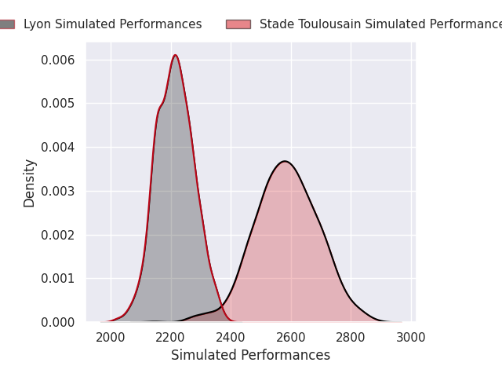
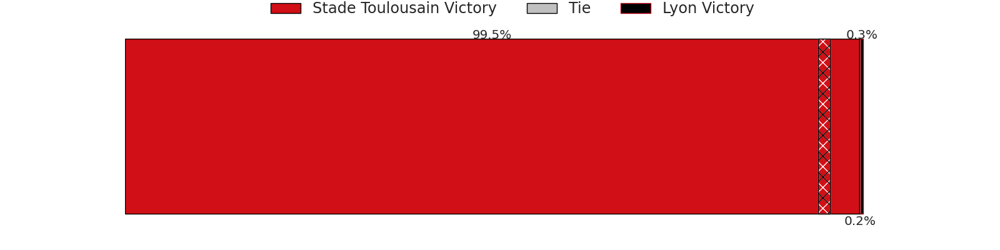
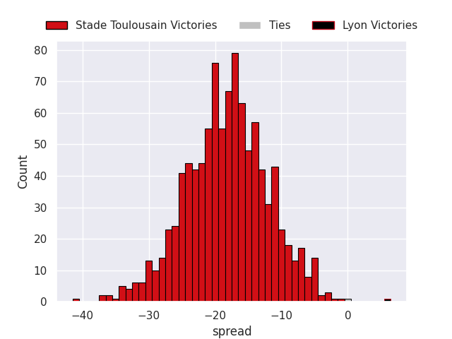

### Montpellier Herault V Pau on 2026/05/30

Average Margin: Montpellier Herault by 11.9

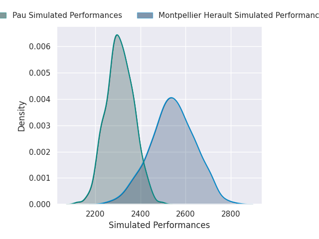
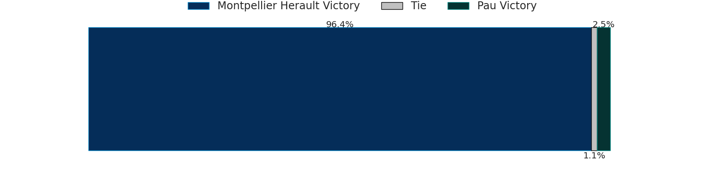
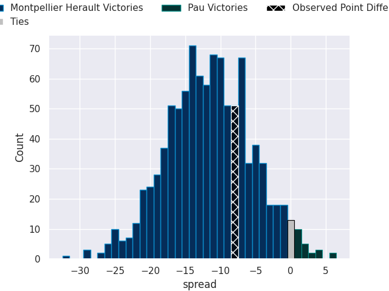

### US Montauban V La Rochelle on 2026/05/30

Average Margin: La Rochelle by 15.6

### Stade Francais Paris V Bayonne on 2026/05/30

Average Margin: Stade Francais Paris by 15.0

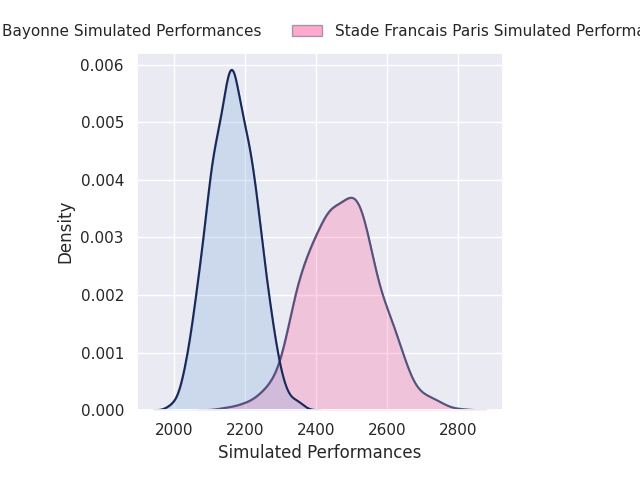
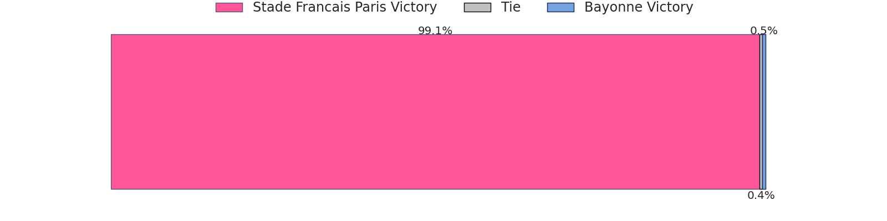
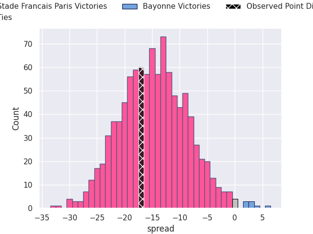

### Perpignan V Castres Olympique on 2026/05/30

Average Margin: Perpignan by 3.3

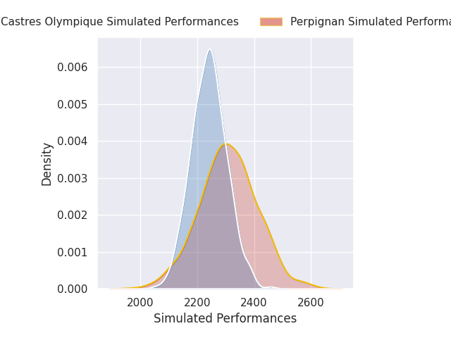
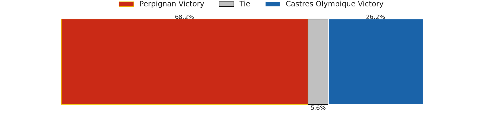
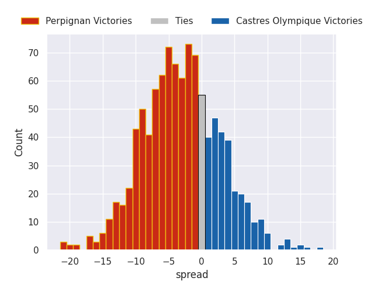

## Week 28

### Racing 92 V Stade Toulousain on 2026/06/06

Average Margin: Stade Toulousain by 2.2

### Bordeaux Begles V Clermont Auvergne on 2026/06/06

Average Margin: Bordeaux Begles by 13.4

### Pau V US Montauban on 2026/06/06

Average Margin: Pau by 26.2

### Bayonne V Perpignan on 2026/06/06

Average Margin: Bayonne by 6.2

### La Rochelle V Stade Francais Paris on 2026/06/06

Average Margin: La Rochelle by 6.4

### Lyon V Montpellier Herault on 2026/06/06

Average Margin: Montpellier Herault by 2.3

### Castres Olympique V Toulon on 2026/06/06

Average Margin: Castres Olympique by 4.8

