# Team Rankings

# Standings

## Current Standings

| Club                 |   Played |   Wins |   Point Differential |   Losing Bonus Points |   Try Bonus Points |   Competition Points |
|:---------------------|---------:|-------:|---------------------:|----------------------:|-------------------:|---------------------:|
| Stade Toulousain     |       23 |     17 |                  395 |                     3 |                 16 |                   87 |
| Montpellier Herault  |       23 |     14 |                  223 |                     5 |                 11 |                   74 |
| Pau                  |       23 |     15 |                  119 |                     3 |                 10 |                   73 |
| Stade Francais Paris |       23 |     13 |                  145 |                     5 |                 13 |                   72 |
| Clermont Auvergne    |       23 |     14 |                  134 |                     3 |                 11 |                   70 |
| Bordeaux Begles      |       23 |     13 |                  106 |                     4 |                 12 |                   68 |
| Racing 92            |       23 |     13 |                   51 |                     2 |                 10 |                   66 |
| La Rochelle          |       24 |     12 |                  101 |                     4 |                  9 |                   63 |
| Toulon               |       24 |     11 |                  -79 |                     1 |                 10 |                   59 |
| Lyon                 |       23 |     10 |                  -36 |                     3 |                  8 |                   53 |
| Castres Olympique    |       23 |     10 |                 -103 |                     6 |                  7 |                   53 |
| Bayonne              |       23 |     10 |                 -143 |                     3 |                  7 |                   50 |
| Perpignan            |       23 |      5 |                 -199 |                     6 |                  5 |                   31 |
| US Montauban         |       23 |      1 |                 -714 |                     2 |                  5 |                   13 |

## Projected Remaining Table

| Club                 |   To Play |   Projected Wins |   Projected Differential |   Projected Losing Bonus Points | Projected Try Bonus Points   |   Projected Competition Points |
|:---------------------|----------:|-----------------:|-------------------------:|--------------------------------:|:-----------------------------|-------------------------------:|
| Pau                  |         4 |            2.379 |                   22.849 |                           0.664 |                              |                         10.418 |
| Bordeaux Begles      |         3 |            2.44  |                   32.227 |                           0.387 |                              |                         10.307 |
| Stade Toulousain     |         3 |            2.209 |                   24.022 |                           0.536 |                              |                          9.646 |
| La Rochelle          |         3 |            2.216 |                   19.335 |                           0.527 |                              |                          9.611 |
| Montpellier Herault  |         3 |            2.131 |                   14.32  |                           0.606 |                              |                          9.388 |
| Stade Francais Paris |         3 |            2.145 |                   24.926 |                           0.403 |                              |                          9.075 |
| Castres Olympique    |         3 |            1.413 |                    0.26  |                           1.021 |                              |                          7.025 |
| Perpignan            |         4 |            1.173 |                  -24.403 |                           1.036 |                              |                          6.042 |
| Racing 92            |         3 |            1.154 |                   -5.45  |                           0.94  |                              |                          5.83  |
| Lyon                 |         3 |            1.238 |                  -12.512 |                           0.524 |                              |                          5.622 |
| Toulon               |         3 |            0.854 |                   -9.918 |                           1.232 |                              |                          4.952 |
| Clermont Auvergne    |         3 |            0.955 |                  -12.66  |                           0.638 |                              |                          4.634 |
| Bayonne              |         3 |            0.951 |                  -16.554 |                           0.506 |                              |                          4.424 |
| US Montauban         |         3 |            0.009 |                  -56.442 |                           0.233 |                              |                          0.279 |

## Projected Total Table

| Club                 |   Played |   Wins |   Point Differential |   Losing Bonus Points |   Try Bonus Points |   Competition Points |
|:---------------------|---------:|-------:|---------------------:|----------------------:|-------------------:|---------------------:|
| Stade Toulousain     |       26 | 19.209 |              419.022 |                 3.536 |                 16 |               96.646 |
| Pau                  |       27 | 17.379 |              141.849 |                 3.664 |                 10 |               83.418 |
| Montpellier Herault  |       26 | 16.131 |              237.32  |                 5.606 |                 11 |               83.388 |
| Stade Francais Paris |       26 | 15.145 |              169.926 |                 5.403 |                 13 |               81.075 |
| Bordeaux Begles      |       26 | 15.44  |              138.227 |                 4.387 |                 12 |               78.307 |
| Clermont Auvergne    |       26 | 14.955 |              121.34  |                 3.638 |                 11 |               74.634 |
| La Rochelle          |       27 | 14.216 |              120.335 |                 4.527 |                  9 |               72.611 |
| Racing 92            |       26 | 14.154 |               45.55  |                 2.94  |                 10 |               71.83  |
| Toulon               |       27 | 11.854 |              -88.918 |                 2.232 |                 10 |               63.952 |
| Castres Olympique    |       26 | 11.413 |             -102.74  |                 7.021 |                  7 |               60.025 |
| Lyon                 |       26 | 11.238 |              -48.512 |                 3.524 |                  8 |               58.622 |
| Bayonne              |       26 | 10.951 |             -159.554 |                 3.506 |                  7 |               54.424 |
| Perpignan            |       27 |  6.173 |             -223.403 |                 7.036 |                  5 |               37.042 |
| US Montauban         |       26 |  1.009 |             -770.442 |                 2.233 |                  5 |               13.279 |

# Completed Match Review

| Model | Percent Correct Predictions | Spread Error |
| ------ | ------ | ------ |
| Club Level | 76.6% | 13.0 |
| Player Level: Lineup | nan% | nan |
| Player Level: Minutes | nan% | nan |

# Future Predictions

## Week 25

### Perpignan V Pau on 2026/02/14

Average Margin: Pau by 0.2

## Week 26

### Castres Olympique V Montpellier Herault on 2026/05/16

Average Margin: Montpellier Herault by 1.4

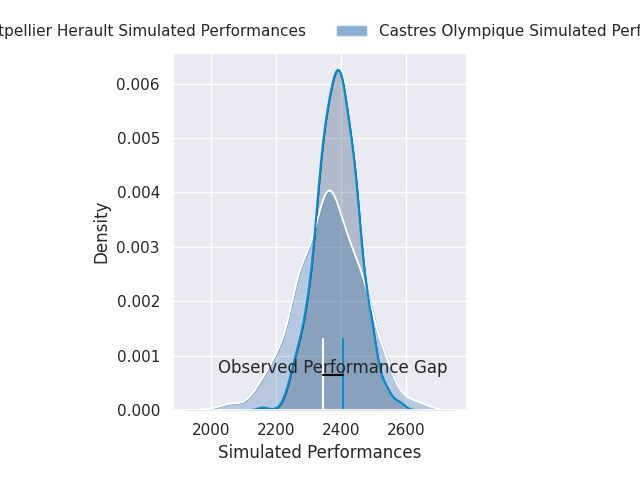
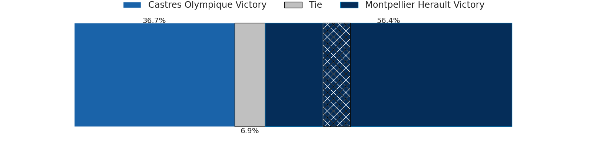
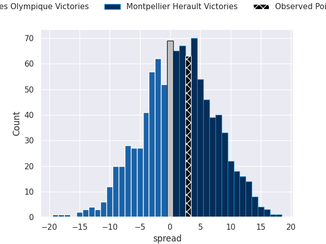

### Lyon V Bayonne on 2026/05/16

Average Margin: Lyon by 8.8

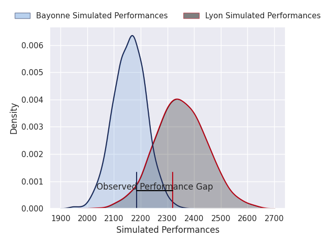
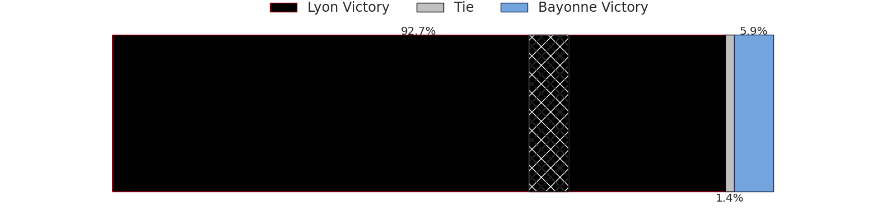
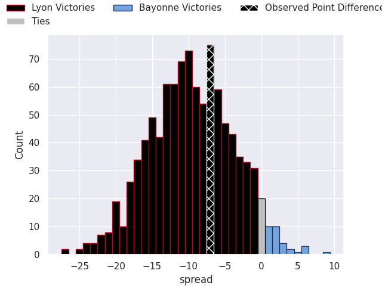

### US Montauban V Stade Francais Paris on 2026/05/16

Average Margin: Stade Francais Paris by 15.8

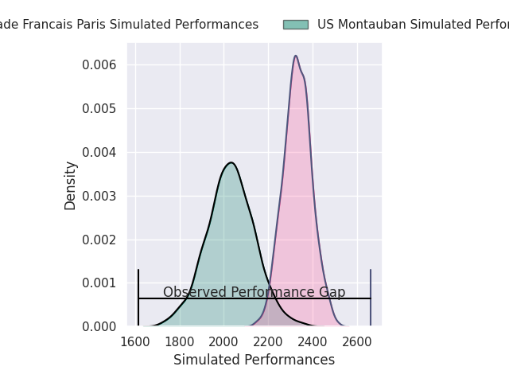
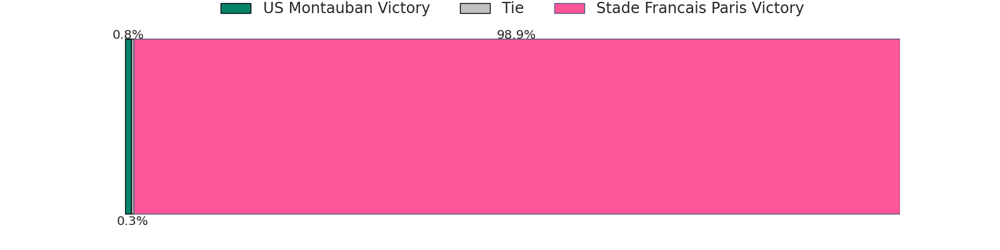
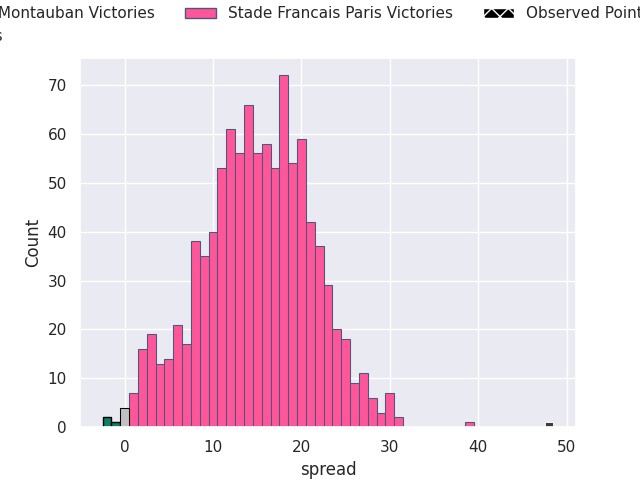

### Pau V Clermont Auvergne on 2026/05/16

Average Margin: Pau by 7.0

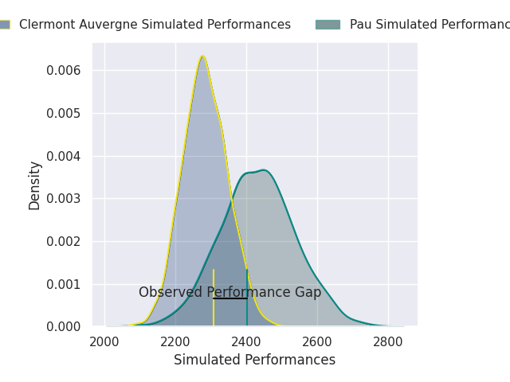
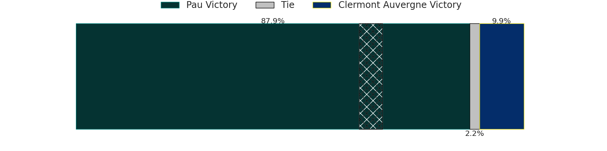
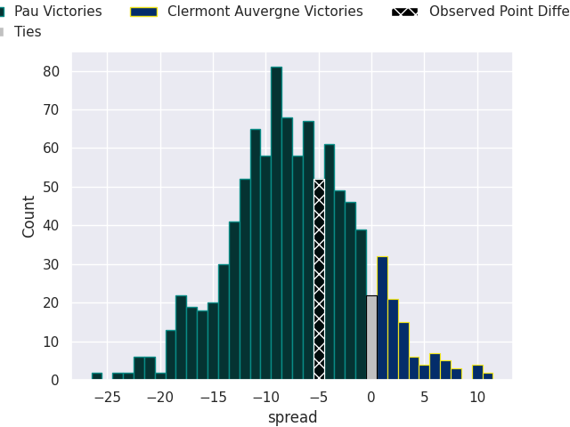

### Bordeaux Begles V Perpignan on 2026/05/15

Average Margin: Bordeaux Begles by 19.4

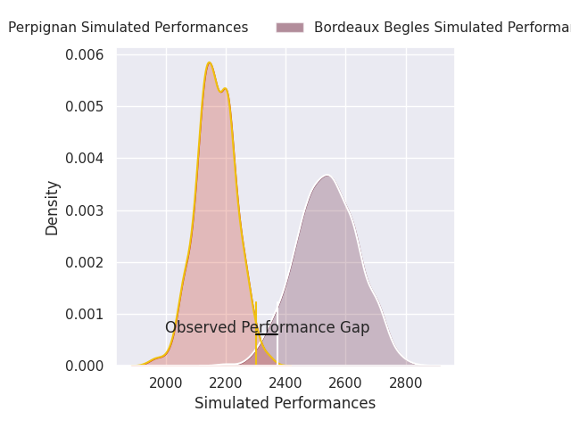
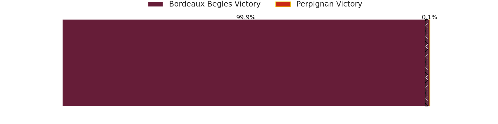
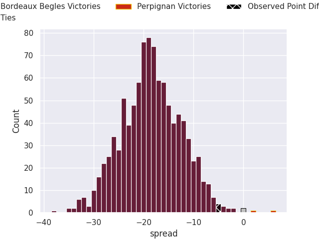

### Racing 92 V Toulon on 2026/05/16

Average Margin: Racing 92 by 5.6

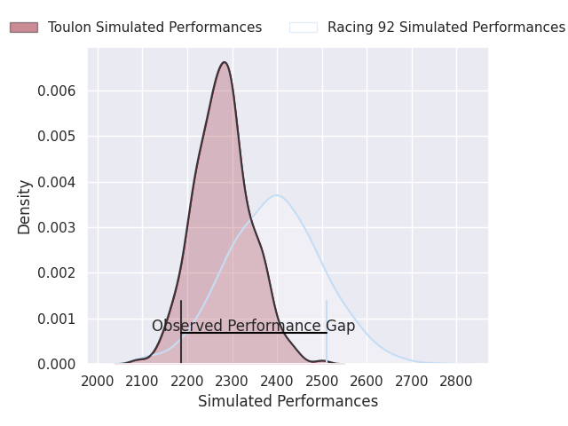
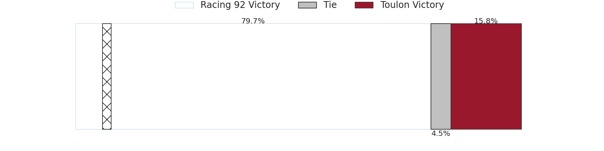
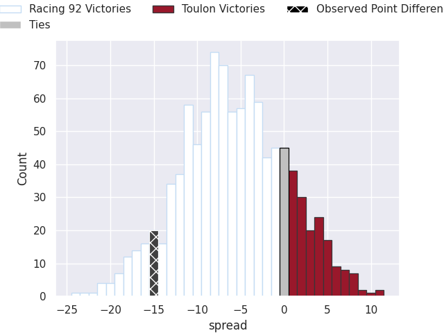

### La Rochelle V Stade Toulousain on 2026/05/17

Average Margin: Stade Toulousain by 0.8

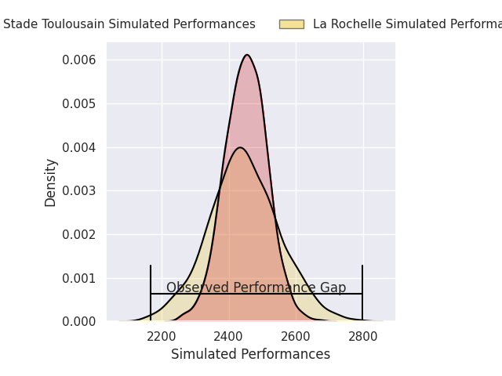

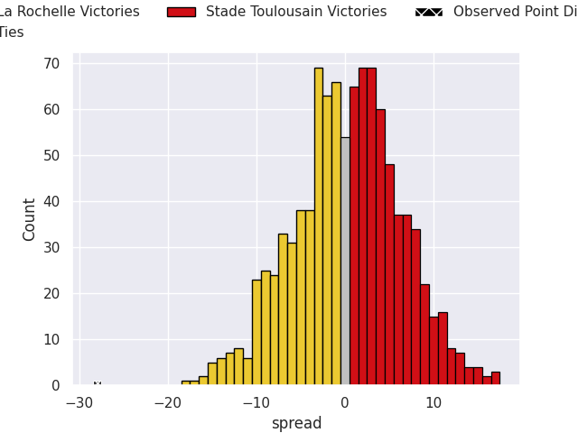

## Week 27

### Montpellier Herault V Pau on 2026/05/29

Average Margin: Montpellier Herault by 10.9

### Stade Francais Paris V Bayonne on 2026/05/29

Average Margin: Stade Francais Paris by 15.1

### Perpignan V Castres Olympique on 2026/05/29

Average Margin: Perpignan by 2.5

### Stade Toulousain V Lyon on 2026/05/29

Average Margin: Stade Toulousain by 19.3

### US Montauban V La Rochelle on 2026/05/29

Average Margin: La Rochelle by 14.2

### Clermont Auvergne V Racing 92 on 2026/05/29

Average Margin: Clermont Auvergne by 7.0

### Toulon V Bordeaux Begles on 2026/05/29

Average Margin: Bordeaux Begles by 0.2

## Week 28

### Lyon V Montpellier Herault on 2026/06/06

Average Margin: Montpellier Herault by 2.1

### Racing 92 V Stade Toulousain on 2026/06/06

Average Margin: Stade Toulousain by 4.0

### La Rochelle V Stade Francais Paris on 2026/06/06

Average Margin: La Rochelle by 5.9

### Pau V US Montauban on 2026/06/06

Average Margin: Pau by 26.5

### Bayonne V Perpignan on 2026/06/06

Average Margin: Bayonne by 7.4

### Bordeaux Begles V Clermont Auvergne on 2026/06/06

Average Margin: Bordeaux Begles by 12.7

### Castres Olympique V Toulon on 2026/06/06

Average Margin: Castres Olympique by 4.2

