# Team Rankings

# Standings

## Current Standings

| Club                 |   Played |   Wins |   Point Differential |   Losing Bonus Points |   Try Bonus Points |   Competition Points |
|:---------------------|---------:|-------:|---------------------:|----------------------:|-------------------:|---------------------:|
| Stade Toulousain     |       17 |     13 |                  310 |                     2 |                 12 |                   66 |
| Pau                  |       16 |     11 |                   75 |                     2 |                  8 |                   54 |
| Bordeaux Begles      |       17 |     10 |                  130 |                     3 |                 10 |                   53 |
| Montpellier Herault  |       17 |      9 |                  147 |                     5 |                  7 |                   50 |
| Clermont Auvergne    |       17 |     10 |                  106 |                     2 |                  8 |                   50 |
| Racing 92            |       17 |     10 |                  -20 |                     1 |                  7 |                   50 |
| Stade Francais Paris |       17 |      8 |                   44 |                     5 |                  9 |                   48 |
| Toulon               |       18 |      9 |                  -71 |                     1 |                  8 |                   47 |
| Castres Olympique    |       17 |      9 |                  -65 |                     4 |                  6 |                   46 |
| La Rochelle          |       18 |      7 |                   59 |                     4 |                  8 |                   42 |
| Lyon                 |       17 |      8 |                   19 |                     2 |                  6 |                   40 |
| Bayonne              |       17 |      8 |                 -105 |                     2 |                  4 |                   38 |
| Perpignan            |       16 |      3 |                 -162 |                     4 |                  3 |                   19 |
| US Montauban         |       17 |      1 |                 -467 |                     2 |                  4 |                   12 |

## Projected Remaining Table

| Club                 |   To Play |   Projected Wins |   Projected Differential |   Projected Losing Bonus Points | Projected Try Bonus Points   |   Projected Competition Points |
|:---------------------|----------:|-----------------:|-------------------------:|--------------------------------:|:-----------------------------|-------------------------------:|
| Stade Toulousain     |         9 |            5.617 |                   46.696 |                           1.718 |                              |                         24.96  |
| Bordeaux Begles      |         9 |            5.354 |                   27.69  |                           1.896 |                              |                         24.188 |
| Stade Francais Paris |         9 |            5.416 |                   29.995 |                           1.695 |                              |                         24.119 |
| Pau                  |        10 |            5.098 |                   11.86  |                           2.304 |                              |                         23.628 |
| Montpellier Herault  |         9 |            4.61  |                   17.579 |                           1.915 |                              |                         21.087 |
| Toulon               |         9 |            4.438 |                    6.596 |                           2.327 |                              |                         20.959 |
| La Rochelle          |         9 |            4.397 |                    4.302 |                           2.365 |                              |                         20.939 |
| Castres Olympique    |         9 |            4.357 |                    7.753 |                           2.321 |                              |                         20.593 |
| Clermont Auvergne    |         9 |            4.345 |                   -3.992 |                           1.718 |                              |                         19.88  |
| Racing 92            |         9 |            4.053 |                   -7.552 |                           2.173 |                              |                         19.239 |
| Lyon                 |         9 |            3.845 |                  -13.888 |                           2.175 |                              |                         18.389 |
| Perpignan            |        10 |            3.748 |                  -34.961 |                           2.313 |                              |                         18.211 |
| Bayonne              |         9 |            3.586 |                  -17.891 |                           2.254 |                              |                         17.444 |
| US Montauban         |         9 |            2.234 |                  -74.187 |                           1.9   |                              |                         11.438 |

## Projected Total Table

| Club                 |   Played |   Wins |   Point Differential |   Losing Bonus Points |   Try Bonus Points |   Competition Points |
|:---------------------|---------:|-------:|---------------------:|----------------------:|-------------------:|---------------------:|
| Stade Toulousain     |       26 | 18.617 |              356.696 |                 3.718 |                 12 |               90.96  |
| Pau                  |       26 | 16.098 |               86.86  |                 4.304 |                  8 |               77.628 |
| Bordeaux Begles      |       26 | 15.354 |              157.69  |                 4.896 |                 10 |               77.188 |
| Stade Francais Paris |       26 | 13.416 |               73.995 |                 6.695 |                  9 |               72.119 |
| Montpellier Herault  |       26 | 13.61  |              164.579 |                 6.915 |                  7 |               71.087 |
| Clermont Auvergne    |       26 | 14.345 |              102.008 |                 3.718 |                  8 |               69.88  |
| Racing 92            |       26 | 14.053 |              -27.552 |                 3.173 |                  7 |               69.239 |
| Toulon               |       27 | 13.438 |              -64.404 |                 3.327 |                  8 |               67.959 |
| Castres Olympique    |       26 | 13.357 |              -57.247 |                 6.321 |                  6 |               66.593 |
| La Rochelle          |       27 | 11.397 |               63.302 |                 6.365 |                  8 |               62.939 |
| Lyon                 |       26 | 11.845 |                5.112 |                 4.175 |                  6 |               58.389 |
| Bayonne              |       26 | 11.586 |             -122.891 |                 4.254 |                  4 |               55.444 |
| Perpignan            |       26 |  6.748 |             -196.961 |                 6.313 |                  3 |               37.211 |
| US Montauban         |       26 |  3.234 |             -541.187 |                 3.9   |                  4 |               23.438 |

# Completed Match Review

| Model | Percent Correct Predictions | Spread Error |
| ------ | ------ | ------ |
| Club Level | 72.7% | 11.9 |
| Player Level: Lineup | nan% | nan |
| Player Level: Minutes | nan% | nan |

# Future Predictions

## Week 19

### Perpignan V Pau on 2026/02/14

Average Margin: Perpignan by 0.4

## Week 20

### Stade Toulousain V US Montauban on 2026/02/27

Average Margin: Stade Toulousain by 17.0

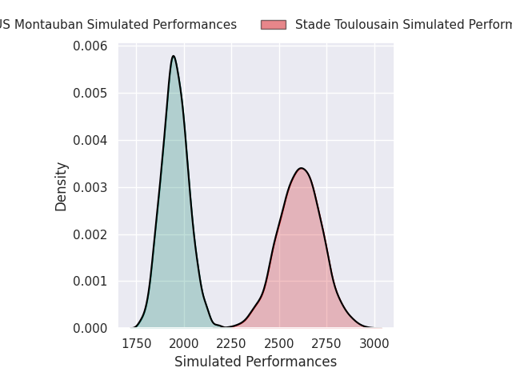
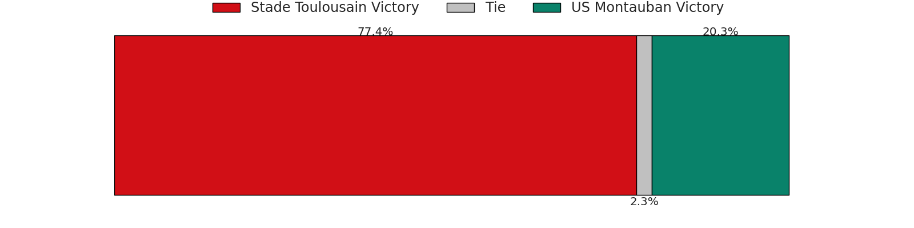
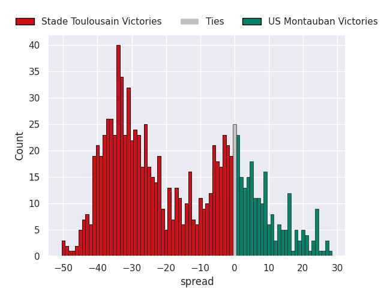

### Castres Olympique V La Rochelle on 2026/02/27

Average Margin: Castres Olympique by 2.9

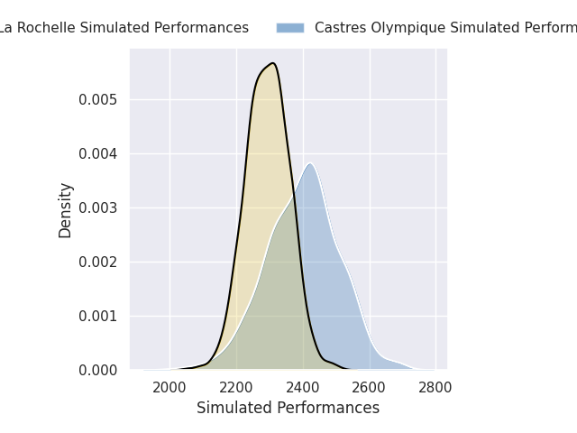
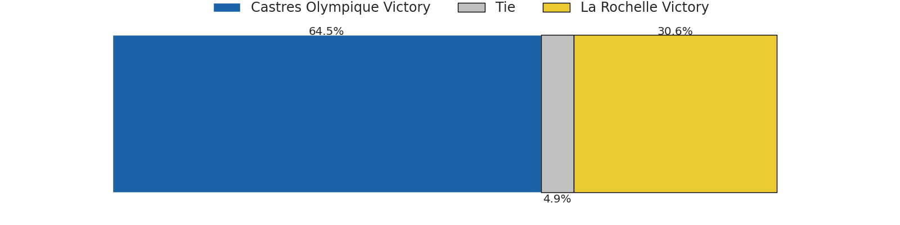
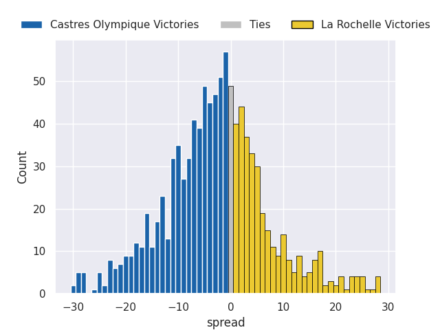

### Lyon V Toulon on 2026/02/27

Average Margin: Lyon by 0.7

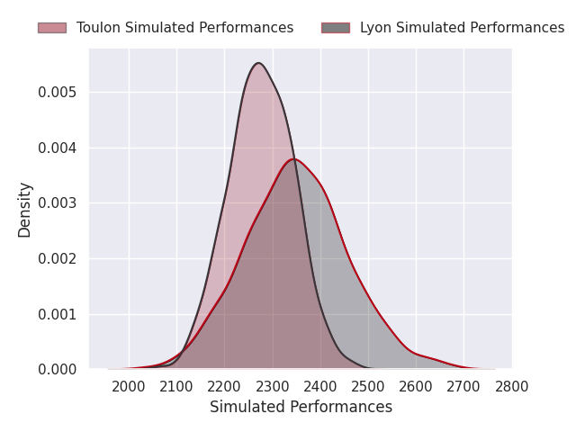
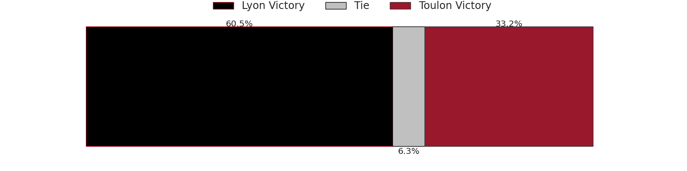
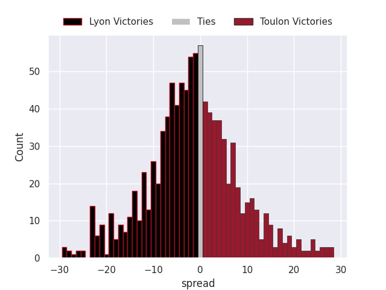

### Stade Francais Paris V Perpignan on 2026/02/27

Average Margin: Stade Francais Paris by 9.0

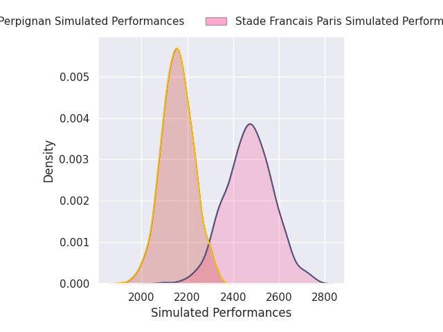
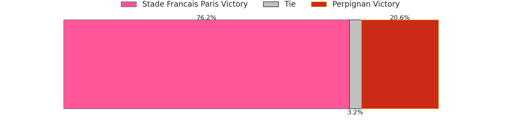
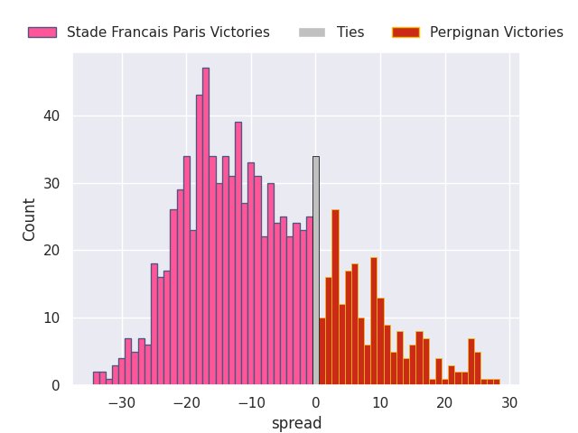

### Montpellier Herault V Racing 92 on 2026/02/27

Average Margin: Montpellier Herault by 7.4

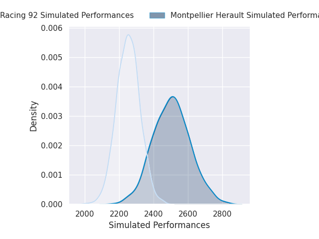

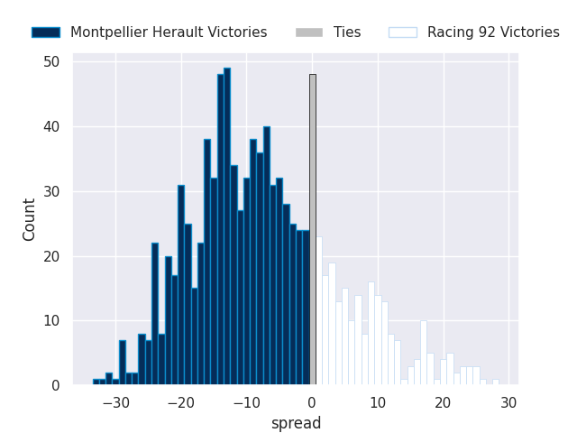

### Clermont Auvergne V Bayonne on 2026/02/27

Average Margin: Clermont Auvergne by 5.1

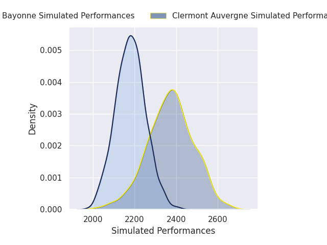
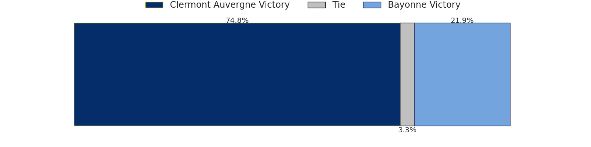
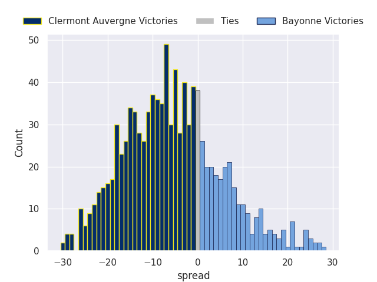

### Pau V Bordeaux Begles on 2026/02/27

Average Margin: Pau by 0.2

## Week 21

### Clermont Auvergne V Montpellier Herault on 2026/03/20

Average Margin: Clermont Auvergne by 1.6

### Racing 92 V Castres Olympique on 2026/03/20

Average Margin: Racing 92 by 2.0

### La Rochelle V Pau on 2026/03/20

Average Margin: La Rochelle by 2.9

### US Montauban V Bayonne on 2026/03/20

Average Margin: Bayonne by 2.8

### Perpignan V Lyon on 2026/03/20

Average Margin: Perpignan by 1.7

### Bordeaux Begles V Stade Toulousain on 2026/03/20

Average Margin: Bordeaux Begles by 2.1

### Toulon V Stade Francais Paris on 2026/03/20

Average Margin: Toulon by 2.4

## Week 22

### Perpignan V Toulon on 2026/03/27

Average Margin: Perpignan by 0.3

### Pau V Racing 92 on 2026/03/27

Average Margin: Pau by 5.0

### Castres Olympique V US Montauban on 2026/03/27

Average Margin: Castres Olympique by 11.2

### Lyon V Bordeaux Begles on 2026/03/27

Average Margin: Bordeaux Begles by 1.6

### Stade Francais Paris V Clermont Auvergne on 2026/03/27

Average Margin: Stade Francais Paris by 5.4

### Stade Toulousain V Montpellier Herault on 2026/03/27

Average Margin: Stade Toulousain by 7.2

### Bayonne V La Rochelle on 2026/03/27

Average Margin: Bayonne by 0.7

## Week 23

### US Montauban V Toulon on 2026/04/17

Average Margin: Toulon by 4.8

### Bayonne V Pau on 2026/04/17

Average Margin: Bayonne by 0.8

### Racing 92 V Stade Francais Paris on 2026/04/17

Average Margin: Racing 92 by 0.4

### Castres Olympique V Stade Toulousain on 2026/04/17

Average Margin: Stade Toulousain by 2.2

### La Rochelle V Bordeaux Begles on 2026/04/17

Average Margin: La Rochelle by 0.2

### Montpellier Herault V Perpignan on 2026/04/17

Average Margin: Montpellier Herault by 9.1

### Clermont Auvergne V Lyon on 2026/04/17

Average Margin: Clermont Auvergne by 5.3

## Week 24

### Lyon V Castres Olympique on 2026/04/24

Average Margin: Lyon by 2.5

### US Montauban V Racing 92 on 2026/04/24

Average Margin: Racing 92 by 4.6

### Stade Francais Paris V Pau on 2026/04/24

Average Margin: Stade Francais Paris by 4.2

### Toulon V Bayonne on 2026/04/24

Average Margin: Toulon by 6.7

### Perpignan V La Rochelle on 2026/04/24

Average Margin: Perpignan by 0.7

### Bordeaux Begles V Montpellier Herault on 2026/04/24

Average Margin: Bordeaux Begles by 5.5

### Stade Toulousain V Clermont Auvergne on 2026/04/24

Average Margin: Stade Toulousain by 9.2

## Week 25

### Racing 92 V La Rochelle on 2026/05/08

Average Margin: Racing 92 by 2.2

### Stade Francais Paris V Lyon on 2026/05/08

Average Margin: Stade Francais Paris by 5.2

### Clermont Auvergne V Perpignan on 2026/05/08

Average Margin: Clermont Auvergne by 6.6

### Bayonne V Bordeaux Begles on 2026/05/08

Average Margin: Bordeaux Begles by 2.3

### Pau V Castres Olympique on 2026/05/08

Average Margin: Pau by 4.1

### Montpellier Herault V US Montauban on 2026/05/08

Average Margin: Montpellier Herault by 13.4

### Toulon V Stade Toulousain on 2026/05/08

Average Margin: Stade Toulousain by 1.0

## Week 26

### La Rochelle V Stade Toulousain on 2026/05/15

Average Margin: Stade Toulousain by 0.2

### Bordeaux Begles V Perpignan on 2026/05/15

Average Margin: Bordeaux Begles by 9.7

### US Montauban V Stade Francais Paris on 2026/05/15

Average Margin: Stade Francais Paris by 5.0

### Castres Olympique V Montpellier Herault on 2026/05/15

Average Margin: Castres Olympique by 1.8

### Racing 92 V Toulon on 2026/05/15

Average Margin: Racing 92 by 2.2

### Lyon V Bayonne on 2026/05/15

Average Margin: Lyon by 5.0

### Pau V Clermont Auvergne on 2026/05/15

Average Margin: Pau by 4.6

## Week 27

### Clermont Auvergne V Racing 92 on 2026/05/29

Average Margin: Clermont Auvergne by 4.0

### Montpellier Herault V Pau on 2026/05/29

Average Margin: Montpellier Herault by 4.9

### Perpignan V Castres Olympique on 2026/05/29

Average Margin: Perpignan by 0.8

### Toulon V Bordeaux Begles on 2026/05/29

Average Margin: Toulon by 0.5

### US Montauban V La Rochelle on 2026/05/29

Average Margin: La Rochelle by 4.3

### Stade Toulousain V Lyon on 2026/05/29

Average Margin: Stade Toulousain by 9.4

### Stade Francais Paris V Bayonne on 2026/05/29

Average Margin: Stade Francais Paris by 7.6

## Week 28

### Pau V US Montauban on 2026/06/06

Average Margin: Pau by 11.2

### Racing 92 V Stade Toulousain on 2026/06/06

Average Margin: Stade Toulousain by 2.5

### La Rochelle V Stade Francais Paris on 2026/06/06

Average Margin: La Rochelle by 3.6

### Bordeaux Begles V Clermont Auvergne on 2026/06/06

Average Margin: Bordeaux Begles by 7.3

### Lyon V Montpellier Herault on 2026/06/06

Average Margin: Lyon by 1.2

### Bayonne V Perpignan on 2026/06/06

Average Margin: Bayonne by 4.5

### Castres Olympique V Toulon on 2026/06/06

Average Margin: Castres Olympique by 3.5

