# Team Rankings

# Standings

## Current Standings

| Club                 |   Played |   Wins |   Point Differential |   Losing Bonus Points |   Try Bonus Points |   Competition Points |
|:---------------------|---------:|-------:|---------------------:|----------------------:|-------------------:|---------------------:|
| Stade Toulousain     |       21 |     16 |                  374 |                     2 |                 15 |                   81 |
| Pau                  |       21 |     14 |                  109 |                     2 |                 10 |                   68 |
| Montpellier Herault  |       21 |     12 |                  169 |                     5 |                 10 |                   65 |
| Stade Francais Paris |       21 |     11 |                  101 |                     5 |                 12 |                   63 |
| Bordeaux Begles      |       21 |     12 |                  106 |                     3 |                 11 |                   62 |
| Clermont Auvergne    |       21 |     12 |                  100 |                     3 |                 10 |                   61 |
| Racing 92            |       21 |     12 |                    4 |                     1 |                  9 |                   60 |
| La Rochelle          |       22 |     10 |                   97 |                     4 |                  9 |                   55 |
| Toulon               |       22 |     10 |                  -81 |                     1 |                  9 |                   54 |
| Castres Olympique    |       21 |     10 |                  -86 |                     5 |                  7 |                   52 |
| Lyon                 |       21 |      9 |                    1 |                     3 |                  7 |                   48 |
| Bayonne              |       21 |     10 |                 -115 |                     2 |                  5 |                   47 |
| Perpignan            |       21 |      5 |                 -166 |                     5 |                  5 |                   30 |
| US Montauban         |       21 |      1 |                 -613 |                     2 |                  5 |                   13 |

## Projected Remaining Table

| Club                 |   To Play |   Projected Wins |   Projected Differential |   Projected Losing Bonus Points | Projected Try Bonus Points   |   Projected Competition Points |
|:---------------------|----------:|-----------------:|-------------------------:|--------------------------------:|:-----------------------------|-------------------------------:|
| Bordeaux Begles      |         5 |            4.217 |                   48.464 |                           0.538 |                              |                         17.67  |
| Stade Toulousain     |         5 |            3.966 |                   45.294 |                           0.73  |                              |                         16.93  |
| Stade Francais Paris |         5 |            4.029 |                   43.962 |                           0.499 |                              |                         16.803 |
| Pau                  |         6 |            3.343 |                   22.075 |                           1.104 |                              |                         14.782 |
| Montpellier Herault  |         5 |            3.092 |                   35.3   |                           0.999 |                              |                         13.751 |
| La Rochelle          |         5 |            2.806 |                   12.689 |                           1.353 |                              |                         13.067 |
| Racing 92            |         5 |            2.824 |                   10.319 |                           1.225 |                              |                         12.903 |
| Toulon               |         5 |            2.023 |                   -2.446 |                           1.707 |                              |                         10.231 |
| Lyon                 |         5 |            2.093 |                  -18.145 |                           0.838 |                              |                          9.506 |
| Perpignan            |         6 |            1.749 |                  -34.77  |                           1.538 |                              |                          9.042 |
| Castres Olympique    |         5 |            1.679 |                  -13.263 |                           1.75  |                              |                          8.99  |
| Clermont Auvergne    |         5 |            1.916 |                  -20.494 |                           0.699 |                              |                          8.517 |
| Bayonne              |         5 |            1.091 |                  -34.022 |                           1.143 |                              |                          5.699 |
| US Montauban         |         5 |            0.049 |                  -94.963 |                           0.471 |                              |                          0.703 |

## Projected Total Table

| Club                 |   Played |   Wins |   Point Differential |   Losing Bonus Points |   Try Bonus Points |   Competition Points |
|:---------------------|---------:|-------:|---------------------:|----------------------:|-------------------:|---------------------:|
| Stade Toulousain     |       26 | 19.966 |              419.294 |                 2.73  |                 15 |               97.93  |
| Pau                  |       27 | 17.343 |              131.075 |                 3.104 |                 10 |               82.782 |
| Stade Francais Paris |       26 | 15.029 |              144.962 |                 5.499 |                 12 |               79.803 |
| Bordeaux Begles      |       26 | 16.217 |              154.464 |                 3.538 |                 11 |               79.67  |
| Montpellier Herault  |       26 | 15.092 |              204.3   |                 5.999 |                 10 |               78.751 |
| Racing 92            |       26 | 14.824 |               14.319 |                 2.225 |                  9 |               72.903 |
| Clermont Auvergne    |       26 | 13.916 |               79.506 |                 3.699 |                 10 |               69.517 |
| La Rochelle          |       27 | 12.806 |              109.689 |                 5.353 |                  9 |               68.067 |
| Toulon               |       27 | 12.023 |              -83.446 |                 2.707 |                  9 |               64.231 |
| Castres Olympique    |       26 | 11.679 |              -99.263 |                 6.75  |                  7 |               60.99  |
| Lyon                 |       26 | 11.093 |              -17.145 |                 3.838 |                  7 |               57.506 |
| Bayonne              |       26 | 11.091 |             -149.022 |                 3.143 |                  5 |               52.699 |
| Perpignan            |       27 |  6.749 |             -200.77  |                 6.538 |                  5 |               39.042 |
| US Montauban         |       26 |  1.049 |             -707.963 |                 2.471 |                  5 |               13.703 |

# Completed Match Review

| Model | Percent Correct Predictions | Spread Error |
| ------ | ------ | ------ |
| Club Level | 76.6% | 12.4 |
| Player Level: Lineup | nan% | nan |
| Player Level: Minutes | nan% | nan |

# Future Predictions

## Week 23

### Perpignan V Pau on 2026/02/14

Average Margin: Perpignan by 0.2

## Week 24

### Stade Francais Paris V Pau on 2026/04/25

Average Margin: Stade Francais Paris by 7.9

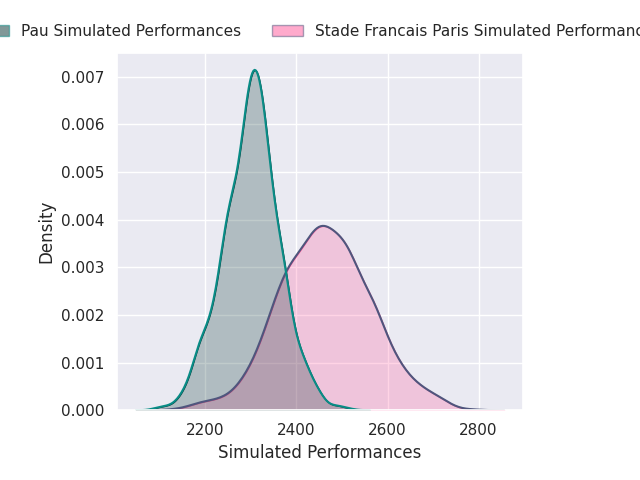
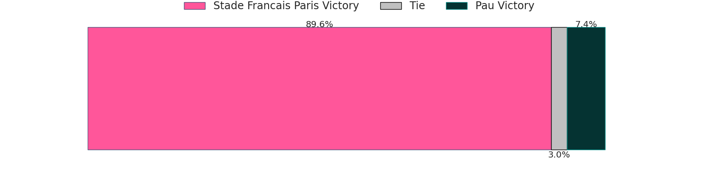
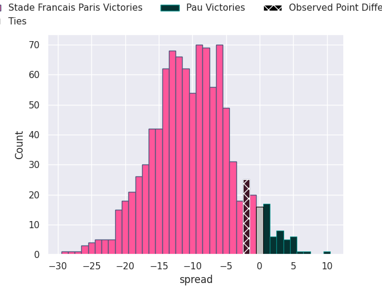

### Bordeaux Begles V Montpellier Herault on 2026/04/24

Average Margin: Bordeaux Begles by 8.7

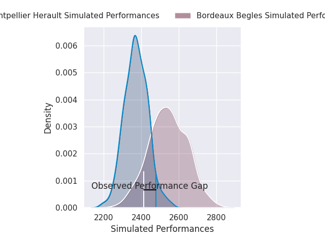
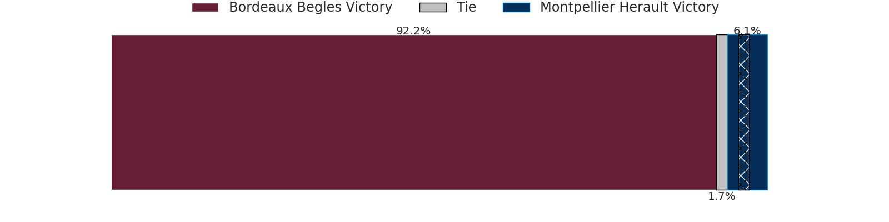
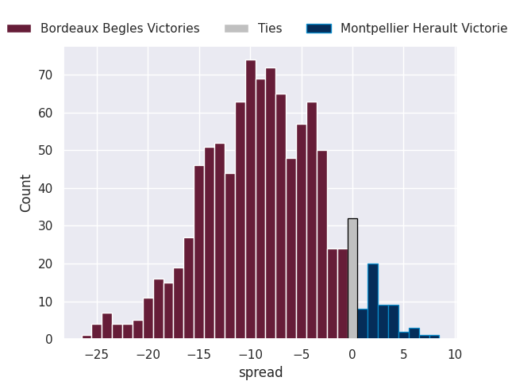

### Perpignan V La Rochelle on 2026/04/25

Average Margin: Perpignan by 0.3

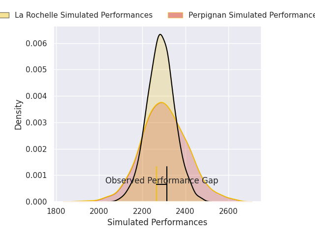

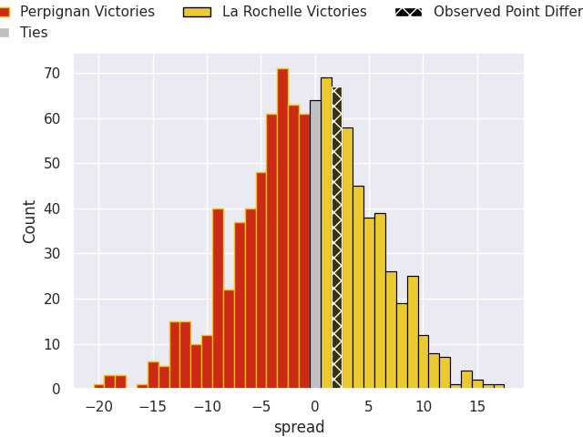

### Toulon V Bayonne on 2026/04/25

Average Margin: Toulon by 11.6

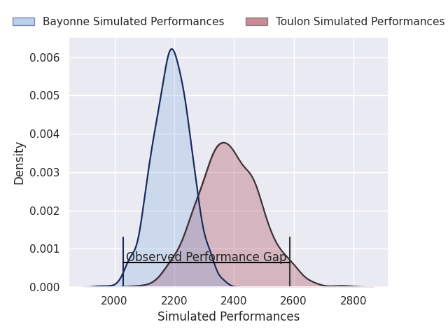
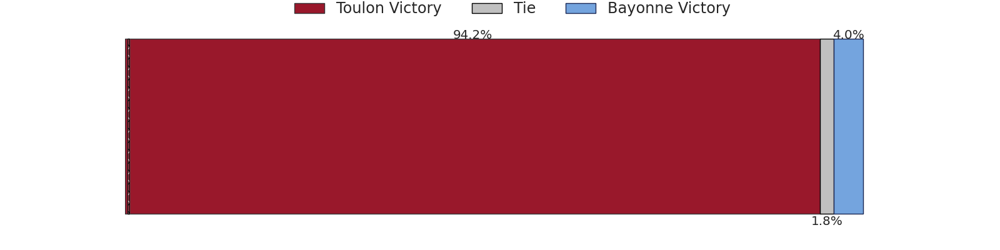
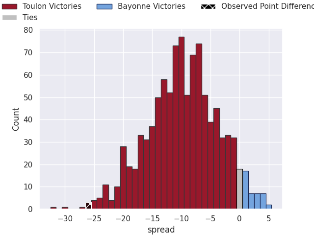

### Lyon V Castres Olympique on 2026/04/25

Average Margin: Lyon by 5.1

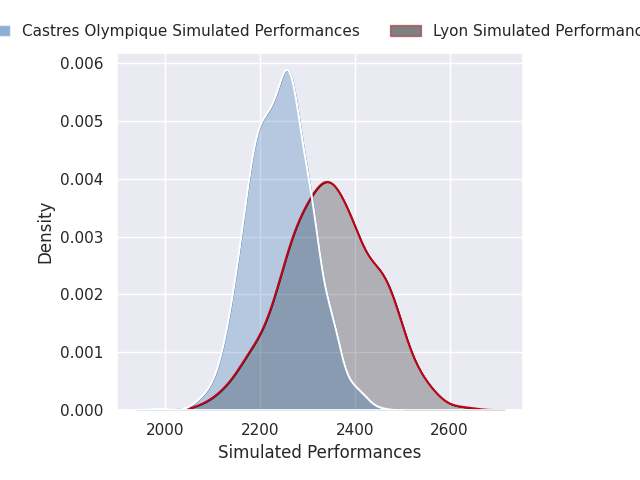
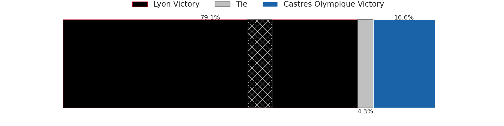
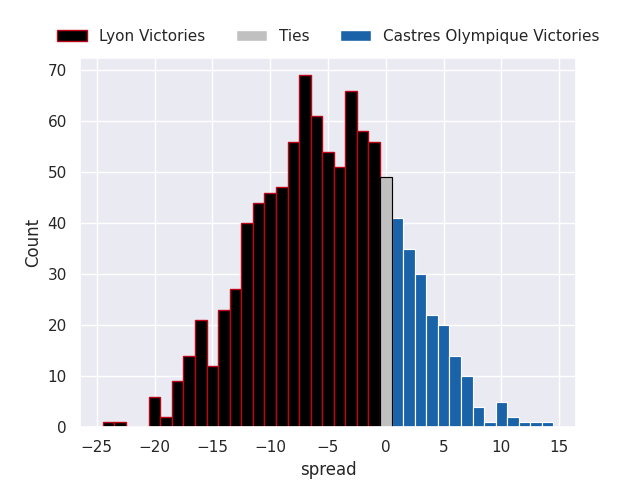

### US Montauban V Racing 92 on 2026/04/25

Average Margin: Racing 92 by 11.6

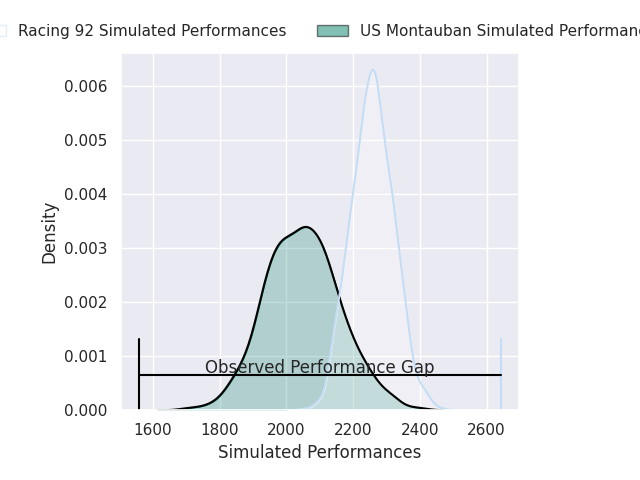
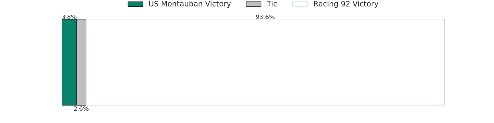
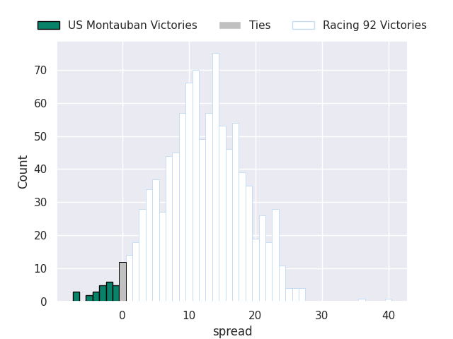

### Stade Toulousain V Clermont Auvergne on 2026/04/26

Average Margin: Stade Toulousain by 17.0

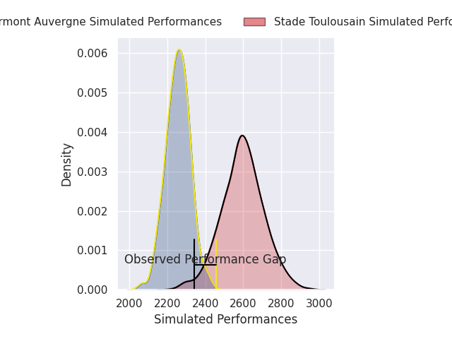
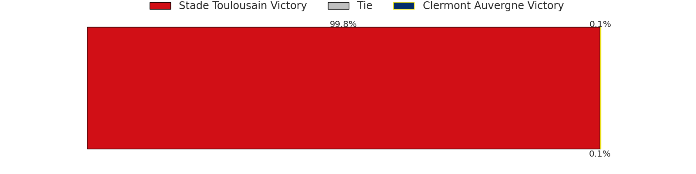
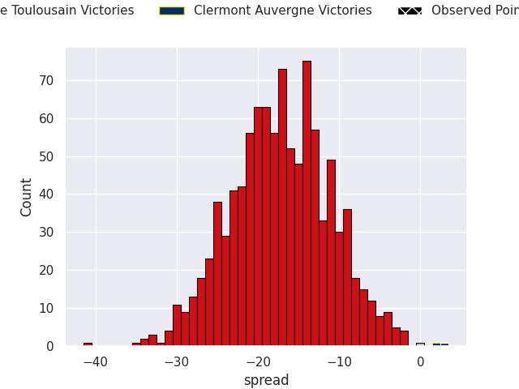

## Week 25

### Toulon V Stade Toulousain on 2026/05/08

Average Margin: Stade Toulousain by 3.1

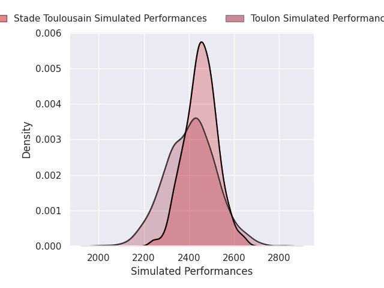

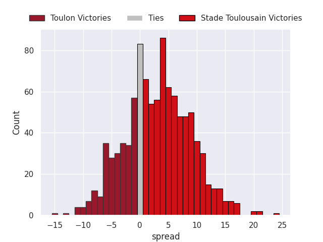

### Racing 92 V La Rochelle on 2026/05/08

Average Margin: Racing 92 by 3.9

### Bayonne V Bordeaux Begles on 2026/05/08

Average Margin: Bordeaux Begles by 5.7

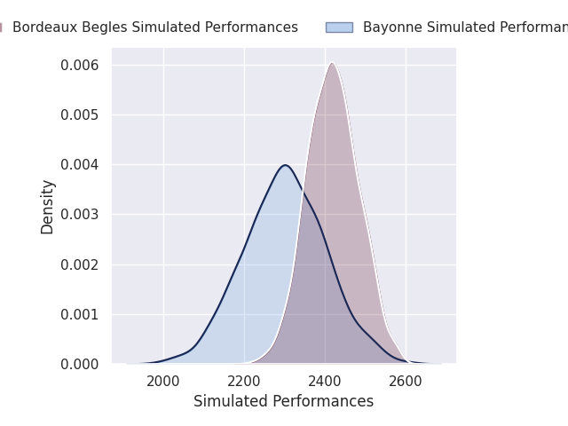
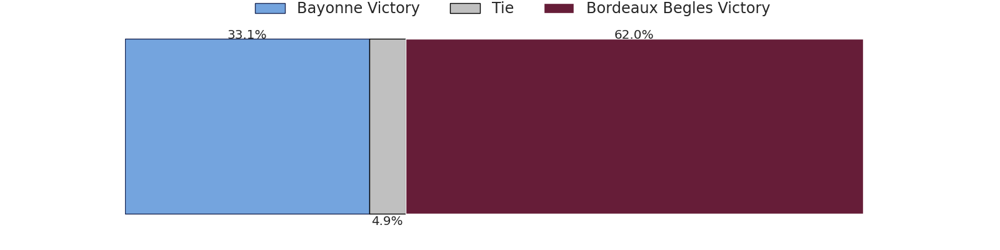

### Stade Francais Paris V Lyon on 2026/05/08

Average Margin: Stade Francais Paris by 12.0

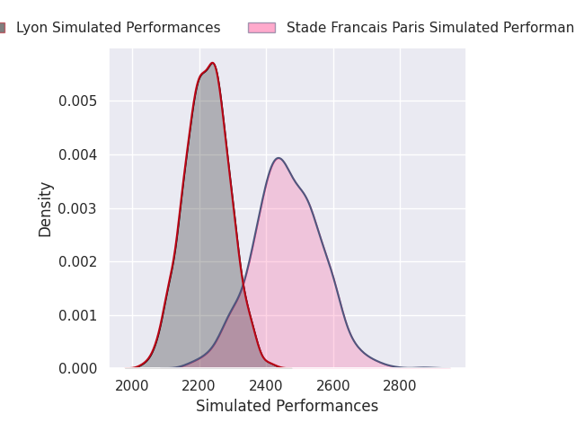
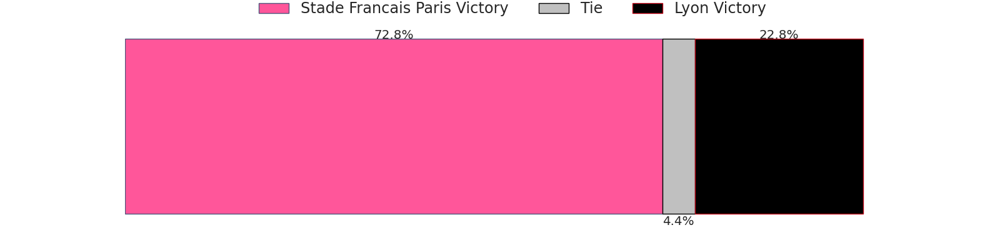
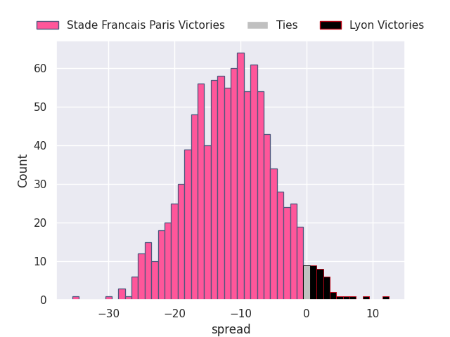

### Pau V Castres Olympique on 2026/05/08

Average Margin: Pau by 8.7

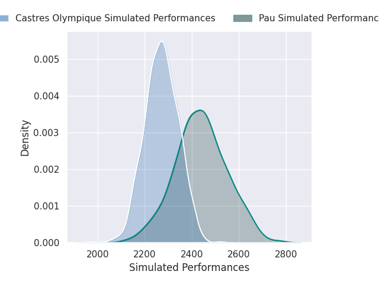
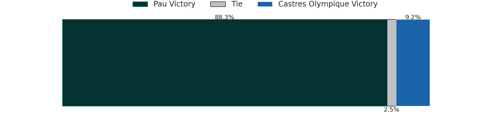
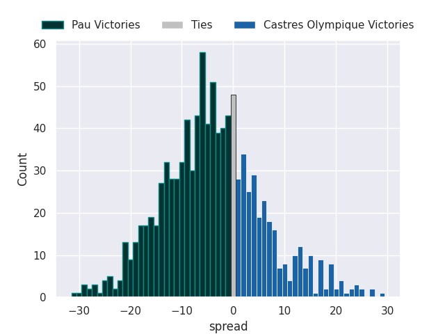

### Montpellier Herault V US Montauban on 2026/05/08

Average Margin: Montpellier Herault by 30.3

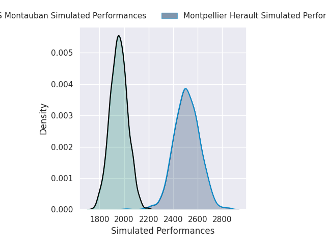
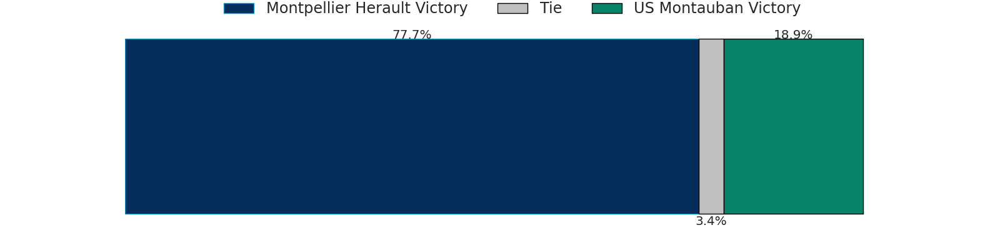
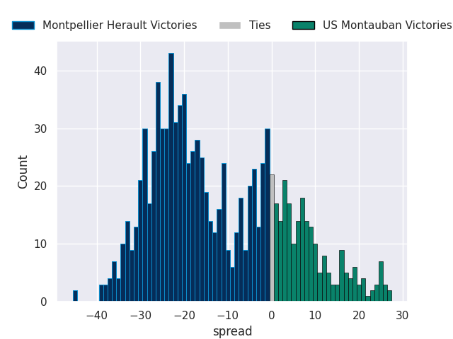

### Clermont Auvergne V Perpignan on 2026/05/08

Average Margin: Clermont Auvergne by 11.8

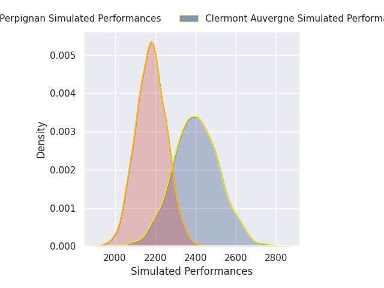

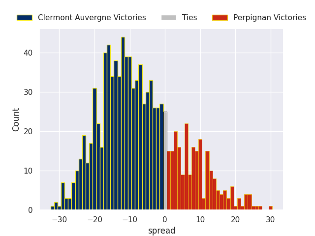

## Week 26

### Bordeaux Begles V Perpignan on 2026/05/15

Average Margin: Bordeaux Begles by 19.4

### Lyon V Bayonne on 2026/05/15

Average Margin: Lyon by 9.3

### La Rochelle V Stade Toulousain on 2026/05/15

Average Margin: Stade Toulousain by 1.4

### Castres Olympique V Montpellier Herault on 2026/05/15

Average Margin: Montpellier Herault by 1.2

### Racing 92 V Toulon on 2026/05/15

Average Margin: Racing 92 by 5.6

### Pau V Clermont Auvergne on 2026/05/15

Average Margin: Pau by 7.5

### US Montauban V Stade Francais Paris on 2026/05/15

Average Margin: Stade Francais Paris by 14.9

## Week 27

### Clermont Auvergne V Racing 92 on 2026/05/29

Average Margin: Clermont Auvergne by 6.3

### US Montauban V La Rochelle on 2026/05/29

Average Margin: La Rochelle by 13.1

### Perpignan V Castres Olympique on 2026/05/29

Average Margin: Perpignan by 3.0

### Stade Francais Paris V Bayonne on 2026/05/29

Average Margin: Stade Francais Paris by 14.4

### Montpellier Herault V Pau on 2026/05/29

Average Margin: Montpellier Herault by 11.2

### Stade Toulousain V Lyon on 2026/05/29

Average Margin: Stade Toulousain by 19.1

### Toulon V Bordeaux Begles on 2026/05/29

Average Margin: Bordeaux Begles by 0.6

## Week 28

### Bayonne V Perpignan on 2026/06/06

Average Margin: Bayonne by 7.0

### Lyon V Montpellier Herault on 2026/06/06

Average Margin: Montpellier Herault by 1.4

### Racing 92 V Stade Toulousain on 2026/06/06

Average Margin: Stade Toulousain by 4.6

### La Rochelle V Stade Francais Paris on 2026/06/06

Average Margin: La Rochelle by 5.3

### Pau V US Montauban on 2026/06/06

Average Margin: Pau by 25.1

### Castres Olympique V Toulon on 2026/06/06

Average Margin: Castres Olympique by 4.7

### Bordeaux Begles V Clermont Auvergne on 2026/06/06

Average Margin: Bordeaux Begles by 14.1

