# Team Rankings

# Standings

## Current Standings

| Club                 |   Played |   Wins |   Point Differential |   Losing Bonus Points |   Try Bonus Points |   Competition Points |
|:---------------------|---------:|-------:|---------------------:|----------------------:|-------------------:|---------------------:|
| Stade Toulousain     |       18 |     14 |                  365 |                     2 |                 12 |                   70 |
| Pau                  |       17 |     12 |                   97 |                     2 |                  8 |                   58 |
| Montpellier Herault  |       18 |     10 |                  171 |                     5 |                  7 |                   54 |
| Clermont Auvergne    |       18 |     11 |                  129 |                     2 |                  8 |                   54 |
| Bordeaux Begles      |       18 |     10 |                  108 |                     3 |                 10 |                   53 |
| Stade Francais Paris |       18 |      9 |                   65 |                     5 |                  9 |                   52 |
| Racing 92            |       18 |     10 |                  -44 |                     1 |                  7 |                   50 |
| Toulon               |       19 |      9 |                  -71 |                     1 |                  8 |                   49 |
| Castres Olympique    |       18 |      9 |                  -70 |                     5 |                  6 |                   47 |
| La Rochelle          |       19 |      8 |                   64 |                     4 |                  8 |                   46 |
| Lyon                 |       18 |      8 |                   19 |                     2 |                  6 |                   42 |
| Bayonne              |       18 |      8 |                 -128 |                     2 |                  4 |                   38 |
| Perpignan            |       17 |      3 |                 -183 |                     4 |                  3 |                   19 |
| US Montauban         |       18 |      1 |                 -522 |                     2 |                  4 |                   12 |

## Projected Remaining Table

| Club                 |   To Play |   Projected Wins |   Projected Differential |   Projected Losing Bonus Points | Projected Try Bonus Points   |   Projected Competition Points |
|:---------------------|----------:|-----------------:|-------------------------:|--------------------------------:|:-----------------------------|-------------------------------:|
| Stade Toulousain     |         8 |            4.916 |                   30.66  |                           1.542 |                              |                         21.918 |
| Pau                  |         9 |            4.655 |                   13.626 |                           2.007 |                              |                         21.467 |
| Bordeaux Begles      |         8 |            4.722 |                   23.325 |                           1.692 |                              |                         21.398 |
| Stade Francais Paris |         8 |            4.718 |                   23.744 |                           1.555 |                              |                         21.103 |
| La Rochelle          |         8 |            4.168 |                    9.181 |                           2.032 |                              |                         19.636 |
| Toulon               |         8 |            4.102 |                    9.326 |                           2.042 |                              |                         19.208 |
| Montpellier Herault  |         8 |            4.014 |                   14.257 |                           1.726 |                              |                         18.45  |
| Racing 92            |         8 |            3.783 |                   -1.241 |                           1.988 |                              |                         17.906 |
| Castres Olympique    |         8 |            3.697 |                    3.781 |                           2.109 |                              |                         17.619 |
| Clermont Auvergne    |         8 |            3.684 |                   -7.142 |                           1.554 |                              |                         16.932 |
| Perpignan            |         9 |            3.407 |                  -27.546 |                           2.249 |                              |                         16.707 |
| Lyon                 |         8 |            3.329 |                  -14.061 |                           1.925 |                              |                         15.929 |
| Bayonne              |         8 |            3.203 |                  -17.411 |                           1.946 |                              |                         15.504 |
| US Montauban         |         8 |            2     |                  -60.499 |                           1.763 |                              |                         10.353 |

## Projected Total Table

| Club                 |   Played |   Wins |   Point Differential |   Losing Bonus Points |   Try Bonus Points |   Competition Points |
|:---------------------|---------:|-------:|---------------------:|----------------------:|-------------------:|---------------------:|
| Stade Toulousain     |       26 | 18.916 |              395.66  |                 3.542 |                 12 |               91.918 |
| Pau                  |       26 | 16.655 |              110.626 |                 4.007 |                  8 |               79.467 |
| Bordeaux Begles      |       26 | 14.722 |              131.325 |                 4.692 |                 10 |               74.398 |
| Stade Francais Paris |       26 | 13.718 |               88.744 |                 6.555 |                  9 |               73.103 |
| Montpellier Herault  |       26 | 14.014 |              185.257 |                 6.726 |                  7 |               72.45  |
| Clermont Auvergne    |       26 | 14.684 |              121.858 |                 3.554 |                  8 |               70.932 |
| Toulon               |       27 | 13.102 |              -61.674 |                 3.042 |                  8 |               68.208 |
| Racing 92            |       26 | 13.783 |              -45.241 |                 2.988 |                  7 |               67.906 |
| La Rochelle          |       27 | 12.168 |               73.181 |                 6.032 |                  8 |               65.636 |
| Castres Olympique    |       26 | 12.697 |              -66.219 |                 7.109 |                  6 |               64.619 |
| Lyon                 |       26 | 11.329 |                4.939 |                 3.925 |                  6 |               57.929 |
| Bayonne              |       26 | 11.203 |             -145.411 |                 3.946 |                  4 |               53.504 |
| Perpignan            |       26 |  6.407 |             -210.546 |                 6.249 |                  3 |               35.707 |
| US Montauban         |       26 |  3     |             -582.499 |                 3.763 |                  4 |               22.353 |

# Completed Match Review

| Model | Percent Correct Predictions | Spread Error |
| ------ | ------ | ------ |
| Club Level | 67.2% | 12.4 |
| Player Level: Lineup | nan% | nan |
| Player Level: Minutes | nan% | nan |

# Future Predictions

## Week 20

### Perpignan V Pau on 2026/02/14

Average Margin: Perpignan by 0.3

## Week 21

### Perpignan V Lyon on 2026/03/20

Average Margin: Perpignan by 1.3

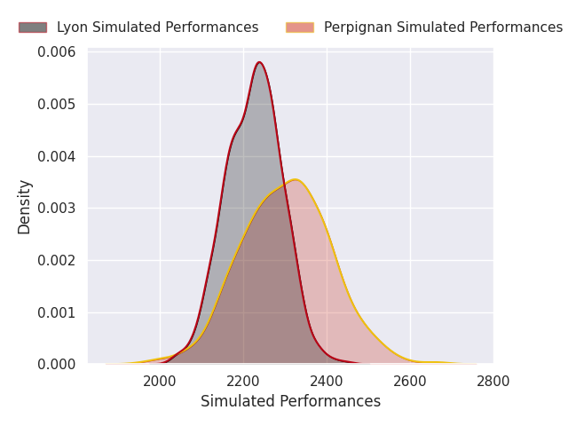

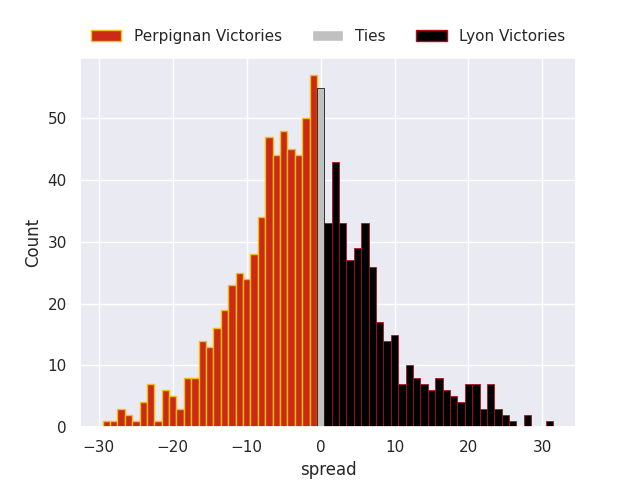

### La Rochelle V Pau on 2026/03/20

Average Margin: La Rochelle by 3.0

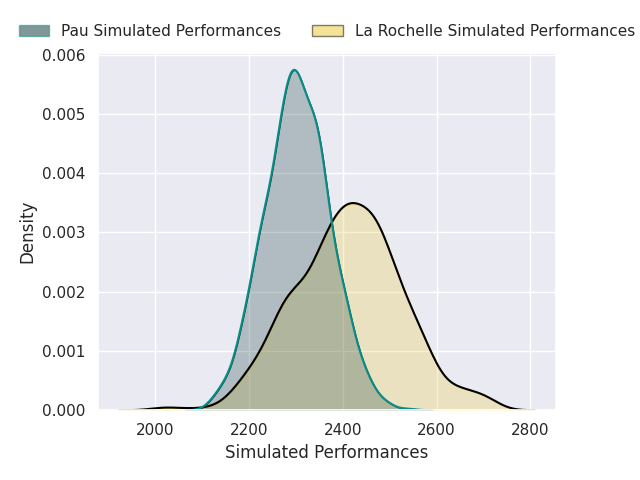
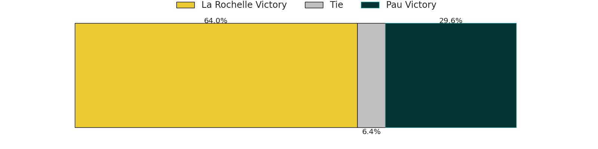
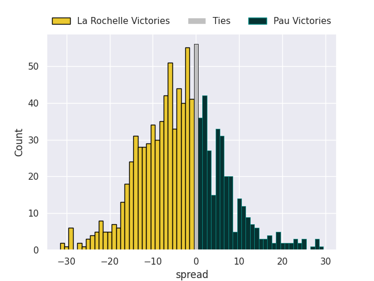

### Clermont Auvergne V Montpellier Herault on 2026/03/20

Average Margin: Clermont Auvergne by 1.5

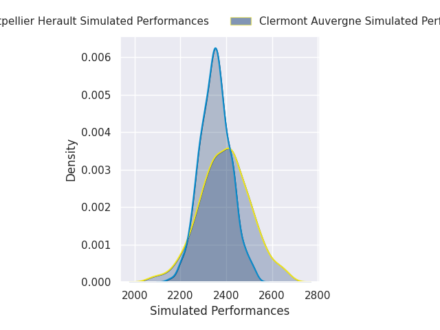
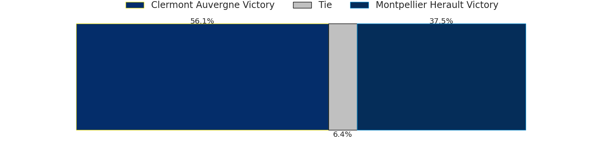
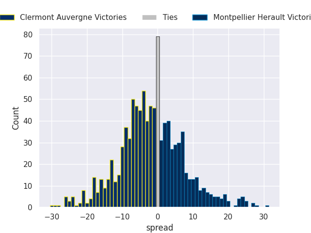

### Racing 92 V Castres Olympique on 2026/03/20

Average Margin: Racing 92 by 1.9

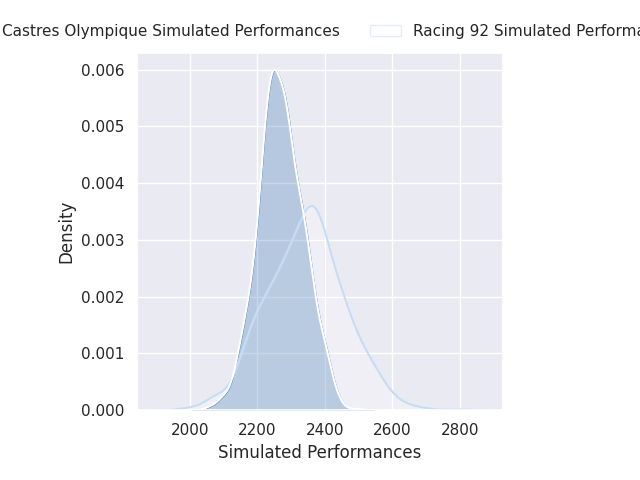
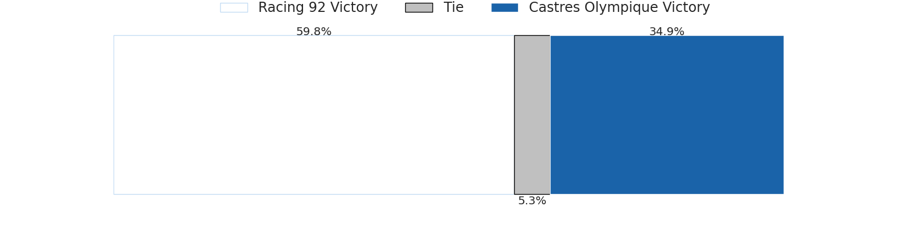
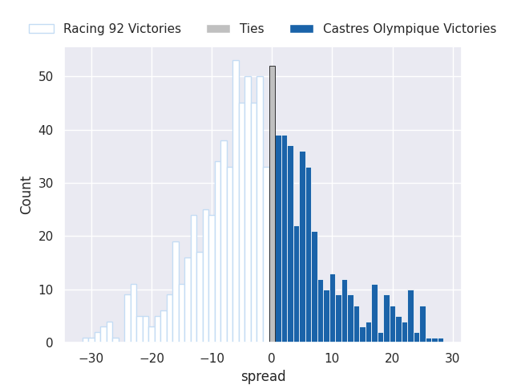

### US Montauban V Bayonne on 2026/03/20

Average Margin: Bayonne by 2.2

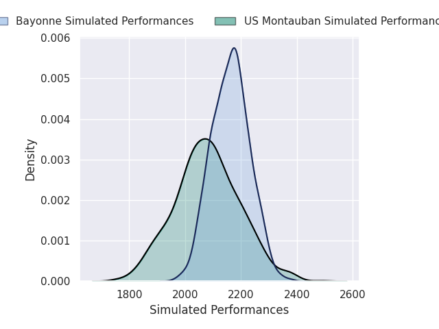
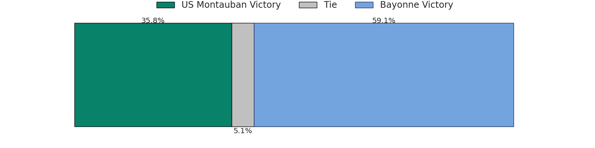
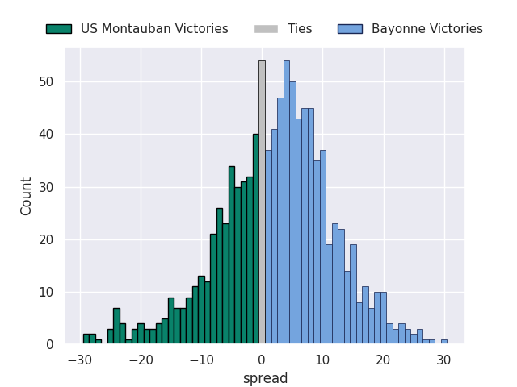

### Toulon V Stade Francais Paris on 2026/03/20

Average Margin: Toulon by 2.5

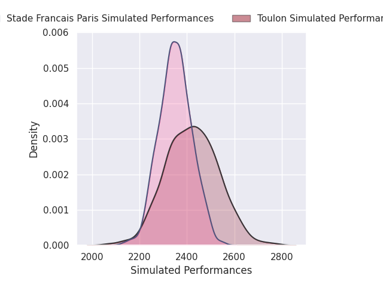

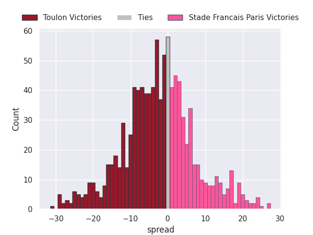

### Bordeaux Begles V Stade Toulousain on 2026/03/20

Average Margin: Bordeaux Begles by 1.4

## Week 22

### Stade Francais Paris V Clermont Auvergne on 2026/03/27

Average Margin: Stade Francais Paris by 5.4

### Lyon V Bordeaux Begles on 2026/03/27

Average Margin: Bordeaux Begles by 0.9

### Stade Toulousain V Montpellier Herault on 2026/03/27

Average Margin: Stade Toulousain by 6.8

### Pau V Racing 92 on 2026/03/27

Average Margin: Pau by 5.2

### Castres Olympique V US Montauban on 2026/03/27

Average Margin: Castres Olympique by 12.0

### Perpignan V Toulon on 2026/03/27

Average Margin: Toulon by 0.0

### Bayonne V La Rochelle on 2026/03/27

Average Margin: Bayonne by 0.6

## Week 23

### Bayonne V Pau on 2026/04/17

Average Margin: Pau by 1.1

### La Rochelle V Bordeaux Begles on 2026/04/17

Average Margin: La Rochelle by 1.0

### Clermont Auvergne V Lyon on 2026/04/17

Average Margin: Clermont Auvergne by 4.8

### Montpellier Herault V Perpignan on 2026/04/17

Average Margin: Montpellier Herault by 9.9

### Castres Olympique V Stade Toulousain on 2026/04/17

Average Margin: Stade Toulousain by 3.0

### Racing 92 V Stade Francais Paris on 2026/04/17

Average Margin: Racing 92 by 0.8

### US Montauban V Toulon on 2026/04/17

Average Margin: Toulon by 5.8

## Week 24

### US Montauban V Racing 92 on 2026/04/24

Average Margin: Racing 92 by 4.0

### Lyon V Castres Olympique on 2026/04/24

Average Margin: Lyon by 2.4

### Bordeaux Begles V Montpellier Herault on 2026/04/24

Average Margin: Bordeaux Begles by 4.6

### Stade Francais Paris V Pau on 2026/04/24

Average Margin: Stade Francais Paris by 4.7

### Toulon V Bayonne on 2026/04/24

Average Margin: Toulon by 7.5

### Stade Toulousain V Clermont Auvergne on 2026/04/24

Average Margin: Stade Toulousain by 8.8

### Perpignan V La Rochelle on 2026/04/24

Average Margin: La Rochelle by 0.2

## Week 25

### Clermont Auvergne V Perpignan on 2026/05/08

Average Margin: Clermont Auvergne by 6.5

### Bayonne V Bordeaux Begles on 2026/05/08

Average Margin: Bordeaux Begles by 2.3

### Pau V Castres Olympique on 2026/05/08

Average Margin: Pau by 4.9

### Stade Francais Paris V Lyon on 2026/05/08

Average Margin: Stade Francais Paris by 5.8

### Racing 92 V La Rochelle on 2026/05/08

Average Margin: Racing 92 by 1.8

### Toulon V Stade Toulousain on 2026/05/08

Average Margin: Stade Toulousain by 1.1

### Montpellier Herault V US Montauban on 2026/05/08

Average Margin: Montpellier Herault by 14.2

## Week 26

### Castres Olympique V Montpellier Herault on 2026/05/15

Average Margin: Castres Olympique by 1.2

### Racing 92 V Toulon on 2026/05/15

Average Margin: Racing 92 by 2.6

### US Montauban V Stade Francais Paris on 2026/05/15

Average Margin: Stade Francais Paris by 6.0

### Pau V Clermont Auvergne on 2026/05/15

Average Margin: Pau by 4.1

### Bordeaux Begles V Perpignan on 2026/05/15

Average Margin: Bordeaux Begles by 9.4

### La Rochelle V Stade Toulousain on 2026/05/15

Average Margin: Stade Toulousain by 0.2

### Lyon V Bayonne on 2026/05/15

Average Margin: Lyon by 5.3

## Week 27

### US Montauban V La Rochelle on 2026/05/29

Average Margin: La Rochelle by 4.8

### Toulon V Bordeaux Begles on 2026/05/29

Average Margin: Toulon by 0.6

### Clermont Auvergne V Racing 92 on 2026/05/29

Average Margin: Clermont Auvergne by 4.6

### Perpignan V Castres Olympique on 2026/05/29

Average Margin: Perpignan by 0.7

### Stade Francais Paris V Bayonne on 2026/05/29

Average Margin: Stade Francais Paris by 7.8

### Stade Toulousain V Lyon on 2026/05/29

Average Margin: Stade Toulousain by 9.6

### Montpellier Herault V Pau on 2026/05/29

Average Margin: Montpellier Herault by 5.2

## Week 28

### Lyon V Montpellier Herault on 2026/06/06

Average Margin: Lyon by 0.9

### Pau V US Montauban on 2026/06/06

Average Margin: Pau by 11.5

### La Rochelle V Stade Francais Paris on 2026/06/06

Average Margin: La Rochelle by 2.8

### Bordeaux Begles V Clermont Auvergne on 2026/06/06

Average Margin: Bordeaux Begles by 6.3

### Castres Olympique V Toulon on 2026/06/06

Average Margin: Castres Olympique by 3.4

### Bayonne V Perpignan on 2026/06/06

Average Margin: Bayonne by 3.8

### Racing 92 V Stade Toulousain on 2026/06/06

Average Margin: Stade Toulousain by 2.6

