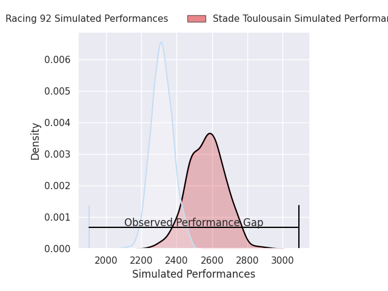
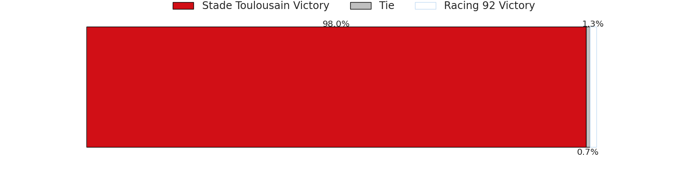
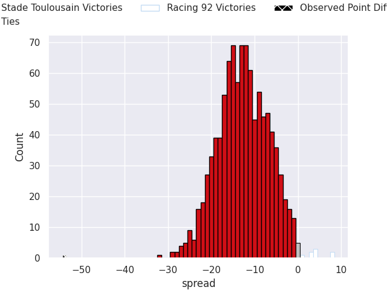

# Team Rankings

# Standings

## Current Standings

| Club                 |   Played |   Wins |   Point Differential |   Losing Bonus Points |   Try Bonus Points |   Competition Points |
|:---------------------|---------:|-------:|---------------------:|----------------------:|-------------------:|---------------------:|
| Stade Toulousain     |       26 |     18 |                  364 |                     3 |                 18 |                   93 |
| Stade Francais Paris |       27 |     16 |                  245 |                     6 |                 17 |                   89 |
| Montpellier Herault  |       26 |     17 |                  237 |                     5 |                 13 |                   88 |
| Racing 92            |       27 |     17 |                  107 |                     2 |                 13 |                   85 |
| Pau                  |       27 |     17 |                  150 |                     4 |                 12 |                   84 |
| La Rochelle          |       28 |     15 |                  150 |                     4 |                 12 |                   78 |
| Clermont Auvergne    |       26 |     15 |                  104 |                     4 |                 12 |                   76 |
| Bordeaux Begles      |       26 |     14 |                  103 |                     6 |                 14 |                   76 |
| Toulon               |       27 |     12 |                 -106 |                     1 |                 12 |                   65 |
| Castres Olympique    |       26 |     11 |                  -91 |                     8 |                 10 |                   62 |
| Lyon                 |       26 |     11 |                  -40 |                     4 |                 11 |                   61 |
| Bayonne              |       26 |     11 |                 -122 |                     4 |                  9 |                   57 |
| Perpignan            |       27 |      7 |                 -224 |                     7 |                  7 |                   42 |
| US Montauban         |       26 |      1 |                 -854 |                     2 |                  6 |                   14 |
| Provence Rugby       |        1 |      0 |                  -23 |                     0 |                    |                    0 |

## Projected Remaining Table

| Club                 |   To Play |   Projected Wins |   Projected Differential |   Projected Losing Bonus Points | Projected Try Bonus Points   |   Projected Competition Points |
|:---------------------|----------:|-----------------:|-------------------------:|--------------------------------:|:-----------------------------|-------------------------------:|
| Stade Toulousain     |         1 |            0.955 |                   11.244 |                           0.026 |                              |                          3.884 |
| Montpellier Herault  |         1 |            0.916 |                    8.794 |                           0.059 |                              |                          3.765 |
| Pau                  |         1 |            0.474 |                    0.18  |                           0.363 |                              |                          2.371 |
| Perpignan            |         1 |            0.47  |                   -0.18  |                           0.341 |                              |                          2.333 |
| Stade Francais Paris |         1 |            0.063 |                   -8.794 |                           0.321 |                              |                          0.615 |
| Racing 92            |         1 |            0.026 |                  -11.244 |                           0.218 |                              |                          0.36  |

## Projected Total Table

| Club                 |   Played |   Wins |   Point Differential |   Losing Bonus Points |   Try Bonus Points |   Competition Points |
|:---------------------|---------:|-------:|---------------------:|----------------------:|-------------------:|---------------------:|
| Stade Toulousain     |       27 | 18.955 |              375.244 |                 3.026 |                 18 |               96.884 |
| Montpellier Herault  |       27 | 17.916 |              245.794 |                 5.059 |                 13 |               91.765 |
| Stade Francais Paris |       28 | 16.063 |              236.206 |                 6.321 |                 17 |               89.615 |
| Pau                  |       28 | 17.474 |              150.18  |                 4.363 |                 12 |               86.371 |
| Racing 92            |       28 | 17.026 |               95.756 |                 2.218 |                 13 |               85.36  |
| La Rochelle          |       28 | 15     |              150     |                 4     |                 12 |               78     |
| Clermont Auvergne    |       26 | 15     |              104     |                 4     |                 12 |               76     |
| Bordeaux Begles      |       26 | 14     |              103     |                 6     |                 14 |               76     |
| Toulon               |       27 | 12     |             -106     |                 1     |                 12 |               65     |
| Castres Olympique    |       26 | 11     |              -91     |                 8     |                 10 |               62     |
| Lyon                 |       26 | 11     |              -40     |                 4     |                 11 |               61     |
| Bayonne              |       26 | 11     |             -122     |                 4     |                  9 |               57     |
| Perpignan            |       28 |  7.47  |             -224.18  |                 7.341 |                  7 |               44.333 |
| US Montauban         |       26 |  1     |             -854     |                 2     |                  6 |               14     |
| Provence Rugby       |        1 |  0     |              -23     |                 0     |                    |                0     |

# Completed Match Review

| Model | Percent Correct Predictions | Spread Error |
| ------ | ------ | ------ |
| Club Level | 75.7% | 14.0 |
| Player Level: Lineup | nan% | nan |
| Player Level: Minutes | nan% | nan |

# Future Predictions

## Week 29

### Perpignan V Pau on 2026/02/14

Average Margin: Pau by 0.2

## Week 30

### Stade Toulousain V Racing 92 on 2026/06/19

Average Margin: Stade Toulousain by 11.2

### Montpellier Herault V Stade Francais Paris on 2026/06/20

Average Margin: Montpellier Herault by 8.8

