# Team Rankings

# Standings

## Current Standings

| Club                 |   Played |   Wins |   Point Differential |   Losing Bonus Points |   Try Bonus Points |   Competition Points |
|:---------------------|---------:|-------:|---------------------:|----------------------:|-------------------:|---------------------:|
| Stade Toulousain     |       16 |     12 |                  306 |                     2 |                 12 |                   62 |
| Pau                  |       16 |     11 |                   75 |                     2 |                  8 |                   54 |
| Bordeaux Begles      |       16 |      9 |                  105 |                     3 |                 10 |                   49 |
| Stade Francais Paris |       16 |      8 |                   48 |                     4 |                  9 |                   47 |
| Toulon               |       17 |      9 |                  -51 |                     1 |                  8 |                   47 |
| Montpellier Herault  |       16 |      8 |                  137 |                     5 |                  7 |                   46 |
| Clermont Auvergne    |       16 |      9 |                   86 |                     2 |                  8 |                   46 |
| Racing 92            |       16 |      9 |                  -25 |                     1 |                  7 |                   46 |
| Castres Olympique    |       16 |      9 |                  -40 |                     4 |                  6 |                   46 |
| La Rochelle          |       17 |      7 |                   69 |                     4 |                  8 |                   42 |
| Bayonne              |       16 |      8 |                 -100 |                     1 |                  4 |                   37 |
| Lyon                 |       16 |      7 |                  -42 |                     2 |                  6 |                   36 |
| Perpignan            |       16 |      3 |                 -162 |                     4 |                  3 |                   19 |
| US Montauban         |       16 |      1 |                 -406 |                     2 |                  4 |                   12 |

## Projected Remaining Table

| Club                 |   To Play |   Projected Wins |   Projected Differential |   Projected Losing Bonus Points | Projected Try Bonus Points   |   Projected Competition Points |
|:---------------------|----------:|-----------------:|-------------------------:|--------------------------------:|:-----------------------------|-------------------------------:|
| Bordeaux Begles      |        10 |            5.955 |                   31.82  |                           2.073 |                              |                         26.795 |
| Stade Toulousain     |        10 |            5.872 |                   41.805 |                           2.06  |                              |                         26.452 |
| Stade Francais Paris |        10 |            5.844 |                   29.968 |                           2.062 |                              |                         26.244 |
| Toulon               |        10 |            5.343 |                   16.157 |                           2.388 |                              |                         24.802 |
| La Rochelle          |        10 |            5.133 |                    8.242 |                           2.491 |                              |                         24.095 |
| Pau                  |        10 |            5.023 |                    8.862 |                           2.272 |                              |                         23.26  |
| Montpellier Herault  |        10 |            5.007 |                   14.56  |                           2.239 |                              |                         23.041 |
| Castres Olympique    |        10 |            4.77  |                    4.926 |                           2.45  |                              |                         22.476 |
| Racing 92            |        10 |            4.491 |                   -7.014 |                           2.595 |                              |                         21.549 |
| Lyon                 |        10 |            4.562 |                   -5.277 |                           2.296 |                              |                         21.398 |
| Bayonne              |        10 |            4.256 |                  -14.721 |                           2.493 |                              |                         20.457 |
| Clermont Auvergne    |        10 |            4.405 |                  -15.455 |                           2.005 |                              |                         20.351 |
| Perpignan            |        10 |            3.67  |                  -32.889 |                           2.424 |                              |                         18.052 |
| US Montauban         |        10 |            2.549 |                  -80.984 |                           2.11  |                              |                         12.986 |

## Projected Total Table

| Club                 |   Played |   Wins |   Point Differential |   Losing Bonus Points |   Try Bonus Points |   Competition Points |
|:---------------------|---------:|-------:|---------------------:|----------------------:|-------------------:|---------------------:|
| Stade Toulousain     |       26 | 17.872 |              347.805 |                 4.06  |                 12 |               88.452 |
| Pau                  |       26 | 16.023 |               83.862 |                 4.272 |                  8 |               77.26  |
| Bordeaux Begles      |       26 | 14.955 |              136.82  |                 5.073 |                 10 |               75.795 |
| Stade Francais Paris |       26 | 13.844 |               77.968 |                 6.062 |                  9 |               73.244 |
| Toulon               |       27 | 14.343 |              -34.843 |                 3.388 |                  8 |               71.802 |
| Montpellier Herault  |       26 | 13.007 |              151.56  |                 7.239 |                  7 |               69.041 |
| Castres Olympique    |       26 | 13.77  |              -35.074 |                 6.45  |                  6 |               68.476 |
| Racing 92            |       26 | 13.491 |              -32.014 |                 3.595 |                  7 |               67.549 |
| Clermont Auvergne    |       26 | 13.405 |               70.545 |                 4.005 |                  8 |               66.351 |
| La Rochelle          |       27 | 12.133 |               77.242 |                 6.491 |                  8 |               66.095 |
| Bayonne              |       26 | 12.256 |             -114.721 |                 3.493 |                  4 |               57.457 |
| Lyon                 |       26 | 11.562 |              -47.277 |                 4.296 |                  6 |               57.398 |
| Perpignan            |       26 |  6.67  |             -194.889 |                 6.424 |                  3 |               37.052 |
| US Montauban         |       26 |  3.549 |             -486.984 |                 4.11  |                  4 |               24.986 |

# Completed Match Review

| Model | Percent Correct Predictions | Spread Error |
| ------ | ------ | ------ |
| Club Level | 77.6% | 11.7 |
| Player Level: Lineup | nan% | nan |
| Player Level: Minutes | nan% | nan |

# Future Predictions

## Week 18

### Stade Francais Paris V Stade Toulousain on 2026/02/13

Average Margin: Stade Francais Paris by 0.4

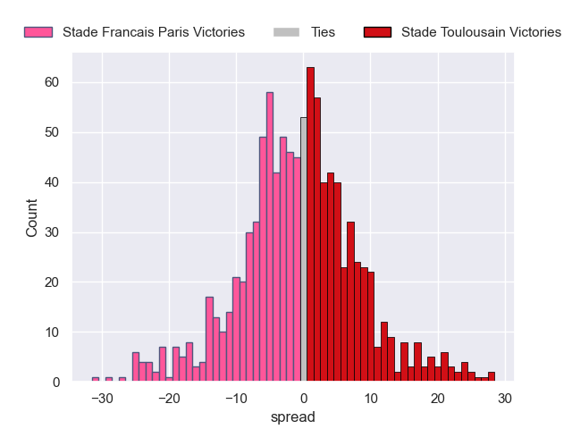

### Lyon V US Montauban on 2026/02/14

Average Margin: Lyon by 10.4

### La Rochelle V Montpellier Herault on 2026/02/14

Average Margin: La Rochelle by 2.8

### Perpignan V Pau on 2026/02/14

Average Margin: Perpignan by 0.2

### Toulon V Clermont Auvergne on 2026/02/14

Average Margin: Toulon by 6.6

### Bordeaux Begles V Castres Olympique on 2026/02/14

Average Margin: Bordeaux Begles by 7.6

### Bayonne V Racing 92 on 2026/02/14

Average Margin: Bayonne by 1.7

## Week 19

### Lyon V Toulon on 2026/02/27

Average Margin: Lyon by 1.5

### Castres Olympique V La Rochelle on 2026/02/27

Average Margin: Castres Olympique by 4.0

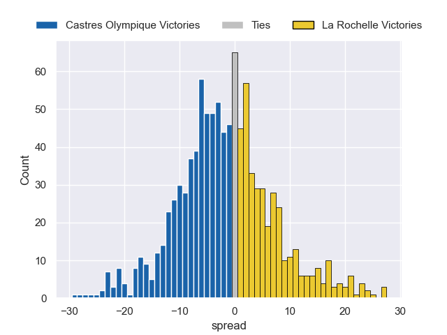

### Pau V Bordeaux Begles on 2026/02/27

Average Margin: Pau by 0.2

### Stade Francais Paris V Perpignan on 2026/02/27

Average Margin: Stade Francais Paris by 8.7

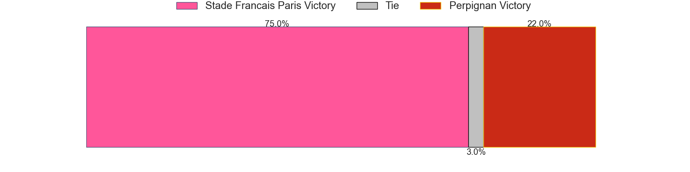

### Clermont Auvergne V Bayonne on 2026/02/27

Average Margin: Clermont Auvergne by 5.5

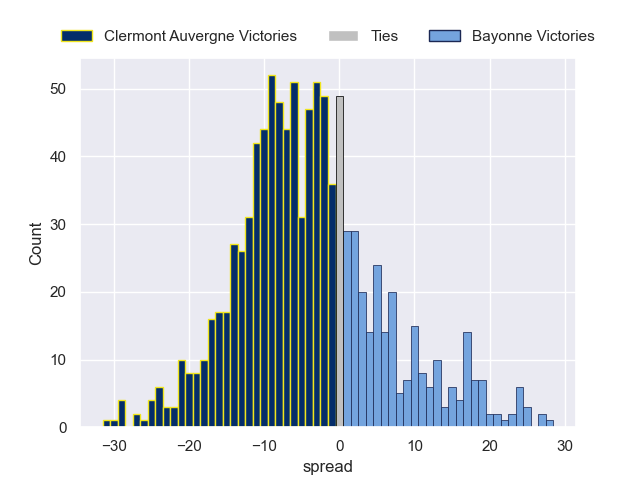

### Montpellier Herault V Racing 92 on 2026/02/27

Average Margin: Montpellier Herault by 7.5

### Stade Toulousain V US Montauban on 2026/02/27

Average Margin: Stade Toulousain by 17.2

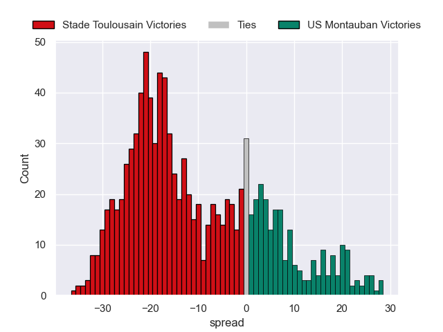

## Week 20

### Racing 92 V Castres Olympique on 2026/03/20

Average Margin: Racing 92 by 2.0

### Clermont Auvergne V Montpellier Herault on 2026/03/20

Average Margin: Clermont Auvergne by 1.1

### Toulon V Stade Francais Paris on 2026/03/20

Average Margin: Toulon by 2.9

### Perpignan V Lyon on 2026/03/20

Average Margin: Perpignan by 2.5

### La Rochelle V Pau on 2026/03/20

Average Margin: La Rochelle by 3.6

### US Montauban V Bayonne on 2026/03/20

Average Margin: Bayonne by 2.6

### Bordeaux Begles V Stade Toulousain on 2026/03/20

Average Margin: Bordeaux Begles by 2.4

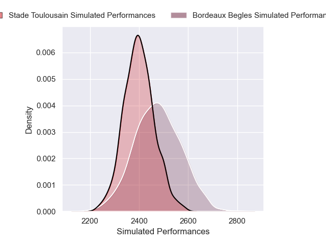

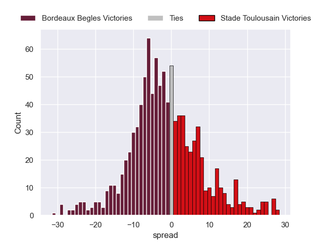

## Week 21

### Perpignan V Toulon on 2026/03/27

Average Margin: Toulon by 0.2

### Bayonne V La Rochelle on 2026/03/27

Average Margin: Bayonne by 0.5

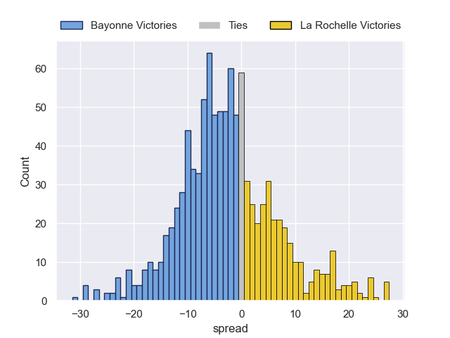

### Pau V Racing 92 on 2026/03/27

Average Margin: Pau by 4.7

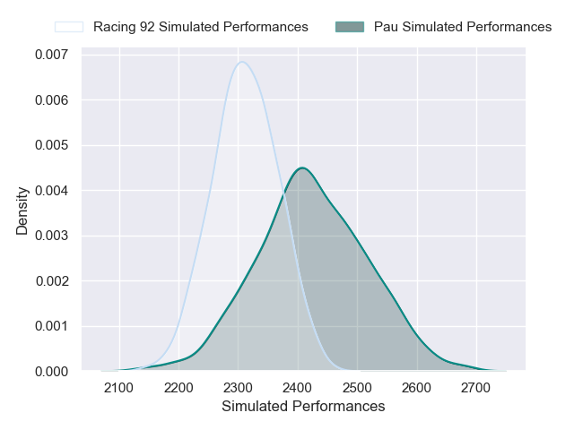

### Stade Francais Paris V Clermont Auvergne on 2026/03/27

Average Margin: Stade Francais Paris by 6.2

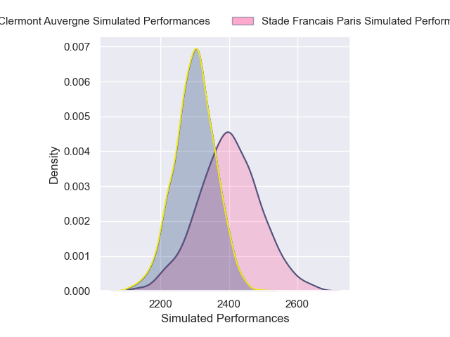
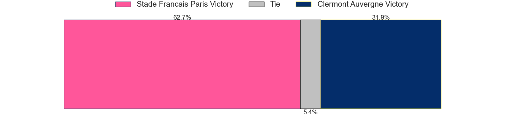

### Lyon V Bordeaux Begles on 2026/03/27

Average Margin: Bordeaux Begles by 1.8

### Castres Olympique V US Montauban on 2026/03/27

Average Margin: Castres Olympique by 10.9

### Stade Toulousain V Montpellier Herault on 2026/03/27

Average Margin: Stade Toulousain by 6.6

## Week 22

### Clermont Auvergne V Lyon on 2026/04/17

Average Margin: Clermont Auvergne by 4.7

### Castres Olympique V Stade Toulousain on 2026/04/17

Average Margin: Stade Toulousain by 1.2

### Bayonne V Pau on 2026/04/17

Average Margin: Bayonne by 0.7

### Montpellier Herault V Perpignan on 2026/04/17

Average Margin: Montpellier Herault by 8.7

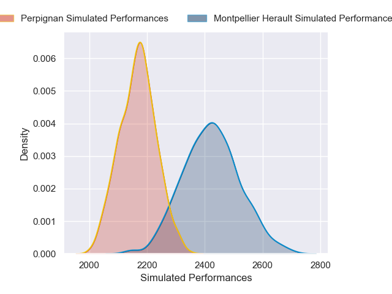

### US Montauban V Toulon on 2026/04/17

Average Margin: Toulon by 4.2

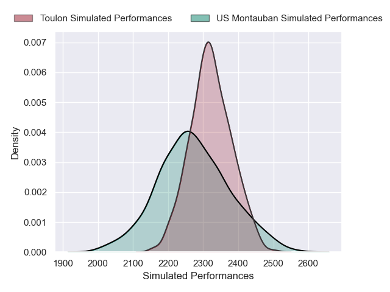
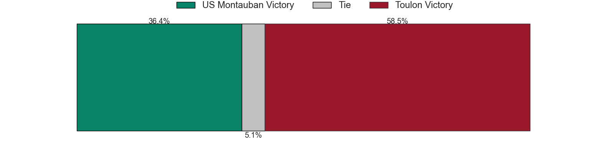

### Racing 92 V Stade Francais Paris on 2026/04/17

Average Margin: Racing 92 by 1.2

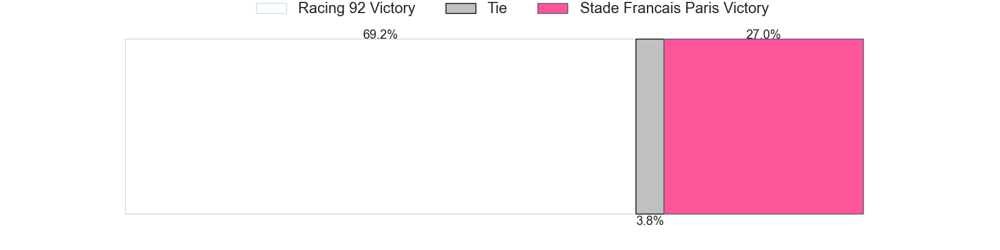
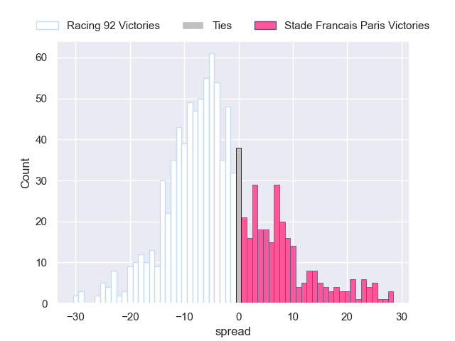

### La Rochelle V Bordeaux Begles on 2026/04/17

Average Margin: La Rochelle by 0.9

## Week 23

### US Montauban V Racing 92 on 2026/04/24

Average Margin: Racing 92 by 4.0

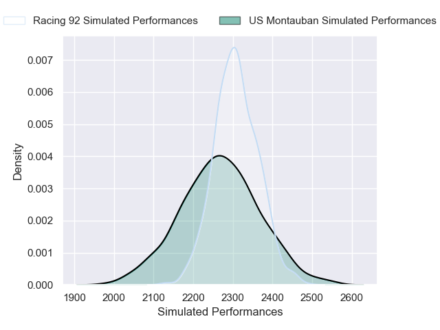

### Toulon V Bayonne on 2026/04/24

Average Margin: Toulon by 6.9

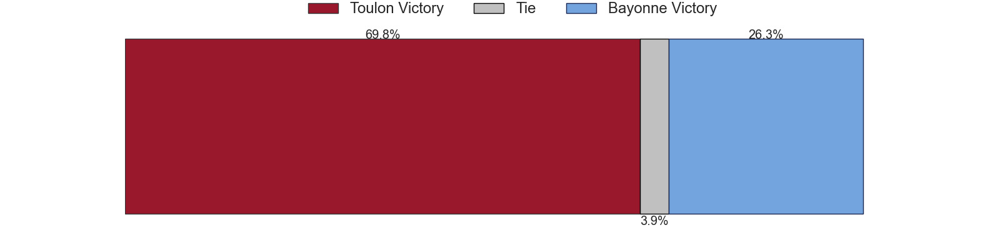

### Stade Toulousain V Clermont Auvergne on 2026/04/24

Average Margin: Stade Toulousain by 9.3

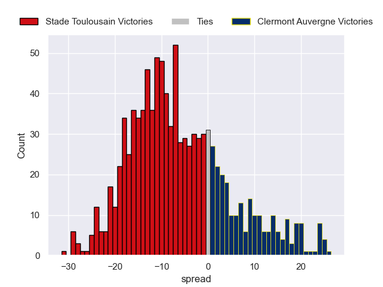

### Lyon V Castres Olympique on 2026/04/24

Average Margin: Lyon by 2.0

### Stade Francais Paris V Pau on 2026/04/24

Average Margin: Stade Francais Paris by 4.8

### Perpignan V La Rochelle on 2026/04/24

Average Margin: Perpignan by 0.4

### Bordeaux Begles V Montpellier Herault on 2026/04/24

Average Margin: Bordeaux Begles by 4.9

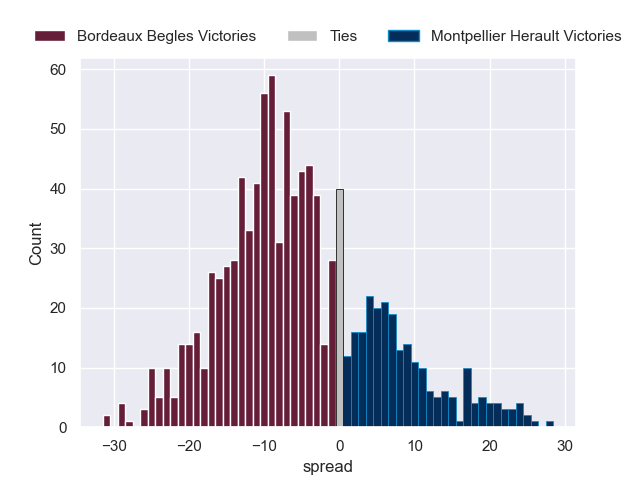

## Week 24

### Montpellier Herault V US Montauban on 2026/05/08

Average Margin: Montpellier Herault by 12.3

### Racing 92 V La Rochelle on 2026/05/08

Average Margin: Racing 92 by 1.9

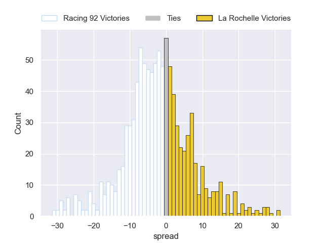

### Bayonne V Bordeaux Begles on 2026/05/08

Average Margin: Bordeaux Begles by 1.1

### Clermont Auvergne V Perpignan on 2026/05/08

Average Margin: Clermont Auvergne by 5.5

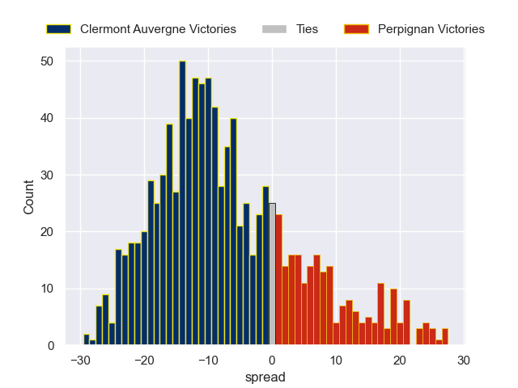

### Pau V Castres Olympique on 2026/05/08

Average Margin: Pau by 2.7

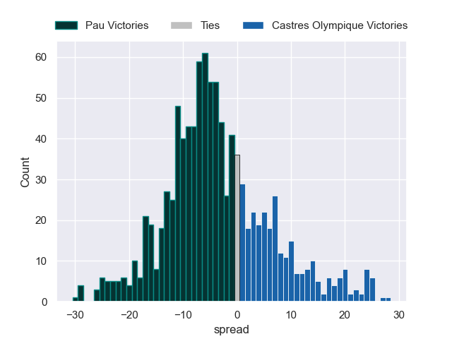

### Stade Francais Paris V Lyon on 2026/05/08

Average Margin: Stade Francais Paris by 6.3

### Toulon V Stade Toulousain on 2026/05/08

Average Margin: Toulon by 0.2

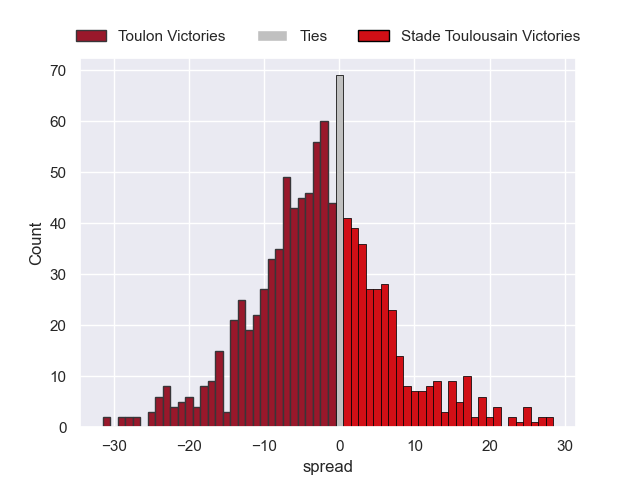

## Week 25

### Castres Olympique V Montpellier Herault on 2026/05/15

Average Margin: Castres Olympique by 2.7

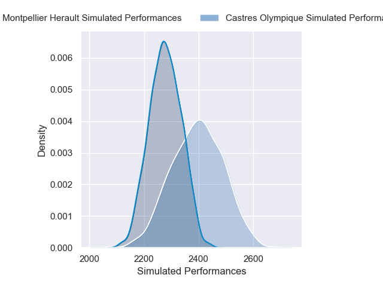

### La Rochelle V Stade Toulousain on 2026/05/15

Average Margin: Stade Toulousain by 0.4

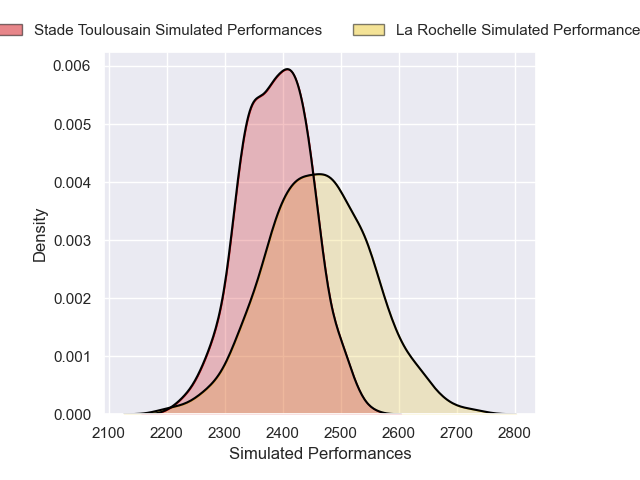

### Lyon V Bayonne on 2026/05/15

Average Margin: Lyon by 4.0

### Racing 92 V Toulon on 2026/05/15

Average Margin: Racing 92 by 2.0

### US Montauban V Stade Francais Paris on 2026/05/15

Average Margin: Stade Francais Paris by 4.6

### Pau V Clermont Auvergne on 2026/05/15

Average Margin: Pau by 5.3

### Bordeaux Begles V Perpignan on 2026/05/15

Average Margin: Bordeaux Begles by 9.2

## Week 26

### Clermont Auvergne V Racing 92 on 2026/05/29

Average Margin: Clermont Auvergne by 2.8

### Montpellier Herault V Pau on 2026/05/29

Average Margin: Montpellier Herault by 5.0

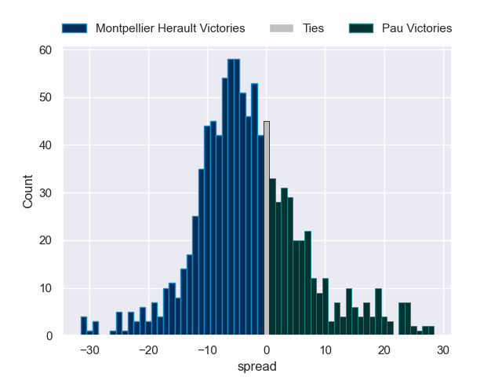

### Perpignan V Castres Olympique on 2026/05/29

Average Margin: Perpignan by 0.4

### Toulon V Bordeaux Begles on 2026/05/29

Average Margin: Toulon by 2.0

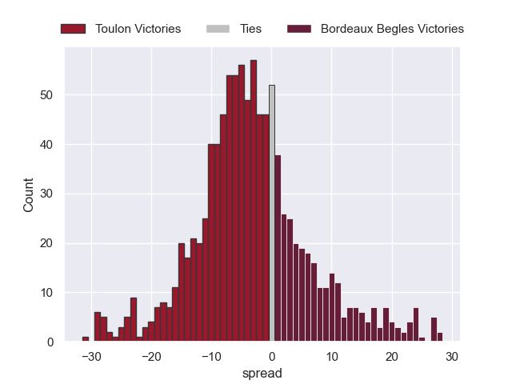

### US Montauban V La Rochelle on 2026/05/29

Average Margin: La Rochelle by 4.5

### Stade Francais Paris V Bayonne on 2026/05/29

Average Margin: Stade Francais Paris by 6.8

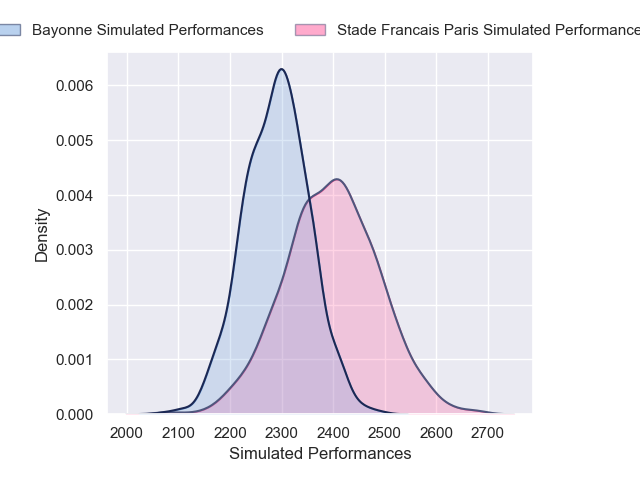

### Stade Toulousain V Lyon on 2026/05/29

Average Margin: Stade Toulousain by 8.7

## Week 27

### Castres Olympique V Toulon on 2026/06/06

Average Margin: Castres Olympique by 3.3

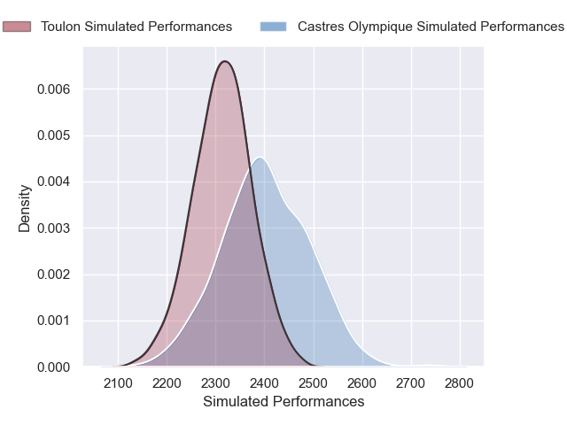

### Pau V US Montauban on 2026/06/06

Average Margin: Pau by 10.2

### Bayonne V Perpignan on 2026/06/06

Average Margin: Bayonne by 4.0

### Bordeaux Begles V Clermont Auvergne on 2026/06/06

Average Margin: Bordeaux Begles by 7.8

### La Rochelle V Stade Francais Paris on 2026/06/06

Average Margin: La Rochelle by 3.7

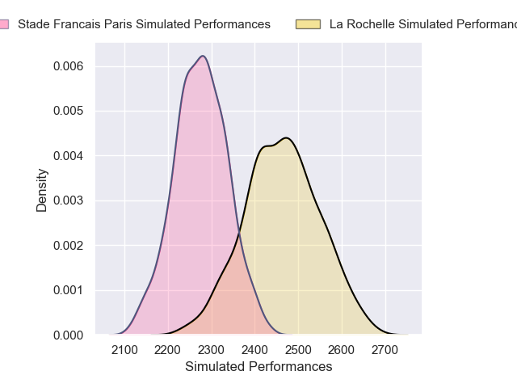

### Lyon V Montpellier Herault on 2026/06/06

Average Margin: Lyon by 0.9

### Racing 92 V Stade Toulousain on 2026/06/06

Average Margin: Stade Toulousain by 1.4

