# Team Rankings

# Standings

## Current Standings

| Club                 |   Played |   Wins |   Point Differential |   Losing Bonus Points |   Try Bonus Points |   Competition Points |
|:---------------------|---------:|-------:|---------------------:|----------------------:|-------------------:|---------------------:|
| Stade Toulousain     |       16 |     12 |                  306 |                     2 |                 12 |                   62 |
| Pau                  |       16 |     11 |                   75 |                     2 |                  8 |                   54 |
| Bordeaux Begles      |       16 |      9 |                  105 |                     3 |                 10 |                   49 |
| Stade Francais Paris |       16 |      8 |                   48 |                     4 |                  9 |                   47 |
| Toulon               |       17 |      9 |                  -51 |                     1 |                  8 |                   47 |
| Montpellier Herault  |       16 |      8 |                  137 |                     5 |                  7 |                   46 |
| Clermont Auvergne    |       16 |      9 |                   86 |                     2 |                  8 |                   46 |
| Racing 92            |       16 |      9 |                  -25 |                     1 |                  7 |                   46 |
| Castres Olympique    |       16 |      9 |                  -40 |                     4 |                  6 |                   46 |
| La Rochelle          |       17 |      7 |                   69 |                     4 |                  8 |                   42 |
| Bayonne              |       16 |      8 |                 -100 |                     1 |                  4 |                   37 |
| Lyon                 |       16 |      7 |                  -42 |                     2 |                  6 |                   36 |
| Perpignan            |       16 |      3 |                 -162 |                     4 |                  3 |                   19 |
| US Montauban         |       16 |      1 |                 -406 |                     2 |                  4 |                   12 |

## Projected Remaining Table

| Club                 |   To Play |   Projected Wins |   Projected Differential |   Projected Losing Bonus Points | Projected Try Bonus Points   |   Projected Competition Points |
|:---------------------|----------:|-----------------:|-------------------------:|--------------------------------:|:-----------------------------|-------------------------------:|
| Stade Toulousain     |        10 |            5.944 |                   44.338 |                           2.007 |                              |                         26.707 |
| Bordeaux Begles      |        10 |            5.824 |                   29.538 |                           2.121 |                              |                         26.437 |
| Stade Francais Paris |        10 |            5.887 |                   29.41  |                           2.011 |                              |                         26.283 |
| Toulon               |        10 |            5.407 |                   16.297 |                           2.325 |                              |                         24.875 |
| La Rochelle          |        10 |            5.199 |                   10.556 |                           2.422 |                              |                         24.284 |
| Pau                  |        10 |            5.073 |                   11.228 |                           2.291 |                              |                         23.499 |
| Montpellier Herault  |        10 |            4.964 |                   14.139 |                           2.214 |                              |                         22.958 |
| Castres Olympique    |        10 |            4.683 |                    3.09  |                           2.462 |                              |                         22.2   |
| Lyon                 |        10 |            4.569 |                   -4.171 |                           2.298 |                              |                         21.484 |
| Racing 92            |        10 |            4.375 |                  -10.06  |                           2.559 |                              |                         21.045 |
| Clermont Auvergne    |        10 |            4.379 |                  -16.267 |                           1.982 |                              |                         20.218 |
| Bayonne              |        10 |            4.159 |                  -15.534 |                           2.575 |                              |                         20.137 |
| Perpignan            |        10 |            3.853 |                  -30.344 |                           2.291 |                              |                         18.601 |
| US Montauban         |        10 |            2.542 |                  -82.22  |                           2.029 |                              |                         12.859 |

## Projected Total Table

| Club                 |   Played |   Wins |   Point Differential |   Losing Bonus Points |   Try Bonus Points |   Competition Points |
|:---------------------|---------:|-------:|---------------------:|----------------------:|-------------------:|---------------------:|
| Stade Toulousain     |       26 | 17.944 |              350.338 |                 4.007 |                 12 |               88.707 |
| Pau                  |       26 | 16.073 |               86.228 |                 4.291 |                  8 |               77.499 |
| Bordeaux Begles      |       26 | 14.824 |              134.538 |                 5.121 |                 10 |               75.437 |
| Stade Francais Paris |       26 | 13.887 |               77.41  |                 6.011 |                  9 |               73.283 |
| Toulon               |       27 | 14.407 |              -34.703 |                 3.325 |                  8 |               71.875 |
| Montpellier Herault  |       26 | 12.964 |              151.139 |                 7.214 |                  7 |               68.958 |
| Castres Olympique    |       26 | 13.683 |              -36.91  |                 6.462 |                  6 |               68.2   |
| Racing 92            |       26 | 13.375 |              -35.06  |                 3.559 |                  7 |               67.045 |
| La Rochelle          |       27 | 12.199 |               79.556 |                 6.422 |                  8 |               66.284 |
| Clermont Auvergne    |       26 | 13.379 |               69.733 |                 3.982 |                  8 |               66.218 |
| Lyon                 |       26 | 11.569 |              -46.171 |                 4.298 |                  6 |               57.484 |
| Bayonne              |       26 | 12.159 |             -115.534 |                 3.575 |                  4 |               57.137 |
| Perpignan            |       26 |  6.853 |             -192.344 |                 6.291 |                  3 |               37.601 |
| US Montauban         |       26 |  3.542 |             -488.22  |                 4.029 |                  4 |               24.859 |

# Completed Match Review

| Model | Percent Correct Predictions | Spread Error |
| ------ | ------ | ------ |
| Club Level | 74.9% | 11.4 |
| Player Level: Lineup | nan% | nan |
| Player Level: Minutes | nan% | nan |

# Future Predictions

## Week 18

### Stade Francais Paris V Stade Toulousain on 2026/02/13

Average Margin: Stade Francais Paris by 0.2

### Bordeaux Begles V Castres Olympique on 2026/02/14

Average Margin: Bordeaux Begles by 7.4

### Lyon V US Montauban on 2026/02/14

Average Margin: Lyon by 10.6

### Perpignan V Pau on 2026/02/14

Average Margin: Perpignan by 0.6

### Toulon V Clermont Auvergne on 2026/02/14

Average Margin: Toulon by 6.9

### La Rochelle V Montpellier Herault on 2026/02/14

Average Margin: La Rochelle by 3.0

### Bayonne V Racing 92 on 2026/02/14

Average Margin: Bayonne by 2.0

## Week 19

### Montpellier Herault V Racing 92 on 2026/02/27

Average Margin: Montpellier Herault by 6.9

### Stade Toulousain V US Montauban on 2026/02/27

Average Margin: Stade Toulousain by 17.6

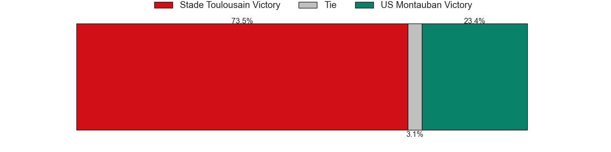

### Clermont Auvergne V Bayonne on 2026/02/27

Average Margin: Clermont Auvergne by 5.5

### Castres Olympique V La Rochelle on 2026/02/27

Average Margin: Castres Olympique by 3.5

### Lyon V Toulon on 2026/02/27

Average Margin: Lyon by 1.7

### Pau V Bordeaux Begles on 2026/02/27

Average Margin: Pau by 1.5

### Stade Francais Paris V Perpignan on 2026/02/27

Average Margin: Stade Francais Paris by 8.3

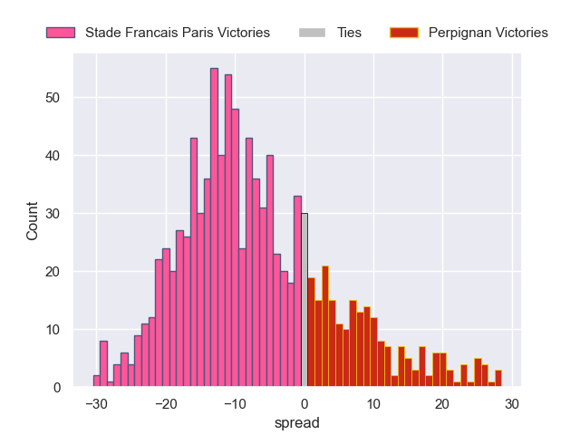

## Week 20

### Clermont Auvergne V Montpellier Herault on 2026/03/20

Average Margin: Clermont Auvergne by 0.5

### Racing 92 V Castres Olympique on 2026/03/20

Average Margin: Racing 92 by 1.7

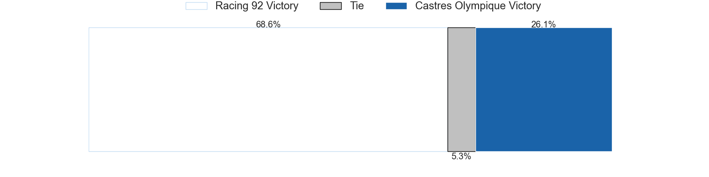

### Perpignan V Lyon on 2026/03/20

Average Margin: Perpignan by 2.3

### La Rochelle V Pau on 2026/03/20

Average Margin: La Rochelle by 3.5

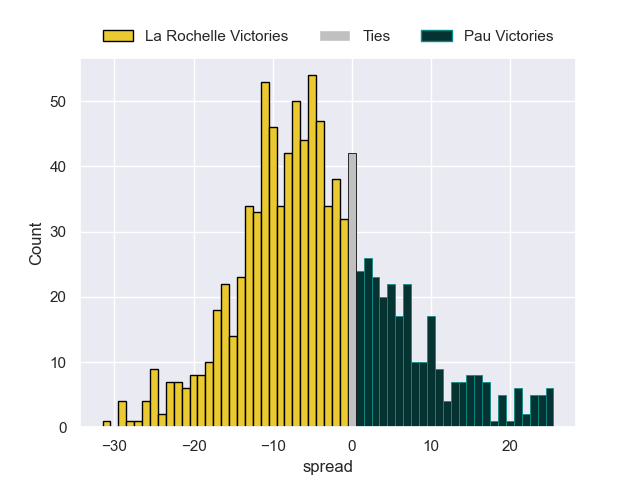

### US Montauban V Bayonne on 2026/03/20

Average Margin: Bayonne by 1.6

### Bordeaux Begles V Stade Toulousain on 2026/03/20

Average Margin: Bordeaux Begles by 2.3

### Toulon V Stade Francais Paris on 2026/03/20

Average Margin: Toulon by 3.0

## Week 21

### Lyon V Bordeaux Begles on 2026/03/27

Average Margin: Bordeaux Begles by 1.3

### Castres Olympique V US Montauban on 2026/03/27

Average Margin: Castres Olympique by 11.4

### Perpignan V Toulon on 2026/03/27

Average Margin: Perpignan by 0.1

### Stade Toulousain V Montpellier Herault on 2026/03/27

Average Margin: Stade Toulousain by 6.3

### Pau V Racing 92 on 2026/03/27

Average Margin: Pau by 4.9

### Bayonne V La Rochelle on 2026/03/27

Average Margin: Bayonne by 0.3

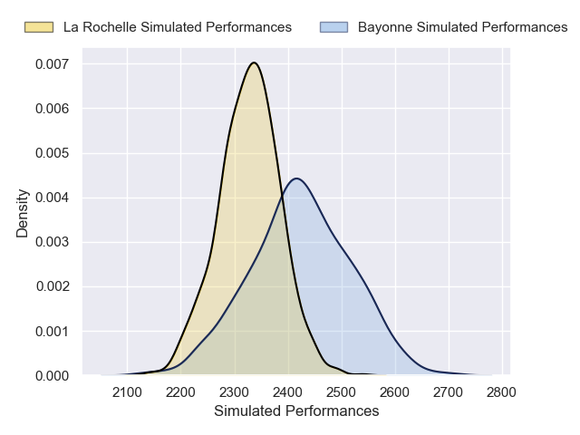

### Stade Francais Paris V Clermont Auvergne on 2026/03/27

Average Margin: Stade Francais Paris by 6.3

## Week 22

### Castres Olympique V Stade Toulousain on 2026/04/17

Average Margin: Stade Toulousain by 1.7

### Bayonne V Pau on 2026/04/17

Average Margin: Bayonne by 0.9

### Montpellier Herault V Perpignan on 2026/04/17

Average Margin: Montpellier Herault by 8.9

### Racing 92 V Stade Francais Paris on 2026/04/17

Average Margin: Racing 92 by 0.8

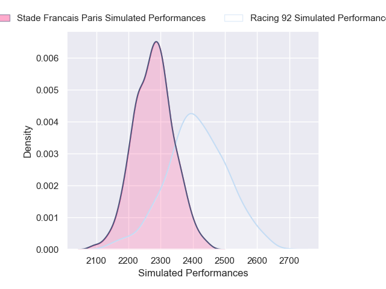

### US Montauban V Toulon on 2026/04/17

Average Margin: Toulon by 5.8

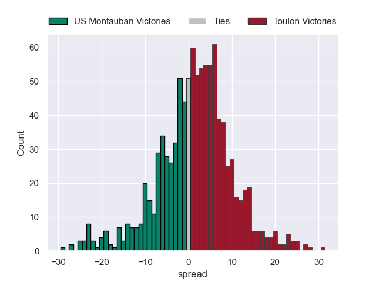

### La Rochelle V Bordeaux Begles on 2026/04/17

Average Margin: La Rochelle by 1.1

### Clermont Auvergne V Lyon on 2026/04/17

Average Margin: Clermont Auvergne by 4.6

## Week 23

### Toulon V Bayonne on 2026/04/24

Average Margin: Toulon by 6.8

### Lyon V Castres Olympique on 2026/04/24

Average Margin: Lyon by 2.0

### Stade Toulousain V Clermont Auvergne on 2026/04/24

Average Margin: Stade Toulousain by 10.0

### Stade Francais Paris V Pau on 2026/04/24

Average Margin: Stade Francais Paris by 4.7

### Perpignan V La Rochelle on 2026/04/24

Average Margin: Perpignan by 0.4

### Bordeaux Begles V Montpellier Herault on 2026/04/24

Average Margin: Bordeaux Begles by 5.3

### US Montauban V Racing 92 on 2026/04/24

Average Margin: Racing 92 by 3.3

## Week 24

### Racing 92 V La Rochelle on 2026/05/08

Average Margin: Racing 92 by 1.3

### Bayonne V Bordeaux Begles on 2026/05/08

Average Margin: Bordeaux Begles by 1.5

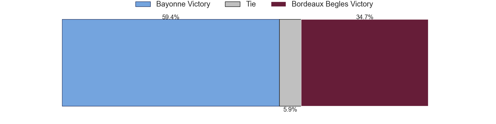

### Montpellier Herault V US Montauban on 2026/05/08

Average Margin: Montpellier Herault by 12.3

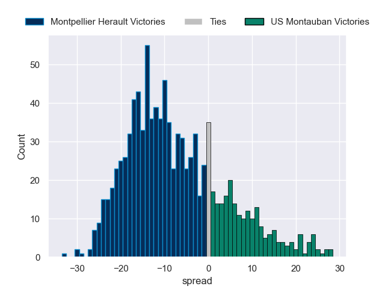

### Clermont Auvergne V Perpignan on 2026/05/08

Average Margin: Clermont Auvergne by 5.3

### Pau V Castres Olympique on 2026/05/08

Average Margin: Pau by 3.9

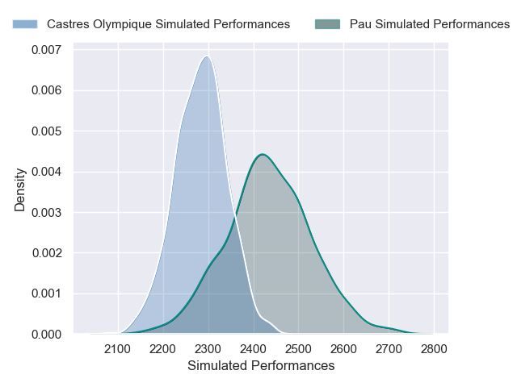

### Stade Francais Paris V Lyon on 2026/05/08

Average Margin: Stade Francais Paris by 5.8

### Toulon V Stade Toulousain on 2026/05/08

Average Margin: Stade Toulousain by 0.2

## Week 25

### La Rochelle V Stade Toulousain on 2026/05/15

Average Margin: Stade Toulousain by 0.0

### Racing 92 V Toulon on 2026/05/15

Average Margin: Racing 92 by 1.9

### US Montauban V Stade Francais Paris on 2026/05/15

Average Margin: Stade Francais Paris by 5.3

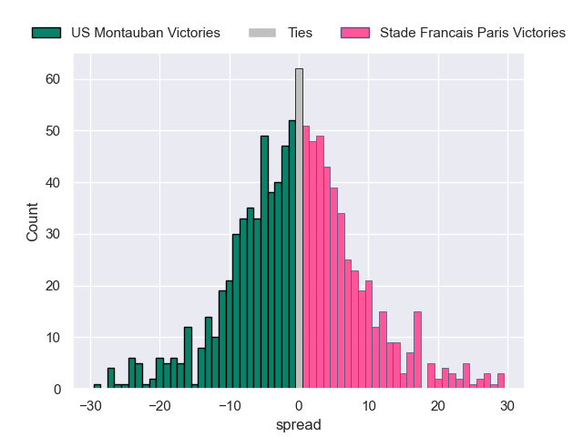

### Pau V Clermont Auvergne on 2026/05/15

Average Margin: Pau by 5.2

### Bordeaux Begles V Perpignan on 2026/05/15

Average Margin: Bordeaux Begles by 8.7

### Castres Olympique V Montpellier Herault on 2026/05/15

Average Margin: Castres Olympique by 1.9

### Lyon V Bayonne on 2026/05/15

Average Margin: Lyon by 4.0

## Week 26

### Montpellier Herault V Pau on 2026/05/29

Average Margin: Montpellier Herault by 4.2

### Perpignan V Castres Olympique on 2026/05/29

Average Margin: Perpignan by 1.0

### Toulon V Bordeaux Begles on 2026/05/29

Average Margin: Toulon by 1.6

### US Montauban V La Rochelle on 2026/05/29

Average Margin: La Rochelle by 4.6

### Stade Francais Paris V Bayonne on 2026/05/29

Average Margin: Stade Francais Paris by 6.1

### Stade Toulousain V Lyon on 2026/05/29

Average Margin: Stade Toulousain by 9.4

### Clermont Auvergne V Racing 92 on 2026/05/29

Average Margin: Clermont Auvergne by 3.5

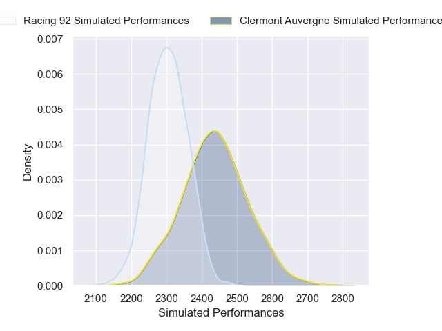

## Week 27

### Castres Olympique V Toulon on 2026/06/06

Average Margin: Castres Olympique by 3.9

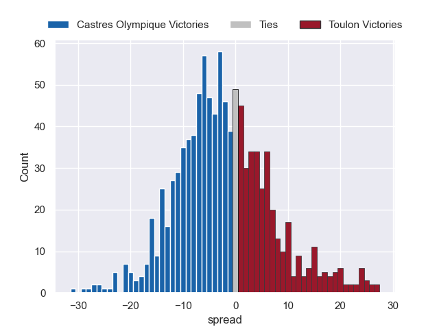

### Pau V US Montauban on 2026/06/06

Average Margin: Pau by 9.8

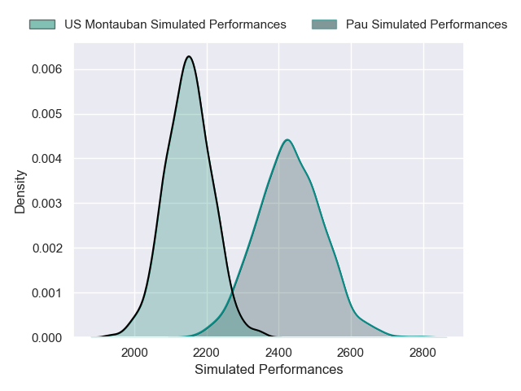

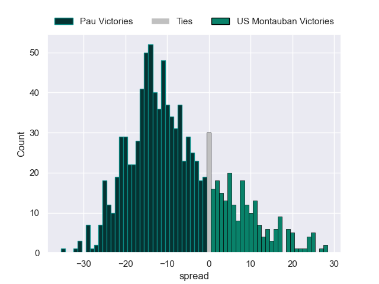

### Bordeaux Begles V Clermont Auvergne on 2026/06/06

Average Margin: Bordeaux Begles by 7.2

### Bayonne V Perpignan on 2026/06/06

Average Margin: Bayonne by 3.5

### La Rochelle V Stade Francais Paris on 2026/06/06

Average Margin: La Rochelle by 3.6

### Lyon V Montpellier Herault on 2026/06/06

Average Margin: Lyon by 1.1

### Racing 92 V Stade Toulousain on 2026/06/06

Average Margin: Stade Toulousain by 1.6

