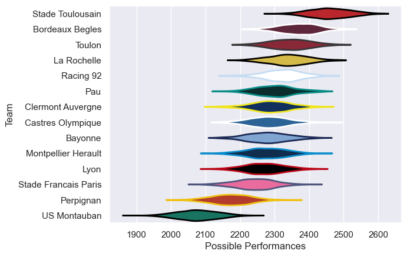

---  
title: "Top 14 25/26"  
date: 2025-10-02 6:00:00 -0500  
categories: model review projection  
layout: article  
aside:  
    toc: true  
---
# Team Rankings

# Standings

## Current Standings

| Club                 |   Played |   Wins |   Point Differential |   Losing Bonus Points |   Try Bonus Points |   Competition Points |
|:---------------------|---------:|-------:|---------------------:|----------------------:|-------------------:|---------------------:|
| Stade Toulousain     |        4 |      3 |                   45 |                     0 |                  3 |                   15 |
| Pau                  |        4 |      3 |                   28 |                     0 |                  2 |                   14 |
| Lyon                 |        4 |      3 |                   12 |                     0 |                  2 |                   14 |
| Racing 92            |        4 |      3 |                   12 |                     0 |                  2 |                   14 |
| La Rochelle          |        4 |      2 |                   36 |                     1 |                  2 |                   13 |
| Toulon               |        4 |      2 |                   11 |                     1 |                  1 |                   12 |
| Bayonne              |        4 |      3 |                  -18 |                     0 |                    |                   12 |
| Stade Francais Paris |        4 |      2 |                   15 |                     1 |                  2 |                   11 |
| Bordeaux Begles      |        4 |      2 |                   19 |                     0 |                  2 |                   10 |
| Montpellier Herault  |        4 |      1 |                   17 |                     1 |                  1 |                    8 |
| Castres Olympique    |        4 |      1 |                  -22 |                     2 |                  1 |                    7 |
| Clermont Auvergne    |        4 |      1 |                  -17 |                     0 |                  2 |                    6 |
| US Montauban         |        4 |      0 |                  -77 |                     1 |                  1 |                    4 |
| Perpignan            |        4 |      0 |                  -61 |                     1 |                    |                    1 |

## Projected Remaining Table

| Club                 |   To Play |   Projected Wins |   Projected Differential |   Projected Losing Bonus Points | Projected Try Bonus Points   |   Projected Competition Points |
|:---------------------|----------:|-----------------:|-------------------------:|--------------------------------:|:-----------------------------|-------------------------------:|
| Stade Toulousain     |        22 |           13.605 |                   85.824 |                           4.254 |                              |                         60.726 |
| Bordeaux Begles      |        22 |           12.073 |                   41.486 |                           4.943 |                              |                         55.353 |
| Toulon               |        22 |           11.742 |                   35.755 |                           4.846 |                              |                         53.872 |
| La Rochelle          |        22 |           11.557 |                   31.102 |                           5.213 |                              |                         53.503 |
| Clermont Auvergne    |        22 |           10.883 |                   10.164 |                           5     |                              |                         50.56  |
| Racing 92            |        22 |           10.644 |                    7.389 |                           5.488 |                              |                         50.14  |
| Pau                  |        22 |           10.642 |                    2.469 |                           5.276 |                              |                         50.01  |
| Castres Olympique    |        22 |           10.386 |                   -2.108 |                           5.484 |                              |                         49.246 |
| Bayonne              |        22 |           10.216 |                   -6.055 |                           5.285 |                              |                         48.163 |
| Montpellier Herault  |        22 |           10.235 |                   -8.467 |                           5.134 |                              |                         48.108 |
| Lyon                 |        22 |            9.856 |                  -13.833 |                           5.42  |                              |                         46.97  |
| Stade Francais Paris |        22 |            9.487 |                  -27.829 |                           5.517 |                              |                         45.637 |
| Perpignan            |        22 |            8.482 |                  -52.157 |                           5.514 |                              |                         41.528 |
| US Montauban         |        22 |            6.906 |                 -103.74  |                           5.29  |                              |                         34.848 |

## Projected Total Table

| Club                 |   Played |   Wins |   Point Differential |   Losing Bonus Points |   Try Bonus Points |   Competition Points |
|:---------------------|---------:|-------:|---------------------:|----------------------:|-------------------:|---------------------:|
| Stade Toulousain     |       26 | 16.605 |              130.824 |                 4.254 |                  3 |               75.726 |
| La Rochelle          |       26 | 13.557 |               67.102 |                 6.213 |                  2 |               66.503 |
| Toulon               |       26 | 13.742 |               46.755 |                 5.846 |                  1 |               65.872 |
| Bordeaux Begles      |       26 | 14.073 |               60.486 |                 4.943 |                  2 |               65.353 |
| Racing 92            |       26 | 13.644 |               19.389 |                 5.488 |                  2 |               64.14  |
| Pau                  |       26 | 13.642 |               30.469 |                 5.276 |                  2 |               64.01  |
| Lyon                 |       26 | 12.856 |               -1.833 |                 5.42  |                  2 |               60.97  |
| Bayonne              |       26 | 13.216 |              -24.055 |                 5.285 |                    |               60.163 |
| Stade Francais Paris |       26 | 11.487 |              -12.829 |                 6.517 |                  2 |               56.637 |
| Clermont Auvergne    |       26 | 11.883 |               -6.836 |                 5     |                  2 |               56.56  |
| Castres Olympique    |       26 | 11.386 |              -24.108 |                 7.484 |                  1 |               56.246 |
| Montpellier Herault  |       26 | 11.235 |                8.533 |                 6.134 |                  1 |               56.108 |
| Perpignan            |       26 |  8.482 |             -113.157 |                 6.514 |                    |               42.528 |
| US Montauban         |       26 |  6.906 |             -180.74  |                 6.29  |                  1 |               38.848 |

# Completed Match Review

| Model | Percent Correct Predictions | Spread Error |
| ------ | ------ | ------ |
| Club Level | 67.0% | 8.8 |
| Player Level: Lineup | nan% | nan |
| Player Level: Minutes | nan% | nan |

# Future Predictions

## Week 5

### Toulon V Pau on 2025/10/04

Average Margin: Toulon by 5.0

### Perpignan V Stade Francais Paris on 2025/10/04

Average Margin: Perpignan by 2.4

### Montpellier Herault V La Rochelle on 2025/10/04

Average Margin: Montpellier Herault by 2.5

### Clermont Auvergne V US Montauban on 2025/10/04

Average Margin: Clermont Auvergne by 8.8

### Bordeaux Begles V Lyon on 2025/10/04

Average Margin: Bordeaux Begles by 6.6

### Castres Olympique V Racing 92 on 2025/10/04

Average Margin: Castres Olympique by 2.1

### Bayonne V Stade Toulousain on 2025/10/05

Average Margin: Stade Toulousain by 1.0

## Week 6

### Clermont Auvergne V Toulon on 2025/10/10

Average Margin: Clermont Auvergne by 2.4

### Stade Toulousain V Bordeaux Begles on 2025/10/10

Average Margin: Stade Toulousain by 6.5

### Lyon V Perpignan on 2025/10/10

Average Margin: Lyon by 7.0

### Pau V Bayonne on 2025/10/10

Average Margin: Pau by 4.1

### Stade Francais Paris V La Rochelle on 2025/10/10

Average Margin: Stade Francais Paris by 1.2

### US Montauban V Castres Olympique on 2025/10/10

Average Margin: Castres Olympique by 2.4

### Racing 92 V Montpellier Herault on 2025/10/10

Average Margin: Racing 92 by 4.4

## Week 7

### Toulon V Racing 92 on 2025/10/17

Average Margin: Toulon by 5.1

### Pau V Stade Toulousain on 2025/10/17

Average Margin: Stade Toulousain by 1.1

### La Rochelle V US Montauban on 2025/10/17

Average Margin: La Rochelle by 10.6

### Montpellier Herault V Lyon on 2025/10/17

Average Margin: Montpellier Herault by 4.1

### Castres Olympique V Stade Francais Paris on 2025/10/17

Average Margin: Castres Olympique by 4.0

### Perpignan V Bordeaux Begles on 2025/10/17

Average Margin: Bordeaux Begles by 1.6

### Bayonne V Clermont Auvergne on 2025/10/17

Average Margin: Bayonne by 3.5

## Week 8

### Bordeaux Begles V Bayonne on 2025/10/24

Average Margin: Bordeaux Begles by 6.3

### Racing 92 V Pau on 2025/10/24

Average Margin: Racing 92 by 2.6

### Lyon V La Rochelle on 2025/10/24

Average Margin: Lyon by 1.6

### US Montauban V Perpignan on 2025/10/24

Average Margin: US Montauban by 1.1

### Clermont Auvergne V Castres Olympique on 2025/10/24

Average Margin: Clermont Auvergne by 4.3

### Stade Toulousain V Toulon on 2025/10/24

Average Margin: Stade Toulousain by 6.4

### Stade Francais Paris V Montpellier Herault on 2025/10/24

Average Margin: Stade Francais Paris by 2.4

## Week 9

### Stade Toulousain V Stade Francais Paris on 2025/10/31

Average Margin: Stade Toulousain by 9.4

### Pau V Perpignan on 2025/10/31

Average Margin: Pau by 6.1

### Toulon V Lyon on 2025/10/31

Average Margin: Toulon by 6.3

### Bayonne V US Montauban on 2025/10/31

Average Margin: Bayonne by 8.5

### Montpellier Herault V Clermont Auvergne on 2025/10/31

Average Margin: Montpellier Herault by 3.7

### La Rochelle V Racing 92 on 2025/10/31

Average Margin: La Rochelle by 4.3

### Castres Olympique V Bordeaux Begles on 2025/10/31

Average Margin: Castres Olympique by 1.1

## Week 10

### Stade Francais Paris V Toulon on 2025/11/21

Average Margin: Stade Francais Paris by 1.1

### Bordeaux Begles V Pau on 2025/11/21

Average Margin: Bordeaux Begles by 5.7

### Lyon V Clermont Auvergne on 2025/11/21

Average Margin: Lyon by 3.5

### La Rochelle V Castres Olympique on 2025/11/21

Average Margin: La Rochelle by 5.5

### Racing 92 V Bayonne on 2025/11/21

Average Margin: Racing 92 by 4.0

### US Montauban V Stade Toulousain on 2025/11/21

Average Margin: Stade Toulousain by 5.9

### Perpignan V Montpellier Herault on 2025/11/21

Average Margin: Perpignan by 1.7

## Week 11

### Clermont Auvergne V Stade Francais Paris on 2025/11/28

Average Margin: Clermont Auvergne by 4.4

### Toulon V US Montauban on 2025/11/28

Average Margin: Toulon by 10.8

### Bayonne V Lyon on 2025/11/28

Average Margin: Bayonne by 3.9

### Castres Olympique V Perpignan on 2025/11/28

Average Margin: Castres Olympique by 5.6

### Stade Toulousain V Racing 92 on 2025/11/28

Average Margin: Stade Toulousain by 6.8

### Montpellier Herault V Bordeaux Begles on 2025/11/28

Average Margin: Montpellier Herault by 1.6

### Pau V La Rochelle on 2025/11/28

Average Margin: Pau by 2.9

## Week 12

### Stade Francais Paris V Racing 92 on 2025/12/19

Average Margin: Stade Francais Paris by 1.3

### La Rochelle V Bayonne on 2025/12/19

Average Margin: La Rochelle by 4.6

### Bordeaux Begles V Toulon on 2025/12/19

Average Margin: Bordeaux Begles by 4.7

### Perpignan V Clermont Auvergne on 2025/12/19

Average Margin: Perpignan by 1.4

### Lyon V Stade Toulousain on 2025/12/19

Average Margin: Stade Toulousain by 1.2

### Montpellier Herault V Castres Olympique on 2025/12/19

Average Margin: Montpellier Herault by 3.5

### US Montauban V Pau on 2025/12/19

Average Margin: Pau by 1.3

## Week 13

### Castres Olympique V Lyon on 2025/12/26

Average Margin: Castres Olympique by 3.2

### Racing 92 V US Montauban on 2025/12/26

Average Margin: Racing 92 by 8.4

### Stade Toulousain V La Rochelle on 2025/12/26

Average Margin: Stade Toulousain by 6.7

### Bayonne V Stade Francais Paris on 2025/12/26

Average Margin: Bayonne by 4.0

### Toulon V Perpignan on 2025/12/26

Average Margin: Toulon by 7.7

### Clermont Auvergne V Bordeaux Begles on 2025/12/26

Average Margin: Clermont Auvergne by 2.4

### Pau V Montpellier Herault on 2025/12/26

Average Margin: Pau by 4.3

## Week 14

### Stade Francais Paris V Castres Olympique on 2026/01/02

Average Margin: Stade Francais Paris by 2.9

### Perpignan V Stade Toulousain on 2026/01/02

Average Margin: Stade Toulousain by 2.3

### La Rochelle V Toulon on 2026/01/02

Average Margin: La Rochelle by 4.3

### Lyon V Pau on 2026/01/02

Average Margin: Lyon by 2.7

### Bordeaux Begles V Racing 92 on 2026/01/02

Average Margin: Bordeaux Begles by 4.4

### Montpellier Herault V Bayonne on 2026/01/02

Average Margin: Montpellier Herault by 3.4

### US Montauban V Clermont Auvergne on 2026/01/02

Average Margin: Clermont Auvergne by 0.9

## Week 15

### Bordeaux Begles V Stade Francais Paris on 2026/01/23

Average Margin: Bordeaux Begles by 6.3

### Toulon V Montpellier Herault on 2026/01/23

Average Margin: Toulon by 5.5

### Stade Toulousain V Pau on 2026/01/23

Average Margin: Stade Toulousain by 7.3

### Perpignan V US Montauban on 2026/01/23

Average Margin: Perpignan by 5.8

### Bayonne V Castres Olympique on 2026/01/23

Average Margin: Bayonne by 3.8

### Clermont Auvergne V La Rochelle on 2026/01/23

Average Margin: Clermont Auvergne by 2.7

### Racing 92 V Lyon on 2026/01/23

Average Margin: Racing 92 by 4.2

## Week 16

### La Rochelle V Lyon on 2026/01/30

Average Margin: La Rochelle by 5.5

### US Montauban V Bordeaux Begles on 2026/01/30

Average Margin: Bordeaux Begles by 2.3

### Stade Toulousain V Bayonne on 2026/01/30

Average Margin: Stade Toulousain by 7.9

### Castres Olympique V Clermont Auvergne on 2026/01/30

Average Margin: Castres Olympique by 3.0

### Pau V Toulon on 2026/01/30

Average Margin: Pau by 2.8

### Montpellier Herault V Stade Francais Paris on 2026/01/30

Average Margin: Montpellier Herault by 4.1

### Racing 92 V Perpignan on 2026/01/30

Average Margin: Racing 92 by 6.7

## Week 17

### Bordeaux Begles V Castres Olympique on 2026/02/13

Average Margin: Bordeaux Begles by 6.1

### Perpignan V Pau on 2026/02/13

Average Margin: Perpignan by 1.0

### Toulon V Clermont Auvergne on 2026/02/13

Average Margin: Toulon by 5.6

### Stade Francais Paris V Stade Toulousain on 2026/02/13

Average Margin: Stade Toulousain by 0.1

### Lyon V US Montauban on 2026/02/13

Average Margin: Lyon by 7.6

### Bayonne V Racing 92 on 2026/02/13

Average Margin: Bayonne by 2.6

### La Rochelle V Montpellier Herault on 2026/02/13

Average Margin: La Rochelle by 5.9

## Week 18

### Stade Toulousain V US Montauban on 2026/02/27

Average Margin: Stade Toulousain by 10.2

### Lyon V Toulon on 2026/02/27

Average Margin: Lyon by 1.8

### Castres Olympique V La Rochelle on 2026/02/27

Average Margin: Castres Olympique by 2.1

### Montpellier Herault V Racing 92 on 2026/02/27

Average Margin: Montpellier Herault by 2.8

### Pau V Bordeaux Begles on 2026/02/27

Average Margin: Pau by 1.9

### Clermont Auvergne V Bayonne on 2026/02/27

Average Margin: Clermont Auvergne by 4.3

### Stade Francais Paris V Perpignan on 2026/02/27

Average Margin: Stade Francais Paris by 4.5

## Week 19

### Toulon V Stade Francais Paris on 2026/03/20

Average Margin: Toulon by 6.1

### US Montauban V Bayonne on 2026/03/20

Average Margin: US Montauban by 0.3

### Perpignan V Lyon on 2026/03/20

Average Margin: Perpignan by 1.5

### Bordeaux Begles V Stade Toulousain on 2026/03/20

Average Margin: Bordeaux Begles by 2.5

### La Rochelle V Pau on 2026/03/20

Average Margin: La Rochelle by 4.8

### Clermont Auvergne V Montpellier Herault on 2026/03/20

Average Margin: Clermont Auvergne by 5.1

### Racing 92 V Castres Olympique on 2026/03/20

Average Margin: Racing 92 by 3.6

## Week 20

### Lyon V Bordeaux Begles on 2026/03/27

Average Margin: Lyon by 1.3

### Pau V Racing 92 on 2026/03/27

Average Margin: Pau by 3.0

### Stade Francais Paris V Clermont Auvergne on 2026/03/27

Average Margin: Stade Francais Paris by 2.6

### Perpignan V Toulon on 2026/03/27

Average Margin: Perpignan by 0.1

### Stade Toulousain V Montpellier Herault on 2026/03/27

Average Margin: Stade Toulousain by 7.0

### Bayonne V La Rochelle on 2026/03/27

Average Margin: Bayonne by 2.9

### Castres Olympique V US Montauban on 2026/03/27

Average Margin: Castres Olympique by 6.7

## Week 21

### Bayonne V Pau on 2026/04/17

Average Margin: Bayonne by 3.5

### La Rochelle V Bordeaux Begles on 2026/04/17

Average Margin: La Rochelle by 3.1

### Castres Olympique V Stade Toulousain on 2026/04/17

Average Margin: Castres Olympique by 0.4

### Racing 92 V Stade Francais Paris on 2026/04/17

Average Margin: Racing 92 by 3.9

### US Montauban V Toulon on 2026/04/17

Average Margin: Toulon by 1.1

### Clermont Auvergne V Lyon on 2026/04/17

Average Margin: Clermont Auvergne by 4.1

### Montpellier Herault V Perpignan on 2026/04/17

Average Margin: Montpellier Herault by 5.8

## Week 22

### Stade Toulousain V Clermont Auvergne on 2026/04/24

Average Margin: Stade Toulousain by 7.0

### US Montauban V Racing 92 on 2026/04/24

Average Margin: Racing 92 by 0.6

### Stade Francais Paris V Pau on 2026/04/24

Average Margin: Stade Francais Paris by 2.2

### Toulon V Bayonne on 2026/04/24

Average Margin: Toulon by 5.4

### Lyon V Castres Olympique on 2026/04/24

Average Margin: Lyon by 3.3

### Perpignan V La Rochelle on 2026/04/24

Average Margin: Perpignan by 0.7

### Bordeaux Begles V Montpellier Herault on 2026/04/24

Average Margin: Bordeaux Begles by 5.3

## Week 23

### Racing 92 V La Rochelle on 2026/05/08

Average Margin: Racing 92 by 2.5

### Clermont Auvergne V Perpignan on 2026/05/08

Average Margin: Clermont Auvergne by 6.3

### Stade Francais Paris V Lyon on 2026/05/08

Average Margin: Stade Francais Paris by 2.8

### Montpellier Herault V US Montauban on 2026/05/08

Average Margin: Montpellier Herault by 6.6

### Toulon V Stade Toulousain on 2026/05/08

Average Margin: Toulon by 2.4

### Bayonne V Bordeaux Begles on 2026/05/08

Average Margin: Bayonne by 2.2

### Pau V Castres Olympique on 2026/05/08

Average Margin: Pau by 4.1

## Week 24

### Lyon V Bayonne on 2026/05/15

Average Margin: Lyon by 3.5

### US Montauban V Stade Francais Paris on 2026/05/15

Average Margin: US Montauban by 0.7

### Castres Olympique V Montpellier Herault on 2026/05/15

Average Margin: Castres Olympique by 3.8

### Bordeaux Begles V Perpignan on 2026/05/15

Average Margin: Bordeaux Begles by 7.5

### Pau V Clermont Auvergne on 2026/05/15

Average Margin: Pau by 3.8

### Racing 92 V Toulon on 2026/05/15

Average Margin: Racing 92 by 2.7

### La Rochelle V Stade Toulousain on 2026/05/15

Average Margin: La Rochelle by 2.3

## Week 25

### Toulon V Bordeaux Begles on 2026/05/29

Average Margin: Toulon by 3.2

### Stade Toulousain V Lyon on 2026/05/29

Average Margin: Stade Toulousain by 6.7

### Clermont Auvergne V Racing 92 on 2026/05/29

Average Margin: Clermont Auvergne by 4.1

### Montpellier Herault V Pau on 2026/05/29

Average Margin: Montpellier Herault by 2.9

### Perpignan V Castres Olympique on 2026/05/29

Average Margin: Perpignan by 1.5

### Stade Francais Paris V Bayonne on 2026/05/29

Average Margin: Stade Francais Paris by 2.0

### US Montauban V La Rochelle on 2026/05/29

Average Margin: La Rochelle by 0.4

## Week 26

### Pau V US Montauban on 2026/06/06

Average Margin: Pau by 6.8

### La Rochelle V Stade Francais Paris on 2026/06/06

Average Margin: La Rochelle by 5.4

### Lyon V Montpellier Herault on 2026/06/06

Average Margin: Lyon by 3.9

### Bordeaux Begles V Clermont Auvergne on 2026/06/06

Average Margin: Bordeaux Begles by 5.5

### Racing 92 V Stade Toulousain on 2026/06/06

Average Margin: Racing 92 by 0.2

### Castres Olympique V Toulon on 2026/06/06

Average Margin: Castres Olympique by 2.3

### Bayonne V Perpignan on 2026/06/06

Average Margin: Bayonne by 5.9

