# Team Rankings

# Standings

## Current Standings

| Club                 |   Played |   Wins |   Point Differential |   Losing Bonus Points |   Try Bonus Points |   Competition Points |
|:---------------------|---------:|-------:|---------------------:|----------------------:|-------------------:|---------------------:|
| Stade Toulousain     |       14 |     10 |                  248 |                     2 |                 10 |                   52 |
| Pau                  |       14 |     10 |                   92 |                     2 |                  7 |                   49 |
| Bordeaux Begles      |       14 |      8 |                   95 |                     2 |                  8 |                   42 |
| Stade Francais Paris |       14 |      7 |                   80 |                     4 |                  8 |                   42 |
| Toulon               |       15 |      8 |                  -34 |                     1 |                  7 |                   42 |
| Clermont Auvergne    |       14 |      8 |                   86 |                     1 |                  8 |                   41 |
| Montpellier Herault  |       14 |      7 |                  103 |                     4 |                  6 |                   40 |
| La Rochelle          |       15 |      7 |                   94 |                     3 |                  7 |                   40 |
| Castres Olympique    |       14 |      7 |                  -48 |                     4 |                  6 |                   38 |
| Racing 92            |       14 |      7 |                  -32 |                     1 |                  5 |                   36 |
| Bayonne              |       14 |      8 |                  -76 |                     0 |                  4 |                   36 |
| Lyon                 |       14 |      6 |                  -61 |                     1 |                  4 |                   29 |
| Perpignan            |       14 |      2 |                 -179 |                     3 |                  1 |                   12 |
| US Montauban         |       14 |      1 |                 -368 |                     2 |                  4 |                   12 |

## Projected Remaining Table

| Club                 |   To Play |   Projected Wins |   Projected Differential |   Projected Losing Bonus Points | Projected Try Bonus Points   |   Projected Competition Points |
|:---------------------|----------:|-----------------:|-------------------------:|--------------------------------:|:-----------------------------|-------------------------------:|
| Bordeaux Begles      |        12 |            7.263 |                   41.629 |                           2.464 |                              |                         32.688 |
| Stade Toulousain     |        12 |            7.173 |                   52.108 |                           2.529 |                              |                         32.429 |
| La Rochelle          |        12 |            6.862 |                   25.726 |                           2.762 |                              |                         31.53  |
| Toulon               |        12 |            6.581 |                   19.231 |                           2.877 |                              |                         30.467 |
| Racing 92            |        12 |            5.926 |                    6.307 |                           3.038 |                              |                         27.912 |
| Stade Francais Paris |        12 |            6.014 |                    8.738 |                           2.696 |                              |                         27.774 |
| Pau                  |        12 |            5.973 |                    6.513 |                           2.739 |                              |                         27.753 |
| Castres Olympique    |        12 |            5.527 |                   -0.704 |                           3.209 |                              |                         26.529 |
| Bayonne              |        12 |            5.452 |                  -12.324 |                           2.832 |                              |                         25.736 |
| Clermont Auvergne    |        12 |            5.541 |                   -8.701 |                           2.484 |                              |                         25.672 |
| Montpellier Herault  |        12 |            5.401 |                   -1.673 |                           2.826 |                              |                         25.39  |
| Lyon                 |        12 |            4.984 |                  -18.227 |                           2.942 |                              |                         23.934 |
| Perpignan            |        12 |            4.384 |                  -37.693 |                           2.764 |                              |                         21.372 |
| US Montauban         |        12 |            3.039 |                  -80.93  |                           2.804 |                              |                         15.78  |

## Projected Total Table

| Club                 |   Played |   Wins |   Point Differential |   Losing Bonus Points |   Try Bonus Points |   Competition Points |
|:---------------------|---------:|-------:|---------------------:|----------------------:|-------------------:|---------------------:|
| Stade Toulousain     |       26 | 17.173 |              300.108 |                 4.529 |                 10 |               84.429 |
| Pau                  |       26 | 15.973 |               98.513 |                 4.739 |                  7 |               76.753 |
| Bordeaux Begles      |       26 | 15.263 |              136.629 |                 4.464 |                  8 |               74.688 |
| Toulon               |       27 | 14.581 |              -14.769 |                 3.877 |                  7 |               72.467 |
| La Rochelle          |       27 | 13.862 |              119.726 |                 5.762 |                  7 |               71.53  |
| Stade Francais Paris |       26 | 13.014 |               88.738 |                 6.696 |                  8 |               69.774 |
| Clermont Auvergne    |       26 | 13.541 |               77.299 |                 3.484 |                  8 |               66.672 |
| Montpellier Herault  |       26 | 12.401 |              101.327 |                 6.826 |                  6 |               65.39  |
| Castres Olympique    |       26 | 12.527 |              -48.704 |                 7.209 |                  6 |               64.529 |
| Racing 92            |       26 | 12.926 |              -25.693 |                 4.038 |                  5 |               63.912 |
| Bayonne              |       26 | 13.452 |              -88.324 |                 2.832 |                  4 |               61.736 |
| Lyon                 |       26 | 10.984 |              -79.227 |                 3.942 |                  4 |               52.934 |
| Perpignan            |       26 |  6.384 |             -216.693 |                 5.764 |                  1 |               33.372 |
| US Montauban         |       26 |  4.039 |             -448.93  |                 4.804 |                  4 |               27.78  |

# Completed Match Review

| Model | Percent Correct Predictions | Spread Error |
| ------ | ------ | ------ |
| Club Level | 73.2% | 10.9 |
| Player Level: Lineup | nan% | nan |
| Player Level: Minutes | nan% | nan |

# Future Predictions

## Week 16

### Clermont Auvergne V La Rochelle on 2026/01/23

Average Margin: Clermont Auvergne by 1.7

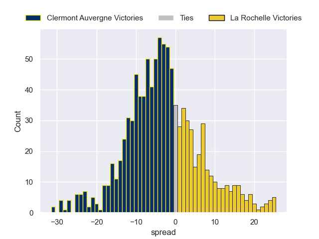

### Stade Toulousain V Pau on 2026/01/24

Average Margin: Stade Toulousain by 7.5

### Bayonne V Castres Olympique on 2026/01/24

Average Margin: Bayonne by 2.2

### Racing 92 V Lyon on 2026/01/24

Average Margin: Racing 92 by 4.9

### Bordeaux Begles V Stade Francais Paris on 2026/01/24

Average Margin: Bordeaux Begles by 6.7

### Perpignan V US Montauban on 2026/01/24

Average Margin: Perpignan by 6.6

### Toulon V Montpellier Herault on 2026/01/24

Average Margin: Toulon by 4.8

## Week 17

### Pau V Toulon on 2026/01/30

Average Margin: Pau by 3.3

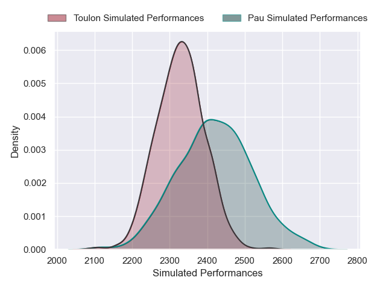

### Castres Olympique V Clermont Auvergne on 2026/01/31

Average Margin: Castres Olympique by 3.7

### Montpellier Herault V Stade Francais Paris on 2026/01/31

Average Margin: Montpellier Herault by 4.1

### US Montauban V Bordeaux Begles on 2026/01/31

Average Margin: Bordeaux Begles by 7.1

### Stade Toulousain V Bayonne on 2026/01/31

Average Margin: Stade Toulousain by 8.9

### La Rochelle V Lyon on 2026/01/31

Average Margin: La Rochelle by 7.0

### Racing 92 V Perpignan on 2026/01/31

Average Margin: Racing 92 by 6.5

## Week 18

### Perpignan V Pau on 2026/02/13

Average Margin: Pau by 0.5

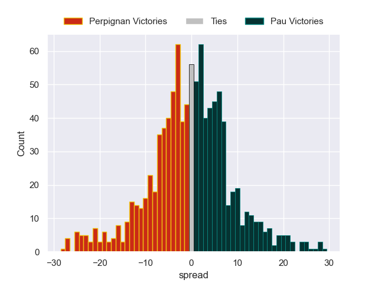

### La Rochelle V Montpellier Herault on 2026/02/13

Average Margin: La Rochelle by 5.5

### Bayonne V Racing 92 on 2026/02/13

Average Margin: Bayonne by 2.6

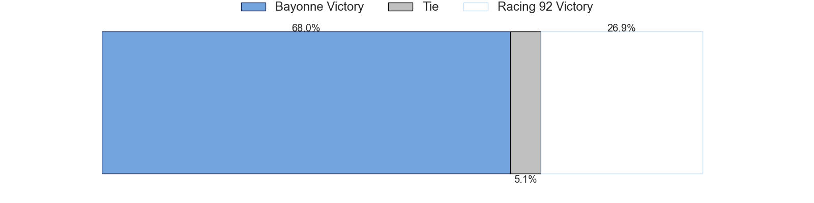
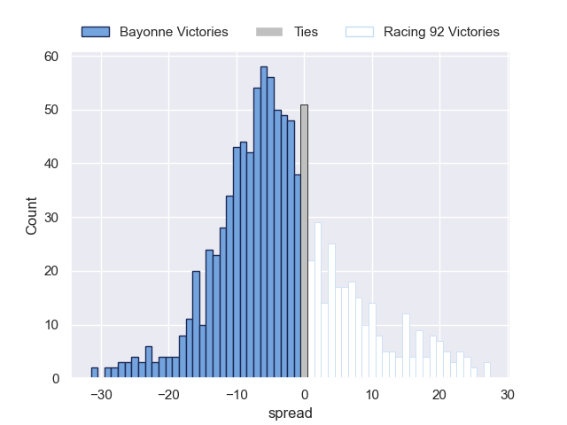

### Stade Francais Paris V Stade Toulousain on 2026/02/13

Average Margin: Stade Toulousain by 0.0

### Toulon V Clermont Auvergne on 2026/02/13

Average Margin: Toulon by 5.5

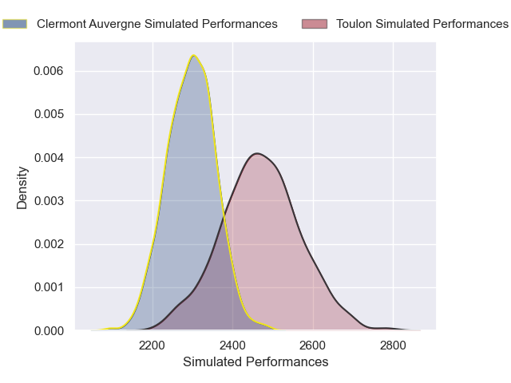
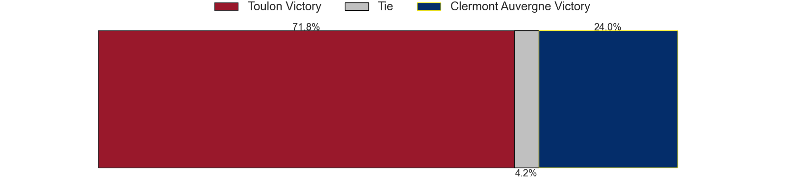
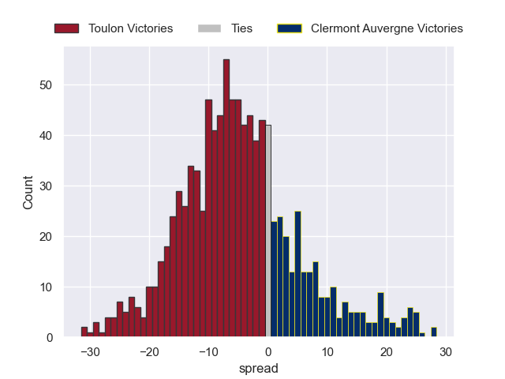

### Bordeaux Begles V Castres Olympique on 2026/02/13

Average Margin: Bordeaux Begles by 7.1

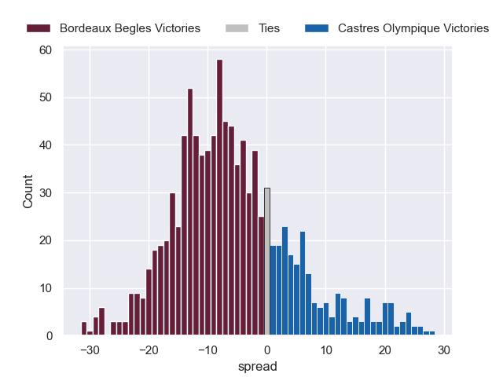

### Lyon V US Montauban on 2026/02/13

Average Margin: Lyon by 8.7

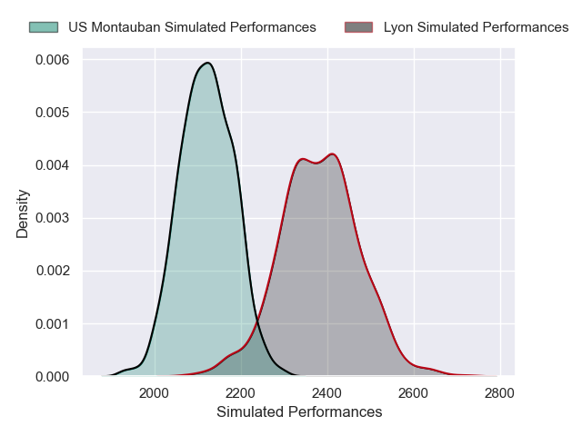

## Week 19

### Clermont Auvergne V Bayonne on 2026/02/27

Average Margin: Clermont Auvergne by 4.7

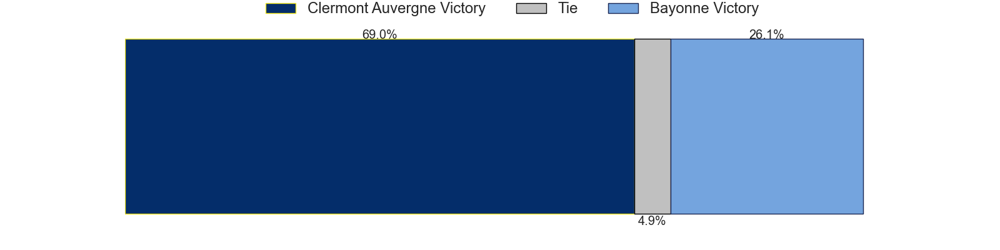

### Montpellier Herault V Racing 92 on 2026/02/27

Average Margin: Montpellier Herault by 4.3

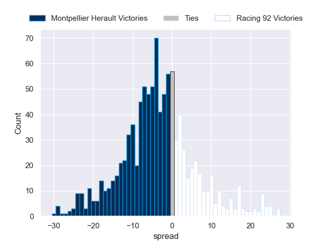

### Pau V Bordeaux Begles on 2026/02/27

Average Margin: Pau by 1.2

### Lyon V Toulon on 2026/02/27

Average Margin: Lyon by 0.9

### Stade Francais Paris V Perpignan on 2026/02/27

Average Margin: Stade Francais Paris by 8.0

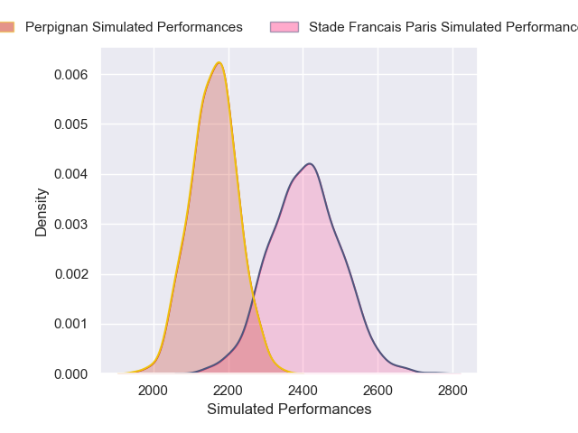

### Castres Olympique V La Rochelle on 2026/02/27

Average Margin: Castres Olympique by 1.7

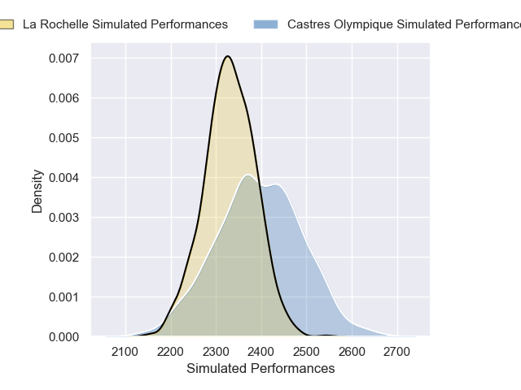

### Stade Toulousain V US Montauban on 2026/02/27

Average Margin: Stade Toulousain by 13.9

## Week 20

### Toulon V Stade Francais Paris on 2026/03/20

Average Margin: Toulon by 4.6

### Clermont Auvergne V Montpellier Herault on 2026/03/20

Average Margin: Clermont Auvergne by 3.8

### Bordeaux Begles V Stade Toulousain on 2026/03/20

Average Margin: Bordeaux Begles by 2.5

### US Montauban V Bayonne on 2026/03/20

Average Margin: Bayonne by 1.9

### Perpignan V Lyon on 2026/03/20

Average Margin: Perpignan by 2.6

### La Rochelle V Pau on 2026/03/20

Average Margin: La Rochelle by 5.2

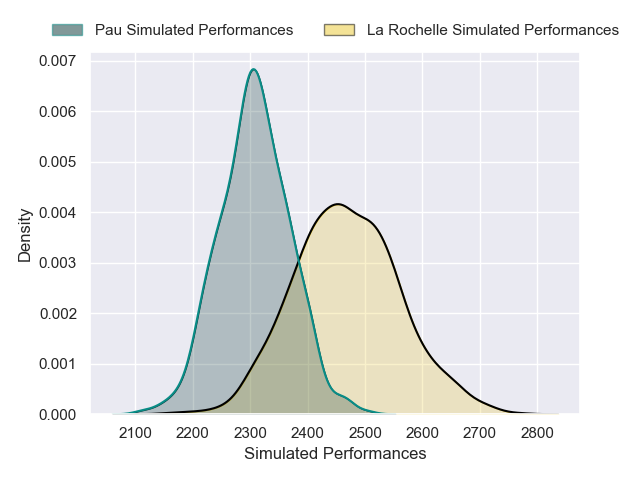

### Racing 92 V Castres Olympique on 2026/03/20

Average Margin: Racing 92 by 3.1

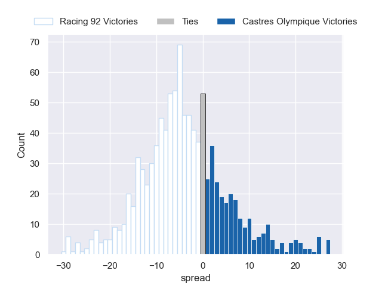

## Week 21

### Stade Francais Paris V Clermont Auvergne on 2026/03/27

Average Margin: Stade Francais Paris by 4.6

### Pau V Racing 92 on 2026/03/27

Average Margin: Pau by 4.5

### Stade Toulousain V Montpellier Herault on 2026/03/27

Average Margin: Stade Toulousain by 7.5

### Perpignan V Toulon on 2026/03/27

Average Margin: Toulon by 0.7

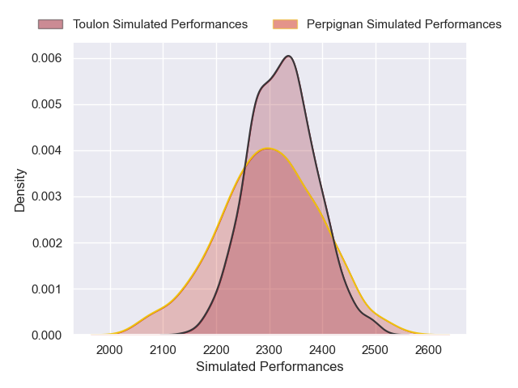

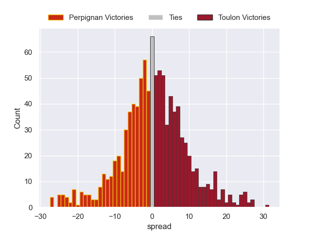

### Bayonne V La Rochelle on 2026/03/27

Average Margin: Bayonne by 1.6

### Castres Olympique V US Montauban on 2026/03/27

Average Margin: Castres Olympique by 9.2

### Lyon V Bordeaux Begles on 2026/03/27

Average Margin: Bordeaux Begles by 1.4

## Week 22

### Racing 92 V Stade Francais Paris on 2026/04/17

Average Margin: Racing 92 by 1.5

### Montpellier Herault V Perpignan on 2026/04/17

Average Margin: Montpellier Herault by 7.9

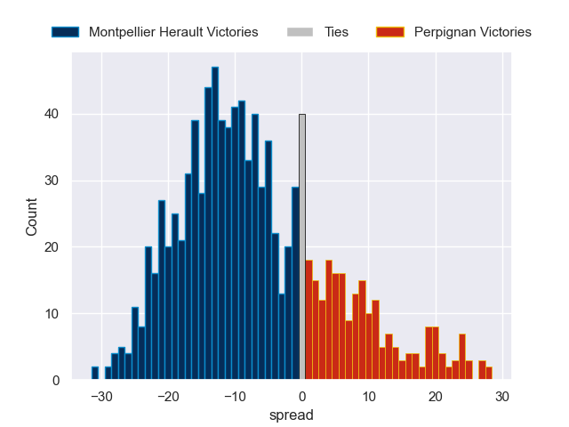

### Castres Olympique V Stade Toulousain on 2026/04/17

Average Margin: Stade Toulousain by 0.9

### Clermont Auvergne V Lyon on 2026/04/17

Average Margin: Clermont Auvergne by 5.0

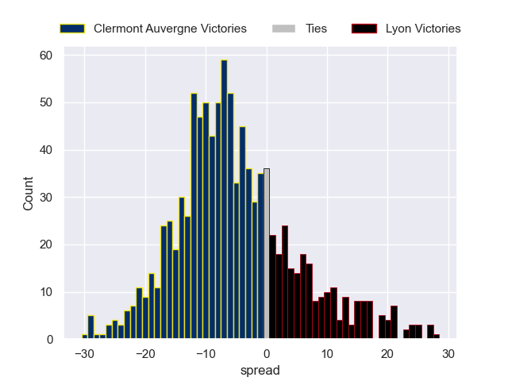

### Bayonne V Pau on 2026/04/17

Average Margin: Bayonne by 1.6

### US Montauban V Toulon on 2026/04/17

Average Margin: Toulon by 3.7

### La Rochelle V Bordeaux Begles on 2026/04/17

Average Margin: La Rochelle by 2.4

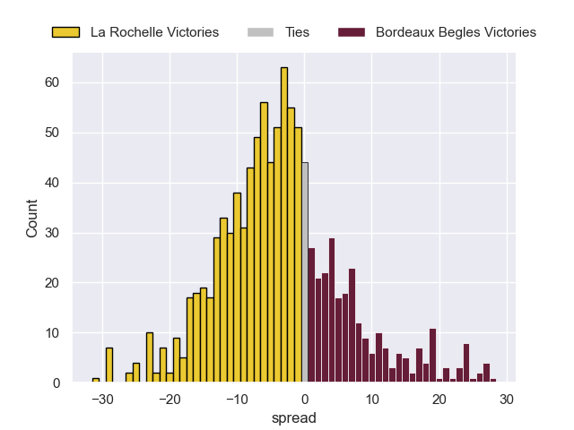

## Week 23

### Toulon V Bayonne on 2026/04/24

Average Margin: Toulon by 5.7

### Stade Toulousain V Clermont Auvergne on 2026/04/24

Average Margin: Stade Toulousain by 8.7

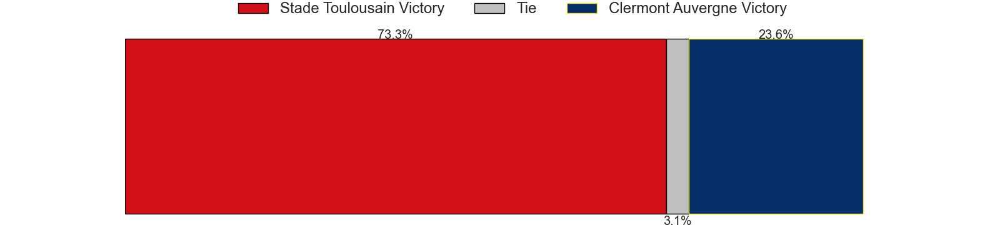

### Bordeaux Begles V Montpellier Herault on 2026/04/24

Average Margin: Bordeaux Begles by 6.0

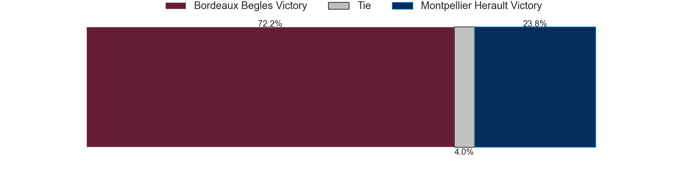

### Perpignan V La Rochelle on 2026/04/24

Average Margin: La Rochelle by 1.2

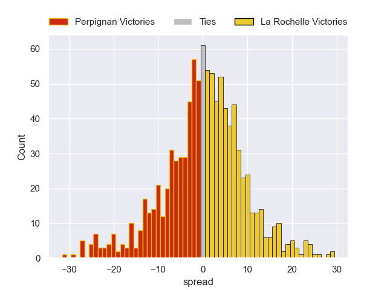

### Lyon V Castres Olympique on 2026/04/24

Average Margin: Lyon by 1.9

### Stade Francais Paris V Pau on 2026/04/24

Average Margin: Stade Francais Paris by 4.2

### US Montauban V Racing 92 on 2026/04/24

Average Margin: Racing 92 by 3.0

## Week 24

### Stade Francais Paris V Lyon on 2026/05/08

Average Margin: Stade Francais Paris by 5.5

### Bayonne V Bordeaux Begles on 2026/05/08

Average Margin: Bordeaux Begles by 0.2

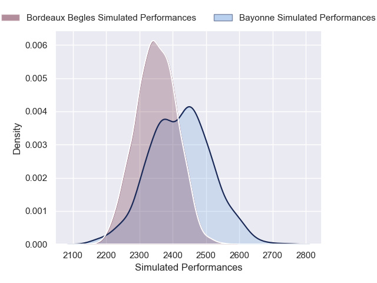

### Toulon V Stade Toulousain on 2026/05/08

Average Margin: Toulon by 1.0

### Clermont Auvergne V Perpignan on 2026/05/08

Average Margin: Clermont Auvergne by 6.9

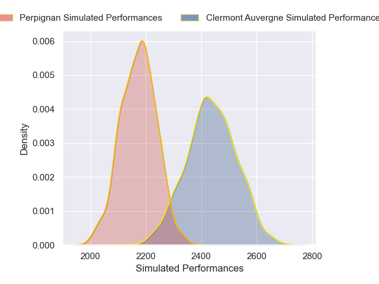

### Pau V Castres Olympique on 2026/05/08

Average Margin: Pau by 4.7

### Racing 92 V La Rochelle on 2026/05/08

Average Margin: Racing 92 by 1.4

### Montpellier Herault V US Montauban on 2026/05/08

Average Margin: Montpellier Herault by 9.8

## Week 25

### US Montauban V Stade Francais Paris on 2026/05/15

Average Margin: Stade Francais Paris by 3.3

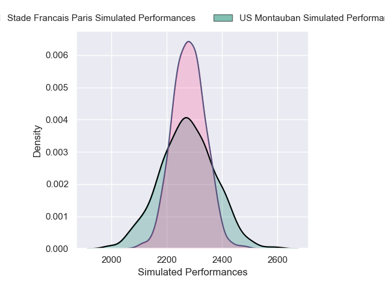

### Castres Olympique V Montpellier Herault on 2026/05/15

Average Margin: Castres Olympique by 2.3

### Bordeaux Begles V Perpignan on 2026/05/15

Average Margin: Bordeaux Begles by 9.7

### Lyon V Bayonne on 2026/05/15

Average Margin: Lyon by 3.5

### Pau V Clermont Auvergne on 2026/05/15

Average Margin: Pau by 5.0

### Racing 92 V Toulon on 2026/05/15

Average Margin: Racing 92 by 1.6

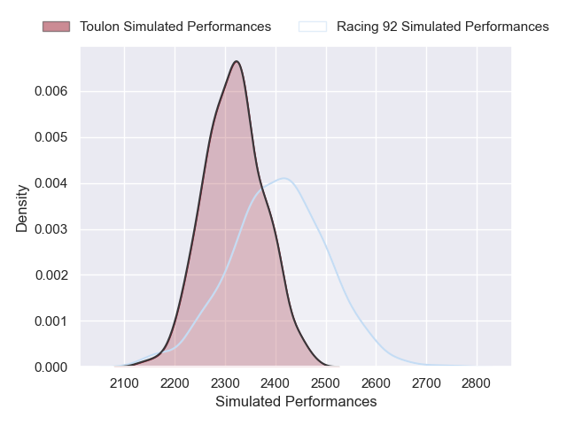

### La Rochelle V Stade Toulousain on 2026/05/15

Average Margin: La Rochelle by 1.8

## Week 26

### Clermont Auvergne V Racing 92 on 2026/05/29

Average Margin: Clermont Auvergne by 3.3

### Stade Toulousain V Lyon on 2026/05/29

Average Margin: Stade Toulousain by 8.7

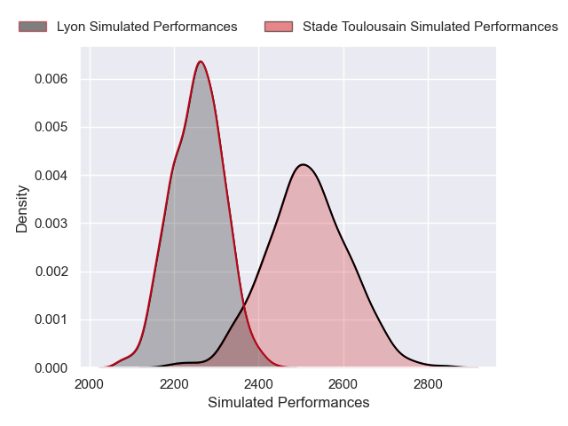

### Toulon V Bordeaux Begles on 2026/05/29

Average Margin: Toulon by 1.9

### US Montauban V La Rochelle on 2026/05/29

Average Margin: La Rochelle by 3.9

### Montpellier Herault V Pau on 2026/05/29

Average Margin: Montpellier Herault by 3.9

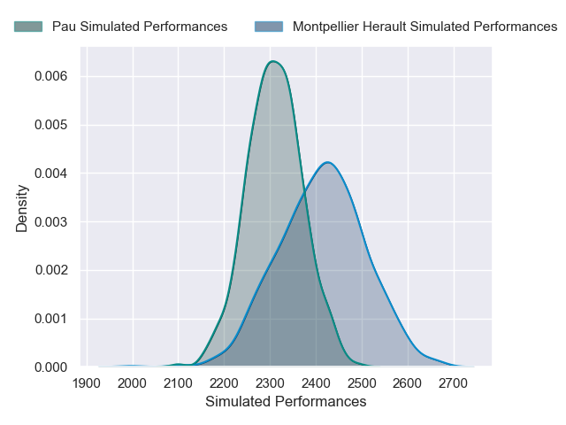

### Perpignan V Castres Olympique on 2026/05/29

Average Margin: Perpignan by 0.5

### Stade Francais Paris V Bayonne on 2026/05/29

Average Margin: Stade Francais Paris by 5.3

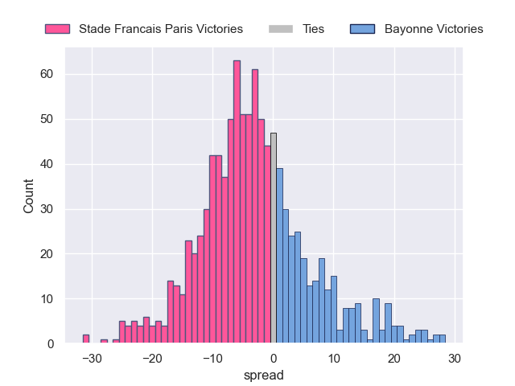

## Week 27

### Lyon V Montpellier Herault on 2026/06/06

Average Margin: Lyon by 1.9

### La Rochelle V Stade Francais Paris on 2026/06/06

Average Margin: La Rochelle by 5.1

### Bayonne V Perpignan on 2026/06/06

Average Margin: Bayonne by 6.1

### Castres Olympique V Toulon on 2026/06/06

Average Margin: Castres Olympique by 2.7

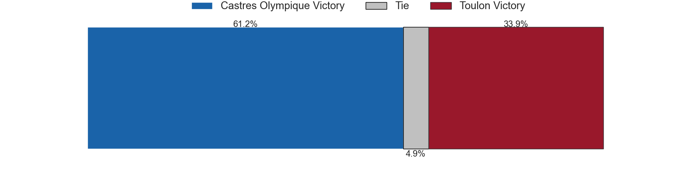

### Racing 92 V Stade Toulousain on 2026/06/06

Average Margin: Stade Toulousain by 1.1

### Pau V US Montauban on 2026/06/06

Average Margin: Pau by 9.8

### Bordeaux Begles V Clermont Auvergne on 2026/06/06

Average Margin: Bordeaux Begles by 6.5

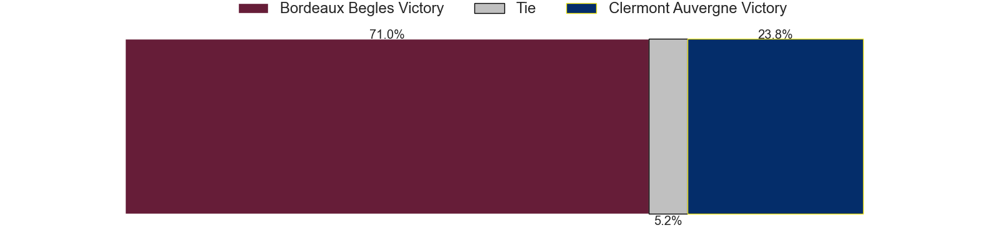

