# Team Rankings

# Standings

## Current Standings

| Club                 |   Played |   Wins |   Point Differential |   Losing Bonus Points |   Try Bonus Points |   Competition Points |
|:---------------------|---------:|-------:|---------------------:|----------------------:|-------------------:|---------------------:|
| Stade Toulousain     |       14 |     10 |                  248 |                     2 |                 10 |                   52 |
| Pau                  |       14 |     10 |                   92 |                     2 |                  7 |                   49 |
| Bordeaux Begles      |       14 |      8 |                   95 |                     2 |                  8 |                   42 |
| Stade Francais Paris |       14 |      7 |                   80 |                     4 |                  8 |                   42 |
| Toulon               |       15 |      8 |                  -34 |                     1 |                  7 |                   42 |
| Clermont Auvergne    |       14 |      8 |                   86 |                     1 |                  8 |                   41 |
| Montpellier Herault  |       14 |      7 |                  103 |                     4 |                  6 |                   40 |
| La Rochelle          |       15 |      7 |                   94 |                     3 |                  7 |                   40 |
| Castres Olympique    |       14 |      7 |                  -48 |                     4 |                  6 |                   38 |
| Racing 92            |       14 |      7 |                  -32 |                     1 |                  5 |                   36 |
| Bayonne              |       14 |      8 |                  -76 |                     0 |                  4 |                   36 |
| Lyon                 |       14 |      6 |                  -61 |                     1 |                  4 |                   29 |
| Perpignan            |       14 |      2 |                 -179 |                     3 |                  1 |                   12 |
| US Montauban         |       14 |      1 |                 -368 |                     2 |                  4 |                   12 |

## Projected Remaining Table

| Club                 |   To Play |   Projected Wins |   Projected Differential |   Projected Losing Bonus Points | Projected Try Bonus Points   |   Projected Competition Points |
|:---------------------|----------:|-----------------:|-------------------------:|--------------------------------:|:-----------------------------|-------------------------------:|
| Stade Toulousain     |        12 |            7.292 |                   58.314 |                           2.536 |                              |                         32.79  |
| Bordeaux Begles      |        12 |            7.243 |                   43.018 |                           2.48  |                              |                         32.62  |
| Toulon               |        12 |            6.762 |                   22.695 |                           2.744 |                              |                         31.038 |
| La Rochelle          |        12 |            6.651 |                   19.52  |                           2.837 |                              |                         30.705 |
| Racing 92            |        12 |            5.972 |                    6.694 |                           3.025 |                              |                         28.135 |
| Pau                  |        12 |            5.978 |                    5.936 |                           2.68  |                              |                         27.726 |
| Stade Francais Paris |        12 |            6.021 |                    7.881 |                           2.627 |                              |                         27.719 |
| Castres Olympique    |        12 |            5.641 |                    1.946 |                           3.106 |                              |                         26.998 |
| Montpellier Herault  |        12 |            5.504 |                    1.353 |                           2.749 |                              |                         25.781 |
| Bayonne              |        12 |            5.373 |                  -14.727 |                           2.85  |                              |                         25.536 |
| Clermont Auvergne    |        12 |            5.499 |                  -11.247 |                           2.429 |                              |                         25.403 |
| Lyon                 |        12 |            4.86  |                  -20.356 |                           2.954 |                              |                         23.556 |
| Perpignan            |        12 |            4.263 |                  -38.454 |                           2.836 |                              |                         20.99  |
| US Montauban         |        12 |            2.992 |                  -82.573 |                           2.718 |                              |                         15.574 |

## Projected Total Table

| Club                 |   Played |   Wins |   Point Differential |   Losing Bonus Points |   Try Bonus Points |   Competition Points |
|:---------------------|---------:|-------:|---------------------:|----------------------:|-------------------:|---------------------:|
| Stade Toulousain     |       26 | 17.292 |              306.314 |                 4.536 |                 10 |               84.79  |
| Pau                  |       26 | 15.978 |               97.936 |                 4.68  |                  7 |               76.726 |
| Bordeaux Begles      |       26 | 15.243 |              138.018 |                 4.48  |                  8 |               74.62  |
| Toulon               |       27 | 14.762 |              -11.305 |                 3.744 |                  7 |               73.038 |
| La Rochelle          |       27 | 13.651 |              113.52  |                 5.837 |                  7 |               70.705 |
| Stade Francais Paris |       26 | 13.021 |               87.881 |                 6.627 |                  8 |               69.719 |
| Clermont Auvergne    |       26 | 13.499 |               74.753 |                 3.429 |                  8 |               66.403 |
| Montpellier Herault  |       26 | 12.504 |              104.353 |                 6.749 |                  6 |               65.781 |
| Castres Olympique    |       26 | 12.641 |              -46.054 |                 7.106 |                  6 |               64.998 |
| Racing 92            |       26 | 12.972 |              -25.306 |                 4.025 |                  5 |               64.135 |
| Bayonne              |       26 | 13.373 |              -90.727 |                 2.85  |                  4 |               61.536 |
| Lyon                 |       26 | 10.86  |              -81.356 |                 3.954 |                  4 |               52.556 |
| Perpignan            |       26 |  6.263 |             -217.454 |                 5.836 |                  1 |               32.99  |
| US Montauban         |       26 |  3.992 |             -450.573 |                 4.718 |                  4 |               27.574 |

# Completed Match Review

| Model | Percent Correct Predictions | Spread Error |
| ------ | ------ | ------ |
| Club Level | 76.0% | 10.9 |
| Player Level: Lineup | nan% | nan |
| Player Level: Minutes | nan% | nan |

# Future Predictions

## Week 16

### Stade Toulousain V Pau on 2026/01/24

Average Margin: Stade Toulousain by 8.9

### Bordeaux Begles V Stade Francais Paris on 2026/01/24

Average Margin: Bordeaux Begles by 7.0

### Toulon V Montpellier Herault on 2026/01/24

Average Margin: Toulon by 4.9

### Racing 92 V Lyon on 2026/01/24

Average Margin: Racing 92 by 5.0

### Bayonne V Castres Olympique on 2026/01/24

Average Margin: Bayonne by 2.5

### Perpignan V US Montauban on 2026/01/24

Average Margin: Perpignan by 7.3

### Clermont Auvergne V La Rochelle on 2026/01/25

Average Margin: Clermont Auvergne by 1.8

## Week 17

### Pau V Toulon on 2026/01/30

Average Margin: Pau by 2.4

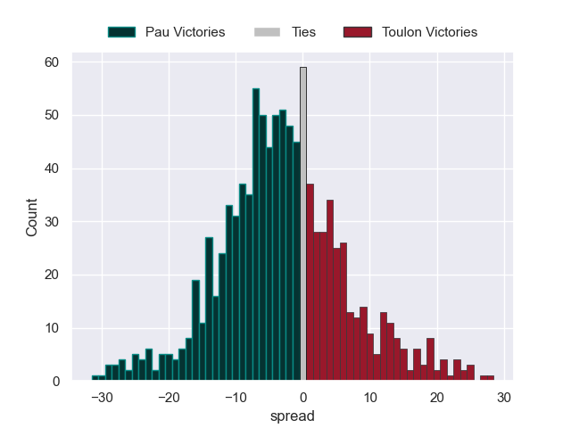

### US Montauban V Bordeaux Begles on 2026/01/31

Average Margin: Bordeaux Begles by 7.4

### Castres Olympique V Clermont Auvergne on 2026/01/31

Average Margin: Castres Olympique by 3.8

### Racing 92 V Perpignan on 2026/01/31

Average Margin: Racing 92 by 6.7

### La Rochelle V Lyon on 2026/01/31

Average Margin: La Rochelle by 6.8

### Stade Toulousain V Bayonne on 2026/01/31

Average Margin: Stade Toulousain by 10.9

### Montpellier Herault V Stade Francais Paris on 2026/01/31

Average Margin: Montpellier Herault by 3.8

## Week 18

### Bordeaux Begles V Castres Olympique on 2026/02/13

Average Margin: Bordeaux Begles by 6.8

### Bayonne V Racing 92 on 2026/02/13

Average Margin: Bayonne by 2.8

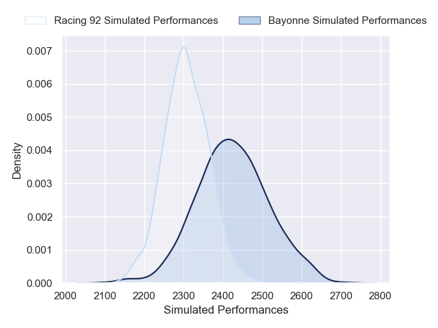

### Stade Francais Paris V Stade Toulousain on 2026/02/13

Average Margin: Stade Toulousain by 0.4

### Toulon V Clermont Auvergne on 2026/02/13

Average Margin: Toulon by 5.8

### Perpignan V Pau on 2026/02/13

Average Margin: Pau by 0.5

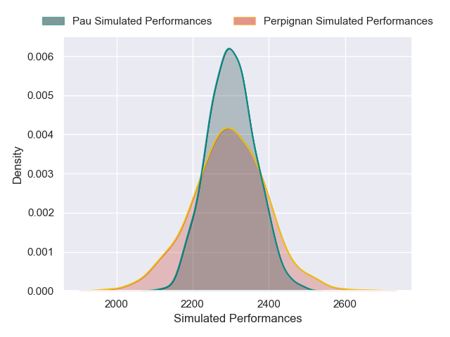

### Lyon V US Montauban on 2026/02/13

Average Margin: Lyon by 8.5

### La Rochelle V Montpellier Herault on 2026/02/13

Average Margin: La Rochelle by 4.5

## Week 19

### Clermont Auvergne V Bayonne on 2026/02/27

Average Margin: Clermont Auvergne by 4.7

### Lyon V Toulon on 2026/02/27

Average Margin: Lyon by 0.5

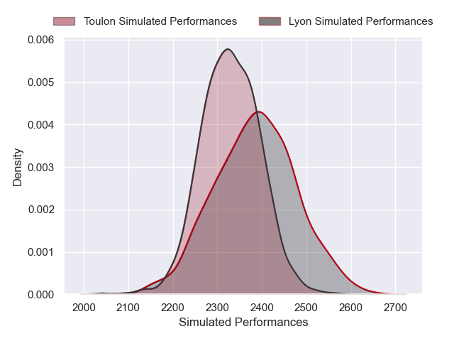

### Castres Olympique V La Rochelle on 2026/02/27

Average Margin: Castres Olympique by 2.8

### Pau V Bordeaux Begles on 2026/02/27

Average Margin: Pau by 0.7

### Stade Toulousain V US Montauban on 2026/02/27

Average Margin: Stade Toulousain by 14.4

### Stade Francais Paris V Perpignan on 2026/02/27

Average Margin: Stade Francais Paris by 8.1

### Montpellier Herault V Racing 92 on 2026/02/27

Average Margin: Montpellier Herault by 5.2

## Week 20

### La Rochelle V Pau on 2026/03/20

Average Margin: La Rochelle by 4.1

### US Montauban V Bayonne on 2026/03/20

Average Margin: Bayonne by 1.8

### Racing 92 V Castres Olympique on 2026/03/20

Average Margin: Racing 92 by 3.0

### Toulon V Stade Francais Paris on 2026/03/20

Average Margin: Toulon by 4.7

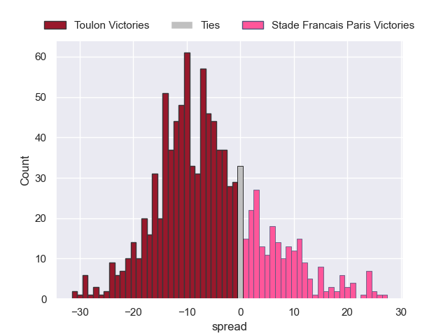

### Clermont Auvergne V Montpellier Herault on 2026/03/20

Average Margin: Clermont Auvergne by 3.1

### Perpignan V Lyon on 2026/03/20

Average Margin: Perpignan by 2.2

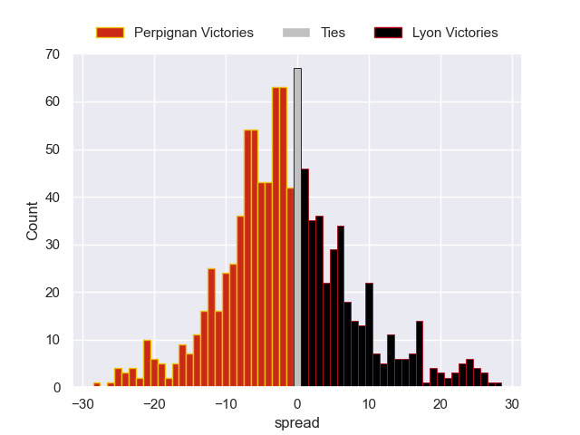

### Bordeaux Begles V Stade Toulousain on 2026/03/20

Average Margin: Bordeaux Begles by 2.4

## Week 21

### Pau V Racing 92 on 2026/03/27

Average Margin: Pau by 4.2

### Stade Francais Paris V Clermont Auvergne on 2026/03/27

Average Margin: Stade Francais Paris by 4.9

### Castres Olympique V US Montauban on 2026/03/27

Average Margin: Castres Olympique by 9.5

### Bayonne V La Rochelle on 2026/03/27

Average Margin: Bayonne by 1.5

### Perpignan V Toulon on 2026/03/27

Average Margin: Toulon by 1.0

### Lyon V Bordeaux Begles on 2026/03/27

Average Margin: Bordeaux Begles by 1.3

### Stade Toulousain V Montpellier Herault on 2026/03/27

Average Margin: Stade Toulousain by 6.7

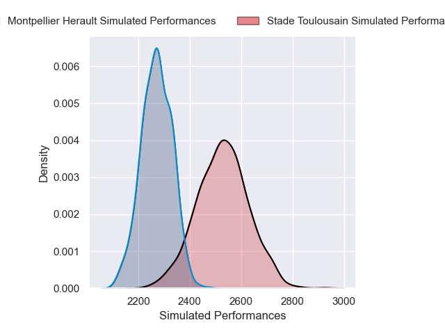
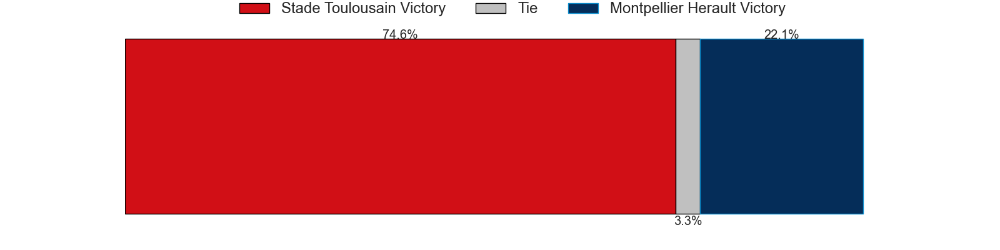

## Week 22

### Montpellier Herault V Perpignan on 2026/04/17

Average Margin: Montpellier Herault by 8.7

### Racing 92 V Stade Francais Paris on 2026/04/17

Average Margin: Racing 92 by 2.4

### Castres Olympique V Stade Toulousain on 2026/04/17

Average Margin: Stade Toulousain by 1.2

### US Montauban V Toulon on 2026/04/17

Average Margin: Toulon by 4.1

### Bayonne V Pau on 2026/04/17

Average Margin: Bayonne by 1.3

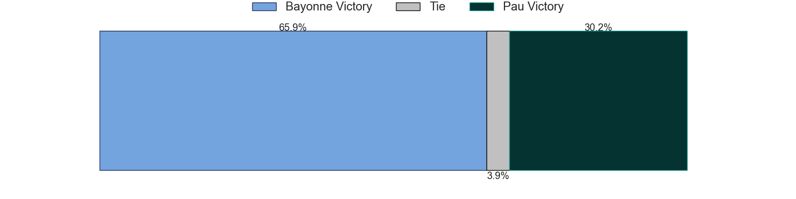

### Clermont Auvergne V Lyon on 2026/04/17

Average Margin: Clermont Auvergne by 5.4

### La Rochelle V Bordeaux Begles on 2026/04/17

Average Margin: La Rochelle by 2.4

## Week 23

### Perpignan V La Rochelle on 2026/04/24

Average Margin: La Rochelle by 0.8

### Toulon V Bayonne on 2026/04/24

Average Margin: Toulon by 6.2

### US Montauban V Racing 92 on 2026/04/24

Average Margin: Racing 92 by 2.4

### Stade Francais Paris V Pau on 2026/04/24

Average Margin: Stade Francais Paris by 3.4

### Stade Toulousain V Clermont Auvergne on 2026/04/24

Average Margin: Stade Toulousain by 9.2

### Bordeaux Begles V Montpellier Herault on 2026/04/24

Average Margin: Bordeaux Begles by 6.3

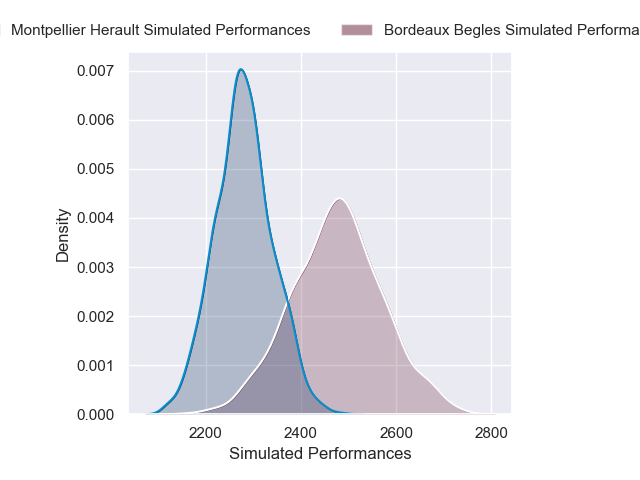

### Lyon V Castres Olympique on 2026/04/24

Average Margin: Lyon by 1.9

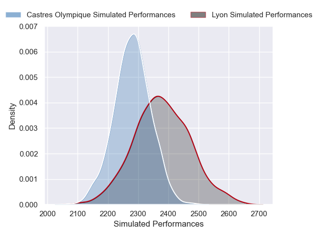

## Week 24

### Stade Francais Paris V Lyon on 2026/05/08

Average Margin: Stade Francais Paris by 5.8

### Racing 92 V La Rochelle on 2026/05/08

Average Margin: Racing 92 by 1.7

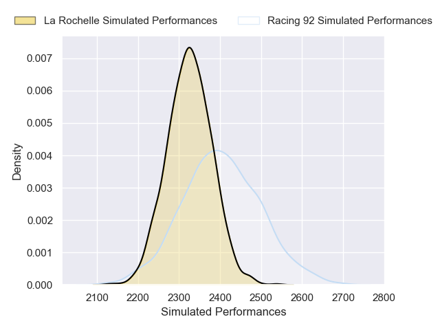

### Montpellier Herault V US Montauban on 2026/05/08

Average Margin: Montpellier Herault by 9.9

### Pau V Castres Olympique on 2026/05/08

Average Margin: Pau by 4.0

### Toulon V Stade Toulousain on 2026/05/08

Average Margin: Toulon by 1.3

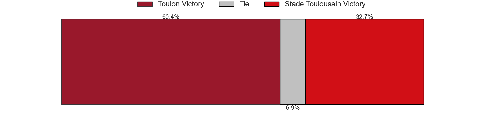

### Bayonne V Bordeaux Begles on 2026/05/08

Average Margin: Bordeaux Begles by 0.1

### Clermont Auvergne V Perpignan on 2026/05/08

Average Margin: Clermont Auvergne by 6.8

## Week 25

### La Rochelle V Stade Toulousain on 2026/05/15

Average Margin: La Rochelle by 0.3

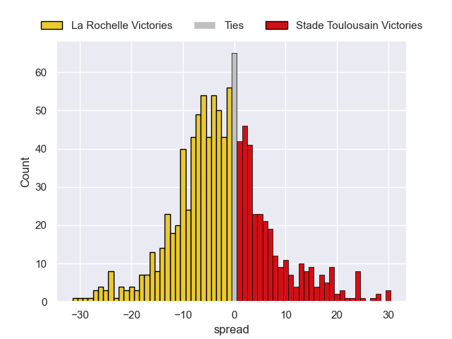

### Racing 92 V Toulon on 2026/05/15

Average Margin: Racing 92 by 1.8

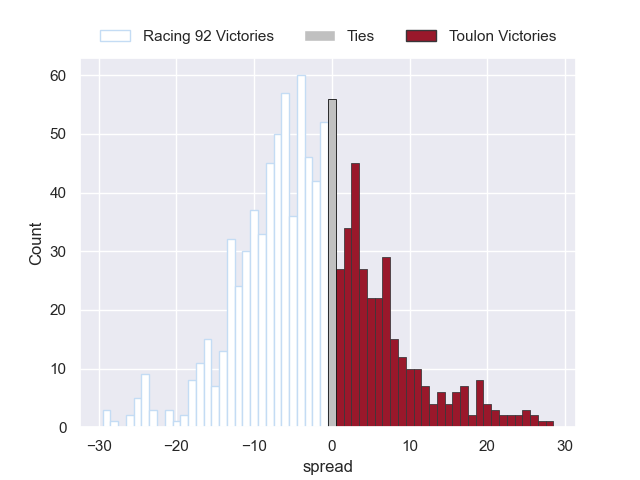

### US Montauban V Stade Francais Paris on 2026/05/15

Average Margin: Stade Francais Paris by 3.4

### Castres Olympique V Montpellier Herault on 2026/05/15

Average Margin: Castres Olympique by 2.8

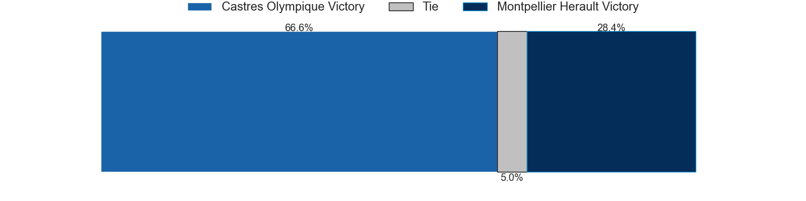
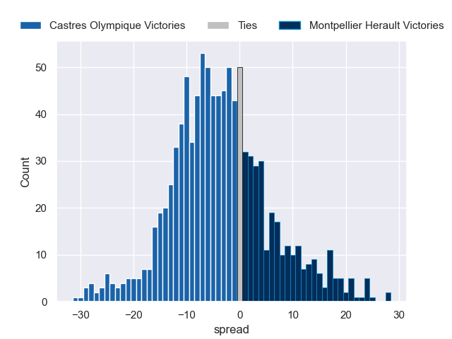

### Lyon V Bayonne on 2026/05/15

Average Margin: Lyon by 3.0

### Bordeaux Begles V Perpignan on 2026/05/15

Average Margin: Bordeaux Begles by 10.1

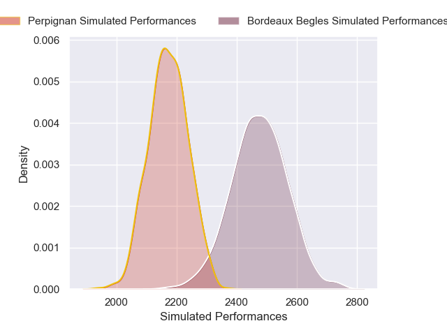

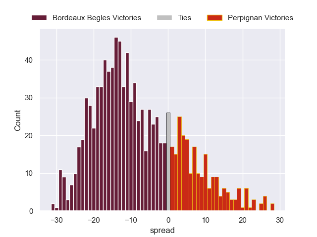

### Pau V Clermont Auvergne on 2026/05/15

Average Margin: Pau by 5.5

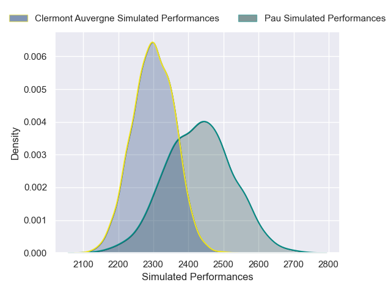

## Week 26

### US Montauban V La Rochelle on 2026/05/29

Average Margin: La Rochelle by 3.7

### Clermont Auvergne V Racing 92 on 2026/05/29

Average Margin: Clermont Auvergne by 2.9

### Toulon V Bordeaux Begles on 2026/05/29

Average Margin: Toulon by 2.1

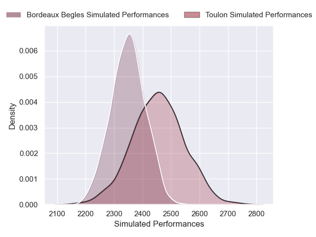
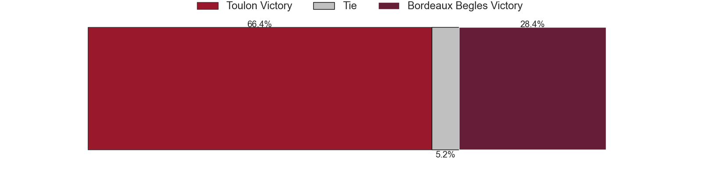

### Perpignan V Castres Olympique on 2026/05/29

Average Margin: Perpignan by 0.1

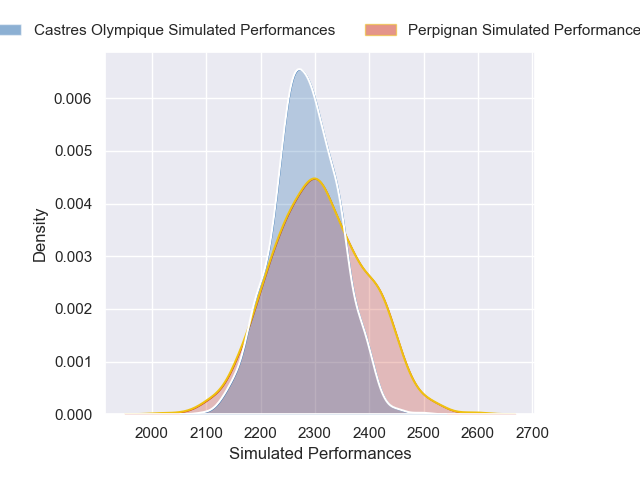

### Stade Toulousain V Lyon on 2026/05/29

Average Margin: Stade Toulousain by 9.5

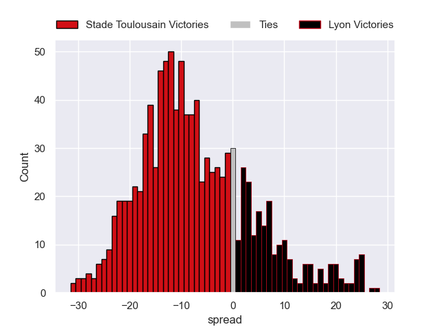

### Stade Francais Paris V Bayonne on 2026/05/29

Average Margin: Stade Francais Paris by 5.1

### Montpellier Herault V Pau on 2026/05/29

Average Margin: Montpellier Herault by 3.7

## Week 27

### Racing 92 V Stade Toulousain on 2026/06/06

Average Margin: Stade Toulousain by 1.2

### Pau V US Montauban on 2026/06/06

Average Margin: Pau by 10.2

### Bayonne V Perpignan on 2026/06/06

Average Margin: Bayonne by 5.4

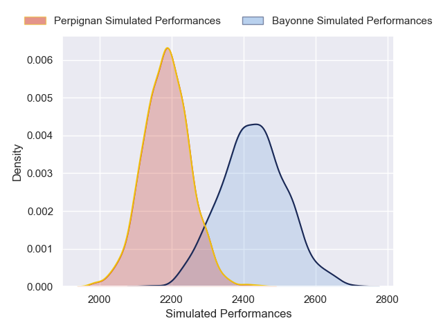
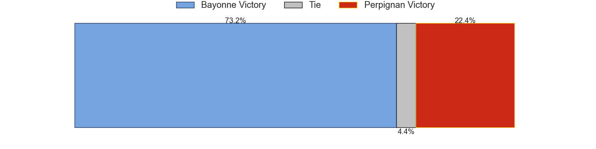
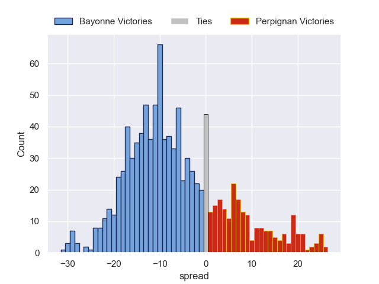

### Lyon V Montpellier Herault on 2026/06/06

Average Margin: Lyon by 1.8

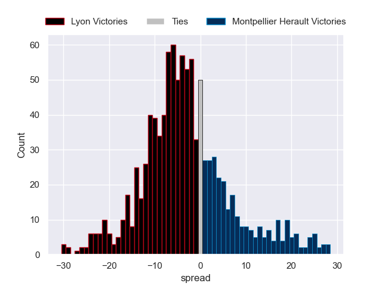

### Bordeaux Begles V Clermont Auvergne on 2026/06/06

Average Margin: Bordeaux Begles by 6.8

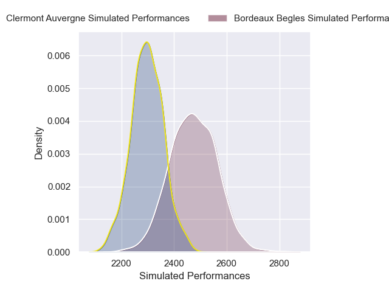

### Castres Olympique V Toulon on 2026/06/06

Average Margin: Castres Olympique by 2.6

### La Rochelle V Stade Francais Paris on 2026/06/06

Average Margin: La Rochelle by 4.8

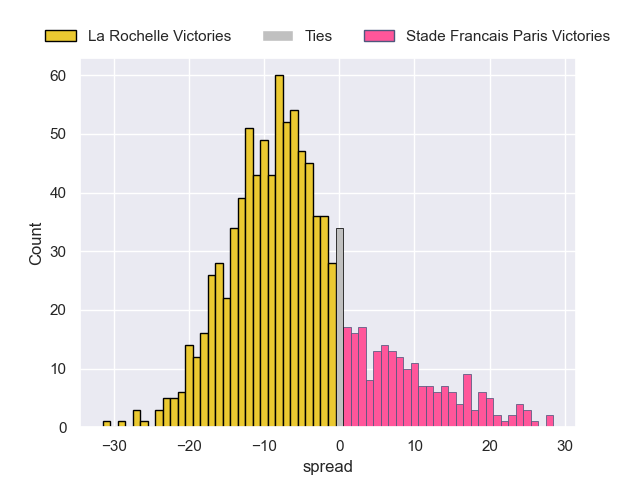

