# Team Rankings

# Standings

## Current Standings

| Club                 |   Played |   Wins |   Point Differential |   Losing Bonus Points |   Try Bonus Points |   Competition Points |
|:---------------------|---------:|-------:|---------------------:|----------------------:|-------------------:|---------------------:|
| Stade Toulousain     |       15 |     11 |                  285 |                     2 |                 11 |                   57 |
| Pau                  |       15 |     10 |                   55 |                     2 |                  7 |                   49 |
| Stade Francais Paris |       15 |      8 |                   85 |                     4 |                  9 |                   47 |
| Clermont Auvergne    |       15 |      9 |                   91 |                     1 |                  9 |                   46 |
| Toulon               |       16 |      9 |                  -31 |                     1 |                  7 |                   46 |
| Bordeaux Begles      |       15 |      8 |                   90 |                     3 |                  9 |                   44 |
| Castres Olympique    |       15 |      8 |                  -45 |                     4 |                  6 |                   42 |
| Montpellier Herault  |       15 |      7 |                  100 |                     5 |                  6 |                   41 |
| La Rochelle          |       16 |      7 |                   89 |                     4 |                  7 |                   41 |
| Racing 92            |       15 |      8 |                  -31 |                     1 |                  6 |                   41 |
| Bayonne              |       15 |      8 |                  -79 |                     1 |                  4 |                   37 |
| Lyon                 |       15 |      6 |                  -62 |                     2 |                  5 |                   31 |
| Perpignan            |       15 |      3 |                 -156 |                     3 |                  2 |                   17 |
| US Montauban         |       15 |      1 |                 -391 |                     2 |                  4 |                   12 |

## Projected Remaining Table

| Club                 |   To Play |   Projected Wins |   Projected Differential |   Projected Losing Bonus Points | Projected Try Bonus Points   |   Projected Competition Points |
|:---------------------|----------:|-----------------:|-------------------------:|--------------------------------:|:-----------------------------|-------------------------------:|
| Stade Toulousain     |        11 |            6.668 |                   50.995 |                           2.278 |                              |                         29.932 |
| Bordeaux Begles      |        11 |            6.458 |                   33.738 |                           2.381 |                              |                         29.271 |
| La Rochelle          |        11 |            6.292 |                   22.846 |                           2.508 |                              |                         28.846 |
| Toulon               |        11 |            5.96  |                   17.463 |                           2.662 |                              |                         27.71  |
| Stade Francais Paris |        11 |            5.859 |                   18.157 |                           2.5   |                              |                         26.876 |
| Pau                  |        11 |            5.65  |                   12.114 |                           2.585 |                              |                         26.199 |
| Castres Olympique    |        11 |            5.415 |                    6.626 |                           2.746 |                              |                         25.504 |
| Montpellier Herault  |        11 |            5.358 |                    7.751 |                           2.423 |                              |                         24.719 |
| Racing 92            |        11 |            5.084 |                   -2.428 |                           2.985 |                              |                         24.431 |
| Clermont Auvergne    |        11 |            4.949 |                  -11.783 |                           2.209 |                              |                         22.767 |
| Bayonne              |        11 |            4.716 |                  -19.224 |                           2.577 |                              |                         22.441 |
| Lyon                 |        11 |            4.641 |                  -14.976 |                           2.631 |                              |                         22.329 |
| Perpignan            |        11 |            3.749 |                  -42.25  |                           2.663 |                              |                         18.597 |
| US Montauban         |        11 |            2.702 |                  -79.029 |                           2.55  |                              |                         14.076 |

## Projected Total Table

| Club                 |   Played |   Wins |   Point Differential |   Losing Bonus Points |   Try Bonus Points |   Competition Points |
|:---------------------|---------:|-------:|---------------------:|----------------------:|-------------------:|---------------------:|
| Stade Toulousain     |       26 | 17.668 |              335.995 |                 4.278 |                 11 |               86.932 |
| Pau                  |       26 | 15.65  |               67.114 |                 4.585 |                  7 |               75.199 |
| Stade Francais Paris |       26 | 13.859 |              103.157 |                 6.5   |                  9 |               73.876 |
| Toulon               |       27 | 14.96  |              -13.537 |                 3.662 |                  7 |               73.71  |
| Bordeaux Begles      |       26 | 14.458 |              123.738 |                 5.381 |                  9 |               73.271 |
| La Rochelle          |       27 | 13.292 |              111.846 |                 6.508 |                  7 |               69.846 |
| Clermont Auvergne    |       26 | 13.949 |               79.217 |                 3.209 |                  9 |               68.767 |
| Castres Olympique    |       26 | 13.415 |              -38.374 |                 6.746 |                  6 |               67.504 |
| Montpellier Herault  |       26 | 12.358 |              107.751 |                 7.423 |                  6 |               65.719 |
| Racing 92            |       26 | 13.084 |              -33.428 |                 3.985 |                  6 |               65.431 |
| Bayonne              |       26 | 12.716 |              -98.224 |                 3.577 |                  4 |               59.441 |
| Lyon                 |       26 | 10.641 |              -76.976 |                 4.631 |                  5 |               53.329 |
| Perpignan            |       26 |  6.749 |             -198.25  |                 5.663 |                  2 |               35.597 |
| US Montauban         |       26 |  3.702 |             -470.029 |                 4.55  |                  4 |               26.076 |

# Completed Match Review

| Model | Percent Correct Predictions | Spread Error |
| ------ | ------ | ------ |
| Club Level | 77.0% | 11.1 |
| Player Level: Lineup | nan% | nan |
| Player Level: Minutes | nan% | nan |

# Future Predictions

## Week 17

### US Montauban V Bordeaux Begles on 2026/01/31

Average Margin: Bordeaux Begles by 7.5

### Stade Toulousain V Bayonne on 2026/01/31

Average Margin: Stade Toulousain by 10.6

### Castres Olympique V Clermont Auvergne on 2026/01/31

Average Margin: Castres Olympique by 4.1

### Racing 92 V Perpignan on 2026/01/31

Average Margin: Racing 92 by 5.9

### La Rochelle V Lyon on 2026/01/31

Average Margin: La Rochelle by 6.9

### Montpellier Herault V Stade Francais Paris on 2026/01/31

Average Margin: Montpellier Herault by 4.1

### Pau V Toulon on 2026/02/01

Average Margin: Pau by 2.6

## Week 18

### Stade Francais Paris V Stade Toulousain on 2026/02/13

Average Margin: Stade Toulousain by 0.3

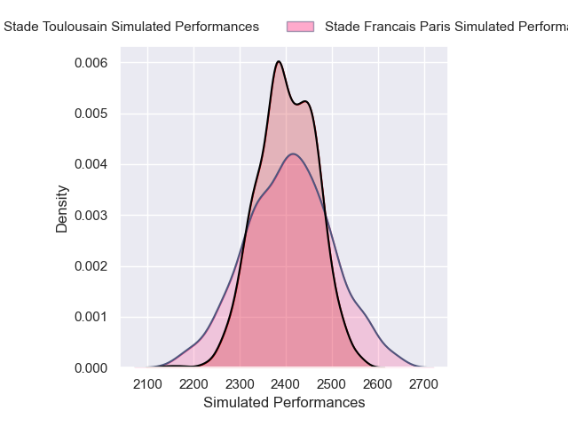

### Perpignan V Pau on 2026/02/14

Average Margin: Perpignan by 0.1

### Lyon V US Montauban on 2026/02/14

Average Margin: Lyon by 9.0

### La Rochelle V Montpellier Herault on 2026/02/14

Average Margin: La Rochelle by 4.6

### Toulon V Clermont Auvergne on 2026/02/14

Average Margin: Toulon by 6.3

### Bordeaux Begles V Castres Olympique on 2026/02/14

Average Margin: Bordeaux Begles by 6.2

### Bayonne V Racing 92 on 2026/02/14

Average Margin: Bayonne by 3.0

## Week 19

### Stade Toulousain V US Montauban on 2026/02/27

Average Margin: Stade Toulousain by 14.7

### Lyon V Toulon on 2026/02/27

Average Margin: Lyon by 0.4

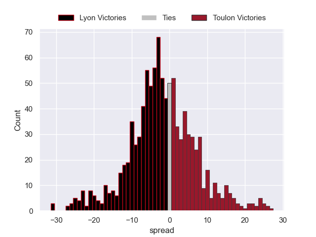

### Clermont Auvergne V Bayonne on 2026/02/27

Average Margin: Clermont Auvergne by 5.3

### Castres Olympique V La Rochelle on 2026/02/27

Average Margin: Castres Olympique by 2.3

### Pau V Bordeaux Begles on 2026/02/27

Average Margin: Pau by 0.7

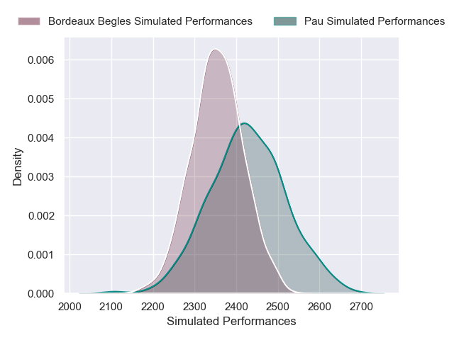

### Stade Francais Paris V Perpignan on 2026/02/27

Average Margin: Stade Francais Paris by 7.9

### Montpellier Herault V Racing 92 on 2026/02/27

Average Margin: Montpellier Herault by 5.3

## Week 20

### US Montauban V Bayonne on 2026/03/20

Average Margin: Bayonne by 1.9

### Toulon V Stade Francais Paris on 2026/03/20

Average Margin: Toulon by 4.6

### Perpignan V Lyon on 2026/03/20

Average Margin: Perpignan by 2.4

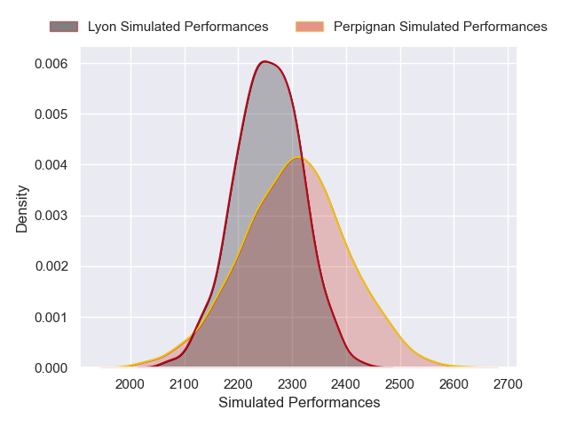

### Clermont Auvergne V Montpellier Herault on 2026/03/20

Average Margin: Clermont Auvergne by 3.1

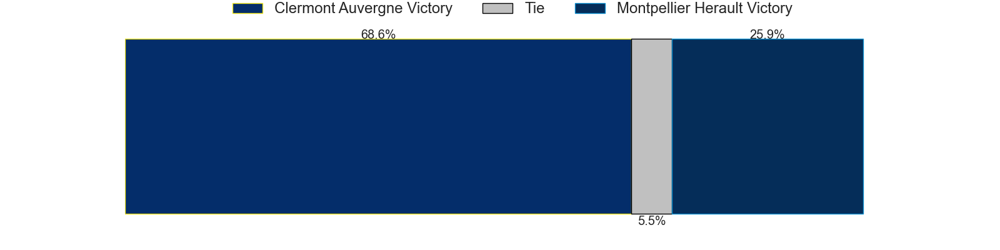

### Racing 92 V Castres Olympique on 2026/03/20

Average Margin: Racing 92 by 2.4

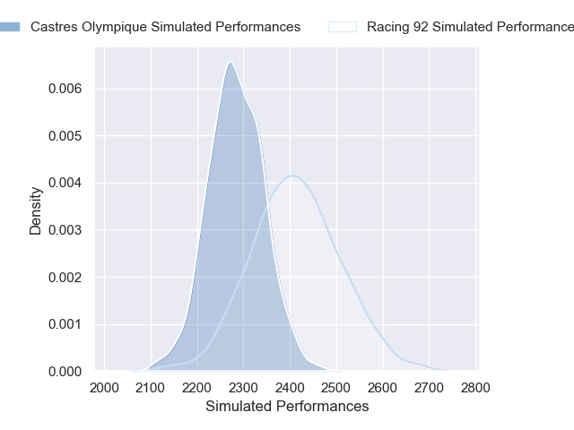

### Bordeaux Begles V Stade Toulousain on 2026/03/20

Average Margin: Bordeaux Begles by 1.4

### La Rochelle V Pau on 2026/03/20

Average Margin: La Rochelle by 4.7

## Week 21

### Perpignan V Toulon on 2026/03/27

Average Margin: Toulon by 1.1

### Lyon V Bordeaux Begles on 2026/03/27

Average Margin: Bordeaux Begles by 0.8

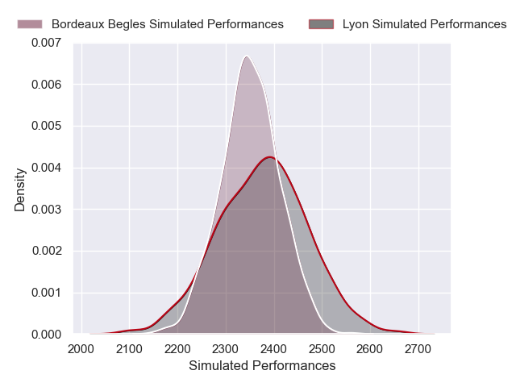

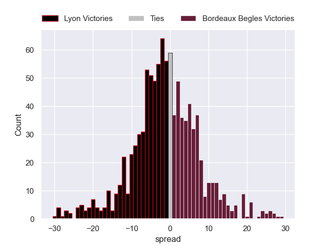

### Stade Toulousain V Montpellier Herault on 2026/03/27

Average Margin: Stade Toulousain by 6.9

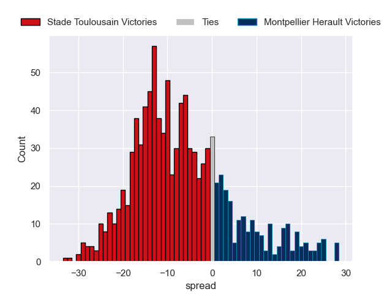

### Pau V Racing 92 on 2026/03/27

Average Margin: Pau by 4.2

### Castres Olympique V US Montauban on 2026/03/27

Average Margin: Castres Olympique by 10.3

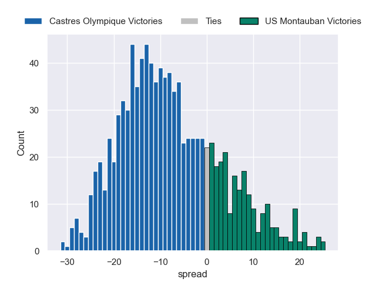

### Bayonne V La Rochelle on 2026/03/27

Average Margin: Bayonne by 1.4

### Stade Francais Paris V Clermont Auvergne on 2026/03/27

Average Margin: Stade Francais Paris by 5.1

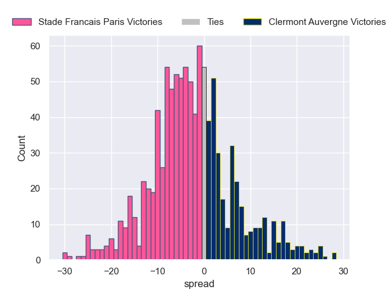

## Week 22

### Clermont Auvergne V Lyon on 2026/04/17

Average Margin: Clermont Auvergne by 5.5

### La Rochelle V Bordeaux Begles on 2026/04/17

Average Margin: La Rochelle by 2.3

### Montpellier Herault V Perpignan on 2026/04/17

Average Margin: Montpellier Herault by 8.1

### Racing 92 V Stade Francais Paris on 2026/04/17

Average Margin: Racing 92 by 1.4

### Castres Olympique V Stade Toulousain on 2026/04/17

Average Margin: Stade Toulousain by 1.2

### Bayonne V Pau on 2026/04/17

Average Margin: Bayonne by 1.6

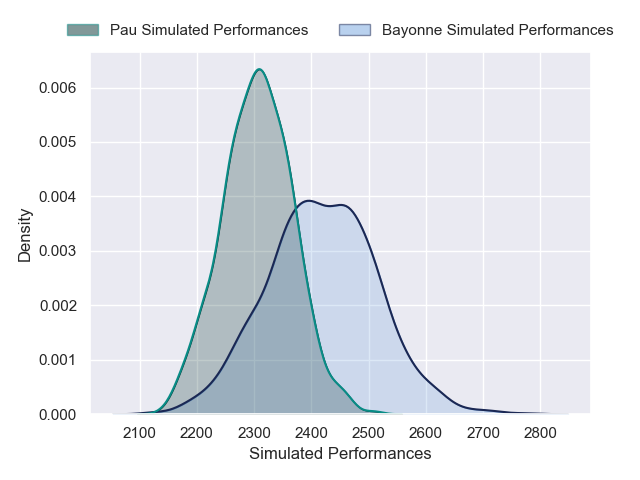

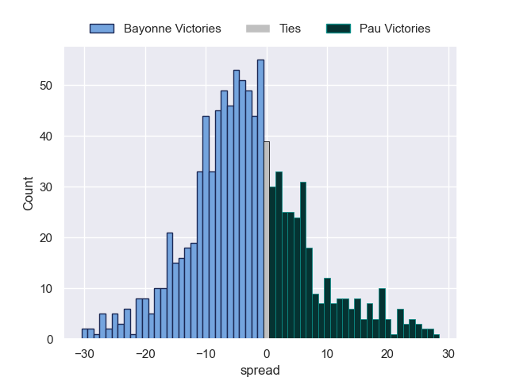

### US Montauban V Toulon on 2026/04/17

Average Margin: Toulon by 4.1

## Week 23

### Bordeaux Begles V Montpellier Herault on 2026/04/24

Average Margin: Bordeaux Begles by 5.8

### Lyon V Castres Olympique on 2026/04/24

Average Margin: Lyon by 1.7

### Perpignan V La Rochelle on 2026/04/24

Average Margin: La Rochelle by 0.9

### Toulon V Bayonne on 2026/04/24

Average Margin: Toulon by 6.3

### US Montauban V Racing 92 on 2026/04/24

Average Margin: Racing 92 by 2.8

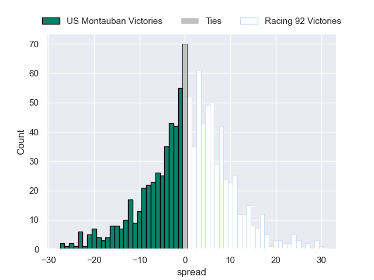

### Stade Francais Paris V Pau on 2026/04/24

Average Margin: Stade Francais Paris by 3.5

### Stade Toulousain V Clermont Auvergne on 2026/04/24

Average Margin: Stade Toulousain by 8.5

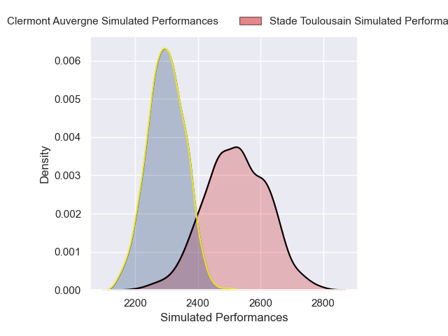

## Week 24

### Pau V Castres Olympique on 2026/05/08

Average Margin: Pau by 3.9

### Racing 92 V La Rochelle on 2026/05/08

Average Margin: Racing 92 by 1.4

### Montpellier Herault V US Montauban on 2026/05/08

Average Margin: Montpellier Herault by 10.7

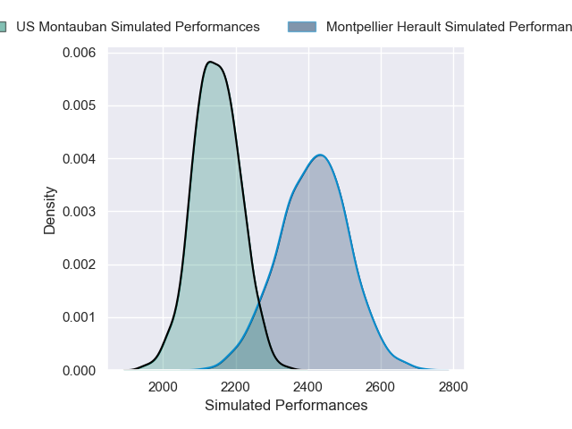
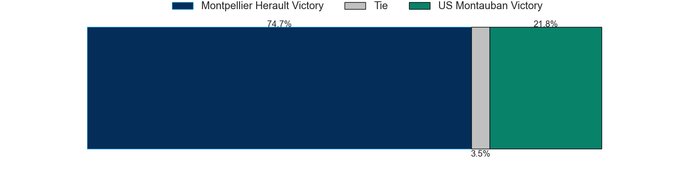

### Stade Francais Paris V Lyon on 2026/05/08

Average Margin: Stade Francais Paris by 6.0

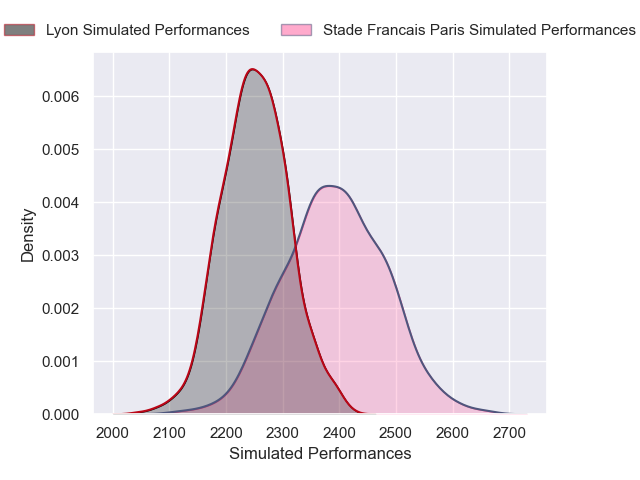
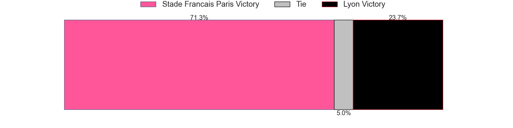
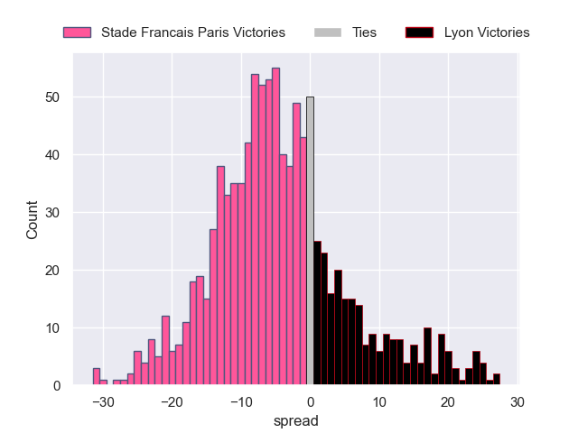

### Toulon V Stade Toulousain on 2026/05/08

Average Margin: Toulon by 0.3

### Bayonne V Bordeaux Begles on 2026/05/08

Average Margin: Bordeaux Begles by 0.9

### Clermont Auvergne V Perpignan on 2026/05/08

Average Margin: Clermont Auvergne by 6.6

## Week 25

### US Montauban V Stade Francais Paris on 2026/05/15

Average Margin: Stade Francais Paris by 4.2

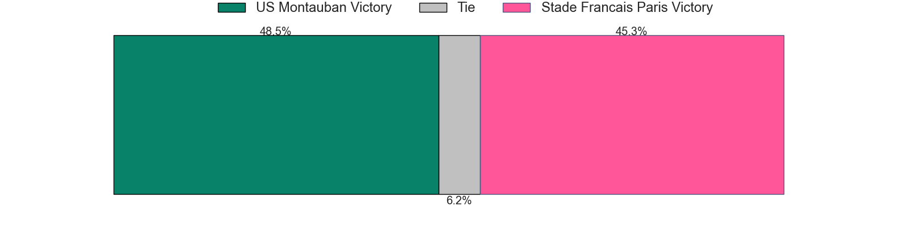

### Racing 92 V Toulon on 2026/05/15

Average Margin: Racing 92 by 2.1

### Castres Olympique V Montpellier Herault on 2026/05/15

Average Margin: Castres Olympique by 3.0

### Bordeaux Begles V Perpignan on 2026/05/15

Average Margin: Bordeaux Begles by 9.1

### La Rochelle V Stade Toulousain on 2026/05/15

Average Margin: La Rochelle by 0.6

### Pau V Clermont Auvergne on 2026/05/15

Average Margin: Pau by 4.7

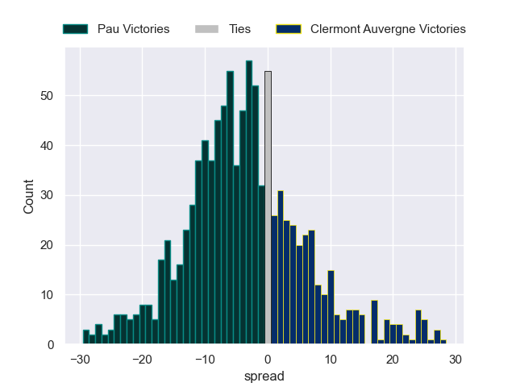

### Lyon V Bayonne on 2026/05/15

Average Margin: Lyon by 3.4

## Week 26

### Stade Toulousain V Lyon on 2026/05/29

Average Margin: Stade Toulousain by 8.9

### Toulon V Bordeaux Begles on 2026/05/29

Average Margin: Toulon by 2.5

### US Montauban V La Rochelle on 2026/05/29

Average Margin: La Rochelle by 3.9

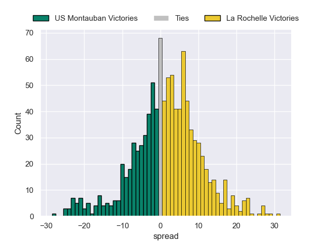

### Clermont Auvergne V Racing 92 on 2026/05/29

Average Margin: Clermont Auvergne by 3.7

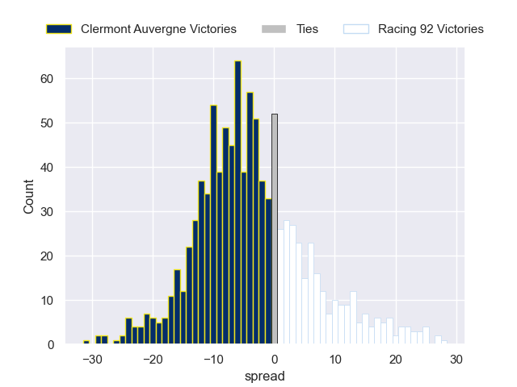

### Montpellier Herault V Pau on 2026/05/29

Average Margin: Montpellier Herault by 3.9

### Perpignan V Castres Olympique on 2026/05/29

Average Margin: Perpignan by 0.3

### Stade Francais Paris V Bayonne on 2026/05/29

Average Margin: Stade Francais Paris by 6.0

## Week 27

### Lyon V Montpellier Herault on 2026/06/06

Average Margin: Lyon by 1.0

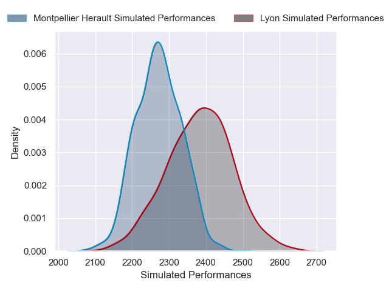

### La Rochelle V Stade Francais Paris on 2026/06/06

Average Margin: La Rochelle by 4.2

### Racing 92 V Stade Toulousain on 2026/06/06

Average Margin: Stade Toulousain by 2.1

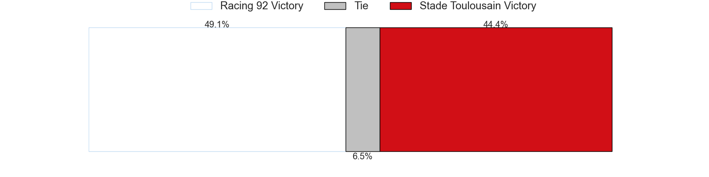

### Pau V US Montauban on 2026/06/06

Average Margin: Pau by 10.0

### Bayonne V Perpignan on 2026/06/06

Average Margin: Bayonne by 5.5

### Castres Olympique V Toulon on 2026/06/06

Average Margin: Castres Olympique by 2.7

### Bordeaux Begles V Clermont Auvergne on 2026/06/06

Average Margin: Bordeaux Begles by 7.4

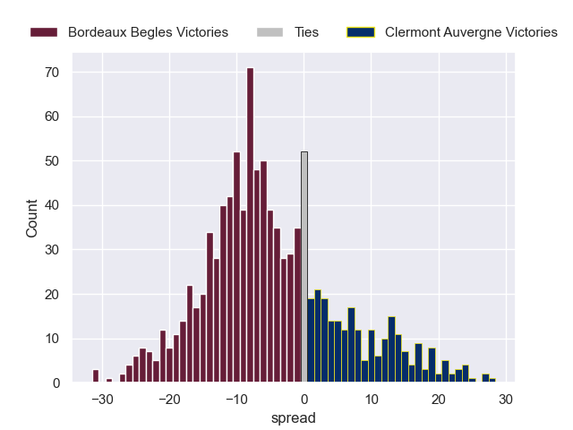

