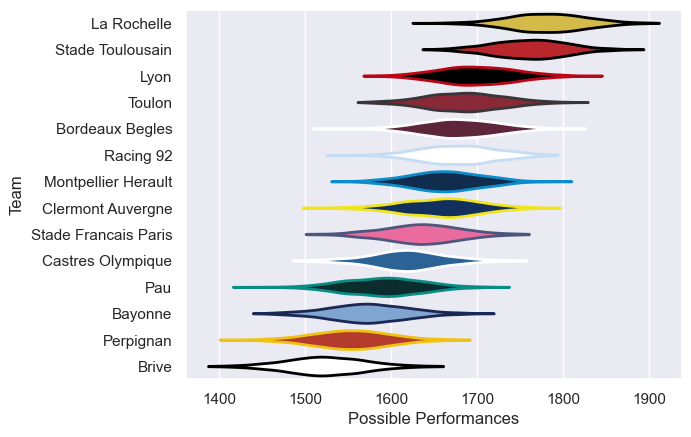
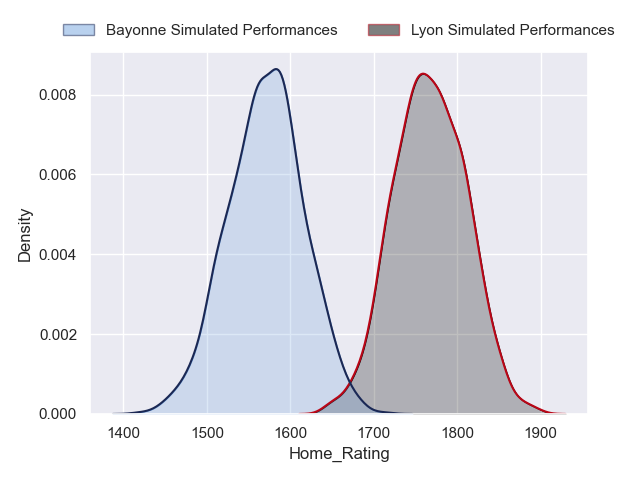
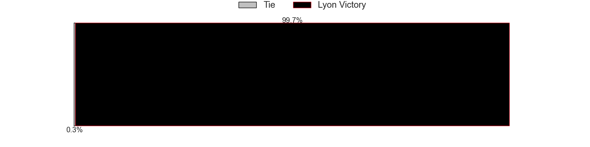
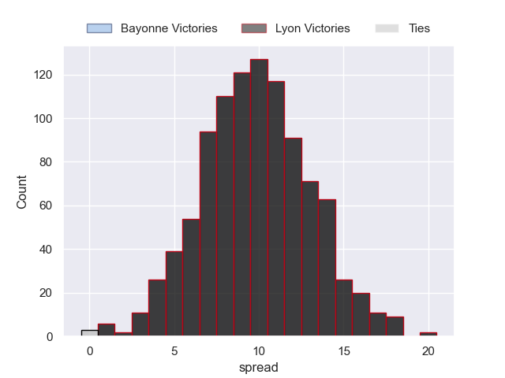

---  
title: "Top 14 Orange 2022 Status"  
date: 2023-05-19 6:00:00 -0500  
categories: model review projection  
layout: article  
aside:  
    toc: true  
---
# Current Team Rankings

# Standings

## Current Standings

| Club                 |   Played |   Wins |   Point Differential |   Losing Bonus Points |   Try Bonus Points |   Competition Points |
|:---------------------|---------:|-------:|---------------------:|----------------------:|-------------------:|---------------------:|
| Stade Toulousain     |       25 |     16 |                  164 |                     2 |                  8 |                   76 |
| La Rochelle          |       25 |     16 |                  190 |                     3 |                  7 |                   74 |
| Stade Francais Paris |       25 |     14 |                  140 |                     5 |                  5 |                   66 |
| Racing 92            |       25 |     14 |                   57 |                     3 |                  5 |                   66 |
| Bordeaux Begles      |       25 |     13 |                   91 |                     5 |                  4 |                   63 |
| Lyon                 |       25 |     13 |                   30 |                     5 |                  3 |                   62 |
| Bayonne              |       25 |     13 |                  -32 |                     2 |                  2 |                   58 |
| Toulon               |       25 |     13 |                   14 |                     2 |                  3 |                   57 |
| Montpellier Herault  |       25 |     11 |                   32 |                     6 |                  4 |                   54 |
| Castres Olympique    |       25 |     12 |                 -113 |                     2 |                  1 |                   53 |
| Clermont Auvergne    |       25 |     10 |                  -46 |                     6 |                  4 |                   52 |
| Pau                  |       25 |      9 |                  -67 |                     5 |                  4 |                   47 |
| Perpignan            |       25 |     10 |                 -213 |                     3 |                  0 |                   43 |
| Brive                |       25 |      7 |                 -247 |                     7 |                  1 |                   36 |

## Projected Remaining Table

| Club                 |   Matches Remaining |   Wins |   Point Differential |   Losing Bonus Points |   Try Bonus Points |   Competition Points |
|:---------------------|--------------------:|-------:|---------------------:|----------------------:|-------------------:|---------------------:|
| Stade Toulousain     |                   1 |    1   |                 14.8 |                   0   |                1   |                  5   |
| La Rochelle          |                   1 |    1   |                 10   |                   0   |                1   |                  5   |
| Lyon                 |                   1 |    1   |                  9.4 |                   0   |                1   |                  5   |
| Castres Olympique    |                   1 |    1   |                  6.4 |                   0   |                1   |                  4.9 |
| Toulon               |                   1 |    0.9 |                  3.2 |                   0.1 |                0.8 |                  4.4 |
| Clermont Auvergne    |                   1 |    0.8 |                  2   |                   0.2 |                0.7 |                  3.9 |
| Montpellier Herault  |                   1 |    0.6 |                  0.4 |                   0.4 |                0.4 |                  3.1 |
| Pau                  |                   1 |    0.4 |                 -0.4 |                   0.5 |                0.3 |                  2.6 |
| Racing 92            |                   1 |    0.2 |                 -2   |                   0.6 |                0.2 |                  1.7 |
| Bordeaux Begles      |                   1 |    0.1 |                 -3.2 |                   0.5 |                0.1 |                  1.1 |
| Perpignan            |                   1 |    0   |                 -6.4 |                   0.3 |                0   |                  0.3 |
| Bayonne              |                   1 |    0   |                 -9.4 |                   0.1 |                0   |                  0.1 |
| Stade Francais Paris |                   1 |    0   |                -10   |                   0   |                0   |                  0   |
| Brive                |                   1 |    0   |                -14.8 |                   0   |                0   |                  0   |

## Projected Total Table

| Club                 |   Total Matches |   Wins |   Point Differential |   Losing Bonus Points |   Try Bonus Points |   Competition Points |
|:---------------------|----------------:|-------:|---------------------:|----------------------:|-------------------:|---------------------:|
| Stade Toulousain     |              26 |   17   |                178.8 |                   2   |                9   |                 81   |
| La Rochelle          |              26 |   17   |                200   |                   3   |                8   |                 79   |
| Racing 92            |              26 |   14.2 |                 55   |                   3.6 |                5.2 |                 67.7 |
| Lyon                 |              26 |   14   |                 39.4 |                   5   |                4   |                 67   |
| Stade Francais Paris |              26 |   14   |                130   |                   5   |                5   |                 66   |
| Bordeaux Begles      |              26 |   13.1 |                 87.8 |                   5.5 |                4.1 |                 64.1 |
| Toulon               |              26 |   13.9 |                 17.2 |                   2.1 |                3.8 |                 61.4 |
| Bayonne              |              26 |   13   |                -41.4 |                   2.1 |                2   |                 58.1 |
| Castres Olympique    |              26 |   13   |               -106.6 |                   2   |                2   |                 57.9 |
| Montpellier Herault  |              26 |   11.6 |                 32.4 |                   6.4 |                4.4 |                 57.1 |
| Clermont Auvergne    |              26 |   10.8 |                -44   |                   6.2 |                4.7 |                 55.9 |
| Pau                  |              26 |    9.4 |                -67.4 |                   5.5 |                4.3 |                 49.6 |
| Perpignan            |              26 |   10   |               -219.4 |                   3.3 |                0   |                 43.3 |
| Brive                |              26 |    7   |               -261.8 |                   7   |                1   |                 36   |

## Projected Playoff Results

|                      | Reach Quarterfinals   | Reach Semifinals   | Reach Final   | Win Final   |
|:---------------------|:----------------------|:-------------------|:--------------|:------------|
| La Rochelle          | 100.0 %               | 100.0 %            | 96.0 %        | 64.9 %      |
| Stade Toulousain     | 100.0 %               | 100.0 %            | 92.1 %        | 33.9 %      |
| Lyon                 | 100.0 %               | 87.4 %             | 7.8 %         | 0.7 %       |
| Racing 92            | 100.0 %               | 75.0 %             | 3.0 %         | 0.5 %       |
| Bordeaux Begles      | 100.0 %               | 22.1 %             | 0.8 %         | 0.0 %       |
| Stade Francais Paris | 100.0 %               | 15.5 %             | 0.3 %         | 0.0 %       |

## Projected Promotion and Relegation Results

| Club           | Current Competition   | To Top 14   | To Pro D2   |
|:---------------|:----------------------|:------------|:------------|
| Perpignan      | Top 14                | 87.0 %      | 13.0 %      |
| Brive          | Top 14                | 0.0 %       | 100.0 %     |
| Oyonnax        | Pro D2                | 99.4 %      | 0.3 %       |
| Grenoble       | Pro D2                | 9.6 %       | 70.6 %      |
| Mont-de-Marsan | Pro D2                | 3.8 %       | 16.0 %      |
| Vannes         | Pro D2                | 0.2 %       | 0.1 %       |

# Completed Match Review

| Model | Percent Correct Predictions | Spread Error |
| ------ | ------ | ------ |
| Club Level | 68.0% | 10.9 |
| Player Level: Lineup | 62.3% | 17.4 |
| Player Level: Minutes | 66.9% | 17.6 |

# Future Predictions

## Week 26

### Stade Toulousain V Brive on 2023/05/28

Average Margin: Stade Toulousain by 15.3

### La Rochelle V Stade Francais Paris on 2023/05/28

Average Margin: La Rochelle by 10.5

### Pau V Montpellier Herault on 2023/05/28

Average Margin: Montpellier Herault by 0.5

### Toulon V Bordeaux Begles on 2023/05/28

Average Margin: Toulon by 3.6

### Castres Olympique V Perpignan on 2023/05/28

Average Margin: Castres Olympique by 6.8

### Clermont Auvergne V Racing 92 on 2023/05/28

Average Margin: Clermont Auvergne by 2.3

### Lyon V Bayonne on 2023/05/28

Average Margin: Lyon by 9.8

