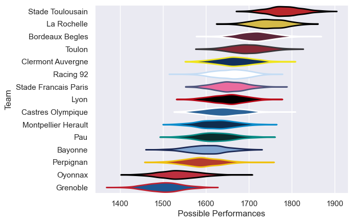
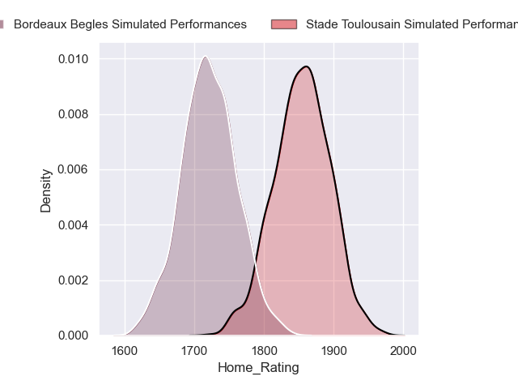
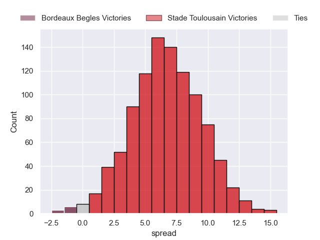

---  
title: "Top 14 Orange 2023 Status"  
date: 2024-06-28 6:00:00 -0500  
categories: model review projection  
layout: article  
aside:  
    toc: true  
---
# Current Team Rankings

# Standings

## Current Standings

| Club                 |   Played |   Wins |   Point Differential |   Losing Bonus Points |   Try Bonus Points |   Competition Points |
|:---------------------|---------:|-------:|---------------------:|----------------------:|-------------------:|---------------------:|
| Stade Toulousain     |       27 |     17 |                  189 |                     3 |                  8 |                   81 |
| Bordeaux Begles      |       28 |     17 |                  135 |                     4 |                  5 |                   77 |
| Stade Francais Paris |       27 |     17 |                   26 |                     2 |                  4 |                   76 |
| Toulon               |       27 |     15 |                  180 |                     5 |                  5 |                   70 |
| La Rochelle          |       28 |     14 |                   88 |                     7 |                  5 |                   70 |
| Racing 92            |       27 |     13 |                   62 |                     5 |                  5 |                   62 |
| Castres Olympique    |       26 |     13 |                    1 |                     6 |                  4 |                   62 |
| Clermont Auvergne    |       26 |     13 |                  -50 |                     3 |                  6 |                   61 |
| Pau                  |       26 |     13 |                   21 |                     5 |                  3 |                   60 |
| Perpignan            |       26 |     13 |                  -67 |                     1 |                  5 |                   58 |
| Lyon                 |       26 |     12 |                 -124 |                     2 |                  5 |                   55 |
| Bayonne              |       26 |     11 |                  -97 |                     6 |                  2 |                   52 |
| Montpellier Herault  |       27 |     10 |                 -111 |                     7 |                  1 |                   48 |
| Oyonnax              |       26 |      7 |                 -251 |                     4 |                  0 |                   34 |
| Grenoble             |        1 |      0 |                   -2 |                     1 |                  0 |                    1 |

## Projected Remaining Table

| Club             |   Matches Remaining |   Wins |   Point Differential |   Losing Bonus Points |   Try Bonus Points |   Competition Points |
|:-----------------|--------------------:|-------:|---------------------:|----------------------:|-------------------:|---------------------:|
| Stade Toulousain |                   1 |      1 |              6.59014 |                   0   |                  0 |                  4   |
| Bordeaux Begles  |                   1 |      0 |             -6.59014 |                   0.3 |                  0 |                  0.3 |

## Projected Total Table

| Club                 |   Total Matches |   Wins |   Point Differential |   Losing Bonus Points |   Try Bonus Points |   Competition Points |
|:---------------------|----------------:|-------:|---------------------:|----------------------:|-------------------:|---------------------:|
| Stade Toulousain     |              28 |     18 |               195.59 |                   3   |                  8 |                 85   |
| Bordeaux Begles      |              29 |     17 |               128.41 |                   4.3 |                  5 |                 77.3 |
| Stade Francais Paris |              27 |     17 |                26    |                   2   |                  4 |                 76   |
| Toulon               |              27 |     15 |               180    |                   5   |                  5 |                 70   |
| La Rochelle          |              28 |     14 |                88    |                   7   |                  5 |                 70   |
| Racing 92            |              27 |     13 |                62    |                   5   |                  5 |                 62   |
| Castres Olympique    |              26 |     13 |                 1    |                   6   |                  4 |                 62   |
| Clermont Auvergne    |              26 |     13 |               -50    |                   3   |                  6 |                 61   |
| Pau                  |              26 |     13 |                21    |                   5   |                  3 |                 60   |
| Perpignan            |              26 |     13 |               -67    |                   1   |                  5 |                 58   |
| Lyon                 |              26 |     12 |              -124    |                   2   |                  5 |                 55   |
| Bayonne              |              26 |     11 |               -97    |                   6   |                  2 |                 52   |
| Montpellier Herault  |              27 |     10 |              -111    |                   7   |                  1 |                 48   |
| Oyonnax              |              26 |      7 |              -251    |                   4   |                  0 |                 34   |
| Grenoble             |               1 |      0 |                -2    |                   1   |                  0 |                  1   |

## Projected Playoff Results

|        | final qualifiers   |
|:-------|:-------------------|
| SF_1_W | 100.0 %            |
| SF_2_W | 100.0 %            |

# Completed Match Review

| Model | Percent Correct Predictions | Spread Error |
| ------ | ------ | ------ |
| Club Level | 70.1% | 11.4 |
| Player Level: Lineup | 74.6% | 11.9 |
| Player Level: Minutes | 73.9% | 11.6 |

# Future Predictions

## Week 29

### Stade Toulousain V Bordeaux Begles on 2024/06/28

Average Margin: Stade Toulousain by 6.6

Average Scoreline: 35-29

