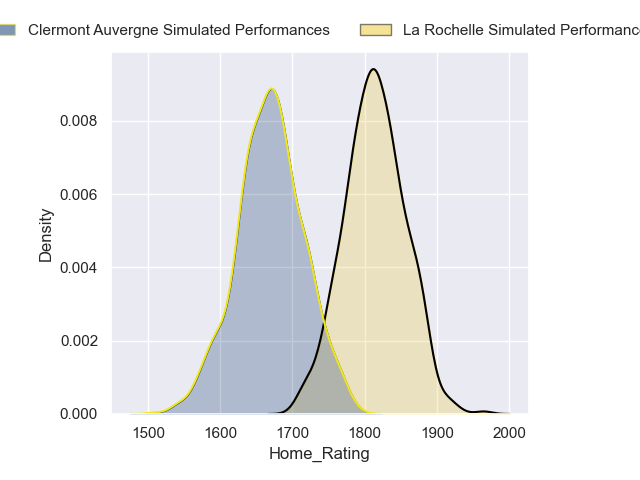
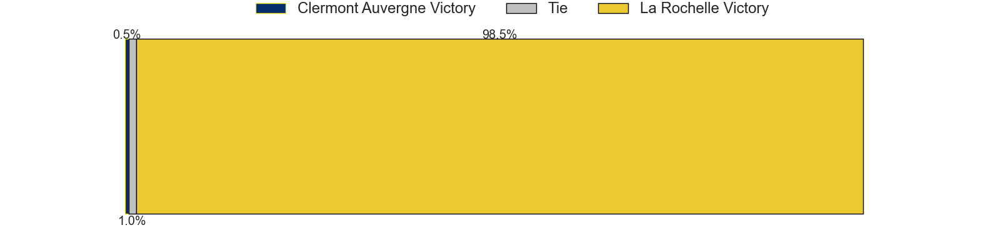
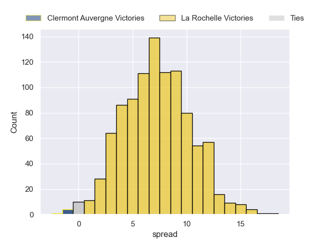

---  
title: "Top 14 Orange 2023 Status"  
date: 2024-02-27 6:00:00 -0500  
categories: model review projection  
layout: article  
aside:  
    toc: true  
---
# Current Team Rankings

# Standings

## Current Standings

| Club                 |   Played |   Wins |   Point Differential |   Losing Bonus Points |   Try Bonus Points |   Competition Points |
|:---------------------|---------:|-------:|---------------------:|----------------------:|-------------------:|---------------------:|
| Stade Toulousain     |       16 |     11 |                  112 |                     1 |                  5 |                   50 |
| Stade Francais Paris |       16 |     11 |                   76 |                     1 |                  3 |                   50 |
| Castres Olympique    |       16 |      9 |                   73 |                     4 |                  4 |                   44 |
| Bordeaux Begles      |       16 |      9 |                   29 |                     3 |                  2 |                   41 |
| Racing 92            |       16 |      8 |                   61 |                     4 |                  4 |                   40 |
| Pau                  |       16 |      9 |                   24 |                     2 |                  2 |                   40 |
| Toulon               |       16 |      8 |                   48 |                     3 |                  2 |                   37 |
| Clermont Auvergne    |       16 |      7 |                   -5 |                     3 |                  3 |                   36 |
| La Rochelle          |       16 |      7 |                   26 |                     5 |                  2 |                   35 |
| Bayonne              |       16 |      7 |                  -60 |                     4 |                  1 |                   33 |
| Lyon                 |       16 |      7 |                 -102 |                     2 |                  3 |                   33 |
| Perpignan            |       16 |      7 |                 -108 |                     0 |                  3 |                   31 |
| Montpellier Herault  |       16 |      6 |                  -32 |                     4 |                  1 |                   29 |
| Oyonnax              |       16 |      5 |                 -142 |                     2 |                  0 |                   22 |

## Projected Remaining Table

| Club                 |   Matches Remaining |   Wins |   Point Differential |   Losing Bonus Points |   Try Bonus Points |   Competition Points |
|:---------------------|--------------------:|-------:|---------------------:|----------------------:|-------------------:|---------------------:|
| Stade Toulousain     |                  10 |    9   |            60.6903   |                   1   |                1.3 |                 38.2 |
| La Rochelle          |                  10 |    7.9 |            51.6193   |                   1.5 |                1.9 |                 34.9 |
| Bordeaux Begles      |                  10 |    6.5 |            22.4942   |                   3.1 |                1.4 |                 30.4 |
| Clermont Auvergne    |                  10 |    5.9 |            11.7499   |                   2.3 |                1.1 |                 27.1 |
| Toulon               |                  10 |    5.5 |             8.52722  |                   3   |                1   |                 26.1 |
| Montpellier Herault  |                  10 |    4.9 |             1.85881  |                   3.7 |                1.7 |                 24.9 |
| Lyon                 |                  10 |    5   |             0.721524 |                   3.7 |                0.7 |                 24.4 |
| Castres Olympique    |                  10 |    4.9 |            -6.45153  |                   3.2 |                1.1 |                 23.8 |
| Stade Francais Paris |                  10 |    4.6 |            -9.22088  |                   2.7 |                0.4 |                 21.7 |
| Bayonne              |                  10 |    4.2 |            -8.03653  |                   3.9 |                0.9 |                 21.5 |
| Racing 92            |                  10 |    4.5 |           -12.6578   |                   2.5 |                0.7 |                 21.3 |
| Pau                  |                  10 |    3.7 |           -24.2225   |                   2.2 |                0.7 |                 17.6 |
| Oyonnax              |                  10 |    2.4 |           -44.3476   |                   3.2 |                0.3 |                 13.2 |
| Perpignan            |                  10 |    1   |           -52.7244   |                   3.7 |                0.3 |                  8.1 |

## Projected Total Table

| Club                 |   Total Matches |   Wins |   Point Differential |   Losing Bonus Points |   Try Bonus Points |   Competition Points |
|:---------------------|----------------:|-------:|---------------------:|----------------------:|-------------------:|---------------------:|
| Stade Toulousain     |              26 |   20   |           172.69     |                   2   |                6.3 |                 88.2 |
| Stade Francais Paris |              26 |   15.6 |            66.7791   |                   3.7 |                3.4 |                 71.7 |
| Bordeaux Begles      |              26 |   15.5 |            51.4942   |                   6.1 |                3.4 |                 71.4 |
| La Rochelle          |              26 |   14.9 |            77.6193   |                   6.5 |                3.9 |                 69.9 |
| Castres Olympique    |              26 |   13.9 |            66.5485   |                   7.2 |                5.1 |                 67.8 |
| Toulon               |              26 |   13.5 |            56.5272   |                   6   |                3   |                 63.1 |
| Clermont Auvergne    |              26 |   12.9 |             6.7499   |                   5.3 |                4.1 |                 63.1 |
| Racing 92            |              26 |   12.5 |            48.3422   |                   6.5 |                4.7 |                 61.3 |
| Pau                  |              26 |   12.7 |            -0.222511 |                   4.2 |                2.7 |                 57.6 |
| Lyon                 |              26 |   12   |          -101.278    |                   5.7 |                3.7 |                 57.4 |
| Bayonne              |              26 |   11.2 |           -68.0365   |                   7.9 |                1.9 |                 54.5 |
| Montpellier Herault  |              26 |   10.9 |           -30.1412   |                   7.7 |                2.7 |                 53.9 |
| Perpignan            |              26 |    8   |          -160.724    |                   3.7 |                3.3 |                 39.1 |
| Oyonnax              |              26 |    7.4 |          -186.348    |                   5.2 |                0.3 |                 35.2 |

# Completed Match Review

| Model | Percent Correct Predictions | Spread Error |
| ------ | ------ | ------ |
| Club Level | 67.0% | 11.6 |
| Player Level: Lineup | 74.1% | 11.6 |
| Player Level: Minutes | 73.2% | 11.4 |

# Future Predictions

## Week 17

### Stade Toulousain V Castres Olympique on 2024/03/02

Average Margin: Stade Toulousain by 9.5

Average Scoreline: 35-25

### Bordeaux Begles V Racing 92 on 2024/03/02

Average Margin: Bordeaux Begles by 5.5

Average Scoreline: 28-23

### Toulon V Perpignan on 2024/03/02

Average Margin: Toulon by 9.4

Average Scoreline: 28-19

### Stade Francais Paris V Pau on 2024/03/02

Average Margin: Stade Francais Paris by 5.3

Average Scoreline: 28-23

### Oyonnax V Montpellier Herault on 2024/03/02

Average Margin: Montpellier Herault by 1.7

Average Scoreline: 32-30

### Bayonne V Lyon on 2024/03/02

Average Margin: Bayonne by 1.4

Average Scoreline: 27-26

### La Rochelle V Clermont Auvergne on 2024/03/03

Average Margin: La Rochelle by 7.4

Average Scoreline: 32-24

## Week 18

### Montpellier Herault V Bordeaux Begles on 2024/03/09

Average Margin: Montpellier Herault by 1.2

Average Scoreline: 29-27

### Racing 92 V Toulon on 2024/03/09

Average Margin: Racing 92 by 2.5

Average Scoreline: 28-25

### Perpignan V Stade Toulousain on 2024/03/09

Average Margin: Stade Toulousain by 8.0

Average Scoreline: 28-20

### Clermont Auvergne V Oyonnax on 2024/03/09

Average Margin: Clermont Auvergne by 9.2

Average Scoreline: 30-21

### La Rochelle V Stade Francais Paris on 2024/03/09

Average Margin: La Rochelle by 7.7

Average Scoreline: 28-20

### Pau V Bayonne on 2024/03/09

Average Margin: Pau by 3.3

Average Scoreline: 25-21

### Lyon V Castres Olympique on 2024/03/09

Average Margin: Lyon by 3.5

Average Scoreline: 26-23

## Week 19

### Castres Olympique V Racing 92 on 2024/03/23

Average Margin: Castres Olympique by 3.4

Average Scoreline: 26-23

### Clermont Auvergne V Pau on 2024/03/23

Average Margin: Clermont Auvergne by 5.9

Average Scoreline: 25-19

### Stade Francais Paris V Lyon on 2024/03/23

Average Margin: Stade Francais Paris by 3.2

Average Scoreline: 25-22

### Toulon V Montpellier Herault on 2024/03/23

Average Margin: Toulon by 4.2

Average Scoreline: 26-22

### Oyonnax V Perpignan on 2024/03/23

Average Margin: Oyonnax by 3.3

Average Scoreline: 26-23

### Bayonne V La Rochelle on 2024/03/23

Average Margin: La Rochelle by 3.2

Average Scoreline: 25-21

### Bordeaux Begles V Stade Toulousain on 2024/03/23

Average Margin: Stade Toulousain by 0.8

Average Scoreline: 25-24

## Week 20

### Perpignan V Castres Olympique on 2024/03/30

Average Margin: Castres Olympique by 1.8

Average Scoreline: 26-25

### La Rochelle V Oyonnax on 2024/03/30

Average Margin: La Rochelle by 13.2

Average Scoreline: 40-27

### Montpellier Herault V Stade Francais Paris on 2024/03/30

Average Margin: Montpellier Herault by 3.2

Average Scoreline: 28-25

### Racing 92 V Clermont Auvergne on 2024/03/30

Average Margin: Racing 92 by 2.6

Average Scoreline: 27-24

### Lyon V Bordeaux Begles on 2024/03/30

Average Margin: Lyon by 1.1

Average Scoreline: 28-27

### Stade Toulousain V Pau on 2024/03/30

Average Margin: Stade Toulousain by 11.2

Average Scoreline: 32-20

### Bayonne V Toulon on 2024/03/30

Average Margin: Bayonne by 0.7

Average Scoreline: 27-27

## Week 21

### Castres Olympique V La Rochelle on 2024/04/20

Average Margin: La Rochelle by 1.2

Average Scoreline: 27-26

### Toulon V Stade Toulousain on 2024/04/20

Average Margin: Stade Toulousain by 2.1

Average Scoreline: 28-26

### Stade Francais Paris V Bayonne on 2024/04/20

Average Margin: Stade Francais Paris by 5.6

Average Scoreline: 29-23

### Pau V Montpellier Herault on 2024/04/20

Average Margin: Pau by 1.5

Average Scoreline: 29-28

### Bordeaux Begles V Clermont Auvergne on 2024/04/20

Average Margin: Bordeaux Begles by 4.8

Average Scoreline: 28-23

### Oyonnax V Racing 92 on 2024/04/20

Average Margin: Racing 92 by 1.6

Average Scoreline: 35-33

### Perpignan V Lyon on 2024/04/20

Average Margin: Lyon by 1.8

Average Scoreline: 31-29

## Week 22

### Stade Toulousain V Racing 92 on 2024/04/27

Average Margin: Stade Toulousain by 9.3

Average Scoreline: 30-21

### Bayonne V Bordeaux Begles on 2024/04/27

Average Margin: Bordeaux Begles by 0.8

Average Scoreline: 25-24

### Lyon V Pau on 2024/04/27

Average Margin: Lyon by 5.2

Average Scoreline: 24-19

### Clermont Auvergne V Stade Francais Paris on 2024/04/27

Average Margin: Clermont Auvergne by 3.9

Average Scoreline: 29-25

### La Rochelle V Toulon on 2024/04/27

Average Margin: La Rochelle by 7.3

Average Scoreline: 22-15

### Montpellier Herault V Perpignan on 2024/04/27

Average Margin: Montpellier Herault by 8.4

Average Scoreline: 34-26

### Oyonnax V Castres Olympique on 2024/04/27

Average Margin: Castres Olympique by 1.9

Average Scoreline: 27-25

## Week 23

### Pau V Oyonnax on 2024/05/11

Average Margin: Pau by 6.7

Average Scoreline: 30-23

### Bordeaux Begles V La Rochelle on 2024/05/11

Average Margin: Bordeaux Begles by 1.0

Average Scoreline: 19-18

### Perpignan V Clermont Auvergne on 2024/05/11

Average Margin: Clermont Auvergne by 2.7

Average Scoreline: 30-27

### Castres Olympique V Montpellier Herault on 2024/05/11

Average Margin: Castres Olympique by 3.2

Average Scoreline: 28-24

### Toulon V Lyon on 2024/05/11

Average Margin: Toulon by 4.0

Average Scoreline: 27-23

### Racing 92 V Bayonne on 2024/05/11

Average Margin: Racing 92 by 5.1

Average Scoreline: 26-21

### Stade Toulousain V Stade Francais Paris on 2024/05/11

Average Margin: Stade Toulousain by 9.3

Average Scoreline: 24-15

## Week 24

### Oyonnax V Toulon on 2024/05/18

Average Margin: Toulon by 2.8

Average Scoreline: 26-23

### Bayonne V Perpignan on 2024/05/18

Average Margin: Bayonne by 6.5

Average Scoreline: 27-21

### La Rochelle V Pau on 2024/05/18

Average Margin: La Rochelle by 9.7

Average Scoreline: 29-19

### Stade Francais Paris V Bordeaux Begles on 2024/05/18

Average Margin: Stade Francais Paris by 1.2

Average Scoreline: 25-24

### Lyon V Racing 92 on 2024/05/18

Average Margin: Lyon by 3.4

Average Scoreline: 26-22

### Clermont Auvergne V Castres Olympique on 2024/05/18

Average Margin: Clermont Auvergne by 4.2

Average Scoreline: 29-24

### Montpellier Herault V Stade Toulousain on 2024/05/18

Average Margin: Stade Toulousain by 2.8

Average Scoreline: 30-28

## Week 25

### Castres Olympique V Stade Francais Paris on 2024/06/01

Average Margin: Castres Olympique by 3.1

Average Scoreline: 29-26

### Oyonnax V Bayonne on 2024/06/01

Average Margin: Oyonnax by 0.1

Average Scoreline: 27-27

### Montpellier Herault V Lyon on 2024/06/01

Average Margin: Montpellier Herault by 3.0

Average Scoreline: 29-26

### Racing 92 V Pau on 2024/06/01

Average Margin: Racing 92 by 5.1

Average Scoreline: 27-21

### Toulon V Clermont Auvergne on 2024/06/01

Average Margin: Toulon by 3.3

Average Scoreline: 27-24

### Stade Toulousain V La Rochelle on 2024/06/01

Average Margin: Stade Toulousain by 4.9

Average Scoreline: 18-13

### Perpignan V Bordeaux Begles on 2024/06/01

Average Margin: Bordeaux Begles by 4.1

Average Scoreline: 29-25

## Week 26

### Pau V Perpignan on 2024/06/08

Average Margin: Pau by 6.6

Average Scoreline: 32-26

### La Rochelle V Racing 92 on 2024/06/08

Average Margin: La Rochelle by 7.9

Average Scoreline: 21-14

### Clermont Auvergne V Montpellier Herault on 2024/06/08

Average Margin: Clermont Auvergne by 4.0

Average Scoreline: 29-25

### Stade Francais Paris V Toulon on 2024/06/08

Average Margin: Stade Francais Paris by 2.7

Average Scoreline: 22-19

### Lyon V Stade Toulousain on 2024/06/08

Average Margin: Stade Toulousain by 2.7

Average Scoreline: 22-19

### Bordeaux Begles V Oyonnax on 2024/06/08

Average Margin: Bordeaux Begles by 10.6

Average Scoreline: 34-23

### Bayonne V Castres Olympique on 2024/06/08

Average Margin: Bayonne by 1.4

Average Scoreline: 28-27

## Week 27

## Week 28

## Week 29
