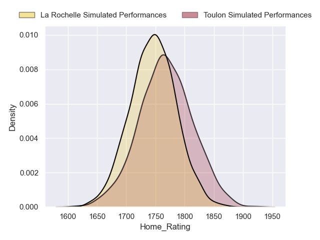
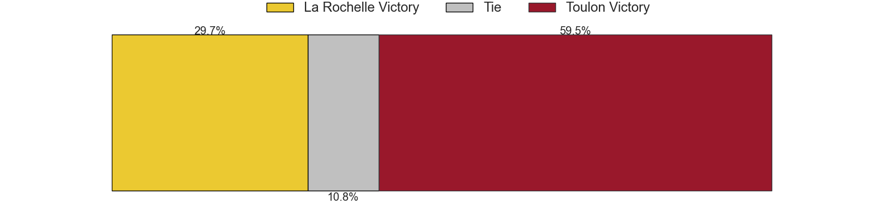
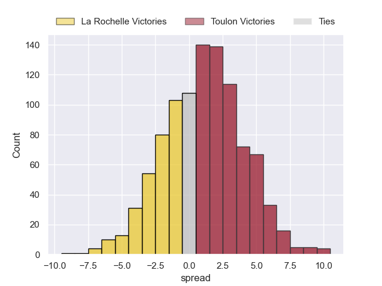
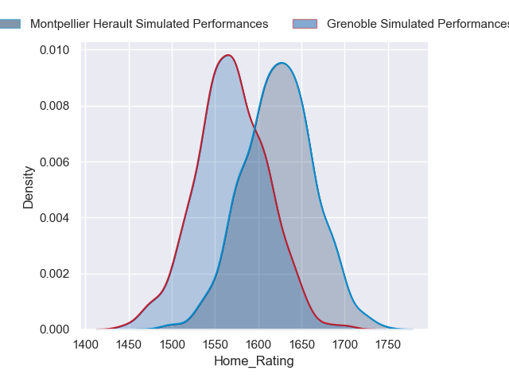
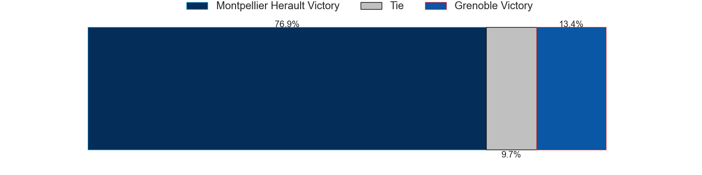
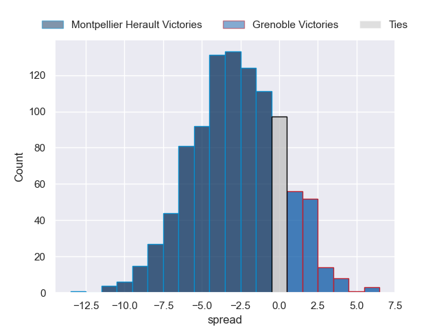
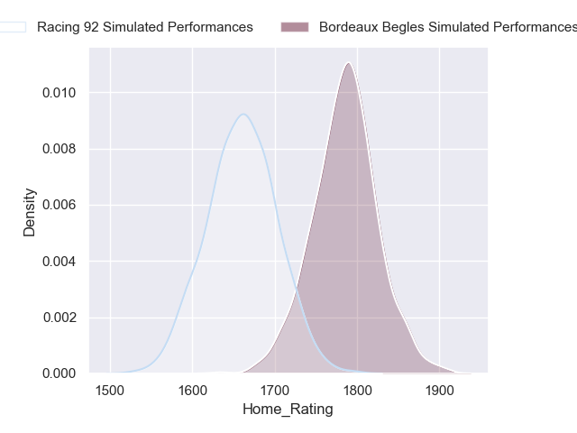
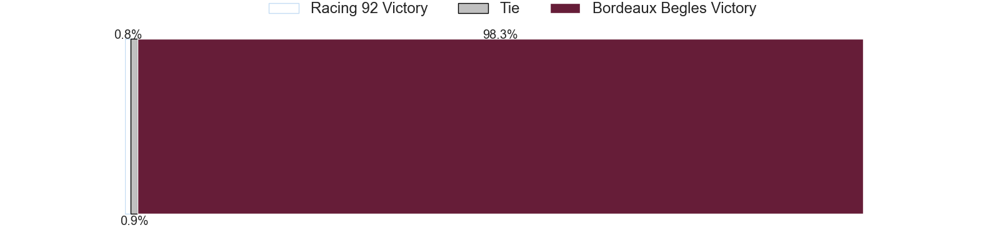
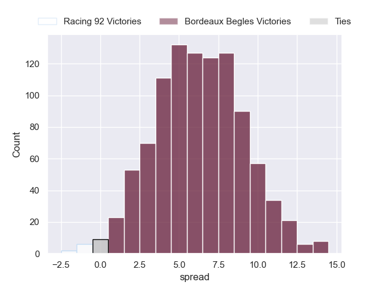

---  
title: "Top 14 Orange 2023 Status"  
date: 2024-06-10 6:00:00 -0500  
categories: model review projection  
layout: article  
aside:  
    toc: true  
---
# Current Team Rankings

# Standings

## Current Standings

| Club                 |   Played |   Wins |   Point Differential |   Losing Bonus Points |   Try Bonus Points |   Competition Points |
|:---------------------|---------:|-------:|---------------------:|----------------------:|-------------------:|---------------------:|
| Stade Toulousain     |       26 |     16 |                  173 |                     3 |                  7 |                   76 |
| Stade Francais Paris |       26 |     17 |                   28 |                     1 |                  4 |                   75 |
| Toulon               |       26 |     15 |                  185 |                     4 |                  5 |                   69 |
| Bordeaux Begles      |       26 |     15 |                  119 |                     4 |                  5 |                   69 |
| La Rochelle          |       26 |     13 |                   99 |                     7 |                  5 |                   66 |
| Racing 92            |       26 |     13 |                   76 |                     5 |                  5 |                   62 |
| Castres Olympique    |       26 |     13 |                    1 |                     6 |                  4 |                   62 |
| Clermont Auvergne    |       26 |     13 |                  -50 |                     3 |                  6 |                   61 |
| Pau                  |       26 |     13 |                   21 |                     5 |                  3 |                   60 |
| Perpignan            |       26 |     13 |                  -67 |                     1 |                  5 |                   58 |
| Lyon                 |       26 |     12 |                 -124 |                     2 |                  5 |                   55 |
| Bayonne              |       26 |     11 |                  -97 |                     6 |                  2 |                   52 |
| Montpellier Herault  |       26 |      9 |                 -113 |                     7 |                  1 |                   44 |
| Oyonnax              |       26 |      7 |                 -251 |                     4 |                  0 |                   34 |

## Projected Remaining Table

| Club                |   Matches Remaining |   Wins |   Point Differential |   Losing Bonus Points |   Try Bonus Points |   Competition Points |
|:--------------------|--------------------:|-------:|---------------------:|----------------------:|-------------------:|---------------------:|
| Bordeaux Begles     |                   1 |    1   |              6.26489 |                   0   |                0   |                  4   |
| Montpellier Herault |                   1 |    0.8 |              2.74425 |                   0.2 |                0.5 |                  3.9 |
| Toulon              |                   1 |    0.7 |              1.08612 |                   0.3 |                0   |                  3   |
| La Rochelle         |                   1 |    0.3 |             -1.08612 |                   0.6 |                0.1 |                  2   |
| Grenoble            |                   1 |    0.2 |             -2.74425 |                   0.6 |                0   |                  1.3 |
| Racing 92           |                   1 |    0   |             -6.26489 |                   0.3 |                0   |                  0.4 |

## Projected Total Table

| Club                 |   Total Matches |   Wins |   Point Differential |   Losing Bonus Points |   Try Bonus Points |   Competition Points |
|:---------------------|----------------:|-------:|---------------------:|----------------------:|-------------------:|---------------------:|
| Stade Toulousain     |              26 |   16   |            173       |                   3   |                7   |                 76   |
| Stade Francais Paris |              26 |   17   |             28       |                   1   |                4   |                 75   |
| Bordeaux Begles      |              27 |   16   |            125.265   |                   4   |                5   |                 73   |
| Toulon               |              27 |   15.7 |            186.086   |                   4.3 |                5   |                 72   |
| La Rochelle          |              27 |   13.3 |             97.9139  |                   7.6 |                5.1 |                 68   |
| Racing 92            |              27 |   13   |             69.7351  |                   5.3 |                5   |                 62.4 |
| Castres Olympique    |              26 |   13   |              1       |                   6   |                4   |                 62   |
| Clermont Auvergne    |              26 |   13   |            -50       |                   3   |                6   |                 61   |
| Pau                  |              26 |   13   |             21       |                   5   |                3   |                 60   |
| Perpignan            |              26 |   13   |            -67       |                   1   |                5   |                 58   |
| Lyon                 |              26 |   12   |           -124       |                   2   |                5   |                 55   |
| Bayonne              |              26 |   11   |            -97       |                   6   |                2   |                 52   |
| Montpellier Herault  |              27 |    9.8 |           -110.256   |                   7.2 |                1.5 |                 47.9 |
| Oyonnax              |              26 |    7   |           -251       |                   4   |                0   |                 34   |
| Grenoble             |               1 |    0.2 |             -2.74425 |                   0.6 |                0   |                  1.3 |

# Completed Match Review

| Model | Percent Correct Predictions | Spread Error |
| ------ | ------ | ------ |
| Club Level | 70.3% | 11.6 |
| Player Level: Lineup | 76.0% | 12.0 |
| Player Level: Minutes | 74.9% | 11.8 |

# Future Predictions

## Week 27

### Toulon V La Rochelle on 2024/06/15

Average Margin: Toulon by 1.1

Average Scoreline: 30-29

### Grenoble V Montpellier Herault on 2024/06/16

Average Margin: Montpellier Herault by 2.7

Average Scoreline: 34-31

### Bordeaux Begles V Racing 92 on 2024/06/16

Average Margin: Bordeaux Begles by 6.3

Average Scoreline: 30-24

## Week 28
