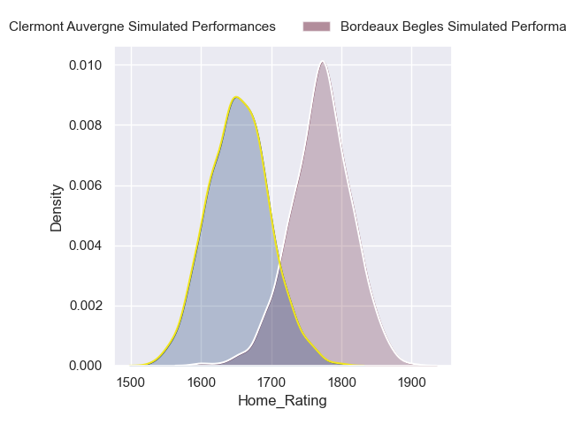
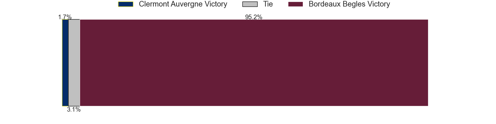
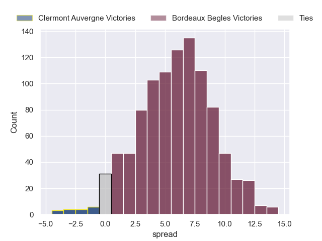
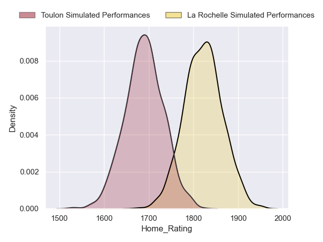
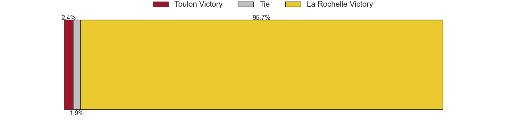
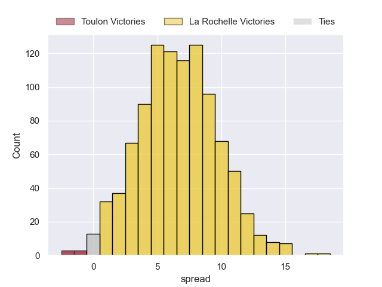

---  
title: "Top 14 Orange 2023 Status"  
date: 2024-04-15 6:00:00 -0500  
categories: model review projection  
layout: article  
aside:  
    toc: true  
---
# Current Team Rankings

# Standings

## Current Standings

| Club                 |   Played |   Wins |   Point Differential |   Losing Bonus Points |   Try Bonus Points |   Competition Points |
|:---------------------|---------:|-------:|---------------------:|----------------------:|-------------------:|---------------------:|
| Stade Francais Paris |       20 |     14 |                   80 |                     1 |                  4 |                   63 |
| Stade Toulousain     |       20 |     13 |                  128 |                     2 |                  6 |                   60 |
| Racing 92            |       20 |     11 |                   77 |                     4 |                  4 |                   52 |
| Toulon               |       20 |     11 |                  139 |                     3 |                  4 |                   51 |
| La Rochelle          |       20 |     10 |                  103 |                     6 |                  5 |                   51 |
| Bordeaux Begles      |       20 |     11 |                   24 |                     3 |                  2 |                   49 |
| Pau                  |       20 |     10 |                    8 |                     4 |                  2 |                   46 |
| Castres Olympique    |       20 |      9 |                   -2 |                     5 |                  4 |                   45 |
| Perpignan            |       20 |     10 |                  -88 |                     0 |                  4 |                   44 |
| Bayonne              |       20 |      9 |                  -68 |                     5 |                  2 |                   43 |
| Clermont Auvergne    |       20 |      9 |                  -57 |                     3 |                  3 |                   42 |
| Lyon                 |       20 |      9 |                 -108 |                     2 |                  4 |                   42 |
| Montpellier Herault  |       20 |      8 |                  -70 |                     5 |                  1 |                   38 |
| Oyonnax              |       20 |      5 |                 -166 |                     4 |                  0 |                   26 |

## Projected Remaining Table

| Club                 |   Matches Remaining |   Wins |   Point Differential |   Losing Bonus Points |   Try Bonus Points |   Competition Points |
|:---------------------|--------------------:|-------:|---------------------:|----------------------:|-------------------:|---------------------:|
| Stade Toulousain     |                   6 |    5.2 |            29.4423   |                   0.7 |                1   |                 22.6 |
| Bordeaux Begles      |                   6 |    4.4 |            19.7826   |                   1.4 |                0.8 |                 19.7 |
| La Rochelle          |                   6 |    4.2 |            22.773    |                   1.3 |                0.8 |                 19   |
| Toulon               |                   6 |    3.4 |             4.34125  |                   1.6 |                0.8 |                 16   |
| Clermont Auvergne    |                   6 |    3.4 |             1.75491  |                   1.5 |                0.5 |                 15.5 |
| Lyon                 |                   6 |    2.9 |            -0.665781 |                   2.1 |                0.4 |                 14.2 |
| Stade Francais Paris |                   6 |    2.9 |            -4.08606  |                   1.8 |                0.6 |                 13.9 |
| Bayonne              |                   6 |    2.6 |            -5.08705  |                   2   |                0.6 |                 13.2 |
| Castres Olympique    |                   6 |    2.5 |            -5.06687  |                   2.6 |                0.6 |                 13.1 |
| Racing 92            |                   6 |    2.9 |            -6.24866  |                   1.1 |                0.5 |                 13.1 |
| Montpellier Herault  |                   6 |    2.4 |            -3.84358  |                   2.5 |                0.7 |                 12.7 |
| Pau                  |                   6 |    2.7 |            -7.66943  |                   1.1 |                0.5 |                 12.6 |
| Oyonnax              |                   6 |    1.4 |           -22.8985   |                   2.3 |                0.2 |                  8.2 |
| Perpignan            |                   6 |    1.1 |           -22.5281   |                   2.6 |                0.4 |                  7.3 |

## Projected Total Table

| Club                 |   Total Matches |   Wins |   Point Differential |   Losing Bonus Points |   Try Bonus Points |   Competition Points |
|:---------------------|----------------:|-------:|---------------------:|----------------------:|-------------------:|---------------------:|
| Stade Toulousain     |              26 |   18.2 |           157.442    |                   2.7 |                7   |                 82.6 |
| Stade Francais Paris |              26 |   16.9 |            75.9139   |                   2.8 |                4.6 |                 76.9 |
| La Rochelle          |              26 |   14.2 |           125.773    |                   7.3 |                5.8 |                 70   |
| Bordeaux Begles      |              26 |   15.4 |            43.7826   |                   4.4 |                2.8 |                 68.7 |
| Toulon               |              26 |   14.4 |           143.341    |                   4.6 |                4.8 |                 67   |
| Racing 92            |              26 |   13.9 |            70.7513   |                   5.1 |                4.5 |                 65.1 |
| Pau                  |              26 |   12.7 |             0.330572 |                   5.1 |                2.5 |                 58.6 |
| Castres Olympique    |              26 |   11.5 |            -7.06687  |                   7.6 |                4.6 |                 58.1 |
| Clermont Auvergne    |              26 |   12.4 |           -55.2451   |                   4.5 |                3.5 |                 57.5 |
| Bayonne              |              26 |   11.6 |           -73.0871   |                   7   |                2.6 |                 56.2 |
| Lyon                 |              26 |   11.9 |          -108.666    |                   4.1 |                4.4 |                 56.2 |
| Perpignan            |              26 |   11.1 |          -110.528    |                   2.6 |                4.4 |                 51.3 |
| Montpellier Herault  |              26 |   10.4 |           -73.8436   |                   7.5 |                1.7 |                 50.7 |
| Oyonnax              |              26 |    6.4 |          -188.898    |                   6.3 |                0.2 |                 34.2 |

# Completed Match Review

| Model | Percent Correct Predictions | Spread Error |
| ------ | ------ | ------ |
| Club Level | 67.9% | 11.8 |
| Player Level: Lineup | 75.7% | 11.9 |
| Player Level: Minutes | 74.3% | 11.7 |

# Future Predictions

## Week 21

### Castres Olympique V La Rochelle on 2024/04/20

Average Margin: La Rochelle by 2.9

Average Scoreline: 32-29

### Toulon V Stade Toulousain on 2024/04/20

Average Margin: Stade Toulousain by 0.9

Average Scoreline: 26-25

### Perpignan V Lyon on 2024/04/20

Average Margin: Lyon by 0.8

Average Scoreline: 35-34

### Pau V Montpellier Herault on 2024/04/20

Average Margin: Pau by 2.2

Average Scoreline: 29-27

### Oyonnax V Racing 92 on 2024/04/20

Average Margin: Racing 92 by 2.2

Average Scoreline: 29-26

### Stade Francais Paris V Bayonne on 2024/04/20

Average Margin: Stade Francais Paris by 6.0

Average Scoreline: 27-21

### Bordeaux Begles V Clermont Auvergne on 2024/04/21

Average Margin: Bordeaux Begles by 5.9

Average Scoreline: 26-20

## Week 22

### Oyonnax V Castres Olympique on 2024/04/27

Average Margin: Castres Olympique by 0.3

Average Scoreline: 26-25

### Clermont Auvergne V Stade Francais Paris on 2024/04/27

Average Margin: Clermont Auvergne by 3.1

Average Scoreline: 34-31

### Montpellier Herault V Perpignan on 2024/04/27

Average Margin: Montpellier Herault by 6.7

Average Scoreline: 28-22

### Lyon V Pau on 2024/04/27

Average Margin: Lyon by 5.5

Average Scoreline: 29-24

### Bayonne V Bordeaux Begles on 2024/04/27

Average Margin: Bordeaux Begles by 0.9

Average Scoreline: 29-28

### Stade Toulousain V Racing 92 on 2024/04/27

Average Margin: Stade Toulousain by 8.9

Average Scoreline: 20-11

### La Rochelle V Toulon on 2024/04/28

Average Margin: La Rochelle by 6.6

Average Scoreline: 29-22

## Week 23

### Castres Olympique V Montpellier Herault on 2024/05/11

Average Margin: Castres Olympique by 3.0

Average Scoreline: 28-25

### Stade Toulousain V Stade Francais Paris on 2024/05/11

Average Margin: Stade Toulousain by 9.1

Average Scoreline: 28-19

### Toulon V Lyon on 2024/05/11

Average Margin: Toulon by 5.1

Average Scoreline: 27-22

### Perpignan V Clermont Auvergne on 2024/05/11

Average Margin: Clermont Auvergne by 1.0

Average Scoreline: 29-28

### Racing 92 V Bayonne on 2024/05/11

Average Margin: Racing 92 by 5.7

Average Scoreline: 25-20

### Pau V Oyonnax on 2024/05/11

Average Margin: Pau by 6.5

Average Scoreline: 32-25

### Bordeaux Begles V La Rochelle on 2024/05/11

Average Margin: Bordeaux Begles by 0.7

Average Scoreline: 30-30

## Week 24

### Bayonne V Perpignan on 2024/05/18

Average Margin: Bayonne by 5.3

Average Scoreline: 29-24

### Montpellier Herault V Stade Toulousain on 2024/05/18

Average Margin: Stade Toulousain by 3.6

Average Scoreline: 31-27

### Lyon V Racing 92 on 2024/05/18

Average Margin: Lyon by 3.1

Average Scoreline: 27-23

### Stade Francais Paris V Bordeaux Begles on 2024/05/18

Average Margin: Stade Francais Paris by 1.6

Average Scoreline: 37-36

### Clermont Auvergne V Castres Olympique on 2024/05/18

Average Margin: Clermont Auvergne by 4.5

Average Scoreline: 32-28

### Oyonnax V Toulon on 2024/05/18

Average Margin: Toulon by 3.7

Average Scoreline: 33-30

### La Rochelle V Pau on 2024/05/18

Average Margin: La Rochelle by 10.6

Average Scoreline: 37-27

## Week 25

### Castres Olympique V Stade Francais Paris on 2024/06/01

Average Margin: Castres Olympique by 1.7

Average Scoreline: 26-25

### Perpignan V Bordeaux Begles on 2024/06/01

Average Margin: Bordeaux Begles by 3.2

Average Scoreline: 34-30

### Toulon V Clermont Auvergne on 2024/06/01

Average Margin: Toulon by 5.1

Average Scoreline: 27-22

### Montpellier Herault V Lyon on 2024/06/01

Average Margin: Montpellier Herault by 2.4

Average Scoreline: 32-29

### Oyonnax V Bayonne on 2024/06/01

Average Margin: Oyonnax by 0.4

Average Scoreline: 28-28

### Racing 92 V Pau on 2024/06/01

Average Margin: Racing 92 by 5.8

Average Scoreline: 27-21

### Stade Toulousain V La Rochelle on 2024/06/01

Average Margin: Stade Toulousain by 4.5

Average Scoreline: 23-19

## Week 26

### Stade Francais Paris V Toulon on 2024/06/08

Average Margin: Stade Francais Paris by 2.2

Average Scoreline: 30-27

### Clermont Auvergne V Montpellier Herault on 2024/06/08

Average Margin: Clermont Auvergne by 4.2

Average Scoreline: 28-24

### Pau V Perpignan on 2024/06/08

Average Margin: Pau by 5.5

Average Scoreline: 32-26

### La Rochelle V Racing 92 on 2024/06/08

Average Margin: La Rochelle by 7.9

Average Scoreline: 27-19

### Bordeaux Begles V Oyonnax on 2024/06/08

Average Margin: Bordeaux Begles by 10.6

Average Scoreline: 32-22

### Lyon V Stade Toulousain on 2024/06/08

Average Margin: Stade Toulousain by 2.5

Average Scoreline: 31-29

### Bayonne V Castres Olympique on 2024/06/08

Average Margin: Bayonne by 2.6

Average Scoreline: 28-26

## Week 27

## Week 28

## Week 29
