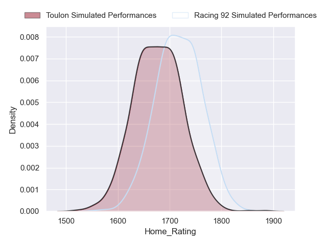
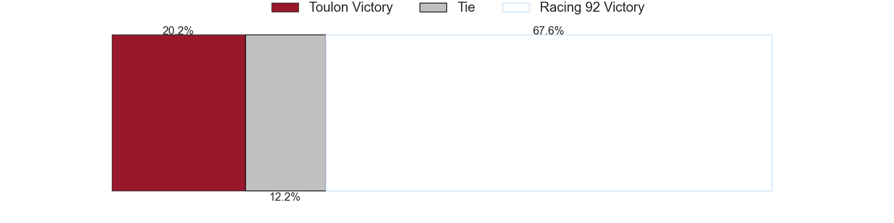
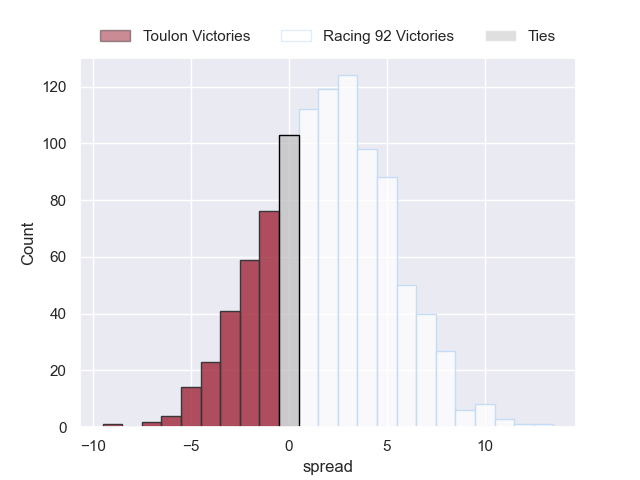

---  
title: "Top 14 Orange 2023 Status"  
date: 2024-03-07 6:00:00 -0500  
categories: model review projection  
layout: article  
aside:  
    toc: true  
---
# Current Team Rankings

# Standings

## Current Standings

| Club                 |   Played |   Wins |   Point Differential |   Losing Bonus Points |   Try Bonus Points |   Competition Points |
|:---------------------|---------:|-------:|---------------------:|----------------------:|-------------------:|---------------------:|
| Stade Toulousain     |       17 |     12 |                  139 |                     1 |                  6 |                   55 |
| Stade Francais Paris |       17 |     12 |                   89 |                     1 |                  4 |                   55 |
| Bordeaux Begles      |       17 |     10 |                   45 |                     3 |                  2 |                   45 |
| Castres Olympique    |       17 |      9 |                   46 |                     4 |                  4 |                   44 |
| Toulon               |       17 |      9 |                   70 |                     3 |                  2 |                   41 |
| La Rochelle          |       17 |      8 |                   65 |                     5 |                  3 |                   40 |
| Racing 92            |       17 |      8 |                   45 |                     4 |                  4 |                   40 |
| Pau                  |       17 |      9 |                   11 |                     2 |                  2 |                   40 |
| Bayonne              |       17 |      8 |                  -31 |                     4 |                  2 |                   38 |
| Clermont Auvergne    |       17 |      7 |                  -44 |                     3 |                  3 |                   36 |
| Montpellier Herault  |       17 |      7 |                  -28 |                     4 |                  1 |                   33 |
| Lyon                 |       17 |      7 |                 -131 |                     2 |                  3 |                   33 |
| Perpignan            |       17 |      7 |                 -130 |                     0 |                  3 |                   31 |
| Oyonnax              |       17 |      5 |                 -146 |                     3 |                  0 |                   23 |

## Projected Remaining Table

| Club                 |   Matches Remaining |   Wins |   Point Differential |   Losing Bonus Points |   Try Bonus Points |   Competition Points |
|:---------------------|--------------------:|-------:|---------------------:|----------------------:|-------------------:|---------------------:|
| Stade Toulousain     |                   9 |    8   |             52.799   |                   1   |                2   |                 34.8 |
| La Rochelle          |                   9 |    7   |             46.2455  |                   1.4 |                2   |                 31.4 |
| Bordeaux Begles      |                   9 |    5.5 |             17.8504  |                   3.1 |                1.8 |                 26.7 |
| Clermont Auvergne    |                   9 |    5.7 |             16.3396  |                   2.1 |                1.3 |                 26.3 |
| Castres Olympique    |                   9 |    4.7 |              1.61931 |                   3.2 |                1.2 |                 23.3 |
| Toulon               |                   9 |    4.7 |              1.18259 |                   2.9 |                1.1 |                 22.7 |
| Montpellier Herault  |                   9 |    4.3 |              1.31985 |                   3.3 |                1.5 |                 21.9 |
| Lyon                 |                   9 |    4.4 |             -1.2907  |                   3.2 |                1.1 |                 21.7 |
| Racing 92            |                   9 |    4.4 |             -9.03094 |                   2.2 |                1   |                 20.7 |
| Bayonne              |                   9 |    3.9 |             -5.028   |                   3.6 |                0.8 |                 19.8 |
| Stade Francais Paris |                   9 |    3.8 |            -13.9166  |                   2.6 |                0.9 |                 18.8 |
| Pau                  |                   9 |    3.6 |            -20.2307  |                   1.9 |                1   |                 17.2 |
| Oyonnax              |                   9 |    2.1 |            -43.1259  |                   2.8 |                0.3 |                 11.6 |
| Perpignan            |                   9 |    1   |            -44.7334  |                   3.6 |                0.3 |                  7.9 |

## Projected Total Table

| Club                 |   Total Matches |   Wins |   Point Differential |   Losing Bonus Points |   Try Bonus Points |   Competition Points |
|:---------------------|----------------:|-------:|---------------------:|----------------------:|-------------------:|---------------------:|
| Stade Toulousain     |              26 |   20   |            191.799   |                   2   |                8   |                 89.8 |
| Stade Francais Paris |              26 |   15.8 |             75.0834  |                   3.6 |                4.9 |                 73.8 |
| Bordeaux Begles      |              26 |   15.5 |             62.8504  |                   6.1 |                3.8 |                 71.7 |
| La Rochelle          |              26 |   15   |            111.246   |                   6.4 |                5   |                 71.4 |
| Castres Olympique    |              26 |   13.7 |             47.6193  |                   7.2 |                5.2 |                 67.3 |
| Toulon               |              26 |   13.7 |             71.1826  |                   5.9 |                3.1 |                 63.7 |
| Clermont Auvergne    |              26 |   12.7 |            -27.6604  |                   5.1 |                4.3 |                 62.3 |
| Racing 92            |              26 |   12.4 |             35.9691  |                   6.2 |                5   |                 60.7 |
| Bayonne              |              26 |   11.9 |            -36.028   |                   7.6 |                2.8 |                 57.8 |
| Pau                  |              26 |   12.6 |             -9.23069 |                   3.9 |                3   |                 57.2 |
| Montpellier Herault  |              26 |   11.3 |            -26.6802  |                   7.3 |                2.5 |                 54.9 |
| Lyon                 |              26 |   11.4 |           -132.291   |                   5.2 |                4.1 |                 54.7 |
| Perpignan            |              26 |    8   |           -174.733   |                   3.6 |                3.3 |                 38.9 |
| Oyonnax              |              26 |    7.1 |           -189.126   |                   5.8 |                0.3 |                 34.6 |

# Completed Match Review

| Model | Percent Correct Predictions | Spread Error |
| ------ | ------ | ------ |
| Club Level | 68.9% | 11.7 |
| Player Level: Lineup | 75.6% | 11.6 |
| Player Level: Minutes | 73.9% | 11.4 |

# Future Predictions

## Week 18

### Pau V Bayonne on 2024/03/09

Average Margin: Pau by 2.7

Average Scoreline: 28-25

### Perpignan V Stade Toulousain on 2024/03/09

Average Margin: Stade Toulousain by 8.4

Average Scoreline: 33-25

### La Rochelle V Stade Francais Paris on 2024/03/09

Average Margin: La Rochelle by 8.0

Average Scoreline: 25-17

### Clermont Auvergne V Oyonnax on 2024/03/09

Average Margin: Clermont Auvergne by 9.1

Average Scoreline: 32-23

### Lyon V Castres Olympique on 2024/03/09

Average Margin: Lyon by 3.2

Average Scoreline: 28-25

### Montpellier Herault V Bordeaux Begles on 2024/03/09

Average Margin: Montpellier Herault by 1.2

Average Scoreline: 28-26

### Racing 92 V Toulon on 2024/03/10

Average Margin: Racing 92 by 2.0

Average Scoreline: 31-29

## Week 19

### Bordeaux Begles V Stade Toulousain on 2024/03/23

Average Margin: Stade Toulousain by 0.5

Average Scoreline: 24-24

### Bayonne V La Rochelle on 2024/03/23

Average Margin: La Rochelle by 3.0

Average Scoreline: 27-24

### Clermont Auvergne V Pau on 2024/03/23

Average Margin: Clermont Auvergne by 5.7

Average Scoreline: 24-18

### Oyonnax V Perpignan on 2024/03/23

Average Margin: Oyonnax by 3.3

Average Scoreline: 27-23

### Stade Francais Paris V Lyon on 2024/03/23

Average Margin: Stade Francais Paris by 3.8

Average Scoreline: 30-26

### Toulon V Montpellier Herault on 2024/03/23

Average Margin: Toulon by 4.3

Average Scoreline: 26-22

### Castres Olympique V Racing 92 on 2024/03/23

Average Margin: Castres Olympique by 3.4

Average Scoreline: 26-22

## Week 20

### Racing 92 V Clermont Auvergne on 2024/03/30

Average Margin: Racing 92 by 2.9

Average Scoreline: 29-26

### Perpignan V Castres Olympique on 2024/03/30

Average Margin: Castres Olympique by 1.8

Average Scoreline: 30-28

### Montpellier Herault V Stade Francais Paris on 2024/03/30

Average Margin: Montpellier Herault by 3.1

Average Scoreline: 32-28

### Lyon V Bordeaux Begles on 2024/03/30

Average Margin: Lyon by 0.9

Average Scoreline: 32-31

### Bayonne V Toulon on 2024/03/30

Average Margin: Bayonne by 0.8

Average Scoreline: 25-24

### La Rochelle V Oyonnax on 2024/03/30

Average Margin: La Rochelle by 13.5

Average Scoreline: 29-16

### Stade Toulousain V Pau on 2024/03/30

Average Margin: Stade Toulousain by 11.6

Average Scoreline: 29-18

## Week 21

### Bordeaux Begles V Clermont Auvergne on 2024/04/20

Average Margin: Bordeaux Begles by 5.4

Average Scoreline: 23-18

### Oyonnax V Racing 92 on 2024/04/20

Average Margin: Racing 92 by 1.6

Average Scoreline: 26-24

### Stade Francais Paris V Bayonne on 2024/04/20

Average Margin: Stade Francais Paris by 5.1

Average Scoreline: 23-18

### Perpignan V Lyon on 2024/04/20

Average Margin: Lyon by 1.8

Average Scoreline: 30-28

### Pau V Montpellier Herault on 2024/04/20

Average Margin: Pau by 1.3

Average Scoreline: 31-29

### Toulon V Stade Toulousain on 2024/04/20

Average Margin: Stade Toulousain by 2.0

Average Scoreline: 27-25

### Castres Olympique V La Rochelle on 2024/04/20

Average Margin: La Rochelle by 1.8

Average Scoreline: 26-24

## Week 22

### Clermont Auvergne V Stade Francais Paris on 2024/04/27

Average Margin: Clermont Auvergne by 3.4

Average Scoreline: 30-27

### Bayonne V Bordeaux Begles on 2024/04/27

Average Margin: Bordeaux Begles by 0.4

Average Scoreline: 20-20

### La Rochelle V Toulon on 2024/04/27

Average Margin: La Rochelle by 7.1

Average Scoreline: 22-15

### Stade Toulousain V Racing 92 on 2024/04/27

Average Margin: Stade Toulousain by 9.9

Average Scoreline: 20-10

### Montpellier Herault V Perpignan on 2024/04/27

Average Margin: Montpellier Herault by 8.9

Average Scoreline: 37-29

### Lyon V Pau on 2024/04/27

Average Margin: Lyon by 4.9

Average Scoreline: 21-16

### Oyonnax V Castres Olympique on 2024/04/27

Average Margin: Castres Olympique by 1.6

Average Scoreline: 27-25

## Week 23

### Stade Toulousain V Stade Francais Paris on 2024/05/11

Average Margin: Stade Toulousain by 9.4

Average Scoreline: 21-12

### Perpignan V Clermont Auvergne on 2024/05/11

Average Margin: Clermont Auvergne by 2.4

Average Scoreline: 33-31

### Castres Olympique V Montpellier Herault on 2024/05/11

Average Margin: Castres Olympique by 3.2

Average Scoreline: 35-32

### Bordeaux Begles V La Rochelle on 2024/05/11

Average Margin: Bordeaux Begles by 0.7

Average Scoreline: 20-19

### Racing 92 V Bayonne on 2024/05/11

Average Margin: Racing 92 by 4.3

Average Scoreline: 20-15

### Pau V Oyonnax on 2024/05/11

Average Margin: Pau by 6.5

Average Scoreline: 30-23

### Toulon V Lyon on 2024/05/11

Average Margin: Toulon by 4.7

Average Scoreline: 20-15

## Week 24

### Lyon V Racing 92 on 2024/05/18

Average Margin: Lyon by 3.2

Average Scoreline: 22-19

### La Rochelle V Pau on 2024/05/18

Average Margin: La Rochelle by 10.1

Average Scoreline: 22-12

### Stade Francais Paris V Bordeaux Begles on 2024/05/18

Average Margin: Stade Francais Paris by 1.3

Average Scoreline: 23-22

### Bayonne V Perpignan on 2024/05/18

Average Margin: Bayonne by 7.1

Average Scoreline: 31-24

### Montpellier Herault V Stade Toulousain on 2024/05/18

Average Margin: Stade Toulousain by 3.0

Average Scoreline: 29-26

### Clermont Auvergne V Castres Olympique on 2024/05/18

Average Margin: Clermont Auvergne by 4.2

Average Scoreline: 29-25

### Oyonnax V Toulon on 2024/05/18

Average Margin: Toulon by 2.8

Average Scoreline: 27-24

## Week 25

### Toulon V Clermont Auvergne on 2024/06/01

Average Margin: Toulon by 3.9

Average Scoreline: 31-27

### Montpellier Herault V Lyon on 2024/06/01

Average Margin: Montpellier Herault by 3.7

Average Scoreline: 26-22

### Oyonnax V Bayonne on 2024/06/01

Average Margin: Bayonne by 0.4

Average Scoreline: 27-27

### Racing 92 V Pau on 2024/06/01

Average Margin: Racing 92 by 5.1

Average Scoreline: 23-18

### Perpignan V Bordeaux Begles on 2024/06/01

Average Margin: Bordeaux Begles by 4.4

Average Scoreline: 33-28

### Castres Olympique V Stade Francais Paris on 2024/06/01

Average Margin: Castres Olympique by 3.0

Average Scoreline: 33-30

### Stade Toulousain V La Rochelle on 2024/06/01

Average Margin: Stade Toulousain by 4.9

Average Scoreline: 11-6

## Week 26

### Stade Francais Paris V Toulon on 2024/06/08

Average Margin: Stade Francais Paris by 2.6

Average Scoreline: 23-20

### Bordeaux Begles V Oyonnax on 2024/06/08

Average Margin: Bordeaux Begles by 11.0

Average Scoreline: 27-16

### La Rochelle V Racing 92 on 2024/06/08

Average Margin: La Rochelle by 8.4

Average Scoreline: 20-12

### Pau V Perpignan on 2024/06/08

Average Margin: Pau by 6.6

Average Scoreline: 31-24

### Lyon V Stade Toulousain on 2024/06/08

Average Margin: Stade Toulousain by 3.1

Average Scoreline: 27-24

### Bayonne V Castres Olympique on 2024/06/08

Average Margin: Bayonne by 2.1

Average Scoreline: 29-27

### Clermont Auvergne V Montpellier Herault on 2024/06/08

Average Margin: Clermont Auvergne by 3.8

Average Scoreline: 30-26

## Week 27

## Week 28

## Week 29
