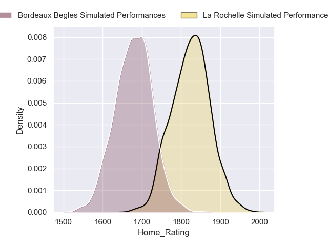
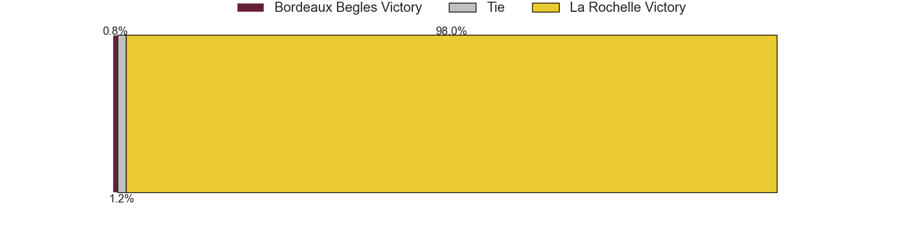
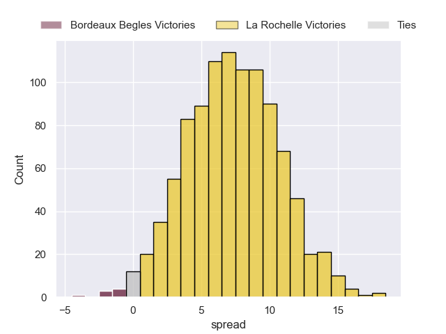

---  
title: "Top 14 Orange 2023 Status"  
date: 2023-11-13 6:00:00 -0500  
categories: model review projection  
layout: article  
aside:  
    toc: true  
---
# Current Team Rankings

# Standings

## Current Standings

| Club                 |   Played |   Wins |   Point Differential |   Losing Bonus Points |   Try Bonus Points |   Competition Points |
|:---------------------|---------:|-------:|---------------------:|----------------------:|-------------------:|---------------------:|
| Stade Francais Paris |        6 |      5 |                   61 |                     0 |                  2 |                   22 |
| Pau                  |        6 |      5 |                   59 |                     1 |                  1 |                   22 |
| Racing 92            |        6 |      4 |                   52 |                     2 |                  1 |                   19 |
| Castres Olympique    |        6 |      4 |                   44 |                     1 |                  2 |                   19 |
| Stade Toulousain     |        6 |      4 |                   24 |                     1 |                  1 |                   18 |
| Clermont Auvergne    |        6 |      4 |                   22 |                     0 |                  2 |                   18 |
| Toulon               |        6 |      3 |                   23 |                     2 |                  1 |                   15 |
| Bordeaux Begles      |        6 |      3 |                   -1 |                     1 |                  0 |                   13 |
| Lyon                 |        6 |      2 |                  -26 |                     2 |                  2 |                   12 |
| La Rochelle          |        6 |      2 |                    7 |                     3 |                  0 |                   11 |
| Bayonne              |        6 |      2 |                  -45 |                     2 |                  0 |                   10 |
| Oyonnax              |        6 |      2 |                  -57 |                     0 |                  0 |                    8 |
| Montpellier Herault  |        6 |      1 |                  -48 |                     2 |                  0 |                    6 |
| Perpignan            |        6 |      1 |                 -115 |                     0 |                  0 |                    4 |

## Projected Remaining Table

| Club                 |   Matches Remaining |   Wins |   Point Differential |   Losing Bonus Points |   Try Bonus Points |   Competition Points |
|:---------------------|--------------------:|-------:|---------------------:|----------------------:|-------------------:|---------------------:|
| La Rochelle          |                  21 |   17.1 |                108.2 |                   3.4 |               16.1 |                 87.8 |
| Stade Toulousain     |                  21 |   16.6 |                 99.6 |                   3.7 |               15.5 |                 85.7 |
| Racing 92            |                  21 |   13.1 |                 33.6 |                   5.4 |               11.9 |                 69.6 |
| Toulon               |                  21 |   13   |                 34.8 |                   5.6 |               11.7 |                 69.5 |
| Lyon                 |                  21 |   12.5 |                 32.9 |                   6.1 |               11.3 |                 67.5 |
| Bordeaux Begles      |                  21 |   12   |                 25.6 |                   6.3 |               10.6 |                 65.1 |
| Clermont Auvergne    |                  21 |   11   |                  0.5 |                   6   |                9.7 |                 59.8 |
| Stade Francais Paris |                  21 |    9.4 |                -11.1 |                   7.1 |                8.1 |                 52.9 |
| Pau                  |                  21 |    9.3 |                -16.8 |                   6.1 |                8.2 |                 51.5 |
| Montpellier Herault  |                  21 |    9.2 |                -20.5 |                   6.4 |                8   |                 51   |
| Castres Olympique    |                  21 |    8.8 |                -21.4 |                   7.5 |                7.4 |                 50   |
| Oyonnax              |                  21 |    6.4 |                -67.1 |                   6.7 |                5.2 |                 37.7 |
| Bayonne              |                  21 |    6.1 |                -67.6 |                   6.9 |                5   |                 36.4 |
| Perpignan            |                  21 |    2.4 |               -130.5 |                   6.2 |                1.7 |                 17.4 |
| TBC                  |                   6 |    3   |                  0   |                   1.9 |                2.6 |                 16.5 |
| POOL_2               |                   1 |    0.8 |                  3.6 |                   0.2 |                0.7 |                  3.9 |
| SF_1_W               |                   1 |    0.7 |                  3.4 |                   0.2 |                0.7 |                  3.9 |
| POOL_1               |                   1 |    0.7 |                  3.1 |                   0.2 |                0.7 |                  3.7 |
| POOL_3               |                   1 |    0.7 |                  3   |                   0.2 |                0.7 |                  3.7 |
| POOL_4               |                   1 |    0.7 |                  3   |                   0.2 |                0.6 |                  3.6 |
| POOL_5               |                   1 |    0.3 |                 -3   |                   0.3 |                0.3 |                  1.8 |
| POOL_6               |                   1 |    0.3 |                 -3   |                   0.3 |                0.2 |                  1.7 |
| QF_2                 |                   1 |    0.3 |                 -3.1 |                   0.3 |                0.2 |                  1.7 |
| SF_2_W               |                   1 |    0.3 |                 -3.4 |                   0.3 |                0.2 |                  1.6 |
| QF_1                 |                   1 |    0.2 |                 -3.6 |                   0.3 |                0.2 |                  1.5 |

## Projected Total Table

| Club                 |   Total Matches |   Wins |   Point Differential |   Losing Bonus Points |   Try Bonus Points |   Competition Points |
|:---------------------|----------------:|-------:|---------------------:|----------------------:|-------------------:|---------------------:|
| Stade Toulousain     |              27 |   20.6 |                123.6 |                   4.7 |               16.5 |                103.7 |
| La Rochelle          |              27 |   19.1 |                115.2 |                   6.4 |               16.1 |                 98.8 |
| Racing 92            |              27 |   17.1 |                 85.6 |                   7.4 |               12.9 |                 88.6 |
| Toulon               |              27 |   16   |                 57.8 |                   7.6 |               12.7 |                 84.5 |
| Lyon                 |              27 |   14.5 |                  6.9 |                   8.1 |               13.3 |                 79.5 |
| Bordeaux Begles      |              27 |   15   |                 24.6 |                   7.3 |               10.6 |                 78.1 |
| Clermont Auvergne    |              27 |   15   |                 22.5 |                   6   |               11.7 |                 77.8 |
| Stade Francais Paris |              27 |   14.4 |                 49.9 |                   7.1 |               10.1 |                 74.9 |
| Pau                  |              27 |   14.3 |                 42.2 |                   7.1 |                9.2 |                 73.5 |
| Castres Olympique    |              27 |   12.8 |                 22.6 |                   8.5 |                9.4 |                 69   |
| Montpellier Herault  |              27 |   10.2 |                -68.5 |                   8.4 |                8   |                 57   |
| Bayonne              |              27 |    8.1 |               -112.6 |                   8.9 |                5   |                 46.4 |
| Oyonnax              |              27 |    8.4 |               -124.1 |                   6.7 |                5.2 |                 45.7 |
| Perpignan            |              27 |    3.4 |               -245.5 |                   6.2 |                1.7 |                 21.4 |
| TBC                  |               6 |    3   |                  0   |                   1.9 |                2.6 |                 16.5 |
| POOL_2               |               1 |    0.8 |                  3.6 |                   0.2 |                0.7 |                  3.9 |
| SF_1_W               |               1 |    0.7 |                  3.4 |                   0.2 |                0.7 |                  3.9 |
| POOL_1               |               1 |    0.7 |                  3.1 |                   0.2 |                0.7 |                  3.7 |
| POOL_3               |               1 |    0.7 |                  3   |                   0.2 |                0.7 |                  3.7 |
| POOL_4               |               1 |    0.7 |                  3   |                   0.2 |                0.6 |                  3.6 |
| POOL_5               |               1 |    0.3 |                 -3   |                   0.3 |                0.3 |                  1.8 |
| POOL_6               |               1 |    0.3 |                 -3   |                   0.3 |                0.2 |                  1.7 |
| QF_2                 |               1 |    0.3 |                 -3.1 |                   0.3 |                0.2 |                  1.7 |
| SF_2_W               |               1 |    0.3 |                 -3.4 |                   0.3 |                0.2 |                  1.6 |
| QF_1                 |               1 |    0.2 |                 -3.6 |                   0.3 |                0.2 |                  1.5 |

# Completed Match Review

| Model | Percent Correct Predictions | Spread Error |
| ------ | ------ | ------ |
| Club Level | 71.4% | 11.7 |
| Player Level: Lineup | 71.4% | 12.2 |
| Player Level: Minutes | 73.8% | 12.2 |

# Future Predictions

## Week 7

### Castres Olympique V Stade Toulousain on 2023/11/18

Average Margin: Stade Toulousain by 2.2

### Bayonne V Pau on 2023/11/18

Average Margin: Bayonne by 0.5

### Stade Francais Paris V Racing 92 on 2023/11/18

Average Margin: Stade Francais Paris by 1.9

### Oyonnax V Lyon on 2023/11/18

Average Margin: Lyon by 1.5

### Perpignan V Montpellier Herault on 2023/11/18

Average Margin: Montpellier Herault by 1.8

### Clermont Auvergne V Toulon on 2023/11/18

Average Margin: Clermont Auvergne by 1.8

### La Rochelle V Bordeaux Begles on 2023/11/19

Average Margin: La Rochelle by 6.8

## Week 8

### Stade Toulousain V Clermont Auvergne on 2023/11/25

Average Margin: Stade Toulousain by 7.8

### Racing 92 V La Rochelle on 2023/11/25

Average Margin: La Rochelle by 0.0

### Lyon V Bayonne on 2023/11/25

Average Margin: Lyon by 7.9

### Toulon V Castres Olympique on 2023/11/25

Average Margin: Toulon by 5.9

### Pau V Stade Francais Paris on 2023/11/25

Average Margin: Pau by 2.5

### Bordeaux Begles V Perpignan on 2023/11/25

Average Margin: Bordeaux Begles by 10.7

### Montpellier Herault V Oyonnax on 2023/11/25

Average Margin: Montpellier Herault by 6.0

## Week 9

### Castres Olympique V Lyon on 2023/12/02

Average Margin: Castres Olympique by 1.4

### Toulon V Pau on 2023/12/02

Average Margin: Toulon by 5.9

### Clermont Auvergne V Racing 92 on 2023/12/02

Average Margin: Clermont Auvergne by 1.9

### Oyonnax V Bordeaux Begles on 2023/12/02

Average Margin: Bordeaux Begles by 1.4

### Stade Francais Paris V Stade Toulousain on 2023/12/02

Average Margin: Stade Toulousain by 1.1

### La Rochelle V Perpignan on 2023/12/02

Average Margin: La Rochelle by 14.3

### Bayonne V Montpellier Herault on 2023/12/02

Average Margin: Bayonne by 1.1

## Week 10

### Racing 92 V Oyonnax on 2023/12/23

Average Margin: Racing 92 by 8.4

### Stade Francais Paris V La Rochelle on 2023/12/23

Average Margin: La Rochelle by 1.3

### Stade Toulousain V Toulon on 2023/12/23

Average Margin: Stade Toulousain by 6.1

### Montpellier Herault V Castres Olympique on 2023/12/23

Average Margin: Montpellier Herault by 2.9

### Bordeaux Begles V Lyon on 2023/12/23

Average Margin: Bordeaux Begles by 3.1

### Pau V Clermont Auvergne on 2023/12/23

Average Margin: Pau by 2.5

### Perpignan V Bayonne on 2023/12/23

Average Margin: Perpignan by 0.7

## Week 11

### Lyon V Montpellier Herault on 2023/12/30

Average Margin: Lyon by 5.6

### Castres Olympique V Perpignan on 2023/12/30

Average Margin: Castres Olympique by 8.7

### Bayonne V Racing 92 on 2023/12/30

Average Margin: Racing 92 by 1.4

### La Rochelle V Stade Toulousain on 2023/12/30

Average Margin: La Rochelle by 3.5

### Oyonnax V Pau on 2023/12/30

Average Margin: Oyonnax by 0.3

### Toulon V Stade Francais Paris on 2023/12/30

Average Margin: Toulon by 5.2

### Clermont Auvergne V Bordeaux Begles on 2023/12/30

Average Margin: Clermont Auvergne by 2.6

## Week 12

### Stade Francais Paris V Clermont Auvergne on 2024/01/06

Average Margin: Stade Francais Paris by 3.1

### Perpignan V Oyonnax on 2024/01/06

Average Margin: Perpignan by 0.6

### Bordeaux Begles V Bayonne on 2024/01/06

Average Margin: Bordeaux Begles by 7.9

### Montpellier Herault V Toulon on 2024/01/06

Average Margin: Montpellier Herault by 0.5

### Pau V La Rochelle on 2024/01/06

Average Margin: La Rochelle by 2.3

### Stade Toulousain V Lyon on 2024/01/06

Average Margin: Stade Toulousain by 6.9

### Racing 92 V Castres Olympique on 2024/01/06

Average Margin: Racing 92 by 5.5

## Week 13

### Racing 92 V Stade Toulousain on 2024/01/27

Average Margin: Racing 92 by 0.2

### Toulon V La Rochelle on 2024/01/27

Average Margin: Toulon by 0.3

### Castres Olympique V Clermont Auvergne on 2024/01/27

Average Margin: Castres Olympique by 2.1

### Bayonne V Oyonnax on 2024/01/27

Average Margin: Bayonne by 3.5

### Montpellier Herault V Pau on 2024/01/27

Average Margin: Montpellier Herault by 3.0

### Bordeaux Begles V Stade Francais Paris on 2024/01/27

Average Margin: Bordeaux Begles by 4.3

### Lyon V Perpignan on 2024/01/27

Average Margin: Lyon by 10.7

## Week 14

### Clermont Auvergne V Lyon on 2024/02/03

Average Margin: Clermont Auvergne by 2.4

### Toulon V Bordeaux Begles on 2024/02/03

Average Margin: Toulon by 4.0

### Oyonnax V Stade Francais Paris on 2024/02/03

Average Margin: Stade Francais Paris by 0.2

### Pau V Castres Olympique on 2024/02/03

Average Margin: Pau by 3.2

### Perpignan V Racing 92 on 2024/02/03

Average Margin: Racing 92 by 4.3

### La Rochelle V Montpellier Herault on 2024/02/03

Average Margin: La Rochelle by 9.4

### Stade Toulousain V Bayonne on 2024/02/03

Average Margin: Stade Toulousain by 11.3

## Week 15

### Castres Olympique V Toulon on 2024/02/17

Average Margin: Castres Olympique by 0.7

### Bordeaux Begles V Pau on 2024/02/17

Average Margin: Bordeaux Begles by 5.2

### Racing 92 V Montpellier Herault on 2024/02/17

Average Margin: Racing 92 by 6.1

### Bayonne V Clermont Auvergne on 2024/02/17

Average Margin: Clermont Auvergne by 0.3

### Stade Francais Paris V Perpignan on 2024/02/17

Average Margin: Stade Francais Paris by 9.7

### Stade Toulousain V Oyonnax on 2024/02/17

Average Margin: Stade Toulousain by 11.7

### Lyon V La Rochelle on 2024/02/17

Average Margin: La Rochelle by 0.3

## Week 16

### Montpellier Herault V Bayonne on 2024/02/24

Average Margin: Montpellier Herault by 5.6

### Lyon V Oyonnax on 2024/02/24

Average Margin: Lyon by 8.1

### Castres Olympique V Bordeaux Begles on 2024/02/24

Average Margin: Castres Olympique by 1.5

### Racing 92 V Stade Francais Paris on 2024/02/24

Average Margin: Racing 92 by 4.9

### Pau V Toulon on 2024/02/24

Average Margin: Pau by 0.9

### Clermont Auvergne V Stade Toulousain on 2024/02/24

Average Margin: Stade Toulousain by 1.0

### Perpignan V La Rochelle on 2024/02/24

Average Margin: La Rochelle by 7.6

## Week 17

### La Rochelle V Clermont Auvergne on 2024/03/02

Average Margin: La Rochelle by 7.9

### Bayonne V Lyon on 2024/03/02

Average Margin: Lyon by 1.2

### Toulon V Bordeaux Begles on 2024/03/02

Average Margin: Toulon by 4.2

### Toulon V Perpignan on 2024/03/02

Average Margin: Toulon by 11.4

### La Rochelle V Montpellier Herault on 2024/03/02

Average Margin: La Rochelle by 9.4

### Stade Toulousain V Bayonne on 2024/03/02

Average Margin: Stade Toulousain by 11.4

### Oyonnax V Stade Francais Paris on 2024/03/02

Average Margin: Stade Francais Paris by 0.3

### Perpignan V Racing 92 on 2024/03/02

Average Margin: Racing 92 by 4.3

### Clermont Auvergne V Lyon on 2024/03/02

Average Margin: Clermont Auvergne by 2.2

### Pau V Castres Olympique on 2024/03/02

Average Margin: Pau by 3.4

### Stade Toulousain V Castres Olympique on 2024/03/02

Average Margin: Stade Toulousain by 8.8

### Stade Francais Paris V Pau on 2024/03/02

Average Margin: Stade Francais Paris by 4.2

### Oyonnax V Montpellier Herault on 2024/03/02

Average Margin: Oyonnax by 0.8

### Bordeaux Begles V Racing 92 on 2024/03/02

Average Margin: Bordeaux Begles by 3.1

## Week 18

### Montpellier Herault V Bordeaux Begles on 2024/03/09

Average Margin: Montpellier Herault by 1.1

### Perpignan V Stade Toulousain on 2024/03/09

Average Margin: Stade Toulousain by 7.3

### Lyon V Castres Olympique on 2024/03/09

Average Margin: Lyon by 5.3

### Clermont Auvergne V Oyonnax on 2024/03/09

Average Margin: Clermont Auvergne by 7.3

### La Rochelle V Stade Francais Paris on 2024/03/09

Average Margin: La Rochelle by 8.0

### Pau V Bayonne on 2024/03/09

Average Margin: Pau by 6.3

### Racing 92 V Toulon on 2024/03/09

Average Margin: Racing 92 by 2.9

## Week 19

### Oyonnax V Perpignan on 2024/03/23

Average Margin: Oyonnax by 5.9

### Bayonne V La Rochelle on 2024/03/23

Average Margin: La Rochelle by 4.9

### Toulon V Montpellier Herault on 2024/03/23

Average Margin: Toulon by 6.3

### Castres Olympique V Racing 92 on 2024/03/23

Average Margin: Castres Olympique by 1.0

### Bordeaux Begles V Stade Toulousain on 2024/03/23

Average Margin: Stade Toulousain by 0.2

### Stade Francais Paris V Lyon on 2024/03/23

Average Margin: Stade Francais Paris by 2.0

### Clermont Auvergne V Pau on 2024/03/23

Average Margin: Clermont Auvergne by 4.5

## Week 20

### Montpellier Herault V Stade Francais Paris on 2024/03/30

Average Margin: Montpellier Herault by 2.2

### Racing 92 V Clermont Auvergne on 2024/03/30

Average Margin: Racing 92 by 4.4

### Bayonne V Toulon on 2024/03/30

Average Margin: Toulon by 1.8

### Stade Toulousain V Pau on 2024/03/30

Average Margin: Stade Toulousain by 8.7

### Perpignan V Castres Olympique on 2024/03/30

Average Margin: Castres Olympique by 2.0

### La Rochelle V Oyonnax on 2024/03/30

Average Margin: La Rochelle by 11.6

### Lyon V Bordeaux Begles on 2024/03/30

Average Margin: Lyon by 3.6

## Week 21

### Perpignan V Lyon on 2024/04/20

Average Margin: Lyon by 3.9

### Castres Olympique V La Rochelle on 2024/04/20

Average Margin: La Rochelle by 2.3

### Toulon V Stade Toulousain on 2024/04/20

Average Margin: Toulon by 0.6

### Oyonnax V Racing 92 on 2024/04/20

Average Margin: Racing 92 by 1.7

### Stade Francais Paris V Bayonne on 2024/04/20

Average Margin: Stade Francais Paris by 6.7

### Bordeaux Begles V Clermont Auvergne on 2024/04/20

Average Margin: Bordeaux Begles by 4.2

### Pau V Montpellier Herault on 2024/04/20

Average Margin: Pau by 3.8

## Week 22

### Stade Toulousain V Racing 92 on 2024/04/27

Average Margin: Stade Toulousain by 6.5

### Montpellier Herault V Perpignan on 2024/04/27

Average Margin: Montpellier Herault by 8.4

### Lyon V Pau on 2024/04/27

Average Margin: Lyon by 5.4

### La Rochelle V Toulon on 2024/04/27

Average Margin: La Rochelle by 6.4

### Oyonnax V Castres Olympique on 2024/04/27

Average Margin: Oyonnax by 0.6

### Clermont Auvergne V Stade Francais Paris on 2024/04/27

Average Margin: Clermont Auvergne by 3.5

### Bayonne V Bordeaux Begles on 2024/04/27

Average Margin: Bordeaux Begles by 1.1

## Week 23

### Bordeaux Begles V La Rochelle on 2024/05/11

Average Margin: La Rochelle by 0.4

### Racing 92 V Bayonne on 2024/05/11

Average Margin: Racing 92 by 8.3

### Stade Toulousain V Stade Francais Paris on 2024/05/11

Average Margin: Stade Toulousain by 7.9

### Perpignan V Clermont Auvergne on 2024/05/11

Average Margin: Clermont Auvergne by 2.9

### Castres Olympique V Montpellier Herault on 2024/05/11

Average Margin: Castres Olympique by 3.7

### Toulon V Lyon on 2024/05/11

Average Margin: Toulon by 3.8

### Pau V Oyonnax on 2024/05/11

Average Margin: Pau by 6.1

## Week 24

### Lyon V Racing 92 on 2024/05/18

Average Margin: Lyon by 3.1

### Clermont Auvergne V Castres Olympique on 2024/05/18

Average Margin: Clermont Auvergne by 4.4

### Montpellier Herault V Stade Toulousain on 2024/05/18

Average Margin: Stade Toulousain by 2.5

### Stade Francais Paris V Bordeaux Begles on 2024/05/18

Average Margin: Stade Francais Paris by 2.3

### Oyonnax V Toulon on 2024/05/18

Average Margin: Toulon by 2.0

### Bayonne V Perpignan on 2024/05/18

Average Margin: Bayonne by 6.1

### La Rochelle V Pau on 2024/05/18

Average Margin: La Rochelle by 8.8

## Week 25

### Oyonnax V Bayonne on 2024/06/01

Average Margin: Oyonnax by 3.4

### Stade Toulousain V La Rochelle on 2024/06/01

Average Margin: Stade Toulousain by 3.0

### Perpignan V Bordeaux Begles on 2024/06/01

Average Margin: Bordeaux Begles by 3.7

### Toulon V Clermont Auvergne on 2024/06/01

Average Margin: Toulon by 4.8

### Montpellier Herault V Lyon on 2024/06/01

Average Margin: Montpellier Herault by 0.9

### Castres Olympique V Stade Francais Paris on 2024/06/01

Average Margin: Castres Olympique by 2.4

### Racing 92 V Pau on 2024/06/01

Average Margin: Racing 92 by 5.6

## Week 26

### La Rochelle V Racing 92 on 2024/06/08

Average Margin: La Rochelle by 6.7

### Lyon V Stade Toulousain on 2024/06/08

Average Margin: Lyon by 0.1

### Pau V Perpignan on 2024/06/08

Average Margin: Pau by 8.7

### Bayonne V Castres Olympique on 2024/06/08

Average Margin: Bayonne by 0.9

### Stade Francais Paris V Toulon on 2024/06/08

Average Margin: Stade Francais Paris by 1.6

### Bordeaux Begles V Oyonnax on 2024/06/08

Average Margin: Bordeaux Begles by 8.2

### Clermont Auvergne V Montpellier Herault on 2024/06/08

Average Margin: Clermont Auvergne by 4.6

## Week 27

## Week 28

## Week 29
