---  
title: "Top 14 Orange 2023 Status"  
date: 2023-08-03 6:00:00 -0500  
categories: model review projection  
layout: article  
aside:  
    toc: true  
---
# Current Team Rankings

# Standings

## Projected Total Table

| Club                 |   Total Matches |   Wins |   Point Differential |   Losing Bonus Points |   Try Bonus Points |   Competition Points |
|:---------------------|----------------:|-------:|---------------------:|----------------------:|-------------------:|---------------------:|
| La Rochelle          |              26 |   22.8 |                175.9 |                   2.8 |               21.7 |                115.6 |
| Stade Toulousain     |              26 |   21.9 |                154.8 |                   3.4 |               20.8 |                111.7 |
| Toulon               |              26 |   16.6 |                 54.2 |                   6.2 |               15.1 |                 87.5 |
| Lyon                 |              26 |   16.5 |                 54.5 |                   6.4 |               15   |                 87.3 |
| Bordeaux Begles      |              26 |   15.4 |                 35.9 |                   6.8 |               13.9 |                 82.3 |
| Racing 92            |              26 |   15.3 |                 33.8 |                   6.7 |               13.9 |                 81.8 |
| Clermont Auvergne    |              26 |   13.3 |                  3   |                   7.3 |               11.8 |                 72.4 |
| Montpellier Herault  |              26 |   12.9 |                 -1.1 |                   7.6 |               11.5 |                 70.7 |
| Stade Francais Paris |              26 |   10.9 |                -33.8 |                   7.9 |                9.5 |                 61   |
| Castres Olympique    |              26 |   10   |                -48   |                   8   |                8.5 |                 56.4 |
| Pau                  |              26 |    8.4 |                -76.3 |                   7.8 |                7.2 |                 48.6 |
| Oyonnax              |              26 |    7.1 |                -99.4 |                   7.8 |                5.8 |                 42.1 |
| Bayonne              |              26 |    5.9 |               -120.6 |                   7.7 |                4.7 |                 36.1 |
| Perpignan            |              26 |    5.1 |               -133   |                   7.8 |                4   |                 32.2 |

# Future Predictions

## Week 15

### Bayonne V Stade Toulousain on 2023/08/18

Average Margin: Stade Toulousain by 6.6

### Perpignan V Stade Francais Paris on 2023/08/19

Average Margin: Stade Francais Paris by 0.2

### Oyonnax V Clermont Auvergne on 2023/08/19

Average Margin: Clermont Auvergne by 0.4

### Racing 92 V Bordeaux Begles on 2023/08/19

Average Margin: Racing 92 by 3.2

### Castres Olympique V Pau on 2023/08/19

Average Margin: Castres Olympique by 4.3

### Lyon V Toulon on 2023/08/19

Average Margin: Lyon by 3.3

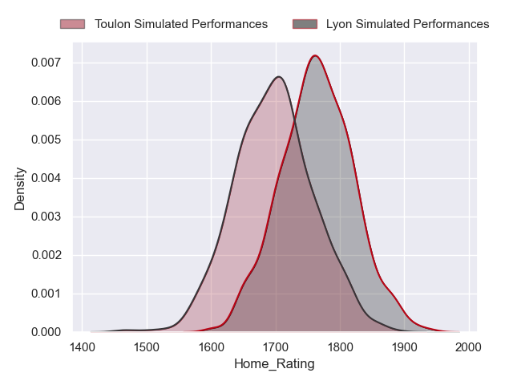
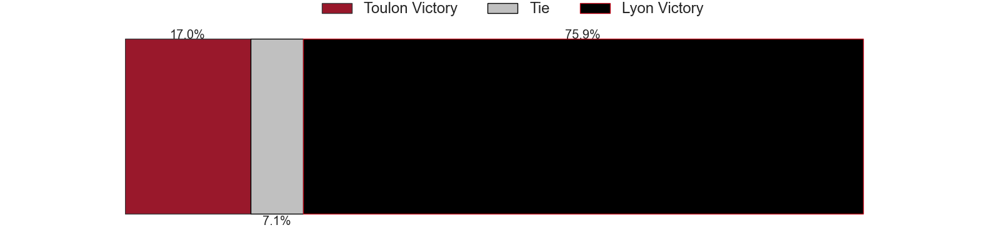
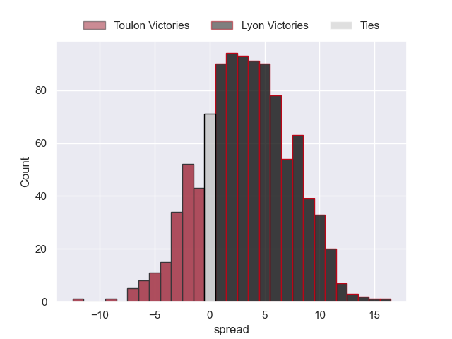

### Montpellier Herault V La Rochelle on 2023/08/20

Average Margin: La Rochelle by 3.1

## Week 16

### Stade Francais Paris V Oyonnax on 2023/08/25

Average Margin: Stade Francais Paris by 5.7

### Clermont Auvergne V Perpignan on 2023/08/26

Average Margin: Clermont Auvergne by 8.2

### Toulon V Bayonne on 2023/08/26

Average Margin: Toulon by 9.6

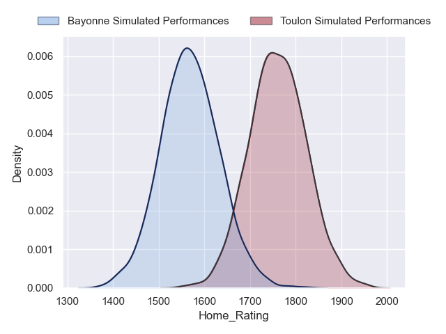
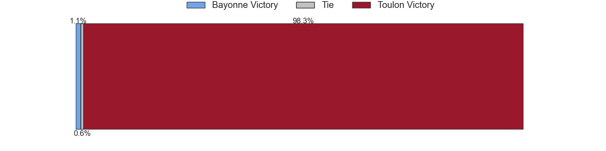
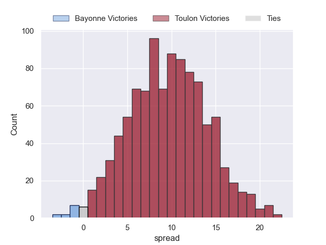

### Pau V Racing 92 on 2023/08/26

Average Margin: Racing 92 by 0.6

### La Rochelle V Lyon on 2023/08/26

Average Margin: La Rochelle by 7.7

### Bordeaux Begles V Castres Olympique on 2023/08/26

Average Margin: Bordeaux Begles by 6.5

### Stade Toulousain V Montpellier Herault on 2023/08/27

Average Margin: Stade Toulousain by 9.1

## Week 17

### Clermont Auvergne V La Rochelle on 2023/09/02

Average Margin: La Rochelle by 2.9

### Racing 92 V Perpignan on 2023/09/02

Average Margin: Racing 92 by 9.6

### Pau V Lyon on 2023/09/02

Average Margin: Lyon by 1.6

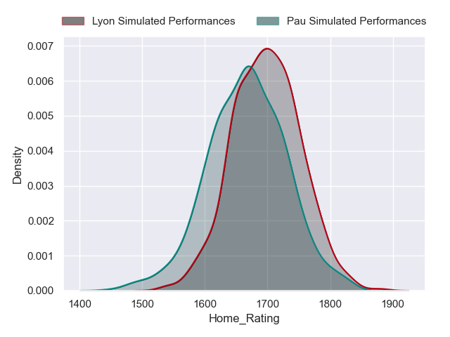
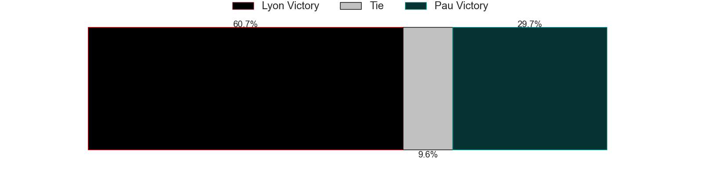
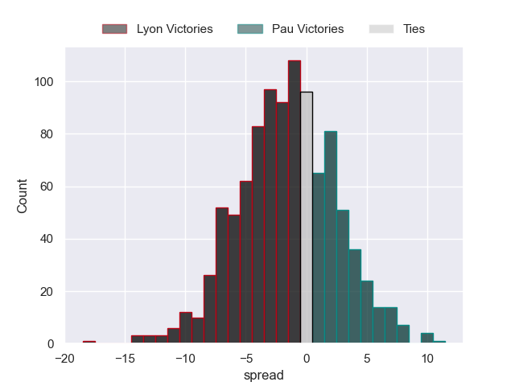

### Stade Francais Paris V Montpellier Herault on 2023/09/02

Average Margin: Stade Francais Paris by 2.1

### Castres Olympique V Bayonne on 2023/09/02

Average Margin: Castres Olympique by 5.9

### Oyonnax V Stade Toulousain on 2023/09/02

Average Margin: Stade Toulousain by 6.0

### Bordeaux Begles V Toulon on 2023/09/03

Average Margin: Bordeaux Begles by 2.7

## Week 18

### Lyon V Clermont Auvergne on 2023/10/29

Average Margin: Lyon by 5.1

### Bayonne V Stade Francais Paris on 2023/10/29

Average Margin: Bayonne by 0.1

### La Rochelle V Castres Olympique on 2023/10/29

Average Margin: La Rochelle by 11.3

### Montpellier Herault V Racing 92 on 2023/10/29

Average Margin: Montpellier Herault by 2.1

### Perpignan V Pau on 2023/10/29

Average Margin: Perpignan by 1.5

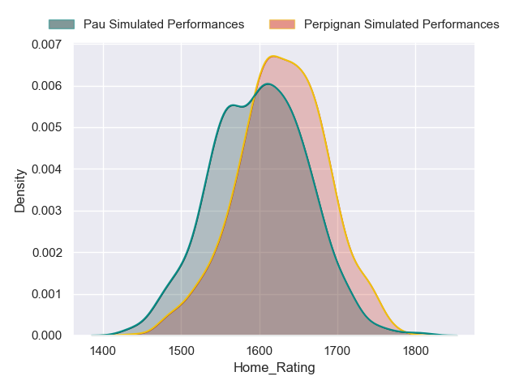

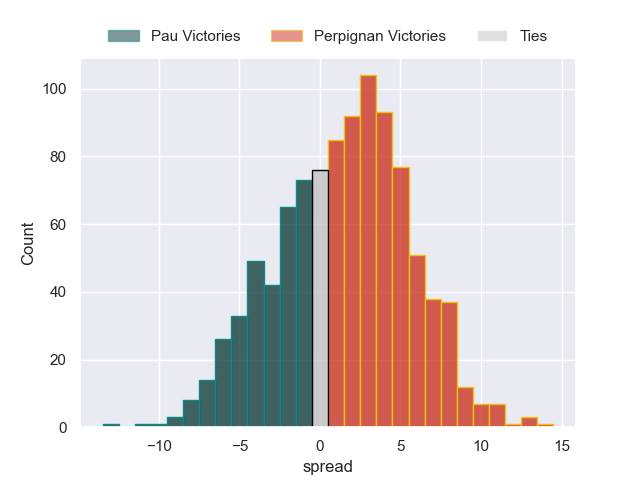

### Stade Toulousain V Bordeaux Begles on 2023/10/29

Average Margin: Stade Toulousain by 7.8

### Toulon V Oyonnax on 2023/10/29

Average Margin: Toulon by 8.9

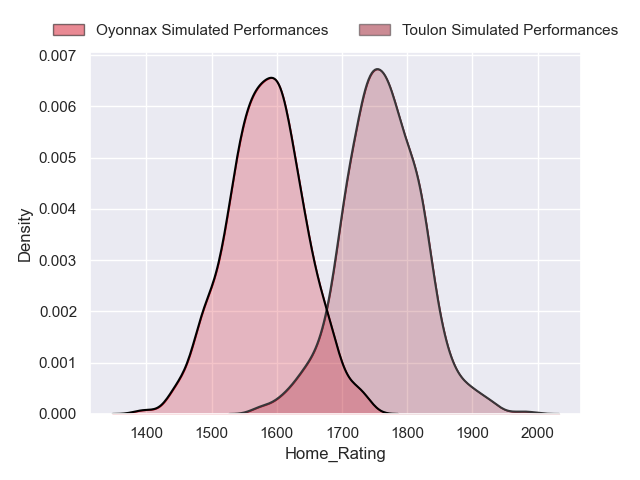
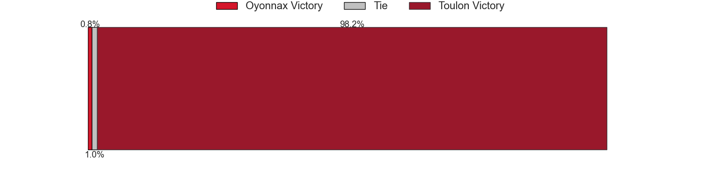
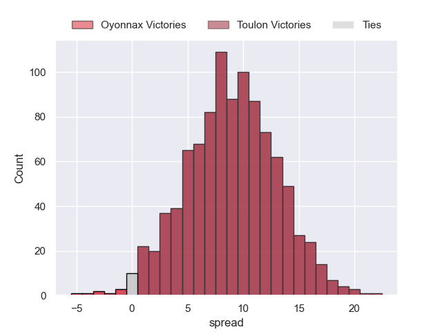

## Week 19

### Racing 92 V Lyon on 2023/11/04

Average Margin: Racing 92 by 2.6

### Perpignan V Toulon on 2023/11/04

Average Margin: Toulon by 3.6

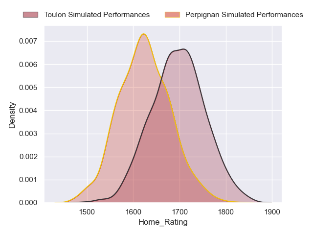
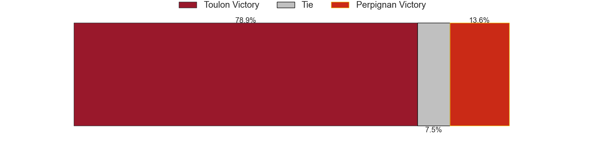
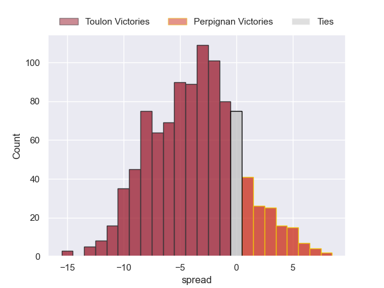

### Bordeaux Begles V Montpellier Herault on 2023/11/04

Average Margin: Bordeaux Begles by 4.6

### Clermont Auvergne V Bayonne on 2023/11/04

Average Margin: Clermont Auvergne by 7.9

### Oyonnax V La Rochelle on 2023/11/04

Average Margin: La Rochelle by 6.7

### Pau V Stade Toulousain on 2023/11/04

Average Margin: Stade Toulousain by 4.9

### Stade Francais Paris V Castres Olympique on 2023/11/04

Average Margin: Stade Francais Paris by 3.6

## Week 20

### La Rochelle V Bayonne on 2023/11/11

Average Margin: La Rochelle by 14.1

### Montpellier Herault V Clermont Auvergne on 2023/11/11

Average Margin: Montpellier Herault by 3.0

### Pau V Bordeaux Begles on 2023/11/11

Average Margin: Bordeaux Begles by 0.7

### Lyon V Stade Francais Paris on 2023/11/11

Average Margin: Lyon by 6.6

### Toulon V Racing 92 on 2023/11/11

Average Margin: Toulon by 4.0

### Stade Toulousain V Perpignan on 2023/11/11

Average Margin: Stade Toulousain by 13.7

### Castres Olympique V Oyonnax on 2023/11/11

Average Margin: Castres Olympique by 5.1

## Week 21

### Oyonnax V Lyon on 2023/11/18

Average Margin: Lyon by 2.1

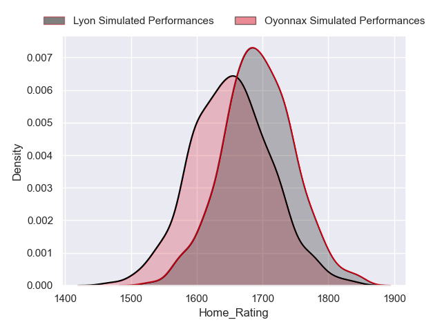
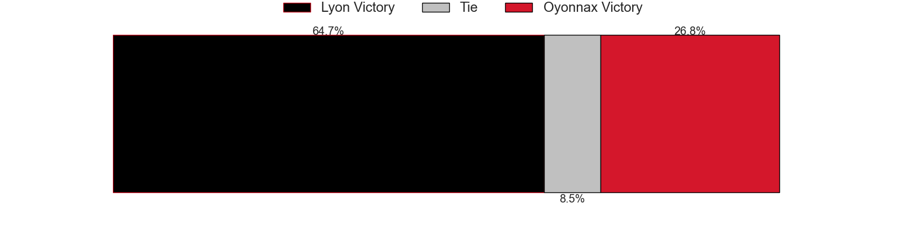
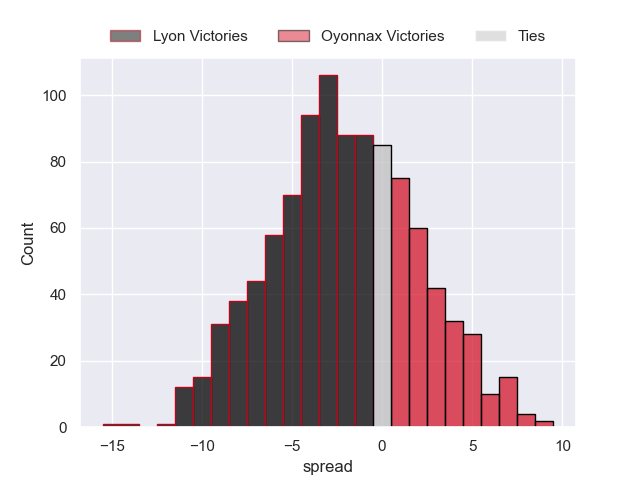

### Bayonne V Pau on 2023/11/18

Average Margin: Bayonne by 1.5

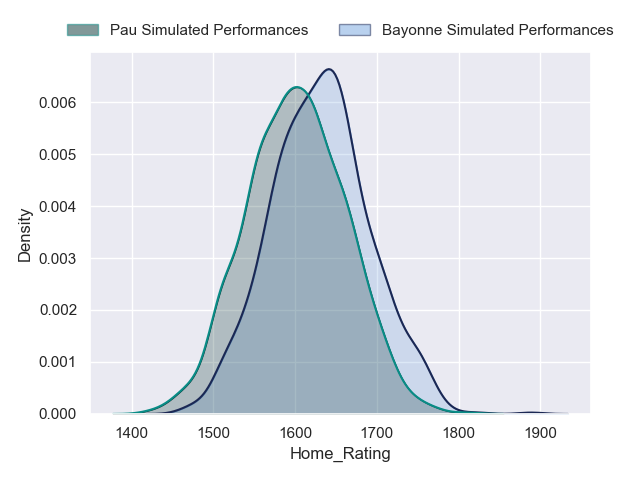
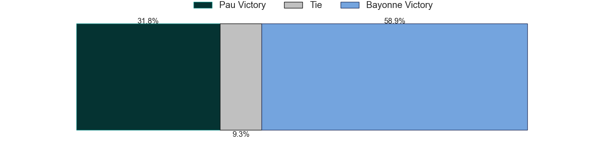
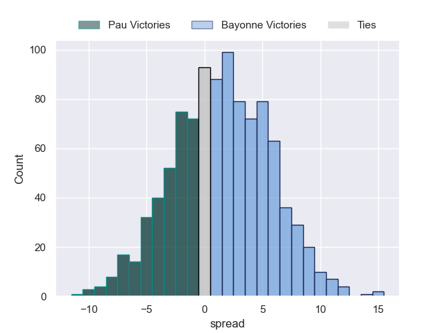

### Clermont Auvergne V Toulon on 2023/11/18

Average Margin: Clermont Auvergne by 1.5

### La Rochelle V Bordeaux Begles on 2023/11/18

Average Margin: La Rochelle by 8.5

### Stade Francais Paris V Racing 92 on 2023/11/18

Average Margin: Stade Francais Paris by 1.1

### Perpignan V Montpellier Herault on 2023/11/18

Average Margin: Montpellier Herault by 1.5

### Castres Olympique V Stade Toulousain on 2023/11/18

Average Margin: Stade Toulousain by 4.0

## Week 22

### Stade Toulousain V Clermont Auvergne on 2023/11/25

Average Margin: Stade Toulousain by 8.7

### Toulon V Castres Olympique on 2023/11/25

Average Margin: Toulon by 7.0

### Pau V Stade Francais Paris on 2023/11/25

Average Margin: Pau by 1.9

### Montpellier Herault V Oyonnax on 2023/11/25

Average Margin: Montpellier Herault by 7.0

### Bordeaux Begles V Perpignan on 2023/11/25

Average Margin: Bordeaux Begles by 9.4

### Lyon V Bayonne on 2023/11/25

Average Margin: Lyon by 9.9

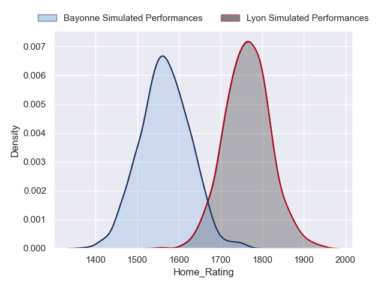
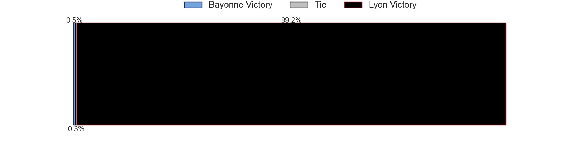
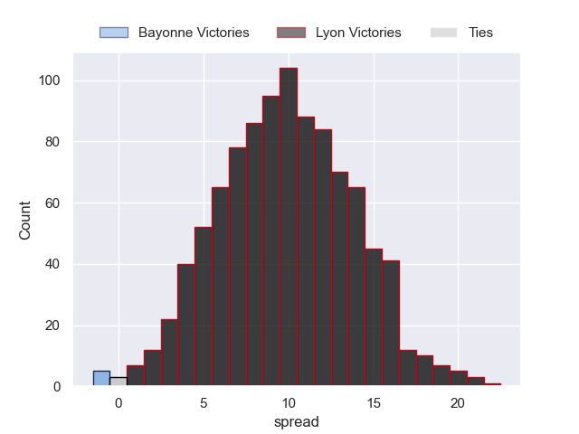

### Racing 92 V La Rochelle on 2023/11/25

Average Margin: La Rochelle by 1.7

## Week 23

### Clermont Auvergne V Racing 92 on 2023/12/02

Average Margin: Clermont Auvergne by 2.2

### La Rochelle V Perpignan on 2023/12/02

Average Margin: La Rochelle by 14.3

### Stade Francais Paris V Stade Toulousain on 2023/12/02

Average Margin: Stade Toulousain by 3.4

### Castres Olympique V Lyon on 2023/12/02

Average Margin: Lyon by 0.5

### Oyonnax V Bordeaux Begles on 2023/12/02

Average Margin: Bordeaux Begles by 1.7

### Toulon V Pau on 2023/12/02

Average Margin: Toulon by 8.1

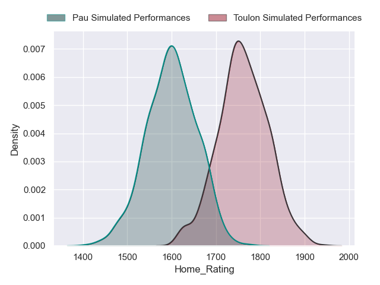
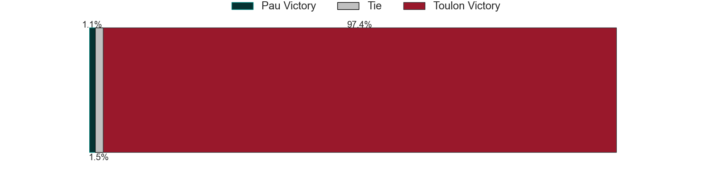
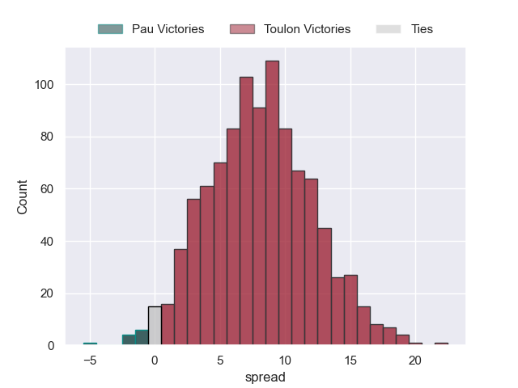

### Bayonne V Montpellier Herault on 2023/12/02

Average Margin: Montpellier Herault by 1.0

## Week 24

### Bordeaux Begles V Lyon on 2023/12/23

Average Margin: Bordeaux Begles by 2.6

### Stade Toulousain V Toulon on 2023/12/23

Average Margin: Stade Toulousain by 7.0

### Racing 92 V Oyonnax on 2023/12/23

Average Margin: Racing 92 by 8.1

### Pau V Clermont Auvergne on 2023/12/23

Average Margin: Pau by 0.5

### Stade Francais Paris V La Rochelle on 2023/12/23

Average Margin: La Rochelle by 4.2

### Montpellier Herault V Castres Olympique on 2023/12/23

Average Margin: Montpellier Herault by 5.1

### Perpignan V Bayonne on 2023/12/23

Average Margin: Perpignan by 2.9

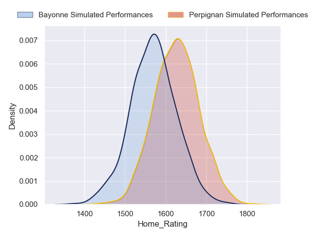
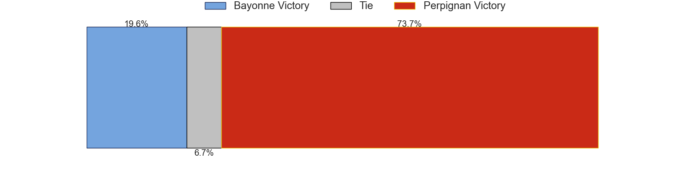
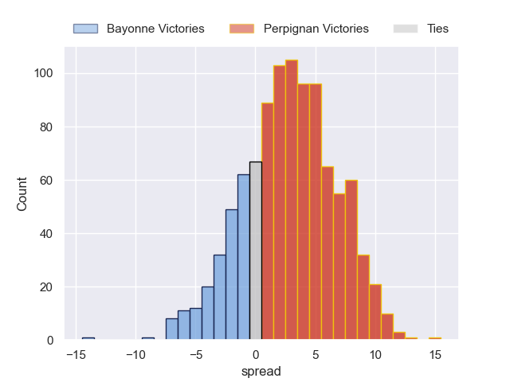

## Week 25

### Toulon V Stade Francais Paris on 2023/12/30

Average Margin: Toulon by 6.5

### Lyon V Montpellier Herault on 2023/12/30

Average Margin: Lyon by 5.3

### La Rochelle V Stade Toulousain on 2023/12/30

Average Margin: La Rochelle by 4.2

### Clermont Auvergne V Bordeaux Begles on 2023/12/30

Average Margin: Clermont Auvergne by 1.8

### Castres Olympique V Perpignan on 2023/12/30

Average Margin: Castres Olympique by 6.6

### Oyonnax V Pau on 2023/12/30

Average Margin: Oyonnax by 2.5

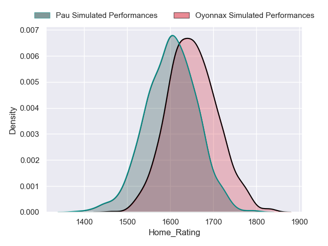
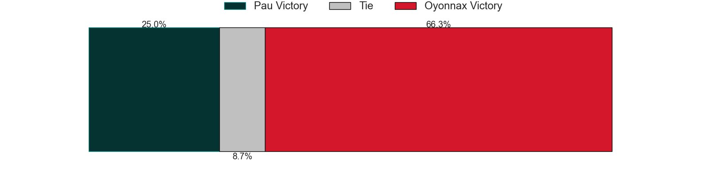
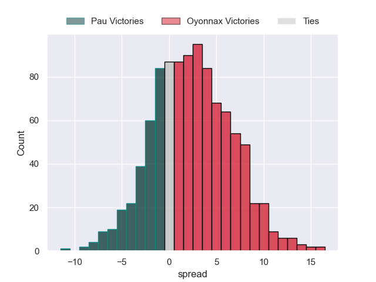

### Bayonne V Racing 92 on 2023/12/30

Average Margin: Racing 92 by 2.1

## Week 1

### Stade Toulousain V Lyon on 2024/01/06

Average Margin: Stade Toulousain by 6.9

### Stade Francais Paris V Clermont Auvergne on 2024/01/06

Average Margin: Stade Francais Paris by 2.0

### Perpignan V Oyonnax on 2024/01/06

Average Margin: Perpignan by 2.1

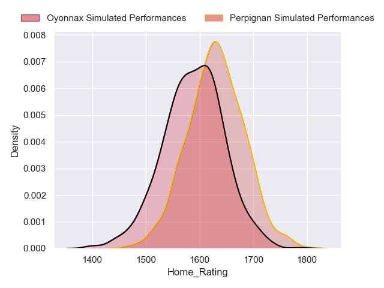
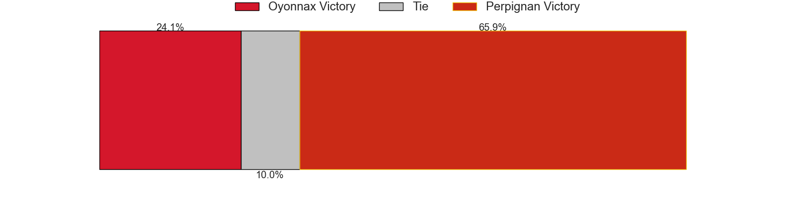
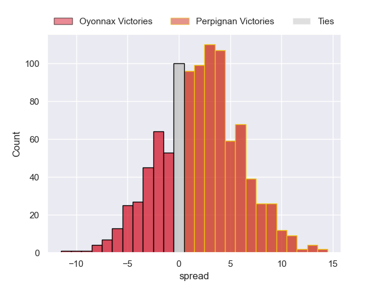

### Montpellier Herault V Toulon on 2024/01/06

Average Margin: Montpellier Herault by 1.5

### Bordeaux Begles V Bayonne on 2024/01/06

Average Margin: Bordeaux Begles by 8.8

### Racing 92 V Castres Olympique on 2024/01/06

Average Margin: Racing 92 by 6.2

### Pau V La Rochelle on 2024/01/06

Average Margin: La Rochelle by 5.7

## Week 2

### Toulon V La Rochelle on 2024/01/27

Average Margin: La Rochelle by 1.2

### Bayonne V Oyonnax on 2024/01/27

Average Margin: Bayonne by 2.5

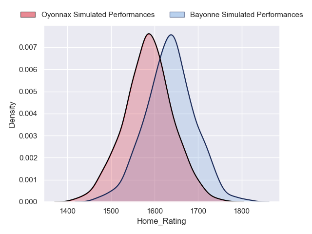
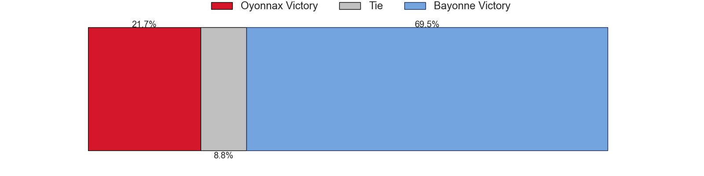
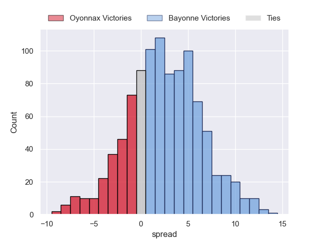

### Castres Olympique V Clermont Auvergne on 2024/01/27

Average Margin: Castres Olympique by 1.7

### Lyon V Perpignan on 2024/01/27

Average Margin: Lyon by 10.1

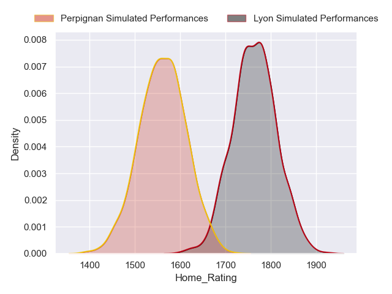
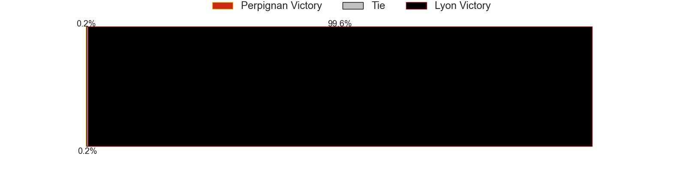
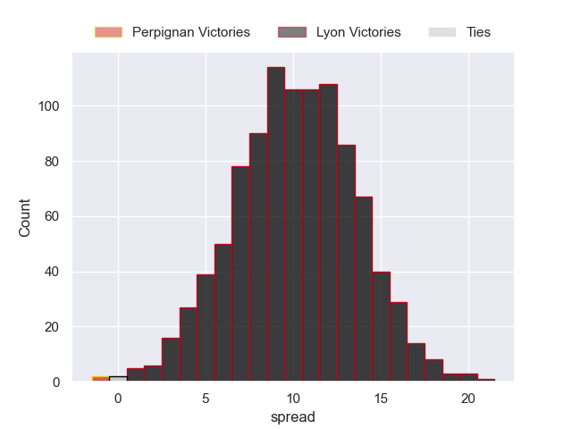

### Montpellier Herault V Pau on 2024/01/27

Average Margin: Montpellier Herault by 6.2

### Racing 92 V Stade Toulousain on 2024/01/27

Average Margin: Stade Toulousain by 0.9

### Bordeaux Begles V Stade Francais Paris on 2024/01/27

Average Margin: Bordeaux Begles by 5.9

## Week 3

### Bayonne V Clermont Auvergne on 2024/02/17

Average Margin: Clermont Auvergne by 1.0

### Stade Toulousain V Oyonnax on 2024/02/17

Average Margin: Stade Toulousain by 12.4

### Racing 92 V Montpellier Herault on 2024/02/17

Average Margin: Racing 92 by 4.5

### Stade Francais Paris V Perpignan on 2024/02/17

Average Margin: Stade Francais Paris by 6.8

### Lyon V La Rochelle on 2024/02/17

Average Margin: La Rochelle by 1.0

### Castres Olympique V Toulon on 2024/02/17

Average Margin: Toulon by 0.4

### Bordeaux Begles V Pau on 2024/02/17

Average Margin: Bordeaux Begles by 7.2

## Week 4

### Perpignan V La Rochelle on 2024/02/24

Average Margin: La Rochelle by 7.6

### Castres Olympique V Bordeaux Begles on 2024/02/24

Average Margin: Castres Olympique by 0.2

### Clermont Auvergne V Stade Toulousain on 2024/02/24

Average Margin: Stade Toulousain by 1.9

### Lyon V Oyonnax on 2024/02/24

Average Margin: Lyon by 8.9

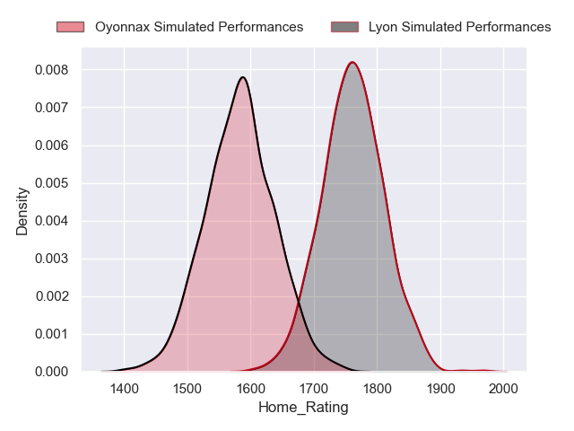
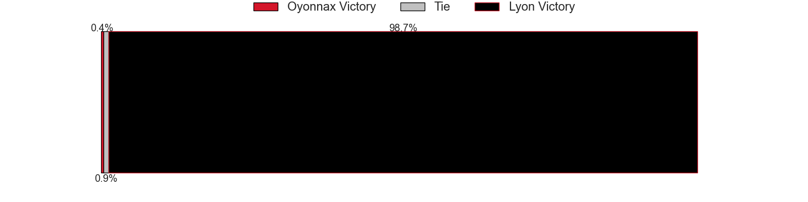
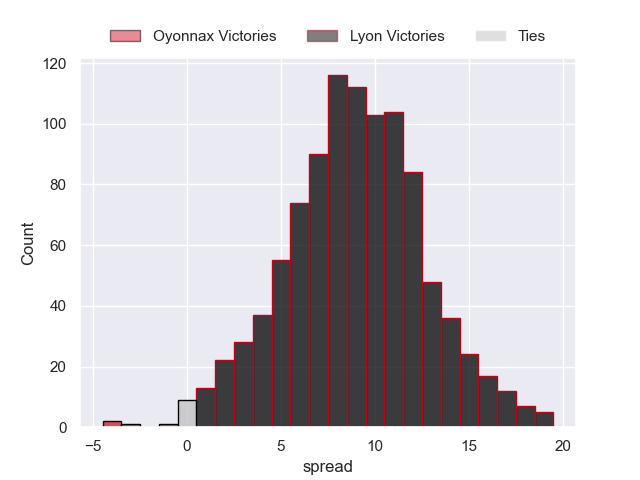

### Montpellier Herault V Bayonne on 2024/02/24

Average Margin: Montpellier Herault by 7.5

### Pau V Toulon on 2024/02/24

Average Margin: Toulon by 1.4

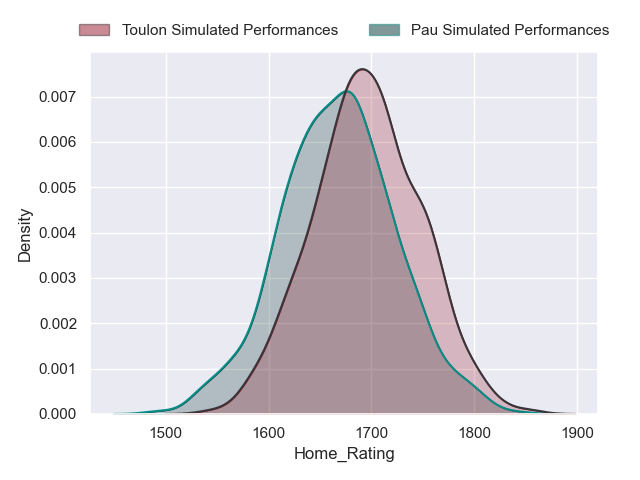
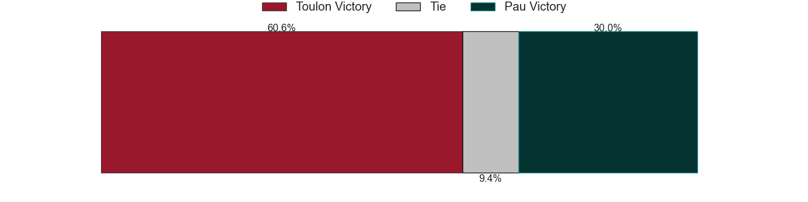
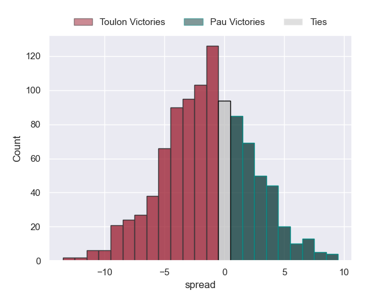

### Racing 92 V Stade Francais Paris on 2024/02/24

Average Margin: Racing 92 by 5.7

## Week 5

### Toulon V Bordeaux Begles on 2024/03/02

Average Margin: Toulon by 4.2

### Pau V Castres Olympique on 2024/03/02

Average Margin: Pau by 2.1

### La Rochelle V Montpellier Herault on 2024/03/02

Average Margin: La Rochelle by 9.5

### Clermont Auvergne V Lyon on 2024/03/02

Average Margin: Clermont Auvergne by 1.5

### Oyonnax V Stade Francais Paris on 2024/03/02

Average Margin: Oyonnax by 1.0

### Perpignan V Racing 92 on 2024/03/02

Average Margin: Racing 92 by 2.6

### Stade Toulousain V Bayonne on 2024/03/02

Average Margin: Stade Toulousain by 13.1

### Stade Toulousain V Castres Olympique on 2024/03/02

Average Margin: Stade Toulousain by 10.5

### Toulon V Perpignan on 2024/03/02

Average Margin: Toulon by 9.9

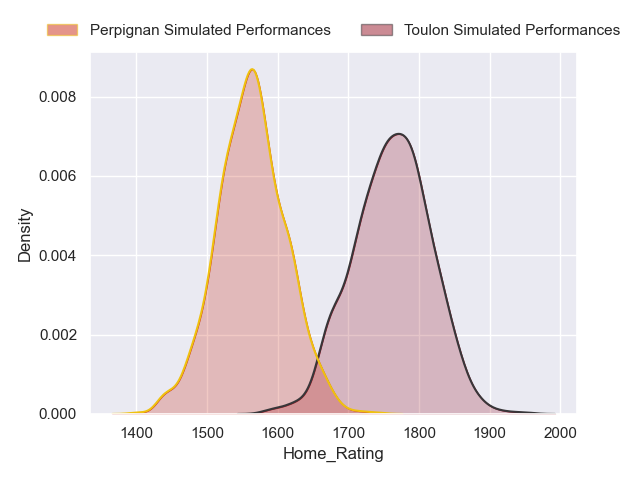
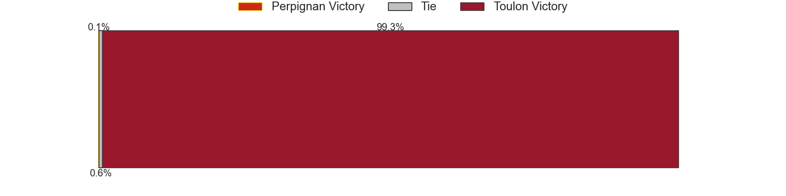
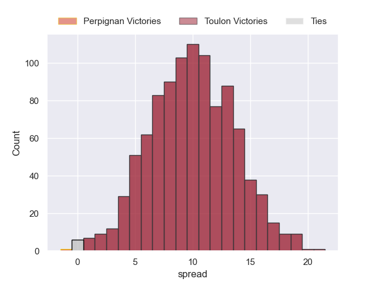

### Stade Francais Paris V Pau on 2024/03/02

Average Margin: Stade Francais Paris by 4.7

### La Rochelle V Clermont Auvergne on 2024/03/02

Average Margin: La Rochelle by 9.6

### Oyonnax V Montpellier Herault on 2024/03/02

Average Margin: Oyonnax by 0.1

### Bayonne V Lyon on 2024/03/02

Average Margin: Lyon by 3.0

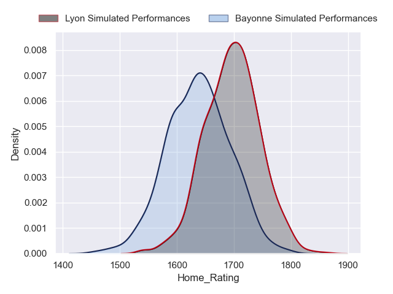
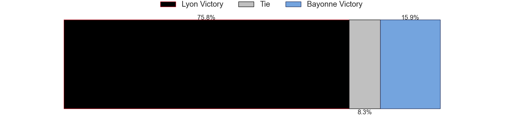
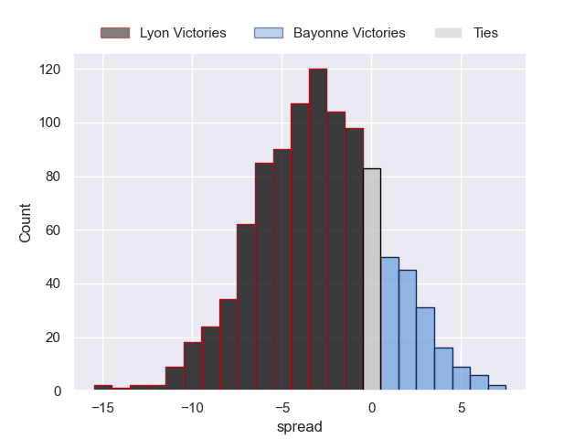

### Bordeaux Begles V Racing 92 on 2024/03/02

Average Margin: Bordeaux Begles by 3.3

## Week 6

### Pau V Bayonne on 2024/03/09

Average Margin: Pau by 4.7

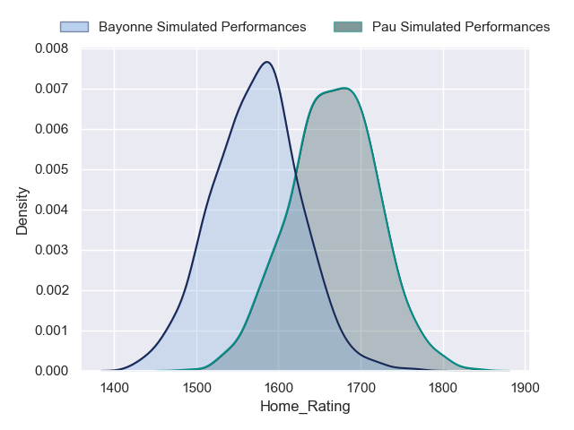
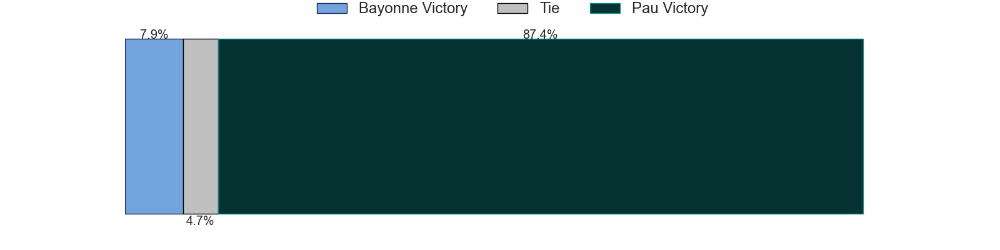
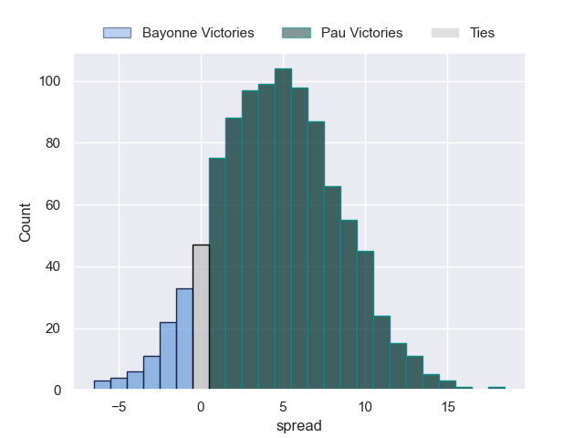

### Racing 92 V Toulon on 2024/03/09

Average Margin: Racing 92 by 2.6

### Perpignan V Stade Toulousain on 2024/03/09

Average Margin: Stade Toulousain by 7.0

### Clermont Auvergne V Oyonnax on 2024/03/09

Average Margin: Clermont Auvergne by 7.0

### La Rochelle V Stade Francais Paris on 2024/03/09

Average Margin: La Rochelle by 10.9

### Lyon V Castres Olympique on 2024/03/09

Average Margin: Lyon by 7.2

### Montpellier Herault V Bordeaux Begles on 2024/03/09

Average Margin: Montpellier Herault by 1.9

## Week 7

### Bordeaux Begles V Stade Toulousain on 2024/03/23

Average Margin: Stade Toulousain by 0.7

### Oyonnax V Perpignan on 2024/03/23

Average Margin: Oyonnax by 4.8

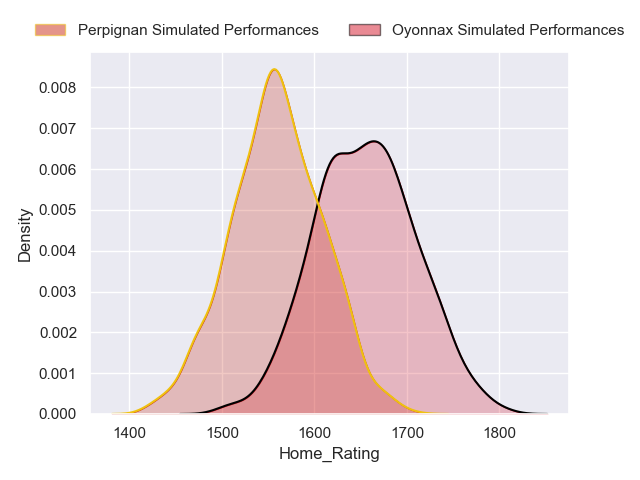
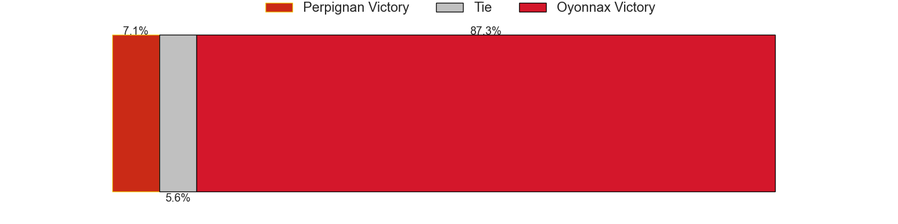
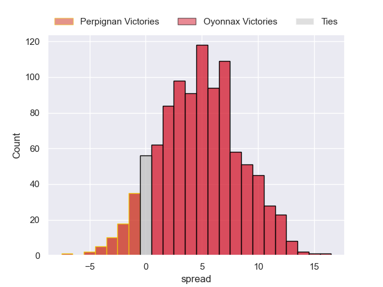

### Castres Olympique V Racing 92 on 2024/03/23

Average Margin: Castres Olympique by 0.3

### Clermont Auvergne V Pau on 2024/03/23

Average Margin: Clermont Auvergne by 6.2

### Stade Francais Paris V Lyon on 2024/03/23

Average Margin: Stade Francais Paris by 0.3

### Toulon V Montpellier Herault on 2024/03/23

Average Margin: Toulon by 5.4

### Bayonne V La Rochelle on 2024/03/23

Average Margin: La Rochelle by 7.2

## Week 8

### Bayonne V Toulon on 2024/03/30

Average Margin: Toulon by 2.9

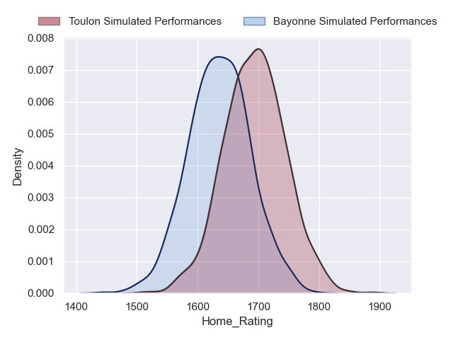
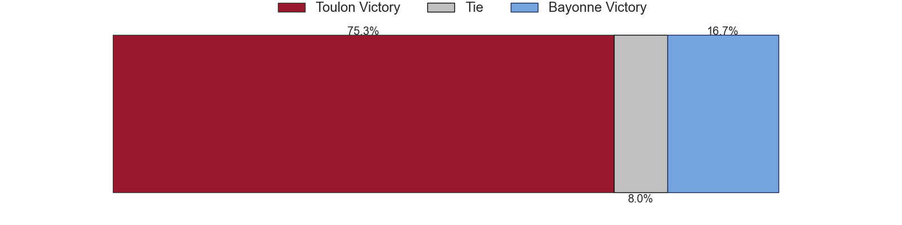
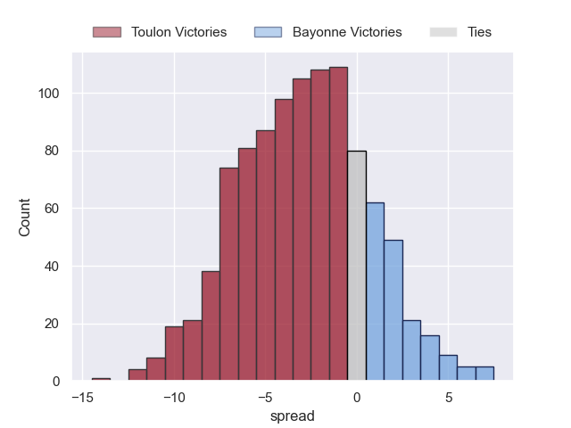

### Perpignan V Castres Olympique on 2024/03/30

Average Margin: Perpignan by 0.3

### La Rochelle V Oyonnax on 2024/03/30

Average Margin: La Rochelle by 13.2

### Lyon V Bordeaux Begles on 2024/03/30

Average Margin: Lyon by 3.9

### Montpellier Herault V Stade Francais Paris on 2024/03/30

Average Margin: Montpellier Herault by 4.5

### Racing 92 V Clermont Auvergne on 2024/03/30

Average Margin: Racing 92 by 4.3

### Stade Toulousain V Pau on 2024/03/30

Average Margin: Stade Toulousain by 11.6

## Week 9

### Oyonnax V Racing 92 on 2024/04/20

Average Margin: Racing 92 by 1.5

### Perpignan V Lyon on 2024/04/20

Average Margin: Lyon by 3.1

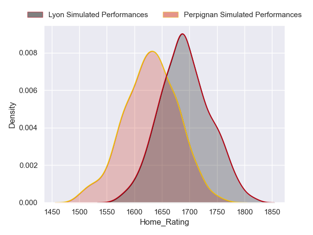
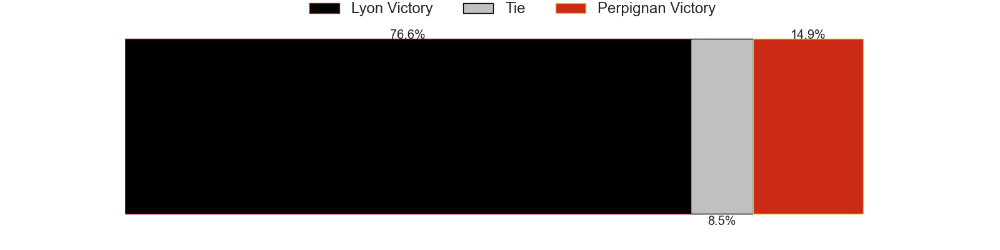
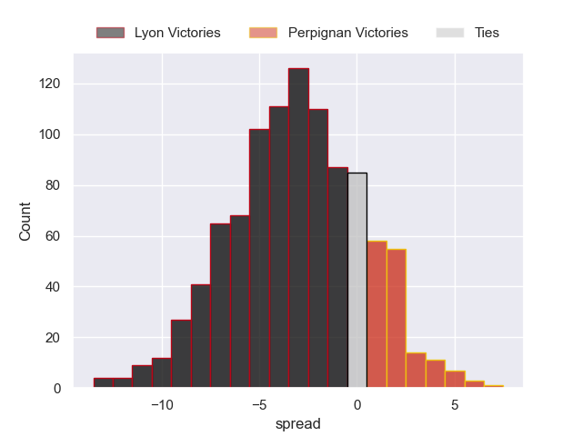

### Bordeaux Begles V Clermont Auvergne on 2024/04/20

Average Margin: Bordeaux Begles by 4.6

### Pau V Montpellier Herault on 2024/04/20

Average Margin: Pau by 0.7

### Castres Olympique V La Rochelle on 2024/04/20

Average Margin: La Rochelle by 4.6

### Stade Francais Paris V Bayonne on 2024/04/20

Average Margin: Stade Francais Paris by 6.5

### Toulon V Stade Toulousain on 2024/04/20

Average Margin: Stade Toulousain by 0.3

## Week 10

### Stade Toulousain V Racing 92 on 2024/04/27

Average Margin: Stade Toulousain by 7.8

### Clermont Auvergne V Stade Francais Paris on 2024/04/27

Average Margin: Clermont Auvergne by 4.7

### Lyon V Pau on 2024/04/27

Average Margin: Lyon by 8.0

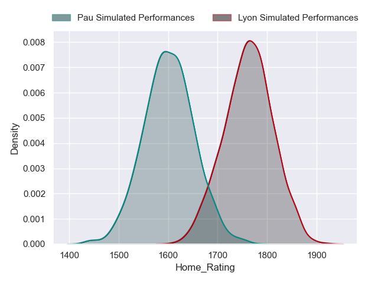
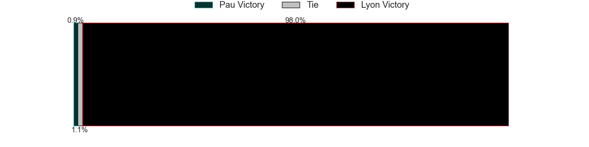
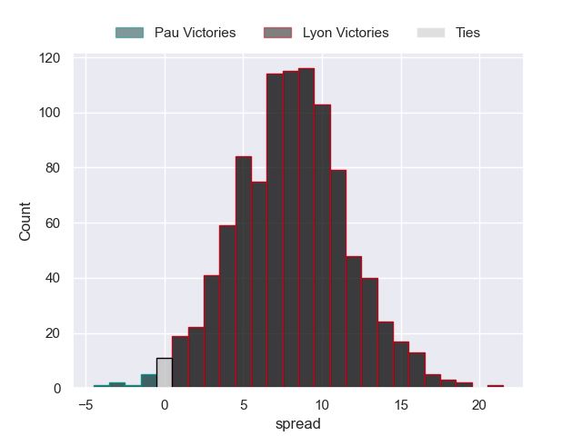

### La Rochelle V Toulon on 2024/04/27

Average Margin: La Rochelle by 7.5

### Oyonnax V Castres Olympique on 2024/04/27

Average Margin: Oyonnax by 1.7

### Bayonne V Bordeaux Begles on 2024/04/27

Average Margin: Bordeaux Begles by 2.0

### Montpellier Herault V Perpignan on 2024/04/27

Average Margin: Montpellier Herault by 8.0

## Week 11

### Stade Toulousain V Stade Francais Paris on 2024/05/11

Average Margin: Stade Toulousain by 10.1

### Toulon V Lyon on 2024/05/11

Average Margin: Toulon by 3.3

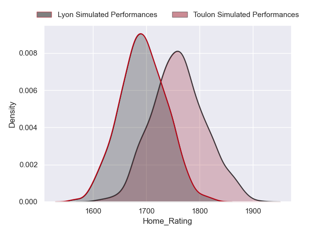
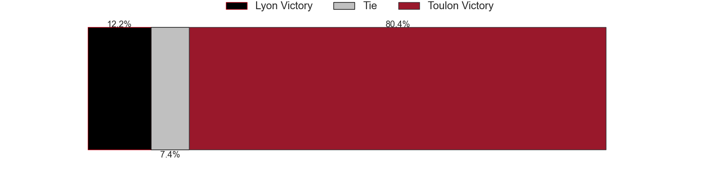
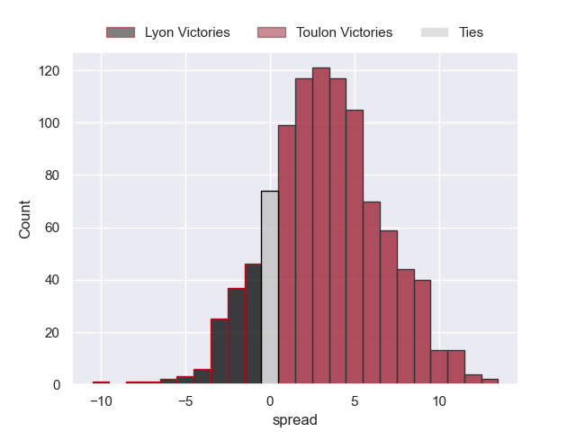

### Racing 92 V Bayonne on 2024/05/11

Average Margin: Racing 92 by 8.9

### Pau V Oyonnax on 2024/05/11

Average Margin: Pau by 4.3

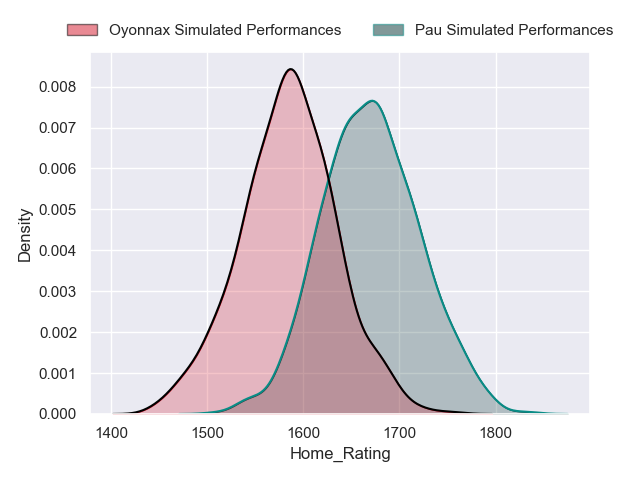
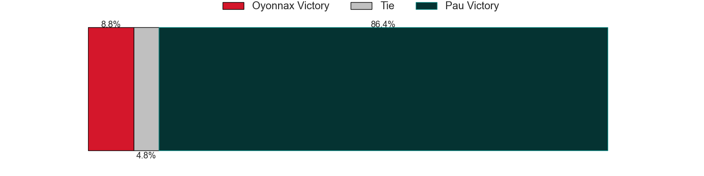
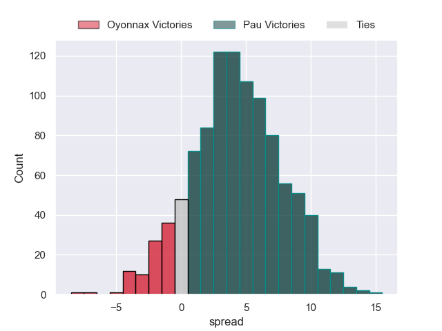

### Bordeaux Begles V La Rochelle on 2024/05/11

Average Margin: La Rochelle by 1.6

### Perpignan V Clermont Auvergne on 2024/05/11

Average Margin: Clermont Auvergne by 1.5

### Castres Olympique V Montpellier Herault on 2024/05/11

Average Margin: Castres Olympique by 1.7

## Week 12

### Montpellier Herault V Stade Toulousain on 2024/05/18

Average Margin: Stade Toulousain by 2.3

### Lyon V Racing 92 on 2024/05/18

Average Margin: Lyon by 4.0

### La Rochelle V Pau on 2024/05/18

Average Margin: La Rochelle by 12.4

### Stade Francais Paris V Bordeaux Begles on 2024/05/18

Average Margin: Stade Francais Paris by 0.8

### Clermont Auvergne V Castres Olympique on 2024/05/18

Average Margin: Clermont Auvergne by 5.2

### Bayonne V Perpignan on 2024/05/18

Average Margin: Bayonne by 3.6

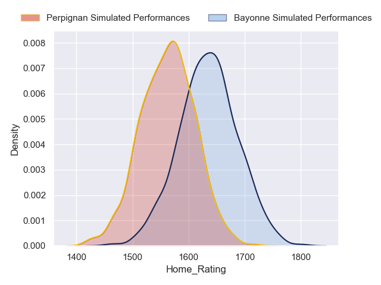

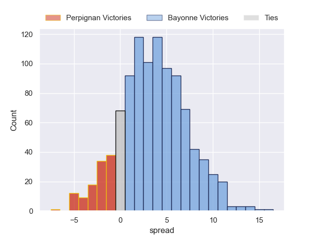

### Oyonnax V Toulon on 2024/05/18

Average Margin: Toulon by 2.1

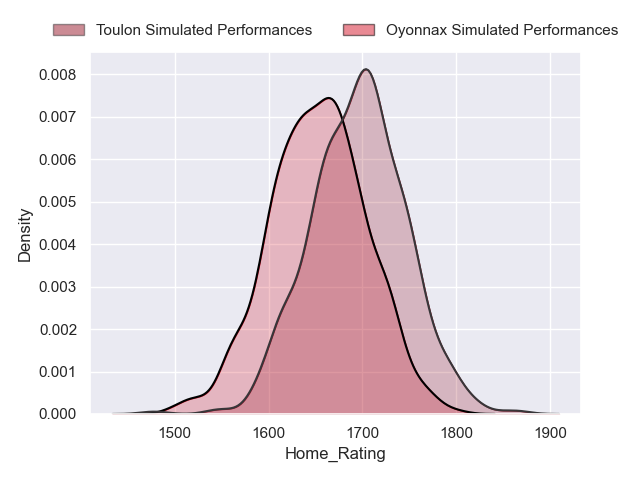
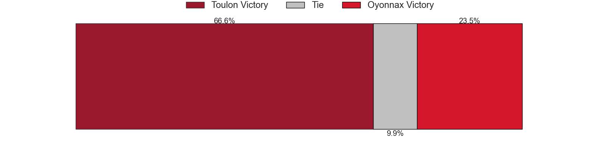
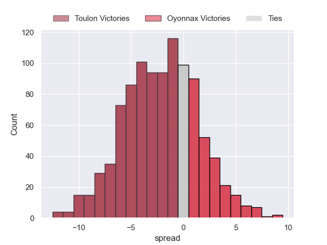

## Week 13

### Stade Toulousain V La Rochelle on 2024/06/01

Average Margin: Stade Toulousain by 2.5

### Toulon V Clermont Auvergne on 2024/06/01

Average Margin: Toulon by 5.3

### Montpellier Herault V Lyon on 2024/06/01

Average Margin: Montpellier Herault by 1.3

### Castres Olympique V Stade Francais Paris on 2024/06/01

Average Margin: Castres Olympique by 2.8

### Racing 92 V Pau on 2024/06/01

Average Margin: Racing 92 by 7.3

### Perpignan V Bordeaux Begles on 2024/06/01

Average Margin: Bordeaux Begles by 2.7

### Oyonnax V Bayonne on 2024/06/01

Average Margin: Oyonnax by 4.1

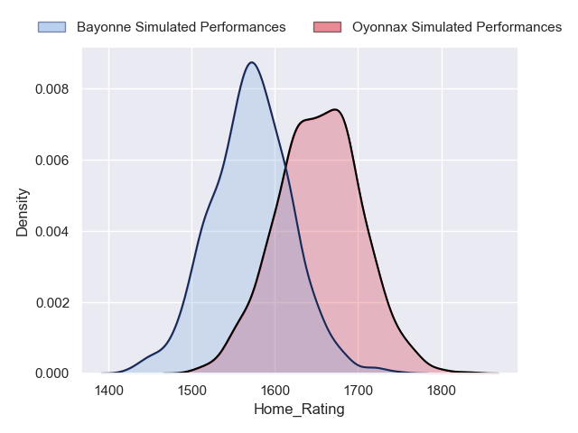
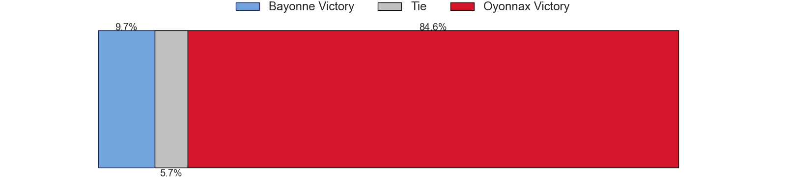
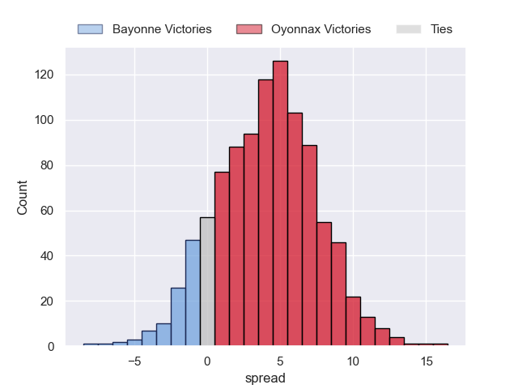

## Week 14

### Pau V Perpignan on 2024/06/08

Average Margin: Pau by 5.3

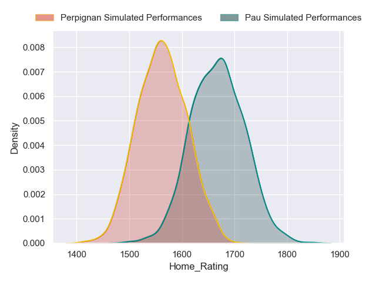
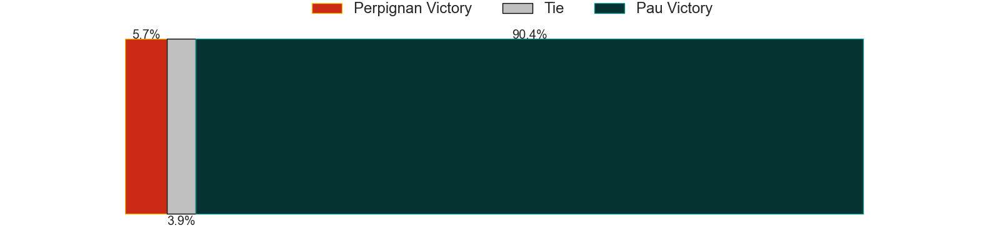
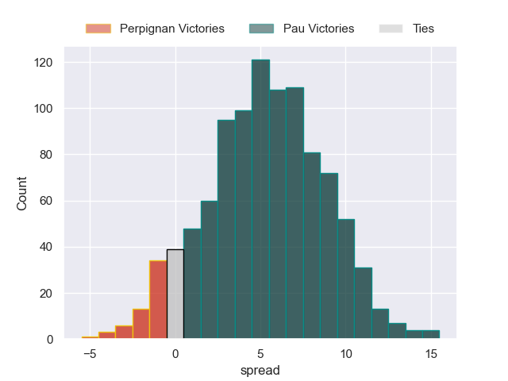

### Bayonne V Castres Olympique on 2024/06/08

Average Margin: Bayonne by 0.9

### Bordeaux Begles V Oyonnax on 2024/06/08

Average Margin: Bordeaux Begles by 8.3

### Clermont Auvergne V Montpellier Herault on 2024/06/08

Average Margin: Clermont Auvergne by 3.4

### La Rochelle V Racing 92 on 2024/06/08

Average Margin: La Rochelle by 8.2

### Lyon V Stade Toulousain on 2024/06/08

Average Margin: Stade Toulousain by 0.1

### Stade Francais Paris V Toulon on 2024/06/08

Average Margin: Stade Francais Paris by 0.3

