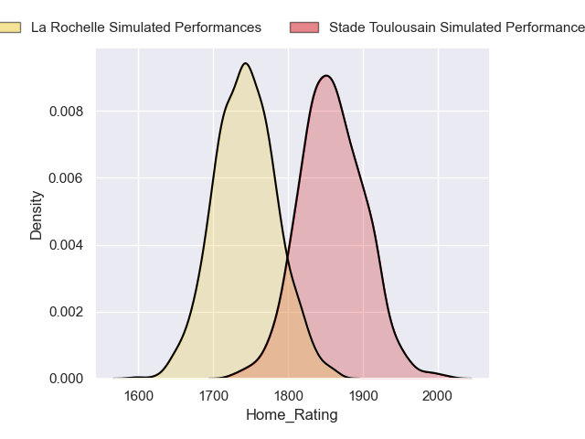
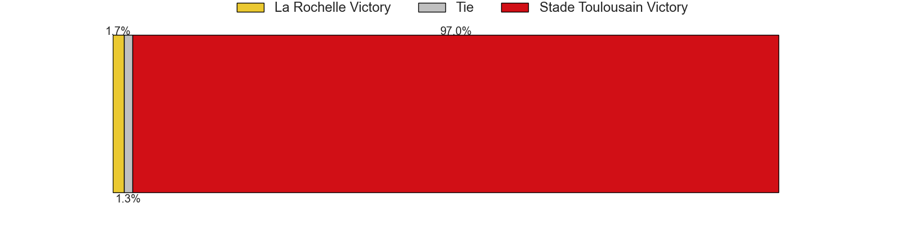
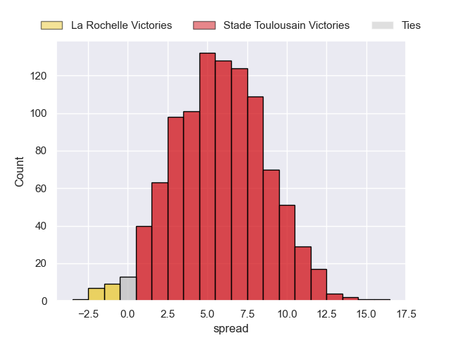
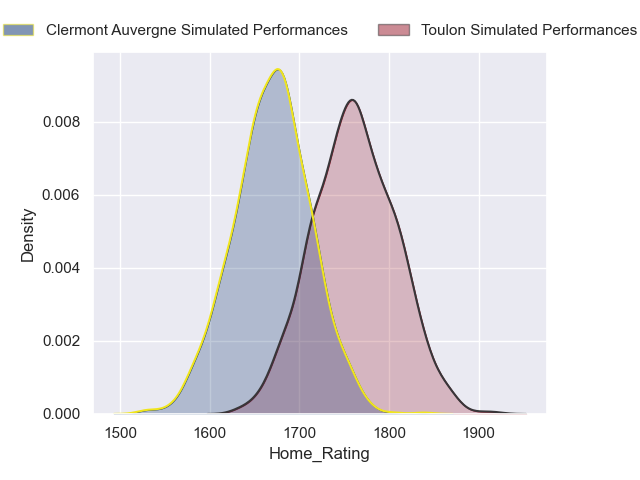
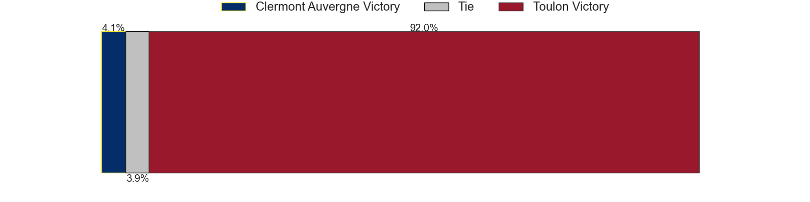
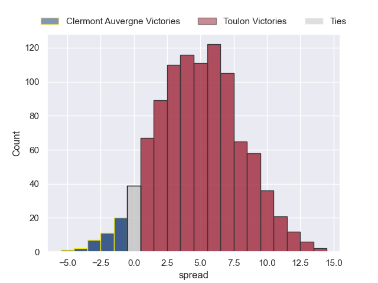

---  
title: "Top 14 Orange 2023 Status"  
date: 2024-05-30 6:00:00 -0500  
categories: model review projection  
layout: article  
aside:  
    toc: true  
---
# Current Team Rankings

# Standings

## Current Standings

| Club                 |   Played |   Wins |   Point Differential |   Losing Bonus Points |   Try Bonus Points |   Competition Points |
|:---------------------|---------:|-------:|---------------------:|----------------------:|-------------------:|---------------------:|
| Stade Toulousain     |       24 |     16 |                  185 |                     3 |                  7 |                   74 |
| Stade Francais Paris |       24 |     16 |                   34 |                     1 |                  4 |                   71 |
| Bordeaux Begles      |       24 |     14 |                   93 |                     4 |                  4 |                   64 |
| Toulon               |       24 |     14 |                  146 |                     3 |                  4 |                   63 |
| La Rochelle          |       24 |     12 |                   94 |                     7 |                  5 |                   60 |
| Racing 92            |       24 |     12 |                   72 |                     4 |                  5 |                   57 |
| Pau                  |       24 |     12 |                   18 |                     5 |                  3 |                   56 |
| Clermont Auvergne    |       24 |     12 |                  -45 |                     3 |                  5 |                   56 |
| Castres Olympique    |       24 |     11 |                  -19 |                     6 |                  4 |                   54 |
| Perpignan            |       24 |     12 |                  -62 |                     1 |                  5 |                   54 |
| Bayonne              |       24 |     11 |                  -79 |                     6 |                  2 |                   52 |
| Lyon                 |       24 |     11 |                 -121 |                     2 |                  5 |                   51 |
| Montpellier Herault  |       24 |      8 |                  -91 |                     7 |                  1 |                   40 |
| Oyonnax              |       24 |      6 |                 -225 |                     4 |                  0 |                   30 |

## Projected Remaining Table

| Club                 |   Matches Remaining |   Wins |   Point Differential |   Losing Bonus Points |   Try Bonus Points |   Competition Points |
|:---------------------|--------------------:|-------:|---------------------:|----------------------:|-------------------:|---------------------:|
| Bordeaux Begles      |                   2 |    1.9 |           16.0709    |                   0.1 |                0.9 |                  8.6 |
| Stade Toulousain     |                   2 |    1.9 |            9.69202   |                   0.1 |                0.2 |                  8   |
| Bayonne              |                   2 |    1.4 |            3.29382   |                   0.6 |                0.3 |                  6.4 |
| Toulon               |                   2 |    1.2 |            3.08404   |                   0.6 |                0.2 |                  5.8 |
| Stade Francais Paris |                   2 |    1   |           -0.0247974 |                   0.9 |                0.1 |                  4.9 |
| Clermont Auvergne    |                   2 |    1   |            0.844559  |                   0.5 |                0.2 |                  4.8 |
| Pau                  |                   2 |    1   |            0.259974  |                   0.5 |                0.1 |                  4.7 |
| Castres Olympique    |                   2 |    0.9 |           -1.17808   |                   0.9 |                0.1 |                  4.6 |
| La Rochelle          |                   2 |    1   |            2.11964   |                   0.4 |                0.1 |                  4.5 |
| Racing 92            |                   2 |    1   |           -2.59349   |                   0.2 |                0.2 |                  4.2 |
| Montpellier Herault  |                   2 |    0.8 |           -3.28906   |                   0.7 |                0.1 |                  3.9 |
| Lyon                 |                   2 |    0.3 |           -6.20956   |                   1.1 |                0.1 |                  2.5 |
| Oyonnax              |                   2 |    0.4 |          -13.2064    |                   0.5 |                0   |                  2.2 |
| Perpignan            |                   2 |    0.1 |           -8.86352   |                   1   |                0.1 |                  1.7 |

## Projected Total Table

| Club                 |   Total Matches |   Wins |   Point Differential |   Losing Bonus Points |   Try Bonus Points |   Competition Points |
|:---------------------|----------------:|-------:|---------------------:|----------------------:|-------------------:|---------------------:|
| Stade Toulousain     |              26 |   17.9 |             194.692  |                   3.1 |                7.2 |                 82   |
| Stade Francais Paris |              26 |   17   |              33.9752 |                   1.9 |                4.1 |                 75.9 |
| Bordeaux Begles      |              26 |   15.9 |             109.071  |                   4.1 |                4.9 |                 72.6 |
| Toulon               |              26 |   15.2 |             149.084  |                   3.6 |                4.2 |                 68.8 |
| La Rochelle          |              26 |   13   |              96.1196 |                   7.4 |                5.1 |                 64.5 |
| Racing 92            |              26 |   13   |              69.4065 |                   4.2 |                5.2 |                 61.2 |
| Clermont Auvergne    |              26 |   13   |             -44.1554 |                   3.5 |                5.2 |                 60.8 |
| Pau                  |              26 |   13   |              18.26   |                   5.5 |                3.1 |                 60.7 |
| Castres Olympique    |              26 |   11.9 |             -20.1781 |                   6.9 |                4.1 |                 58.6 |
| Bayonne              |              26 |   12.4 |             -75.7062 |                   6.6 |                2.3 |                 58.4 |
| Perpignan            |              26 |   12.1 |             -70.8635 |                   2   |                5.1 |                 55.7 |
| Lyon                 |              26 |   11.3 |            -127.21   |                   3.1 |                5.1 |                 53.5 |
| Montpellier Herault  |              26 |    8.8 |             -94.2891 |                   7.7 |                1.1 |                 43.9 |
| Oyonnax              |              26 |    6.4 |            -238.206  |                   4.5 |                0   |                 32.2 |

# Completed Match Review

| Model | Percent Correct Predictions | Spread Error |
| ------ | ------ | ------ |
| Club Level | 70.2% | 11.6 |
| Player Level: Lineup | 75.8% | 12.1 |
| Player Level: Minutes | 74.5% | 11.8 |

# Future Predictions

## Week 25

### Montpellier Herault V Lyon on 2024/06/01

Average Margin: Montpellier Herault by 2.2

Average Scoreline: 30-28

### Castres Olympique V Stade Francais Paris on 2024/06/01

Average Margin: Castres Olympique by 1.5

Average Scoreline: 28-27

### Oyonnax V Bayonne on 2024/06/01

Average Margin: Bayonne by 0.6

Average Scoreline: 32-31

### Racing 92 V Pau on 2024/06/01

Average Margin: Racing 92 by 5.2

Average Scoreline: 27-22

### Perpignan V Bordeaux Begles on 2024/06/01

Average Margin: Bordeaux Begles by 3.4

Average Scoreline: 30-26

### Stade Toulousain V La Rochelle on 2024/06/02

Average Margin: Stade Toulousain by 5.6

Average Scoreline: 21-15

### Toulon V Clermont Auvergne on 2024/06/02

Average Margin: Toulon by 4.6

Average Scoreline: 23-18

## Week 26

### Stade Francais Paris V Toulon on 2024/06/08

Average Margin: Stade Francais Paris by 1.5

Average Scoreline: 31-29

### Lyon V Stade Toulousain on 2024/06/08

Average Margin: Stade Toulousain by 4.1

Average Scoreline: 36-32

### Pau V Perpignan on 2024/06/08

Average Margin: Pau by 5.4

Average Scoreline: 29-23

### Bayonne V Castres Olympique on 2024/06/08

Average Margin: Bayonne by 2.7

Average Scoreline: 29-26

### Clermont Auvergne V Montpellier Herault on 2024/06/08

Average Margin: Clermont Auvergne by 5.4

Average Scoreline: 27-22

### La Rochelle V Racing 92 on 2024/06/08

Average Margin: La Rochelle by 7.8

Average Scoreline: 22-14

### Bordeaux Begles V Oyonnax on 2024/06/08

Average Margin: Bordeaux Begles by 12.6

Average Scoreline: 39-26

## Week 27

## Week 28
