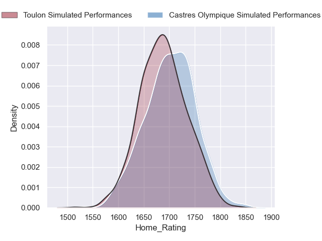
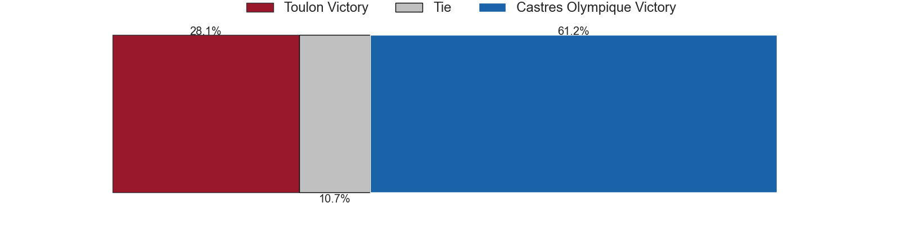
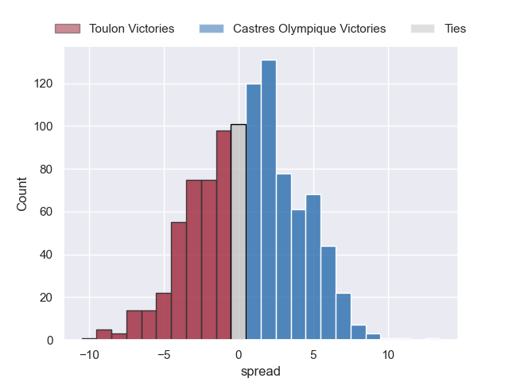
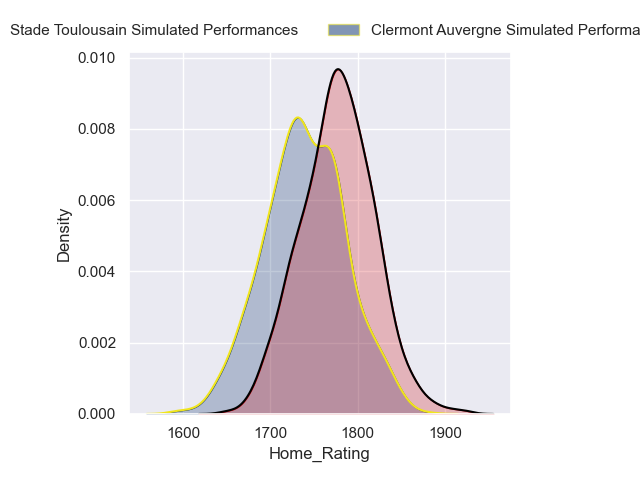
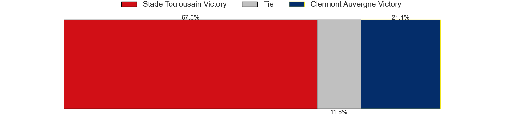
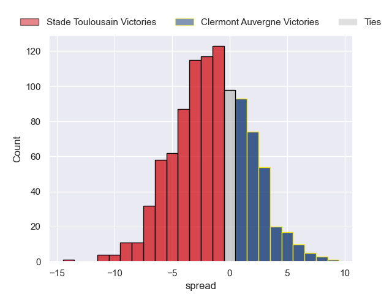

---  
title: "Top 14 Orange 2023 Status"  
date: 2024-01-29 6:00:00 -0500  
categories: model review projection  
layout: article  
aside:  
    toc: true  
---
# Current Team Rankings

# Standings

## Current Standings

| Club                 |   Played |   Wins |   Point Differential |   Losing Bonus Points |   Try Bonus Points |   Competition Points |
|:---------------------|---------:|-------:|---------------------:|----------------------:|-------------------:|---------------------:|
| Racing 92            |       13 |      8 |                  122 |                     4 |                  4 |                   40 |
| Bordeaux Begles      |       13 |      8 |                   63 |                     3 |                  2 |                   37 |
| Stade Francais Paris |       13 |      8 |                   43 |                     1 |                  2 |                   37 |
| Toulon               |       13 |      8 |                   69 |                     2 |                  2 |                   36 |
| Stade Toulousain     |       13 |      8 |                   61 |                     1 |                  3 |                   36 |
| Pau                  |       13 |      7 |                   17 |                     2 |                  2 |                   32 |
| La Rochelle          |       13 |      6 |                   41 |                     5 |                  2 |                   31 |
| Castres Olympique    |       13 |      6 |                   25 |                     4 |                  3 |                   31 |
| Clermont Auvergne    |       13 |      6 |                  -10 |                     2 |                  2 |                   30 |
| Bayonne              |       13 |      6 |                  -43 |                     3 |                  1 |                   28 |
| Lyon                 |       13 |      5 |                 -113 |                     2 |                  2 |                   24 |
| Oyonnax              |       13 |      5 |                  -94 |                     1 |                  0 |                   21 |
| Perpignan            |       13 |      5 |                 -128 |                     0 |                  1 |                   21 |
| Montpellier Herault  |       13 |      4 |                  -53 |                     4 |                  0 |                   20 |

## Projected Remaining Table

| Club                 |   Matches Remaining |   Wins |   Point Differential |   Losing Bonus Points |   Try Bonus Points |   Competition Points |
|:---------------------|--------------------:|-------:|---------------------:|----------------------:|-------------------:|---------------------:|
| Stade Toulousain     |                  13 |   11.3 |             85.0365  |                   1.5 |                2.8 |                 49.7 |
| La Rochelle          |                  13 |   11   |             78.2225  |                   1.6 |                3.8 |                 49.3 |
| Bordeaux Begles      |                  13 |    9.1 |             37.0502  |                   3.5 |                2.3 |                 42.2 |
| Racing 92            |                  13 |    8.3 |             19.7982  |                   2.5 |                2   |                 37.5 |
| Toulon               |                  13 |    7.7 |             17.1149  |                   3.8 |                1.9 |                 36.3 |
| Clermont Auvergne    |                  13 |    7.6 |             14.5539  |                   3   |                1.5 |                 35   |
| Lyon                 |                  13 |    6.2 |              1.86307 |                   4.9 |                1.3 |                 30.9 |
| Stade Francais Paris |                  13 |    5.9 |            -11.9292  |                   3.6 |                1.1 |                 28.1 |
| Montpellier Herault  |                  13 |    5.3 |            -14.8509  |                   4.2 |                1.6 |                 27.2 |
| Castres Olympique    |                  13 |    5.1 |            -20.085   |                   4.9 |                0.8 |                 26.3 |
| Bayonne              |                  13 |    4.6 |            -25.8504  |                   4.6 |                0.6 |                 23.7 |
| Pau                  |                  13 |    4.9 |            -34.5658  |                   2.7 |                0.9 |                 23.1 |
| Oyonnax              |                  13 |    3.3 |            -61.5606  |                   3.6 |                0.3 |                 17.2 |
| Perpignan            |                  13 |    0.7 |            -84.7974  |                   3.8 |                0.3 |                  7.1 |

## Projected Total Table

| Club                 |   Total Matches |   Wins |   Point Differential |   Losing Bonus Points |   Try Bonus Points |   Competition Points |
|:---------------------|----------------:|-------:|---------------------:|----------------------:|-------------------:|---------------------:|
| Stade Toulousain     |              26 |   19.3 |            146.036   |                   2.5 |                5.8 |                 85.7 |
| La Rochelle          |              26 |   17   |            119.223   |                   6.6 |                5.8 |                 80.3 |
| Bordeaux Begles      |              26 |   17.1 |            100.05    |                   6.5 |                4.3 |                 79.2 |
| Racing 92            |              26 |   16.3 |            141.798   |                   6.5 |                6   |                 77.5 |
| Toulon               |              26 |   15.7 |             86.1149  |                   5.8 |                3.9 |                 72.3 |
| Stade Francais Paris |              26 |   13.9 |             31.0708  |                   4.6 |                3.1 |                 65.1 |
| Clermont Auvergne    |              26 |   13.6 |              4.55392 |                   5   |                3.5 |                 65   |
| Castres Olympique    |              26 |   11.1 |              4.91502 |                   8.9 |                3.8 |                 57.3 |
| Pau                  |              26 |   11.9 |            -17.5658  |                   4.7 |                2.9 |                 55.1 |
| Lyon                 |              26 |   11.2 |           -111.137   |                   6.9 |                3.3 |                 54.9 |
| Bayonne              |              26 |   10.6 |            -68.8504  |                   7.6 |                1.6 |                 51.7 |
| Montpellier Herault  |              26 |    9.3 |            -67.8509  |                   8.2 |                1.6 |                 47.2 |
| Oyonnax              |              26 |    8.3 |           -155.561   |                   4.6 |                0.3 |                 38.2 |
| Perpignan            |              26 |    5.7 |           -212.797   |                   3.8 |                1.3 |                 28.1 |

# Completed Match Review

| Model | Percent Correct Predictions | Spread Error |
| ------ | ------ | ------ |
| Club Level | 69.2% | 11.4 |
| Player Level: Lineup | 75.8% | 11.5 |
| Player Level: Minutes | 76.9% | 11.3 |

# Future Predictions

## Week 14

### La Rochelle V Montpellier Herault on 2024/02/03

Average Margin: La Rochelle by 9.6

Average Scoreline: 32-22

### Oyonnax V Stade Francais Paris on 2024/02/03

Average Margin: Stade Francais Paris by 0.7

Average Scoreline: 28-27

### Clermont Auvergne V Lyon on 2024/02/03

Average Margin: Clermont Auvergne by 4.2

Average Scoreline: 27-23

### Stade Toulousain V Bayonne on 2024/02/03

Average Margin: Stade Toulousain by 11.4

Average Scoreline: 33-22

### Perpignan V Racing 92 on 2024/02/03

Average Margin: Racing 92 by 4.6

Average Scoreline: 31-27

### Pau V Castres Olympique on 2024/02/03

Average Margin: Pau by 2.3

Average Scoreline: 32-30

### Toulon V Bordeaux Begles on 2024/02/04

Average Margin: Toulon by 1.8

Average Scoreline: 32-31

## Week 15

### Racing 92 V Montpellier Herault on 2024/02/17

Average Margin: Racing 92 by 5.9

Average Scoreline: 30-24

### Bordeaux Begles V Pau on 2024/02/17

Average Margin: Bordeaux Begles by 8.5

Average Scoreline: 33-24

### Bayonne V Clermont Auvergne on 2024/02/17

Average Margin: Bayonne by 0.5

Average Scoreline: 27-26

### Lyon V La Rochelle on 2024/02/17

Average Margin: La Rochelle by 2.1

Average Scoreline: 26-24

### Stade Toulousain V Oyonnax on 2024/02/17

Average Margin: Stade Toulousain by 13.7

Average Scoreline: 40-27

### Stade Francais Paris V Perpignan on 2024/02/17

Average Margin: Stade Francais Paris by 9.3

Average Scoreline: 33-24

### Castres Olympique V Toulon on 2024/02/18

Average Margin: Castres Olympique by 0.7

Average Scoreline: 24-23

## Week 16

### Pau V Toulon on 2024/02/24

Average Margin: Toulon by 0.4

Average Scoreline: 24-24

### Lyon V Oyonnax on 2024/02/24

Average Margin: Lyon by 7.9

Average Scoreline: 32-24

### Racing 92 V Stade Francais Paris on 2024/02/24

Average Margin: Racing 92 by 5.7

Average Scoreline: 30-25

### Montpellier Herault V Bayonne on 2024/02/24

Average Margin: Montpellier Herault by 4.4

Average Scoreline: 24-19

### Perpignan V La Rochelle on 2024/02/24

Average Margin: La Rochelle by 8.2

Average Scoreline: 31-23

### Castres Olympique V Bordeaux Begles on 2024/02/24

Average Margin: Bordeaux Begles by 0.6

Average Scoreline: 24-24

### Clermont Auvergne V Stade Toulousain on 2024/02/25

Average Margin: Stade Toulousain by 1.5

Average Scoreline: 26-24

## Week 17

### Bayonne V Lyon on 2024/03/02

Average Margin: Bayonne by 1.5

Average Scoreline: 27-26

### Oyonnax V Montpellier Herault on 2024/03/02

Average Margin: Montpellier Herault by 0.5

Average Scoreline: 26-26

### Stade Francais Paris V Pau on 2024/03/02

Average Margin: Stade Francais Paris by 4.9

Average Scoreline: 28-24

### Toulon V Perpignan on 2024/03/02

Average Margin: Toulon by 10.9

Average Scoreline: 30-19

### Bordeaux Begles V Racing 92 on 2024/03/02

Average Margin: Bordeaux Begles by 4.7

Average Scoreline: 31-26

### La Rochelle V Clermont Auvergne on 2024/03/02

Average Margin: La Rochelle by 7.8

Average Scoreline: 36-29

### Stade Toulousain V Castres Olympique on 2024/03/02

Average Margin: Stade Toulousain by 10.4

Average Scoreline: 34-23

## Week 18

### Pau V Bayonne on 2024/03/09

Average Margin: Pau by 3.2

Average Scoreline: 27-24

### Perpignan V Stade Toulousain on 2024/03/09

Average Margin: Stade Toulousain by 8.8

Average Scoreline: 30-21

### Clermont Auvergne V Oyonnax on 2024/03/09

Average Margin: Clermont Auvergne by 8.7

Average Scoreline: 35-26

### La Rochelle V Stade Francais Paris on 2024/03/09

Average Margin: La Rochelle by 9.4

Average Scoreline: 31-22

### Racing 92 V Toulon on 2024/03/09

Average Margin: Racing 92 by 3.7

Average Scoreline: 29-25

### Lyon V Castres Olympique on 2024/03/09

Average Margin: Lyon by 4.4

Average Scoreline: 27-22

### Montpellier Herault V Bordeaux Begles on 2024/03/09

Average Margin: Bordeaux Begles by 0.3

Average Scoreline: 25-25

## Week 19

### Stade Francais Paris V Lyon on 2024/03/23

Average Margin: Stade Francais Paris by 2.8

Average Scoreline: 34-31

### Oyonnax V Perpignan on 2024/03/23

Average Margin: Oyonnax by 5.0

Average Scoreline: 29-24

### Bayonne V La Rochelle on 2024/03/23

Average Margin: La Rochelle by 4.0

Average Scoreline: 27-23

### Toulon V Montpellier Herault on 2024/03/23

Average Margin: Toulon by 5.8

Average Scoreline: 26-20

### Clermont Auvergne V Pau on 2024/03/23

Average Margin: Clermont Auvergne by 6.2

Average Scoreline: 27-21

### Castres Olympique V Racing 92 on 2024/03/23

Average Margin: Castres Olympique by 0.6

Average Scoreline: 26-25

### Bordeaux Begles V Stade Toulousain on 2024/03/23

Average Margin: Bordeaux Begles by 0.4

Average Scoreline: 24-23

## Week 20

### Bayonne V Toulon on 2024/03/30

Average Margin: Toulon by 0.4

Average Scoreline: 24-23

### Montpellier Herault V Stade Francais Paris on 2024/03/30

Average Margin: Montpellier Herault by 3.2

Average Scoreline: 33-30

### Stade Toulousain V Pau on 2024/03/30

Average Margin: Stade Toulousain by 11.6

Average Scoreline: 34-23

### Racing 92 V Clermont Auvergne on 2024/03/30

Average Margin: Racing 92 by 4.2

Average Scoreline: 33-28

### Lyon V Bordeaux Begles on 2024/03/30

Average Margin: Lyon by 0.5

Average Scoreline: 28-27

### Perpignan V Castres Olympique on 2024/03/30

Average Margin: Castres Olympique by 1.8

Average Scoreline: 27-26

### La Rochelle V Oyonnax on 2024/03/30

Average Margin: La Rochelle by 13.5

Average Scoreline: 42-28

## Week 21

### Pau V Montpellier Herault on 2024/04/20

Average Margin: Pau by 2.0

Average Scoreline: 32-30

### Oyonnax V Racing 92 on 2024/04/20

Average Margin: Racing 92 by 2.9

Average Scoreline: 29-27

### Castres Olympique V La Rochelle on 2024/04/20

Average Margin: La Rochelle by 3.2

Average Scoreline: 31-28

### Toulon V Stade Toulousain on 2024/04/20

Average Margin: Stade Toulousain by 1.0

Average Scoreline: 23-22

### Stade Francais Paris V Bayonne on 2024/04/20

Average Margin: Stade Francais Paris by 4.9

Average Scoreline: 23-19

### Bordeaux Begles V Clermont Auvergne on 2024/04/20

Average Margin: Bordeaux Begles by 5.5

Average Scoreline: 29-23

### Perpignan V Lyon on 2024/04/20

Average Margin: Lyon by 2.8

Average Scoreline: 34-31

## Week 22

### Stade Toulousain V Racing 92 on 2024/04/27

Average Margin: Stade Toulousain by 7.6

Average Scoreline: 21-14

### Clermont Auvergne V Stade Francais Paris on 2024/04/27

Average Margin: Clermont Auvergne by 4.7

Average Scoreline: 29-24

### Montpellier Herault V Perpignan on 2024/04/27

Average Margin: Montpellier Herault by 8.8

Average Scoreline: 34-25

### Lyon V Pau on 2024/04/27

Average Margin: Lyon by 5.4

Average Scoreline: 25-20

### Bayonne V Bordeaux Begles on 2024/04/27

Average Margin: Bordeaux Begles by 1.6

Average Scoreline: 27-25

### Oyonnax V Castres Olympique on 2024/04/27

Average Margin: Castres Olympique by 0.0

Average Scoreline: 25-25

### La Rochelle V Toulon on 2024/04/27

Average Margin: La Rochelle by 7.2

Average Scoreline: 25-18

## Week 23

### Perpignan V Clermont Auvergne on 2024/05/11

Average Margin: Clermont Auvergne by 3.7

Average Scoreline: 31-27

### Pau V Oyonnax on 2024/05/11

Average Margin: Pau by 5.7

Average Scoreline: 30-24

### Castres Olympique V Montpellier Herault on 2024/05/11

Average Margin: Castres Olympique by 2.9

Average Scoreline: 32-29

### Bordeaux Begles V La Rochelle on 2024/05/11

Average Margin: Bordeaux Begles by 0.8

Average Scoreline: 19-18

### Stade Toulousain V Stade Francais Paris on 2024/05/11

Average Margin: Stade Toulousain by 9.8

Average Scoreline: 24-14

### Toulon V Lyon on 2024/05/11

Average Margin: Toulon by 5.0

Average Scoreline: 26-21

### Racing 92 V Bayonne on 2024/05/11

Average Margin: Racing 92 by 7.1

Average Scoreline: 22-15

## Week 24

### Clermont Auvergne V Castres Olympique on 2024/05/18

Average Margin: Clermont Auvergne by 5.5

Average Scoreline: 29-24

### Montpellier Herault V Stade Toulousain on 2024/05/18

Average Margin: Stade Toulousain by 3.2

Average Scoreline: 27-24

### Stade Francais Paris V Bordeaux Begles on 2024/05/18

Average Margin: Bordeaux Begles by 0.2

Average Scoreline: 25-25

### Oyonnax V Toulon on 2024/05/18

Average Margin: Toulon by 2.8

Average Scoreline: 29-26

### Bayonne V Perpignan on 2024/05/18

Average Margin: Bayonne by 7.6

Average Scoreline: 31-23

### La Rochelle V Pau on 2024/05/18

Average Margin: La Rochelle by 10.9

Average Scoreline: 28-17

### Lyon V Racing 92 on 2024/05/18

Average Margin: Lyon by 1.7

Average Scoreline: 26-24

## Week 25

### Stade Toulousain V La Rochelle on 2024/06/01

Average Margin: Stade Toulousain by 3.8

Average Scoreline: 20-16

### Montpellier Herault V Lyon on 2024/06/01

Average Margin: Montpellier Herault by 2.7

Average Scoreline: 32-29

### Castres Olympique V Stade Francais Paris on 2024/06/01

Average Margin: Castres Olympique by 2.8

Average Scoreline: 24-22

### Toulon V Clermont Auvergne on 2024/06/01

Average Margin: Toulon by 3.9

Average Scoreline: 29-25

### Perpignan V Bordeaux Begles on 2024/06/01

Average Margin: Bordeaux Begles by 5.8

Average Scoreline: 35-29

### Racing 92 V Pau on 2024/06/01

Average Margin: Racing 92 by 7.2

Average Scoreline: 29-22

### Oyonnax V Bayonne on 2024/06/01

Average Margin: Oyonnax by 0.9

Average Scoreline: 27-26

## Week 26

### Lyon V Stade Toulousain on 2024/06/08

Average Margin: Stade Toulousain by 2.6

Average Scoreline: 25-22

### Clermont Auvergne V Montpellier Herault on 2024/06/08

Average Margin: Clermont Auvergne by 5.0

Average Scoreline: 31-26

### Bayonne V Castres Olympique on 2024/06/08

Average Margin: Bayonne by 2.4

Average Scoreline: 29-26

### Bordeaux Begles V Oyonnax on 2024/06/08

Average Margin: Bordeaux Begles by 10.9

Average Scoreline: 35-24

### Pau V Perpignan on 2024/06/08

Average Margin: Pau by 7.5

Average Scoreline: 35-27

### Stade Francais Paris V Toulon on 2024/06/08

Average Margin: Stade Francais Paris by 1.2

Average Scoreline: 22-21

### La Rochelle V Racing 92 on 2024/06/08

Average Margin: La Rochelle by 7.0

Average Scoreline: 24-17

## Week 27

## Week 28

## Week 29
