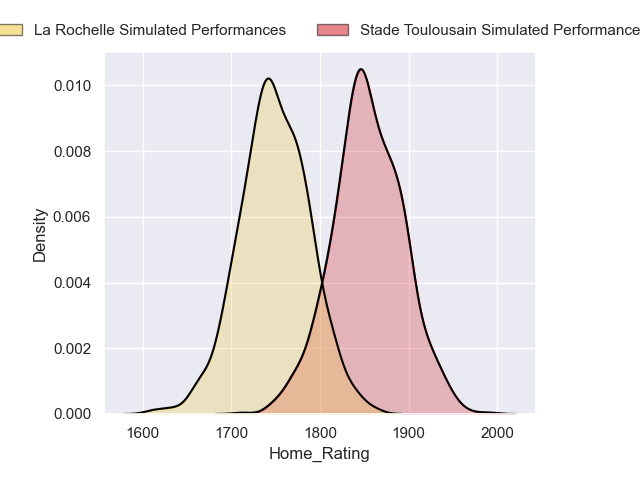
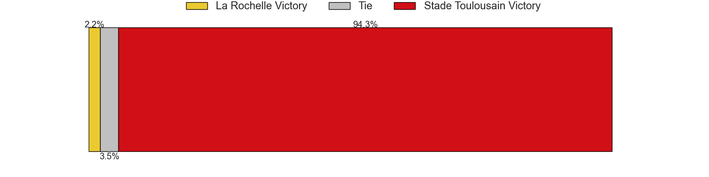
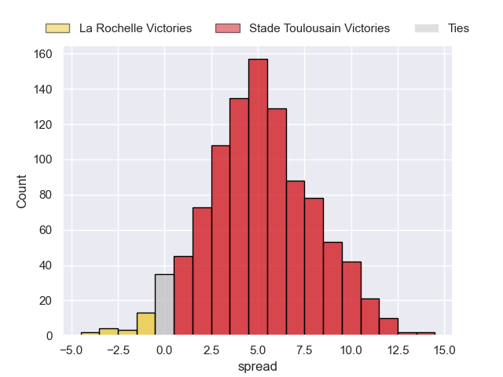
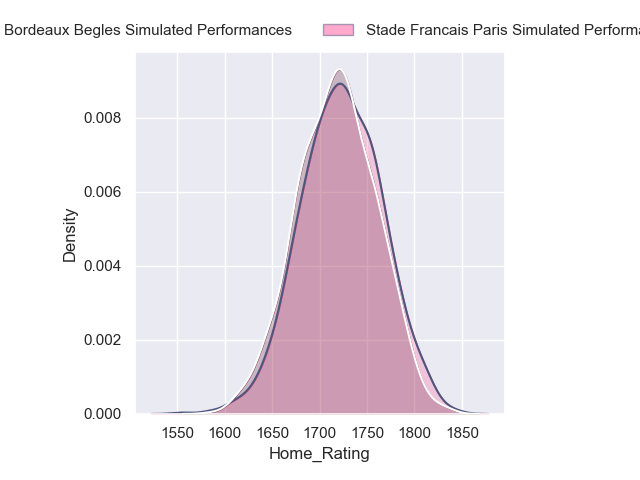
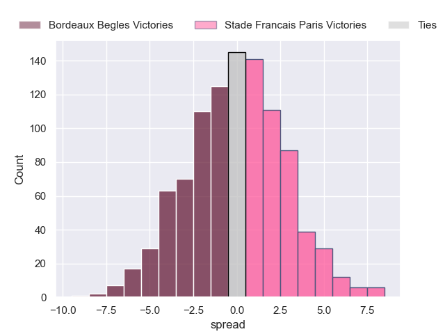

---  
title: "Top 14 Orange 2023 Status"  
date: 2024-06-20 6:00:00 -0500  
categories: model review projection  
layout: article  
aside:  
    toc: true  
---
# Standings

## Current Standings

| Club                 |   Played |   Wins |   Point Differential |   Losing Bonus Points |   Try Bonus Points |   Competition Points |
|:---------------------|---------:|-------:|---------------------:|----------------------:|-------------------:|---------------------:|
| Stade Toulousain     |       26 |     16 |                  173 |                     3 |                  7 |                   76 |
| Stade Francais Paris |       26 |     17 |                   28 |                     1 |                  4 |                   75 |
| Bordeaux Begles      |       27 |     16 |                  133 |                     4 |                  5 |                   73 |
| La Rochelle          |       27 |     14 |                  104 |                     7 |                  6 |                   71 |
| Toulon               |       27 |     15 |                  180 |                     5 |                  5 |                   70 |
| Racing 92            |       27 |     13 |                   62 |                     5 |                  5 |                   62 |
| Castres Olympique    |       26 |     13 |                    1 |                     6 |                  4 |                   62 |
| Clermont Auvergne    |       26 |     13 |                  -50 |                     3 |                  6 |                   61 |
| Pau                  |       26 |     13 |                   21 |                     5 |                  3 |                   60 |
| Perpignan            |       26 |     13 |                  -67 |                     1 |                  5 |                   58 |
| Lyon                 |       26 |     12 |                 -124 |                     2 |                  5 |                   55 |
| Bayonne              |       26 |     11 |                  -97 |                     6 |                  2 |                   52 |
| Montpellier Herault  |       27 |     10 |                 -111 |                     7 |                nan |                   48 |
| Oyonnax              |       26 |      7 |                 -251 |                     4 |                  0 |                   34 |
| Grenoble             |        1 |      0 |                   -2 |                     1 |                nan |                    1 |

## Projected Playoff Results

|                      | semifinal qualifiers   | final qualifiers   |
|:---------------------|:-----------------------|:-------------------|
| Stade Toulousain     | 100.0 %                | 98.0 %             |
| Stade Francais Paris | 100.0 %                | 52.3 %             |
| Bordeaux Begles      | 100.0 %                | 47.7 %             |
| La Rochelle          | 100.0 %                | 2.0 %              |

# Completed Match Review

| Model | Percent Correct Predictions | Spread Error |
| ------ | ------ | ------ |
| Club Level | 70.3% | 11.5 |
| Player Level: Lineup | 74.9% | 12.0 |
| Player Level: Minutes | 74.2% | 11.7 |

# Future Predictions

## semifinal

### Stade Toulousain V La Rochelle on 2024/06/21

Average Margin: Stade Toulousain by 5.3

Average Scoreline: 31-26

### Stade Francais Paris V Bordeaux Begles on 2024/06/22

Average Margin: Stade Francais Paris by 0.3

Average Scoreline: 26-26

