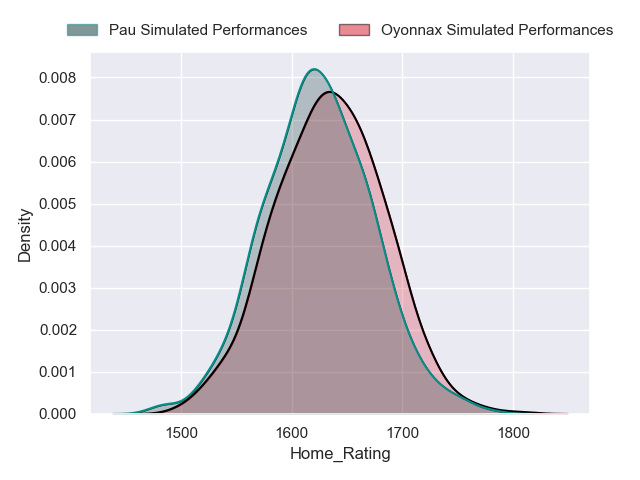
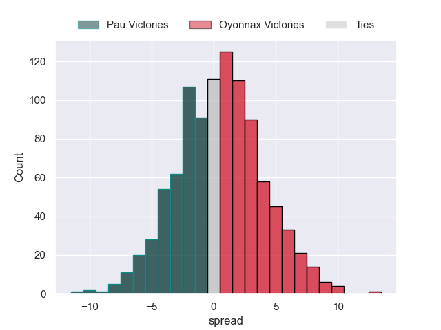
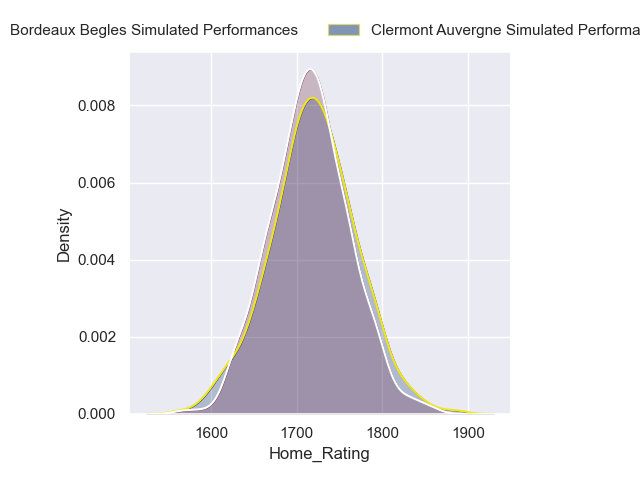
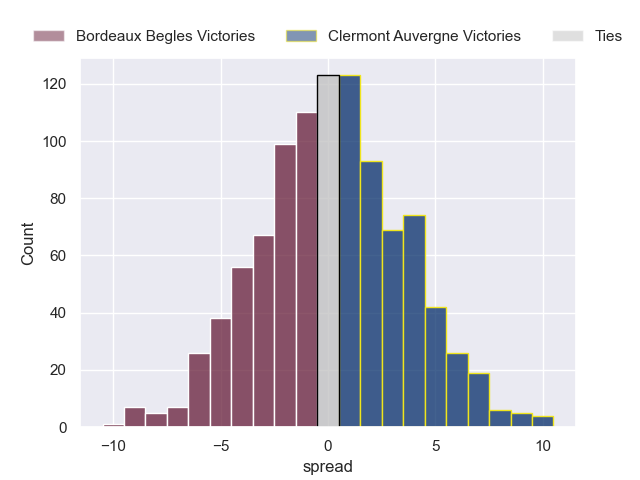
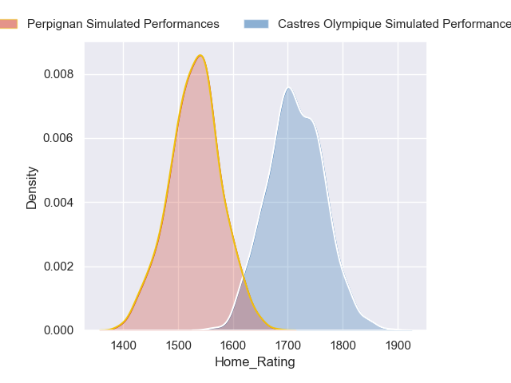
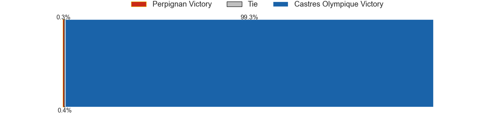
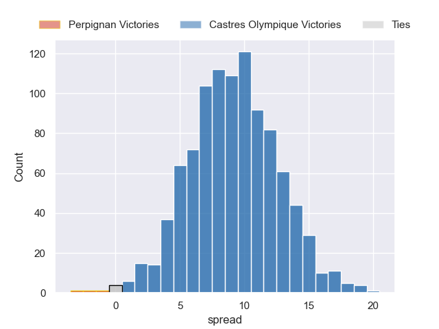

---  
title: "Top 14 Orange 2023 Status"  
date: 2023-12-27 6:00:00 -0500  
categories: model review projection  
layout: article  
aside:  
    toc: true  
---
# Current Team Rankings

# Standings

## Current Standings

| Club                 |   Played |   Wins |   Point Differential |   Losing Bonus Points |   Try Bonus Points |   Competition Points |
|:---------------------|---------:|-------:|---------------------:|----------------------:|-------------------:|---------------------:|
| Racing 92            |       10 |      7 |                  129 |                     3 |                  3 |                   34 |
| Stade Francais Paris |       10 |      7 |                   53 |                     1 |                  2 |                   31 |
| Pau                  |       10 |      7 |                   52 |                     1 |                  2 |                   31 |
| Toulon               |       10 |      6 |                   63 |                     2 |                  2 |                   28 |
| Bordeaux Begles      |       10 |      6 |                   61 |                     2 |                  2 |                   28 |
| Castres Olympique    |       10 |      6 |                   36 |                     1 |                  3 |                   28 |
| Stade Toulousain     |       10 |      6 |                   30 |                     1 |                  2 |                   27 |
| Clermont Auvergne    |       10 |      5 |                   -8 |                     1 |                  2 |                   23 |
| La Rochelle          |       10 |      4 |                   13 |                     4 |                  1 |                   21 |
| Bayonne              |       10 |      4 |                  -50 |                     2 |                  1 |                   19 |
| Lyon                 |       10 |      3 |                  -82 |                     2 |                  2 |                   16 |
| Oyonnax              |       10 |      4 |                  -96 |                     0 |                  0 |                   16 |
| Perpignan            |       10 |      3 |                 -135 |                     0 |                  1 |                   13 |
| Montpellier Herault  |       10 |      2 |                  -66 |                     3 |                  0 |                   11 |

## Projected Remaining Table

| Club                 |   Matches Remaining |   Wins |   Point Differential |   Losing Bonus Points |   Try Bonus Points |   Competition Points |
|:---------------------|--------------------:|-------:|---------------------:|----------------------:|-------------------:|---------------------:|
| Stade Toulousain     |                  17 |   13.6 |             90.3591  |                   2.8 |               12.8 |                 70.1 |
| La Rochelle          |                  17 |   13.1 |             73.1936  |                   3   |               12.4 |                 67.8 |
| Bordeaux Begles      |                  17 |   11.9 |             50.5884  |                   4.2 |               10.8 |                 62.6 |
| Toulon               |                  17 |   11.8 |             44.4349  |                   4.2 |               10.6 |                 61.9 |
| Racing 92            |                  17 |   11.3 |             36.5795  |                   3.7 |               10.5 |                 59.5 |
| Lyon                 |                  17 |    9   |             10.5567  |                   5.4 |                7.9 |                 49.3 |
| Clermont Auvergne    |                  17 |    8.6 |             -3.14742 |                   4.8 |                7.6 |                 46.7 |
| Castres Olympique    |                  17 |    8   |             -5.7536  |                   5.9 |                6.8 |                 44.7 |
| Stade Francais Paris |                  17 |    7.4 |            -15.5149  |                   5   |                6.6 |                 41.3 |
| Pau                  |                  17 |    6.6 |            -29.0777  |                   4.8 |                5.9 |                 37.1 |
| Montpellier Herault  |                  17 |    6.2 |            -32.39    |                   5.4 |                5.3 |                 35.5 |
| Bayonne              |                  17 |    5.3 |            -49.2556  |                   5.5 |                4.4 |                 31   |
| Oyonnax              |                  17 |    4.7 |            -65.8338  |                   5.4 |                3.7 |                 27.9 |
| Perpignan            |                  17 |    1.5 |           -104.739   |                   5   |                1.1 |                 12.4 |

## Projected Total Table

| Club                 |   Total Matches |   Wins |   Point Differential |   Losing Bonus Points |   Try Bonus Points |   Competition Points |
|:---------------------|----------------:|-------:|---------------------:|----------------------:|-------------------:|---------------------:|
| Stade Toulousain     |              27 |   19.6 |             120.359  |                   3.8 |               14.8 |                 97.1 |
| Racing 92            |              27 |   18.3 |             165.579  |                   6.7 |               13.5 |                 93.5 |
| Bordeaux Begles      |              27 |   17.9 |             111.588  |                   6.2 |               12.8 |                 90.6 |
| Toulon               |              27 |   17.8 |             107.435  |                   6.2 |               12.6 |                 89.9 |
| La Rochelle          |              27 |   17.1 |              86.1936 |                   7   |               13.4 |                 88.8 |
| Castres Olympique    |              27 |   14   |              30.2464 |                   6.9 |                9.8 |                 72.7 |
| Stade Francais Paris |              27 |   14.4 |              37.4851 |                   6   |                8.6 |                 72.3 |
| Clermont Auvergne    |              27 |   13.6 |             -11.1474 |                   5.8 |                9.6 |                 69.7 |
| Pau                  |              27 |   13.6 |              22.9223 |                   5.8 |                7.9 |                 68.1 |
| Lyon                 |              27 |   12   |             -71.4433 |                   7.4 |                9.9 |                 65.3 |
| Bayonne              |              27 |    9.3 |             -99.2556 |                   7.5 |                5.4 |                 50   |
| Montpellier Herault  |              27 |    8.2 |             -98.39   |                   8.4 |                5.3 |                 46.5 |
| Oyonnax              |              27 |    8.7 |            -161.834  |                   5.4 |                3.7 |                 43.9 |
| Perpignan            |              27 |    4.5 |            -239.739  |                   5   |                2.1 |                 25.4 |

# Completed Match Review

| Model | Percent Correct Predictions | Spread Error |
| ------ | ------ | ------ |
| Club Level | 70.0% | 12.2 |
| Player Level: Lineup | 74.3% | 12.1 |
| Player Level: Minutes | 74.3% | 12.0 |

# Future Predictions

## Week 11

### Oyonnax V Pau on 2023/12/29

Average Margin: Oyonnax by 0.5

### Clermont Auvergne V Bordeaux Begles on 2023/12/29

Average Margin: Clermont Auvergne by 0.2

### La Rochelle V Stade Toulousain on 2023/12/30

Average Margin: La Rochelle by 2.4

### Toulon V Stade Francais Paris on 2023/12/30

Average Margin: Toulon by 6.1

### Lyon V Montpellier Herault on 2023/12/30

Average Margin: Lyon by 4.8

### Bayonne V Racing 92 on 2023/12/30

Average Margin: Racing 92 by 1.4

### Castres Olympique V Perpignan on 2023/12/31

Average Margin: Castres Olympique by 9.2

## Week 12

### Montpellier Herault V Toulon on 2024/01/06

Average Margin: Toulon by 0.4

### Stade Francais Paris V Clermont Auvergne on 2024/01/06

Average Margin: Stade Francais Paris by 3.4

### Bordeaux Begles V Bayonne on 2024/01/06

Average Margin: Bordeaux Begles by 9.0

### Stade Toulousain V Lyon on 2024/01/06

Average Margin: Stade Toulousain by 8.2

### Racing 92 V Castres Olympique on 2024/01/06

Average Margin: Racing 92 by 5.7

### Perpignan V Oyonnax on 2024/01/06

Average Margin: Perpignan by 1.6

### Pau V La Rochelle on 2024/01/06

Average Margin: La Rochelle by 2.6

## Week 13

### Racing 92 V Stade Toulousain on 2024/01/27

Average Margin: Racing 92 by 0.3

### Bordeaux Begles V Stade Francais Paris on 2024/01/27

Average Margin: Bordeaux Begles by 6.7

### Lyon V Perpignan on 2024/01/27

Average Margin: Lyon by 9.8

### Bayonne V Oyonnax on 2024/01/27

Average Margin: Bayonne by 5.3

### Toulon V La Rochelle on 2024/01/27

Average Margin: Toulon by 1.9

### Castres Olympique V Clermont Auvergne on 2024/01/27

Average Margin: Castres Olympique by 3.2

### Montpellier Herault V Pau on 2024/01/27

Average Margin: Montpellier Herault by 3.5

## Week 14

### Pau V Castres Olympique on 2024/02/03

Average Margin: Pau by 2.5

### La Rochelle V Montpellier Herault on 2024/02/03

Average Margin: La Rochelle by 8.9

### Clermont Auvergne V Lyon on 2024/02/03

Average Margin: Clermont Auvergne by 2.8

### Oyonnax V Stade Francais Paris on 2024/02/03

Average Margin: Stade Francais Paris by 0.8

### Toulon V Bordeaux Begles on 2024/02/03

Average Margin: Toulon by 2.7

### Perpignan V Racing 92 on 2024/02/03

Average Margin: Racing 92 by 4.9

### Stade Toulousain V Bayonne on 2024/02/03

Average Margin: Stade Toulousain by 11.0

## Week 15

### Stade Francais Paris V Perpignan on 2024/02/17

Average Margin: Stade Francais Paris by 9.3

### Lyon V La Rochelle on 2024/02/17

Average Margin: La Rochelle by 0.6

### Castres Olympique V Toulon on 2024/02/17

Average Margin: Castres Olympique by 0.3

### Bordeaux Begles V Pau on 2024/02/17

Average Margin: Bordeaux Begles by 7.7

### Bayonne V Clermont Auvergne on 2024/02/17

Average Margin: Bayonne by 1.0

### Stade Toulousain V Oyonnax on 2024/02/17

Average Margin: Stade Toulousain by 12.7

### Racing 92 V Montpellier Herault on 2024/02/17

Average Margin: Racing 92 by 6.7

## Week 16

### Lyon V Oyonnax on 2024/02/24

Average Margin: Lyon by 8.1

### Pau V Toulon on 2024/02/24

Average Margin: Toulon by 0.9

### Montpellier Herault V Bayonne on 2024/02/24

Average Margin: Montpellier Herault by 4.7

### Perpignan V La Rochelle on 2024/02/24

Average Margin: La Rochelle by 7.1

### Clermont Auvergne V Stade Toulousain on 2024/02/24

Average Margin: Stade Toulousain by 1.9

### Racing 92 V Stade Francais Paris on 2024/02/24

Average Margin: Racing 92 by 5.6

### Castres Olympique V Bordeaux Begles on 2024/02/24

Average Margin: Bordeaux Begles by 0.1

## Week 17

### Oyonnax V Stade Francais Paris on 2024/03/02

Average Margin: Stade Francais Paris by 0.7

### Bordeaux Begles V Racing 92 on 2024/03/02

Average Margin: Bordeaux Begles by 4.3

### Oyonnax V Montpellier Herault on 2024/03/02

Average Margin: Oyonnax by 0.5

### La Rochelle V Clermont Auvergne on 2024/03/02

Average Margin: La Rochelle by 7.7

### Stade Francais Paris V Pau on 2024/03/02

Average Margin: Stade Francais Paris by 4.8

### Perpignan V Racing 92 on 2024/03/02

Average Margin: Racing 92 by 4.7

### Toulon V Perpignan on 2024/03/02

Average Margin: Toulon by 12.1

### Clermont Auvergne V Lyon on 2024/03/02

Average Margin: Clermont Auvergne by 2.8

### Stade Toulousain V Castres Olympique on 2024/03/02

Average Margin: Stade Toulousain by 8.7

### Toulon V Bordeaux Begles on 2024/03/02

Average Margin: Toulon by 3.3

### Pau V Castres Olympique on 2024/03/02

Average Margin: Pau by 2.3

### La Rochelle V Montpellier Herault on 2024/03/02

Average Margin: La Rochelle by 8.9

### Stade Toulousain V Bayonne on 2024/03/02

Average Margin: Stade Toulousain by 11.2

### Bayonne V Lyon on 2024/03/02

Average Margin: Bayonne by 0.2

## Week 18

### Lyon V Castres Olympique on 2024/03/09

Average Margin: Lyon by 3.9

### Racing 92 V Toulon on 2024/03/09

Average Margin: Racing 92 by 2.6

### Pau V Bayonne on 2024/03/09

Average Margin: Pau by 4.4

### Clermont Auvergne V Oyonnax on 2024/03/09

Average Margin: Clermont Auvergne by 7.6

### La Rochelle V Stade Francais Paris on 2024/03/09

Average Margin: La Rochelle by 7.8

### Perpignan V Stade Toulousain on 2024/03/09

Average Margin: Stade Toulousain by 7.7

### Montpellier Herault V Bordeaux Begles on 2024/03/09

Average Margin: Bordeaux Begles by 1.0

## Week 19

### Oyonnax V Perpignan on 2024/03/23

Average Margin: Oyonnax by 5.0

### Clermont Auvergne V Pau on 2024/03/23

Average Margin: Clermont Auvergne by 4.5

### Stade Francais Paris V Lyon on 2024/03/23

Average Margin: Stade Francais Paris by 2.9

### Bordeaux Begles V Stade Toulousain on 2024/03/23

Average Margin: Bordeaux Begles by 1.2

### Bayonne V La Rochelle on 2024/03/23

Average Margin: La Rochelle by 3.4

### Castres Olympique V Racing 92 on 2024/03/23

Average Margin: Castres Olympique by 1.1

### Toulon V Montpellier Herault on 2024/03/23

Average Margin: Toulon by 7.3

## Week 20

### Perpignan V Castres Olympique on 2024/03/30

Average Margin: Castres Olympique by 2.3

### Stade Toulousain V Pau on 2024/03/30

Average Margin: Stade Toulousain by 10.0

### Bayonne V Toulon on 2024/03/30

Average Margin: Toulon by 1.9

### Racing 92 V Clermont Auvergne on 2024/03/30

Average Margin: Racing 92 by 5.6

### La Rochelle V Oyonnax on 2024/03/30

Average Margin: La Rochelle by 12.0

### Montpellier Herault V Stade Francais Paris on 2024/03/30

Average Margin: Montpellier Herault by 2.5

### Lyon V Bordeaux Begles on 2024/03/30

Average Margin: Lyon by 0.7

## Week 21

### Pau V Montpellier Herault on 2024/04/20

Average Margin: Pau by 3.0

### Toulon V Stade Toulousain on 2024/04/20

Average Margin: Toulon by 0.8

### Oyonnax V Racing 92 on 2024/04/20

Average Margin: Racing 92 by 3.1

### Stade Francais Paris V Bayonne on 2024/04/20

Average Margin: Stade Francais Paris by 5.8

### Bordeaux Begles V Clermont Auvergne on 2024/04/20

Average Margin: Bordeaux Begles by 6.5

### Perpignan V Lyon on 2024/04/20

Average Margin: Lyon by 3.2

### Castres Olympique V La Rochelle on 2024/04/20

Average Margin: La Rochelle by 1.2

## Week 22

### Oyonnax V Castres Olympique on 2024/04/27

Average Margin: Castres Olympique by 0.5

### Bayonne V Bordeaux Begles on 2024/04/27

Average Margin: Bordeaux Begles by 2.2

### Stade Toulousain V Racing 92 on 2024/04/27

Average Margin: Stade Toulousain by 6.3

### Clermont Auvergne V Stade Francais Paris on 2024/04/27

Average Margin: Clermont Auvergne by 3.4

### La Rochelle V Toulon on 2024/04/27

Average Margin: La Rochelle by 4.9

### Lyon V Pau on 2024/04/27

Average Margin: Lyon by 5.1

### Montpellier Herault V Perpignan on 2024/04/27

Average Margin: Montpellier Herault by 8.2

## Week 23

### Perpignan V Clermont Auvergne on 2024/05/11

Average Margin: Clermont Auvergne by 2.6

### Pau V Oyonnax on 2024/05/11

Average Margin: Pau by 6.3

### Castres Olympique V Montpellier Herault on 2024/05/11

Average Margin: Castres Olympique by 4.3

### Stade Toulousain V Stade Francais Paris on 2024/05/11

Average Margin: Stade Toulousain by 8.6

### Toulon V Lyon on 2024/05/11

Average Margin: Toulon by 5.7

### Racing 92 V Bayonne on 2024/05/11

Average Margin: Racing 92 by 7.8

### Bordeaux Begles V La Rochelle on 2024/05/11

Average Margin: Bordeaux Begles by 2.3

## Week 24

### Stade Francais Paris V Bordeaux Begles on 2024/05/18

Average Margin: Stade Francais Paris by 0.1

### Bayonne V Perpignan on 2024/05/18

Average Margin: Bayonne by 6.9

### La Rochelle V Pau on 2024/05/18

Average Margin: La Rochelle by 9.0

### Lyon V Racing 92 on 2024/05/18

Average Margin: Lyon by 1.5

### Oyonnax V Toulon on 2024/05/18

Average Margin: Toulon by 3.6

### Clermont Auvergne V Castres Olympique on 2024/05/18

Average Margin: Clermont Auvergne by 3.5

### Montpellier Herault V Stade Toulousain on 2024/05/18

Average Margin: Stade Toulousain by 3.0

## Week 25

### Stade Toulousain V La Rochelle on 2024/06/01

Average Margin: Stade Toulousain by 4.5

### Montpellier Herault V Lyon on 2024/06/01

Average Margin: Montpellier Herault by 1.9

### Castres Olympique V Stade Francais Paris on 2024/06/01

Average Margin: Castres Olympique by 3.1

### Oyonnax V Bayonne on 2024/06/01

Average Margin: Oyonnax by 1.4

### Perpignan V Bordeaux Begles on 2024/06/01

Average Margin: Bordeaux Begles by 5.7

### Toulon V Clermont Auvergne on 2024/06/01

Average Margin: Toulon by 6.0

### Racing 92 V Pau on 2024/06/01

Average Margin: Racing 92 by 6.8

## Week 26

### Bayonne V Castres Olympique on 2024/06/08

Average Margin: Bayonne by 1.5

### Pau V Perpignan on 2024/06/08

Average Margin: Pau by 7.8

### Stade Francais Paris V Toulon on 2024/06/08

Average Margin: Stade Francais Paris by 0.4

### La Rochelle V Racing 92 on 2024/06/08

Average Margin: La Rochelle by 5.4

### Lyon V Stade Toulousain on 2024/06/08

Average Margin: Stade Toulousain by 1.4

### Clermont Auvergne V Montpellier Herault on 2024/06/08

Average Margin: Clermont Auvergne by 4.4

### Bordeaux Begles V Oyonnax on 2024/06/08

Average Margin: Bordeaux Begles by 10.9

## Week 27

## Week 28

## Week 29
