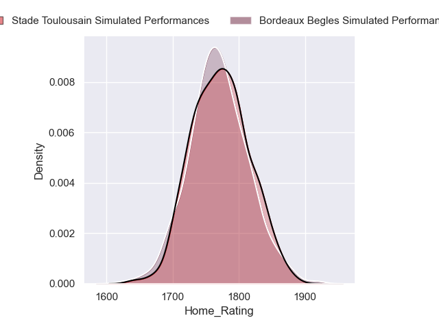
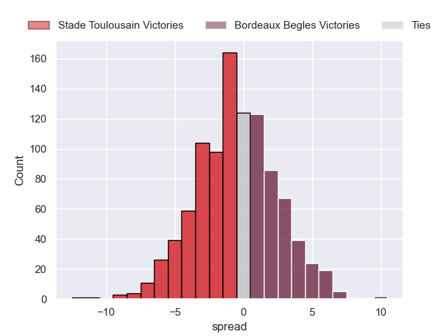
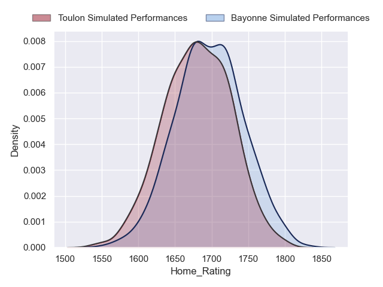
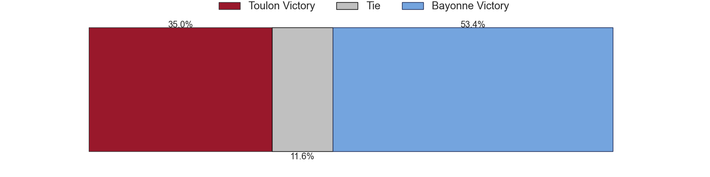
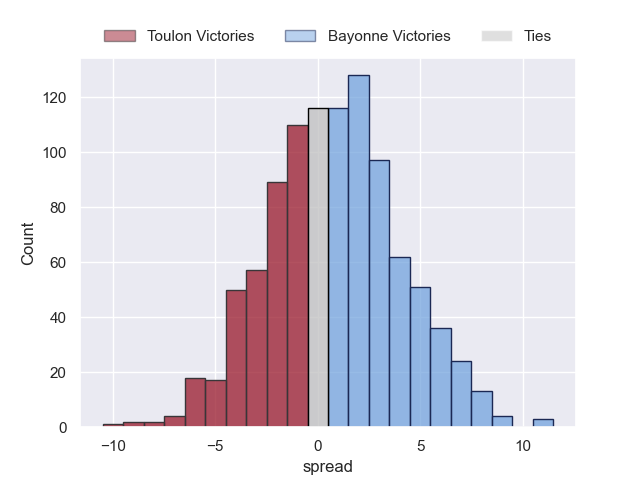

---  
title: "Top 14 Orange 2023 Status"  
date: 2024-03-11 6:00:00 -0500  
categories: model review projection  
layout: article  
aside:  
    toc: true  
---
# Current Team Rankings

# Standings

## Current Standings

| Club                 |   Played |   Wins |   Point Differential |   Losing Bonus Points |   Try Bonus Points |   Competition Points |
|:---------------------|---------:|-------:|---------------------:|----------------------:|-------------------:|---------------------:|
| Stade Toulousain     |       18 |     12 |                  129 |                     1 |                  6 |                   55 |
| Stade Francais Paris |       18 |     12 |                   69 |                     1 |                  4 |                   55 |
| La Rochelle          |       18 |      9 |                   85 |                     5 |                  4 |                   45 |
| Bordeaux Begles      |       18 |     10 |                   38 |                     3 |                  2 |                   45 |
| Racing 92            |       18 |      9 |                   59 |                     4 |                  4 |                   44 |
| Castres Olympique    |       18 |      9 |                   31 |                     4 |                  4 |                   44 |
| Pau                  |       18 |     10 |                   13 |                     2 |                  2 |                   44 |
| Toulon               |       18 |      9 |                   56 |                     3 |                  2 |                   41 |
| Bayonne              |       18 |      8 |                  -33 |                     5 |                  2 |                   39 |
| Clermont Auvergne    |       18 |      8 |                  -44 |                     3 |                  3 |                   38 |
| Lyon                 |       18 |      8 |                 -116 |                     2 |                  4 |                   38 |
| Montpellier Herault  |       18 |      8 |                  -21 |                     4 |                  1 |                   37 |
| Perpignan            |       18 |      8 |                 -120 |                     0 |                  3 |                   35 |
| Oyonnax              |       18 |      5 |                 -146 |                     3 |                  0 |                   25 |

## Projected Remaining Table

| Club                 |   Matches Remaining |   Wins |   Point Differential |   Losing Bonus Points |   Try Bonus Points |   Competition Points |
|:---------------------|--------------------:|-------:|---------------------:|----------------------:|-------------------:|---------------------:|
| Stade Toulousain     |                   8 |    6.8 |            40.3583   |                   1.2 |                1.1 |                 29.3 |
| La Rochelle          |                   8 |    6.1 |            40.537    |                   1.5 |                1.5 |                 27.2 |
| Bordeaux Begles      |                   8 |    5.1 |            17.9701   |                   2.5 |                1.6 |                 24.7 |
| Clermont Auvergne    |                   8 |    4.6 |             5.14057  |                   2.2 |                0.7 |                 21.2 |
| Castres Olympique    |                   8 |    4.3 |             1.93708  |                   2.8 |                1   |                 21.1 |
| Toulon               |                   8 |    4.3 |             0.882271 |                   2.3 |                0.7 |                 20.3 |
| Montpellier Herault  |                   8 |    3.8 |             2.3978   |                   3   |                1.6 |                 19.7 |
| Lyon                 |                   8 |    3.7 |            -2.50358  |                   3   |                0.7 |                 18.5 |
| Bayonne              |                   8 |    3.7 |            -1.70267  |                   3   |                0.6 |                 18.3 |
| Stade Francais Paris |                   8 |    3.8 |            -5.75486  |                   2.5 |                0.8 |                 18.3 |
| Racing 92            |                   8 |    3.7 |            -9.14715  |                   1.9 |                0.7 |                 17.5 |
| Pau                  |                   8 |    2.7 |           -24.7808   |                   1.6 |                0.6 |                 13   |
| Oyonnax              |                   8 |    2.3 |           -31.8884   |                   2.6 |                0.4 |                 12.1 |
| Perpignan            |                   8 |    1.3 |           -33.4456   |                   3.5 |                0.4 |                  8.8 |

## Projected Total Table

| Club                 |   Total Matches |   Wins |   Point Differential |   Losing Bonus Points |   Try Bonus Points |   Competition Points |
|:---------------------|----------------:|-------:|---------------------:|----------------------:|-------------------:|---------------------:|
| Stade Toulousain     |              26 |   18.8 |             169.358  |                   2.2 |                7.1 |                 84.3 |
| Stade Francais Paris |              26 |   15.8 |              63.2451 |                   3.5 |                4.8 |                 73.3 |
| La Rochelle          |              26 |   15.1 |             125.537  |                   6.5 |                5.5 |                 72.2 |
| Bordeaux Begles      |              26 |   15.1 |              55.9701 |                   5.5 |                3.6 |                 69.7 |
| Castres Olympique    |              26 |   13.3 |              32.9371 |                   6.8 |                5   |                 65.1 |
| Racing 92            |              26 |   12.7 |              49.8529 |                   5.9 |                4.7 |                 61.5 |
| Toulon               |              26 |   13.3 |              56.8823 |                   5.3 |                2.7 |                 61.3 |
| Clermont Auvergne    |              26 |   12.6 |             -38.8594 |                   5.2 |                3.7 |                 59.2 |
| Bayonne              |              26 |   11.7 |             -34.7027 |                   8   |                2.6 |                 57.3 |
| Pau                  |              26 |   12.7 |             -11.7808 |                   3.6 |                2.6 |                 57   |
| Montpellier Herault  |              26 |   11.8 |             -18.6022 |                   7   |                2.6 |                 56.7 |
| Lyon                 |              26 |   11.7 |            -118.504  |                   5   |                4.7 |                 56.5 |
| Perpignan            |              26 |    9.3 |            -153.446  |                   3.5 |                3.4 |                 43.8 |
| Oyonnax              |              26 |    7.3 |            -177.888  |                   5.6 |                0.4 |                 37.1 |

# Completed Match Review

| Model | Percent Correct Predictions | Spread Error |
| ------ | ------ | ------ |
| Club Level | 69.0% | 11.6 |
| Player Level: Lineup | 76.2% | 11.5 |
| Player Level: Minutes | 74.6% | 11.2 |

# Future Predictions

## Week 19

### Clermont Auvergne V Pau on 2024/03/23

Average Margin: Clermont Auvergne by 5.7

Average Scoreline: 25-19

### Bayonne V La Rochelle on 2024/03/23

Average Margin: La Rochelle by 3.1

Average Scoreline: 36-33

### Oyonnax V Perpignan on 2024/03/23

Average Margin: Oyonnax by 3.4

Average Scoreline: 38-34

### Castres Olympique V Racing 92 on 2024/03/23

Average Margin: Castres Olympique by 3.0

Average Scoreline: 29-26

### Toulon V Montpellier Herault on 2024/03/23

Average Margin: Toulon by 4.0

Average Scoreline: 29-25

### Stade Francais Paris V Lyon on 2024/03/23

Average Margin: Stade Francais Paris by 3.6

Average Scoreline: 28-25

### Bordeaux Begles V Stade Toulousain on 2024/03/24

Average Margin: Stade Toulousain by 0.1

Average Scoreline: 35-34

## Week 20

### Stade Toulousain V Pau on 2024/03/30

Average Margin: Stade Toulousain by 11.3

Average Scoreline: 26-15

### Perpignan V Castres Olympique on 2024/03/30

Average Margin: Castres Olympique by 0.9

Average Scoreline: 38-37

### La Rochelle V Oyonnax on 2024/03/30

Average Margin: La Rochelle by 13.5

Average Scoreline: 29-16

### Montpellier Herault V Stade Francais Paris on 2024/03/30

Average Margin: Montpellier Herault by 3.3

Average Scoreline: 30-27

### Lyon V Bordeaux Begles on 2024/03/30

Average Margin: Lyon by 1.0

Average Scoreline: 34-33

### Racing 92 V Clermont Auvergne on 2024/03/30

Average Margin: Racing 92 by 3.2

Average Scoreline: 34-31

### Bayonne V Toulon on 2024/03/31

Average Margin: Bayonne by 1.2

Average Scoreline: 32-31

## Week 21

### Castres Olympique V La Rochelle on 2024/04/20

Average Margin: La Rochelle by 2.1

Average Scoreline: 34-32

### Toulon V Stade Toulousain on 2024/04/20

Average Margin: Stade Toulousain by 1.9

Average Scoreline: 29-27

### Bordeaux Begles V Clermont Auvergne on 2024/04/20

Average Margin: Bordeaux Begles by 5.4

Average Scoreline: 25-20

### Oyonnax V Racing 92 on 2024/04/20

Average Margin: Racing 92 by 1.5

Average Scoreline: 38-37

### Stade Francais Paris V Bayonne on 2024/04/20

Average Margin: Stade Francais Paris by 4.8

Average Scoreline: 25-20

### Pau V Montpellier Herault on 2024/04/20

Average Margin: Pau by 1.0

Average Scoreline: 33-32

### Perpignan V Lyon on 2024/04/20

Average Margin: Lyon by 1.5

Average Scoreline: 40-39

## Week 22

### Stade Toulousain V Racing 92 on 2024/04/27

Average Margin: Stade Toulousain by 9.3

Average Scoreline: 19-9

### Bayonne V Bordeaux Begles on 2024/04/27

Average Margin: Bordeaux Begles by 0.2

Average Scoreline: 37-36

### Lyon V Pau on 2024/04/27

Average Margin: Lyon by 5.5

Average Scoreline: 21-16

### Montpellier Herault V Perpignan on 2024/04/27

Average Margin: Montpellier Herault by 8.8

Average Scoreline: 29-20

### La Rochelle V Toulon on 2024/04/27

Average Margin: La Rochelle by 7.7

Average Scoreline: 27-19

### Clermont Auvergne V Stade Francais Paris on 2024/04/27

Average Margin: Clermont Auvergne by 3.2

Average Scoreline: 31-28

### Oyonnax V Castres Olympique on 2024/04/27

Average Margin: Castres Olympique by 1.0

Average Scoreline: 32-31

## Week 23

### Bordeaux Begles V La Rochelle on 2024/05/11

Average Margin: Bordeaux Begles by 0.6

Average Scoreline: 24-23

### Perpignan V Clermont Auvergne on 2024/05/11

Average Margin: Clermont Auvergne by 1.7

Average Scoreline: 40-39

### Stade Toulousain V Stade Francais Paris on 2024/05/11

Average Margin: Stade Toulousain by 8.8

Average Scoreline: 13-4

### Toulon V Lyon on 2024/05/11

Average Margin: Toulon by 4.2

Average Scoreline: 23-19

### Racing 92 V Bayonne on 2024/05/11

Average Margin: Racing 92 by 4.7

Average Scoreline: 21-16

### Castres Olympique V Montpellier Herault on 2024/05/11

Average Margin: Castres Olympique by 2.7

Average Scoreline: 39-36

### Pau V Oyonnax on 2024/05/11

Average Margin: Pau by 6.4

Average Scoreline: 28-21

## Week 24

### Bayonne V Perpignan on 2024/05/18

Average Margin: Bayonne by 7.1

Average Scoreline: 27-20

### Oyonnax V Toulon on 2024/05/18

Average Margin: Toulon by 2.3

Average Scoreline: 36-34

### La Rochelle V Pau on 2024/05/18

Average Margin: La Rochelle by 10.5

Average Scoreline: 27-16

### Lyon V Racing 92 on 2024/05/18

Average Margin: Lyon by 3.4

Average Scoreline: 20-16

### Montpellier Herault V Stade Toulousain on 2024/05/18

Average Margin: Stade Toulousain by 2.2

Average Scoreline: 34-32

### Stade Francais Paris V Bordeaux Begles on 2024/05/18

Average Margin: Stade Francais Paris by 1.3

Average Scoreline: 26-25

### Clermont Auvergne V Castres Olympique on 2024/05/18

Average Margin: Clermont Auvergne by 3.8

Average Scoreline: 32-29

## Week 25

### Perpignan V Bordeaux Begles on 2024/06/01

Average Margin: Bordeaux Begles by 3.8

Average Scoreline: 40-36

### Stade Toulousain V La Rochelle on 2024/06/01

Average Margin: Stade Toulousain by 4.2

Average Scoreline: 19-15

### Toulon V Clermont Auvergne on 2024/06/01

Average Margin: Toulon by 3.8

Average Scoreline: 28-25

### Montpellier Herault V Lyon on 2024/06/01

Average Margin: Montpellier Herault by 3.5

Average Scoreline: 26-23

### Oyonnax V Bayonne on 2024/06/01

Average Margin: Bayonne by 0.2

Average Scoreline: 32-31

### Castres Olympique V Stade Francais Paris on 2024/06/01

Average Margin: Castres Olympique by 2.8

Average Scoreline: 27-24

### Racing 92 V Pau on 2024/06/01

Average Margin: Racing 92 by 5.4

Average Scoreline: 26-21

## Week 26

### Clermont Auvergne V Montpellier Herault on 2024/06/08

Average Margin: Clermont Auvergne by 3.1

Average Scoreline: 35-32

### Bordeaux Begles V Oyonnax on 2024/06/08

Average Margin: Bordeaux Begles by 10.4

Average Scoreline: 25-15

### Lyon V Stade Toulousain on 2024/06/08

Average Margin: Stade Toulousain by 2.5

Average Scoreline: 33-30

### Pau V Perpignan on 2024/06/08

Average Margin: Pau by 6.3

Average Scoreline: 31-25

### Stade Francais Paris V Toulon on 2024/06/08

Average Margin: Stade Francais Paris by 2.7

Average Scoreline: 30-27

### La Rochelle V Racing 92 on 2024/06/08

Average Margin: La Rochelle by 8.4

Average Scoreline: 19-11

### Bayonne V Castres Olympique on 2024/06/08

Average Margin: Bayonne by 2.5

Average Scoreline: 35-32

## Week 27

## Week 28

## Week 29
