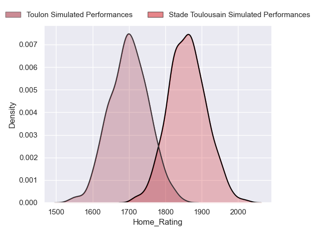
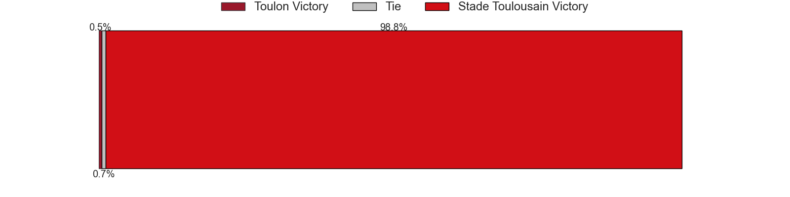
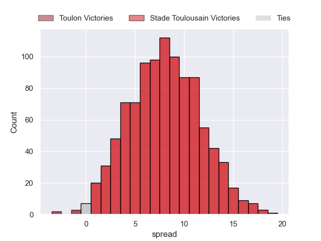

---  
title: "Top 14 Orange 2024 Status"  
date: 2024-10-21 6:00:00 -0500  
categories: model review projection  
layout: article  
aside:  
    toc: true  
---
# Current Team Rankings

# Standings

## Current Standings

| Club                 |   Played |   Wins |   Point Differential |   Losing Bonus Points |   Try Bonus Points |   Competition Points |
|:---------------------|---------:|-------:|---------------------:|----------------------:|-------------------:|---------------------:|
| Stade Toulousain     |        7 |      5 |                   75 |                     2 |                  2 |                   24 |
| Bordeaux Begles      |        7 |      5 |                   87 |                     1 |                  2 |                   23 |
| La Rochelle          |        7 |      5 |                   22 |                     0 |                  2 |                   22 |
| Castres Olympique    |        7 |      4 |                   34 |                     2 |                  1 |                   19 |
| Toulon               |        7 |      4 |                   33 |                     2 |                  1 |                   19 |
| Clermont Auvergne    |        7 |      4 |                   -6 |                     0 |                  3 |                   19 |
| Bayonne              |        7 |      4 |                    9 |                     1 |                  1 |                   18 |
| Lyon                 |        7 |      4 |                    6 |                     1 |                  1 |                   18 |
| Pau                  |        7 |      3 |                  -22 |                     1 |                  2 |                   15 |
| Racing 92            |        7 |      3 |                   -7 |                     2 |                  0 |                   14 |
| Perpignan            |        7 |      3 |                  -56 |                     1 |                  1 |                   14 |
| Montpellier Herault  |        7 |      2 |                  -15 |                     2 |                  0 |                   10 |
| Stade Francais Paris |        7 |      2 |                  -80 |                     1 |                  0 |                    9 |
| Vannes               |        7 |      1 |                  -80 |                     3 |                  0 |                    7 |

## Projected Remaining Table

| Club                 |   Matches Remaining |   Wins |   Point Differential |   Losing Bonus Points |   Try Bonus Points |   Competition Points |
|:---------------------|--------------------:|-------:|---------------------:|----------------------:|-------------------:|---------------------:|
| Stade Toulousain     |                  19 |   17   |            147.889   |                   1.8 |                5.3 |                 75.1 |
| La Rochelle          |                  19 |   15   |             92.6446  |                   3.4 |                4.4 |                 67.8 |
| Bordeaux Begles      |                  19 |   15   |             81.2141  |                   3.5 |                3.7 |                 67.3 |
| Toulon               |                  19 |   12.7 |             43.8963  |                   4.5 |                3.2 |                 58.3 |
| Racing 92            |                  19 |   10.1 |              6.92393 |                   5.1 |                2.2 |                 47.5 |
| Castres Olympique    |                  19 |    9.9 |              2.37168 |                   5.3 |                1.8 |                 46.7 |
| Clermont Auvergne    |                  19 |    9   |             -4.8682  |                   6.2 |                1.9 |                 44.1 |
| Lyon                 |                  19 |    8.8 |             -9.04476 |                   5.7 |                1.5 |                 42.3 |
| Pau                  |                  19 |    7.4 |            -30.2252  |                   6.2 |                2   |                 37.8 |
| Montpellier Herault  |                  19 |    7.6 |            -36.9942  |                   5.7 |                1.8 |                 37.7 |
| Stade Francais Paris |                  19 |    7   |            -41.6198  |                   6.2 |                1.4 |                 35.8 |
| Bayonne              |                  19 |    6.9 |            -40.3014  |                   6.2 |                1.2 |                 35.1 |
| Perpignan            |                  19 |    4.3 |            -83.0039  |                   5.8 |                1   |                 23.9 |
| Vannes               |                  19 |    2.3 |           -128.883   |                   5.3 |                0.6 |                 15.2 |

## Projected Total Table

| Club                 |   Total Matches |   Wins |   Point Differential |   Losing Bonus Points |   Try Bonus Points |   Competition Points |
|:---------------------|----------------:|-------:|---------------------:|----------------------:|-------------------:|---------------------:|
| Stade Toulousain     |              26 |   22   |            222.889   |                   3.8 |                7.3 |                 99.1 |
| Bordeaux Begles      |              26 |   20   |            168.214   |                   4.5 |                5.7 |                 90.3 |
| La Rochelle          |              26 |   20   |            114.645   |                   3.4 |                6.4 |                 89.8 |
| Toulon               |              26 |   16.7 |             76.8963  |                   6.5 |                4.2 |                 77.3 |
| Castres Olympique    |              26 |   13.9 |             36.3717  |                   7.3 |                2.8 |                 65.7 |
| Clermont Auvergne    |              26 |   13   |            -10.8682  |                   6.2 |                4.9 |                 63.1 |
| Racing 92            |              26 |   13.1 |             -0.07607 |                   7.1 |                2.2 |                 61.5 |
| Lyon                 |              26 |   12.8 |             -3.04476 |                   6.7 |                2.5 |                 60.3 |
| Bayonne              |              26 |   10.9 |            -31.3014  |                   7.2 |                2.2 |                 53.1 |
| Pau                  |              26 |   10.4 |            -52.2252  |                   7.2 |                4   |                 52.8 |
| Montpellier Herault  |              26 |    9.6 |            -51.9942  |                   7.7 |                1.8 |                 47.7 |
| Stade Francais Paris |              26 |    9   |           -121.62    |                   7.2 |                1.4 |                 44.8 |
| Perpignan            |              26 |    7.3 |           -139.004   |                   6.8 |                2   |                 37.9 |
| Vannes               |              26 |    3.3 |           -208.883   |                   8.3 |                0.6 |                 22.2 |

# Completed Match Review

| Model | Percent Correct Predictions | Spread Error |
| ------ | ------ | ------ |
| Club Level | 83.7% | 10.6 |
| Player Level: Lineup | 78.6% | 11.2 |
| Player Level: Minutes | 100.0% | 9.6 |

# Future Predictions

## Week 8

### Bordeaux Begles V Pau on 2024/10/26

Average Margin: Bordeaux Begles by 8.8

Average Scoreline: 34-25

### Stade Francais Paris V Clermont Auvergne on 2024/10/26

Average Margin: Stade Francais Paris by 1.4

Average Scoreline: 25-24

### Lyon V Bayonne on 2024/10/26

Average Margin: Lyon by 4.9

Average Scoreline: 25-20

### Montpellier Herault V La Rochelle on 2024/10/26

Average Margin: La Rochelle by 2.6

Average Scoreline: 29-27

### Vannes V Castres Olympique on 2024/10/26

Average Margin: Castres Olympique by 3.4

Average Scoreline: 30-27

### Racing 92 V Perpignan on 2024/10/26

Average Margin: Racing 92 by 7.2

Average Scoreline: 27-20

### Stade Toulousain V Toulon on 2024/10/27

Average Margin: Stade Toulousain by 8.0

Average Scoreline: 29-21

## Week 9

### Clermont Auvergne V Bordeaux Begles on 2024/11/02

Average Margin: Bordeaux Begles by 0.4

Average Scoreline: 24-24

### Castres Olympique V Montpellier Herault on 2024/11/02

Average Margin: Castres Olympique by 5.2

Average Scoreline: 25-19

### Toulon V Lyon on 2024/11/02

Average Margin: Toulon by 5.9

Average Scoreline: 29-23

### La Rochelle V Stade Francais Paris on 2024/11/02

Average Margin: La Rochelle by 9.6

Average Scoreline: 32-22

### Pau V Racing 92 on 2024/11/02

Average Margin: Pau by 1.7

Average Scoreline: 26-25

### Perpignan V Vannes on 2024/11/02

Average Margin: Perpignan by 6.3

Average Scoreline: 26-20

### Bayonne V Stade Toulousain on 2024/11/03

Average Margin: Stade Toulousain by 5.5

Average Scoreline: 30-24

## Week 10

### Lyon V Clermont Auvergne on 2024/11/23

Average Margin: Lyon by 3.0

Average Scoreline: 25-22

### Castres Olympique V La Rochelle on 2024/11/23

Average Margin: La Rochelle by 0.6

Average Scoreline: 24-23

### Stade Francais Paris V Racing 92 on 2024/11/23

Average Margin: Stade Francais Paris by 1.4

Average Scoreline: 23-22

### Toulon V Bayonne on 2024/11/23

Average Margin: Toulon by 7.4

Average Scoreline: 28-20

### Vannes V Bordeaux Begles on 2024/11/23

Average Margin: Bordeaux Begles by 6.9

Average Scoreline: 29-22

### Stade Toulousain V Perpignan on 2024/11/23

Average Margin: Stade Toulousain by 13.8

Average Scoreline: 37-23

### Montpellier Herault V Pau on 2024/11/23

Average Margin: Montpellier Herault by 3.1

Average Scoreline: 25-22

## Week 11

### Clermont Auvergne V Castres Olympique on 2024/11/30

Average Margin: Clermont Auvergne by 3.4

Average Scoreline: 28-24

### Racing 92 V Stade Toulousain on 2024/11/30

Average Margin: Stade Toulousain by 3.6

Average Scoreline: 28-24

### Perpignan V Toulon on 2024/11/30

Average Margin: Toulon by 2.5

Average Scoreline: 28-26

### La Rochelle V Vannes on 2024/11/30

Average Margin: La Rochelle by 14.1

Average Scoreline: 40-26

### Bordeaux Begles V Montpellier Herault on 2024/11/30

Average Margin: Bordeaux Begles by 8.9

Average Scoreline: 32-23

### Pau V Lyon on 2024/11/30

Average Margin: Pau by 2.2

Average Scoreline: 26-24

### Bayonne V Stade Francais Paris on 2024/11/30

Average Margin: Bayonne by 3.5

Average Scoreline: 26-22

## Week 12

### Castres Olympique V Bordeaux Begles on 2024/12/21

Average Margin: Bordeaux Begles by 0.4

Average Scoreline: 25-25

### Lyon V Stade Toulousain on 2024/12/21

Average Margin: Stade Toulousain by 3.8

Average Scoreline: 29-25

### Toulon V Pau on 2024/12/21

Average Margin: Toulon by 7.1

Average Scoreline: 28-21

### La Rochelle V Clermont Auvergne on 2024/12/21

Average Margin: La Rochelle by 7.3

Average Scoreline: 32-25

### Vannes V Bayonne on 2024/12/21

Average Margin: Bayonne by 1.4

Average Scoreline: 23-22

### Stade Francais Paris V Perpignan on 2024/12/21

Average Margin: Stade Francais Paris by 5.1

Average Scoreline: 27-22

### Montpellier Herault V Racing 92 on 2024/12/21

Average Margin: Montpellier Herault by 1.6

Average Scoreline: 23-22

## Week 13

### Perpignan V La Rochelle on 2024/12/28

Average Margin: La Rochelle by 4.6

Average Scoreline: 32-27

### Pau V Vannes on 2024/12/28

Average Margin: Pau by 8.6

Average Scoreline: 30-21

### Racing 92 V Lyon on 2024/12/28

Average Margin: Racing 92 by 3.8

Average Scoreline: 26-22

### Clermont Auvergne V Montpellier Herault on 2024/12/28

Average Margin: Clermont Auvergne by 5.2

Average Scoreline: 27-21

### Bordeaux Begles V Toulon on 2024/12/28

Average Margin: Bordeaux Begles by 5.1

Average Scoreline: 26-21

### Bayonne V Castres Olympique on 2024/12/28

Average Margin: Bayonne by 1.4

Average Scoreline: 26-25

### Stade Toulousain V Stade Francais Paris on 2024/12/28

Average Margin: Stade Toulousain by 12.3

Average Scoreline: 33-21

## Week 14

### Toulon V Racing 92 on 2025/01/04

Average Margin: Toulon by 5.5

Average Scoreline: 26-21

### Lyon V Perpignan on 2025/01/04

Average Margin: Lyon by 6.8

Average Scoreline: 28-21

### Stade Francais Paris V Bordeaux Begles on 2025/01/04

Average Margin: Bordeaux Begles by 2.5

Average Scoreline: 28-25

### Vannes V Clermont Auvergne on 2025/01/04

Average Margin: Clermont Auvergne by 3.4

Average Scoreline: 27-24

### Montpellier Herault V Bayonne on 2025/01/04

Average Margin: Montpellier Herault by 3.4

Average Scoreline: 24-21

### Castres Olympique V Pau on 2025/01/04

Average Margin: Castres Olympique by 5.1

Average Scoreline: 26-21

### La Rochelle V Stade Toulousain on 2025/01/04

Average Margin: La Rochelle by 0.5

Average Scoreline: 31-30

## Week 15

### Stade Toulousain V Montpellier Herault on 2025/01/25

Average Margin: Stade Toulousain by 11.9

Average Scoreline: 33-22

### Bordeaux Begles V Lyon on 2025/01/25

Average Margin: Bordeaux Begles by 7.5

Average Scoreline: 31-24

### Pau V Clermont Auvergne on 2025/01/25

Average Margin: Pau by 1.6

Average Scoreline: 22-20

### Racing 92 V Castres Olympique on 2025/01/25

Average Margin: Racing 92 by 3.4

Average Scoreline: 28-24

### Perpignan V Bayonne on 2025/01/25

Average Margin: Perpignan by 1.7

Average Scoreline: 23-21

### Vannes V Stade Francais Paris on 2025/01/25

Average Margin: Stade Francais Paris by 1.3

Average Scoreline: 26-24

### Toulon V La Rochelle on 2025/01/25

Average Margin: Toulon by 1.3

Average Scoreline: 29-27

## Week 16

### Perpignan V Castres Olympique on 2025/02/15

Average Margin: Castres Olympique by 0.6

Average Scoreline: 24-23

### Stade Francais Paris V Pau on 2025/02/15

Average Margin: Stade Francais Paris by 2.9

Average Scoreline: 27-24

### Montpellier Herault V Toulon on 2025/02/15

Average Margin: Toulon by 0.5

Average Scoreline: 23-23

### Lyon V La Rochelle on 2025/02/15

Average Margin: La Rochelle by 0.9

Average Scoreline: 27-26

### Bayonne V Bordeaux Begles on 2025/02/15

Average Margin: Bordeaux Begles by 2.3

Average Scoreline: 26-24

### Clermont Auvergne V Stade Toulousain on 2025/02/15

Average Margin: Stade Toulousain by 3.4

Average Scoreline: 27-24

### Racing 92 V Vannes on 2025/02/15

Average Margin: Racing 92 by 9.8

Average Scoreline: 34-24

## Week 17

### Vannes V Montpellier Herault on 2025/02/22

Average Margin: Montpellier Herault by 1.6

Average Scoreline: 26-24

### Toulon V Stade Francais Paris on 2025/02/22

Average Margin: Toulon by 7.6

Average Scoreline: 31-23

### La Rochelle V Racing 92 on 2025/02/22

Average Margin: La Rochelle by 7.6

Average Scoreline: 31-24

### Stade Toulousain V Bayonne on 2025/02/22

Average Margin: Stade Toulousain by 12.1

Average Scoreline: 37-25

### Bordeaux Begles V Clermont Auvergne on 2025/02/22

Average Margin: Bordeaux Begles by 7.3

Average Scoreline: 33-25

### Pau V Perpignan on 2025/02/22

Average Margin: Pau by 5.9

Average Scoreline: 27-21

### Castres Olympique V Lyon on 2025/02/22

Average Margin: Castres Olympique by 3.9

Average Scoreline: 27-23

## Week 18

### Stade Francais Paris V La Rochelle on 2025/03/01

Average Margin: La Rochelle by 2.6

Average Scoreline: 28-25

### Montpellier Herault V Castres Olympique on 2025/03/01

Average Margin: Montpellier Herault by 1.4

Average Scoreline: 27-25

### Racing 92 V Pau on 2025/03/01

Average Margin: Racing 92 by 4.9

Average Scoreline: 27-22

### Bayonne V Clermont Auvergne on 2025/03/01

Average Margin: Bayonne by 1.4

Average Scoreline: 25-24

### Perpignan V Bordeaux Begles on 2025/03/01

Average Margin: Bordeaux Begles by 4.3

Average Scoreline: 26-22

### Lyon V Toulon on 2025/03/01

Average Margin: Lyon by 0.8

Average Scoreline: 23-22

### Stade Toulousain V Vannes on 2025/03/01

Average Margin: Stade Toulousain by 16.8

Average Scoreline: 48-31

## Week 19

### Pau V Montpellier Herault on 2025/03/22

Average Margin: Pau by 3.5

Average Scoreline: 23-20

### Clermont Auvergne V Racing 92 on 2025/03/22

Average Margin: Clermont Auvergne by 3.5

Average Scoreline: 25-21

### Bordeaux Begles V Stade Toulousain on 2025/03/22

Average Margin: Bordeaux Begles by 0.5

Average Scoreline: 29-28

### Stade Francais Paris V Bayonne on 2025/03/22

Average Margin: Stade Francais Paris by 3.3

Average Scoreline: 25-22

### La Rochelle V Castres Olympique on 2025/03/22

Average Margin: La Rochelle by 7.3

Average Scoreline: 32-25

### Toulon V Perpignan on 2025/03/22

Average Margin: Toulon by 9.4

Average Scoreline: 33-24

### Lyon V Vannes on 2025/03/22

Average Margin: Lyon by 9.6

Average Scoreline: 35-25

## Week 20

### Vannes V Perpignan on 2025/03/29

Average Margin: Vannes by 0.5

Average Scoreline: 27-26

### Racing 92 V Bordeaux Begles on 2025/03/29

Average Margin: Bordeaux Begles by 0.3

Average Scoreline: 25-25

### Stade Toulousain V Pau on 2025/03/29

Average Margin: Stade Toulousain by 12.0

Average Scoreline: 38-26

### Montpellier Herault V Stade Francais Paris on 2025/03/29

Average Margin: Montpellier Herault by 3.7

Average Scoreline: 26-22

### Bayonne V Lyon on 2025/03/29

Average Margin: Bayonne by 1.9

Average Scoreline: 25-23

### Castres Olympique V Toulon on 2025/03/29

Average Margin: Castres Olympique by 1.4

Average Scoreline: 23-22

### Clermont Auvergne V La Rochelle on 2025/03/29

Average Margin: La Rochelle by 0.4

Average Scoreline: 27-27

## Week 21

### Stade Francais Paris V Stade Toulousain on 2025/04/19

Average Margin: Stade Toulousain by 5.7

Average Scoreline: 29-23

### Pau V Bordeaux Begles on 2025/04/19

Average Margin: Bordeaux Begles by 1.8

Average Scoreline: 28-26

### Lyon V Montpellier Herault on 2025/04/19

Average Margin: Lyon by 4.7

Average Scoreline: 27-23

### Castres Olympique V Vannes on 2025/04/19

Average Margin: Castres Olympique by 10.2

Average Scoreline: 33-23

### Toulon V Clermont Auvergne on 2025/04/19

Average Margin: Toulon by 5.4

Average Scoreline: 27-22

### Perpignan V Racing 92 on 2025/04/19

Average Margin: Racing 92 by 0.7

Average Scoreline: 28-27

### La Rochelle V Bayonne on 2025/04/19

Average Margin: La Rochelle by 9.1

Average Scoreline: 34-25

## Week 22

### Montpellier Herault V Perpignan on 2025/04/26

Average Margin: Montpellier Herault by 5.4

Average Scoreline: 30-24

### Bayonne V Pau on 2025/04/26

Average Margin: Bayonne by 3.0

Average Scoreline: 25-22

### Bordeaux Begles V La Rochelle on 2025/04/26

Average Margin: Bordeaux Begles by 3.1

Average Scoreline: 32-29

### Clermont Auvergne V Lyon on 2025/04/26

Average Margin: Clermont Auvergne by 3.8

Average Scoreline: 30-27

### Racing 92 V Stade Francais Paris on 2025/04/26

Average Margin: Racing 92 by 5.3

Average Scoreline: 30-25

### Stade Toulousain V Castres Olympique on 2025/04/26

Average Margin: Stade Toulousain by 10.2

Average Scoreline: 35-25

### Vannes V Toulon on 2025/04/26

Average Margin: Toulon by 5.3

Average Scoreline: 29-24

## Week 23

### Racing 92 V Bayonne on 2025/05/10

Average Margin: Racing 92 by 5.3

Average Scoreline: 29-24

### Montpellier Herault V Bordeaux Begles on 2025/05/10

Average Margin: Bordeaux Begles by 2.1

Average Scoreline: 27-25

### Castres Olympique V Clermont Auvergne on 2025/05/10

Average Margin: Castres Olympique by 3.6

Average Scoreline: 28-24

### Toulon V Stade Toulousain on 2025/05/10

Average Margin: Stade Toulousain by 1.4

Average Scoreline: 29-28

### Perpignan V Stade Francais Paris on 2025/05/10

Average Margin: Perpignan by 1.7

Average Scoreline: 29-27

### Vannes V La Rochelle on 2025/05/10

Average Margin: La Rochelle by 7.2

Average Scoreline: 30-23

### Lyon V Pau on 2025/05/10

Average Margin: Lyon by 4.4

Average Scoreline: 29-24

## Week 24

### Stade Toulousain V Racing 92 on 2025/05/17

Average Margin: Stade Toulousain by 10.3

Average Scoreline: 35-25

### Bordeaux Begles V Castres Olympique on 2025/05/17

Average Margin: Bordeaux Begles by 7.1

Average Scoreline: 32-25

### Pau V Toulon on 2025/05/17

Average Margin: Toulon by 0.2

Average Scoreline: 25-24

### Bayonne V Vannes on 2025/05/17

Average Margin: Bayonne by 7.9

Average Scoreline: 34-26

### Clermont Auvergne V Perpignan on 2025/05/17

Average Margin: Clermont Auvergne by 7.2

Average Scoreline: 35-28

### Stade Francais Paris V Lyon on 2025/05/17

Average Margin: Stade Francais Paris by 1.8

Average Scoreline: 26-24

### La Rochelle V Montpellier Herault on 2025/05/17

Average Margin: La Rochelle by 9.2

Average Scoreline: 35-26

## Week 25

### Stade Toulousain V Lyon on 2025/05/31

Average Margin: Stade Toulousain by 10.6

Average Scoreline: 36-26

### Toulon V Bordeaux Begles on 2025/05/31

Average Margin: Toulon by 1.8

Average Scoreline: 28-27

### Vannes V Pau on 2025/05/31

Average Margin: Pau by 1.8

Average Scoreline: 26-24

### La Rochelle V Perpignan on 2025/05/31

Average Margin: La Rochelle by 11.2

Average Scoreline: 37-25

### Racing 92 V Montpellier Herault on 2025/05/31

Average Margin: Racing 92 by 5.1

Average Scoreline: 27-22

### Castres Olympique V Bayonne on 2025/05/31

Average Margin: Castres Olympique by 5.3

Average Scoreline: 29-23

### Clermont Auvergne V Stade Francais Paris on 2025/05/31

Average Margin: Clermont Auvergne by 5.3

Average Scoreline: 31-26

## Week 26

### Perpignan V Stade Toulousain on 2025/06/07

Average Margin: Stade Toulousain by 7.5

Average Scoreline: 29-22

### Montpellier Herault V Clermont Auvergne on 2025/06/07

Average Margin: Montpellier Herault by 1.6

Average Scoreline: 28-26

### Stade Francais Paris V Castres Olympique on 2025/06/07

Average Margin: Stade Francais Paris by 1.1

Average Scoreline: 29-28

### Bayonne V Toulon on 2025/06/07

Average Margin: Toulon by 0.7

Average Scoreline: 23-22

### Lyon V Racing 92 on 2025/06/07

Average Margin: Lyon by 2.9

Average Scoreline: 27-24

### Bordeaux Begles V Vannes on 2025/06/07

Average Margin: Bordeaux Begles by 13.8

Average Scoreline: 46-33

### Pau V La Rochelle on 2025/06/07

Average Margin: La Rochelle by 2.3

Average Scoreline: 28-26

