---  
title: "Top 14 Orange 2024 Status"  
date: 2024-12-16 6:00:00 -0500  
categories: model review projection  
layout: article  
aside:  
    toc: true  
---
# Current Team Rankings

# Standings

## Current Standings

| Club                 |   Played |   Wins |   Point Differential |   Losing Bonus Points |   Try Bonus Points |   Competition Points |
|:---------------------|---------:|-------:|---------------------:|----------------------:|-------------------:|---------------------:|
| Stade Toulousain     |       11 |      8 |                  159 |                     3 |                  4 |                   39 |
| Bordeaux Begles      |       11 |      8 |                  106 |                     2 |                  3 |                   37 |
| Clermont Auvergne    |       11 |      7 |                   21 |                     0 |                  4 |                   32 |
| Toulon               |       11 |      7 |                   21 |                     2 |                  2 |                   32 |
| Bayonne              |       11 |      7 |                   12 |                     1 |                  1 |                   30 |
| La Rochelle          |       11 |      6 |                   10 |                     1 |                  3 |                   28 |
| Castres Olympique    |       11 |      6 |                   -8 |                     2 |                  1 |                   27 |
| Racing 92            |       11 |      5 |                  -10 |                     3 |                  0 |                   23 |
| Montpellier Herault  |       11 |      4 |                   21 |                     4 |                  1 |                   21 |
| Pau                  |       11 |      4 |                  -58 |                     1 |                  2 |                   19 |
| Stade Francais Paris |       11 |      4 |                  -59 |                     1 |                  2 |                   19 |
| Perpignan            |       11 |      4 |                  -85 |                     1 |                  2 |                   19 |
| Lyon                 |       11 |      4 |                  -38 |                     1 |                  1 |                   18 |
| Vannes               |       11 |      3 |                  -92 |                     3 |                  0 |                   15 |

## Projected Remaining Table

| Club                 |   Matches Remaining |   Wins |   Point Differential |   Losing Bonus Points |   Try Bonus Points |   Competition Points |
|:---------------------|--------------------:|-------:|---------------------:|----------------------:|-------------------:|---------------------:|
| Stade Toulousain     |                  15 |   12.3 |           139.565    |                   1.4 |                4.1 |                 54.6 |
| Bordeaux Begles      |                  15 |   10.7 |            68.8909   |                   2.3 |                3.1 |                 48.3 |
| La Rochelle          |                  15 |   10.3 |            62.5912   |                   2.5 |                3.3 |                 46.9 |
| Toulon               |                  15 |    9.9 |            53.3825   |                   2.7 |                2.5 |                 45   |
| Clermont Auvergne    |                  15 |    7.9 |            11.4345   |                   3.3 |                2.2 |                 37.1 |
| Montpellier Herault  |                  15 |    7.8 |             0.212729 |                   3.3 |                1.7 |                 36   |
| Racing 92            |                  15 |    7.8 |             4.97489  |                   2.8 |                1.5 |                 35.7 |
| Castres Olympique    |                  15 |    6.5 |           -26.5736   |                   3.4 |                1.4 |                 30.8 |
| Bayonne              |                  15 |    6.4 |           -29.3997   |                   3.6 |                1   |                 30.1 |
| Stade Francais Paris |                  15 |    6   |           -39.4727   |                   3.4 |                0.9 |                 28.3 |
| Lyon                 |                  15 |    5.8 |           -41.0953   |                   3.5 |                1.1 |                 27.8 |
| Pau                  |                  15 |    5.6 |           -39.4667   |                   3.9 |                1.2 |                 27.5 |
| Vannes               |                  15 |    4.2 |           -82.1577   |                   3.6 |                0.7 |                 20.9 |
| Perpignan            |                  15 |    3.9 |           -82.8863   |                   3.6 |                0.7 |                 19.8 |

## Projected Total Table

| Club                 |   Total Matches |   Wins |   Point Differential |   Losing Bonus Points |   Try Bonus Points |   Competition Points |
|:---------------------|----------------:|-------:|---------------------:|----------------------:|-------------------:|---------------------:|
| Stade Toulousain     |              26 |   20.3 |            298.565   |                   4.4 |                8.1 |                 93.6 |
| Bordeaux Begles      |              26 |   18.7 |            174.891   |                   4.3 |                6.1 |                 85.3 |
| Toulon               |              26 |   16.9 |             74.3825  |                   4.7 |                4.5 |                 77   |
| La Rochelle          |              26 |   16.3 |             72.5912  |                   3.5 |                6.3 |                 74.9 |
| Clermont Auvergne    |              26 |   14.9 |             32.4345  |                   3.3 |                6.2 |                 69.1 |
| Bayonne              |              26 |   13.4 |            -17.3997  |                   4.6 |                2   |                 60.1 |
| Racing 92            |              26 |   12.8 |             -5.02511 |                   5.8 |                1.5 |                 58.7 |
| Castres Olympique    |              26 |   12.5 |            -34.5736  |                   5.4 |                2.4 |                 57.8 |
| Montpellier Herault  |              26 |   11.8 |             21.2127  |                   7.3 |                2.7 |                 57   |
| Stade Francais Paris |              26 |   10   |            -98.4727  |                   4.4 |                2.9 |                 47.3 |
| Pau                  |              26 |    9.6 |            -97.4667  |                   4.9 |                3.2 |                 46.5 |
| Lyon                 |              26 |    9.8 |            -79.0953  |                   4.5 |                2.1 |                 45.8 |
| Perpignan            |              26 |    7.9 |           -167.886   |                   4.6 |                2.7 |                 38.8 |
| Vannes               |              26 |    7.2 |           -174.158   |                   6.6 |                0.7 |                 35.9 |

# Completed Match Review

| Model | Percent Correct Predictions | Spread Error |
| ------ | ------ | ------ |
| Club Level | 80.5% | 11.2 |
| Player Level: Lineup | 85.7% | 22.0 |
| Player Level: Minutes | 77.9% | 108.9 |

# Future Predictions

## Week 12

### Vannes V Bayonne on 2024/12/21

Average Margin: Bayonne by 0.2

Average Scoreline: 23-23

### La Rochelle V Clermont Auvergne on 2024/12/21

Average Margin: La Rochelle by 6.8

Average Scoreline: 29-22

### Stade Francais Paris V Perpignan on 2024/12/21

Average Margin: Stade Francais Paris by 5.9

Average Scoreline: 26-20

### Montpellier Herault V Racing 92 on 2024/12/21

Average Margin: Montpellier Herault by 3.9

Average Scoreline: 26-22

### Toulon V Pau on 2024/12/21

Average Margin: Toulon by 9.9

Average Scoreline: 27-18

### Castres Olympique V Bordeaux Begles on 2024/12/21

Average Margin: Bordeaux Begles by 2.4

Average Scoreline: 26-23

### Lyon V Stade Toulousain on 2024/12/22

Average Margin: Stade Toulousain by 7.6

Average Scoreline: 33-26

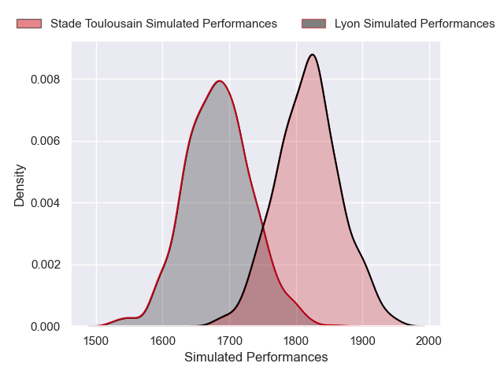
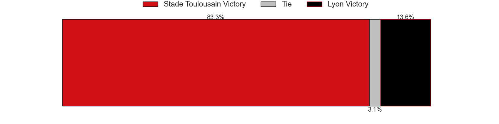
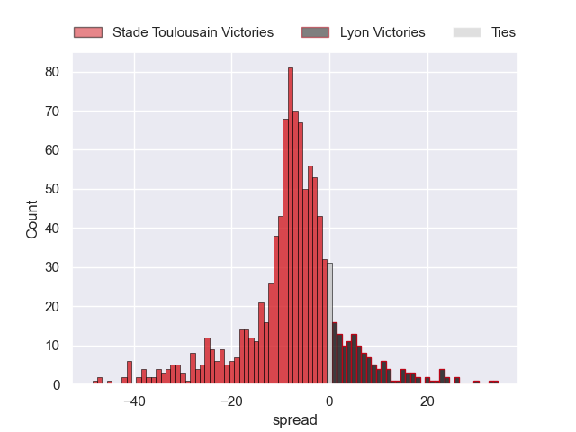

## Week 13

### Pau V Vannes on 2024/12/28

Average Margin: Pau by 7.3

Average Scoreline: 24-16

### Clermont Auvergne V Montpellier Herault on 2024/12/28

Average Margin: Clermont Auvergne by 5.4

Average Scoreline: 29-24

### Bordeaux Begles V Toulon on 2024/12/28

Average Margin: Bordeaux Begles by 5.6

Average Scoreline: 24-18

### Bayonne V Castres Olympique on 2024/12/28

Average Margin: Bayonne by 3.3

Average Scoreline: 24-20

### Stade Toulousain V Stade Francais Paris on 2024/12/29

Average Margin: Stade Toulousain by 14.1

Average Scoreline: 26-12

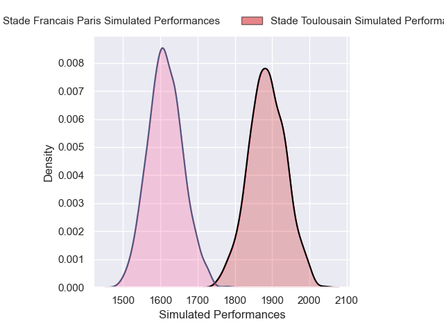
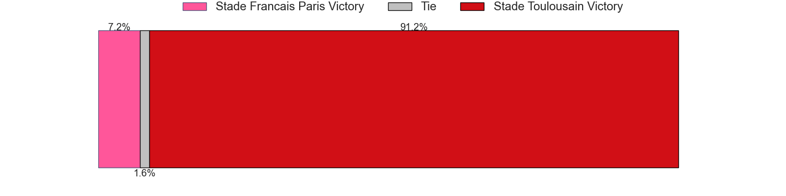
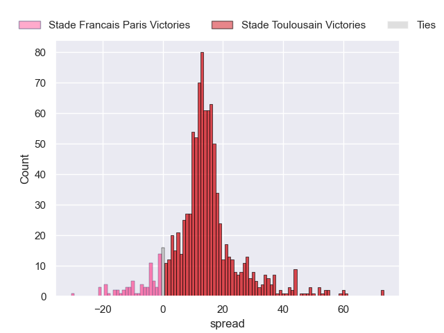

### Perpignan V La Rochelle on 2024/12/29

Average Margin: La Rochelle by 4.9

Average Scoreline: 31-26

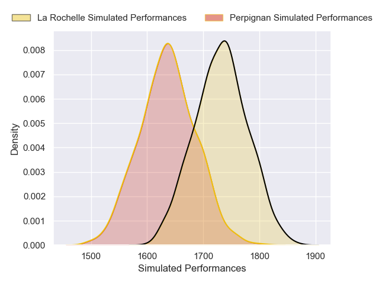
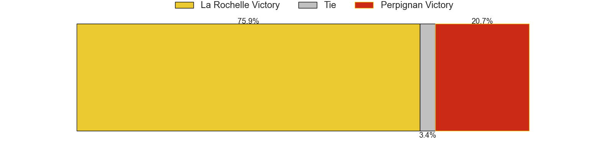
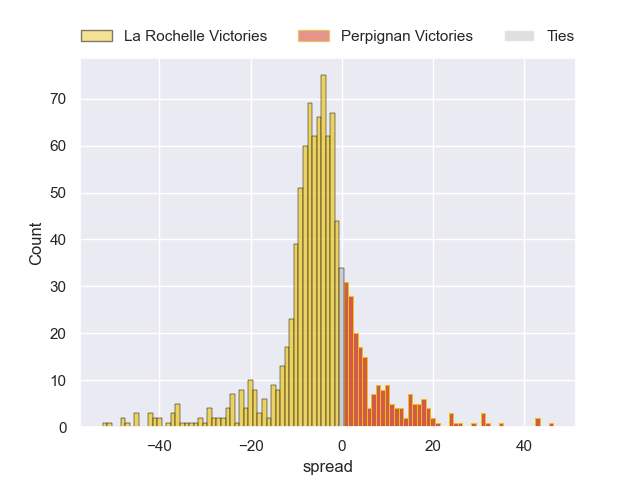

### Racing 92 V Lyon on 2024/12/29

Average Margin: Racing 92 by 5.8

Average Scoreline: 26-20

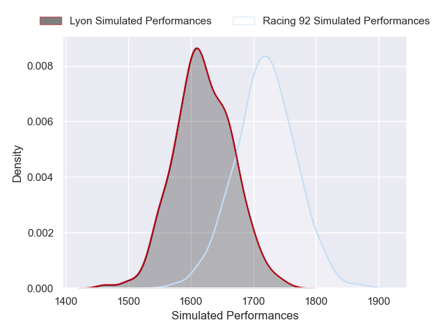
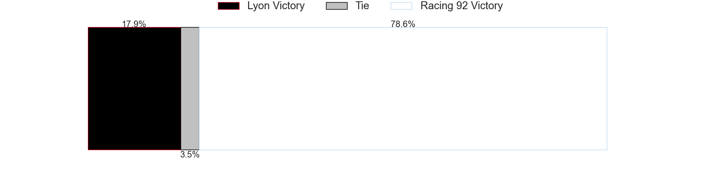
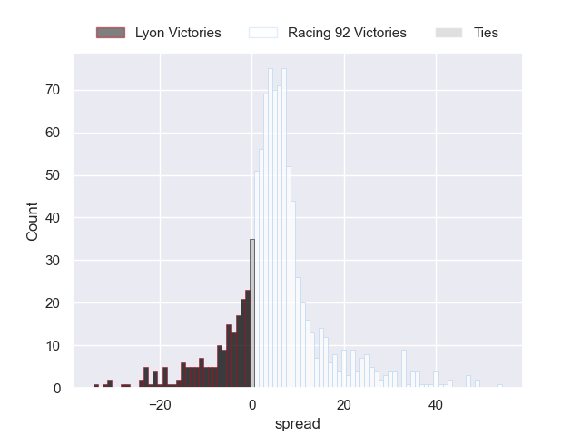

## Week 14

### Toulon V Racing 92 on 2025/01/04

Average Margin: Toulon by 7.4

Average Scoreline: 27-19

### Vannes V Clermont Auvergne on 2025/01/04

Average Margin: Clermont Auvergne by 3.7

Average Scoreline: 26-22

### Stade Francais Paris V Bordeaux Begles on 2025/01/04

Average Margin: Bordeaux Begles by 3.5

Average Scoreline: 27-23

### La Rochelle V Stade Toulousain on 2025/01/04

Average Margin: Stade Toulousain by 1.2

Average Scoreline: 26-25

### Lyon V Perpignan on 2025/01/04

Average Margin: Lyon by 6.3

Average Scoreline: 27-20

### Montpellier Herault V Bayonne on 2025/01/04

Average Margin: Montpellier Herault by 5.5

Average Scoreline: 26-21

### Castres Olympique V Pau on 2025/01/04

Average Margin: Castres Olympique by 4.5

Average Scoreline: 24-20

## Week 15

### Toulon V La Rochelle on 2025/01/25

Average Margin: Toulon by 3.1

Average Scoreline: 27-24

### Racing 92 V Castres Olympique on 2025/01/25

Average Margin: Racing 92 by 4.5

Average Scoreline: 26-21

### Pau V Clermont Auvergne on 2025/01/25

Average Margin: Pau by 0.4

Average Scoreline: 23-23

### Stade Toulousain V Montpellier Herault on 2025/01/25

Average Margin: Stade Toulousain by 11.6

Average Scoreline: 28-16

### Vannes V Stade Francais Paris on 2025/01/25

Average Margin: Vannes by 0.3

Average Scoreline: 22-21

### Bordeaux Begles V Lyon on 2025/01/25

Average Margin: Bordeaux Begles by 10.9

Average Scoreline: 30-19

### Perpignan V Bayonne on 2025/01/25

Average Margin: Perpignan by 1.3

Average Scoreline: 23-22

## Week 16

### Montpellier Herault V Toulon on 2025/02/15

Average Margin: Montpellier Herault by 0.5

Average Scoreline: 26-25

### Perpignan V Castres Olympique on 2025/02/15

Average Margin: Perpignan by 0.2

Average Scoreline: 24-24

### Racing 92 V Vannes on 2025/02/15

Average Margin: Racing 92 by 9.5

Average Scoreline: 31-21

### Stade Francais Paris V Pau on 2025/02/15

Average Margin: Stade Francais Paris by 4.0

Average Scoreline: 26-22

### Clermont Auvergne V Stade Toulousain on 2025/02/15

Average Margin: Stade Toulousain by 4.0

Average Scoreline: 29-25

### Bayonne V Bordeaux Begles on 2025/02/15

Average Margin: Bordeaux Begles by 3.4

Average Scoreline: 27-24

### Lyon V La Rochelle on 2025/02/15

Average Margin: La Rochelle by 2.5

Average Scoreline: 30-27

## Week 17

### La Rochelle V Racing 92 on 2025/02/22

Average Margin: La Rochelle by 7.4

Average Scoreline: 29-22

### Pau V Perpignan on 2025/02/22

Average Margin: Pau by 6.4

Average Scoreline: 26-19

### Toulon V Stade Francais Paris on 2025/02/22

Average Margin: Toulon by 10.1

Average Scoreline: 32-22

### Vannes V Montpellier Herault on 2025/02/22

Average Margin: Montpellier Herault by 1.8

Average Scoreline: 25-23

### Castres Olympique V Lyon on 2025/02/22

Average Margin: Castres Olympique by 5.1

Average Scoreline: 27-22

### Bordeaux Begles V Clermont Auvergne on 2025/02/22

Average Margin: Bordeaux Begles by 6.7

Average Scoreline: 30-23

### Stade Toulousain V Bayonne on 2025/02/22

Average Margin: Stade Toulousain by 13.7

Average Scoreline: 28-14

## Week 18

### Lyon V Toulon on 2025/03/01

Average Margin: Toulon by 2.2

Average Scoreline: 31-29

### Bayonne V Clermont Auvergne on 2025/03/01

Average Margin: Bayonne by 0.7

Average Scoreline: 24-24

### Racing 92 V Pau on 2025/03/01

Average Margin: Racing 92 by 6.3

Average Scoreline: 27-21

### Stade Francais Paris V La Rochelle on 2025/03/01

Average Margin: La Rochelle by 2.2

Average Scoreline: 29-27

### Perpignan V Bordeaux Begles on 2025/03/01

Average Margin: Bordeaux Begles by 6.2

Average Scoreline: 32-25

### Stade Toulousain V Vannes on 2025/03/01

Average Margin: Stade Toulousain by 17.2

Average Scoreline: 33-16

### Montpellier Herault V Castres Olympique on 2025/03/01

Average Margin: Montpellier Herault by 4.3

Average Scoreline: 26-22

## Week 19

### Stade Francais Paris V Bayonne on 2025/03/22

Average Margin: Stade Francais Paris by 3.6

Average Scoreline: 23-20

### Toulon V Perpignan on 2025/03/22

Average Margin: Toulon by 11.1

Average Scoreline: 33-21

### Pau V Montpellier Herault on 2025/03/22

Average Margin: Pau by 1.2

Average Scoreline: 26-25

### Lyon V Vannes on 2025/03/22

Average Margin: Lyon by 7.3

Average Scoreline: 29-21

### Bordeaux Begles V Stade Toulousain on 2025/03/22

Average Margin: Stade Toulousain by 0.3

Average Scoreline: 24-24

### La Rochelle V Castres Olympique on 2025/03/22

Average Margin: La Rochelle by 9.6

Average Scoreline: 32-22

### Clermont Auvergne V Racing 92 on 2025/03/22

Average Margin: Clermont Auvergne by 4.5

Average Scoreline: 30-26

## Week 20

### Castres Olympique V Toulon on 2025/03/29

Average Margin: Toulon by 1.3

Average Scoreline: 29-28

### Montpellier Herault V Stade Francais Paris on 2025/03/29

Average Margin: Montpellier Herault by 6.2

Average Scoreline: 28-22

### Vannes V Perpignan on 2025/03/29

Average Margin: Vannes by 3.7

Average Scoreline: 27-23

### Clermont Auvergne V La Rochelle on 2025/03/29

Average Margin: Clermont Auvergne by 1.1

Average Scoreline: 26-25

### Racing 92 V Bordeaux Begles on 2025/03/29

Average Margin: Bordeaux Begles by 1.9

Average Scoreline: 25-23

### Stade Toulousain V Pau on 2025/03/29

Average Margin: Stade Toulousain by 14.1

Average Scoreline: 33-18

### Bayonne V Lyon on 2025/03/29

Average Margin: Bayonne by 3.9

Average Scoreline: 28-24

## Week 21

### Pau V Bordeaux Begles on 2025/04/19

Average Margin: Bordeaux Begles by 3.1

Average Scoreline: 28-25

### Lyon V Montpellier Herault on 2025/04/19

Average Margin: Lyon by 2.2

Average Scoreline: 25-23

### Castres Olympique V Vannes on 2025/04/19

Average Margin: Castres Olympique by 8.4

Average Scoreline: 29-21

### Toulon V Clermont Auvergne on 2025/04/19

Average Margin: Toulon by 5.8

Average Scoreline: 26-21

### La Rochelle V Bayonne on 2025/04/19

Average Margin: La Rochelle by 10.1

Average Scoreline: 34-24

### Stade Francais Paris V Stade Toulousain on 2025/04/19

Average Margin: Stade Toulousain by 7.1

Average Scoreline: 36-29

### Perpignan V Racing 92 on 2025/04/19

Average Margin: Racing 92 by 0.7

Average Scoreline: 26-25

## Week 22

### Bayonne V Pau on 2025/04/26

Average Margin: Bayonne by 4.3

Average Scoreline: 26-22

### Stade Toulousain V Castres Olympique on 2025/04/26

Average Margin: Stade Toulousain by 13.6

Average Scoreline: 32-18

### Vannes V Toulon on 2025/04/26

Average Margin: Toulon by 5.0

Average Scoreline: 34-29

### Racing 92 V Stade Francais Paris on 2025/04/26

Average Margin: Racing 92 by 6.4

Average Scoreline: 29-22

### Montpellier Herault V Perpignan on 2025/04/26

Average Margin: Montpellier Herault by 9.4

Average Scoreline: 29-20

### Clermont Auvergne V Lyon on 2025/04/26

Average Margin: Clermont Auvergne by 7.6

Average Scoreline: 36-28

### Bordeaux Begles V La Rochelle on 2025/04/26

Average Margin: Bordeaux Begles by 4.4

Average Scoreline: 28-23

## Week 23

### Montpellier Herault V Bordeaux Begles on 2025/05/10

Average Margin: Bordeaux Begles by 1.6

Average Scoreline: 26-25

### Toulon V Stade Toulousain on 2025/05/10

Average Margin: Stade Toulousain by 1.3

Average Scoreline: 27-26

### Castres Olympique V Clermont Auvergne on 2025/05/10

Average Margin: Castres Olympique by 1.3

Average Scoreline: 25-24

### Vannes V La Rochelle on 2025/05/10

Average Margin: La Rochelle by 5.5

Average Scoreline: 34-29

### Lyon V Pau on 2025/05/10

Average Margin: Lyon by 3.9

Average Scoreline: 29-26

### Racing 92 V Bayonne on 2025/05/10

Average Margin: Racing 92 by 5.9

Average Scoreline: 28-22

### Perpignan V Stade Francais Paris on 2025/05/10

Average Margin: Perpignan by 1.7

Average Scoreline: 24-23

## Week 24

### Pau V Toulon on 2025/05/17

Average Margin: Toulon by 2.2

Average Scoreline: 28-26

### Bordeaux Begles V Castres Olympique on 2025/05/17

Average Margin: Bordeaux Begles by 9.2

Average Scoreline: 34-25

### Stade Francais Paris V Lyon on 2025/05/17

Average Margin: Stade Francais Paris by 3.4

Average Scoreline: 30-26

### Bayonne V Vannes on 2025/05/17

Average Margin: Bayonne by 7.4

Average Scoreline: 30-23

### Clermont Auvergne V Perpignan on 2025/05/17

Average Margin: Clermont Auvergne by 10.1

Average Scoreline: 36-26

### La Rochelle V Montpellier Herault on 2025/05/17

Average Margin: La Rochelle by 8.1

Average Scoreline: 35-27

### Stade Toulousain V Racing 92 on 2025/05/17

Average Margin: Stade Toulousain by 11.4

Average Scoreline: 32-21

## Week 25

### Clermont Auvergne V Stade Francais Paris on 2025/05/31

Average Margin: Clermont Auvergne by 7.2

Average Scoreline: 33-26

### Toulon V Bordeaux Begles on 2025/05/31

Average Margin: Toulon by 2.1

Average Scoreline: 27-25

### Stade Toulousain V Lyon on 2025/05/31

Average Margin: Stade Toulousain by 13.4

Average Scoreline: 31-18

### Vannes V Pau on 2025/05/31

Average Margin: Pau by 0.2

Average Scoreline: 22-22

### La Rochelle V Perpignan on 2025/05/31

Average Margin: La Rochelle by 12.3

Average Scoreline: 36-24

### Castres Olympique V Bayonne on 2025/05/31

Average Margin: Castres Olympique by 5.0

Average Scoreline: 27-21

### Racing 92 V Montpellier Herault on 2025/05/31

Average Margin: Racing 92 by 4.0

Average Scoreline: 26-22

## Week 26

### Stade Francais Paris V Castres Olympique on 2025/06/07

Average Margin: Stade Francais Paris by 2.5

Average Scoreline: 25-22

### Pau V La Rochelle on 2025/06/07

Average Margin: La Rochelle by 2.8

Average Scoreline: 31-28

### Bayonne V Toulon on 2025/06/07

Average Margin: Toulon by 0.7

Average Scoreline: 29-29

### Bordeaux Begles V Vannes on 2025/06/07

Average Margin: Bordeaux Begles by 12.6

Average Scoreline: 33-20

### Lyon V Racing 92 on 2025/06/07

Average Margin: Lyon by 1.7

Average Scoreline: 26-24

### Montpellier Herault V Clermont Auvergne on 2025/06/07

Average Margin: Montpellier Herault by 2.6

Average Scoreline: 27-24

### Perpignan V Stade Toulousain on 2025/06/07

Average Margin: Stade Toulousain by 9.0

Average Scoreline: 37-28

