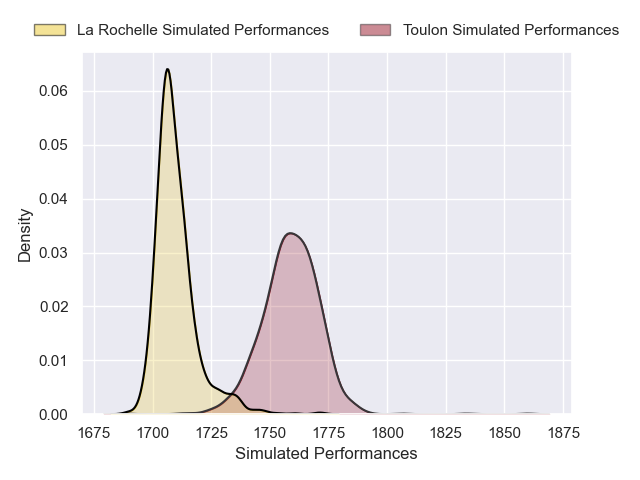
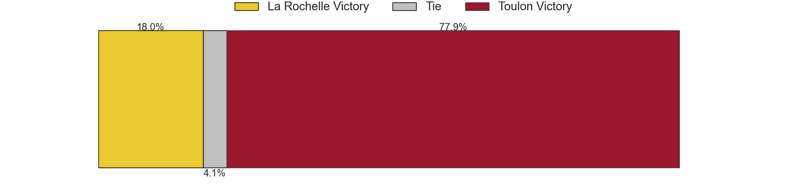
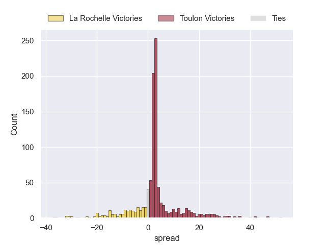
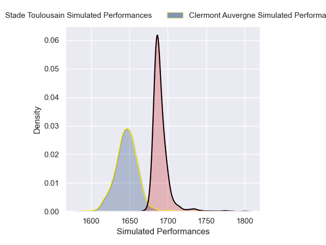
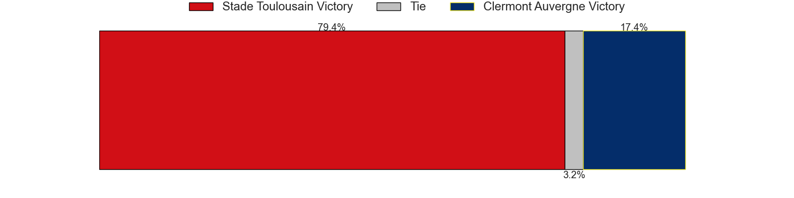
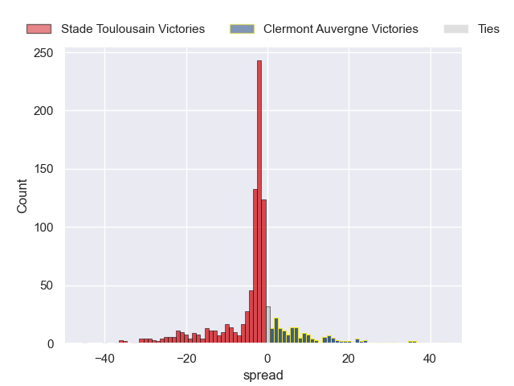

---  
title: "Top 14 Orange 2024 Status"  
date: 2025-01-13 6:00:00 -0500  
categories: model review projection  
layout: article  
aside:  
    toc: true  
---
# Current Team Rankings

# Standings

## Current Standings

| Club                 |   Played |   Wins |   Point Differential |   Losing Bonus Points |   Try Bonus Points |   Competition Points |
|:---------------------|---------:|-------:|---------------------:|----------------------:|-------------------:|---------------------:|
| Bordeaux Begles      |       14 |     11 |                  147 |                     2 |                  4 |                   50 |
| Stade Toulousain     |       14 |      9 |                  171 |                     4 |                  5 |                   47 |
| Toulon               |       14 |      9 |                   60 |                     3 |                  4 |                   43 |
| Clermont Auvergne    |       14 |      8 |                   13 |                     2 |                  4 |                   38 |
| Bayonne              |       14 |      9 |                    7 |                     1 |                  1 |                   38 |
| La Rochelle          |       14 |      8 |                   10 |                     1 |                  3 |                   36 |
| Montpellier Herault  |       14 |      7 |                   61 |                     4 |                  2 |                   34 |
| Castres Olympique    |       14 |      7 |                  -34 |                     2 |                  1 |                   31 |
| Racing 92            |       14 |      5 |                  -26 |                     4 |                  0 |                   26 |
| Lyon                 |       14 |      6 |                  -33 |                     1 |                  1 |                   26 |
| Pau                  |       14 |      5 |                  -70 |                     2 |                  3 |                   25 |
| Perpignan            |       14 |      5 |                  -99 |                     2 |                  2 |                   24 |
| Stade Francais Paris |       14 |      5 |                  -84 |                     1 |                  2 |                   23 |
| Vannes               |       14 |      3 |                 -123 |                     4 |                  0 |                   16 |

## Projected Remaining Table

| Club                 |   Matches Remaining |   Wins |   Point Differential |   Losing Bonus Points |   Try Bonus Points |   Competition Points |
|:---------------------|--------------------:|-------:|---------------------:|----------------------:|-------------------:|---------------------:|
| Montpellier Herault  |                  12 |    9.2 |             69.4777  |                   1.6 |                2   |                 40.2 |
| Bordeaux Begles      |                  12 |    8.2 |             47.4468  |                   2.1 |                1.2 |                 36   |
| Stade Toulousain     |                  12 |    8   |             34.6241  |                   2.2 |                1.1 |                 35.2 |
| La Rochelle          |                  12 |    7.5 |             31.4741  |                   2.7 |                1.2 |                 33.9 |
| Toulon               |                  12 |    6.7 |             25.4832  |                   3   |                0.9 |                 30.8 |
| Bayonne              |                  12 |    6.5 |             10.0055  |                   3   |                0.6 |                 29.6 |
| Stade Francais Paris |                  12 |    6.2 |             -8.85325 |                   2.6 |                0.5 |                 27.9 |
| Racing 92            |                  12 |    6   |             -5.67256 |                   2.9 |                0.5 |                 27.2 |
| Castres Olympique    |                  12 |    6   |             -4.63744 |                   2.4 |                0.7 |                 27   |
| Pau                  |                  12 |    5   |             -3.67264 |                   4.5 |                0.9 |                 25.6 |
| Lyon                 |                  12 |    5.1 |            -18.3698  |                   3.5 |                0.4 |                 24.2 |
| Vannes               |                  12 |    4.1 |            -35.8189  |                   3.2 |                0.4 |                 20.1 |
| Clermont Auvergne    |                  12 |    3.6 |            -62.6285  |                   2.5 |                0.2 |                 17   |
| Perpignan            |                  12 |    2   |            -78.8582  |                   3.9 |                0.3 |                 12.2 |

## Projected Total Table

| Club                 |   Total Matches |   Wins |   Point Differential |   Losing Bonus Points |   Try Bonus Points |   Competition Points |
|:---------------------|----------------:|-------:|---------------------:|----------------------:|-------------------:|---------------------:|
| Bordeaux Begles      |              26 |   19.2 |             194.447  |                   4.1 |                5.2 |                 86   |
| Stade Toulousain     |              26 |   17   |             205.624  |                   6.2 |                6.1 |                 82.2 |
| Montpellier Herault  |              26 |   16.2 |             130.478  |                   5.6 |                4   |                 74.2 |
| Toulon               |              26 |   15.7 |              85.4832 |                   6   |                4.9 |                 73.8 |
| La Rochelle          |              26 |   15.5 |              41.4741 |                   3.7 |                4.2 |                 69.9 |
| Bayonne              |              26 |   15.5 |              17.0055 |                   4   |                1.6 |                 67.6 |
| Castres Olympique    |              26 |   13   |             -38.6374 |                   4.4 |                1.7 |                 58   |
| Clermont Auvergne    |              26 |   11.6 |             -49.6285 |                   4.5 |                4.2 |                 55   |
| Racing 92            |              26 |   11   |             -31.6726 |                   6.9 |                0.5 |                 53.2 |
| Stade Francais Paris |              26 |   11.2 |             -92.8533 |                   3.6 |                2.5 |                 50.9 |
| Pau                  |              26 |   10   |             -73.6726 |                   6.5 |                3.9 |                 50.6 |
| Lyon                 |              26 |   11.1 |             -51.3698 |                   4.5 |                1.4 |                 50.2 |
| Perpignan            |              26 |    7   |            -177.858  |                   5.9 |                2.3 |                 36.2 |
| Vannes               |              26 |    7.1 |            -158.819  |                   7.2 |                0.4 |                 36.1 |

# Completed Match Review

| Model | Percent Correct Predictions | Spread Error |
| ------ | ------ | ------ |
| Club Level | 78.6% | 10.6 |
| Player Level: Lineup | 76.2% | 12.8 |
| Player Level: Minutes | 78.6% | 11.9 |

# Future Predictions

## Week 15

### Pau V Clermont Auvergne on 2025/01/25

Average Margin: Pau by 8.3

Average Scoreline: 31-22

### Stade Toulousain V Montpellier Herault on 2025/01/25

Average Margin: Stade Toulousain by 0.5

Average Scoreline: 27-26

### Vannes V Stade Francais Paris on 2025/01/25

Average Margin: Vannes by 2.4

Average Scoreline: 30-28

### Perpignan V Bayonne on 2025/01/25

Average Margin: Bayonne by 2.7

Average Scoreline: 39-36

### Racing 92 V Castres Olympique on 2025/01/25

Average Margin: Racing 92 by 2.7

Average Scoreline: 31-29

### Bordeaux Begles V Lyon on 2025/01/25

Average Margin: Bordeaux Begles by 8.1

Average Scoreline: 32-24

### Toulon V La Rochelle on 2025/01/26

Average Margin: Toulon by 3.1

Average Scoreline: 29-26

## Week 16

### Montpellier Herault V Toulon on 2025/02/15

Average Margin: Montpellier Herault by 7.2

Average Scoreline: 30-23

### Stade Francais Paris V Pau on 2025/02/15

Average Margin: Stade Francais Paris by 3.9

Average Scoreline: 31-27

### Racing 92 V Vannes on 2025/02/15

Average Margin: Racing 92 by 5.1

Average Scoreline: 28-23

### Perpignan V Castres Olympique on 2025/02/15

Average Margin: Castres Olympique by 2.1

Average Scoreline: 38-36

### Bayonne V Bordeaux Begles on 2025/02/15

Average Margin: Bordeaux Begles by 0.0

Average Scoreline: 31-31

### Lyon V La Rochelle on 2025/02/15

Average Margin: La Rochelle by 0.0

Average Scoreline: 35-35

### Clermont Auvergne V Stade Toulousain on 2025/02/16

Average Margin: Stade Toulousain by 3.3

Average Scoreline: 40-37

## Week 17

### La Rochelle V Racing 92 on 2025/02/22

Average Margin: La Rochelle by 8.2

Average Scoreline: 30-22

### Toulon V Stade Francais Paris on 2025/02/22

Average Margin: Toulon by 6.9

Average Scoreline: 31-24

### Castres Olympique V Lyon on 2025/02/22

Average Margin: Castres Olympique by 4.8

Average Scoreline: 27-23

### Pau V Perpignan on 2025/02/22

Average Margin: Pau by 9.1

Average Scoreline: 35-26

### Stade Toulousain V Bayonne on 2025/02/22

Average Margin: Stade Toulousain by 4.8

Average Scoreline: 27-22

### Vannes V Montpellier Herault on 2025/02/22

Average Margin: Montpellier Herault by 4.5

Average Scoreline: 32-27

### Bordeaux Begles V Clermont Auvergne on 2025/02/22

Average Margin: Bordeaux Begles by 11.4

Average Scoreline: 35-23

## Week 18

### Stade Toulousain V Vannes on 2025/03/01

Average Margin: Stade Toulousain by 8.4

Average Scoreline: 29-20

### Lyon V Toulon on 2025/03/01

Average Margin: Lyon by 0.2

Average Scoreline: 29-29

### Montpellier Herault V Castres Olympique on 2025/03/01

Average Margin: Montpellier Herault by 8.8

Average Scoreline: 31-22

### Perpignan V Bordeaux Begles on 2025/03/01

Average Margin: Bordeaux Begles by 6.3

Average Scoreline: 35-29

### Stade Francais Paris V La Rochelle on 2025/03/01

Average Margin: La Rochelle by 0.2

Average Scoreline: 33-33

### Racing 92 V Pau on 2025/03/01

Average Margin: Racing 92 by 3.5

Average Scoreline: 33-30

### Bayonne V Clermont Auvergne on 2025/03/01

Average Margin: Bayonne by 9.1

Average Scoreline: 32-23

## Week 19

### Stade Francais Paris V Bayonne on 2025/03/22

Average Margin: Stade Francais Paris by 2.4

Average Scoreline: 32-30

### Toulon V Perpignan on 2025/03/22

Average Margin: Toulon by 12.3

Average Scoreline: 35-23

### Pau V Montpellier Herault on 2025/03/22

Average Margin: Montpellier Herault by 1.5

Average Scoreline: 30-29

### Lyon V Vannes on 2025/03/22

Average Margin: Lyon by 5.2

Average Scoreline: 32-27

### La Rochelle V Castres Olympique on 2025/03/22

Average Margin: La Rochelle by 6.6

Average Scoreline: 25-18

### Clermont Auvergne V Racing 92 on 2025/03/22

Average Margin: Racing 92 by 0.1

Average Scoreline: 36-35

### Bordeaux Begles V Stade Toulousain on 2025/03/22

Average Margin: Bordeaux Begles by 5.8

Average Scoreline: 30-25

## Week 20

### Racing 92 V Bordeaux Begles on 2025/03/29

Average Margin: Bordeaux Begles by 1.5

Average Scoreline: 31-30

### Castres Olympique V Toulon on 2025/03/29

Average Margin: Castres Olympique by 1.9

Average Scoreline: 29-27

### Stade Toulousain V Pau on 2025/03/29

Average Margin: Stade Toulousain by 5.4

Average Scoreline: 29-24

### Vannes V Perpignan on 2025/03/29

Average Margin: Vannes by 7.8

Average Scoreline: 37-29

### Montpellier Herault V Stade Francais Paris on 2025/03/29

Average Margin: Montpellier Herault by 10.1

Average Scoreline: 31-21

### Bayonne V Lyon on 2025/03/29

Average Margin: Bayonne by 5.5

Average Scoreline: 28-23

### Clermont Auvergne V La Rochelle on 2025/03/29

Average Margin: La Rochelle by 3.7

Average Scoreline: 36-32

## Week 21

### Lyon V Montpellier Herault on 2025/04/19

Average Margin: Montpellier Herault by 2.3

Average Scoreline: 31-28

### Toulon V Clermont Auvergne on 2025/04/19

Average Margin: Toulon by 10.2

Average Scoreline: 32-22

### Pau V Bordeaux Begles on 2025/04/19

Average Margin: Bordeaux Begles by 0.1

Average Scoreline: 30-30

### Castres Olympique V Vannes on 2025/04/19

Average Margin: Castres Olympique by 6.1

Average Scoreline: 27-21

### Perpignan V Racing 92 on 2025/04/19

Average Margin: Racing 92 by 0.5

Average Scoreline: 37-37

### La Rochelle V Bayonne on 2025/04/19

Average Margin: La Rochelle by 6.4

Average Scoreline: 29-22

### Stade Francais Paris V Stade Toulousain on 2025/04/19

Average Margin: Stade Francais Paris by 0.9

Average Scoreline: 36-35

## Week 22

### Stade Toulousain V Castres Olympique on 2025/04/26

Average Margin: Stade Toulousain by 4.9

Average Scoreline: 27-22

### Bordeaux Begles V La Rochelle on 2025/04/26

Average Margin: Bordeaux Begles by 4.1

Average Scoreline: 28-24

### Racing 92 V Stade Francais Paris on 2025/04/26

Average Margin: Racing 92 by 3.8

Average Scoreline: 30-26

### Clermont Auvergne V Lyon on 2025/04/26

Average Margin: Clermont Auvergne by 0.1

Average Scoreline: 34-34

### Vannes V Toulon on 2025/04/26

Average Margin: Toulon by 0.6

Average Scoreline: 28-27

### Montpellier Herault V Perpignan on 2025/04/26

Average Margin: Montpellier Herault by 14.5

Average Scoreline: 39-25

### Bayonne V Pau on 2025/04/26

Average Margin: Bayonne by 3.8

Average Scoreline: 26-22

## Week 23

### Montpellier Herault V Bordeaux Begles on 2025/05/10

Average Margin: Montpellier Herault by 5.5

Average Scoreline: 24-19

### Lyon V Pau on 2025/05/10

Average Margin: Lyon by 2.8

Average Scoreline: 37-34

### Perpignan V Stade Francais Paris on 2025/05/10

Average Margin: Stade Francais Paris by 1.9

Average Scoreline: 37-35

### Toulon V Stade Toulousain on 2025/05/10

Average Margin: Toulon by 4.1

Average Scoreline: 31-26

### Racing 92 V Bayonne on 2025/05/10

Average Margin: Racing 92 by 2.9

Average Scoreline: 32-29

### Vannes V La Rochelle on 2025/05/10

Average Margin: La Rochelle by 1.5

Average Scoreline: 31-29

### Castres Olympique V Clermont Auvergne on 2025/05/10

Average Margin: Castres Olympique by 9.1

Average Scoreline: 32-22

## Week 24

### Stade Francais Paris V Lyon on 2025/05/17

Average Margin: Stade Francais Paris by 3.6

Average Scoreline: 30-27

### Stade Toulousain V Racing 92 on 2025/05/17

Average Margin: Stade Toulousain by 7.1

Average Scoreline: 29-22

### La Rochelle V Montpellier Herault on 2025/05/17

Average Margin: La Rochelle by 0.9

Average Scoreline: 28-27

### Clermont Auvergne V Perpignan on 2025/05/17

Average Margin: Clermont Auvergne by 5.3

Average Scoreline: 30-24

### Bordeaux Begles V Castres Olympique on 2025/05/17

Average Margin: Bordeaux Begles by 7.1

Average Scoreline: 30-23

### Bayonne V Vannes on 2025/05/17

Average Margin: Bayonne by 6.8

Average Scoreline: 32-25

### Pau V Toulon on 2025/05/17

Average Margin: Pau by 1.8

Average Scoreline: 30-28

## Week 25

### Racing 92 V Montpellier Herault on 2025/05/31

Average Margin: Montpellier Herault by 3.2

Average Scoreline: 32-29

### La Rochelle V Perpignan on 2025/05/31

Average Margin: La Rochelle by 11.9

Average Scoreline: 41-29

### Vannes V Pau on 2025/05/31

Average Margin: Vannes by 2.5

Average Scoreline: 31-29

### Stade Toulousain V Lyon on 2025/05/31

Average Margin: Stade Toulousain by 6.6

Average Scoreline: 28-22

### Toulon V Bordeaux Begles on 2025/05/31

Average Margin: Toulon by 1.7

Average Scoreline: 26-25

### Clermont Auvergne V Stade Francais Paris on 2025/05/31

Average Margin: Clermont Auvergne by 0.4

Average Scoreline: 37-37

### Castres Olympique V Bayonne on 2025/05/31

Average Margin: Castres Olympique by 3.7

Average Scoreline: 30-26

## Week 26

### Bayonne V Toulon on 2025/06/07

Average Margin: Bayonne by 2.3

Average Scoreline: 32-30

### Lyon V Racing 92 on 2025/06/07

Average Margin: Lyon by 4.3

Average Scoreline: 32-28

### Perpignan V Stade Toulousain on 2025/06/07

Average Margin: Stade Toulousain by 4.4

Average Scoreline: 37-33

### Bordeaux Begles V Vannes on 2025/06/07

Average Margin: Bordeaux Begles by 10.3

Average Scoreline: 31-21

### Stade Francais Paris V Castres Olympique on 2025/06/07

Average Margin: Stade Francais Paris by 2.2

Average Scoreline: 32-29

### Montpellier Herault V Clermont Auvergne on 2025/06/07

Average Margin: Montpellier Herault by 13.3

Average Scoreline: 39-25

### Pau V La Rochelle on 2025/06/07

Average Margin: Pau by 0.7

Average Scoreline: 32-31

