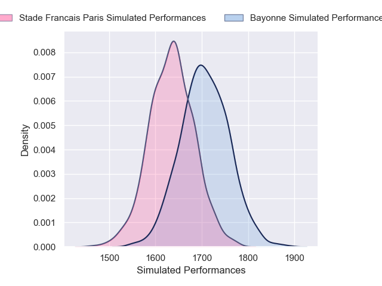
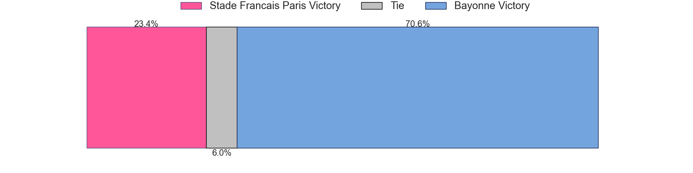
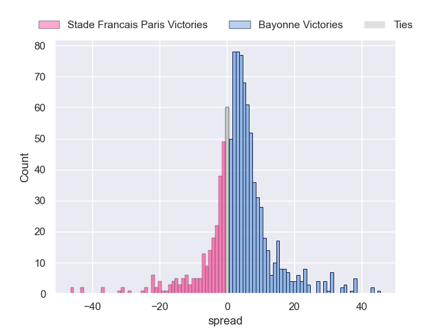

---  
title: "Top 14 Orange 2024 Status"  
date: 2024-11-25 6:00:00 -0500  
categories: model review projection  
layout: article  
aside:  
    toc: true  
---
# Current Team Rankings

# Standings

## Current Standings

| Club                 |   Played |   Wins |   Point Differential |   Losing Bonus Points |   Try Bonus Points |   Competition Points |
|:---------------------|---------:|-------:|---------------------:|----------------------:|-------------------:|---------------------:|
| Stade Toulousain     |       10 |      7 |                  155 |                     3 |                  4 |                   35 |
| Bordeaux Begles      |       10 |      7 |                  103 |                     2 |                  3 |                   33 |
| La Rochelle          |       10 |      6 |                   19 |                     1 |                  3 |                   28 |
| Castres Olympique    |       10 |      6 |                   36 |                     2 |                  1 |                   27 |
| Bayonne              |        9 |      6 |                   24 |                     1 |                  1 |                   26 |
| Toulon               |        9 |      5 |                   -8 |                     2 |                  1 |                   23 |
| Clermont Auvergne    |        9 |      5 |                  -31 |                     0 |                  3 |                   23 |
| Racing 92            |       10 |      5 |                  -21 |                     2 |                  0 |                   22 |
| Montpellier Herault  |       10 |      4 |                   24 |                     3 |                  1 |                   20 |
| Stade Francais Paris |       10 |      4 |                  -36 |                     1 |                  2 |                   19 |
| Perpignan            |       10 |      4 |                  -76 |                     1 |                  2 |                   19 |
| Lyon                 |        9 |      4 |                  -16 |                     1 |                  1 |                   18 |
| Pau                  |       10 |      3 |                  -72 |                     1 |                  2 |                   15 |
| Vannes               |       10 |      2 |                 -101 |                     3 |                  0 |                   11 |

## Projected Remaining Table

| Club                 |   Matches Remaining |   Wins |   Point Differential |   Losing Bonus Points |   Try Bonus Points |   Competition Points |
|:---------------------|--------------------:|-------:|---------------------:|----------------------:|-------------------:|---------------------:|
| La Rochelle          |                   1 |    0.9 |             14.0502  |                   0   |                0.7 |                  4.4 |
| Bordeaux Begles      |                   1 |    0.9 |              9.29438 |                   0.1 |                0.2 |                  3.8 |
| Stade Toulousain     |                   1 |    0.7 |              4.83527 |                   0.1 |                0.2 |                  3.3 |
| Bayonne              |                   1 |    0.7 |              3.76928 |                   0.2 |                0.1 |                  3.2 |
| Toulon               |                   1 |    0.7 |              3.2466  |                   0.2 |                0.2 |                  3.2 |
| Clermont Auvergne    |                   1 |    0.7 |              3.92208 |                   0.1 |                0.1 |                  3.1 |
| Pau                  |                   1 |    0.6 |              2.34442 |                   0.2 |                0.1 |                  2.8 |
| Lyon                 |                   1 |    0.4 |             -2.34442 |                   0.3 |                0.1 |                  2   |
| Perpignan            |                   1 |    0.3 |             -3.2466  |                   0.3 |                0   |                  1.6 |
| Stade Francais Paris |                   1 |    0.3 |             -3.76928 |                   0.3 |                0.1 |                  1.5 |
| Castres Olympique    |                   1 |    0.3 |             -3.92208 |                   0.4 |                0.1 |                  1.5 |
| Racing 92            |                   1 |    0.3 |             -4.83527 |                   0.3 |                0   |                  1.3 |
| Montpellier Herault  |                   1 |    0.1 |             -9.29438 |                   0.2 |                0   |                  0.7 |
| Vannes               |                   1 |    0.1 |            -14.0502  |                   0.1 |                0   |                  0.4 |

## Projected Total Table

| Club                 |   Total Matches |   Wins |   Point Differential |   Losing Bonus Points |   Try Bonus Points |   Competition Points |
|:---------------------|----------------:|-------:|---------------------:|----------------------:|-------------------:|---------------------:|
| Stade Toulousain     |              11 |    7.7 |             159.835  |                   3.1 |                4.2 |                 38.3 |
| Bordeaux Begles      |              11 |    7.9 |             112.294  |                   2.1 |                3.2 |                 36.8 |
| La Rochelle          |              11 |    6.9 |              33.0502 |                   1   |                3.7 |                 32.4 |
| Bayonne              |              10 |    6.7 |              27.7693 |                   1.2 |                1.1 |                 29.2 |
| Castres Olympique    |              11 |    6.3 |              32.0779 |                   2.4 |                1.1 |                 28.5 |
| Toulon               |              10 |    5.7 |              -4.7534 |                   2.2 |                1.2 |                 26.2 |
| Clermont Auvergne    |              10 |    5.7 |             -27.0779 |                   0.1 |                3.1 |                 26.1 |
| Racing 92            |              11 |    5.3 |             -25.8353 |                   2.3 |                0   |                 23.3 |
| Montpellier Herault  |              11 |    4.1 |              14.7056 |                   3.2 |                1   |                 20.7 |
| Perpignan            |              11 |    4.3 |             -79.2466 |                   1.3 |                2   |                 20.6 |
| Stade Francais Paris |              11 |    4.3 |             -39.7693 |                   1.3 |                2.1 |                 20.5 |
| Lyon                 |              10 |    4.4 |             -18.3444 |                   1.3 |                1.1 |                 20   |
| Pau                  |              11 |    3.6 |             -69.6556 |                   1.2 |                2.1 |                 17.8 |
| Vannes               |              11 |    2.1 |            -115.05   |                   3.1 |                0   |                 11.4 |

# Completed Match Review

| Model | Percent Correct Predictions | Spread Error |
| ------ | ------ | ------ |
| Club Level | 80.9% | 11.2 |
| Player Level: Lineup | 78.6% | 12.2 |
| Player Level: Minutes | 78.1% | 63.0 |

# Future Predictions

## Week 11

### Bordeaux Begles V Montpellier Herault on 2024/11/30

Average Margin: Bordeaux Begles by 9.3

Average Scoreline: 31-22

### Pau V Lyon on 2024/11/30

Average Margin: Pau by 2.3

Average Scoreline: 28-25

### La Rochelle V Vannes on 2024/11/30

Average Margin: La Rochelle by 14.1

Average Scoreline: 42-28

### Perpignan V Toulon on 2024/11/30

Average Margin: Toulon by 3.2

Average Scoreline: 30-26

### Racing 92 V Stade Toulousain on 2024/11/30

Average Margin: Stade Toulousain by 4.8

Average Scoreline: 32-27

### Clermont Auvergne V Castres Olympique on 2024/11/30

Average Margin: Clermont Auvergne by 3.9

Average Scoreline: 26-22

### Bayonne V Stade Francais Paris on 2024/12/01

Average Margin: Bayonne by 3.8

Average Scoreline: 25-21

## Week 12

## Week 13
