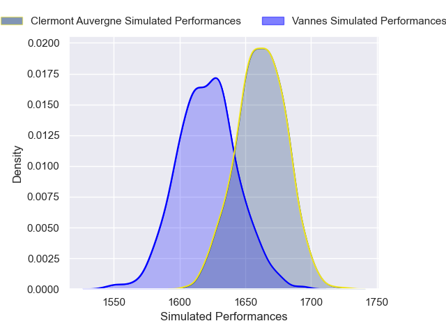
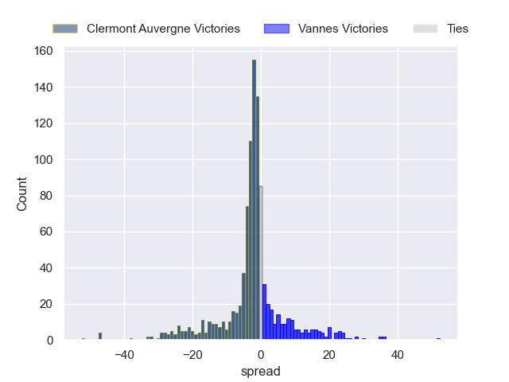

---  
title: "Top 14 Orange 2024 Status"  
date: 2024-12-30 6:00:00 -0500  
categories: model review projection  
layout: article  
aside:  
    toc: true  
---
# Current Team Rankings

# Standings

## Current Standings

| Club                 |   Played |   Wins |   Point Differential |   Losing Bonus Points |   Try Bonus Points |   Competition Points |
|:---------------------|---------:|-------:|---------------------:|----------------------:|-------------------:|---------------------:|
| Stade Toulousain     |       13 |      9 |                  174 |                     3 |                  5 |                   46 |
| Bordeaux Begles      |       13 |     10 |                  120 |                     2 |                  3 |                   45 |
| Toulon               |       13 |      8 |                   48 |                     3 |                  3 |                   38 |
| Bayonne              |       13 |      9 |                   39 |                     1 |                  1 |                   38 |
| Clermont Auvergne    |       13 |      7 |                   12 |                     2 |                  4 |                   34 |
| La Rochelle          |       13 |      7 |                    7 |                     1 |                  3 |                   32 |
| Montpellier Herault  |       13 |      6 |                   29 |                     4 |                  1 |                   29 |
| Castres Olympique    |       13 |      6 |                  -39 |                     2 |                  1 |                   27 |
| Racing 92            |       13 |      5 |                  -14 |                     4 |                  0 |                   26 |
| Pau                  |       13 |      5 |                  -65 |                     1 |                  3 |                   24 |
| Stade Francais Paris |       13 |      5 |                  -57 |                     1 |                  2 |                   23 |
| Perpignan            |       13 |      5 |                  -94 |                     1 |                  2 |                   23 |
| Lyon                 |       13 |      5 |                  -38 |                     1 |                  1 |                   22 |
| Vannes               |       13 |      3 |                 -122 |                     3 |                  0 |                   15 |

## Projected Remaining Table

| Club                 |   Matches Remaining |   Wins |   Point Differential |   Losing Bonus Points |   Try Bonus Points |   Competition Points |
|:---------------------|--------------------:|-------:|---------------------:|----------------------:|-------------------:|---------------------:|
| Stade Toulousain     |                  13 |   10.1 |             91.5967  |                   1.5 |                1.8 |                 43.8 |
| La Rochelle          |                  13 |    8.8 |             45.8941  |                   2.4 |                1.2 |                 38.8 |
| Toulon               |                  13 |    8.9 |             32.7248  |                   2.3 |                1   |                 38.8 |
| Bordeaux Begles      |                  13 |    8.4 |             42.6504  |                   2.8 |                1.2 |                 37.7 |
| Racing 92            |                  13 |    7.6 |             34.2174  |                   2.8 |                1   |                 34.1 |
| Perpignan            |                  13 |    6.8 |              5.1319  |                   3.4 |                0.8 |                 31.3 |
| Clermont Auvergne    |                  13 |    6.5 |             -0.37569 |                   3.6 |                0.8 |                 30.3 |
| Montpellier Herault  |                  13 |    6.2 |            -15.7102  |                   2.9 |                0.6 |                 28.4 |
| Castres Olympique    |                  13 |    5.6 |            -27.8163  |                   2.5 |                0.7 |                 25.4 |
| Lyon                 |                  13 |    5.3 |            -22.9551  |                   3.6 |                0.5 |                 25.3 |
| Bayonne              |                  13 |    5.3 |            -21.4863  |                   3.4 |                0.4 |                 25.2 |
| Stade Francais Paris |                  13 |    5.2 |            -28.2588  |                   3.2 |                0.6 |                 24.4 |
| Pau                  |                  13 |    3.1 |            -61.0662  |                   4.4 |                0.4 |                 17.3 |
| Vannes               |                  13 |    3.2 |            -74.5467  |                   3.3 |                0.2 |                 16.4 |

## Projected Total Table

| Club                 |   Total Matches |   Wins |   Point Differential |   Losing Bonus Points |   Try Bonus Points |   Competition Points |
|:---------------------|----------------:|-------:|---------------------:|----------------------:|-------------------:|---------------------:|
| Stade Toulousain     |              26 |   19.1 |             265.597  |                   4.5 |                6.8 |                 89.8 |
| Bordeaux Begles      |              26 |   18.4 |             162.65   |                   4.8 |                4.2 |                 82.7 |
| Toulon               |              26 |   16.9 |              80.7248 |                   5.3 |                4   |                 76.8 |
| La Rochelle          |              26 |   15.8 |              52.8941 |                   3.4 |                4.2 |                 70.8 |
| Clermont Auvergne    |              26 |   13.5 |              11.6243 |                   5.6 |                4.8 |                 64.3 |
| Bayonne              |              26 |   14.3 |              17.5137 |                   4.4 |                1.4 |                 63.2 |
| Racing 92            |              26 |   12.6 |              20.2174 |                   6.8 |                1   |                 60.1 |
| Montpellier Herault  |              26 |   12.2 |              13.2898 |                   6.9 |                1.6 |                 57.4 |
| Perpignan            |              26 |   11.8 |             -88.8681 |                   4.4 |                2.8 |                 54.3 |
| Castres Olympique    |              26 |   11.6 |             -66.8163 |                   4.5 |                1.7 |                 52.4 |
| Stade Francais Paris |              26 |   10.2 |             -85.2588 |                   4.2 |                2.6 |                 47.4 |
| Lyon                 |              26 |   10.3 |             -60.9551 |                   4.6 |                1.5 |                 47.3 |
| Pau                  |              26 |    8.1 |            -126.066  |                   5.4 |                3.4 |                 41.3 |
| Vannes               |              26 |    6.2 |            -196.547  |                   6.3 |                0.2 |                 31.4 |

# Completed Match Review

| Model | Percent Correct Predictions | Spread Error |
| ------ | ------ | ------ |
| Club Level | 78.0% | 10.8 |
| Player Level: Lineup | 81.3% | 24.4 |
| Player Level: Minutes | 74.7% | 148.6 |

# Future Predictions

## Week 14

### Castres Olympique V Pau on 2025/01/04

Average Margin: Castres Olympique by 6.2

Average Scoreline: 33-27

### Stade Francais Paris V Bordeaux Begles on 2025/01/04

Average Margin: Bordeaux Begles by 2.1

Average Scoreline: 32-29

### Toulon V Racing 92 on 2025/01/04

Average Margin: Toulon by 3.6

Average Scoreline: 33-30

### La Rochelle V Stade Toulousain on 2025/01/04

Average Margin: La Rochelle by 0.8

Average Scoreline: 29-28

### Montpellier Herault V Bayonne on 2025/01/04

Average Margin: Montpellier Herault by 2.8

Average Scoreline: 29-26

### Lyon V Perpignan on 2025/01/04

Average Margin: Lyon by 0.7

Average Scoreline: 28-27

### Vannes V Clermont Auvergne on 2025/01/05

Average Margin: Clermont Auvergne by 2.3

Average Scoreline: 30-27

## Week 15

### Perpignan V Bayonne on 2025/01/25

Average Margin: Perpignan by 5.8

Average Scoreline: 30-24

### Stade Toulousain V Montpellier Herault on 2025/01/25

Average Margin: Stade Toulousain by 11.3

Average Scoreline: 34-22

### Bordeaux Begles V Lyon on 2025/01/25

Average Margin: Bordeaux Begles by 9.4

Average Scoreline: 35-26

### Vannes V Stade Francais Paris on 2025/01/25

Average Margin: Vannes by 0.3

Average Scoreline: 28-27

### Toulon V La Rochelle on 2025/01/25

Average Margin: Toulon by 2.5

Average Scoreline: 30-27

### Pau V Clermont Auvergne on 2025/01/25

Average Margin: Pau by 0.1

Average Scoreline: 26-26

### Racing 92 V Castres Olympique on 2025/01/25

Average Margin: Racing 92 by 7.9

Average Scoreline: 32-24

## Week 16

### Bayonne V Bordeaux Begles on 2025/02/15

Average Margin: Bordeaux Begles by 1.3

Average Scoreline: 34-33

### Perpignan V Castres Olympique on 2025/02/15

Average Margin: Perpignan by 6.0

Average Scoreline: 29-23

### Lyon V La Rochelle on 2025/02/15

Average Margin: La Rochelle by 2.1

Average Scoreline: 31-28

### Montpellier Herault V Toulon on 2025/02/15

Average Margin: Montpellier Herault by 0.5

Average Scoreline: 34-34

### Racing 92 V Vannes on 2025/02/15

Average Margin: Racing 92 by 11.1

Average Scoreline: 40-29

### Clermont Auvergne V Stade Toulousain on 2025/02/15

Average Margin: Stade Toulousain by 2.5

Average Scoreline: 37-35

### Stade Francais Paris V Pau on 2025/02/15

Average Margin: Stade Francais Paris by 5.5

Average Scoreline: 34-28

## Week 17

### Bordeaux Begles V Clermont Auvergne on 2025/02/22

Average Margin: Bordeaux Begles by 7.1

Average Scoreline: 26-19

### Stade Toulousain V Bayonne on 2025/02/22

Average Margin: Stade Toulousain by 11.2

Average Scoreline: 33-22

### La Rochelle V Racing 92 on 2025/02/22

Average Margin: La Rochelle by 5.0

Average Scoreline: 33-28

### Pau V Perpignan on 2025/02/22

Average Margin: Perpignan by 1.3

Average Scoreline: 35-34

### Vannes V Montpellier Herault on 2025/02/22

Average Margin: Montpellier Herault by 0.5

Average Scoreline: 30-29

### Toulon V Stade Francais Paris on 2025/02/22

Average Margin: Toulon by 7.5

Average Scoreline: 32-24

### Castres Olympique V Lyon on 2025/02/22

Average Margin: Castres Olympique by 4.2

Average Scoreline: 32-28

## Week 18

### Bayonne V Clermont Auvergne on 2025/03/01

Average Margin: Bayonne by 2.3

Average Scoreline: 31-28

### Perpignan V Bordeaux Begles on 2025/03/01

Average Margin: Perpignan by 1.1

Average Scoreline: 29-28

### Lyon V Toulon on 2025/03/01

Average Margin: Toulon by 0.0

Average Scoreline: 35-35

### Stade Toulousain V Vannes on 2025/03/01

Average Margin: Stade Toulousain by 14.6

Average Scoreline: 40-25

### Racing 92 V Pau on 2025/03/01

Average Margin: Racing 92 by 10.5

Average Scoreline: 37-27

### Stade Francais Paris V La Rochelle on 2025/03/01

Average Margin: La Rochelle by 1.7

Average Scoreline: 32-30

### Montpellier Herault V Castres Olympique on 2025/03/01

Average Margin: Montpellier Herault by 4.1

Average Scoreline: 31-27

## Week 19

### Bordeaux Begles V Stade Toulousain on 2025/03/22

Average Margin: Bordeaux Begles by 0.3

Average Scoreline: 32-32

### Lyon V Vannes on 2025/03/22

Average Margin: Lyon by 7.9

Average Scoreline: 37-29

### Toulon V Perpignan on 2025/03/22

Average Margin: Toulon by 5.0

Average Scoreline: 29-24

### Stade Francais Paris V Bayonne on 2025/03/22

Average Margin: Stade Francais Paris by 2.9

Average Scoreline: 28-26

### La Rochelle V Castres Olympique on 2025/03/22

Average Margin: La Rochelle by 9.8

Average Scoreline: 30-21

### Pau V Montpellier Herault on 2025/03/22

Average Margin: Pau by 1.4

Average Scoreline: 28-26

### Clermont Auvergne V Racing 92 on 2025/03/22

Average Margin: Clermont Auvergne by 2.0

Average Scoreline: 35-33

## Week 20

### Castres Olympique V Toulon on 2025/03/29

Average Margin: Castres Olympique by 0.1

Average Scoreline: 35-35

### Racing 92 V Bordeaux Begles on 2025/03/29

Average Margin: Racing 92 by 3.0

Average Scoreline: 31-28

### Stade Toulousain V Pau on 2025/03/29

Average Margin: Stade Toulousain by 13.9

Average Scoreline: 35-21

### Vannes V Perpignan on 2025/03/29

Average Margin: Perpignan by 2.6

Average Scoreline: 33-31

### Montpellier Herault V Stade Francais Paris on 2025/03/29

Average Margin: Montpellier Herault by 4.3

Average Scoreline: 27-23

### Clermont Auvergne V La Rochelle on 2025/03/29

Average Margin: Clermont Auvergne by 1.0

Average Scoreline: 29-28

### Bayonne V Lyon on 2025/03/29

Average Margin: Bayonne by 4.5

Average Scoreline: 28-23

## Week 21

### Lyon V Montpellier Herault on 2025/04/19

Average Margin: Lyon by 3.3

Average Scoreline: 27-24

### Stade Francais Paris V Stade Toulousain on 2025/04/19

Average Margin: Stade Toulousain by 5.3

Average Scoreline: 38-33

### Pau V Bordeaux Begles on 2025/04/19

Average Margin: Bordeaux Begles by 3.5

Average Scoreline: 40-37

### Perpignan V Racing 92 on 2025/04/19

Average Margin: Perpignan by 2.5

Average Scoreline: 35-32

### Toulon V Clermont Auvergne on 2025/04/19

Average Margin: Toulon by 6.2

Average Scoreline: 28-22

### Castres Olympique V Vannes on 2025/04/19

Average Margin: Castres Olympique by 8.0

Average Scoreline: 34-26

### La Rochelle V Bayonne on 2025/04/19

Average Margin: La Rochelle by 8.6

Average Scoreline: 32-23

## Week 22

### Racing 92 V Stade Francais Paris on 2025/04/26

Average Margin: Racing 92 by 8.6

Average Scoreline: 33-24

### Clermont Auvergne V Lyon on 2025/04/26

Average Margin: Clermont Auvergne by 5.9

Average Scoreline: 34-28

### Bayonne V Pau on 2025/04/26

Average Margin: Bayonne by 6.8

Average Scoreline: 30-23

### Montpellier Herault V Perpignan on 2025/04/26

Average Margin: Montpellier Herault by 2.7

Average Scoreline: 32-30

### Stade Toulousain V Castres Olympique on 2025/04/26

Average Margin: Stade Toulousain by 11.4

Average Scoreline: 34-22

### Vannes V Toulon on 2025/04/26

Average Margin: Toulon by 3.6

Average Scoreline: 35-31

### Bordeaux Begles V La Rochelle on 2025/04/26

Average Margin: Bordeaux Begles by 3.7

Average Scoreline: 29-26

## Week 23

### Toulon V Stade Toulousain on 2025/05/10

Average Margin: Stade Toulousain by 0.7

Average Scoreline: 31-30

### Racing 92 V Bayonne on 2025/05/10

Average Margin: Racing 92 by 7.6

Average Scoreline: 31-23

### Perpignan V Stade Francais Paris on 2025/05/10

Average Margin: Perpignan by 6.8

Average Scoreline: 32-25

### Lyon V Pau on 2025/05/10

Average Margin: Lyon by 6.0

Average Scoreline: 33-27

### Vannes V La Rochelle on 2025/05/10

Average Margin: La Rochelle by 5.7

Average Scoreline: 35-29

### Montpellier Herault V Bordeaux Begles on 2025/05/10

Average Margin: Bordeaux Begles by 0.7

Average Scoreline: 34-33

### Castres Olympique V Clermont Auvergne on 2025/05/10

Average Margin: Castres Olympique by 1.9

Average Scoreline: 30-28

## Week 24

### Stade Francais Paris V Lyon on 2025/05/17

Average Margin: Stade Francais Paris by 3.2

Average Scoreline: 30-27

### La Rochelle V Montpellier Herault on 2025/05/17

Average Margin: La Rochelle by 8.9

Average Scoreline: 32-23

### Clermont Auvergne V Perpignan on 2025/05/17

Average Margin: Clermont Auvergne by 3.7

Average Scoreline: 35-31

### Bayonne V Vannes on 2025/05/17

Average Margin: Bayonne by 8.2

Average Scoreline: 37-29

### Pau V Toulon on 2025/05/17

Average Margin: Toulon by 2.9

Average Scoreline: 41-38

### Bordeaux Begles V Castres Olympique on 2025/05/17

Average Margin: Bordeaux Begles by 8.9

Average Scoreline: 32-23

### Stade Toulousain V Racing 92 on 2025/05/17

Average Margin: Stade Toulousain by 8.0

Average Scoreline: 35-27

## Week 25

### Castres Olympique V Bayonne on 2025/05/31

Average Margin: Castres Olympique by 3.3

Average Scoreline: 29-25

### Toulon V Bordeaux Begles on 2025/05/31

Average Margin: Toulon by 3.1

Average Scoreline: 32-28

### Vannes V Pau on 2025/05/31

Average Margin: Vannes by 2.5

Average Scoreline: 36-33

### Stade Toulousain V Lyon on 2025/05/31

Average Margin: Stade Toulousain by 11.9

Average Scoreline: 37-25

### La Rochelle V Perpignan on 2025/05/31

Average Margin: La Rochelle by 7.1

Average Scoreline: 32-25

### Racing 92 V Montpellier Herault on 2025/05/31

Average Margin: Racing 92 by 7.0

Average Scoreline: 31-24

### Clermont Auvergne V Stade Francais Paris on 2025/05/31

Average Margin: Clermont Auvergne by 6.9

Average Scoreline: 32-25

## Week 26

### Lyon V Racing 92 on 2025/06/07

Average Margin: Lyon by 0.3

Average Scoreline: 33-33

### Perpignan V Stade Toulousain on 2025/06/07

Average Margin: Stade Toulousain by 1.8

Average Scoreline: 31-29

### Bordeaux Begles V Vannes on 2025/06/07

Average Margin: Bordeaux Begles by 12.8

Average Scoreline: 42-29

### Montpellier Herault V Clermont Auvergne on 2025/06/07

Average Margin: Montpellier Herault by 2.0

Average Scoreline: 30-28

### Pau V La Rochelle on 2025/06/07

Average Margin: La Rochelle by 3.4

Average Scoreline: 38-34

### Bayonne V Toulon on 2025/06/07

Average Margin: Bayonne by 0.3

Average Scoreline: 34-34

### Stade Francais Paris V Castres Olympique on 2025/06/07

Average Margin: Stade Francais Paris by 3.6

Average Scoreline: 30-27

