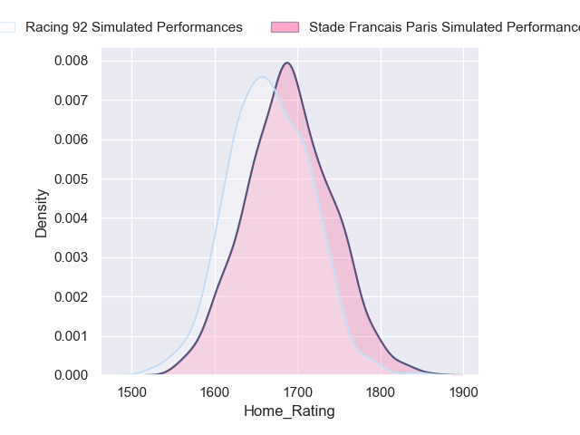
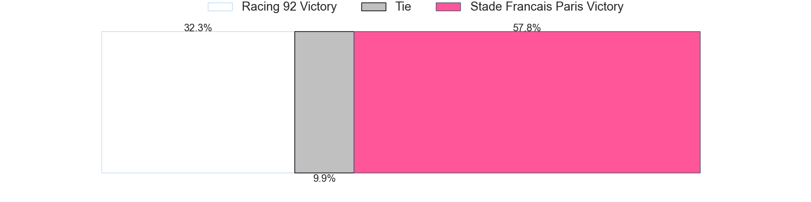
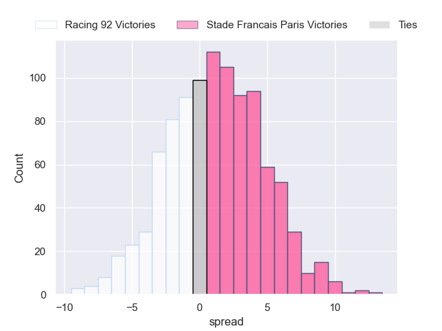

---  
title: "Top 14 Orange 2024 Status"  
date: 2024-11-11 6:00:00 -0500  
categories: model review projection  
layout: article  
aside:  
    toc: true  
---
# Current Team Rankings

# Standings

## Current Standings

| Club                 |   Played |   Wins |   Point Differential |   Losing Bonus Points |   Try Bonus Points |   Competition Points |
|:---------------------|---------:|-------:|---------------------:|----------------------:|-------------------:|---------------------:|
| Stade Toulousain     |        9 |      6 |                  123 |                     3 |                  3 |                   30 |
| Bordeaux Begles      |        9 |      6 |                   95 |                     2 |                  3 |                   29 |
| La Rochelle          |        9 |      6 |                   23 |                     0 |                  3 |                   27 |
| Bayonne              |        9 |      6 |                   24 |                     1 |                  1 |                   26 |
| Castres Olympique    |        9 |      5 |                   32 |                     2 |                  1 |                   23 |
| Toulon               |        9 |      5 |                   -8 |                     2 |                  1 |                   23 |
| Clermont Auvergne    |        9 |      5 |                  -31 |                     0 |                  3 |                   23 |
| Racing 92            |        9 |      5 |                   10 |                     2 |                  0 |                   22 |
| Perpignan            |        9 |      4 |                  -44 |                     1 |                  2 |                   19 |
| Lyon                 |        9 |      4 |                  -16 |                     1 |                  1 |                   18 |
| Montpellier Herault  |        9 |      3 |                   -3 |                     3 |                  0 |                   15 |
| Pau                  |        9 |      3 |                  -45 |                     1 |                  2 |                   15 |
| Stade Francais Paris |        9 |      3 |                  -67 |                     1 |                  1 |                   14 |
| Vannes               |        9 |      2 |                  -93 |                     3 |                  0 |                   11 |

## Projected Remaining Table

| Club                 |   Matches Remaining |   Wins |   Point Differential |   Losing Bonus Points |   Try Bonus Points |   Competition Points |
|:---------------------|--------------------:|-------:|---------------------:|----------------------:|-------------------:|---------------------:|
| Stade Toulousain     |                  17 |   12.6 |             104.174  |                   1.9 |                4.6 |                 57.1 |
| La Rochelle          |                  17 |   11.3 |              59.6661 |                   2.8 |                3.5 |                 51.5 |
| Bordeaux Begles      |                  17 |   11.2 |              51.8136 |                   2.9 |                3.2 |                 51.2 |
| Toulon               |                  17 |   10.3 |              34.8075 |                   3.5 |                2.7 |                 47.2 |
| Racing 92            |                  17 |    9.1 |              15.1734 |                   3.6 |                1.8 |                 42   |
| Clermont Auvergne    |                  17 |    8.2 |              -7.4044 |                   4   |                1.8 |                 38.5 |
| Castres Olympique    |                  17 |    7.9 |             -12.101  |                   4   |                1.5 |                 37.1 |
| Montpellier Herault  |                  17 |    7.9 |             -21.8357 |                   3.7 |                1.5 |                 36.6 |
| Bayonne              |                  17 |    7.9 |             -17.832  |                   3.8 |                1.2 |                 36.5 |
| Stade Francais Paris |                  17 |    7.7 |             -17.136  |                   4.2 |                1.5 |                 36.4 |
| Lyon                 |                  17 |    7.6 |             -14.668  |                   3.9 |                1.3 |                 35.7 |
| Pau                  |                  17 |    7   |             -30.8268 |                   4.1 |                1.4 |                 33.3 |
| Perpignan            |                  17 |    5.5 |             -58.0567 |                   4.4 |                0.9 |                 27.1 |
| Vannes               |                  17 |    4.9 |             -85.7741 |                   3.5 |                0.5 |                 23.5 |

## Projected Total Table

| Club                 |   Total Matches |   Wins |   Point Differential |   Losing Bonus Points |   Try Bonus Points |   Competition Points |
|:---------------------|----------------:|-------:|---------------------:|----------------------:|-------------------:|---------------------:|
| Stade Toulousain     |              26 |   18.6 |            227.174   |                   4.9 |                7.6 |                 87.1 |
| Bordeaux Begles      |              26 |   17.2 |            146.814   |                   4.9 |                6.2 |                 80.2 |
| La Rochelle          |              26 |   17.3 |             82.6661  |                   2.8 |                6.5 |                 78.5 |
| Toulon               |              26 |   15.3 |             26.8075  |                   5.5 |                3.7 |                 70.2 |
| Racing 92            |              26 |   14.1 |             25.1734  |                   5.6 |                1.8 |                 64   |
| Bayonne              |              26 |   13.9 |              6.16803 |                   4.8 |                2.2 |                 62.5 |
| Clermont Auvergne    |              26 |   13.2 |            -38.4044  |                   4   |                4.8 |                 61.5 |
| Castres Olympique    |              26 |   12.9 |             19.899   |                   6   |                2.5 |                 60.1 |
| Lyon                 |              26 |   11.6 |            -30.668   |                   4.9 |                2.3 |                 53.7 |
| Montpellier Herault  |              26 |   10.9 |            -24.8357  |                   6.7 |                1.5 |                 51.6 |
| Stade Francais Paris |              26 |   10.7 |            -84.136   |                   5.2 |                2.5 |                 50.4 |
| Pau                  |              26 |   10   |            -75.8268  |                   5.1 |                3.4 |                 48.3 |
| Perpignan            |              26 |    9.5 |           -102.057   |                   5.4 |                2.9 |                 46.1 |
| Vannes               |              26 |    6.9 |           -178.774   |                   6.5 |                0.5 |                 34.5 |

# Completed Match Review

| Model | Percent Correct Predictions | Spread Error |
| ------ | ------ | ------ |
| Club Level | 79.4% | 10.9 |
| Player Level: Lineup | 82.1% | 15.3 |
| Player Level: Minutes | 80.4% | 33.3 |

# Future Predictions

## Week 10

### Castres Olympique V La Rochelle on 2024/11/23

Average Margin: Castres Olympique by 0.4

Average Scoreline: 23-23

### Montpellier Herault V Pau on 2024/11/23

Average Margin: Montpellier Herault by 5.7

Average Scoreline: 25-19

### Stade Toulousain V Perpignan on 2024/11/23

Average Margin: Stade Toulousain by 14.2

Average Scoreline: 35-21

### Vannes V Bordeaux Begles on 2024/11/23

Average Margin: Vannes by 1.0

Average Scoreline: 25-24

### Lyon V Clermont Auvergne on 2024/11/23

Average Margin: Lyon by 3.0

Average Scoreline: 27-24

### Toulon V Bayonne on 2024/11/23

Average Margin: Toulon by 6.9

Average Scoreline: 29-22

### Stade Francais Paris V Racing 92 on 2024/11/24

Average Margin: Stade Francais Paris by 1.6

Average Scoreline: 27-26

## Week 11

### Bordeaux Begles V Montpellier Herault on 2024/11/30

Average Margin: Bordeaux Begles by 9.9

Average Scoreline: 34-24

### Perpignan V Toulon on 2024/11/30

Average Margin: Perpignan by 1.2

Average Scoreline: 25-24

### Racing 92 V Stade Toulousain on 2024/11/30

Average Margin: Racing 92 by 1.0

Average Scoreline: 29-28

### Bayonne V Stade Francais Paris on 2024/11/30

Average Margin: Bayonne by 3.8

Average Scoreline: 26-22

### Pau V Lyon on 2024/11/30

Average Margin: Pau by 2.7

Average Scoreline: 25-23

### La Rochelle V Vannes on 2024/11/30

Average Margin: La Rochelle by 14.9

Average Scoreline: 45-31

### Clermont Auvergne V Castres Olympique on 2024/11/30

Average Margin: Clermont Auvergne by 3.7

Average Scoreline: 24-21

## Week 12

### Toulon V Pau on 2024/12/21

Average Margin: Toulon by 8.1

Average Scoreline: 31-23

### Castres Olympique V Bordeaux Begles on 2024/12/21

Average Margin: Castres Olympique by 0.7

Average Scoreline: 29-28

### Montpellier Herault V Racing 92 on 2024/12/21

Average Margin: Montpellier Herault by 2.2

Average Scoreline: 29-27

### Lyon V Stade Toulousain on 2024/12/21

Average Margin: Lyon by 0.9

Average Scoreline: 29-28

### Vannes V Bayonne on 2024/12/21

Average Margin: Vannes by 0.3

Average Scoreline: 23-23

### Stade Francais Paris V Perpignan on 2024/12/21

Average Margin: Stade Francais Paris by 6.1

Average Scoreline: 30-24

### La Rochelle V Clermont Auvergne on 2024/12/21

Average Margin: La Rochelle by 9.2

Average Scoreline: 36-27

## Week 13

### Racing 92 V Lyon on 2024/12/28

Average Margin: Racing 92 by 5.4

Average Scoreline: 30-25

### Pau V Vannes on 2024/12/28

Average Margin: Pau by 8.8

Average Scoreline: 36-27

### Perpignan V La Rochelle on 2024/12/28

Average Margin: Perpignan by 0.6

Average Scoreline: 29-29

### Bayonne V Castres Olympique on 2024/12/28

Average Margin: Bayonne by 3.3

Average Scoreline: 24-21

### Clermont Auvergne V Montpellier Herault on 2024/12/28

Average Margin: Clermont Auvergne by 4.9

Average Scoreline: 30-25

### Stade Toulousain V Stade Francais Paris on 2024/12/28

Average Margin: Stade Toulousain by 12.9

Average Scoreline: 35-23

### Bordeaux Begles V Toulon on 2024/12/28

Average Margin: Bordeaux Begles by 5.3

Average Scoreline: 28-23

## Week 14

### Lyon V Perpignan on 2025/01/04

Average Margin: Lyon by 5.7

Average Scoreline: 27-21

### Castres Olympique V Pau on 2025/01/04

Average Margin: Castres Olympique by 5.8

Average Scoreline: 28-22

### Toulon V Racing 92 on 2025/01/04

Average Margin: Toulon by 5.0

Average Scoreline: 28-23

### Stade Francais Paris V Bordeaux Begles on 2025/01/04

Average Margin: Bordeaux Begles by 0.2

Average Scoreline: 27-27

### La Rochelle V Stade Toulousain on 2025/01/04

Average Margin: La Rochelle by 1.1

Average Scoreline: 29-28

### Montpellier Herault V Bayonne on 2025/01/04

Average Margin: Montpellier Herault by 3.6

Average Scoreline: 26-22

### Vannes V Clermont Auvergne on 2025/01/04

Average Margin: Vannes by 0.4

Average Scoreline: 28-28

## Week 15

### Bordeaux Begles V Lyon on 2025/01/25

Average Margin: Bordeaux Begles by 9.0

Average Scoreline: 33-24

### Vannes V Stade Francais Paris on 2025/01/25

Average Margin: Stade Francais Paris by 0.1

Average Scoreline: 27-27

### Pau V Clermont Auvergne on 2025/01/25

Average Margin: Pau by 2.0

Average Scoreline: 27-25

### Racing 92 V Castres Olympique on 2025/01/25

Average Margin: Racing 92 by 5.0

Average Scoreline: 28-23

### Toulon V La Rochelle on 2025/01/25

Average Margin: Toulon by 2.5

Average Scoreline: 28-25

### Perpignan V Bayonne on 2025/01/25

Average Margin: Perpignan by 1.5

Average Scoreline: 27-26

### Stade Toulousain V Montpellier Herault on 2025/01/25

Average Margin: Stade Toulousain by 11.5

Average Scoreline: 34-22

## Week 16

### Montpellier Herault V Toulon on 2025/02/15

Average Margin: Montpellier Herault by 0.9

Average Scoreline: 27-26

### Stade Francais Paris V Pau on 2025/02/15

Average Margin: Stade Francais Paris by 4.5

Average Scoreline: 29-25

### Bayonne V Bordeaux Begles on 2025/02/15

Average Margin: Bordeaux Begles by 0.1

Average Scoreline: 27-27

### Lyon V La Rochelle on 2025/02/15

Average Margin: Lyon by 0.3

Average Scoreline: 30-29

### Racing 92 V Vannes on 2025/02/15

Average Margin: Racing 92 by 10.8

Average Scoreline: 33-23

### Perpignan V Castres Olympique on 2025/02/15

Average Margin: Perpignan by 1.3

Average Scoreline: 30-28

### Clermont Auvergne V Stade Toulousain on 2025/02/15

Average Margin: Clermont Auvergne by 0.6

Average Scoreline: 30-29

## Week 17

### La Rochelle V Racing 92 on 2025/02/22

Average Margin: La Rochelle by 7.1

Average Scoreline: 35-28

### Pau V Perpignan on 2025/02/22

Average Margin: Pau by 4.8

Average Scoreline: 30-25

### Stade Toulousain V Bayonne on 2025/02/22

Average Margin: Stade Toulousain by 12.0

Average Scoreline: 36-24

### Vannes V Montpellier Herault on 2025/02/22

Average Margin: Montpellier Herault by 0.0

Average Scoreline: 28-28

### Toulon V Stade Francais Paris on 2025/02/22

Average Margin: Toulon by 7.2

Average Scoreline: 29-22

### Bordeaux Begles V Clermont Auvergne on 2025/02/22

Average Margin: Bordeaux Begles by 8.0

Average Scoreline: 30-22

### Castres Olympique V Lyon on 2025/02/22

Average Margin: Castres Olympique by 5.0

Average Scoreline: 29-24

## Week 18

### Stade Francais Paris V La Rochelle on 2025/03/01

Average Margin: Stade Francais Paris by 1.4

Average Scoreline: 31-30

### Bayonne V Clermont Auvergne on 2025/03/01

Average Margin: Bayonne by 2.3

Average Scoreline: 29-26

### Stade Toulousain V Vannes on 2025/03/01

Average Margin: Stade Toulousain by 15.5

Average Scoreline: 40-25

### Lyon V Toulon on 2025/03/01

Average Margin: Lyon by 1.3

Average Scoreline: 28-27

### Racing 92 V Pau on 2025/03/01

Average Margin: Racing 92 by 6.9

Average Scoreline: 31-24

### Perpignan V Bordeaux Begles on 2025/03/01

Average Margin: Perpignan by 0.4

Average Scoreline: 29-28

### Montpellier Herault V Castres Olympique on 2025/03/01

Average Margin: Montpellier Herault by 2.5

Average Scoreline: 30-27

## Week 19

### Bordeaux Begles V Stade Toulousain on 2025/03/22

Average Margin: Bordeaux Begles by 1.0

Average Scoreline: 29-28

### La Rochelle V Castres Olympique on 2025/03/22

Average Margin: La Rochelle by 8.1

Average Scoreline: 35-27

### Stade Francais Paris V Bayonne on 2025/03/22

Average Margin: Stade Francais Paris by 3.3

Average Scoreline: 27-24

### Clermont Auvergne V Racing 92 on 2025/03/22

Average Margin: Clermont Auvergne by 3.2

Average Scoreline: 30-27

### Toulon V Perpignan on 2025/03/22

Average Margin: Toulon by 9.7

Average Scoreline: 35-25

### Pau V Montpellier Herault on 2025/03/22

Average Margin: Pau by 2.8

Average Scoreline: 28-25

### Lyon V Vannes on 2025/03/22

Average Margin: Lyon by 8.8

Average Scoreline: 31-22

## Week 20

### Montpellier Herault V Stade Francais Paris on 2025/03/29

Average Margin: Montpellier Herault by 4.5

Average Scoreline: 30-25

### Racing 92 V Bordeaux Begles on 2025/03/29

Average Margin: Racing 92 by 0.4

Average Scoreline: 30-29

### Vannes V Perpignan on 2025/03/29

Average Margin: Vannes by 1.4

Average Scoreline: 28-27

### Castres Olympique V Toulon on 2025/03/29

Average Margin: Castres Olympique by 1.9

Average Scoreline: 29-27

### Bayonne V Lyon on 2025/03/29

Average Margin: Bayonne by 3.5

Average Scoreline: 26-22

### Stade Toulousain V Pau on 2025/03/29

Average Margin: Stade Toulousain by 12.4

Average Scoreline: 36-24

### Clermont Auvergne V La Rochelle on 2025/03/29

Average Margin: Clermont Auvergne by 0.7

Average Scoreline: 33-32

## Week 21

### Stade Francais Paris V Stade Toulousain on 2025/04/19

Average Margin: Stade Francais Paris by 0.4

Average Scoreline: 31-31

### Perpignan V Racing 92 on 2025/04/19

Average Margin: Perpignan by 0.7

Average Scoreline: 29-28

### La Rochelle V Bayonne on 2025/04/19

Average Margin: La Rochelle by 9.2

Average Scoreline: 37-28

### Castres Olympique V Vannes on 2025/04/19

Average Margin: Castres Olympique by 9.6

Average Scoreline: 31-22

### Lyon V Montpellier Herault on 2025/04/19

Average Margin: Lyon by 4.3

Average Scoreline: 31-27

### Toulon V Clermont Auvergne on 2025/04/19

Average Margin: Toulon by 6.1

Average Scoreline: 29-23

### Pau V Bordeaux Begles on 2025/04/19

Average Margin: Pau by 0.6

Average Scoreline: 31-30

## Week 22

### Bordeaux Begles V La Rochelle on 2025/04/26

Average Margin: Bordeaux Begles by 3.7

Average Scoreline: 33-29

### Vannes V Toulon on 2025/04/26

Average Margin: Vannes by 1.0

Average Scoreline: 29-28

### Racing 92 V Stade Francais Paris on 2025/04/26

Average Margin: Racing 92 by 5.7

Average Scoreline: 32-27

### Bayonne V Pau on 2025/04/26

Average Margin: Bayonne by 5.2

Average Scoreline: 26-21

### Montpellier Herault V Perpignan on 2025/04/26

Average Margin: Montpellier Herault by 5.6

Average Scoreline: 32-26

### Clermont Auvergne V Lyon on 2025/04/26

Average Margin: Clermont Auvergne by 4.9

Average Scoreline: 35-30

### Stade Toulousain V Castres Olympique on 2025/04/26

Average Margin: Stade Toulousain by 10.0

Average Scoreline: 36-26

## Week 23

### Montpellier Herault V Bordeaux Begles on 2025/05/10

Average Margin: Bordeaux Begles by 0.0

Average Scoreline: 29-29

### Lyon V Pau on 2025/05/10

Average Margin: Lyon by 5.0

Average Scoreline: 32-27

### Perpignan V Stade Francais Paris on 2025/05/10

Average Margin: Perpignan by 1.7

Average Scoreline: 31-29

### Racing 92 V Bayonne on 2025/05/10

Average Margin: Racing 92 by 5.8

Average Scoreline: 29-23

### Toulon V Stade Toulousain on 2025/05/10

Average Margin: Toulon by 1.1

Average Scoreline: 28-27

### Castres Olympique V Clermont Auvergne on 2025/05/10

Average Margin: Castres Olympique by 4.1

Average Scoreline: 29-25

### Vannes V La Rochelle on 2025/05/10

Average Margin: Vannes by 0.5

Average Scoreline: 32-31

## Week 24

### La Rochelle V Montpellier Herault on 2025/05/17

Average Margin: La Rochelle by 10.0

Average Scoreline: 38-28

### Pau V Toulon on 2025/05/17

Average Margin: Pau by 0.9

Average Scoreline: 26-25

### Stade Francais Paris V Lyon on 2025/05/17

Average Margin: Stade Francais Paris by 3.5

Average Scoreline: 34-30

### Clermont Auvergne V Perpignan on 2025/05/17

Average Margin: Clermont Auvergne by 7.3

Average Scoreline: 35-28

### Bayonne V Vannes on 2025/05/17

Average Margin: Bayonne by 9.4

Average Scoreline: 33-24

### Stade Toulousain V Racing 92 on 2025/05/17

Average Margin: Stade Toulousain by 10.1

Average Scoreline: 35-25

### Bordeaux Begles V Castres Olympique on 2025/05/17

Average Margin: Bordeaux Begles by 7.3

Average Scoreline: 30-22

## Week 25

### Stade Toulousain V Lyon on 2025/05/31

Average Margin: Stade Toulousain by 11.7

Average Scoreline: 39-27

### Toulon V Bordeaux Begles on 2025/05/31

Average Margin: Toulon by 2.4

Average Scoreline: 27-25

### Vannes V Pau on 2025/05/31

Average Margin: Vannes by 0.4

Average Scoreline: 30-29

### Racing 92 V Montpellier Herault on 2025/05/31

Average Margin: Racing 92 by 5.8

Average Scoreline: 30-25

### La Rochelle V Perpignan on 2025/05/31

Average Margin: La Rochelle by 10.8

Average Scoreline: 39-29

### Clermont Auvergne V Stade Francais Paris on 2025/05/31

Average Margin: Clermont Auvergne by 4.7

Average Scoreline: 33-28

### Castres Olympique V Bayonne on 2025/05/31

Average Margin: Castres Olympique by 4.5

Average Scoreline: 31-26

## Week 26

### Bayonne V Toulon on 2025/06/07

Average Margin: Bayonne by 1.7

Average Scoreline: 31-29

### Bordeaux Begles V Vannes on 2025/06/07

Average Margin: Bordeaux Begles by 13.0

Average Scoreline: 41-28

### Stade Francais Paris V Castres Olympique on 2025/06/07

Average Margin: Stade Francais Paris by 2.7

Average Scoreline: 31-28

### Pau V La Rochelle on 2025/06/07

Average Margin: Pau by 0.5

Average Scoreline: 30-30

### Montpellier Herault V Clermont Auvergne on 2025/06/07

Average Margin: Montpellier Herault by 2.5

Average Scoreline: 29-26

### Lyon V Racing 92 on 2025/06/07

Average Margin: Lyon by 1.8

Average Scoreline: 35-33

### Perpignan V Stade Toulousain on 2025/06/07

Average Margin: Perpignan by 0.1

Average Scoreline: 29-29

