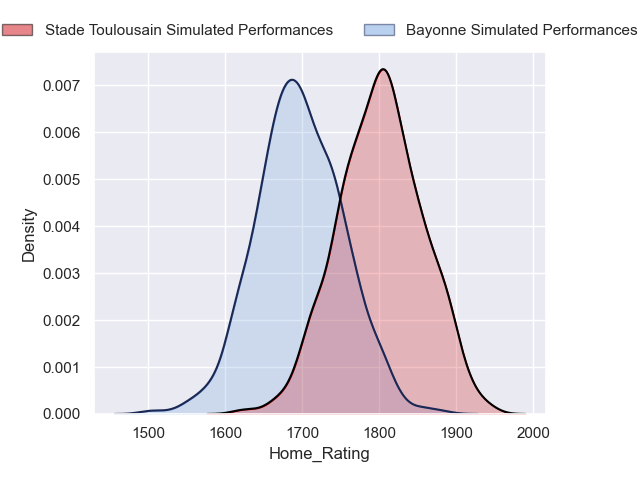
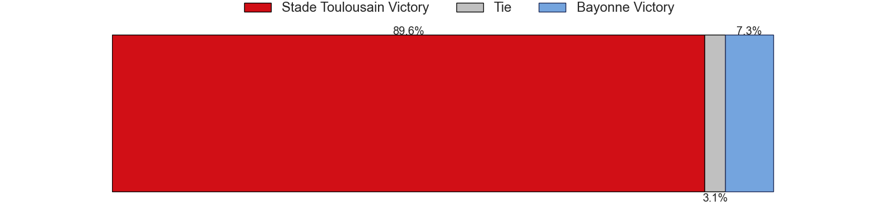
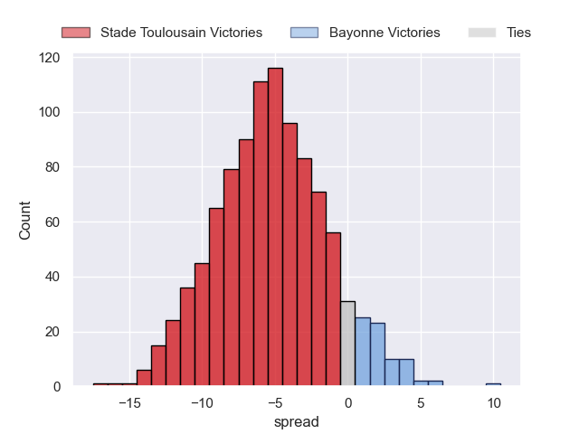

---  
title: "Top 14 Orange 2024 Status"  
date: 2024-11-01 6:00:00 -0500  
categories: model review projection  
layout: article  
aside:  
    toc: true  
---
# Current Team Rankings

# Standings

## Current Standings

| Club                 |   Played |   Wins |   Point Differential |   Losing Bonus Points |   Try Bonus Points |   Competition Points |
|:---------------------|---------:|-------:|---------------------:|----------------------:|-------------------:|---------------------:|
| Stade Toulousain     |        8 |      6 |                  127 |                     2 |                  3 |                   29 |
| Bordeaux Begles      |        8 |      6 |                  100 |                     1 |                  3 |                   28 |
| Bayonne              |        8 |      5 |                   20 |                     1 |                  1 |                   22 |
| La Rochelle          |        8 |      5 |                    6 |                     0 |                  2 |                   22 |
| Castres Olympique    |        8 |      4 |                   28 |                     2 |                  1 |                   19 |
| Toulon               |        8 |      4 |                  -19 |                     2 |                  1 |                   19 |
| Clermont Auvergne    |        8 |      4 |                  -36 |                     0 |                  3 |                   19 |
| Racing 92            |        8 |      4 |                    0 |                     2 |                  0 |                   18 |
| Lyon                 |        8 |      4 |                   -5 |                     1 |                  1 |                   18 |
| Pau                  |        8 |      3 |                  -35 |                     1 |                  2 |                   15 |
| Montpellier Herault  |        8 |      3 |                    1 |                     2 |                  0 |                   14 |
| Stade Francais Paris |        8 |      3 |                  -50 |                     1 |                  1 |                   14 |
| Perpignan            |        8 |      3 |                  -63 |                     1 |                  1 |                   14 |
| Vannes               |        8 |      2 |                  -74 |                     3 |                  0 |                   11 |

## Projected Remaining Table

| Club                 |   Matches Remaining |   Wins |   Point Differential |   Losing Bonus Points |   Try Bonus Points |   Competition Points |
|:---------------------|--------------------:|-------:|---------------------:|----------------------:|-------------------:|---------------------:|
| Stade Toulousain     |                  18 |   16.2 |           146.172    |                   1.6 |                5   |                 71.5 |
| Bordeaux Begles      |                  18 |   13.9 |            74.2557   |                   3.6 |                3.4 |                 62.7 |
| La Rochelle          |                  18 |   13.8 |            80.6917   |                   3.4 |                3.9 |                 62.5 |
| Toulon               |                  18 |   12   |            43.3693   |                   4.5 |                2.7 |                 55.3 |
| Racing 92            |                  18 |    9   |             0.211357 |                   5.2 |                1.9 |                 43.2 |
| Castres Olympique    |                  18 |    8.8 |            -6.05216  |                   5   |                1.5 |                 41.9 |
| Clermont Auvergne    |                  18 |    8   |           -15.2302   |                   5.7 |                1.9 |                 39.5 |
| Montpellier Herault  |                  18 |    8   |           -22.9706   |                   5.2 |                1.7 |                 38.8 |
| Pau                  |                  18 |    7.4 |           -23.0569   |                   5.9 |                1.6 |                 37.2 |
| Bayonne              |                  18 |    7.6 |           -24.7069   |                   5.3 |                0.8 |                 36.7 |
| Lyon                 |                  18 |    7.3 |           -25.7443   |                   5.5 |                1.4 |                 36.1 |
| Stade Francais Paris |                  18 |    7.1 |           -32.3409   |                   5.7 |                1.5 |                 35.4 |
| Perpignan            |                  18 |    4.2 |           -76.7674   |                   5.7 |                1   |                 23.4 |
| Vannes               |                  18 |    2.6 |          -117.831    |                   4.9 |                0.6 |                 15.8 |

## Projected Total Table

| Club                 |   Total Matches |   Wins |   Point Differential |   Losing Bonus Points |   Try Bonus Points |   Competition Points |
|:---------------------|----------------:|-------:|---------------------:|----------------------:|-------------------:|---------------------:|
| Stade Toulousain     |              26 |   22.2 |           273.172    |                   3.6 |                8   |                100.5 |
| Bordeaux Begles      |              26 |   19.9 |           174.256    |                   4.6 |                6.4 |                 90.7 |
| La Rochelle          |              26 |   18.8 |            86.6917   |                   3.4 |                5.9 |                 84.5 |
| Toulon               |              26 |   16   |            24.3693   |                   6.5 |                3.7 |                 74.3 |
| Racing 92            |              26 |   13   |             0.211357 |                   7.2 |                1.9 |                 61.2 |
| Castres Olympique    |              26 |   12.8 |            21.9478   |                   7   |                2.5 |                 60.9 |
| Bayonne              |              26 |   12.6 |            -4.70693  |                   6.3 |                1.8 |                 58.7 |
| Clermont Auvergne    |              26 |   12   |           -51.2302   |                   5.7 |                4.9 |                 58.5 |
| Lyon                 |              26 |   11.3 |           -30.7443   |                   6.5 |                2.4 |                 54.1 |
| Montpellier Herault  |              26 |   11   |           -21.9706   |                   7.2 |                1.7 |                 52.8 |
| Pau                  |              26 |   10.4 |           -58.0569   |                   6.9 |                3.6 |                 52.2 |
| Stade Francais Paris |              26 |   10.1 |           -82.3409   |                   6.7 |                2.5 |                 49.4 |
| Perpignan            |              26 |    7.2 |          -139.767    |                   6.7 |                2   |                 37.4 |
| Vannes               |              26 |    4.6 |          -191.831    |                   7.9 |                0.6 |                 26.8 |

# Completed Match Review

| Model | Percent Correct Predictions | Spread Error |
| ------ | ------ | ------ |
| Club Level | 80.4% | 11.4 |
| Player Level: Lineup | 78.6% | 11.2 |
| Player Level: Minutes | 100.0% | 9.6 |

# Future Predictions

## Week 9

### Clermont Auvergne V Bordeaux Begles on 2024/11/02

Average Margin: Bordeaux Begles by 1.1

Average Scoreline: 38-37

### Pau V Racing 92 on 2024/11/02

Average Margin: Pau by 1.7

Average Scoreline: 27-26

### Perpignan V Vannes on 2024/11/02

Average Margin: Perpignan by 5.9

Average Scoreline: 27-21

### La Rochelle V Stade Francais Paris on 2024/11/02

Average Margin: La Rochelle by 8.3

Average Scoreline: 32-23

### Toulon V Lyon on 2024/11/02

Average Margin: Toulon by 6.0

Average Scoreline: 27-21

### Castres Olympique V Montpellier Herault on 2024/11/02

Average Margin: Castres Olympique by 4.4

Average Scoreline: 26-22

### Bayonne V Stade Toulousain on 2024/11/03

Average Margin: Stade Toulousain by 5.2

Average Scoreline: 33-28

## Week 10

### Stade Toulousain V Perpignan on 2024/11/23

Average Margin: Stade Toulousain by 14.8

Average Scoreline: 35-21

### Montpellier Herault V Pau on 2024/11/23

Average Margin: Montpellier Herault by 3.9

Average Scoreline: 29-25

### Lyon V Clermont Auvergne on 2024/11/23

Average Margin: Lyon by 2.8

Average Scoreline: 33-30

### Toulon V Bayonne on 2024/11/23

Average Margin: Toulon by 6.3

Average Scoreline: 30-23

### Vannes V Bordeaux Begles on 2024/11/23

Average Margin: Bordeaux Begles by 6.8

Average Scoreline: 33-26

### Stade Francais Paris V Racing 92 on 2024/11/23

Average Margin: Stade Francais Paris by 1.8

Average Scoreline: 27-25

### Castres Olympique V La Rochelle on 2024/11/23

Average Margin: La Rochelle by 0.5

Average Scoreline: 31-31

## Week 11

### Bordeaux Begles V Montpellier Herault on 2024/11/30

Average Margin: Bordeaux Begles by 8.5

Average Scoreline: 33-24

### Clermont Auvergne V Castres Olympique on 2024/11/30

Average Margin: Clermont Auvergne by 2.9

Average Scoreline: 36-33

### Bayonne V Stade Francais Paris on 2024/11/30

Average Margin: Bayonne by 3.6

Average Scoreline: 31-27

### Racing 92 V Stade Toulousain on 2024/11/30

Average Margin: Stade Toulousain by 3.8

Average Scoreline: 38-35

### La Rochelle V Vannes on 2024/11/30

Average Margin: La Rochelle by 13.2

Average Scoreline: 36-23

### Perpignan V Toulon on 2024/11/30

Average Margin: Toulon by 2.4

Average Scoreline: 35-32

### Pau V Lyon on 2024/11/30

Average Margin: Pau by 2.7

Average Scoreline: 26-23

## Week 12

### Lyon V Stade Toulousain on 2024/12/21

Average Margin: Stade Toulousain by 4.8

Average Scoreline: 34-30

### Castres Olympique V Bordeaux Begles on 2024/12/21

Average Margin: Bordeaux Begles by 0.6

Average Scoreline: 30-29

### La Rochelle V Clermont Auvergne on 2024/12/21

Average Margin: La Rochelle by 7.4

Average Scoreline: 31-24

### Montpellier Herault V Racing 92 on 2024/12/21

Average Margin: Montpellier Herault by 1.9

Average Scoreline: 26-24

### Stade Francais Paris V Perpignan on 2024/12/21

Average Margin: Stade Francais Paris by 5.7

Average Scoreline: 28-22

### Vannes V Bayonne on 2024/12/21

Average Margin: Bayonne by 1.4

Average Scoreline: 32-30

### Toulon V Pau on 2024/12/21

Average Margin: Toulon by 6.9

Average Scoreline: 29-22

## Week 13

### Bordeaux Begles V Toulon on 2024/12/28

Average Margin: Bordeaux Begles by 5.6

Average Scoreline: 27-21

### Perpignan V La Rochelle on 2024/12/28

Average Margin: La Rochelle by 4.0

Average Scoreline: 38-34

### Clermont Auvergne V Montpellier Herault on 2024/12/28

Average Margin: Clermont Auvergne by 3.8

Average Scoreline: 27-24

### Stade Toulousain V Stade Francais Paris on 2024/12/28

Average Margin: Stade Toulousain by 12.2

Average Scoreline: 32-20

### Racing 92 V Lyon on 2024/12/28

Average Margin: Racing 92 by 4.5

Average Scoreline: 27-22

### Bayonne V Castres Olympique on 2024/12/28

Average Margin: Bayonne by 2.1

Average Scoreline: 28-26

### Pau V Vannes on 2024/12/28

Average Margin: Pau by 8.2

Average Scoreline: 31-23

## Week 14

### Montpellier Herault V Bayonne on 2025/01/04

Average Margin: Montpellier Herault by 3.3

Average Scoreline: 28-25

### Stade Francais Paris V Bordeaux Begles on 2025/01/04

Average Margin: Bordeaux Begles by 2.0

Average Scoreline: 39-37

### Vannes V Clermont Auvergne on 2025/01/04

Average Margin: Clermont Auvergne by 2.3

Average Scoreline: 35-33

### La Rochelle V Stade Toulousain on 2025/01/04

Average Margin: Stade Toulousain by 0.4

Average Scoreline: 30-30

### Lyon V Perpignan on 2025/01/04

Average Margin: Lyon by 6.2

Average Scoreline: 29-23

### Toulon V Racing 92 on 2025/01/04

Average Margin: Toulon by 5.1

Average Scoreline: 28-22

### Castres Olympique V Pau on 2025/01/04

Average Margin: Castres Olympique by 4.8

Average Scoreline: 28-23

## Week 15

### Toulon V La Rochelle on 2025/01/25

Average Margin: Toulon by 1.3

Average Scoreline: 31-29

### Vannes V Stade Francais Paris on 2025/01/25

Average Margin: Stade Francais Paris by 1.2

Average Scoreline: 34-33

### Racing 92 V Castres Olympique on 2025/01/25

Average Margin: Racing 92 by 3.7

Average Scoreline: 26-22

### Stade Toulousain V Montpellier Herault on 2025/01/25

Average Margin: Stade Toulousain by 11.8

Average Scoreline: 32-21

### Pau V Clermont Auvergne on 2025/01/25

Average Margin: Pau by 2.5

Average Scoreline: 27-25

### Bordeaux Begles V Lyon on 2025/01/25

Average Margin: Bordeaux Begles by 8.4

Average Scoreline: 30-22

### Perpignan V Bayonne on 2025/01/25

Average Margin: Perpignan by 0.8

Average Scoreline: 31-31

## Week 16

### Stade Francais Paris V Pau on 2025/02/15

Average Margin: Stade Francais Paris by 3.5

Average Scoreline: 29-25

### Bayonne V Bordeaux Begles on 2025/02/15

Average Margin: Bordeaux Begles by 1.8

Average Scoreline: 32-31

### Clermont Auvergne V Stade Toulousain on 2025/02/15

Average Margin: Stade Toulousain by 4.4

Average Scoreline: 37-33

### Perpignan V Castres Olympique on 2025/02/15

Average Margin: Castres Olympique by 0.4

Average Scoreline: 31-31

### Lyon V La Rochelle on 2025/02/15

Average Margin: La Rochelle by 1.5

Average Scoreline: 33-32

### Montpellier Herault V Toulon on 2025/02/15

Average Margin: Montpellier Herault by 0.4

Average Scoreline: 31-30

### Racing 92 V Vannes on 2025/02/15

Average Margin: Racing 92 by 9.8

Average Scoreline: 32-23

## Week 17

### Bordeaux Begles V Clermont Auvergne on 2025/02/22

Average Margin: Bordeaux Begles by 7.8

Average Scoreline: 31-23

### Castres Olympique V Lyon on 2025/02/22

Average Margin: Castres Olympique by 4.1

Average Scoreline: 25-21

### Stade Toulousain V Bayonne on 2025/02/22

Average Margin: Stade Toulousain by 11.9

Average Scoreline: 34-22

### Vannes V Montpellier Herault on 2025/02/22

Average Margin: Montpellier Herault by 1.7

Average Scoreline: 35-33

### La Rochelle V Racing 92 on 2025/02/22

Average Margin: La Rochelle by 6.9

Average Scoreline: 28-22

### Pau V Perpignan on 2025/02/22

Average Margin: Pau by 5.5

Average Scoreline: 27-21

### Toulon V Stade Francais Paris on 2025/02/22

Average Margin: Toulon by 6.5

Average Scoreline: 27-21

## Week 18

### Stade Toulousain V Vannes on 2025/03/01

Average Margin: Stade Toulousain by 16.8

Average Scoreline: 40-23

### Stade Francais Paris V La Rochelle on 2025/03/01

Average Margin: La Rochelle by 1.6

Average Scoreline: 37-36

### Perpignan V Bordeaux Begles on 2025/03/01

Average Margin: Bordeaux Begles by 4.5

Average Scoreline: 37-33

### Montpellier Herault V Castres Olympique on 2025/03/01

Average Margin: Montpellier Herault by 2.4

Average Scoreline: 31-29

### Bayonne V Clermont Auvergne on 2025/03/01

Average Margin: Bayonne by 2.8

Average Scoreline: 29-26

### Racing 92 V Pau on 2025/03/01

Average Margin: Racing 92 by 5.0

Average Scoreline: 28-23

### Lyon V Toulon on 2025/03/01

Average Margin: Lyon by 0.5

Average Scoreline: 30-29

## Week 19

### La Rochelle V Castres Olympique on 2025/03/22

Average Margin: La Rochelle by 7.1

Average Scoreline: 29-21

### Stade Francais Paris V Bayonne on 2025/03/22

Average Margin: Stade Francais Paris by 3.2

Average Scoreline: 28-25

### Lyon V Vannes on 2025/03/22

Average Margin: Lyon by 8.6

Average Scoreline: 32-23

### Clermont Auvergne V Racing 92 on 2025/03/22

Average Margin: Clermont Auvergne by 2.9

Average Scoreline: 30-27

### Toulon V Perpignan on 2025/03/22

Average Margin: Toulon by 8.8

Average Scoreline: 30-21

### Bordeaux Begles V Stade Toulousain on 2025/03/22

Average Margin: Stade Toulousain by 0.1

Average Scoreline: 32-32

### Pau V Montpellier Herault on 2025/03/22

Average Margin: Pau by 2.7

Average Scoreline: 27-24

## Week 20

### Stade Toulousain V Pau on 2025/03/29

Average Margin: Stade Toulousain by 12.2

Average Scoreline: 32-20

### Castres Olympique V Toulon on 2025/03/29

Average Margin: Castres Olympique by 1.6

Average Scoreline: 29-28

### Montpellier Herault V Stade Francais Paris on 2025/03/29

Average Margin: Montpellier Herault by 3.6

Average Scoreline: 29-26

### Clermont Auvergne V La Rochelle on 2025/03/29

Average Margin: La Rochelle by 0.8

Average Scoreline: 37-36

### Bayonne V Lyon on 2025/03/29

Average Margin: Bayonne by 3.0

Average Scoreline: 31-28

### Racing 92 V Bordeaux Begles on 2025/03/29

Average Margin: Bordeaux Begles by 0.5

Average Scoreline: 37-36

### Vannes V Perpignan on 2025/03/29

Average Margin: Vannes by 0.9

Average Scoreline: 26-25

## Week 21

### Pau V Bordeaux Begles on 2025/04/19

Average Margin: Bordeaux Begles by 2.2

Average Scoreline: 33-30

### La Rochelle V Bayonne on 2025/04/19

Average Margin: La Rochelle by 8.1

Average Scoreline: 31-23

### Stade Francais Paris V Stade Toulousain on 2025/04/19

Average Margin: Stade Toulousain by 5.2

Average Scoreline: 39-34

### Lyon V Montpellier Herault on 2025/04/19

Average Margin: Lyon by 3.4

Average Scoreline: 29-25

### Perpignan V Racing 92 on 2025/04/19

Average Margin: Racing 92 by 0.4

Average Scoreline: 30-30

### Castres Olympique V Vannes on 2025/04/19

Average Margin: Castres Olympique by 9.3

Average Scoreline: 32-23

### Toulon V Clermont Auvergne on 2025/04/19

Average Margin: Toulon by 5.6

Average Scoreline: 26-20

## Week 22

### Clermont Auvergne V Lyon on 2025/04/26

Average Margin: Clermont Auvergne by 3.6

Average Scoreline: 27-23

### Stade Toulousain V Castres Olympique on 2025/04/26

Average Margin: Stade Toulousain by 10.6

Average Scoreline: 32-22

### Bayonne V Pau on 2025/04/26

Average Margin: Bayonne by 3.6

Average Scoreline: 31-27

### Montpellier Herault V Perpignan on 2025/04/26

Average Margin: Montpellier Herault by 5.9

Average Scoreline: 29-23

### Bordeaux Begles V La Rochelle on 2025/04/26

Average Margin: Bordeaux Begles by 3.6

Average Scoreline: 28-24

### Vannes V Toulon on 2025/04/26

Average Margin: Toulon by 4.7

Average Scoreline: 39-34

### Racing 92 V Stade Francais Paris on 2025/04/26

Average Margin: Racing 92 by 4.8

Average Scoreline: 27-22

## Week 23

### Racing 92 V Bayonne on 2025/05/10

Average Margin: Racing 92 by 4.7

Average Scoreline: 27-22

### Castres Olympique V Clermont Auvergne on 2025/05/10

Average Margin: Castres Olympique by 3.8

Average Scoreline: 28-24

### Lyon V Pau on 2025/05/10

Average Margin: Lyon by 4.0

Average Scoreline: 26-22

### Vannes V La Rochelle on 2025/05/10

Average Margin: La Rochelle by 6.3

Average Scoreline: 35-29

### Perpignan V Stade Francais Paris on 2025/05/10

Average Margin: Perpignan by 0.9

Average Scoreline: 29-28

### Toulon V Stade Toulousain on 2025/05/10

Average Margin: Stade Toulousain by 2.3

Average Scoreline: 36-34

### Montpellier Herault V Bordeaux Begles on 2025/05/10

Average Margin: Bordeaux Begles by 1.6

Average Scoreline: 34-33

## Week 24

### Clermont Auvergne V Perpignan on 2025/05/17

Average Margin: Clermont Auvergne by 6.6

Average Scoreline: 28-21

### La Rochelle V Montpellier Herault on 2025/05/17

Average Margin: La Rochelle by 7.9

Average Scoreline: 31-23

### Stade Toulousain V Racing 92 on 2025/05/17

Average Margin: Stade Toulousain by 10.6

Average Scoreline: 34-23

### Bordeaux Begles V Castres Olympique on 2025/05/17

Average Margin: Bordeaux Begles by 7.3

Average Scoreline: 29-22

### Pau V Toulon on 2025/05/17

Average Margin: Toulon by 0.0

Average Scoreline: 28-28

### Stade Francais Paris V Lyon on 2025/05/17

Average Margin: Stade Francais Paris by 3.1

Average Scoreline: 26-23

### Bayonne V Vannes on 2025/05/17

Average Margin: Bayonne by 8.2

Average Scoreline: 32-23

## Week 25

### Clermont Auvergne V Stade Francais Paris on 2025/05/31

Average Margin: Clermont Auvergne by 4.3

Average Scoreline: 29-24

### Toulon V Bordeaux Begles on 2025/05/31

Average Margin: Toulon by 1.0

Average Scoreline: 27-26

### Stade Toulousain V Lyon on 2025/05/31

Average Margin: Stade Toulousain by 11.6

Average Scoreline: 33-21

### Castres Olympique V Bayonne on 2025/05/31

Average Margin: Castres Olympique by 4.7

Average Scoreline: 27-22

### La Rochelle V Perpignan on 2025/05/31

Average Margin: La Rochelle by 10.8

Average Scoreline: 34-23

### Racing 92 V Montpellier Herault on 2025/05/31

Average Margin: Racing 92 by 4.7

Average Scoreline: 27-22

### Vannes V Pau on 2025/05/31

Average Margin: Pau by 1.2

Average Scoreline: 29-28

## Week 26

### Perpignan V Stade Toulousain on 2025/06/07

Average Margin: Stade Toulousain by 7.6

Average Scoreline: 39-31

### Bordeaux Begles V Vannes on 2025/06/07

Average Margin: Bordeaux Begles by 13.2

Average Scoreline: 40-26

### Montpellier Herault V Clermont Auvergne on 2025/06/07

Average Margin: Montpellier Herault by 2.7

Average Scoreline: 24-21

### Bayonne V Toulon on 2025/06/07

Average Margin: Bayonne by 0.6

Average Scoreline: 31-31

### Pau V La Rochelle on 2025/06/07

Average Margin: La Rochelle by 1.6

Average Scoreline: 32-30

### Stade Francais Paris V Castres Olympique on 2025/06/07

Average Margin: Stade Francais Paris by 2.0

Average Scoreline: 25-23

### Lyon V Racing 92 on 2025/06/07

Average Margin: Lyon by 2.2

Average Scoreline: 25-22

