---  
title: "Top 14 Orange 2024 Status"  
date: 2024-09-19 6:00:00 -0500  
categories: model review projection  
layout: article  
aside:  
    toc: true  
---
# Current Team Rankings

# Standings

## Current Standings

| Club                 |   Played |   Wins |   Point Differential |   Losing Bonus Points |   Try Bonus Points |   Competition Points |
|:---------------------|---------:|-------:|---------------------:|----------------------:|-------------------:|---------------------:|
| Stade Toulousain     |        2 |      2 |                   33 |                     0 |                  1 |                    9 |
| Lyon                 |        2 |      2 |                    6 |                     0 |                  0 |                    8 |
| Pau                  |        1 |      1 |                   22 |                     0 |                  1 |                    5 |
| Bordeaux Begles      |        2 |      1 |                   18 |                     1 |                  0 |                    5 |
| Montpellier Herault  |        2 |      1 |                   15 |                     1 |                  0 |                    5 |
| Racing 92            |        2 |      1 |                   10 |                     1 |                  0 |                    5 |
| Castres Olympique    |        2 |      1 |                    1 |                     1 |                  0 |                    5 |
| Toulon               |        2 |      1 |                   -2 |                     1 |                  0 |                    5 |
| La Rochelle          |        2 |      1 |                   -4 |                     0 |                  0 |                    4 |
| Stade Francais Paris |        2 |      1 |                  -17 |                     0 |                  0 |                    4 |
| Vannes               |        2 |      0 |                  -28 |                     1 |                  0 |                    1 |
| Clermont Auvergne    |        1 |      0 |                  -13 |                     0 |                  0 |                    0 |
| Perpignan            |        1 |      0 |                  -19 |                     0 |                  0 |                    0 |
| Bayonne              |        1 |      0 |                  -22 |                     0 |                  0 |                    0 |

## Projected Remaining Table

| Club                 |   Matches Remaining |   Wins |   Point Differential |   Losing Bonus Points |   Try Bonus Points |   Competition Points |
|:---------------------|--------------------:|-------:|---------------------:|----------------------:|-------------------:|---------------------:|
| Stade Toulousain     |                  24 |   21.8 |            182.574   |                   2   |                6.2 |                 95.5 |
| La Rochelle          |                  24 |   19.1 |            118.001   |                   4.2 |                5.8 |                 86.4 |
| Bordeaux Begles      |                  24 |   17.4 |             85.939   |                   4.8 |                4.1 |                 78.4 |
| Toulon               |                  24 |   15.4 |             52.6101  |                   6.1 |                3.8 |                 71.5 |
| Racing 92            |                  24 |   12.8 |             11.2195  |                   6.7 |                2.6 |                 60.4 |
| Clermont Auvergne    |                  24 |   12.4 |              6.65255 |                   7   |                2.8 |                 59.2 |
| Lyon                 |                  24 |   12.4 |              5.32334 |                   6.7 |                2.5 |                 58.7 |
| Castres Olympique    |                  24 |   11.1 |            -14.8081  |                   7.2 |                2   |                 53.5 |
| Stade Francais Paris |                  24 |   10.9 |            -20.5183  |                   7.5 |                2   |                 53.1 |
| Montpellier Herault  |                  24 |   10.3 |            -25.8365  |                   7.2 |                2.3 |                 50.7 |
| Pau                  |                  24 |    9.9 |            -32.9839  |                   7.5 |                2.1 |                 49.2 |
| Bayonne              |                  24 |    6.6 |            -86.2686  |                   7.7 |                1.1 |                 35.2 |
| Perpignan            |                  24 |    5.4 |           -110.63    |                   7.1 |                1.2 |                 29.9 |
| Vannes               |                  24 |    2.6 |           -171.273   |                   6.4 |                0.7 |                 17.4 |

## Projected Total Table

| Club                 |   Total Matches |   Wins |   Point Differential |   Losing Bonus Points |   Try Bonus Points |   Competition Points |
|:---------------------|----------------:|-------:|---------------------:|----------------------:|-------------------:|---------------------:|
| Stade Toulousain     |              26 |   23.8 |            215.574   |                   2   |                7.2 |                104.5 |
| La Rochelle          |              26 |   20.1 |            114.001   |                   4.2 |                5.8 |                 90.4 |
| Bordeaux Begles      |              26 |   18.4 |            103.939   |                   5.8 |                4.1 |                 83.4 |
| Toulon               |              26 |   16.4 |             50.6101  |                   7.1 |                3.8 |                 76.5 |
| Lyon                 |              26 |   14.4 |             11.3233  |                   6.7 |                2.5 |                 66.7 |
| Racing 92            |              26 |   13.8 |             21.2195  |                   7.7 |                2.6 |                 65.4 |
| Clermont Auvergne    |              25 |   12.4 |             -6.34745 |                   7   |                2.8 |                 59.2 |
| Castres Olympique    |              26 |   12.1 |            -13.8081  |                   8.2 |                2   |                 58.5 |
| Stade Francais Paris |              26 |   11.9 |            -37.5183  |                   7.5 |                2   |                 57.1 |
| Montpellier Herault  |              26 |   11.3 |            -10.8365  |                   8.2 |                2.3 |                 55.7 |
| Pau                  |              25 |   10.9 |            -10.9839  |                   7.5 |                3.1 |                 54.2 |
| Bayonne              |              25 |    6.6 |           -108.269   |                   7.7 |                1.1 |                 35.2 |
| Perpignan            |              25 |    5.4 |           -129.63    |                   7.1 |                1.2 |                 29.9 |
| Vannes               |              26 |    2.6 |           -199.273   |                   7.4 |                0.7 |                 18.4 |

# Completed Match Review

| Model | Percent Correct Predictions | Spread Error |
| ------ | ------ | ------ |
| Club Level | 83.3% | 8.4 |
| Player Level: Lineup | 71.4% | 9.8 |
| Player Level: Minutes | 90.9% | 8.5 |

# Future Predictions

## Week 3

### Montpellier Herault V Stade Toulousain on 2024/09/21

Average Margin: Stade Toulousain by 4.7

Average Scoreline: 32-28

### Clermont Auvergne V Bayonne on 2024/09/21

Average Margin: Clermont Auvergne by 6.8

Average Scoreline: 26-20

### Castres Olympique V Perpignan on 2024/09/21

Average Margin: Castres Olympique by 6.7

Average Scoreline: 25-18

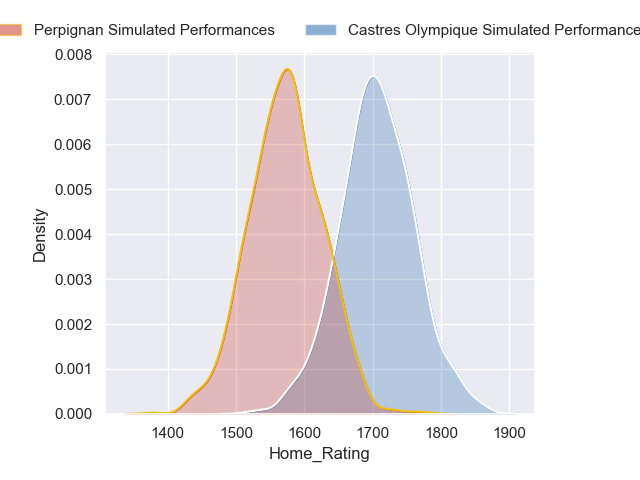
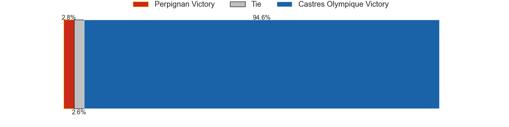
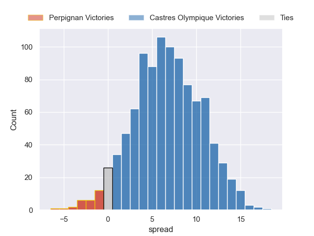

### La Rochelle V Pau on 2024/09/21

Average Margin: La Rochelle by 8.8

Average Scoreline: 31-23

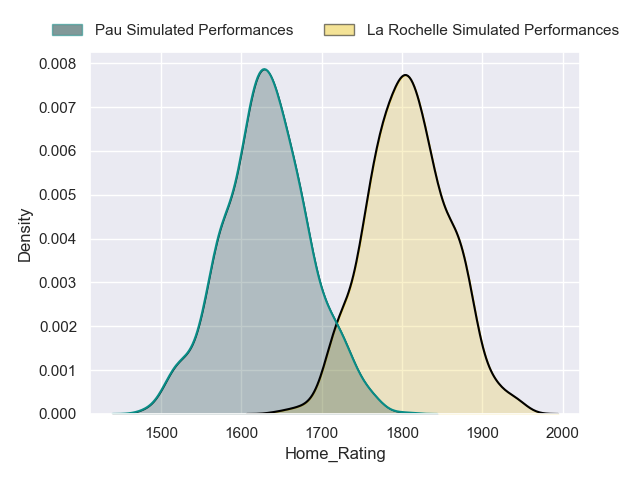
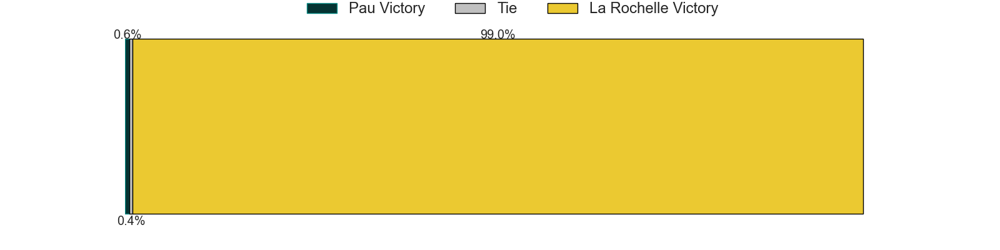
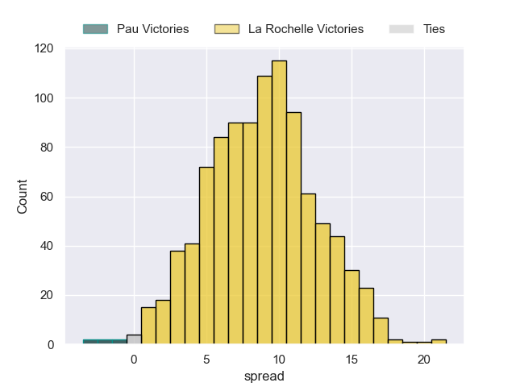

### Bordeaux Begles V Racing 92 on 2024/09/21

Average Margin: Bordeaux Begles by 6.3

Average Scoreline: 30-24

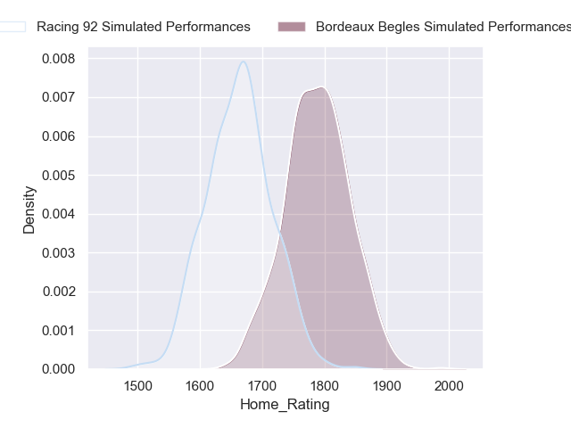
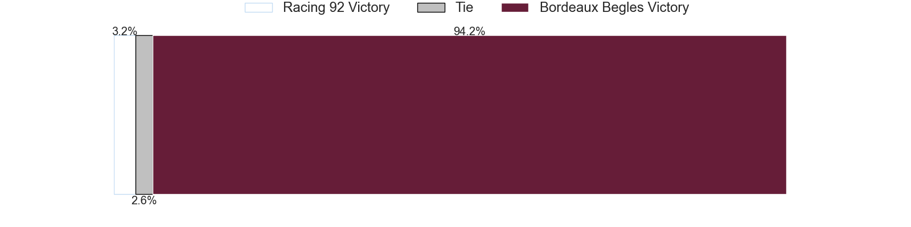
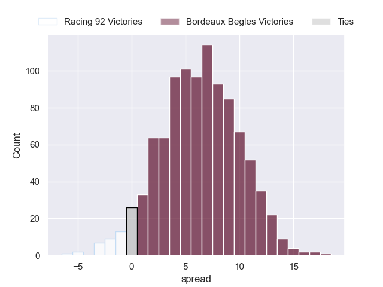

### Vannes V Lyon on 2024/09/21

Average Margin: Lyon by 3.6

Average Scoreline: 30-26

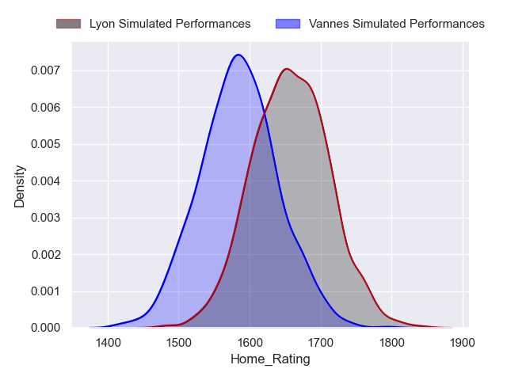
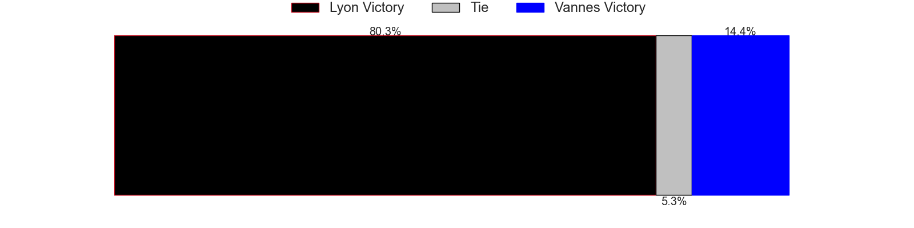
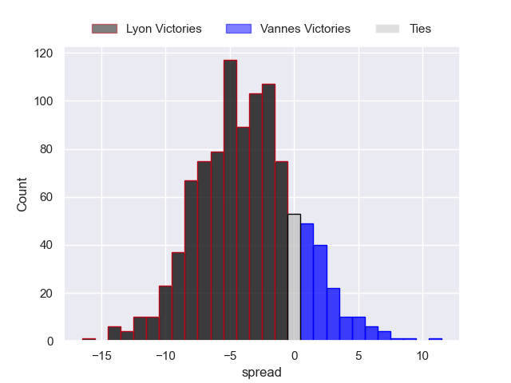

### Stade Francais Paris V Toulon on 2024/09/22

Average Margin: Stade Francais Paris by 0.8

Average Scoreline: 29-28

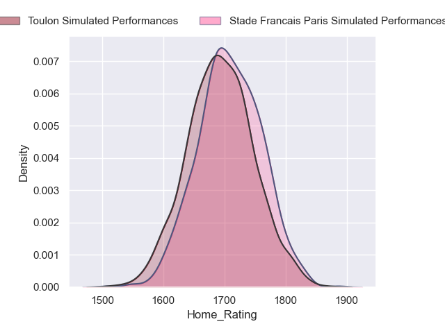
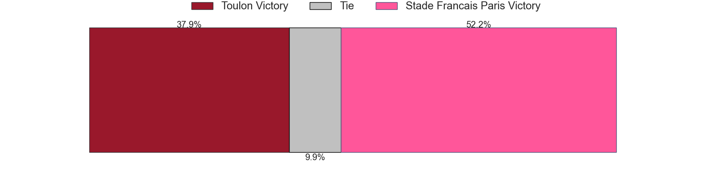
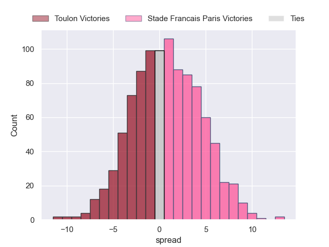

## Week 4

### Perpignan V Clermont Auvergne on 2024/09/28

Average Margin: Clermont Auvergne by 0.9

Average Scoreline: 32-31

### Bayonne V Montpellier Herault on 2024/09/28

Average Margin: Bayonne by 0.8

Average Scoreline: 30-30

### Pau V Stade Francais Paris on 2024/09/28

Average Margin: Pau by 2.7

Average Scoreline: 27-25

### Lyon V Castres Olympique on 2024/09/28

Average Margin: Lyon by 4.1

Average Scoreline: 25-21

### Toulon V Vannes on 2024/09/28

Average Margin: Toulon by 12.1

Average Scoreline: 35-23

### Racing 92 V La Rochelle on 2024/09/28

Average Margin: La Rochelle by 0.5

Average Scoreline: 32-32

### Stade Toulousain V Bordeaux Begles on 2024/09/29

Average Margin: Stade Toulousain by 7.2

Average Scoreline: 30-23

## Week 5

### Castres Olympique V Stade Toulousain on 2024/10/05

Average Margin: Stade Toulousain by 4.3

Average Scoreline: 33-29

### Vannes V Racing 92 on 2024/10/05

Average Margin: Racing 92 by 3.9

Average Scoreline: 30-27

### Stade Francais Paris V Montpellier Herault on 2024/10/05

Average Margin: Stade Francais Paris by 3.6

Average Scoreline: 25-22

### Perpignan V Pau on 2024/10/05

Average Margin: Perpignan by 0.5

Average Scoreline: 29-28

### La Rochelle V Lyon on 2024/10/05

Average Margin: La Rochelle by 7.6

Average Scoreline: 30-22

### Bordeaux Begles V Bayonne on 2024/10/05

Average Margin: Bordeaux Begles by 10.0

Average Scoreline: 33-23

### Clermont Auvergne V Toulon on 2024/10/06

Average Margin: Clermont Auvergne by 1.6

Average Scoreline: 30-29

## Week 6

### Stade Toulousain V Clermont Auvergne on 2024/10/12

Average Margin: Stade Toulousain by 10.3

Average Scoreline: 32-21

### Lyon V Stade Francais Paris on 2024/10/12

Average Margin: Lyon by 4.2

Average Scoreline: 28-24

### Bordeaux Begles V Perpignan on 2024/10/12

Average Margin: Bordeaux Begles by 10.9

Average Scoreline: 35-24

### Pau V Castres Olympique on 2024/10/12

Average Margin: Pau by 2.9

Average Scoreline: 27-24

### Montpellier Herault V Vannes on 2024/10/12

Average Margin: Montpellier Herault by 9.6

Average Scoreline: 28-19

### Racing 92 V Toulon on 2024/10/12

Average Margin: Racing 92 by 1.9

Average Scoreline: 29-27

### Bayonne V La Rochelle on 2024/10/12

Average Margin: La Rochelle by 4.1

Average Scoreline: 36-32

## Week 7

### Castres Olympique V Stade Francais Paris on 2024/10/19

Average Margin: Castres Olympique by 3.2

Average Scoreline: 24-21

### Pau V Stade Toulousain on 2024/10/19

Average Margin: Stade Toulousain by 5.1

Average Scoreline: 37-32

### La Rochelle V Bordeaux Begles on 2024/10/19

Average Margin: La Rochelle by 4.2

Average Scoreline: 30-25

### Toulon V Montpellier Herault on 2024/10/19

Average Margin: Toulon by 6.2

Average Scoreline: 27-20

### Clermont Auvergne V Vannes on 2024/10/19

Average Margin: Clermont Auvergne by 10.4

Average Scoreline: 31-21

### Bayonne V Racing 92 on 2024/10/19

Average Margin: Racing 92 by 0.3

Average Scoreline: 29-29

### Perpignan V Lyon on 2024/10/19

Average Margin: Lyon by 1.0

Average Scoreline: 27-26

## Week 8

### Vannes V Castres Olympique on 2024/10/26

Average Margin: Castres Olympique by 2.8

Average Scoreline: 31-28

### Montpellier Herault V La Rochelle on 2024/10/26

Average Margin: La Rochelle by 1.7

Average Scoreline: 33-32

### Racing 92 V Perpignan on 2024/10/26

Average Margin: Racing 92 by 7.9

Average Scoreline: 31-23

### Lyon V Bayonne on 2024/10/26

Average Margin: Lyon by 6.4

Average Scoreline: 26-20

### Stade Toulousain V Toulon on 2024/10/26

Average Margin: Stade Toulousain by 8.7

Average Scoreline: 29-21

### Bordeaux Begles V Pau on 2024/10/26

Average Margin: Bordeaux Begles by 7.8

Average Scoreline: 32-24

### Stade Francais Paris V Clermont Auvergne on 2024/10/26

Average Margin: Stade Francais Paris by 2.5

Average Scoreline: 28-25

## Week 9

### Perpignan V Vannes on 2024/11/02

Average Margin: Perpignan by 6.0

Average Scoreline: 26-20

### Clermont Auvergne V Bordeaux Begles on 2024/11/02

Average Margin: Clermont Auvergne by 0.3

Average Scoreline: 30-30

### Castres Olympique V Montpellier Herault on 2024/11/02

Average Margin: Castres Olympique by 3.5

Average Scoreline: 25-22

### Bayonne V Stade Toulousain on 2024/11/02

Average Margin: Stade Toulousain by 6.8

Average Scoreline: 38-31

### Pau V Racing 92 on 2024/11/02

Average Margin: Pau by 1.8

Average Scoreline: 28-26

### Toulon V Lyon on 2024/11/02

Average Margin: Toulon by 5.1

Average Scoreline: 25-20

### La Rochelle V Stade Francais Paris on 2024/11/02

Average Margin: La Rochelle by 8.2

Average Scoreline: 32-23

## Week 10

### Toulon V Bayonne on 2024/11/23

Average Margin: Toulon by 8.5

Average Scoreline: 31-23

### Montpellier Herault V Pau on 2024/11/23

Average Margin: Montpellier Herault by 3.7

Average Scoreline: 26-23

### Castres Olympique V La Rochelle on 2024/11/23

Average Margin: La Rochelle by 1.5

Average Scoreline: 32-30

### Lyon V Clermont Auvergne on 2024/11/23

Average Margin: Lyon by 3.2

Average Scoreline: 29-26

### Vannes V Bordeaux Begles on 2024/11/23

Average Margin: Bordeaux Begles by 6.7

Average Scoreline: 33-27

### Stade Toulousain V Perpignan on 2024/11/23

Average Margin: Stade Toulousain by 14.4

Average Scoreline: 36-22

### Stade Francais Paris V Racing 92 on 2024/11/23

Average Margin: Stade Francais Paris by 2.2

Average Scoreline: 29-27

## Week 11

### Bordeaux Begles V Montpellier Herault on 2024/11/30

Average Margin: Bordeaux Begles by 7.5

Average Scoreline: 31-23

### Bayonne V Stade Francais Paris on 2024/11/30

Average Margin: Bayonne by 0.9

Average Scoreline: 30-29

### Pau V Lyon on 2024/11/30

Average Margin: Pau by 2.0

Average Scoreline: 27-25

### La Rochelle V Vannes on 2024/11/30

Average Margin: La Rochelle by 14.6

Average Scoreline: 34-19

### Racing 92 V Stade Toulousain on 2024/11/30

Average Margin: Stade Toulousain by 3.4

Average Scoreline: 35-32

### Perpignan V Toulon on 2024/11/30

Average Margin: Toulon by 2.8

Average Scoreline: 32-29

### Clermont Auvergne V Castres Olympique on 2024/11/30

Average Margin: Clermont Auvergne by 4.4

Average Scoreline: 26-22

## Week 12

### Lyon V Stade Toulousain on 2024/12/21

Average Margin: Stade Toulousain by 3.7

Average Scoreline: 35-32

### Castres Olympique V Bordeaux Begles on 2024/12/21

Average Margin: Bordeaux Begles by 0.6

Average Scoreline: 31-30

### Montpellier Herault V Racing 92 on 2024/12/21

Average Margin: Montpellier Herault by 2.2

Average Scoreline: 29-27

### Toulon V Pau on 2024/12/21

Average Margin: Toulon by 6.4

Average Scoreline: 28-21

### Stade Francais Paris V Perpignan on 2024/12/21

Average Margin: Stade Francais Paris by 6.6

Average Scoreline: 28-21

### Vannes V Bayonne on 2024/12/21

Average Margin: Bayonne by 0.4

Average Scoreline: 28-27

### La Rochelle V Clermont Auvergne on 2024/12/21

Average Margin: La Rochelle by 7.3

Average Scoreline: 33-25

## Week 13

### Bordeaux Begles V Toulon on 2024/12/28

Average Margin: Bordeaux Begles by 4.8

Average Scoreline: 30-25

### Clermont Auvergne V Montpellier Herault on 2024/12/28

Average Margin: Clermont Auvergne by 4.4

Average Scoreline: 28-23

### Perpignan V La Rochelle on 2024/12/28

Average Margin: La Rochelle by 4.9

Average Scoreline: 39-34

### Racing 92 V Lyon on 2024/12/28

Average Margin: Racing 92 by 3.7

Average Scoreline: 28-25

### Bayonne V Castres Olympique on 2024/12/28

Average Margin: Bayonne by 0.9

Average Scoreline: 29-28

### Stade Toulousain V Stade Francais Paris on 2024/12/28

Average Margin: Stade Toulousain by 11.3

Average Scoreline: 32-21

### Pau V Vannes on 2024/12/28

Average Margin: Pau by 9.1

Average Scoreline: 27-18

## Week 14

### Montpellier Herault V Bayonne on 2025/01/04

Average Margin: Montpellier Herault by 5.6

Average Scoreline: 26-21

### Vannes V Clermont Auvergne on 2025/01/04

Average Margin: Clermont Auvergne by 3.8

Average Scoreline: 33-29

### Toulon V Racing 92 on 2025/01/04

Average Margin: Toulon by 4.8

Average Scoreline: 27-22

### Lyon V Perpignan on 2025/01/04

Average Margin: Lyon by 7.7

Average Scoreline: 30-22

### La Rochelle V Stade Toulousain on 2025/01/04

Average Margin: La Rochelle by 0.2

Average Scoreline: 33-33

### Stade Francais Paris V Bordeaux Begles on 2025/01/04

Average Margin: Bordeaux Begles by 0.6

Average Scoreline: 30-30

### Castres Olympique V Pau on 2025/01/04

Average Margin: Castres Olympique by 3.8

Average Scoreline: 25-22

## Week 15

### Bordeaux Begles V Lyon on 2025/01/25

Average Margin: Bordeaux Begles by 6.5

Average Scoreline: 30-23

### Stade Toulousain V Montpellier Herault on 2025/01/25

Average Margin: Stade Toulousain by 11.2

Average Scoreline: 34-23

### Vannes V Stade Francais Paris on 2025/01/25

Average Margin: Stade Francais Paris by 2.9

Average Scoreline: 33-30

### Racing 92 V Castres Olympique on 2025/01/25

Average Margin: Racing 92 by 4.4

Average Scoreline: 28-23

### Toulon V La Rochelle on 2025/01/25

Average Margin: Toulon by 1.0

Average Scoreline: 32-31

### Pau V Clermont Auvergne on 2025/01/25

Average Margin: Pau by 1.8

Average Scoreline: 28-26

### Perpignan V Bayonne on 2025/01/25

Average Margin: Perpignan by 2.3

Average Scoreline: 27-25

## Week 16

### Bayonne V Bordeaux Begles on 2025/02/15

Average Margin: Bordeaux Begles by 3.1

Average Scoreline: 35-31

### Lyon V La Rochelle on 2025/02/15

Average Margin: La Rochelle by 0.7

Average Scoreline: 33-33

### Montpellier Herault V Toulon on 2025/02/15

Average Margin: Montpellier Herault by 0.6

Average Scoreline: 32-31

### Racing 92 V Vannes on 2025/02/15

Average Margin: Racing 92 by 10.6

Average Scoreline: 32-21

### Clermont Auvergne V Stade Toulousain on 2025/02/15

Average Margin: Stade Toulousain by 3.4

Average Scoreline: 37-33

### Perpignan V Castres Olympique on 2025/02/15

Average Margin: Castres Olympique by 0.1

Average Scoreline: 30-29

### Stade Francais Paris V Pau on 2025/02/15

Average Margin: Stade Francais Paris by 3.9

Average Scoreline: 26-22

## Week 17

### La Rochelle V Racing 92 on 2025/02/22

Average Margin: La Rochelle by 7.1

Average Scoreline: 34-27

### Castres Olympique V Lyon on 2025/02/22

Average Margin: Castres Olympique by 2.8

Average Scoreline: 26-24

### Pau V Perpignan on 2025/02/22

Average Margin: Pau by 6.2

Average Scoreline: 27-21

### Stade Toulousain V Bayonne on 2025/02/22

Average Margin: Stade Toulousain by 13.6

Average Scoreline: 38-24

### Vannes V Montpellier Herault on 2025/02/22

Average Margin: Montpellier Herault by 2.6

Average Scoreline: 32-29

### Toulon V Stade Francais Paris on 2025/02/22

Average Margin: Toulon by 5.7

Average Scoreline: 28-22

### Bordeaux Begles V Clermont Auvergne on 2025/02/22

Average Margin: Bordeaux Begles by 6.5

Average Scoreline: 34-28

## Week 18

### Lyon V Toulon on 2025/03/01

Average Margin: Lyon by 1.7

Average Scoreline: 32-31

### Bayonne V Clermont Auvergne on 2025/03/01

Average Margin: Clermont Auvergne by 0.2

Average Scoreline: 32-32

### Montpellier Herault V Castres Olympique on 2025/03/01

Average Margin: Montpellier Herault by 3.1

Average Scoreline: 26-23

### Racing 92 V Pau on 2025/03/01

Average Margin: Racing 92 by 5.1

Average Scoreline: 29-24

### Stade Francais Paris V La Rochelle on 2025/03/01

Average Margin: La Rochelle by 1.6

Average Scoreline: 33-32

### Stade Toulousain V Vannes on 2025/03/01

Average Margin: Stade Toulousain by 17.3

Average Scoreline: 43-26

### Perpignan V Bordeaux Begles on 2025/03/01

Average Margin: Bordeaux Begles by 3.8

Average Scoreline: 35-31

## Week 19

### Clermont Auvergne V Racing 92 on 2025/03/22

Average Margin: Clermont Auvergne by 3.2

Average Scoreline: 31-28

### Stade Francais Paris V Bayonne on 2025/03/22

Average Margin: Stade Francais Paris by 5.8

Average Scoreline: 27-21

### La Rochelle V Castres Olympique on 2025/03/22

Average Margin: La Rochelle by 8.2

Average Scoreline: 33-25

### Pau V Montpellier Herault on 2025/03/22

Average Margin: Pau by 3.0

Average Scoreline: 26-23

### Toulon V Perpignan on 2025/03/22

Average Margin: Toulon by 9.2

Average Scoreline: 34-24

### Lyon V Vannes on 2025/03/22

Average Margin: Lyon by 10.2

Average Scoreline: 30-20

### Bordeaux Begles V Stade Toulousain on 2025/03/22

Average Margin: Stade Toulousain by 0.5

Average Scoreline: 36-36

## Week 20

### Racing 92 V Bordeaux Begles on 2025/03/29

Average Margin: Racing 92 by 0.7

Average Scoreline: 33-32

### Montpellier Herault V Stade Francais Paris on 2025/03/29

Average Margin: Montpellier Herault by 3.2

Average Scoreline: 26-23

### Castres Olympique V Toulon on 2025/03/29

Average Margin: Castres Olympique by 0.8

Average Scoreline: 31-30

### Bayonne V Lyon on 2025/03/29

Average Margin: Bayonne by 0.2

Average Scoreline: 28-28

### Stade Toulousain V Pau on 2025/03/29

Average Margin: Stade Toulousain by 11.5

Average Scoreline: 37-26

### Clermont Auvergne V La Rochelle on 2025/03/29

Average Margin: La Rochelle by 0.5

Average Scoreline: 33-33

### Vannes V Perpignan on 2025/03/29

Average Margin: Vannes by 0.8

Average Scoreline: 28-27

## Week 21

### Castres Olympique V Vannes on 2025/04/19

Average Margin: Castres Olympique by 9.5

Average Scoreline: 27-18

### Lyon V Montpellier Herault on 2025/04/19

Average Margin: Lyon by 4.5

Average Scoreline: 29-24

### La Rochelle V Bayonne on 2025/04/19

Average Margin: La Rochelle by 10.5

Average Scoreline: 33-22

### Perpignan V Racing 92 on 2025/04/19

Average Margin: Racing 92 by 1.2

Average Scoreline: 32-31

### Stade Francais Paris V Stade Toulousain on 2025/04/19

Average Margin: Stade Toulousain by 4.5

Average Scoreline: 39-35

### Pau V Bordeaux Begles on 2025/04/19

Average Margin: Bordeaux Begles by 1.0

Average Scoreline: 32-31

### Toulon V Clermont Auvergne on 2025/04/19

Average Margin: Toulon by 5.0

Average Scoreline: 25-20

## Week 22

### Bayonne V Pau on 2025/04/26

Average Margin: Bayonne by 1.2

Average Scoreline: 29-28

### Montpellier Herault V Perpignan on 2025/04/26

Average Margin: Montpellier Herault by 6.6

Average Scoreline: 30-23

### Bordeaux Begles V La Rochelle on 2025/04/26

Average Margin: Bordeaux Begles by 2.6

Average Scoreline: 35-33

### Stade Toulousain V Castres Olympique on 2025/04/26

Average Margin: Stade Toulousain by 10.9

Average Scoreline: 35-24

### Clermont Auvergne V Lyon on 2025/04/26

Average Margin: Clermont Auvergne by 3.6

Average Scoreline: 31-27

### Racing 92 V Stade Francais Paris on 2025/04/26

Average Margin: Racing 92 by 4.4

Average Scoreline: 30-25

### Vannes V Toulon on 2025/04/26

Average Margin: Toulon by 5.3

Average Scoreline: 34-28

## Week 23

### Lyon V Pau on 2025/05/10

Average Margin: Lyon by 4.5

Average Scoreline: 28-23

### Toulon V Stade Toulousain on 2025/05/10

Average Margin: Stade Toulousain by 1.8

Average Scoreline: 35-33

### Castres Olympique V Clermont Auvergne on 2025/05/10

Average Margin: Castres Olympique by 2.4

Average Scoreline: 28-26

### Vannes V La Rochelle on 2025/05/10

Average Margin: La Rochelle by 7.6

Average Scoreline: 38-30

### Racing 92 V Bayonne on 2025/05/10

Average Margin: Racing 92 by 6.8

Average Scoreline: 27-20

### Perpignan V Stade Francais Paris on 2025/05/10

Average Margin: Stade Francais Paris by 0.1

Average Scoreline: 31-31

### Montpellier Herault V Bordeaux Begles on 2025/05/10

Average Margin: Bordeaux Begles by 0.9

Average Scoreline: 31-30

## Week 24

### Bordeaux Begles V Castres Olympique on 2025/05/17

Average Margin: Bordeaux Begles by 7.3

Average Scoreline: 28-21

### La Rochelle V Montpellier Herault on 2025/05/17

Average Margin: La Rochelle by 8.2

Average Scoreline: 32-23

### Clermont Auvergne V Perpignan on 2025/05/17

Average Margin: Clermont Auvergne by 7.7

Average Scoreline: 31-24

### Bayonne V Vannes on 2025/05/17

Average Margin: Bayonne by 7.1

Average Scoreline: 28-21

### Pau V Toulon on 2025/05/17

Average Margin: Pau by 0.4

Average Scoreline: 31-31

### Stade Toulousain V Racing 92 on 2025/05/17

Average Margin: Stade Toulousain by 10.0

Average Scoreline: 36-26

### Stade Francais Paris V Lyon on 2025/05/17

Average Margin: Stade Francais Paris by 2.6

Average Scoreline: 32-29

## Week 25

### Castres Olympique V Bayonne on 2025/05/31

Average Margin: Castres Olympique by 5.8

Average Scoreline: 24-19

### Stade Toulousain V Lyon on 2025/05/31

Average Margin: Stade Toulousain by 10.3

Average Scoreline: 35-25

### La Rochelle V Perpignan on 2025/05/31

Average Margin: La Rochelle by 11.8

Average Scoreline: 35-23

### Racing 92 V Montpellier Herault on 2025/05/31

Average Margin: Racing 92 by 4.8

Average Scoreline: 28-23

### Vannes V Pau on 2025/05/31

Average Margin: Pau by 2.3

Average Scoreline: 32-29

### Toulon V Bordeaux Begles on 2025/05/31

Average Margin: Toulon by 1.8

Average Scoreline: 28-26

### Clermont Auvergne V Stade Francais Paris on 2025/05/31

Average Margin: Clermont Auvergne by 4.4

Average Scoreline: 30-26

## Week 26

### Perpignan V Stade Toulousain on 2025/06/07

Average Margin: Stade Toulousain by 7.8

Average Scoreline: 43-35

### Lyon V Racing 92 on 2025/06/07

Average Margin: Lyon by 2.9

Average Scoreline: 30-27

### Montpellier Herault V Clermont Auvergne on 2025/06/07

Average Margin: Montpellier Herault by 2.0

Average Scoreline: 29-26

### Pau V La Rochelle on 2025/06/07

Average Margin: La Rochelle by 1.9

Average Scoreline: 35-34

### Stade Francais Paris V Castres Olympique on 2025/06/07

Average Margin: Stade Francais Paris by 3.4

Average Scoreline: 26-23

### Bordeaux Begles V Vannes on 2025/06/07

Average Margin: Bordeaux Begles by 13.6

Average Scoreline: 39-26

### Bayonne V Toulon on 2025/06/07

Average Margin: Toulon by 1.4

Average Scoreline: 32-31

