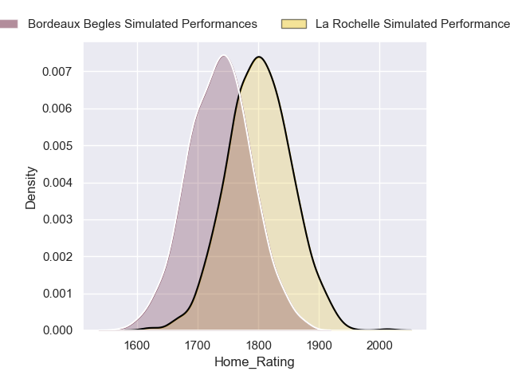
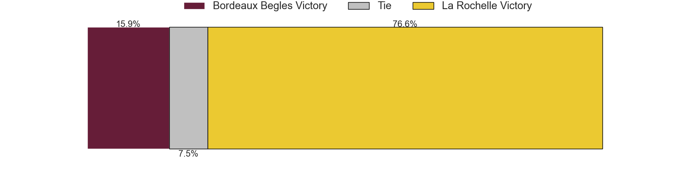
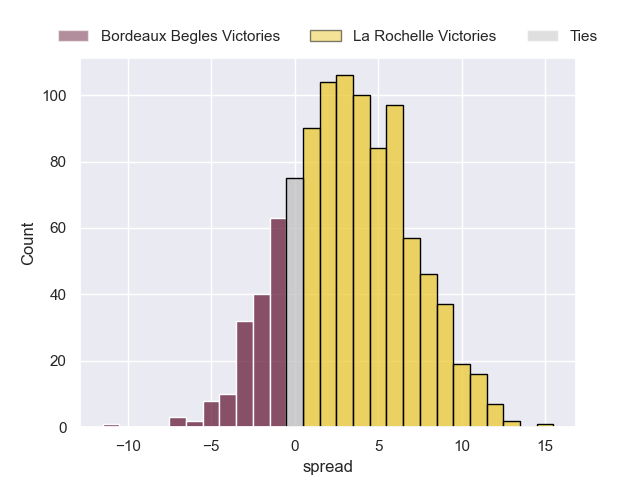

---  
title: "Top 14 Orange 2024 Status"  
date: 2024-10-14 6:00:00 -0500  
categories: model review projection  
layout: article  
aside:  
    toc: true  
---
# Current Team Rankings

# Standings

## Current Standings

| Club                 |   Played |   Wins |   Point Differential |   Losing Bonus Points |   Try Bonus Points |   Competition Points |
|:---------------------|---------:|-------:|---------------------:|----------------------:|-------------------:|---------------------:|
| Bordeaux Begles      |        6 |      5 |                   97 |                     1 |                  2 |                   23 |
| Stade Toulousain     |        6 |      4 |                   67 |                     2 |                  2 |                   20 |
| La Rochelle          |        6 |      4 |                   12 |                     0 |                  2 |                   18 |
| Lyon                 |        6 |      4 |                    9 |                     0 |                  1 |                   17 |
| Toulon               |        6 |      3 |                   20 |                     2 |                  1 |                   15 |
| Castres Olympique    |        6 |      3 |                   12 |                     2 |                  1 |                   15 |
| Pau                  |        6 |      3 |                  -14 |                     1 |                  2 |                   15 |
| Racing 92            |        6 |      3 |                   10 |                     2 |                  0 |                   14 |
| Bayonne              |        6 |      3 |                   -8 |                     1 |                  1 |                   14 |
| Clermont Auvergne    |        6 |      3 |                  -28 |                     0 |                  2 |                   14 |
| Montpellier Herault  |        6 |      2 |                   -2 |                     2 |                  0 |                   10 |
| Perpignan            |        6 |      2 |                  -59 |                     1 |                  1 |                   10 |
| Stade Francais Paris |        6 |      2 |                  -58 |                     1 |                  0 |                    9 |
| Vannes               |        6 |      1 |                  -58 |                     3 |                  0 |                    7 |

## Projected Remaining Table

| Club                 |   Matches Remaining |   Wins |   Point Differential |   Losing Bonus Points |   Try Bonus Points |   Competition Points |
|:---------------------|--------------------:|-------:|---------------------:|----------------------:|-------------------:|---------------------:|
| Stade Toulousain     |                  20 |   17.9 |            150.502   |                   1.9 |                5.6 |                 79   |
| La Rochelle          |                  20 |   15.7 |             92.87    |                   3.7 |                5.3 |                 71.6 |
| Bordeaux Begles      |                  20 |   15.4 |             80.3349  |                   3.9 |                4.2 |                 69.7 |
| Toulon               |                  20 |   13.6 |             48.6048  |                   4.5 |                3.5 |                 62.4 |
| Racing 92            |                  20 |   11   |             16.4025  |                   5.5 |                3   |                 52.5 |
| Castres Olympique    |                  20 |   10.2 |             -1.22127 |                   5.6 |                2.1 |                 48.5 |
| Clermont Auvergne    |                  20 |    9.7 |              0.74345 |                   6.3 |                2.2 |                 47.5 |
| Lyon                 |                  20 |    9.4 |             -6.77116 |                   6.1 |                2   |                 45.7 |
| Pau                  |                  20 |    7.7 |            -32.8391  |                   6.7 |                1.9 |                 39.2 |
| Montpellier Herault  |                  20 |    7.8 |            -40.4884  |                   5.9 |                1.7 |                 38.9 |
| Stade Francais Paris |                  20 |    7.7 |            -38.2008  |                   6.5 |                1.6 |                 38.8 |
| Bayonne              |                  20 |    6.8 |            -50.2628  |                   6.5 |                1.2 |                 35   |
| Perpignan            |                  20 |    4.5 |            -87.0754  |                   6.3 |                1.1 |                 25.3 |
| Vannes               |                  20 |    2.7 |           -132.599   |                   5.4 |                0.7 |                 16.9 |

## Projected Total Table

| Club                 |   Total Matches |   Wins |   Point Differential |   Losing Bonus Points |   Try Bonus Points |   Competition Points |
|:---------------------|----------------:|-------:|---------------------:|----------------------:|-------------------:|---------------------:|
| Stade Toulousain     |              26 |   21.9 |            217.502   |                   3.9 |                7.6 |                 99   |
| Bordeaux Begles      |              26 |   20.4 |            177.335   |                   4.9 |                6.2 |                 92.7 |
| La Rochelle          |              26 |   19.7 |            104.87    |                   3.7 |                7.3 |                 89.6 |
| Toulon               |              26 |   16.6 |             68.6048  |                   6.5 |                4.5 |                 77.4 |
| Racing 92            |              26 |   14   |             26.4025  |                   7.5 |                3   |                 66.5 |
| Castres Olympique    |              26 |   13.2 |             10.7787  |                   7.6 |                3.1 |                 63.5 |
| Lyon                 |              26 |   13.4 |              2.22884 |                   6.1 |                3   |                 62.7 |
| Clermont Auvergne    |              26 |   12.7 |            -27.2566  |                   6.3 |                4.2 |                 61.5 |
| Pau                  |              26 |   10.7 |            -46.8391  |                   7.7 |                3.9 |                 54.2 |
| Bayonne              |              26 |    9.8 |            -58.2628  |                   7.5 |                2.2 |                 49   |
| Montpellier Herault  |              26 |    9.8 |            -42.4884  |                   7.9 |                1.7 |                 48.9 |
| Stade Francais Paris |              26 |    9.7 |            -96.2008  |                   7.5 |                1.6 |                 47.8 |
| Perpignan            |              26 |    6.5 |           -146.075   |                   7.3 |                2.1 |                 35.3 |
| Vannes               |              26 |    3.7 |           -190.599   |                   8.4 |                0.7 |                 23.9 |

# Completed Match Review

| Model | Percent Correct Predictions | Spread Error |
| ------ | ------ | ------ |
| Club Level | 81.0% | 11.0 |
| Player Level: Lineup | 85.7% | 11.0 |
| Player Level: Minutes | 100.0% | 9.5 |

# Future Predictions

## Week 7

### Pau V Stade Toulousain on 2024/10/19

Average Margin: Stade Toulousain by 4.9

Average Scoreline: 34-29

### Bayonne V Racing 92 on 2024/10/19

Average Margin: Bayonne by 0.4

Average Scoreline: 29-29

### Clermont Auvergne V Vannes on 2024/10/19

Average Margin: Clermont Auvergne by 9.9

Average Scoreline: 25-15

### Castres Olympique V Stade Francais Paris on 2024/10/19

Average Margin: Castres Olympique by 4.8

Average Scoreline: 22-18

### Toulon V Montpellier Herault on 2024/10/19

Average Margin: Toulon by 6.9

Average Scoreline: 27-20

### Perpignan V Lyon on 2024/10/19

Average Margin: Lyon by 0.5

Average Scoreline: 26-26

### La Rochelle V Bordeaux Begles on 2024/10/20

Average Margin: La Rochelle by 3.2

Average Scoreline: 28-25

## Week 8

### Lyon V Bayonne on 2024/10/26

Average Margin: Lyon by 5.4

Average Scoreline: 25-20

### Racing 92 V Perpignan on 2024/10/26

Average Margin: Racing 92 by 7.6

Average Scoreline: 26-19

### Bordeaux Begles V Pau on 2024/10/26

Average Margin: Bordeaux Begles by 8.5

Average Scoreline: 26-18

### Stade Toulousain V Toulon on 2024/10/26

Average Margin: Stade Toulousain by 8.1

Average Scoreline: 27-19

### Stade Francais Paris V Clermont Auvergne on 2024/10/26

Average Margin: Stade Francais Paris by 1.9

Average Scoreline: 32-30

### Vannes V Castres Olympique on 2024/10/26

Average Margin: Castres Olympique by 2.7

Average Scoreline: 31-28

### Montpellier Herault V La Rochelle on 2024/10/26

Average Margin: La Rochelle by 2.1

Average Scoreline: 34-32

## Week 9

### Clermont Auvergne V Bordeaux Begles on 2024/11/02

Average Margin: Bordeaux Begles by 0.8

Average Scoreline: 25-25

### Bayonne V Stade Toulousain on 2024/11/02

Average Margin: Stade Toulousain by 5.8

Average Scoreline: 36-30

### Castres Olympique V Montpellier Herault on 2024/11/02

Average Margin: Castres Olympique by 4.6

Average Scoreline: 23-19

### Toulon V Lyon on 2024/11/02

Average Margin: Toulon by 5.8

Average Scoreline: 26-20

### Pau V Racing 92 on 2024/11/02

Average Margin: Pau by 1.5

Average Scoreline: 27-25

### Perpignan V Vannes on 2024/11/02

Average Margin: Perpignan by 5.8

Average Scoreline: 20-14

### La Rochelle V Stade Francais Paris on 2024/11/02

Average Margin: La Rochelle by 9.0

Average Scoreline: 27-18

## Week 10

### Vannes V Bordeaux Begles on 2024/11/23

Average Margin: Bordeaux Begles by 7.0

Average Scoreline: 39-32

### Stade Francais Paris V Racing 92 on 2024/11/23

Average Margin: Stade Francais Paris by 1.0

Average Scoreline: 29-28

### Stade Toulousain V Perpignan on 2024/11/23

Average Margin: Stade Toulousain by 14.1

Average Scoreline: 33-19

### Toulon V Bayonne on 2024/11/23

Average Margin: Toulon by 7.9

Average Scoreline: 25-17

### Castres Olympique V La Rochelle on 2024/11/23

Average Margin: La Rochelle by 0.7

Average Scoreline: 25-24

### Montpellier Herault V Pau on 2024/11/23

Average Margin: Montpellier Herault by 3.1

Average Scoreline: 22-19

### Lyon V Clermont Auvergne on 2024/11/23

Average Margin: Lyon by 3.3

Average Scoreline: 27-24

## Week 11

### Racing 92 V Stade Toulousain on 2024/11/30

Average Margin: Stade Toulousain by 2.9

Average Scoreline: 32-29

### La Rochelle V Vannes on 2024/11/30

Average Margin: La Rochelle by 13.8

Average Scoreline: 33-19

### Clermont Auvergne V Castres Olympique on 2024/11/30

Average Margin: Clermont Auvergne by 3.7

Average Scoreline: 23-19

### Pau V Lyon on 2024/11/30

Average Margin: Pau by 2.5

Average Scoreline: 24-22

### Perpignan V Toulon on 2024/11/30

Average Margin: Toulon by 2.7

Average Scoreline: 29-26

### Bordeaux Begles V Montpellier Herault on 2024/11/30

Average Margin: Bordeaux Begles by 8.8

Average Scoreline: 27-19

### Bayonne V Stade Francais Paris on 2024/11/30

Average Margin: Bayonne by 2.5

Average Scoreline: 23-21

## Week 12

### Stade Francais Paris V Perpignan on 2024/12/21

Average Margin: Stade Francais Paris by 5.7

Average Scoreline: 22-16

### Vannes V Bayonne on 2024/12/21

Average Margin: Bayonne by 0.6

Average Scoreline: 29-28

### Montpellier Herault V Racing 92 on 2024/12/21

Average Margin: Montpellier Herault by 1.2

Average Scoreline: 32-31

### Castres Olympique V Bordeaux Begles on 2024/12/21

Average Margin: Bordeaux Begles by 0.9

Average Scoreline: 27-26

### Toulon V Pau on 2024/12/21

Average Margin: Toulon by 6.6

Average Scoreline: 25-18

### La Rochelle V Clermont Auvergne on 2024/12/21

Average Margin: La Rochelle by 7.3

Average Scoreline: 27-20

### Lyon V Stade Toulousain on 2024/12/21

Average Margin: Stade Toulousain by 3.8

Average Scoreline: 34-30

## Week 13

### Bayonne V Castres Olympique on 2024/12/28

Average Margin: Bayonne by 1.3

Average Scoreline: 30-29

### Pau V Vannes on 2024/12/28

Average Margin: Pau by 8.2

Average Scoreline: 25-16

### Stade Toulousain V Stade Francais Paris on 2024/12/28

Average Margin: Stade Toulousain by 11.8

Average Scoreline: 30-19

### Racing 92 V Lyon on 2024/12/28

Average Margin: Racing 92 by 4.1

Average Scoreline: 28-24

### Bordeaux Begles V Toulon on 2024/12/28

Average Margin: Bordeaux Begles by 5.2

Average Scoreline: 25-20

### Perpignan V La Rochelle on 2024/12/28

Average Margin: La Rochelle by 4.5

Average Scoreline: 39-35

### Clermont Auvergne V Montpellier Herault on 2024/12/28

Average Margin: Clermont Auvergne by 4.8

Average Scoreline: 24-19

## Week 14

### Vannes V Clermont Auvergne on 2025/01/04

Average Margin: Clermont Auvergne by 2.9

Average Scoreline: 36-33

### Montpellier Herault V Bayonne on 2025/01/04

Average Margin: Montpellier Herault by 4.2

Average Scoreline: 23-19

### Toulon V Racing 92 on 2025/01/04

Average Margin: Toulon by 4.8

Average Scoreline: 25-20

### Stade Francais Paris V Bordeaux Begles on 2025/01/04

Average Margin: Bordeaux Begles by 2.2

Average Scoreline: 33-31

### La Rochelle V Stade Toulousain on 2025/01/04

Average Margin: La Rochelle by 0.6

Average Scoreline: 30-29

### Castres Olympique V Pau on 2025/01/04

Average Margin: Castres Olympique by 4.3

Average Scoreline: 22-18

### Lyon V Perpignan on 2025/01/04

Average Margin: Lyon by 7.1

Average Scoreline: 27-20

## Week 15

### Racing 92 V Castres Olympique on 2025/01/25

Average Margin: Racing 92 by 4.1

Average Scoreline: 26-22

### Vannes V Stade Francais Paris on 2025/01/25

Average Margin: Stade Francais Paris by 1.5

Average Scoreline: 33-31

### Stade Toulousain V Montpellier Herault on 2025/01/25

Average Margin: Stade Toulousain by 11.8

Average Scoreline: 31-19

### Perpignan V Bayonne on 2025/01/25

Average Margin: Perpignan by 1.9

Average Scoreline: 27-25

### Pau V Clermont Auvergne on 2025/01/25

Average Margin: Pau by 2.0

Average Scoreline: 26-24

### Bordeaux Begles V Lyon on 2025/01/25

Average Margin: Bordeaux Begles by 7.4

Average Scoreline: 28-21

### Toulon V La Rochelle on 2025/01/25

Average Margin: Toulon by 1.3

Average Scoreline: 29-27

## Week 16

### Lyon V La Rochelle on 2025/02/15

Average Margin: La Rochelle by 0.9

Average Scoreline: 30-29

### Stade Francais Paris V Pau on 2025/02/15

Average Margin: Stade Francais Paris by 3.2

Average Scoreline: 29-26

### Racing 92 V Vannes on 2025/02/15

Average Margin: Racing 92 by 10.2

Average Scoreline: 31-21

### Montpellier Herault V Toulon on 2025/02/15

Average Margin: Toulon by 0.2

Average Scoreline: 33-33

### Perpignan V Castres Olympique on 2025/02/15

Average Margin: Castres Olympique by 0.3

Average Scoreline: 34-34

### Bayonne V Bordeaux Begles on 2025/02/15

Average Margin: Bordeaux Begles by 3.1

Average Scoreline: 37-33

### Clermont Auvergne V Stade Toulousain on 2025/02/15

Average Margin: Stade Toulousain by 3.3

Average Scoreline: 33-30

## Week 17

### Toulon V Stade Francais Paris on 2025/02/22

Average Margin: Toulon by 7.0

Average Scoreline: 25-18

### Vannes V Montpellier Herault on 2025/02/22

Average Margin: Montpellier Herault by 1.5

Average Scoreline: 33-31

### Pau V Perpignan on 2025/02/22

Average Margin: Pau by 5.8

Average Scoreline: 25-19

### La Rochelle V Racing 92 on 2025/02/22

Average Margin: La Rochelle by 6.7

Average Scoreline: 28-21

### Stade Toulousain V Bayonne on 2025/02/22

Average Margin: Stade Toulousain by 12.5

Average Scoreline: 32-19

### Castres Olympique V Lyon on 2025/02/22

Average Margin: Castres Olympique by 3.2

Average Scoreline: 25-22

### Bordeaux Begles V Clermont Auvergne on 2025/02/22

Average Margin: Bordeaux Begles by 7.6

Average Scoreline: 28-20

## Week 18

### Perpignan V Bordeaux Begles on 2025/03/01

Average Margin: Bordeaux Begles by 4.6

Average Scoreline: 37-32

### Racing 92 V Pau on 2025/03/01

Average Margin: Racing 92 by 5.3

Average Scoreline: 27-21

### Bayonne V Clermont Auvergne on 2025/03/01

Average Margin: Bayonne by 1.2

Average Scoreline: 31-30

### Montpellier Herault V Castres Olympique on 2025/03/01

Average Margin: Montpellier Herault by 2.1

Average Scoreline: 30-28

### Stade Francais Paris V La Rochelle on 2025/03/01

Average Margin: La Rochelle by 2.2

Average Scoreline: 33-31

### Stade Toulousain V Vannes on 2025/03/01

Average Margin: Stade Toulousain by 16.4

Average Scoreline: 38-21

### Lyon V Toulon on 2025/03/01

Average Margin: Lyon by 1.1

Average Scoreline: 30-29

## Week 19

### Stade Francais Paris V Bayonne on 2025/03/22

Average Margin: Stade Francais Paris by 4.2

Average Scoreline: 23-19

### La Rochelle V Castres Olympique on 2025/03/22

Average Margin: La Rochelle by 7.4

Average Scoreline: 29-22

### Bordeaux Begles V Stade Toulousain on 2025/03/22

Average Margin: Bordeaux Begles by 0.4

Average Scoreline: 30-30

### Pau V Montpellier Herault on 2025/03/22

Average Margin: Pau by 3.7

Average Scoreline: 27-23

### Clermont Auvergne V Racing 92 on 2025/03/22

Average Margin: Clermont Auvergne by 2.7

Average Scoreline: 31-28

### Toulon V Perpignan on 2025/03/22

Average Margin: Toulon by 9.2

Average Scoreline: 29-20

### Lyon V Vannes on 2025/03/22

Average Margin: Lyon by 9.3

Average Scoreline: 29-20

## Week 20

### Clermont Auvergne V La Rochelle on 2025/03/29

Average Margin: La Rochelle by 0.7

Average Scoreline: 29-28

### Bayonne V Lyon on 2025/03/29

Average Margin: Bayonne by 1.4

Average Scoreline: 28-26

### Castres Olympique V Toulon on 2025/03/29

Average Margin: Castres Olympique by 0.9

Average Scoreline: 29-28

### Montpellier Herault V Stade Francais Paris on 2025/03/29

Average Margin: Montpellier Herault by 3.5

Average Scoreline: 25-22

### Racing 92 V Bordeaux Begles on 2025/03/29

Average Margin: Bordeaux Begles by 0.2

Average Scoreline: 30-29

### Vannes V Perpignan on 2025/03/29

Average Margin: Vannes by 1.0

Average Scoreline: 30-29

### Stade Toulousain V Pau on 2025/03/29

Average Margin: Stade Toulousain by 11.6

Average Scoreline: 32-20

## Week 21

### Perpignan V Racing 92 on 2025/04/19

Average Margin: Racing 92 by 1.1

Average Scoreline: 32-31

### La Rochelle V Bayonne on 2025/04/19

Average Margin: La Rochelle by 9.6

Average Scoreline: 30-20

### Stade Francais Paris V Stade Toulousain on 2025/04/19

Average Margin: Stade Toulousain by 5.0

Average Scoreline: 35-30

### Pau V Bordeaux Begles on 2025/04/19

Average Margin: Bordeaux Begles by 1.9

Average Scoreline: 31-29

### Lyon V Montpellier Herault on 2025/04/19

Average Margin: Lyon by 4.7

Average Scoreline: 30-25

### Castres Olympique V Vannes on 2025/04/19

Average Margin: Castres Olympique by 9.5

Average Scoreline: 28-19

### Toulon V Clermont Auvergne on 2025/04/19

Average Margin: Toulon by 5.4

Average Scoreline: 25-20

## Week 22

### Stade Toulousain V Castres Olympique on 2025/04/26

Average Margin: Stade Toulousain by 10.4

Average Scoreline: 31-20

### Bayonne V Pau on 2025/04/26

Average Margin: Bayonne by 2.3

Average Scoreline: 27-25

### Montpellier Herault V Perpignan on 2025/04/26

Average Margin: Montpellier Herault by 5.8

Average Scoreline: 24-18

### Bordeaux Begles V La Rochelle on 2025/04/26

Average Margin: Bordeaux Begles by 3.3

Average Scoreline: 31-28

### Vannes V Toulon on 2025/04/26

Average Margin: Toulon by 5.2

Average Scoreline: 36-30

### Racing 92 V Stade Francais Paris on 2025/04/26

Average Margin: Racing 92 by 5.5

Average Scoreline: 25-20

### Clermont Auvergne V Lyon on 2025/04/26

Average Margin: Clermont Auvergne by 3.5

Average Scoreline: 32-29

## Week 23

### Castres Olympique V Clermont Auvergne on 2025/05/10

Average Margin: Castres Olympique by 3.3

Average Scoreline: 28-25

### Perpignan V Stade Francais Paris on 2025/05/10

Average Margin: Perpignan by 1.0

Average Scoreline: 32-31

### Montpellier Herault V Bordeaux Begles on 2025/05/10

Average Margin: Bordeaux Begles by 2.0

Average Scoreline: 31-29

### Racing 92 V Bayonne on 2025/05/10

Average Margin: Racing 92 by 6.3

Average Scoreline: 23-17

### Lyon V Pau on 2025/05/10

Average Margin: Lyon by 4.5

Average Scoreline: 27-23

### Vannes V La Rochelle on 2025/05/10

Average Margin: La Rochelle by 6.8

Average Scoreline: 39-32

### Toulon V Stade Toulousain on 2025/05/10

Average Margin: Stade Toulousain by 1.6

Average Scoreline: 29-28

## Week 24

### La Rochelle V Montpellier Herault on 2025/05/17

Average Margin: La Rochelle by 8.9

Average Scoreline: 31-22

### Stade Toulousain V Racing 92 on 2025/05/17

Average Margin: Stade Toulousain by 9.6

Average Scoreline: 28-19

### Stade Francais Paris V Lyon on 2025/05/17

Average Margin: Stade Francais Paris by 2.1

Average Scoreline: 31-28

### Bayonne V Vannes on 2025/05/17

Average Margin: Bayonne by 7.3

Average Scoreline: 25-18

### Pau V Toulon on 2025/05/17

Average Margin: Toulon by 0.1

Average Scoreline: 29-29

### Clermont Auvergne V Perpignan on 2025/05/17

Average Margin: Clermont Auvergne by 7.2

Average Scoreline: 30-23

### Bordeaux Begles V Castres Olympique on 2025/05/17

Average Margin: Bordeaux Begles by 7.5

Average Scoreline: 27-19

## Week 25

### Clermont Auvergne V Stade Francais Paris on 2025/05/31

Average Margin: Clermont Auvergne by 5.0

Average Scoreline: 29-24

### Toulon V Bordeaux Begles on 2025/05/31

Average Margin: Toulon by 1.5

Average Scoreline: 28-26

### Castres Olympique V Bayonne on 2025/05/31

Average Margin: Castres Olympique by 5.3

Average Scoreline: 24-18

### Vannes V Pau on 2025/05/31

Average Margin: Pau by 1.6

Average Scoreline: 35-33

### La Rochelle V Perpignan on 2025/05/31

Average Margin: La Rochelle by 11.2

Average Scoreline: 35-24

### Racing 92 V Montpellier Herault on 2025/05/31

Average Margin: Racing 92 by 5.6

Average Scoreline: 24-18

### Stade Toulousain V Lyon on 2025/05/31

Average Margin: Stade Toulousain by 10.4

Average Scoreline: 31-21

## Week 26

### Bordeaux Begles V Vannes on 2025/06/07

Average Margin: Bordeaux Begles by 13.6

Average Scoreline: 41-27

### Stade Francais Paris V Castres Olympique on 2025/06/07

Average Margin: Stade Francais Paris by 2.0

Average Scoreline: 26-24

### Lyon V Racing 92 on 2025/06/07

Average Margin: Lyon by 2.5

Average Scoreline: 34-31

### Pau V La Rochelle on 2025/06/07

Average Margin: La Rochelle by 1.8

Average Scoreline: 35-34

### Montpellier Herault V Clermont Auvergne on 2025/06/07

Average Margin: Montpellier Herault by 2.1

Average Scoreline: 30-28

### Bayonne V Toulon on 2025/06/07

Average Margin: Toulon by 1.1

Average Scoreline: 32-31

### Perpignan V Stade Toulousain on 2025/06/07

Average Margin: Stade Toulousain by 7.4

Average Scoreline: 38-31

