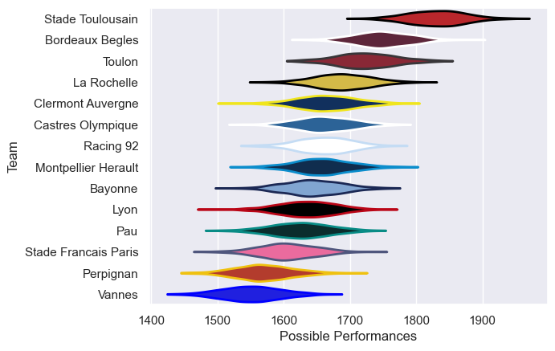

---  
title: "Top 14 Orange 24/25 Status"  
date: 2025-06-23 6:00:00 -0500  
categories: model review projection  
layout: article  
aside:  
    toc: true  
---
# Current Team Rankings

# Standings

## Current Standings

| Club                 |   Played |   Wins |   Point Differential |   Losing Bonus Points |   Try Bonus Points |   Competition Points |
|:---------------------|---------:|-------:|---------------------:|----------------------:|-------------------:|---------------------:|
| Stade Toulousain     |       27 |     19 |                  436 |                     6 |                 15 |                   99 |
| Bordeaux Begles      |       27 |     18 |                  168 |                     5 |                 12 |                   89 |
| Toulon               |       28 |     16 |                   99 |                     6 |                 11 |                   81 |
| Bayonne              |       28 |     16 |                   -8 |                     5 |                  7 |                   78 |
| Castres Olympique    |       28 |     13 |                  -62 |                     6 |                  9 |                   73 |
| Clermont Auvergne    |       28 |     13 |                   30 |                     7 |                 11 |                   72 |
| Pau                  |       26 |     13 |                  -37 |                     5 |                 10 |                   67 |
| Racing 92            |       26 |     11 |                  -10 |                     8 |                  9 |                   65 |
| La Rochelle          |       26 |     13 |                  -18 |                     3 |                  7 |                   64 |
| Lyon                 |       26 |     10 |                  -47 |                     4 |                 10 |                   58 |
| Montpellier Herault  |       26 |     12 |                   14 |                     5 |                  4 |                   57 |
| Stade Francais Paris |       26 |     10 |                 -158 |                     5 |                  7 |                   52 |
| Perpignan            |       27 |     10 |                 -175 |                     4 |                  3 |                   51 |
| Vannes               |       26 |      7 |                 -230 |                     7 |                  8 |                   45 |
| Grenoble             |        1 |      0 |                   -2 |                     1 |                    |                    1 |

## Projected Remaining Table

| Club             |   To Play |   Projected Wins |   Projected Differential |   Projected Losing Bonus Points | Projected Try Bonus Points   |   Projected Competition Points |
|:-----------------|----------:|-----------------:|-------------------------:|--------------------------------:|:-----------------------------|-------------------------------:|
| Stade Toulousain |         1 |            0.713 |                    5.036 |                           0.131 |                              |                          3.051 |
| Bordeaux Begles  |         1 |            0.253 |                   -5.036 |                           0.267 |                              |                          1.347 |

## Projected Total Table

| Club                 |   Played |   Wins |   Point Differential |   Losing Bonus Points |   Try Bonus Points |   Competition Points |
|:---------------------|---------:|-------:|---------------------:|----------------------:|-------------------:|---------------------:|
| Stade Toulousain     |       28 | 19.713 |              441.036 |                 6.131 |                 15 |              102.051 |
| Bordeaux Begles      |       28 | 18.253 |              162.964 |                 5.267 |                 12 |               90.347 |
| Toulon               |       28 | 16     |               99     |                 6     |                 11 |               81     |
| Bayonne              |       28 | 16     |               -8     |                 5     |                  7 |               78     |
| Castres Olympique    |       28 | 13     |              -62     |                 6     |                  9 |               73     |
| Clermont Auvergne    |       28 | 13     |               30     |                 7     |                 11 |               72     |
| Pau                  |       26 | 13     |              -37     |                 5     |                 10 |               67     |
| Racing 92            |       26 | 11     |              -10     |                 8     |                  9 |               65     |
| La Rochelle          |       26 | 13     |              -18     |                 3     |                  7 |               64     |
| Lyon                 |       26 | 10     |              -47     |                 4     |                 10 |               58     |
| Montpellier Herault  |       26 | 12     |               14     |                 5     |                  4 |               57     |
| Stade Francais Paris |       26 | 10     |             -158     |                 5     |                  7 |               52     |
| Perpignan            |       27 | 10     |             -175     |                 4     |                  3 |               51     |
| Vannes               |       26 |  7     |             -230     |                 7     |                  8 |               45     |
| Grenoble             |        1 |  0     |               -2     |                 1     |                    |                1     |

# Completed Match Review

| Model | Percent Correct Predictions | Spread Error |
| ------ | ------ | ------ |
| Club Level | 74.6% | 10.3 |
| Player Level: Lineup | nan% | nan |
| Player Level: Minutes | nan% | nan |

# Future Predictions

## Week 29

### Stade Toulousain V Bordeaux Begles on 2025/06/28

Average Margin: Stade Toulousain by 5.0

