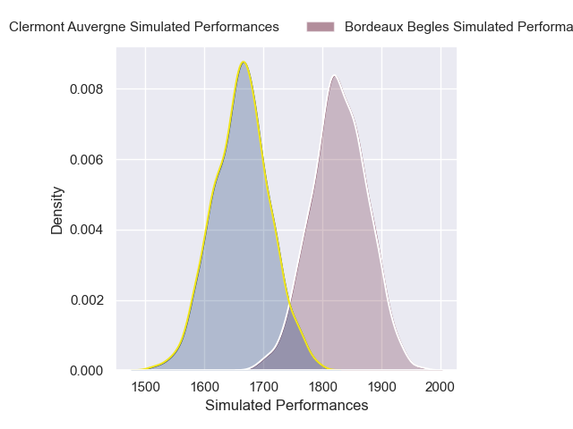
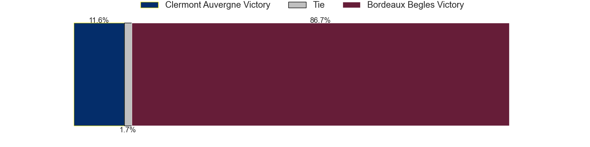
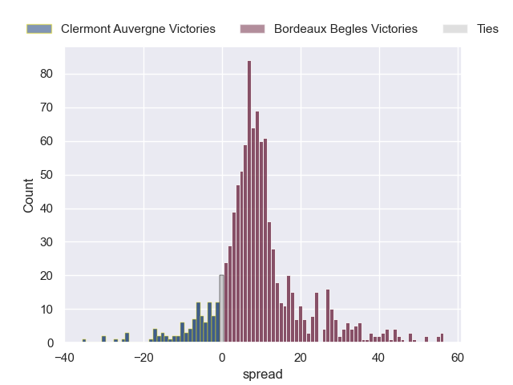

---  
title: "Top 14 Orange 24/25 Status"  
date: 2025-02-17 6:00:00 -0500  
categories: model review projection  
layout: article  
aside:  
    toc: true  
---
# Current Team Rankings

# Standings

## Current Standings

| Club                 |   Played |   Wins |   Point Differential |   Losing Bonus Points |   Try Bonus Points |   Competition Points |
|:---------------------|---------:|-------:|---------------------:|----------------------:|-------------------:|---------------------:|
| Bordeaux Begles      |       16 |     11 |                  141 |                     4 |                  4 |                   52 |
| Toulon               |       16 |     11 |                   87 |                     3 |                  5 |                   52 |
| Stade Toulousain     |       16 |     10 |                  150 |                     4 |                  5 |                   51 |
| Bayonne              |       16 |     10 |                    6 |                     2 |                  1 |                   43 |
| Clermont Auvergne    |       16 |      9 |                   38 |                     2 |                  4 |                   42 |
| Castres Olympique    |       16 |      8 |                  -27 |                     2 |                  1 |                   37 |
| La Rochelle          |       16 |      8 |                  -45 |                     1 |                  3 |                   36 |
| Lyon                 |       16 |      8 |                    5 |                     1 |                  2 |                   35 |
| Montpellier Herault  |       16 |      7 |                   43 |                     4 |                  2 |                   34 |
| Pau                  |       16 |      6 |                  -66 |                     3 |                  3 |                   30 |
| Perpignan            |       16 |      6 |                  -94 |                     2 |                  2 |                   30 |
| Stade Francais Paris |       16 |      6 |                  -87 |                     2 |                  2 |                   28 |
| Racing 92            |       16 |      5 |                  -38 |                     5 |                  0 |                   27 |
| Vannes               |       16 |      5 |                 -113 |                     4 |                  0 |                   24 |

## Projected Remaining Table

| Club                 |   Matches Remaining |   Wins |   Point Differential |   Losing Bonus Points |   Try Bonus Points |   Competition Points |
|:---------------------|--------------------:|-------:|---------------------:|----------------------:|-------------------:|---------------------:|
| Stade Toulousain     |                  10 |    8.1 |              96.2789 |                   1   |                2.9 |                 36.3 |
| Bordeaux Begles      |                  10 |    7.4 |              55.8498 |                   1.4 |                1.8 |                 32.9 |
| Toulon               |                  10 |    7   |              41.9378 |                   1.7 |                1.8 |                 31.3 |
| La Rochelle          |                  10 |    6.7 |              34.9181 |                   1.6 |                1.7 |                 30   |
| Montpellier Herault  |                  10 |    5.7 |              16.9307 |                   2.2 |                1.7 |                 26.8 |
| Clermont Auvergne    |                  10 |    5.4 |              10.92   |                   2   |                1.2 |                 24.7 |
| Bayonne              |                  10 |    4.7 |              -9.3689 |                   2.2 |                0.7 |                 21.6 |
| Lyon                 |                  10 |    4.5 |             -11.0589 |                   2.3 |                0.6 |                 21.1 |
| Castres Olympique    |                  10 |    4.5 |             -15.0437 |                   2   |                0.7 |                 20.8 |
| Racing 92            |                  10 |    4.3 |             -20.1743 |                   2.2 |                0.7 |                 20   |
| Pau                  |                  10 |    3.5 |             -32.0632 |                   2.7 |                0.6 |                 17.4 |
| Stade Francais Paris |                  10 |    3.3 |             -38.2159 |                   2.5 |                0.5 |                 16.1 |
| Perpignan            |                  10 |    2.5 |             -62.0384 |                   2.1 |                0.5 |                 12.5 |
| Vannes               |                  10 |    2.4 |             -68.8719 |                   2.1 |                0.3 |                 12   |

## Projected Total Table

| Club                 |   Total Matches |   Wins |   Point Differential |   Losing Bonus Points |   Try Bonus Points |   Competition Points |
|:---------------------|----------------:|-------:|---------------------:|----------------------:|-------------------:|---------------------:|
| Stade Toulousain     |              26 |   18.1 |            246.279   |                   5   |                7.9 |                 87.3 |
| Bordeaux Begles      |              26 |   18.4 |            196.85    |                   5.4 |                5.8 |                 84.9 |
| Toulon               |              26 |   18   |            128.938   |                   4.7 |                6.8 |                 83.3 |
| Clermont Auvergne    |              26 |   14.4 |             48.92    |                   4   |                5.2 |                 66.7 |
| La Rochelle          |              26 |   14.7 |            -10.0819  |                   2.6 |                4.7 |                 66   |
| Bayonne              |              26 |   14.7 |             -3.3689  |                   4.2 |                1.7 |                 64.6 |
| Montpellier Herault  |              26 |   12.7 |             59.9307  |                   6.2 |                3.7 |                 60.8 |
| Castres Olympique    |              26 |   12.5 |            -42.0437  |                   4   |                1.7 |                 57.8 |
| Lyon                 |              26 |   12.5 |             -6.05888 |                   3.3 |                2.6 |                 56.1 |
| Pau                  |              26 |    9.5 |            -98.0632  |                   5.7 |                3.6 |                 47.4 |
| Racing 92            |              26 |    9.3 |            -58.1743  |                   7.2 |                0.7 |                 47   |
| Stade Francais Paris |              26 |    9.3 |           -125.216   |                   4.5 |                2.5 |                 44.1 |
| Perpignan            |              26 |    8.5 |           -156.038   |                   4.1 |                2.5 |                 42.5 |
| Vannes               |              26 |    7.4 |           -181.872   |                   6.1 |                0.3 |                 36   |

# Completed Match Review

| Model | Percent Correct Predictions | Spread Error |
| ------ | ------ | ------ |
| Club Level | 75.0% | 10.7 |
| Player Level: Lineup | 77.6% | 13.3 |
| Player Level: Minutes | 75.5% | 13.4 |

# Future Predictions

## Week 17

### Stade Toulousain V Bayonne on 2025/02/22

Average Margin: Stade Toulousain by 12.8

Average Scoreline: 42-29

### Castres Olympique V Lyon on 2025/02/22

Average Margin: Castres Olympique by 4.8

Average Scoreline: 27-22

### Vannes V Montpellier Herault on 2025/02/22

Average Margin: Montpellier Herault by 3.2

Average Scoreline: 30-27

### La Rochelle V Racing 92 on 2025/02/22

Average Margin: La Rochelle by 7.8

Average Scoreline: 30-22

### Toulon V Stade Francais Paris on 2025/02/22

Average Margin: Toulon by 10.0

Average Scoreline: 37-27

### Pau V Perpignan on 2025/02/22

Average Margin: Pau by 5.9

Average Scoreline: 25-20

### Bordeaux Begles V Clermont Auvergne on 2025/02/23

Average Margin: Bordeaux Begles by 8.3

Average Scoreline: 39-30

## Week 18

### Racing 92 V Pau on 2025/03/01

Average Margin: Racing 92 by 5.1

Average Scoreline: 27-22

### Stade Francais Paris V La Rochelle on 2025/03/01

Average Margin: La Rochelle by 1.7

Average Scoreline: 31-29

### Perpignan V Bordeaux Begles on 2025/03/01

Average Margin: Bordeaux Begles by 7.1

Average Scoreline: 40-32

### Bayonne V Clermont Auvergne on 2025/03/01

Average Margin: Bayonne by 2.7

Average Scoreline: 31-28

### Lyon V Toulon on 2025/03/01

Average Margin: Toulon by 1.1

Average Scoreline: 29-28

### Montpellier Herault V Castres Olympique on 2025/03/01

Average Margin: Montpellier Herault by 4.9

Average Scoreline: 29-24

### Stade Toulousain V Vannes on 2025/03/01

Average Margin: Stade Toulousain by 16.3

Average Scoreline: 37-21

## Week 19

### Toulon V Perpignan on 2025/03/22

Average Margin: Toulon by 11.5

Average Scoreline: 37-25

### Pau V Montpellier Herault on 2025/03/22

Average Margin: Pau by 0.8

Average Scoreline: 32-31

### La Rochelle V Castres Olympique on 2025/03/22

Average Margin: La Rochelle by 7.2

Average Scoreline: 37-29

### Clermont Auvergne V Racing 92 on 2025/03/22

Average Margin: Clermont Auvergne by 6.8

Average Scoreline: 35-28

### Lyon V Vannes on 2025/03/22

Average Margin: Lyon by 7.9

Average Scoreline: 33-25

### Stade Francais Paris V Bayonne on 2025/03/22

Average Margin: Stade Francais Paris by 1.8

Average Scoreline: 25-24

### Bordeaux Begles V Stade Toulousain on 2025/03/22

Average Margin: Bordeaux Begles by 1.7

Average Scoreline: 32-30

## Week 20

### Bayonne V Lyon on 2025/03/29

Average Margin: Bayonne by 4.0

Average Scoreline: 34-29

### Racing 92 V Bordeaux Begles on 2025/03/29

Average Margin: Bordeaux Begles by 3.7

Average Scoreline: 34-30

### Montpellier Herault V Stade Francais Paris on 2025/03/29

Average Margin: Montpellier Herault by 7.7

Average Scoreline: 35-28

### Castres Olympique V Toulon on 2025/03/29

Average Margin: Toulon by 0.8

Average Scoreline: 29-29

### Stade Toulousain V Pau on 2025/03/29

Average Margin: Stade Toulousain by 14.1

Average Scoreline: 38-24

### Clermont Auvergne V La Rochelle on 2025/03/29

Average Margin: Clermont Auvergne by 2.8

Average Scoreline: 28-26

### Vannes V Perpignan on 2025/03/29

Average Margin: Vannes by 1.8

Average Scoreline: 24-22

## Week 21

### Castres Olympique V Vannes on 2025/04/19

Average Margin: Castres Olympique by 9.2

Average Scoreline: 34-25

### La Rochelle V Bayonne on 2025/04/19

Average Margin: La Rochelle by 7.0

Average Scoreline: 33-26

### Perpignan V Racing 92 on 2025/04/19

Average Margin: Perpignan by 1.1

Average Scoreline: 29-28

### Lyon V Montpellier Herault on 2025/04/19

Average Margin: Lyon by 2.2

Average Scoreline: 28-26

### Pau V Bordeaux Begles on 2025/04/19

Average Margin: Bordeaux Begles by 4.4

Average Scoreline: 33-28

### Toulon V Clermont Auvergne on 2025/04/19

Average Margin: Toulon by 6.4

Average Scoreline: 32-26

### Stade Francais Paris V Stade Toulousain on 2025/04/19

Average Margin: Stade Toulousain by 8.1

Average Scoreline: 34-26

## Week 22

### Racing 92 V Stade Francais Paris on 2025/04/26

Average Margin: Racing 92 by 5.4

Average Scoreline: 29-23

### Vannes V Toulon on 2025/04/26

Average Margin: Toulon by 6.2

Average Scoreline: 36-30

### Montpellier Herault V Perpignan on 2025/04/26

Average Margin: Montpellier Herault by 9.5

Average Scoreline: 41-31

### Bayonne V Pau on 2025/04/26

Average Margin: Bayonne by 5.8

Average Scoreline: 35-30

### Stade Toulousain V Castres Olympique on 2025/04/26

Average Margin: Stade Toulousain by 12.2

Average Scoreline: 36-24

### Clermont Auvergne V Lyon on 2025/04/26

Average Margin: Clermont Auvergne by 5.9

Average Scoreline: 35-30

### Bordeaux Begles V La Rochelle on 2025/04/26

Average Margin: Bordeaux Begles by 7.1

Average Scoreline: 31-23

## Week 23

### Perpignan V Stade Francais Paris on 2025/05/10

Average Margin: Perpignan by 2.3

Average Scoreline: 26-24

### Vannes V La Rochelle on 2025/05/10

Average Margin: La Rochelle by 4.6

Average Scoreline: 32-28

### Toulon V Stade Toulousain on 2025/05/10

Average Margin: Stade Toulousain by 0.1

Average Scoreline: 26-26

### Racing 92 V Bayonne on 2025/05/10

Average Margin: Racing 92 by 3.7

Average Scoreline: 28-25

### Montpellier Herault V Bordeaux Begles on 2025/05/10

Average Margin: Bordeaux Begles by 1.5

Average Scoreline: 28-27

### Castres Olympique V Clermont Auvergne on 2025/05/10

Average Margin: Castres Olympique by 2.1

Average Scoreline: 27-25

### Lyon V Pau on 2025/05/10

Average Margin: Lyon by 5.1

Average Scoreline: 24-19

## Week 24

### Clermont Auvergne V Perpignan on 2025/05/17

Average Margin: Clermont Auvergne by 10.1

Average Scoreline: 41-31

### Stade Toulousain V Racing 92 on 2025/05/17

Average Margin: Stade Toulousain by 12.6

Average Scoreline: 29-17

### Bayonne V Vannes on 2025/05/17

Average Margin: Bayonne by 8.8

Average Scoreline: 34-25

### Stade Francais Paris V Lyon on 2025/05/17

Average Margin: Stade Francais Paris by 2.1

Average Scoreline: 27-25

### La Rochelle V Montpellier Herault on 2025/05/17

Average Margin: La Rochelle by 4.7

Average Scoreline: 28-23

### Pau V Toulon on 2025/05/17

Average Margin: Toulon by 2.7

Average Scoreline: 32-30

### Bordeaux Begles V Castres Olympique on 2025/05/17

Average Margin: Bordeaux Begles by 9.6

Average Scoreline: 35-26

## Week 25

### Stade Toulousain V Lyon on 2025/05/31

Average Margin: Stade Toulousain by 12.8

Average Scoreline: 32-20

### Toulon V Bordeaux Begles on 2025/05/31

Average Margin: Toulon by 2.2

Average Scoreline: 24-22

### Castres Olympique V Bayonne on 2025/05/31

Average Margin: Castres Olympique by 4.4

Average Scoreline: 28-24

### Racing 92 V Montpellier Herault on 2025/05/31

Average Margin: Racing 92 by 2.2

Average Scoreline: 28-26

### Vannes V Pau on 2025/05/31

Average Margin: Vannes by 0.4

Average Scoreline: 28-28

### La Rochelle V Perpignan on 2025/05/31

Average Margin: La Rochelle by 10.5

Average Scoreline: 42-31

### Clermont Auvergne V Stade Francais Paris on 2025/05/31

Average Margin: Clermont Auvergne by 7.8

Average Scoreline: 35-28

## Week 26

### Perpignan V Stade Toulousain on 2025/06/07

Average Margin: Stade Toulousain by 8.9

Average Scoreline: 36-27

### Bayonne V Toulon on 2025/06/07

Average Margin: Toulon by 1.1

Average Scoreline: 30-29

### Lyon V Racing 92 on 2025/06/07

Average Margin: Lyon by 4.5

Average Scoreline: 23-18

### Montpellier Herault V Clermont Auvergne on 2025/06/07

Average Margin: Montpellier Herault by 3.1

Average Scoreline: 27-24

### Bordeaux Begles V Vannes on 2025/06/07

Average Margin: Bordeaux Begles by 14.8

Average Scoreline: 34-19

### Pau V La Rochelle on 2025/06/07

Average Margin: La Rochelle by 1.2

Average Scoreline: 28-26

### Stade Francais Paris V Castres Olympique on 2025/06/07

Average Margin: Stade Francais Paris by 0.9

Average Scoreline: 26-25

