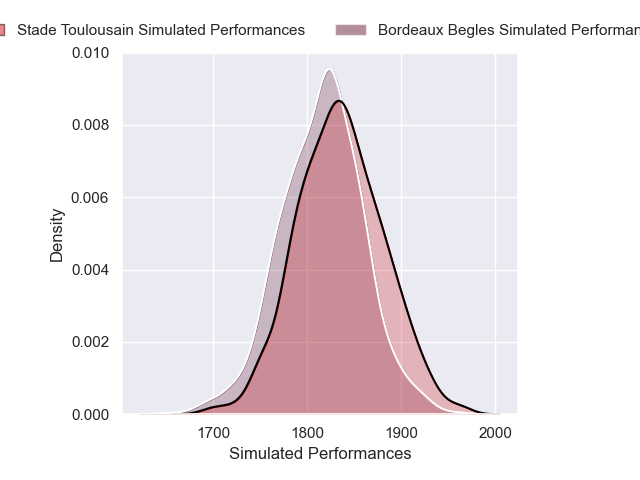
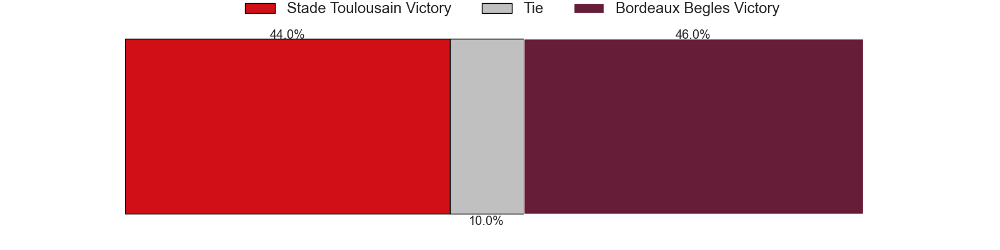
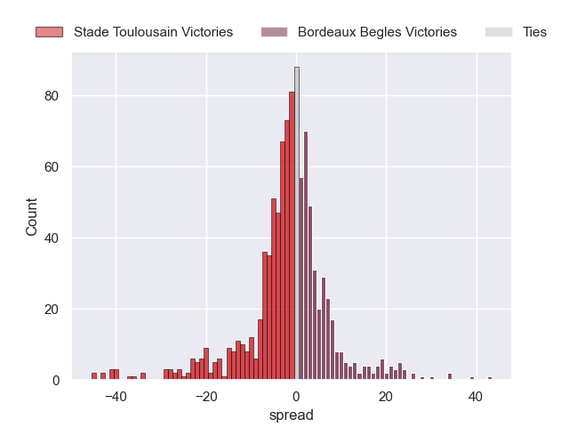

---  
title: "Top 14 Orange 24/25 Status"  
date: 2025-03-21 6:00:00 -0500  
categories: model review projection  
layout: article  
aside:  
    toc: true  
---
# Current Team Rankings

# Standings

## Current Standings

| Club                 |   Played |   Wins |   Point Differential |   Losing Bonus Points |   Try Bonus Points |   Competition Points |
|:---------------------|---------:|-------:|---------------------:|----------------------:|-------------------:|---------------------:|
| Stade Toulousain     |       18 |     13 |                  275 |                     4 |                  7 |                   65 |
| Toulon               |       18 |     12 |                   97 |                     3 |                nan |                   57 |
| Bordeaux Begles      |       18 |     12 |                  133 |                     4 |                  4 |                   56 |
| Clermont Auvergne    |       18 |      9 |                   -1 |                     3 |                  4 |                   43 |
| Bayonne              |       18 |     10 |                  -42 |                     2 |                  1 |                   43 |
| Castres Olympique    |       18 |      9 |                  -26 |                     3 |                  1 |                   42 |
| Montpellier Herault  |       18 |      8 |                   34 |                     4 |                  2 |                   38 |
| La Rochelle          |       18 |      8 |                  -55 |                     3 |                  3 |                   38 |
| Perpignan            |       19 |      8 |                  -91 |                     2 |                nan |                   38 |
| Lyon                 |       17 |      8 |                    0 |                     2 |                  2 |                   36 |
| Pau                  |       17 |      7 |                  -49 |                     3 |                  3 |                   34 |
| Stade Francais Paris |       18 |      7 |                 -100 |                     2 |                  2 |                   32 |
| Racing 92            |       17 |      6 |                  -33 |                     5 |                  0 |                   31 |
| Vannes               |       18 |      6 |                 -142 |                     4 |                  0 |                   28 |

## Projected Remaining Table

| Club                 |   Matches Remaining |   Wins |   Point Differential |   Losing Bonus Points |   Try Bonus Points |   Competition Points |
|:---------------------|--------------------:|-------:|---------------------:|----------------------:|-------------------:|---------------------:|
| Stade Toulousain     |                   8 |    6.6 |             78.1825  |                   0.7 |                2.4 |                 29.7 |
| Bordeaux Begles      |                   8 |    5.4 |             33.2344  |                   1.5 |                1.2 |                 24.2 |
| Toulon               |                   8 |    5.3 |             26.6413  |                   1.5 |                1.5 |                 24   |
| La Rochelle          |                   8 |    5.1 |             20.4203  |                   1.4 |                1.2 |                 22.8 |
| Clermont Auvergne    |                   8 |    4.8 |             18.3023  |                   1.5 |                1   |                 21.8 |
| Montpellier Herault  |                   8 |    4.2 |              5.8646  |                   2   |                1.1 |                 19.7 |
| Lyon                 |                   8 |    4   |             -5.32    |                   1.6 |                0.9 |                 18.6 |
| Bayonne              |                   8 |    3.6 |             -4.81831 |                   2   |                0.5 |                 17.1 |
| Racing 92            |                   8 |    3.5 |            -13.5936  |                   1.8 |                0.9 |                 16.9 |
| Castres Olympique    |                   8 |    3.7 |            -13.1531  |                   1.5 |                0.5 |                 16.7 |
| Stade Francais Paris |                   8 |    2.8 |            -27.5199  |                   2   |                0.4 |                 13.5 |
| Pau                  |                   8 |    2.7 |            -30.0972  |                   2.3 |                0.5 |                 13.5 |
| Perpignan            |                   8 |    2.2 |            -44.1843  |                   1.6 |                0.3 |                 10.8 |
| Vannes               |                   8 |    2.1 |            -43.9589  |                   1.8 |                0.3 |                 10.7 |

## Projected Total Table

| Club                 |   Total Matches |   Wins |   Point Differential |   Losing Bonus Points |   Try Bonus Points |   Competition Points |
|:---------------------|----------------:|-------:|---------------------:|----------------------:|-------------------:|---------------------:|
| Stade Toulousain     |              26 |   19.6 |             353.182  |                   4.7 |                9.4 |                 94.7 |
| Toulon               |              26 |   17.3 |             123.641  |                   4.5 |                1.5 |                 81   |
| Bordeaux Begles      |              26 |   17.4 |             166.234  |                   5.5 |                5.2 |                 80.2 |
| Clermont Auvergne    |              26 |   13.8 |              17.3023 |                   4.5 |                5   |                 64.8 |
| La Rochelle          |              26 |   13.1 |             -34.5797 |                   4.4 |                4.2 |                 60.8 |
| Bayonne              |              26 |   13.6 |             -46.8183 |                   4   |                1.5 |                 60.1 |
| Castres Olympique    |              26 |   12.7 |             -39.1531 |                   4.5 |                1.5 |                 58.7 |
| Montpellier Herault  |              26 |   12.2 |              39.8646 |                   6   |                3.1 |                 57.7 |
| Lyon                 |              25 |   12   |              -5.32   |                   3.6 |                2.9 |                 54.6 |
| Perpignan            |              27 |   10.2 |            -135.184  |                   3.6 |                0.3 |                 48.8 |
| Racing 92            |              25 |    9.5 |             -46.5936 |                   6.8 |                0.9 |                 47.9 |
| Pau                  |              25 |    9.7 |             -79.0972 |                   5.3 |                3.5 |                 47.5 |
| Stade Francais Paris |              26 |    9.8 |            -127.52   |                   4   |                2.4 |                 45.5 |
| Vannes               |              26 |    8.1 |            -185.959  |                   5.8 |                0.3 |                 38.7 |

# Completed Match Review

| Model | Percent Correct Predictions | Spread Error |
| ------ | ------ | ------ |
| Club Level | 73.6% | 10.7 |
| Player Level: Lineup | 77.4% | 12.9 |
| Player Level: Minutes | 75.5% | 13.3 |

# Future Predictions

## Week 20

### Pau V Montpellier Herault on 2025/03/22

Average Margin: Pau by 1.3

Average Scoreline: 29-28

### Toulon V Perpignan on 2025/03/22

Average Margin: Toulon by 11.2

Average Scoreline: 31-20

### Stade Francais Paris V Bayonne on 2025/03/22

Average Margin: Stade Francais Paris by 2.5

Average Scoreline: 27-25

### Lyon V Vannes on 2025/03/22

Average Margin: Lyon by 8.4

Average Scoreline: 32-23

### Clermont Auvergne V Racing 92 on 2025/03/22

Average Margin: Clermont Auvergne by 6.2

Average Scoreline: 29-22

### La Rochelle V Castres Olympique on 2025/03/22

Average Margin: La Rochelle by 6.0

Average Scoreline: 28-22

### Bordeaux Begles V Stade Toulousain on 2025/03/23

Average Margin: Stade Toulousain by 1.1

Average Scoreline: 28-27

## Week 21

### Racing 92 V Bordeaux Begles on 2025/03/29

Average Margin: Bordeaux Begles by 2.7

Average Scoreline: 32-29

### Clermont Auvergne V La Rochelle on 2025/03/29

Average Margin: Clermont Auvergne by 3.3

Average Scoreline: 26-23

### Bayonne V Lyon on 2025/03/29

Average Margin: Bayonne by 3.3

Average Scoreline: 28-25

### Stade Toulousain V Pau on 2025/03/29

Average Margin: Stade Toulousain by 15.5

Average Scoreline: 36-21

### Montpellier Herault V Stade Francais Paris on 2025/03/29

Average Margin: Montpellier Herault by 7.0

Average Scoreline: 28-21

### Vannes V Perpignan on 2025/03/29

Average Margin: Vannes by 2.5

Average Scoreline: 29-26

### Castres Olympique V Toulon on 2025/03/29

Average Margin: Toulon by 0.0

Average Scoreline: 28-28

## Week 22

### La Rochelle V Bayonne on 2025/04/19

Average Margin: La Rochelle by 6.9

Average Scoreline: 30-23

### Lyon V Montpellier Herault on 2025/04/19

Average Margin: Lyon by 2.0

Average Scoreline: 29-27

### Pau V Bordeaux Begles on 2025/04/19

Average Margin: Bordeaux Begles by 3.3

Average Scoreline: 33-30

### Stade Francais Paris V Stade Toulousain on 2025/04/19

Average Margin: Stade Toulousain by 9.1

Average Scoreline: 37-28

### Castres Olympique V Vannes on 2025/04/19

Average Margin: Castres Olympique by 9.3

Average Scoreline: 29-20

### Toulon V Clermont Auvergne on 2025/04/19

Average Margin: Toulon by 6.7

Average Scoreline: 26-19

### Perpignan V Racing 92 on 2025/04/19

Average Margin: Perpignan by 1.0

Average Scoreline: 27-26

## Week 23

### Racing 92 V Stade Francais Paris on 2025/04/26

Average Margin: Racing 92 by 5.7

Average Scoreline: 27-21

### Stade Toulousain V Castres Olympique on 2025/04/26

Average Margin: Stade Toulousain by 13.7

Average Scoreline: 35-21

### Bordeaux Begles V La Rochelle on 2025/04/26

Average Margin: Bordeaux Begles by 7.2

Average Scoreline: 30-23

### Vannes V Toulon on 2025/04/26

Average Margin: Toulon by 5.8

Average Scoreline: 40-34

### Clermont Auvergne V Lyon on 2025/04/26

Average Margin: Clermont Auvergne by 5.5

Average Scoreline: 27-21

### Montpellier Herault V Perpignan on 2025/04/26

Average Margin: Montpellier Herault by 7.7

Average Scoreline: 32-24

### Bayonne V Pau on 2025/04/26

Average Margin: Bayonne by 4.3

Average Scoreline: 32-28

## Week 24

### Lyon V Pau on 2025/05/10

Average Margin: Lyon by 5.0

Average Scoreline: 30-25

### Vannes V La Rochelle on 2025/05/10

Average Margin: La Rochelle by 3.1

Average Scoreline: 33-30

### Castres Olympique V Clermont Auvergne on 2025/05/10

Average Margin: Castres Olympique by 2.2

Average Scoreline: 25-23

### Montpellier Herault V Bordeaux Begles on 2025/05/10

Average Margin: Bordeaux Begles by 1.0

Average Scoreline: 30-29

### Perpignan V Stade Francais Paris on 2025/05/10

Average Margin: Perpignan by 3.4

Average Scoreline: 27-24

### Toulon V Stade Toulousain on 2025/05/10

Average Margin: Stade Toulousain by 2.6

Average Scoreline: 23-21

### Racing 92 V Bayonne on 2025/05/10

Average Margin: Racing 92 by 4.6

Average Scoreline: 32-27

## Week 25

### Stade Francais Paris V Lyon on 2025/05/17

Average Margin: Stade Francais Paris by 2.1

Average Scoreline: 26-24

### Pau V Toulon on 2025/05/17

Average Margin: Toulon by 2.1

Average Scoreline: 32-30

### Stade Toulousain V Racing 92 on 2025/05/17

Average Margin: Stade Toulousain by 13.2

Average Scoreline: 33-20

### Clermont Auvergne V Perpignan on 2025/05/17

Average Margin: Clermont Auvergne by 8.2

Average Scoreline: 30-22

### Bordeaux Begles V Castres Olympique on 2025/05/17

Average Margin: Bordeaux Begles by 9.5

Average Scoreline: 31-21

### La Rochelle V Montpellier Herault on 2025/05/17

Average Margin: La Rochelle by 5.2

Average Scoreline: 25-20

### Bayonne V Vannes on 2025/05/17

Average Margin: Bayonne by 7.7

Average Scoreline: 31-23

## Week 26

### La Rochelle V Perpignan on 2025/05/31

Average Margin: La Rochelle by 9.5

Average Scoreline: 31-22

### Toulon V Bordeaux Begles on 2025/05/31

Average Margin: Toulon by 2.7

Average Scoreline: 27-24

### Vannes V Pau on 2025/05/31

Average Margin: Vannes by 1.0

Average Scoreline: 27-26

### Racing 92 V Montpellier Herault on 2025/05/31

Average Margin: Racing 92 by 2.9

Average Scoreline: 29-27

### Clermont Auvergne V Stade Francais Paris on 2025/05/31

Average Margin: Clermont Auvergne by 7.6

Average Scoreline: 29-22

### Castres Olympique V Bayonne on 2025/05/31

Average Margin: Castres Olympique by 5.3

Average Scoreline: 28-23

### Stade Toulousain V Lyon on 2025/05/31

Average Margin: Stade Toulousain by 13.5

Average Scoreline: 35-21

## Week 27

### Lyon V Racing 92 on 2025/06/07

Average Margin: Lyon by 3.7

Average Scoreline: 33-29

### Bayonne V Toulon on 2025/06/07

Average Margin: Toulon by 0.8

Average Scoreline: 34-33

### Pau V La Rochelle on 2025/06/07

Average Margin: La Rochelle by 0.3

Average Scoreline: 29-29

### Montpellier Herault V Clermont Auvergne on 2025/06/07

Average Margin: Montpellier Herault by 3.5

Average Scoreline: 27-23

### Bordeaux Begles V Vannes on 2025/06/07

Average Margin: Bordeaux Begles by 13.3

Average Scoreline: 36-23

### Perpignan V Stade Toulousain on 2025/06/07

Average Margin: Stade Toulousain by 9.5

Average Scoreline: 37-28

### Stade Francais Paris V Castres Olympique on 2025/06/07

Average Margin: Stade Francais Paris by 0.7

Average Scoreline: 26-25

