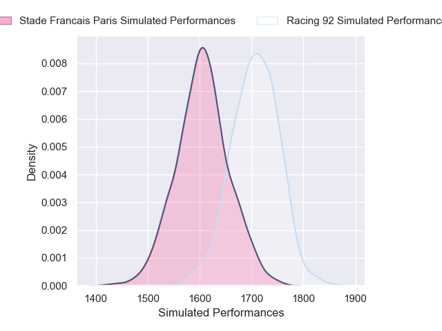
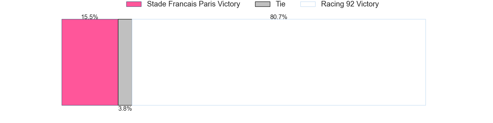
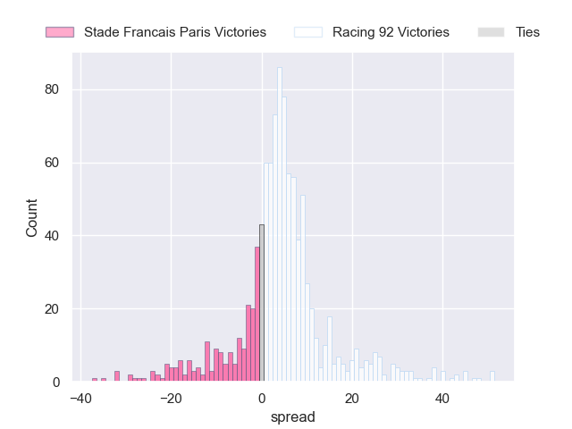

---  
title: "Top 14 Orange 24/25 Status"  
date: 2025-04-25 6:00:00 -0500  
categories: model review projection  
layout: article  
aside:  
    toc: true  
---
# Current Team Rankings

# Standings

## Current Standings

| Club                 |   Played |   Wins |   Point Differential |   Losing Bonus Points |   Try Bonus Points |   Competition Points |
|:---------------------|---------:|-------:|---------------------:|----------------------:|-------------------:|---------------------:|
| Stade Toulousain     |       22 |     16 |                  331 |                     4 |                nan |                   78 |
| Toulon               |       22 |     15 |                  121 |                     4 |                nan |                   71 |
| Bordeaux Begles      |       21 |     14 |                  123 |                     5 |                  4 |                   65 |
| Bayonne              |       22 |     13 |                    4 |                     4 |                nan |                   58 |
| Castres Olympique    |       22 |     12 |                  -18 |                     3 |                nan |                   53 |
| Clermont Auvergne    |       22 |     10 |                  -14 |                     4 |                nan |                   48 |
| Montpellier Herault  |       22 |     10 |                   37 |                     5 |                nan |                   47 |
| Lyon                 |       22 |     10 |                    1 |                     3 |                nan |                   45 |
| La Rochelle          |       21 |      9 |                  -68 |                     3 |                  3 |                   44 |
| Pau                  |       22 |      9 |                  -89 |                     4 |                nan |                   43 |
| Racing 92            |       21 |      8 |                  -48 |                     6 |                  0 |                   40 |
| Perpignan            |       22 |      8 |                 -119 |                     2 |                nan |                   38 |
| Stade Francais Paris |       21 |      8 |                 -108 |                     2 |                  2 |                   36 |
| Vannes               |       22 |      8 |                 -153 |                     4 |                nan |                   36 |

## Projected Remaining Table

| Club                 |   Matches Remaining |   Wins |   Point Differential |   Losing Bonus Points |   Try Bonus Points |   Competition Points |
|:---------------------|--------------------:|-------:|---------------------:|----------------------:|-------------------:|---------------------:|
| Stade Toulousain     |                   5 |    4.3 |             52.8396  |                   0.3 |                1.5 |                 19.1 |
| Bordeaux Begles      |                   5 |    3.6 |             30.9657  |                   0.7 |                1.1 |                 16.3 |
| Toulon               |                   5 |    3.1 |              9.66977 |                   1.1 |                0.8 |                 14.2 |
| Clermont Auvergne    |                   5 |    3   |             12.1758  |                   1   |                0.9 |                 13.9 |
| La Rochelle          |                   5 |    2.9 |              7.39711 |                   0.9 |                0.8 |                 13.2 |
| Montpellier Herault  |                   5 |    2.6 |              2.7051  |                   1.3 |                0.5 |                 12   |
| Bayonne              |                   5 |    2.5 |              3.47496 |                   1.2 |                0.4 |                 11.8 |
| Racing 92            |                   5 |    2.6 |             -4.30512 |                   0.8 |                0.4 |                 11.8 |
| Lyon                 |                   5 |    2.2 |            -11.3901  |                   1   |                0.3 |                 10   |
| Pau                  |                   5 |    1.9 |            -10.0971  |                   1.5 |                0.3 |                  9.4 |
| Stade Francais Paris |                   5 |    1.9 |            -10.7674  |                   1.4 |                0.4 |                  9.4 |
| Castres Olympique    |                   5 |    2.1 |            -17.8504  |                   0.8 |                0.3 |                  9.4 |
| Vannes               |                   5 |    1.2 |            -31.0649  |                   1.3 |                0.1 |                  6.1 |
| Perpignan            |                   5 |    1.1 |            -33.7531  |                   0.9 |                0.2 |                  5.5 |

## Projected Total Table

| Club                 |   Total Matches |   Wins |   Point Differential |   Losing Bonus Points |   Try Bonus Points |   Competition Points |
|:---------------------|----------------:|-------:|---------------------:|----------------------:|-------------------:|---------------------:|
| Stade Toulousain     |              27 |   20.3 |            383.84    |                   4.3 |                1.5 |                 97.1 |
| Toulon               |              27 |   18.1 |            130.67    |                   5.1 |                0.8 |                 85.2 |
| Bordeaux Begles      |              26 |   17.6 |            153.966   |                   5.7 |                5.1 |                 81.3 |
| Bayonne              |              27 |   15.5 |              7.47496 |                   5.2 |                0.4 |                 69.8 |
| Castres Olympique    |              27 |   14.1 |            -35.8504  |                   3.8 |                0.3 |                 62.4 |
| Clermont Auvergne    |              27 |   13   |             -1.82417 |                   5   |                0.9 |                 61.9 |
| Montpellier Herault  |              27 |   12.6 |             39.7051  |                   6.3 |                0.5 |                 59   |
| La Rochelle          |              26 |   11.9 |            -60.6029  |                   3.9 |                3.8 |                 57.2 |
| Lyon                 |              27 |   12.2 |            -10.3901  |                   4   |                0.3 |                 55   |
| Pau                  |              27 |   10.9 |            -99.0971  |                   5.5 |                0.3 |                 52.4 |
| Racing 92            |              26 |   10.6 |            -52.3051  |                   6.8 |                0.4 |                 51.8 |
| Stade Francais Paris |              26 |    9.9 |           -118.767   |                   3.4 |                2.4 |                 45.4 |
| Perpignan            |              27 |    9.1 |           -152.753   |                   2.9 |                0.2 |                 43.5 |
| Vannes               |              27 |    9.2 |           -184.065   |                   5.3 |                0.1 |                 42.1 |

# Completed Match Review

| Model | Percent Correct Predictions | Spread Error |
| ------ | ------ | ------ |
| Club Level | 76.3% | 9.9 |
| Player Level: Lineup | 80.3% | 11.7 |
| Player Level: Minutes | 75.4% | 12.7 |

# Future Predictions

## Week 23

### Vannes V Toulon on 2025/04/26

Average Margin: Toulon by 5.9

Average Scoreline: 27-21

### Bayonne V Pau on 2025/04/26

Average Margin: Bayonne by 4.3

Average Scoreline: 29-25

### Stade Toulousain V Castres Olympique on 2025/04/26

Average Margin: Stade Toulousain by 13.5

Average Scoreline: 34-21

### Clermont Auvergne V Lyon on 2025/04/26

Average Margin: Clermont Auvergne by 4.5

Average Scoreline: 30-25

### Bordeaux Begles V La Rochelle on 2025/04/26

Average Margin: Bordeaux Begles by 8.5

Average Scoreline: 26-18

### Montpellier Herault V Perpignan on 2025/04/26

Average Margin: Montpellier Herault by 7.9

Average Scoreline: 30-22

### Racing 92 V Stade Francais Paris on 2025/04/27

Average Margin: Racing 92 by 5.9

Average Scoreline: 30-24

## Week 24

### Montpellier Herault V Bordeaux Begles on 2025/05/10

Average Margin: Bordeaux Begles by 1.3

Average Scoreline: 28-26

### Perpignan V Stade Francais Paris on 2025/05/10

Average Margin: Perpignan by 1.8

Average Scoreline: 24-22

### Vannes V La Rochelle on 2025/05/10

Average Margin: La Rochelle by 2.7

Average Scoreline: 24-21

### Racing 92 V Bayonne on 2025/05/10

Average Margin: Racing 92 by 3.8

Average Scoreline: 26-22

### Toulon V Stade Toulousain on 2025/05/10

Average Margin: Stade Toulousain by 2.1

Average Scoreline: 27-25

### Castres Olympique V Clermont Auvergne on 2025/05/10

Average Margin: Castres Olympique by 3.3

Average Scoreline: 30-27

### Lyon V Pau on 2025/05/10

Average Margin: Lyon by 4.4

Average Scoreline: 26-22

## Week 25

### Stade Francais Paris V Lyon on 2025/05/17

Average Margin: Stade Francais Paris by 1.7

Average Scoreline: 24-23

### Stade Toulousain V Racing 92 on 2025/05/17

Average Margin: Stade Toulousain by 13.5

Average Scoreline: 32-19

### Pau V Toulon on 2025/05/17

Average Margin: Toulon by 2.0

Average Scoreline: 24-22

### Clermont Auvergne V Perpignan on 2025/05/17

Average Margin: Clermont Auvergne by 8.2

Average Scoreline: 31-22

### Bayonne V Vannes on 2025/05/17

Average Margin: Bayonne by 8.4

Average Scoreline: 32-23

### Bordeaux Begles V Castres Olympique on 2025/05/17

Average Margin: Bordeaux Begles by 10.0

Average Scoreline: 30-20

### La Rochelle V Montpellier Herault on 2025/05/17

Average Margin: La Rochelle by 4.6

Average Scoreline: 26-21

## Week 26

### Clermont Auvergne V Stade Francais Paris on 2025/05/31

Average Margin: Clermont Auvergne by 6.7

Average Scoreline: 32-25

### Toulon V Bordeaux Begles on 2025/05/31

Average Margin: Toulon by 2.7

Average Scoreline: 26-23

### Castres Olympique V Bayonne on 2025/05/31

Average Margin: Castres Olympique by 4.3

Average Scoreline: 27-23

### Vannes V Pau on 2025/05/31

Average Margin: Pau by 0.1

Average Scoreline: 26-26

### La Rochelle V Perpignan on 2025/05/31

Average Margin: La Rochelle by 9.1

Average Scoreline: 32-23

### Racing 92 V Montpellier Herault on 2025/05/31

Average Margin: Racing 92 by 3.2

Average Scoreline: 26-23

### Stade Toulousain V Lyon on 2025/05/31

Average Margin: Stade Toulousain by 13.4

Average Scoreline: 32-19

## Week 27

### Pau V La Rochelle on 2025/06/07

Average Margin: Pau by 0.5

Average Scoreline: 24-23

### Lyon V Racing 92 on 2025/06/07

Average Margin: Lyon by 3.8

Average Scoreline: 31-27

### Montpellier Herault V Clermont Auvergne on 2025/06/07

Average Margin: Montpellier Herault by 4.0

Average Scoreline: 27-23

### Bayonne V Toulon on 2025/06/07

Average Margin: Toulon by 1.1

Average Scoreline: 21-20

### Perpignan V Stade Toulousain on 2025/06/07

Average Margin: Stade Toulousain by 10.4

Average Scoreline: 29-18

### Bordeaux Begles V Vannes on 2025/06/07

Average Margin: Bordeaux Begles by 13.9

Average Scoreline: 39-25

### Stade Francais Paris V Castres Olympique on 2025/06/07

Average Margin: Stade Francais Paris by 2.0

Average Scoreline: 25-23

