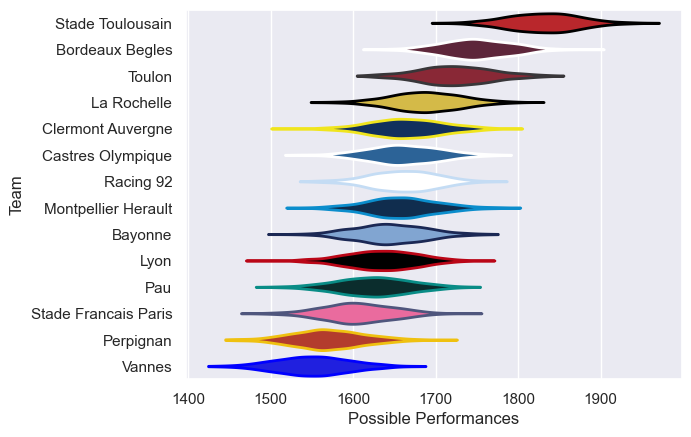

---  
title: "Top 14 Orange 24/25 Status"  
date: 2025-05-02 6:00:00 -0500  
categories: model review projection  
layout: article  
aside:  
    toc: true  
---
# Current Team Rankings

# Standings

## Current Standings

| Club                 |   Played |   Wins |   Point Differential |   Losing Bonus Points |   Try Bonus Points |   Competition Points |
|:---------------------|---------:|-------:|---------------------:|----------------------:|-------------------:|---------------------:|
| Stade Toulousain     |       22 |     15 |                  316 |                     5 |                  9 |                   76 |
| Toulon               |       22 |     15 |                  146 |                     4 |                  7 |                   71 |
| Bordeaux Begles      |       22 |     15 |                  153 |                     5 |                  4 |                   69 |
| Castres Olympique    |       22 |     13 |                   -3 |                     3 |                  2 |                   57 |
| Bayonne              |       22 |     12 |                  -29 |                     4 |                  2 |                   54 |
| Lyon                 |       22 |     11 |                    9 |                     2 |                  2 |                   48 |
| Clermont Auvergne    |       22 |     10 |                  -14 |                     4 |                  4 |                   48 |
| La Rochelle          |       22 |     10 |                  -57 |                     3 |                  3 |                   48 |
| Racing 92            |       21 |      9 |                   -5 |                     6 |                  1 |                   45 |
| Montpellier Herault  |       22 |      9 |                    7 |                     5 |                  2 |                   43 |
| Pau                  |       21 |      9 |                  -74 |                     4 |                  3 |                   43 |
| Perpignan            |       22 |      8 |                 -130 |                     2 |                  2 |                   38 |
| Stade Francais Paris |       22 |      8 |                 -133 |                     2 |                  2 |                   36 |
| Vannes               |       22 |      7 |                 -186 |                     4 |                  1 |                   33 |

## Projected Remaining Table

| Club                 |   Matches Remaining |   Wins |   Point Differential |   Losing Bonus Points |   Try Bonus Points |   Competition Points |
|:---------------------|--------------------:|-------:|---------------------:|----------------------:|-------------------:|---------------------:|
| Stade Toulousain     |                   4 |    3.2 |             35.1758  |                   0.4 |                1   |                 14.4 |
| La Rochelle          |                   4 |    3.1 |             23.1562  |                   0.5 |                0.9 |                 13.7 |
| Bordeaux Begles      |                   4 |    2.7 |             23.2688  |                   0.6 |                0.9 |                 12.4 |
| Toulon               |                   4 |    2.5 |              7.86992 |                   0.8 |                0.5 |                 11.4 |
| Clermont Auvergne    |                   4 |    2.3 |              8.9837  |                   0.8 |                0.4 |                 10.3 |
| Castres Olympique    |                   4 |    2.1 |             -2.29106 |                   0.7 |                0.3 |                  9.4 |
| Lyon                 |                   4 |    2   |             -7.01582 |                   0.7 |                0.2 |                  8.7 |
| Racing 92            |                   4 |    1.9 |             -6.61458 |                   0.7 |                0.2 |                  8.6 |
| Bayonne              |                   4 |    1.7 |             -1.82564 |                   1.1 |                0.2 |                  8   |
| Stade Francais Paris |                   4 |    1.6 |             -7.06691 |                   1.1 |                0.3 |                  7.9 |
| Pau                  |                   4 |    1.5 |             -8.77121 |                   1.3 |                0.3 |                  7.5 |
| Montpellier Herault  |                   4 |    1.4 |            -11.179   |                   1.1 |                0.2 |                  7   |
| Perpignan            |                   4 |    1   |            -26.4162  |                   0.7 |                0.1 |                  4.8 |
| Vannes               |                   4 |    0.9 |            -27.2739  |                   0.9 |                0.1 |                  4.7 |

## Projected Total Table

| Club                 |   Total Matches |   Wins |   Point Differential |   Losing Bonus Points |   Try Bonus Points |   Competition Points |
|:---------------------|----------------:|-------:|---------------------:|----------------------:|-------------------:|---------------------:|
| Stade Toulousain     |              26 |   18.2 |            351.176   |                   5.4 |               10   |                 90.4 |
| Toulon               |              26 |   17.5 |            153.87    |                   4.8 |                7.5 |                 82.4 |
| Bordeaux Begles      |              26 |   17.7 |            176.269   |                   5.6 |                4.9 |                 81.4 |
| Castres Olympique    |              26 |   15.1 |             -5.29106 |                   3.7 |                2.3 |                 66.4 |
| Bayonne              |              26 |   13.7 |            -30.8256  |                   5.1 |                2.2 |                 62   |
| La Rochelle          |              26 |   13.1 |            -33.8438  |                   3.5 |                3.9 |                 61.7 |
| Clermont Auvergne    |              26 |   12.3 |             -5.0163  |                   4.8 |                4.4 |                 58.3 |
| Lyon                 |              26 |   13   |              1.98418 |                   2.7 |                2.2 |                 56.7 |
| Racing 92            |              25 |   10.9 |            -11.6146  |                   6.7 |                1.2 |                 53.6 |
| Pau                  |              25 |   10.5 |            -82.7712  |                   5.3 |                3.3 |                 50.5 |
| Montpellier Herault  |              26 |   10.4 |             -4.17904 |                   6.1 |                2.2 |                 50   |
| Stade Francais Paris |              26 |    9.6 |           -140.067   |                   3.1 |                2.3 |                 43.9 |
| Perpignan            |              26 |    9   |           -156.416   |                   2.7 |                2.1 |                 42.8 |
| Vannes               |              26 |    7.9 |           -213.274   |                   4.9 |                1.1 |                 37.7 |

# Completed Match Review

| Model | Percent Correct Predictions | Spread Error |
| ------ | ------ | ------ |
| Club Level | 75.2% | 10.3 |
| Player Level: Lineup | 79.3% | 12.1 |
| Player Level: Minutes | 75.9% | 13.0 |

# Future Predictions

## Week 23

### Montpellier Herault V Bordeaux Begles on 2025/05/10

Average Margin: Bordeaux Begles by 2.5

Average Scoreline: 29-26

### Racing 92 V Bayonne on 2025/05/10

Average Margin: Racing 92 by 4.2

Average Scoreline: 24-20

### Perpignan V Stade Francais Paris on 2025/05/10

Average Margin: Perpignan by 2.6

Average Scoreline: 23-21

### Lyon V Pau on 2025/05/10

Average Margin: Lyon by 4.9

Average Scoreline: 25-20

### Toulon V Stade Toulousain on 2025/05/10

Average Margin: Stade Toulousain by 0.2

Average Scoreline: 26-26

### Vannes V La Rochelle on 2025/05/10

Average Margin: La Rochelle by 4.7

Average Scoreline: 33-28

### Castres Olympique V Clermont Auvergne on 2025/05/10

Average Margin: Castres Olympique by 4.2

Average Scoreline: 23-19

## Week 24

### Stade Toulousain V Racing 92 on 2025/05/17

Average Margin: Stade Toulousain by 11.9

Average Scoreline: 29-17

### La Rochelle V Montpellier Herault on 2025/05/17

Average Margin: La Rochelle by 6.8

Average Scoreline: 26-19

### Bayonne V Vannes on 2025/05/17

Average Margin: Bayonne by 8.7

Average Scoreline: 27-18

### Clermont Auvergne V Perpignan on 2025/05/17

Average Margin: Clermont Auvergne by 8.3

Average Scoreline: 27-19

### Stade Francais Paris V Lyon on 2025/05/17

Average Margin: Stade Francais Paris by 2.0

Average Scoreline: 26-24

### Pau V Toulon on 2025/05/17

Average Margin: Toulon by 3.1

Average Scoreline: 30-27

### Bordeaux Begles V Castres Olympique on 2025/05/17

Average Margin: Bordeaux Begles by 9.9

Average Scoreline: 30-20

## Week 25

### Castres Olympique V Bayonne on 2025/05/31

Average Margin: Castres Olympique by 4.4

Average Scoreline: 24-19

### La Rochelle V Perpignan on 2025/05/31

Average Margin: La Rochelle by 10.9

Average Scoreline: 28-17

### Stade Toulousain V Lyon on 2025/05/31

Average Margin: Stade Toulousain by 13.3

Average Scoreline: 32-18

### Toulon V Bordeaux Begles on 2025/05/31

Average Margin: Toulon by 3.0

Average Scoreline: 26-23

### Vannes V Pau on 2025/05/31

Average Margin: Pau by 0.0

Average Scoreline: 23-23

### Racing 92 V Montpellier Herault on 2025/05/31

Average Margin: Racing 92 by 4.4

Average Scoreline: 25-21

### Clermont Auvergne V Stade Francais Paris on 2025/05/31

Average Margin: Clermont Auvergne by 7.4

Average Scoreline: 25-17

## Week 26

### Bayonne V Toulon on 2025/06/07

Average Margin: Toulon by 2.0

Average Scoreline: 29-27

### Perpignan V Stade Toulousain on 2025/06/07

Average Margin: Stade Toulousain by 9.8

Average Scoreline: 39-29

### Montpellier Herault V Clermont Auvergne on 2025/06/07

Average Margin: Montpellier Herault by 2.5

Average Scoreline: 24-21

### Pau V La Rochelle on 2025/06/07

Average Margin: La Rochelle by 0.7

Average Scoreline: 26-26

### Stade Francais Paris V Castres Olympique on 2025/06/07

Average Margin: Stade Francais Paris by 0.9

Average Scoreline: 22-21

### Bordeaux Begles V Vannes on 2025/06/07

Average Margin: Bordeaux Begles by 13.8

Average Scoreline: 35-21

### Lyon V Racing 92 on 2025/06/07

Average Margin: Lyon by 3.4

Average Scoreline: 32-28

