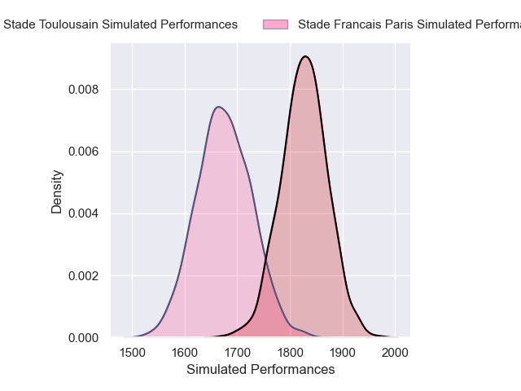
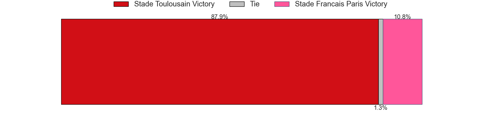
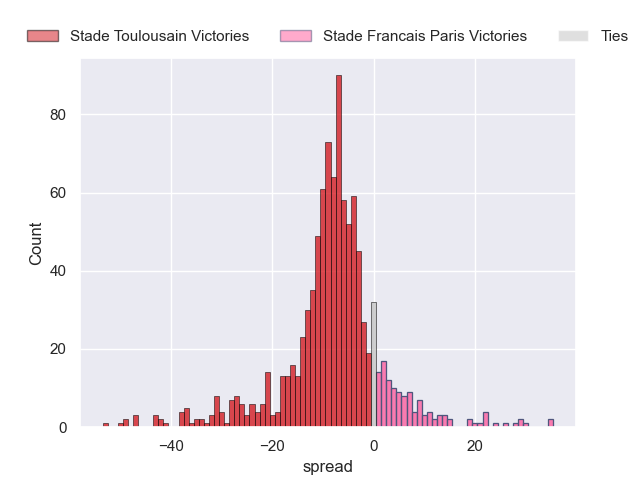

---  
title: "Top 14 Orange 24/25 Status"  
date: 2025-04-14 6:00:00 -0500  
categories: model review projection  
layout: article  
aside:  
    toc: true  
---
# Current Team Rankings

# Standings

## Current Standings

| Club                 |   Played |   Wins |   Point Differential |   Losing Bonus Points |   Try Bonus Points |   Competition Points |
|:---------------------|---------:|-------:|---------------------:|----------------------:|-------------------:|---------------------:|
| Stade Toulousain     |       20 |     14 |                  312 |                     4 |                  8 |                   70 |
| Bordeaux Begles      |       20 |     14 |                  160 |                     5 |                  4 |                   65 |
| Toulon               |       20 |     13 |                  116 |                     4 |                  7 |                   63 |
| Bayonne              |       20 |     12 |                   -6 |                     3 |                  2 |                   53 |
| Castres Olympique    |       20 |     11 |                  -24 |                     3 |                  1 |                   48 |
| Lyon                 |       20 |     10 |                    9 |                     2 |                  2 |                   44 |
| Clermont Auvergne    |       20 |      9 |                  -15 |                     4 |                  4 |                   44 |
| Montpellier Herault  |       20 |      9 |                   38 |                     5 |                  2 |                   43 |
| La Rochelle          |       20 |      8 |                  -69 |                     3 |                  3 |                   40 |
| Racing 92            |       19 |      8 |                  -26 |                     5 |                  0 |                   39 |
| Pau                  |       19 |      8 |                  -92 |                     3 |                  3 |                   38 |
| Stade Francais Paris |       20 |      8 |                 -102 |                     2 |                  2 |                   36 |
| Perpignan            |       20 |      7 |                 -144 |                     2 |                  2 |                   32 |
| Vannes               |       20 |      6 |                 -157 |                     4 |                  0 |                   30 |

## Projected Remaining Table

| Club                 |   Matches Remaining |   Wins |   Point Differential |   Losing Bonus Points |   Try Bonus Points |   Competition Points |
|:---------------------|--------------------:|-------:|---------------------:|----------------------:|-------------------:|---------------------:|
| Stade Toulousain     |                   6 |    5.2 |             62.5619  |                   0.4 |                2   |                 23.1 |
| Bordeaux Begles      |                   6 |    4.5 |             38.3386  |                   0.8 |                1.4 |                 20.1 |
| Toulon               |                   6 |    4   |             20.1451  |                   1.1 |                1.2 |                 18.3 |
| La Rochelle          |                   6 |    3.9 |             16.0265  |                   0.9 |                1   |                 17.3 |
| Clermont Auvergne    |                   6 |    3.1 |              3.05085 |                   1.2 |                0.7 |                 14.4 |
| Bayonne              |                   6 |    3   |              5.07195 |                   1.5 |                0.6 |                 13.9 |
| Castres Olympique    |                   6 |    3.1 |             -6.25341 |                   0.8 |                0.4 |                 13.6 |
| Lyon                 |                   6 |    3   |             -7.46277 |                   1.1 |                0.4 |                 13.5 |
| Racing 92            |                   6 |    3   |             -6.93166 |                   1.2 |                0.4 |                 13.4 |
| Montpellier Herault  |                   6 |    2.7 |             -2.7446  |                   1.7 |                0.8 |                 13.2 |
| Stade Francais Paris |                   6 |    2   |            -22.2231  |                   1.5 |                0.5 |                  9.9 |
| Pau                  |                   6 |    1.8 |            -22.8143  |                   1.9 |                0.3 |                  9.3 |
| Perpignan            |                   6 |    1.7 |            -32.4675  |                   1.2 |                0.2 |                  8   |
| Vannes               |                   6 |    1.3 |            -44.2974  |                   1.3 |                0.2 |                  6.6 |

## Projected Total Table

| Club                 |   Total Matches |   Wins |   Point Differential |   Losing Bonus Points |   Try Bonus Points |   Competition Points |
|:---------------------|----------------:|-------:|---------------------:|----------------------:|-------------------:|---------------------:|
| Stade Toulousain     |              26 |   19.2 |           374.562    |                   4.4 |               10   |                 93.1 |
| Bordeaux Begles      |              26 |   18.5 |           198.339    |                   5.8 |                5.4 |                 85.1 |
| Toulon               |              26 |   17   |           136.145    |                   5.1 |                8.2 |                 81.3 |
| Bayonne              |              26 |   15   |            -0.928051 |                   4.5 |                2.6 |                 66.9 |
| Castres Olympique    |              26 |   14.1 |           -30.2534   |                   3.8 |                1.4 |                 61.6 |
| Clermont Auvergne    |              26 |   12.1 |           -11.9491   |                   5.2 |                4.7 |                 58.4 |
| Lyon                 |              26 |   13   |             1.53723  |                   3.1 |                2.4 |                 57.5 |
| La Rochelle          |              26 |   11.9 |           -52.9735   |                   3.9 |                4   |                 57.3 |
| Montpellier Herault  |              26 |   11.7 |            35.2554   |                   6.7 |                2.8 |                 56.2 |
| Racing 92            |              25 |   11   |           -32.9317   |                   6.2 |                0.4 |                 52.4 |
| Pau                  |              25 |    9.8 |          -114.814    |                   4.9 |                3.3 |                 47.3 |
| Stade Francais Paris |              26 |   10   |          -124.223    |                   3.5 |                2.5 |                 45.9 |
| Perpignan            |              26 |    8.7 |          -176.468    |                   3.2 |                2.2 |                 40   |
| Vannes               |              26 |    7.3 |          -201.297    |                   5.3 |                0.2 |                 36.6 |

# Completed Match Review

| Model | Percent Correct Predictions | Spread Error |
| ------ | ------ | ------ |
| Club Level | 74.8% | 10.1 |
| Player Level: Lineup | 78.2% | 12.4 |
| Player Level: Minutes | 74.5% | 13.3 |

# Future Predictions

## Week 21

### La Rochelle V Bayonne on 2025/04/19

Average Margin: La Rochelle by 5.1

Average Scoreline: 31-26

### Toulon V Clermont Auvergne on 2025/04/19

Average Margin: Toulon by 8.8

Average Scoreline: 32-23

### Perpignan V Racing 92 on 2025/04/19

Average Margin: Perpignan by 0.1

Average Scoreline: 29-29

### Castres Olympique V Vannes on 2025/04/19

Average Margin: Castres Olympique by 9.8

Average Scoreline: 32-23

### Pau V Bordeaux Begles on 2025/04/19

Average Margin: Bordeaux Begles by 4.9

Average Scoreline: 32-27

### Lyon V Montpellier Herault on 2025/04/19

Average Margin: Lyon by 3.3

Average Scoreline: 26-23

### Stade Francais Paris V Stade Toulousain on 2025/04/20

Average Margin: Stade Toulousain by 9.7

Average Scoreline: 39-30

## Week 22

### Stade Toulousain V Castres Olympique on 2025/04/26

Average Margin: Stade Toulousain by 12.9

Average Scoreline: 32-19

### Bordeaux Begles V La Rochelle on 2025/04/26

Average Margin: Bordeaux Begles by 8.4

Average Scoreline: 31-22

### Vannes V Toulon on 2025/04/26

Average Margin: Toulon by 6.9

Average Scoreline: 28-21

### Montpellier Herault V Perpignan on 2025/04/26

Average Margin: Montpellier Herault by 7.6

Average Scoreline: 30-23

### Clermont Auvergne V Lyon on 2025/04/26

Average Margin: Clermont Auvergne by 4.4

Average Scoreline: 26-22

### Racing 92 V Stade Francais Paris on 2025/04/26

Average Margin: Racing 92 by 5.8

Average Scoreline: 26-20

### Bayonne V Pau on 2025/04/26

Average Margin: Bayonne by 6.9

Average Scoreline: 27-20

## Week 23

### Toulon V Stade Toulousain on 2025/05/10

Average Margin: Stade Toulousain by 2.3

Average Scoreline: 31-29

### Montpellier Herault V Bordeaux Begles on 2025/05/10

Average Margin: Bordeaux Begles by 2.8

Average Scoreline: 25-22

### Racing 92 V Bayonne on 2025/05/10

Average Margin: Racing 92 by 2.5

Average Scoreline: 32-29

### Lyon V Pau on 2025/05/10

Average Margin: Lyon by 5.8

Average Scoreline: 29-23

### Vannes V La Rochelle on 2025/05/10

Average Margin: La Rochelle by 3.9

Average Scoreline: 32-28

### Castres Olympique V Clermont Auvergne on 2025/05/10

Average Margin: Castres Olympique by 3.6

Average Scoreline: 24-20

### Perpignan V Stade Francais Paris on 2025/05/10

Average Margin: Perpignan by 2.7

Average Scoreline: 28-25

## Week 24

### Clermont Auvergne V Perpignan on 2025/05/17

Average Margin: Clermont Auvergne by 8.2

Average Scoreline: 29-20

### La Rochelle V Montpellier Herault on 2025/05/17

Average Margin: La Rochelle by 5.3

Average Scoreline: 26-21

### Stade Francais Paris V Lyon on 2025/05/17

Average Margin: Stade Francais Paris by 2.4

Average Scoreline: 29-26

### Bayonne V Vannes on 2025/05/17

Average Margin: Bayonne by 10.2

Average Scoreline: 33-23

### Pau V Toulon on 2025/05/17

Average Margin: Toulon by 3.6

Average Scoreline: 32-29

### Stade Toulousain V Racing 92 on 2025/05/17

Average Margin: Stade Toulousain by 13.8

Average Scoreline: 32-18

### Bordeaux Begles V Castres Olympique on 2025/05/17

Average Margin: Bordeaux Begles by 10.4

Average Scoreline: 32-21

## Week 25

### Stade Toulousain V Lyon on 2025/05/31

Average Margin: Stade Toulousain by 13.9

Average Scoreline: 33-20

### Vannes V Pau on 2025/05/31

Average Margin: Vannes by 1.0

Average Scoreline: 29-28

### La Rochelle V Perpignan on 2025/05/31

Average Margin: La Rochelle by 9.5

Average Scoreline: 28-18

### Toulon V Bordeaux Begles on 2025/05/31

Average Margin: Toulon by 2.7

Average Scoreline: 30-27

### Racing 92 V Montpellier Herault on 2025/05/31

Average Margin: Racing 92 by 2.9

Average Scoreline: 24-22

### Castres Olympique V Bayonne on 2025/05/31

Average Margin: Castres Olympique by 4.0

Average Scoreline: 23-19

### Clermont Auvergne V Stade Francais Paris on 2025/05/31

Average Margin: Clermont Auvergne by 6.8

Average Scoreline: 29-22

## Week 26

### Lyon V Racing 92 on 2025/06/07

Average Margin: Lyon by 4.1

Average Scoreline: 25-21

### Bayonne V Toulon on 2025/06/07

Average Margin: Toulon by 0.4

Average Scoreline: 19-19

### Stade Francais Paris V Castres Olympique on 2025/06/07

Average Margin: Stade Francais Paris by 0.4

Average Scoreline: 24-24

### Bordeaux Begles V Vannes on 2025/06/07

Average Margin: Bordeaux Begles by 14.5

Average Scoreline: 41-26

### Perpignan V Stade Toulousain on 2025/06/07

Average Margin: Stade Toulousain by 10.0

Average Scoreline: 39-29

### Montpellier Herault V Clermont Auvergne on 2025/06/07

Average Margin: Montpellier Herault by 4.1

Average Scoreline: 29-25

### Pau V La Rochelle on 2025/06/07

Average Margin: La Rochelle by 0.6

Average Scoreline: 31-30

