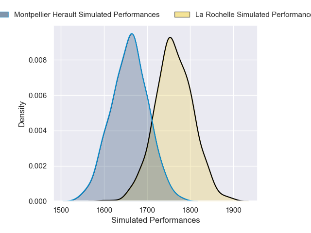
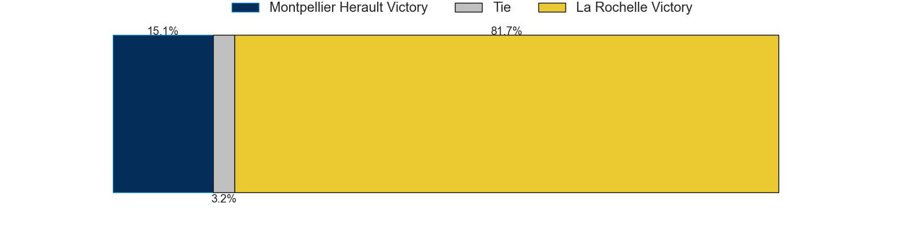
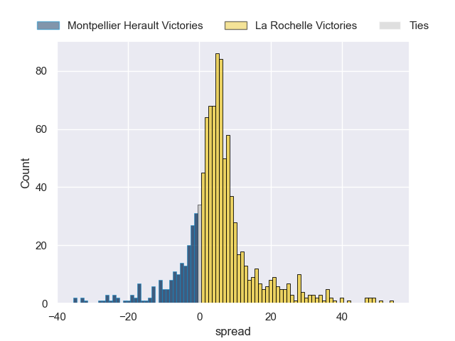
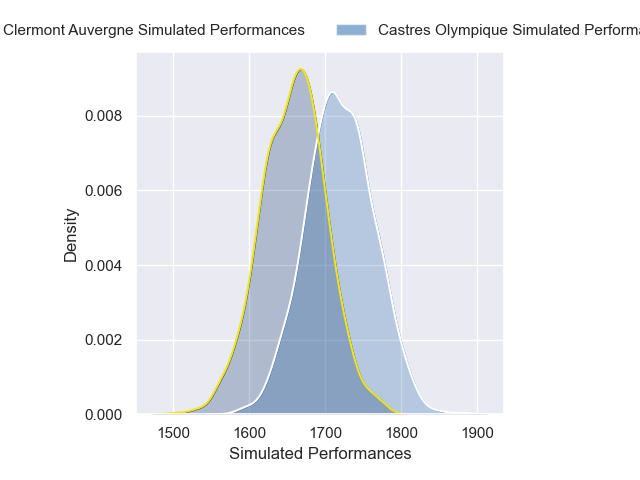
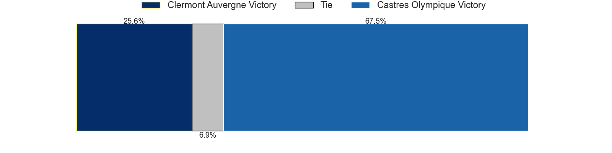
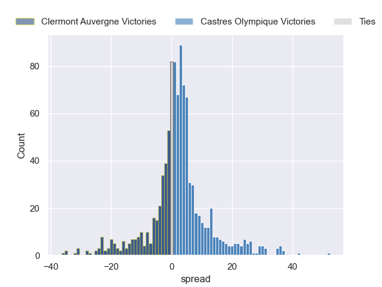

---  
title: "Top 14 Orange 24/25 Status"  
date: 2025-05-16 6:00:00 -0500  
categories: model review projection  
layout: article  
aside:  
    toc: true  
---
# Current Team Rankings

# Standings

## Current Standings

| Club                 |   Played |   Wins |   Point Differential |   Losing Bonus Points |   Try Bonus Points |   Competition Points |
|:---------------------|---------:|-------:|---------------------:|----------------------:|-------------------:|---------------------:|
| Stade Toulousain     |       24 |     17 |                  395 |                     5 |                nan |                   85 |
| Toulon               |       23 |     14 |                   80 |                     4 |                  7 |                   67 |
| Bordeaux Begles      |       23 |     14 |                  109 |                     5 |                  4 |                   65 |
| Bayonne              |       23 |     12 |                  -17 |                     5 |                  2 |                   57 |
| Racing 92            |       24 |     12 |                    6 |                     6 |                nan |                   55 |
| Castres Olympique    |       22 |     12 |                  -51 |                     3 |                  2 |                   53 |
| Lyon                 |       24 |     11 |                   12 |                     4 |                nan |                   52 |
| La Rochelle          |       23 |     11 |                  -56 |                     3 |                  3 |                   52 |
| Clermont Auvergne    |       23 |     10 |                  -10 |                     5 |                nan |                   51 |
| Montpellier Herault  |       23 |     10 |                   48 |                     5 |                  3 |                   50 |
| Pau                  |       23 |     10 |                 -101 |                     4 |                  3 |                   47 |
| Perpignan            |       24 |     10 |                 -116 |                     3 |                nan |                   47 |
| Stade Francais Paris |       24 |      9 |                 -132 |                     3 |                nan |                   41 |
| Vannes               |       23 |      7 |                 -167 |                     5 |                  1 |                   36 |

## Projected Remaining Table

| Club                 |   Matches Remaining |   Wins |   Point Differential |   Losing Bonus Points |   Try Bonus Points |   Competition Points |
|:---------------------|--------------------:|-------:|---------------------:|----------------------:|-------------------:|---------------------:|
| Stade Toulousain     |                   3 |    2.7 |             35.3905  |                   0.1 |                0.9 |                 11.8 |
| Clermont Auvergne    |                   4 |    2.3 |              7.04796 |                   0.9 |                0.6 |                 10.6 |
| La Rochelle          |                   3 |    2.2 |             15.4788  |                   0.4 |                0.7 |                 10   |
| Bordeaux Begles      |                   3 |    2.1 |             18.7191  |                   0.4 |                0.7 |                  9.6 |
| Castres Olympique    |                   4 |    2   |             -3.07413 |                   0.8 |                0.3 |                  9   |
| Toulon               |                   3 |    1.8 |              5.39167 |                   0.7 |                0.6 |                  8.7 |
| Bayonne              |                   3 |    1.6 |              4.26415 |                   0.7 |                0.2 |                  7.3 |
| Pau                  |                   3 |    1.3 |             -2.28106 |                   1   |                0.2 |                  6.5 |
| Stade Francais Paris |                   3 |    1.4 |             -3.41161 |                   0.7 |                0.1 |                  6.3 |
| Lyon                 |                   3 |    1.2 |            -10.9639  |                   0.6 |                0.2 |                  5.8 |
| Montpellier Herault  |                   3 |    1.2 |             -6.32506 |                   0.8 |                0.2 |                  5.7 |
| Racing 92            |                   3 |    1.1 |            -12.4318  |                   0.6 |                0.2 |                  5.3 |
| Vannes               |                   3 |    0.7 |            -21.4127  |                   0.6 |                0.1 |                  3.5 |
| Perpignan            |                   3 |    0.4 |            -26.3919  |                   0.5 |                0   |                  2.1 |

## Projected Total Table

| Club                 |   Total Matches |   Wins |   Point Differential |   Losing Bonus Points |   Try Bonus Points |   Competition Points |
|:---------------------|----------------:|-------:|---------------------:|----------------------:|-------------------:|---------------------:|
| Stade Toulousain     |              27 |   19.7 |            430.39    |                   5.1 |                0.9 |                 96.8 |
| Toulon               |              26 |   15.8 |             85.3917  |                   4.7 |                7.6 |                 75.7 |
| Bordeaux Begles      |              26 |   16.1 |            127.719   |                   5.4 |                4.7 |                 74.6 |
| Bayonne              |              26 |   13.6 |            -12.7359  |                   5.7 |                2.2 |                 64.3 |
| La Rochelle          |              26 |   13.2 |            -40.5212  |                   3.4 |                3.7 |                 62   |
| Castres Olympique    |              26 |   14   |            -54.0741  |                   3.8 |                2.3 |                 62   |
| Clermont Auvergne    |              27 |   12.3 |             -2.95204 |                   5.9 |                0.6 |                 61.6 |
| Racing 92            |              27 |   13.1 |             -6.43176 |                   6.6 |                0.2 |                 60.3 |
| Lyon                 |              27 |   12.2 |              1.03608 |                   4.6 |                0.2 |                 57.8 |
| Montpellier Herault  |              26 |   11.2 |             41.6749  |                   5.8 |                3.2 |                 55.7 |
| Pau                  |              26 |   11.3 |           -103.281   |                   5   |                3.2 |                 53.5 |
| Perpignan            |              27 |   10.4 |           -142.392   |                   3.5 |                0   |                 49.1 |
| Stade Francais Paris |              27 |   10.4 |           -135.412   |                   3.7 |                0.1 |                 47.3 |
| Vannes               |              26 |    7.7 |           -188.413   |                   5.6 |                1.1 |                 39.5 |

# Completed Match Review

| Model | Percent Correct Predictions | Spread Error |
| ------ | ------ | ------ |
| Club Level | 72.4% | 10.0 |
| Player Level: Lineup | 73.8% | 12.7 |
| Player Level: Minutes | 70.5% | 13.4 |

# Future Predictions

## Week 25

### Clermont Auvergne V Perpignan on 2025/05/17

Average Margin: Clermont Auvergne by 7.5

Average Scoreline: 32-25

### Stade Francais Paris V Lyon on 2025/05/17

Average Margin: Stade Francais Paris by 1.2

Average Scoreline: 32-31

### Pau V Toulon on 2025/05/17

Average Margin: Toulon by 2.2

Average Scoreline: 32-30

### Stade Toulousain V Racing 92 on 2025/05/17

Average Margin: Stade Toulousain by 12.9

Average Scoreline: 32-20

### Bayonne V Vannes on 2025/05/17

Average Margin: Bayonne by 8.5

Average Scoreline: 34-25

### Bordeaux Begles V Castres Olympique on 2025/05/17

Average Margin: Bordeaux Begles by 8.7

Average Scoreline: 27-18

### La Rochelle V Montpellier Herault on 2025/05/18

Average Margin: La Rochelle by 5.9

Average Scoreline: 27-21

## Week 26

### Castres Olympique V Clermont Auvergne on 2025/05/24

Average Margin: Castres Olympique by 3.7

Average Scoreline: 30-26

## Week 27

### Stade Toulousain V Lyon on 2025/05/31

Average Margin: Stade Toulousain by 13.1

Average Scoreline: 32-19

### Castres Olympique V Bayonne on 2025/05/31

Average Margin: Castres Olympique by 4.0

Average Scoreline: 28-24

### Clermont Auvergne V Stade Francais Paris on 2025/05/31

Average Margin: Clermont Auvergne by 6.8

Average Scoreline: 28-21

### Vannes V Pau on 2025/05/31

Average Margin: Pau by 0.0

Average Scoreline: 34-34

### La Rochelle V Perpignan on 2025/05/31

Average Margin: La Rochelle by 9.5

Average Scoreline: 29-19

### Toulon V Bordeaux Begles on 2025/05/31

Average Margin: Toulon by 3.0

Average Scoreline: 28-25

### Racing 92 V Montpellier Herault on 2025/05/31

Average Margin: Racing 92 by 3.9

Average Scoreline: 29-26

## Week 28

### Perpignan V Stade Toulousain on 2025/06/07

Average Margin: Stade Toulousain by 9.3

Average Scoreline: 36-27

### Stade Francais Paris V Castres Olympique on 2025/06/07

Average Margin: Stade Francais Paris by 2.2

Average Scoreline: 31-29

### Lyon V Racing 92 on 2025/06/07

Average Margin: Lyon by 3.4

Average Scoreline: 34-30

### Bayonne V Toulon on 2025/06/07

Average Margin: Toulon by 0.2

Average Scoreline: 34-34

### Pau V La Rochelle on 2025/06/07

Average Margin: La Rochelle by 0.0

Average Scoreline: 34-34

### Bordeaux Begles V Vannes on 2025/06/07

Average Margin: Bordeaux Begles by 13.0

Average Scoreline: 33-20

### Montpellier Herault V Clermont Auvergne on 2025/06/07

Average Margin: Montpellier Herault by 3.5

Average Scoreline: 31-27

