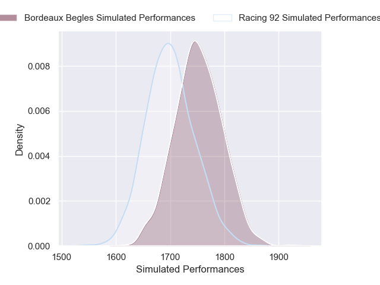
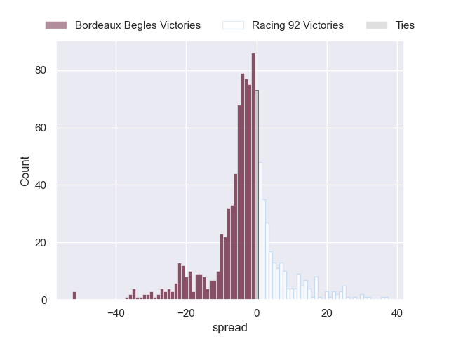

---  
title: "Top 14 Orange 24/25 Status"  
date: 2025-03-28 6:00:00 -0500  
categories: model review projection  
layout: article  
aside:  
    toc: true  
---
# Current Team Rankings

# Standings

## Current Standings

| Club                 |   Played |   Wins |   Point Differential |   Losing Bonus Points |   Try Bonus Points |   Competition Points |
|:---------------------|---------:|-------:|---------------------:|----------------------:|-------------------:|---------------------:|
| Stade Toulousain     |       19 |     13 |                  267 |                     4 |                  7 |                   65 |
| Toulon               |       18 |     13 |                  126 |                     3 |                  7 |                   62 |
| Bordeaux Begles      |       19 |     13 |                  141 |                     4 |                  4 |                   60 |
| Castres Olympique    |       19 |     11 |                  -10 |                     2 |                  1 |                   47 |
| Clermont Auvergne    |       19 |      9 |                   -3 |                     4 |                  4 |                   44 |
| Bayonne              |       19 |     10 |                  -46 |                     3 |                  1 |                   44 |
| Pau                  |       19 |      9 |                  -29 |                     3 |                  3 |                   42 |
| Lyon                 |       18 |      9 |                   15 |                     2 |                  2 |                   40 |
| La Rochelle          |       19 |      8 |                  -55 |                     3 |                  3 |                   40 |
| Stade Francais Paris |       19 |      8 |                  -96 |                     2 |                  2 |                   36 |
| Montpellier Herault  |       19 |      7 |                   16 |                     5 |                  2 |                   35 |
| Racing 92            |       19 |      7 |                  -49 |                     5 |                  0 |                   35 |
| Perpignan            |       20 |      7 |                 -136 |                     2 |                nan |                   34 |
| Vannes               |       20 |      7 |                 -141 |                     4 |                nan |                   32 |

## Projected Remaining Table

| Club                 |   Matches Remaining |   Wins |   Point Differential |   Losing Bonus Points |   Try Bonus Points |   Competition Points |
|:---------------------|--------------------:|-------:|---------------------:|----------------------:|-------------------:|---------------------:|
| Stade Toulousain     |                   7 |    6   |             71.9688  |                   0.5 |                1.9 |                 26.3 |
| Bordeaux Begles      |                   7 |    4.9 |             34.4003  |                   1.1 |                0.9 |                 21.8 |
| Toulon               |                   7 |    4.6 |             20.5941  |                   1.4 |                1.1 |                 21   |
| La Rochelle          |                   7 |    4.2 |             15.1614  |                   1.2 |                0.8 |                 18.9 |
| Clermont Auvergne    |                   7 |    3.9 |              9.966   |                   1.4 |                1   |                 17.9 |
| Montpellier Herault  |                   7 |    3.7 |              6.27066 |                   1.6 |                0.6 |                 16.9 |
| Castres Olympique    |                   7 |    3.7 |             -1.79518 |                   1.1 |                0.5 |                 16.3 |
| Racing 92            |                   7 |    3.3 |            -10.6458  |                   1.5 |                0.3 |                 15   |
| Bayonne              |                   7 |    3.2 |             -4.41344 |                   1.7 |                0.3 |                 14.8 |
| Lyon                 |                   7 |    3.2 |            -11.1005  |                   1.5 |                0.4 |                 14.7 |
| Pau                  |                   7 |    2.3 |            -25.3665  |                   2.1 |                0.4 |                 11.7 |
| Stade Francais Paris |                   7 |    2.1 |            -28.6007  |                   1.9 |                0.3 |                 10.6 |
| Vannes               |                   7 |    1.9 |            -38.038   |                   1.6 |                0.2 |                  9.6 |
| Perpignan            |                   7 |    2   |            -38.401   |                   1.4 |                0.3 |                  9.6 |

## Projected Total Table

| Club                 |   Total Matches |   Wins |   Point Differential |   Losing Bonus Points |   Try Bonus Points |   Competition Points |
|:---------------------|----------------:|-------:|---------------------:|----------------------:|-------------------:|---------------------:|
| Stade Toulousain     |              26 |   19   |            338.969   |                   4.5 |                8.9 |                 91.3 |
| Toulon               |              25 |   17.6 |            146.594   |                   4.4 |                8.1 |                 83   |
| Bordeaux Begles      |              26 |   17.9 |            175.4     |                   5.1 |                4.9 |                 81.8 |
| Castres Olympique    |              26 |   14.7 |            -11.7952  |                   3.1 |                1.5 |                 63.3 |
| Clermont Auvergne    |              26 |   12.9 |              6.966   |                   5.4 |                5   |                 61.9 |
| La Rochelle          |              26 |   12.2 |            -39.8386  |                   4.2 |                3.8 |                 58.9 |
| Bayonne              |              26 |   13.2 |            -50.4134  |                   4.7 |                1.3 |                 58.8 |
| Lyon                 |              25 |   12.2 |              3.89949 |                   3.5 |                2.4 |                 54.7 |
| Pau                  |              26 |   11.3 |            -54.3665  |                   5.1 |                3.4 |                 53.7 |
| Montpellier Herault  |              26 |   10.7 |             22.2707  |                   6.6 |                2.6 |                 51.9 |
| Racing 92            |              26 |   10.3 |            -59.6458  |                   6.5 |                0.3 |                 50   |
| Stade Francais Paris |              26 |   10.1 |           -124.601   |                   3.9 |                2.3 |                 46.6 |
| Perpignan            |              27 |    9   |           -174.401   |                   3.4 |                0.3 |                 43.6 |
| Vannes               |              27 |    8.9 |           -179.038   |                   5.6 |                0.2 |                 41.6 |

# Completed Match Review

| Model | Percent Correct Predictions | Spread Error |
| ------ | ------ | ------ |
| Club Level | 72.9% | 10.6 |
| Player Level: Lineup | 76.5% | 12.8 |
| Player Level: Minutes | 74.5% | 13.2 |

# Future Predictions

## Week 21

### Clermont Auvergne V La Rochelle on 2025/03/29

Average Margin: Clermont Auvergne by 2.7

Average Scoreline: 32-29

### Vannes V Perpignan on 2025/03/29

Average Margin: Vannes by 3.0

Average Scoreline: 30-27

### Castres Olympique V Toulon on 2025/03/29

Average Margin: Toulon by 0.3

Average Scoreline: 32-32

### Montpellier Herault V Stade Francais Paris on 2025/03/29

Average Margin: Montpellier Herault by 7.4

Average Scoreline: 26-18

### Bayonne V Lyon on 2025/03/29

Average Margin: Bayonne by 3.4

Average Scoreline: 28-25

### Stade Toulousain V Pau on 2025/03/29

Average Margin: Stade Toulousain by 12.7

Average Scoreline: 30-17

### Racing 92 V Bordeaux Begles on 2025/03/30

Average Margin: Bordeaux Begles by 3.4

Average Scoreline: 26-22

## Week 22

### Perpignan V Racing 92 on 2025/04/19

Average Margin: Perpignan by 0.7

Average Scoreline: 31-30

### Pau V Bordeaux Begles on 2025/04/19

Average Margin: Bordeaux Begles by 3.2

Average Scoreline: 35-32

### Castres Olympique V Vannes on 2025/04/19

Average Margin: Castres Olympique by 10.1

Average Scoreline: 31-21

### Stade Francais Paris V Stade Toulousain on 2025/04/19

Average Margin: Stade Toulousain by 9.3

Average Scoreline: 36-27

### La Rochelle V Bayonne on 2025/04/19

Average Margin: La Rochelle by 7.4

Average Scoreline: 25-18

### Lyon V Montpellier Herault on 2025/04/19

Average Margin: Lyon by 3.4

Average Scoreline: 30-27

### Toulon V Clermont Auvergne on 2025/04/19

Average Margin: Toulon by 7.0

Average Scoreline: 26-19

## Week 23

### Vannes V Toulon on 2025/04/26

Average Margin: Toulon by 5.9

Average Scoreline: 38-32

### Clermont Auvergne V Lyon on 2025/04/26

Average Margin: Clermont Auvergne by 5.0

Average Scoreline: 26-21

### Bayonne V Pau on 2025/04/26

Average Margin: Bayonne by 3.8

Average Scoreline: 30-26

### Montpellier Herault V Perpignan on 2025/04/26

Average Margin: Montpellier Herault by 8.5

Average Scoreline: 26-18

### Racing 92 V Stade Francais Paris on 2025/04/26

Average Margin: Racing 92 by 5.2

Average Scoreline: 27-22

### Stade Toulousain V Castres Olympique on 2025/04/26

Average Margin: Stade Toulousain by 12.1

Average Scoreline: 29-17

### Bordeaux Begles V La Rochelle on 2025/04/26

Average Margin: Bordeaux Begles by 7.6

Average Scoreline: 28-20

## Week 24

### Vannes V La Rochelle on 2025/05/10

Average Margin: La Rochelle by 3.1

Average Scoreline: 36-33

### Perpignan V Stade Francais Paris on 2025/05/10

Average Margin: Perpignan by 1.9

Average Scoreline: 31-29

### Castres Olympique V Clermont Auvergne on 2025/05/10

Average Margin: Castres Olympique by 3.9

Average Scoreline: 32-28

### Lyon V Pau on 2025/05/10

Average Margin: Lyon by 4.6

Average Scoreline: 27-22

### Racing 92 V Bayonne on 2025/05/10

Average Margin: Racing 92 by 4.1

Average Scoreline: 27-23

### Toulon V Stade Toulousain on 2025/05/10

Average Margin: Stade Toulousain by 1.1

Average Scoreline: 30-29

### Montpellier Herault V Bordeaux Begles on 2025/05/10

Average Margin: Bordeaux Begles by 2.0

Average Scoreline: 28-26

## Week 25

### Stade Toulousain V Racing 92 on 2025/05/17

Average Margin: Stade Toulousain by 14.0

Average Scoreline: 30-16

### Bordeaux Begles V Castres Olympique on 2025/05/17

Average Margin: Bordeaux Begles by 8.7

Average Scoreline: 25-17

### Clermont Auvergne V Perpignan on 2025/05/17

Average Margin: Clermont Auvergne by 9.3

Average Scoreline: 30-21

### Pau V Toulon on 2025/05/17

Average Margin: Toulon by 2.4

Average Scoreline: 34-32

### Bayonne V Vannes on 2025/05/17

Average Margin: Bayonne by 8.3

Average Scoreline: 29-21

### La Rochelle V Montpellier Herault on 2025/05/17

Average Margin: La Rochelle by 5.5

Average Scoreline: 27-21

### Stade Francais Paris V Lyon on 2025/05/17

Average Margin: Stade Francais Paris by 2.0

Average Scoreline: 30-28

## Week 26

### Castres Olympique V Bayonne on 2025/05/31

Average Margin: Castres Olympique by 5.9

Average Scoreline: 24-18

### Racing 92 V Montpellier Herault on 2025/05/31

Average Margin: Racing 92 by 2.4

Average Scoreline: 30-28

### Toulon V Bordeaux Begles on 2025/05/31

Average Margin: Toulon by 3.7

Average Scoreline: 29-26

### Vannes V Pau on 2025/05/31

Average Margin: Pau by 0.5

Average Scoreline: 31-30

### La Rochelle V Perpignan on 2025/05/31

Average Margin: La Rochelle by 10.4

Average Scoreline: 29-19

### Clermont Auvergne V Stade Francais Paris on 2025/05/31

Average Margin: Clermont Auvergne by 7.5

Average Scoreline: 29-21

### Stade Toulousain V Lyon on 2025/05/31

Average Margin: Stade Toulousain by 13.0

Average Scoreline: 30-17

## Week 27

### Bayonne V Toulon on 2025/06/07

Average Margin: Toulon by 2.5

Average Scoreline: 30-28

### Pau V La Rochelle on 2025/06/07

Average Margin: Pau by 0.9

Average Scoreline: 30-29

### Perpignan V Stade Toulousain on 2025/06/07

Average Margin: Stade Toulousain by 9.8

Average Scoreline: 40-30

### Montpellier Herault V Clermont Auvergne on 2025/06/07

Average Margin: Montpellier Herault by 3.7

Average Scoreline: 31-27

### Bordeaux Begles V Vannes on 2025/06/07

Average Margin: Bordeaux Begles by 13.2

Average Scoreline: 32-19

### Lyon V Racing 92 on 2025/06/07

Average Margin: Lyon by 4.2

Average Scoreline: 30-26

### Stade Francais Paris V Castres Olympique on 2025/06/07

Average Margin: Stade Francais Paris by 0.6

Average Scoreline: 32-31

