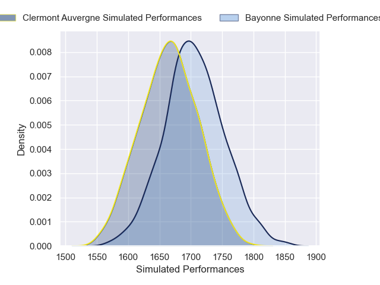
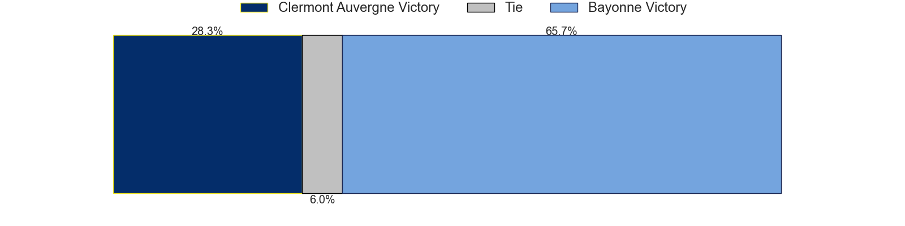
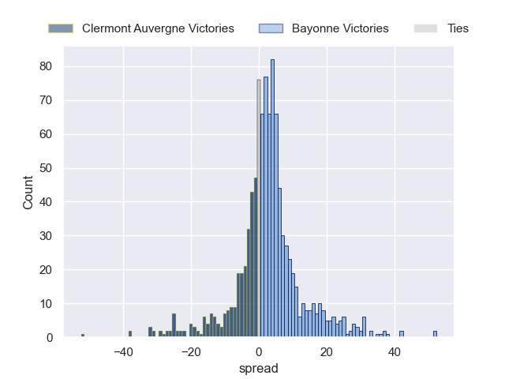

---  
title: "Top 14 Orange 24/25 Status"  
date: 2025-02-24 6:00:00 -0500  
categories: model review projection  
layout: article  
aside:  
    toc: true  
---
# Current Team Rankings

# Standings

## Current Standings

| Club                 |   Played |   Wins |   Point Differential |   Losing Bonus Points |   Try Bonus Points |   Competition Points |
|:---------------------|---------:|-------:|---------------------:|----------------------:|-------------------:|---------------------:|
| Stade Toulousain     |       17 |     12 |                  233 |                     4 |                  6 |                   60 |
| Toulon               |       17 |     12 |                  105 |                     3 |                  6 |                   57 |
| Bordeaux Begles      |       17 |     12 |                  145 |                     4 |                  4 |                   56 |
| Bayonne              |       17 |     10 |                  -29 |                     2 |                  1 |                   43 |
| Castres Olympique    |       17 |      9 |                  -22 |                     2 |                  1 |                   41 |
| Clermont Auvergne    |       17 |      8 |                  -14 |                     3 |                  4 |                   39 |
| La Rochelle          |       17 |      8 |                  -50 |                     2 |                  3 |                   37 |
| Lyon                 |       17 |      8 |                    0 |                     2 |                  2 |                   36 |
| Montpellier Herault  |       17 |      7 |                   30 |                     4 |                  2 |                   34 |
| Racing 92            |       17 |      6 |                  -33 |                     5 |                  0 |                   31 |
| Pau                  |       16 |      6 |                  -66 |                     3 |                  3 |                   30 |
| Perpignan            |       16 |      6 |                  -94 |                     2 |                  2 |                   30 |
| Vannes               |       17 |      6 |                 -100 |                     4 |                  0 |                   28 |
| Stade Francais Paris |       17 |      6 |                 -105 |                     2 |                  2 |                   28 |

## Projected Remaining Table

| Club                 |   Matches Remaining |   Wins |   Point Differential |   Losing Bonus Points |   Try Bonus Points |   Competition Points |
|:---------------------|--------------------:|-------:|---------------------:|----------------------:|-------------------:|---------------------:|
| Stade Toulousain     |                   9 |    7.5 |             92.6452  |                   0.8 |                2.4 |                 33   |
| Bordeaux Begles      |                   9 |    6.3 |             43.7693  |                   1.5 |                1.6 |                 28.4 |
| Toulon               |                   9 |    6   |             33.7035  |                   1.7 |                1.8 |                 27.5 |
| La Rochelle          |                   9 |    5.8 |             26.7785  |                   1.6 |                1.3 |                 26.1 |
| Montpellier Herault  |                   9 |    5   |             11.9889  |                   2   |                1.3 |                 23.2 |
| Clermont Auvergne    |                   9 |    4.9 |              9.07536 |                   1.9 |                1   |                 22.4 |
| Bayonne              |                   9 |    4.5 |              2.36778 |                   2.1 |                0.5 |                 20.8 |
| Lyon                 |                   9 |    4.4 |             -6.03859 |                   1.9 |                0.5 |                 20.1 |
| Racing 92            |                   9 |    4.4 |             -8.13939 |                   1.9 |                0.6 |                 19.9 |
| Castres Olympique    |                   9 |    3.9 |            -17.559   |                   1.8 |                0.6 |                 17.9 |
| Stade Francais Paris |                   9 |    3.1 |            -28.8795  |                   2.4 |                0.4 |                 15.3 |
| Pau                  |                   9 |    2.7 |            -38.3259  |                   2.7 |                0.6 |                 14.3 |
| Perpignan            |                   9 |    2.2 |            -57.156   |                   1.9 |                0.3 |                 11.1 |
| Vannes               |                   9 |    2.2 |            -64.2303  |                   1.8 |                0.3 |                 11   |

## Projected Total Table

| Club                 |   Total Matches |   Wins |   Point Differential |   Losing Bonus Points |   Try Bonus Points |   Competition Points |
|:---------------------|----------------:|-------:|---------------------:|----------------------:|-------------------:|---------------------:|
| Stade Toulousain     |              26 |   19.5 |            325.645   |                   4.8 |                8.4 |                 93   |
| Toulon               |              26 |   18   |            138.704   |                   4.7 |                7.8 |                 84.5 |
| Bordeaux Begles      |              26 |   18.3 |            188.769   |                   5.5 |                5.6 |                 84.4 |
| Bayonne              |              26 |   14.5 |            -26.6322  |                   4.1 |                1.5 |                 63.8 |
| La Rochelle          |              26 |   13.8 |            -23.2215  |                   3.6 |                4.3 |                 63.1 |
| Clermont Auvergne    |              26 |   12.9 |             -4.92464 |                   4.9 |                5   |                 61.4 |
| Castres Olympique    |              26 |   12.9 |            -39.559   |                   3.8 |                1.6 |                 58.9 |
| Montpellier Herault  |              26 |   12   |             41.9889  |                   6   |                3.3 |                 57.2 |
| Lyon                 |              26 |   12.4 |             -6.03859 |                   3.9 |                2.5 |                 56.1 |
| Racing 92            |              26 |   10.4 |            -41.1394  |                   6.9 |                0.6 |                 50.9 |
| Pau                  |              25 |    8.7 |           -104.326   |                   5.7 |                3.6 |                 44.3 |
| Stade Francais Paris |              26 |    9.1 |           -133.879   |                   4.4 |                2.4 |                 43.3 |
| Perpignan            |              25 |    8.2 |           -151.156   |                   3.9 |                2.3 |                 41.1 |
| Vannes               |              26 |    8.2 |           -164.23    |                   5.8 |                0.3 |                 39   |

# Completed Match Review

| Model | Percent Correct Predictions | Spread Error |
| ------ | ------ | ------ |
| Club Level | 75.4% | 10.5 |
| Player Level: Lineup | 69.2% | 13.4 |
| Player Level: Minutes | 68.6% | 14.1 |

# Future Predictions

## Week 18

### Perpignan V Bordeaux Begles on 2025/03/01

Average Margin: Bordeaux Begles by 6.4

Average Scoreline: 39-33

### Stade Francais Paris V La Rochelle on 2025/03/01

Average Margin: La Rochelle by 1.5

Average Scoreline: 32-30

### Stade Toulousain V Vannes on 2025/03/01

Average Margin: Stade Toulousain by 17.7

Average Scoreline: 42-24

### Montpellier Herault V Castres Olympique on 2025/03/01

Average Margin: Montpellier Herault by 4.8

Average Scoreline: 31-26

### Racing 92 V Pau on 2025/03/01

Average Margin: Racing 92 by 4.3

Average Scoreline: 27-22

### Lyon V Toulon on 2025/03/01

Average Margin: Toulon by 2.0

Average Scoreline: 32-30

### Bayonne V Clermont Auvergne on 2025/03/02

Average Margin: Bayonne by 2.8

Average Scoreline: 30-27

## Week 19

### Pau V Montpellier Herault on 2025/03/22

Average Margin: Pau by 0.5

Average Scoreline: 32-31

### Bordeaux Begles V Stade Toulousain on 2025/03/22

Average Margin: Stade Toulousain by 0.4

Average Scoreline: 31-31

### Lyon V Vannes on 2025/03/22

Average Margin: Lyon by 8.6

Average Scoreline: 35-27

### Toulon V Perpignan on 2025/03/22

Average Margin: Toulon by 12.6

Average Scoreline: 35-22

### Clermont Auvergne V Racing 92 on 2025/03/22

Average Margin: Clermont Auvergne by 4.5

Average Scoreline: 30-26

### La Rochelle V Castres Olympique on 2025/03/22

Average Margin: La Rochelle by 6.2

Average Scoreline: 28-22

### Stade Francais Paris V Bayonne on 2025/03/22

Average Margin: Stade Francais Paris by 1.9

Average Scoreline: 29-27

## Week 20

### Vannes V Perpignan on 2025/03/29

Average Margin: Vannes by 3.1

Average Scoreline: 32-29

### Racing 92 V Bordeaux Begles on 2025/03/29

Average Margin: Bordeaux Begles by 3.5

Average Scoreline: 32-29

### Castres Olympique V Toulon on 2025/03/29

Average Margin: Toulon by 0.1

Average Scoreline: 32-32

### Bayonne V Lyon on 2025/03/29

Average Margin: Bayonne by 3.7

Average Scoreline: 35-31

### Clermont Auvergne V La Rochelle on 2025/03/29

Average Margin: Clermont Auvergne by 2.2

Average Scoreline: 34-32

### Montpellier Herault V Stade Francais Paris on 2025/03/29

Average Margin: Montpellier Herault by 7.2

Average Scoreline: 31-24

### Stade Toulousain V Pau on 2025/03/29

Average Margin: Stade Toulousain by 14.5

Average Scoreline: 33-18

## Week 21

### Perpignan V Racing 92 on 2025/04/19

Average Margin: Perpignan by 0.7

Average Scoreline: 30-29

### La Rochelle V Bayonne on 2025/04/19

Average Margin: La Rochelle by 7.0

Average Scoreline: 28-21

### Stade Francais Paris V Stade Toulousain on 2025/04/19

Average Margin: Stade Toulousain by 8.6

Average Scoreline: 38-30

### Pau V Bordeaux Begles on 2025/04/19

Average Margin: Bordeaux Begles by 4.5

Average Scoreline: 35-31

### Toulon V Clermont Auvergne on 2025/04/19

Average Margin: Toulon by 7.9

Average Scoreline: 28-20

### Castres Olympique V Vannes on 2025/04/19

Average Margin: Castres Olympique by 9.5

Average Scoreline: 36-26

### Lyon V Montpellier Herault on 2025/04/19

Average Margin: Lyon by 2.3

Average Scoreline: 28-26

## Week 22

### Racing 92 V Stade Francais Paris on 2025/04/26

Average Margin: Racing 92 by 5.9

Average Scoreline: 26-21

### Vannes V Toulon on 2025/04/26

Average Margin: Toulon by 5.8

Average Scoreline: 38-32

### Stade Toulousain V Castres Olympique on 2025/04/26

Average Margin: Stade Toulousain by 13.0

Average Scoreline: 35-22

### Bordeaux Begles V La Rochelle on 2025/04/26

Average Margin: Bordeaux Begles by 7.5

Average Scoreline: 28-20

### Bayonne V Pau on 2025/04/26

Average Margin: Bayonne by 5.1

Average Scoreline: 28-23

### Montpellier Herault V Perpignan on 2025/04/26

Average Margin: Montpellier Herault by 8.7

Average Scoreline: 32-24

### Clermont Auvergne V Lyon on 2025/04/26

Average Margin: Clermont Auvergne by 5.3

Average Scoreline: 32-27

## Week 23

### Toulon V Stade Toulousain on 2025/05/10

Average Margin: Stade Toulousain by 2.1

Average Scoreline: 30-27

### Perpignan V Stade Francais Paris on 2025/05/10

Average Margin: Perpignan by 3.0

Average Scoreline: 27-24

### Racing 92 V Bayonne on 2025/05/10

Average Margin: Racing 92 by 3.9

Average Scoreline: 28-24

### Montpellier Herault V Bordeaux Begles on 2025/05/10

Average Margin: Bordeaux Begles by 1.4

Average Scoreline: 33-31

### Lyon V Pau on 2025/05/10

Average Margin: Lyon by 5.1

Average Scoreline: 29-24

### Castres Olympique V Clermont Auvergne on 2025/05/10

Average Margin: Castres Olympique by 4.0

Average Scoreline: 29-25

### Vannes V La Rochelle on 2025/05/10

Average Margin: La Rochelle by 4.4

Average Scoreline: 36-32

## Week 24

### Clermont Auvergne V Perpignan on 2025/05/17

Average Margin: Clermont Auvergne by 8.7

Average Scoreline: 34-25

### Stade Toulousain V Racing 92 on 2025/05/17

Average Margin: Stade Toulousain by 13.0

Average Scoreline: 36-23

### Bordeaux Begles V Castres Olympique on 2025/05/17

Average Margin: Bordeaux Begles by 10.0

Average Scoreline: 26-16

### La Rochelle V Montpellier Herault on 2025/05/17

Average Margin: La Rochelle by 5.8

Average Scoreline: 25-19

### Pau V Toulon on 2025/05/17

Average Margin: Toulon by 3.3

Average Scoreline: 35-32

### Stade Francais Paris V Lyon on 2025/05/17

Average Margin: Stade Francais Paris by 1.6

Average Scoreline: 27-26

### Bayonne V Vannes on 2025/05/17

Average Margin: Bayonne by 8.8

Average Scoreline: 33-24

## Week 25

### Clermont Auvergne V Stade Francais Paris on 2025/05/31

Average Margin: Clermont Auvergne by 7.2

Average Scoreline: 33-26

### Stade Toulousain V Lyon on 2025/05/31

Average Margin: Stade Toulousain by 12.6

Average Scoreline: 38-25

### Toulon V Bordeaux Begles on 2025/05/31

Average Margin: Toulon by 2.8

Average Scoreline: 27-24

### Racing 92 V Montpellier Herault on 2025/05/31

Average Margin: Racing 92 by 2.9

Average Scoreline: 28-26

### Castres Olympique V Bayonne on 2025/05/31

Average Margin: Castres Olympique by 4.1

Average Scoreline: 27-23

### La Rochelle V Perpignan on 2025/05/31

Average Margin: La Rochelle by 10.7

Average Scoreline: 29-19

### Vannes V Pau on 2025/05/31

Average Margin: Vannes by 1.1

Average Scoreline: 30-29

## Week 26

### Perpignan V Stade Toulousain on 2025/06/07

Average Margin: Stade Toulousain by 10.7

Average Scoreline: 38-27

### Lyon V Racing 92 on 2025/06/07

Average Margin: Lyon by 3.4

Average Scoreline: 34-30

### Bayonne V Toulon on 2025/06/07

Average Margin: Toulon by 1.3

Average Scoreline: 30-29

### Bordeaux Begles V Vannes on 2025/06/07

Average Margin: Bordeaux Begles by 13.8

Average Scoreline: 36-23

### Pau V La Rochelle on 2025/06/07

Average Margin: La Rochelle by 0.9

Average Scoreline: 29-28

### Stade Francais Paris V Castres Olympique on 2025/06/07

Average Margin: Stade Francais Paris by 1.0

Average Scoreline: 26-25

### Montpellier Herault V Clermont Auvergne on 2025/06/07

Average Margin: Montpellier Herault by 4.1

Average Scoreline: 28-24

