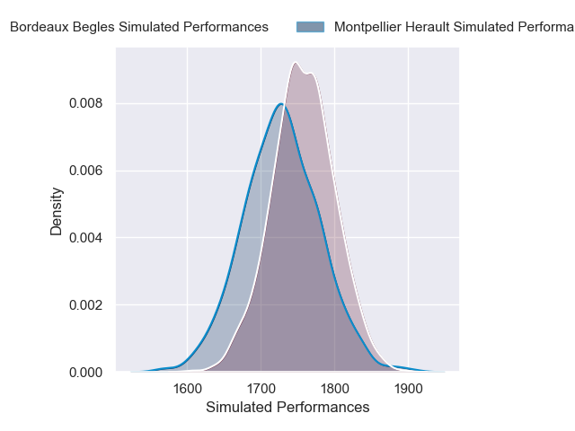
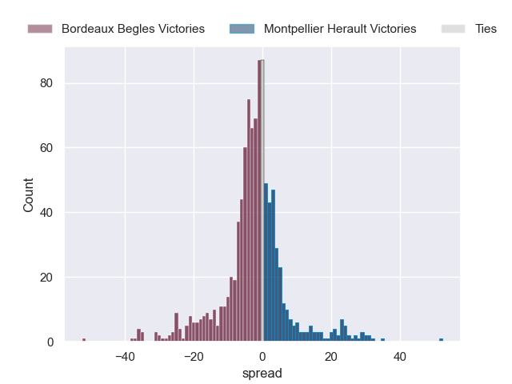

---  
title: "Top 14 Orange 24/25 Status"  
date: 2025-05-05 6:00:00 -0500  
categories: model review projection  
layout: article  
aside:  
    toc: true  
---
# Current Team Rankings

# Standings

## Current Standings

| Club                 |   Played |   Wins |   Point Differential |   Losing Bonus Points |   Try Bonus Points |   Competition Points |
|:---------------------|---------:|-------:|---------------------:|----------------------:|-------------------:|---------------------:|
| Stade Toulousain     |       22 |     15 |                  316 |                     5 |                  9 |                   76 |
| Bordeaux Begles      |       22 |     15 |                  153 |                     5 |                  4 |                   69 |
| Toulon               |       22 |     14 |                  122 |                     5 |                  7 |                   68 |
| Bayonne              |       22 |     13 |                  -11 |                     4 |                  2 |                   58 |
| Castres Olympique    |       22 |     13 |                   -3 |                     3 |                  2 |                   57 |
| Lyon                 |       22 |     11 |                   14 |                     3 |                  2 |                   49 |
| Clermont Auvergne    |       22 |     10 |                  -10 |                     5 |                  4 |                   49 |
| La Rochelle          |       22 |     10 |                  -57 |                     3 |                  3 |                   48 |
| Montpellier Herault  |       22 |     10 |                   35 |                     5 |                  2 |                   47 |
| Racing 92            |       22 |      9 |                  -23 |                     6 |                  1 |                   45 |
| Pau                  |       22 |      9 |                  -83 |                     5 |                  3 |                   44 |
| Stade Francais Paris |       22 |      8 |                 -133 |                     2 |                  2 |                   36 |
| Perpignan            |       22 |      8 |                 -146 |                     2 |                  2 |                   36 |
| Vannes               |       22 |      7 |                 -174 |                     4 |                  1 |                   35 |

## Projected Remaining Table

| Club                 |   Matches Remaining |   Wins |   Point Differential |   Losing Bonus Points |   Try Bonus Points |   Competition Points |
|:---------------------|--------------------:|-------:|---------------------:|----------------------:|-------------------:|---------------------:|
| Stade Toulousain     |                   4 |    3.4 |             38.216   |                   0.3 |                0.7 |                 14.5 |
| La Rochelle          |                   4 |    2.9 |             20.2404  |                   0.6 |                0.6 |                 12.8 |
| Bordeaux Begles      |                   4 |    2.8 |             24.8157  |                   0.6 |                0.6 |                 12.6 |
| Toulon               |                   4 |    2.3 |              5.48506 |                   1   |                0.4 |                 10.6 |
| Clermont Auvergne    |                   4 |    2.2 |              8.41402 |                   0.8 |                0.4 |                 10.2 |
| Castres Olympique    |                   4 |    2.1 |             -2.01091 |                   0.7 |                0.3 |                  9.3 |
| Lyon                 |                   4 |    2.1 |             -5.69674 |                   0.6 |                0.2 |                  9.2 |
| Bayonne              |                   4 |    1.7 |             -1.84736 |                   1   |                0.2 |                  8.2 |
| Racing 92            |                   4 |    1.8 |             -7.73108 |                   0.8 |                0.1 |                  8.2 |
| Stade Francais Paris |                   4 |    1.6 |             -7.7462  |                   1.1 |                0.2 |                  7.8 |
| Montpellier Herault  |                   4 |    1.6 |             -8.00215 |                   1.1 |                0.2 |                  7.6 |
| Pau                  |                   4 |    1.5 |             -9.38132 |                   1.2 |                0.3 |                  7.4 |
| Vannes               |                   4 |    1   |            -26.328   |                   0.9 |                0.1 |                  5   |
| Perpignan            |                   4 |    0.9 |            -28.4273  |                   0.6 |                0.1 |                  4.5 |

## Projected Total Table

| Club                 |   Total Matches |   Wins |   Point Differential |   Losing Bonus Points |   Try Bonus Points |   Competition Points |
|:---------------------|----------------:|-------:|---------------------:|----------------------:|-------------------:|---------------------:|
| Stade Toulousain     |              26 |   18.4 |            354.216   |                   5.3 |                9.7 |                 90.5 |
| Bordeaux Begles      |              26 |   17.8 |            177.816   |                   5.6 |                4.6 |                 81.6 |
| Toulon               |              26 |   16.3 |            127.485   |                   6   |                7.4 |                 78.6 |
| Castres Olympique    |              26 |   15.1 |             -5.01091 |                   3.7 |                2.3 |                 66.3 |
| Bayonne              |              26 |   14.7 |            -12.8474  |                   5   |                2.2 |                 66.2 |
| La Rochelle          |              26 |   12.9 |            -36.7596  |                   3.6 |                3.6 |                 60.8 |
| Clermont Auvergne    |              26 |   12.2 |             -1.58598 |                   5.8 |                4.4 |                 59.2 |
| Lyon                 |              26 |   13.1 |              8.30326 |                   3.6 |                2.2 |                 58.2 |
| Montpellier Herault  |              26 |   11.6 |             26.9978  |                   6.1 |                2.2 |                 54.6 |
| Racing 92            |              26 |   10.8 |            -30.7311  |                   6.8 |                1.1 |                 53.2 |
| Pau                  |              26 |   10.5 |            -92.3813  |                   6.2 |                3.3 |                 51.4 |
| Stade Francais Paris |              26 |    9.6 |           -140.746   |                   3.1 |                2.2 |                 43.8 |
| Perpignan            |              26 |    8.9 |           -174.427   |                   2.6 |                2.1 |                 40.5 |
| Vannes               |              26 |    8   |           -200.328   |                   4.9 |                1.1 |                 40   |

# Completed Match Review

| Model | Percent Correct Predictions | Spread Error |
| ------ | ------ | ------ |
| Club Level | 74.7% | 9.8 |
| Player Level: Lineup | 80.0% | 11.9 |
| Player Level: Minutes | 75.0% | 12.9 |

# Future Predictions

## Week 23

### Castres Olympique V Clermont Auvergne on 2025/05/10

Average Margin: Castres Olympique by 4.0

Average Scoreline: 28-24

### Lyon V Pau on 2025/05/10

Average Margin: Lyon by 5.6

Average Scoreline: 28-23

### Racing 92 V Bayonne on 2025/05/10

Average Margin: Racing 92 by 4.6

Average Scoreline: 29-25

### Vannes V La Rochelle on 2025/05/10

Average Margin: La Rochelle by 3.5

Average Scoreline: 30-26

### Perpignan V Stade Francais Paris on 2025/05/10

Average Margin: Perpignan by 2.4

Average Scoreline: 27-25

### Toulon V Stade Toulousain on 2025/05/10

Average Margin: Stade Toulousain by 1.2

Average Scoreline: 32-31

### Montpellier Herault V Bordeaux Begles on 2025/05/11

Average Margin: Bordeaux Begles by 2.4

Average Scoreline: 32-29

## Week 24

### Stade Toulousain V Racing 92 on 2025/05/17

Average Margin: Stade Toulousain by 12.4

Average Scoreline: 34-21

### La Rochelle V Montpellier Herault on 2025/05/17

Average Margin: La Rochelle by 5.8

Average Scoreline: 27-21

### Stade Francais Paris V Lyon on 2025/05/17

Average Margin: Stade Francais Paris by 0.9

Average Scoreline: 23-22

### Bayonne V Vannes on 2025/05/17

Average Margin: Bayonne by 8.9

Average Scoreline: 33-24

### Clermont Auvergne V Perpignan on 2025/05/17

Average Margin: Clermont Auvergne by 9.1

Average Scoreline: 30-21

### Pau V Toulon on 2025/05/17

Average Margin: Toulon by 3.4

Average Scoreline: 34-31

### Bordeaux Begles V Castres Olympique on 2025/05/17

Average Margin: Bordeaux Begles by 10.1

Average Scoreline: 32-22

## Week 25

### Vannes V Pau on 2025/05/31

Average Margin: Vannes by 0.4

Average Scoreline: 23-23

### Clermont Auvergne V Stade Francais Paris on 2025/05/31

Average Margin: Clermont Auvergne by 7.1

Average Scoreline: 29-22

### Toulon V Bordeaux Begles on 2025/05/31

Average Margin: Toulon by 2.1

Average Scoreline: 28-26

### Racing 92 V Montpellier Herault on 2025/05/31

Average Margin: Racing 92 by 3.6

Average Scoreline: 28-24

### Castres Olympique V Bayonne on 2025/05/31

Average Margin: Castres Olympique by 4.9

Average Scoreline: 27-22

### Stade Toulousain V Lyon on 2025/05/31

Average Margin: Stade Toulousain by 13.8

Average Scoreline: 36-22

### La Rochelle V Perpignan on 2025/05/31

Average Margin: La Rochelle by 10.9

Average Scoreline: 31-20

## Week 26

### Bayonne V Toulon on 2025/06/07

Average Margin: Toulon by 1.3

Average Scoreline: 35-33

### Montpellier Herault V Clermont Auvergne on 2025/06/07

Average Margin: Montpellier Herault by 3.8

Average Scoreline: 32-28

### Pau V La Rochelle on 2025/06/07

Average Margin: La Rochelle by 0.0

Average Scoreline: 30-30

### Bordeaux Begles V Vannes on 2025/06/07

Average Margin: Bordeaux Begles by 14.4

Average Scoreline: 44-30

### Perpignan V Stade Toulousain on 2025/06/07

Average Margin: Stade Toulousain by 10.8

Average Scoreline: 42-31

### Stade Francais Paris V Castres Olympique on 2025/06/07

Average Margin: Stade Francais Paris by 0.8

Average Scoreline: 27-27

### Lyon V Racing 92 on 2025/06/07

Average Margin: Lyon by 3.4

Average Scoreline: 32-28

