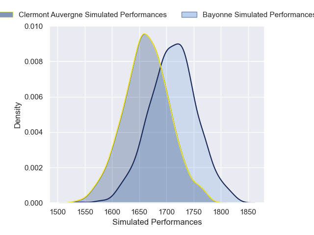
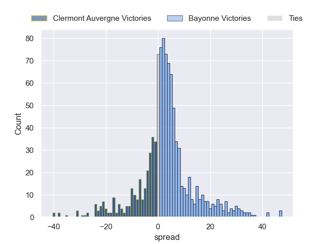
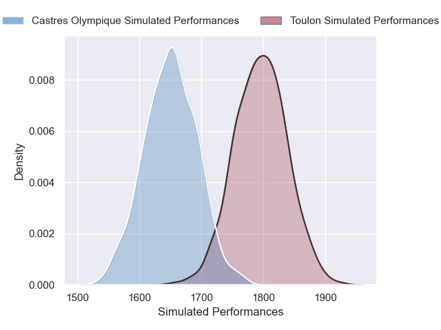
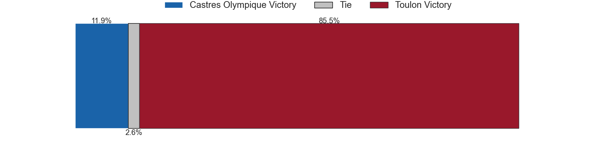
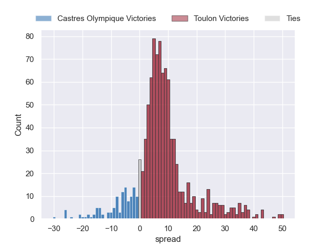

---  
title: "Top 14 Orange 24/25 Status"  
date: 2025-06-09 6:00:00 -0500  
categories: model review projection  
layout: article  
aside:  
    toc: true  
---
# Current Team Rankings

# Standings

## Current Standings

| Club                 |   Played |   Wins |   Point Differential |   Losing Bonus Points |   Try Bonus Points |   Competition Points |
|:---------------------|---------:|-------:|---------------------:|----------------------:|-------------------:|---------------------:|
| Stade Toulousain     |       26 |     18 |                  428 |                     5 |                 11 |                   90 |
| Bordeaux Begles      |       26 |     17 |                  150 |                     5 |                  5 |                   78 |
| Toulon               |       26 |     15 |                   85 |                     5 |                  7 |                   72 |
| Bayonne              |       26 |     15 |                   26 |                     4 |                  2 |                   68 |
| Clermont Auvergne    |       26 |     13 |                   79 |                     5 |                  6 |                   63 |
| Castres Olympique    |       26 |     14 |                  -29 |                     4 |                  3 |                   63 |
| La Rochelle          |       26 |     13 |                  -18 |                     3 |                  5 |                   62 |
| Pau                  |       26 |     12 |                  -63 |                     5 |                  4 |                   59 |
| Racing 92            |       26 |     12 |                   -7 |                     6 |                  1 |                   57 |
| Montpellier Herault  |       26 |     10 |                    5 |                     6 |                  3 |                   51 |
| Lyon                 |       26 |     11 |                  -47 |                     4 |                  2 |                   50 |
| Perpignan            |       26 |     11 |                 -203 |                     2 |                  2 |                   48 |
| Stade Francais Paris |       26 |     10 |                 -158 |                     3 |                  2 |                   45 |
| Vannes               |       26 |      8 |                 -248 |                     5 |                  1 |                   38 |

## Projected Remaining Table

| Club              |   Matches Remaining |   Wins |   Point Differential |   Losing Bonus Points |   Try Bonus Points |   Competition Points |
|:------------------|--------------------:|-------:|---------------------:|----------------------:|-------------------:|---------------------:|
| Toulon            |                   1 |    0.9 |              7.43054 |                   0.1 |                0.1 |                  3.6 |
| Bayonne           |                   1 |    0.7 |              2.70354 |                   0.2 |                0   |                  3   |
| Clermont Auvergne |                   1 |    0.3 |             -2.70354 |                   0.4 |                0.1 |                  1.8 |
| Castres Olympique |                   1 |    0.1 |             -7.43054 |                   0.3 |                0   |                  0.8 |

## Projected Total Table

| Club                 |   Total Matches |   Wins |   Point Differential |   Losing Bonus Points |   Try Bonus Points |   Competition Points |
|:---------------------|----------------:|-------:|---------------------:|----------------------:|-------------------:|---------------------:|
| Stade Toulousain     |              26 |   18   |             428      |                   5   |               11   |                 90   |
| Bordeaux Begles      |              26 |   17   |             150      |                   5   |                5   |                 78   |
| Toulon               |              27 |   15.9 |              92.4305 |                   5.1 |                7.1 |                 75.6 |
| Bayonne              |              27 |   15.7 |              28.7035 |                   4.2 |                2   |                 71   |
| Clermont Auvergne    |              27 |   13.3 |              76.2965 |                   5.4 |                6.1 |                 64.8 |
| Castres Olympique    |              27 |   14.1 |             -36.4305 |                   4.3 |                3   |                 63.8 |
| La Rochelle          |              26 |   13   |             -18      |                   3   |                5   |                 62   |
| Pau                  |              26 |   12   |             -63      |                   5   |                4   |                 59   |
| Racing 92            |              26 |   12   |              -7      |                   6   |                1   |                 57   |
| Montpellier Herault  |              26 |   10   |               5      |                   6   |                3   |                 51   |
| Lyon                 |              26 |   11   |             -47      |                   4   |                2   |                 50   |
| Perpignan            |              26 |   11   |            -203      |                   2   |                2   |                 48   |
| Stade Francais Paris |              26 |   10   |            -158      |                   3   |                2   |                 45   |
| Vannes               |              26 |    8   |            -248      |                   5   |                1   |                 38   |

# Completed Match Review

| Model | Percent Correct Predictions | Spread Error |
| ------ | ------ | ------ |
| Club Level | 73.1% | 10.8 |
| Player Level: Lineup | 75.5% | 12.4 |
| Player Level: Minutes | 75.5% | 13.4 |

# Future Predictions

## Week 27

### Bayonne V Clermont Auvergne on 2025/06/13

Average Margin: Bayonne by 2.7

Average Scoreline: 35-33

### Toulon V Castres Olympique on 2025/06/14

Average Margin: Toulon by 7.4

Average Scoreline: 29-21

