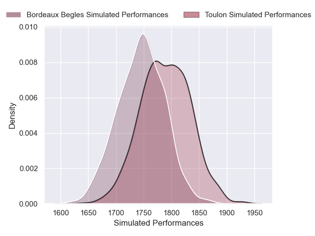
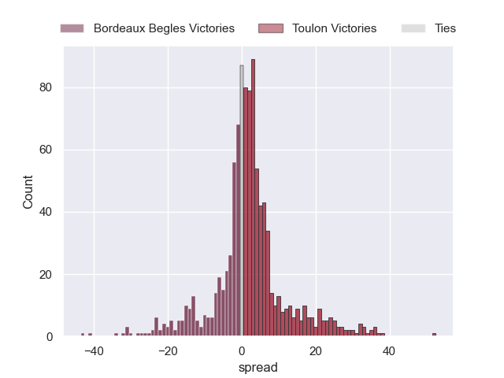
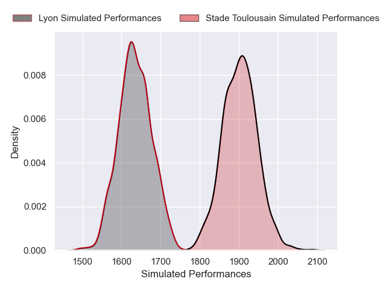
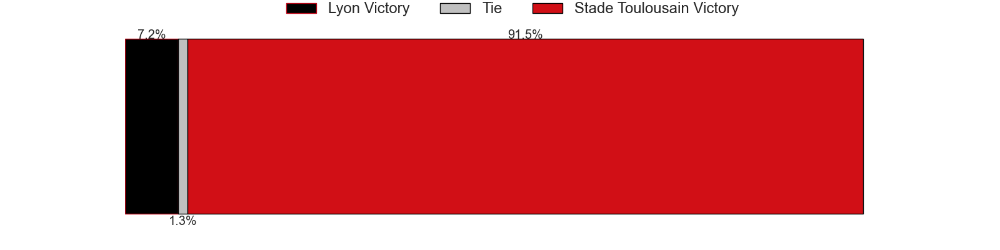
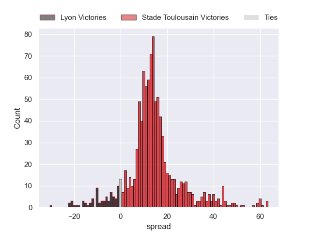

---  
title: "Top 14 Orange 24/25 Status"  
date: 2025-05-30 6:00:00 -0500  
categories: model review projection  
layout: article  
aside:  
    toc: true  
---
# Current Team Rankings

# Standings

## Current Standings

| Club                 |   Played |   Wins |   Point Differential |   Losing Bonus Points |   Try Bonus Points |   Competition Points |
|:---------------------|---------:|-------:|---------------------:|----------------------:|-------------------:|---------------------:|
| Stade Toulousain     |       24 |     17 |                  391 |                     4 |                 10 |                   84 |
| Bordeaux Begles      |       24 |     15 |                  114 |                     5 |                  4 |                   69 |
| Toulon               |       24 |     14 |                   65 |                     5 |                  7 |                   68 |
| Bayonne              |       24 |     14 |                   20 |                     4 |                  2 |                   64 |
| Castres Olympique    |       24 |     13 |                  -51 |                     4 |                  2 |                   58 |
| La Rochelle          |       24 |     12 |                  -27 |                     3 |                  4 |                   57 |
| Racing 92            |       25 |     12 |                   52 |                     6 |                nan |                   55 |
| Clermont Auvergne    |       24 |     11 |                   23 |                     5 |                  5 |                   54 |
| Montpellier Herault  |       25 |     11 |                  -25 |                     5 |                nan |                   52 |
| Pau                  |       25 |     11 |                 -167 |                     4 |                nan |                   51 |
| Lyon                 |       24 |     11 |                  -35 |                     4 |                  2 |                   50 |
| Perpignan            |       24 |     10 |                 -140 |                     3 |                  2 |                   45 |
| Vannes               |       25 |      8 |                  -88 |                     6 |                nan |                   41 |
| Stade Francais Paris |       24 |      9 |                 -132 |                     3 |                  2 |                   41 |

## Projected Remaining Table

| Club                 |   Matches Remaining |   Wins |   Point Differential |   Losing Bonus Points |   Try Bonus Points |   Competition Points |
|:---------------------|--------------------:|-------:|---------------------:|----------------------:|-------------------:|---------------------:|
| Stade Toulousain     |                   2 |    1.8 |            24.6095   |                   0.1 |                1   |                  8.3 |
| La Rochelle          |                   2 |    1.4 |            10.4651   |                   0.3 |                0.5 |                  6.5 |
| Bordeaux Begles      |                   2 |    1.3 |            11.1279   |                   0.4 |                0.5 |                  6   |
| Clermont Auvergne    |                   2 |    1.1 |             4.29936  |                   0.5 |                0.3 |                  5.3 |
| Castres Olympique    |                   2 |    1.1 |             2.41574  |                   0.5 |                0.2 |                  5.3 |
| Toulon               |                   2 |    1.1 |             1.3944   |                   0.5 |                0.2 |                  5.2 |
| Racing 92            |                   2 |    1   |             0.687635 |                   0.5 |                0.2 |                  4.9 |
| Montpellier Herault  |                   2 |    1   |            -0.155787 |                   0.5 |                0.2 |                  4.7 |
| Pau                  |                   2 |    0.9 |            -1.73493  |                   0.7 |                0.2 |                  4.4 |
| Bayonne              |                   2 |    0.8 |            -3.00281  |                   0.7 |                0.1 |                  4   |
| Stade Francais Paris |                   2 |    0.7 |            -6.34505  |                   0.5 |                0.1 |                  3.5 |
| Lyon                 |                   2 |    0.8 |           -11.5557   |                   0.2 |                0.1 |                  3.4 |
| Vannes               |                   2 |    0.7 |           -11.6695   |                   0.3 |                0.1 |                  3.1 |
| Perpignan            |                   2 |    0.2 |           -20.536    |                   0.2 |                0   |                  1.2 |

## Projected Total Table

| Club                 |   Total Matches |   Wins |   Point Differential |   Losing Bonus Points |   Try Bonus Points |   Competition Points |
|:---------------------|----------------:|-------:|---------------------:|----------------------:|-------------------:|---------------------:|
| Stade Toulousain     |              26 |   18.8 |             415.61   |                   4.1 |               11   |                 92.3 |
| Bordeaux Begles      |              26 |   16.3 |             125.128  |                   5.4 |                4.5 |                 75   |
| Toulon               |              26 |   15.1 |              66.3944 |                   5.5 |                7.2 |                 73.2 |
| Bayonne              |              26 |   14.8 |              16.9972 |                   4.7 |                2.1 |                 68   |
| La Rochelle          |              26 |   13.4 |             -16.5349 |                   3.3 |                4.5 |                 63.5 |
| Castres Olympique    |              26 |   14.1 |             -48.5843 |                   4.5 |                2.2 |                 63.3 |
| Racing 92            |              27 |   13   |              52.6876 |                   6.5 |                0.2 |                 59.9 |
| Clermont Auvergne    |              26 |   12.1 |              27.2994 |                   5.5 |                5.3 |                 59.3 |
| Montpellier Herault  |              27 |   12   |             -25.1558 |                   5.5 |                0.2 |                 56.7 |
| Pau                  |              27 |   11.9 |            -168.735  |                   4.7 |                0.2 |                 55.4 |
| Lyon                 |              26 |   11.8 |             -46.5557 |                   4.2 |                2.1 |                 53.4 |
| Perpignan            |              26 |   10.2 |            -160.536  |                   3.2 |                2   |                 46.2 |
| Stade Francais Paris |              26 |    9.7 |            -138.345  |                   3.5 |                2.1 |                 44.5 |
| Vannes               |              27 |    8.7 |             -99.6695 |                   6.3 |                0.1 |                 44.1 |

# Completed Match Review

| Model | Percent Correct Predictions | Spread Error |
| ------ | ------ | ------ |
| Club Level | 74.7% | 11.2 |
| Player Level: Lineup | 75.8% | 14.4 |
| Player Level: Minutes | 72.6% | 14.9 |

# Future Predictions

## Week 26

### Racing 92 V Montpellier Herault on 2025/05/31

Average Margin: Racing 92 by 3.5

Average Scoreline: 31-27

### Vannes V Pau on 2025/05/31

Average Margin: Vannes by 1.5

Average Scoreline: 31-30

### La Rochelle V Perpignan on 2025/05/31

Average Margin: La Rochelle by 10.2

Average Scoreline: 31-20

### Castres Olympique V Bayonne on 2025/05/31

Average Margin: Castres Olympique by 3.7

Average Scoreline: 31-27

### Clermont Auvergne V Stade Francais Paris on 2025/05/31

Average Margin: Clermont Auvergne by 7.6

Average Scoreline: 32-24

### Toulon V Bordeaux Begles on 2025/06/01

Average Margin: Toulon by 2.1

Average Scoreline: 28-26

### Stade Toulousain V Lyon on 2025/06/01

Average Margin: Stade Toulousain by 14.3

Average Scoreline: 36-22

## Week 27

### Bayonne V Toulon on 2025/06/07

Average Margin: Bayonne by 0.7

Average Scoreline: 30-29

### Bordeaux Begles V Vannes on 2025/06/07

Average Margin: Bordeaux Begles by 13.2

Average Scoreline: 34-21

### Montpellier Herault V Clermont Auvergne on 2025/06/07

Average Margin: Montpellier Herault by 3.3

Average Scoreline: 31-28

### Perpignan V Stade Toulousain on 2025/06/07

Average Margin: Stade Toulousain by 10.3

Average Scoreline: 31-20

### Pau V La Rochelle on 2025/06/07

Average Margin: La Rochelle by 0.2

Average Scoreline: 31-30

### Stade Francais Paris V Castres Olympique on 2025/06/07

Average Margin: Stade Francais Paris by 1.3

Average Scoreline: 29-27

### Lyon V Racing 92 on 2025/06/07

Average Margin: Lyon by 2.8

Average Scoreline: 34-31

