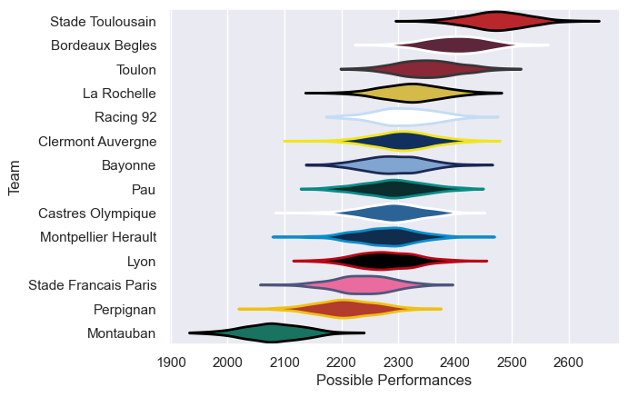

---  
title: "Top 14 Orange 25/26 Status"  
date: 2025-07-18 6:00:00 -0500  
categories: model review projection  
layout: article  
aside:  
    toc: true  
---
# Current Team Rankings

# Standings

## Projected Remaining Table

| Club                 |   To Play |   Projected Wins |   Projected Differential |   Projected Losing Bonus Points | Projected Try Bonus Points   |   Projected Competition Points |
|:---------------------|----------:|-----------------:|-------------------------:|--------------------------------:|:-----------------------------|-------------------------------:|
| Stade Toulousain     |        26 |           15.835 |                   97.935 |                           5.322 |                              |                         70.794 |
| Bordeaux Begles      |        26 |           14.975 |                   66.743 |                           5.497 |                              |                         67.561 |
| Toulon               |        26 |           13.752 |                   34.881 |                           5.895 |                              |                         63.077 |
| La Rochelle          |        26 |           13.216 |                   21.892 |                           6.139 |                              |                         61.149 |
| Clermont Auvergne    |        26 |           12.744 |                   12.126 |                           6.332 |                              |                         59.516 |
| Bayonne              |        26 |           12.467 |                    3.696 |                           6.361 |                              |                         58.567 |
| Castres Olympique    |        26 |           12.419 |                   -5.471 |                           6.272 |                              |                         58.054 |
| Racing 92            |        26 |           12.27  |                   -4.144 |                           6.56  |                              |                         57.96  |
| Pau                  |        26 |           12.325 |                   -3.625 |                           6.237 |                              |                         57.877 |
| Montpellier Herault  |        26 |           12.067 |                  -10.442 |                           6.257 |                              |                         56.747 |
| Lyon                 |        26 |           11.97  |                  -13.213 |                           6.321 |                              |                         56.435 |
| Stade Francais Paris |        26 |           10.889 |                  -38.557 |                           6.515 |                              |                         52.447 |
| Perpignan            |        26 |           10.871 |                  -46.754 |                           6.302 |                              |                         51.908 |
| Montauban            |        26 |            8.46  |                 -115.067 |                           6.331 |                              |                         42.249 |

## Projected Total Table

| Club                 |   Played |   Wins |   Point Differential |   Losing Bonus Points | Try Bonus Points   |   Competition Points |
|:---------------------|---------:|-------:|---------------------:|----------------------:|:-------------------|---------------------:|
| Stade Toulousain     |       26 | 15.835 |               97.935 |                 5.322 |                    |               70.794 |
| Bordeaux Begles      |       26 | 14.975 |               66.743 |                 5.497 |                    |               67.561 |
| Toulon               |       26 | 13.752 |               34.881 |                 5.895 |                    |               63.077 |
| La Rochelle          |       26 | 13.216 |               21.892 |                 6.139 |                    |               61.149 |
| Clermont Auvergne    |       26 | 12.744 |               12.126 |                 6.332 |                    |               59.516 |
| Bayonne              |       26 | 12.467 |                3.696 |                 6.361 |                    |               58.567 |
| Castres Olympique    |       26 | 12.419 |               -5.471 |                 6.272 |                    |               58.054 |
| Racing 92            |       26 | 12.27  |               -4.144 |                 6.56  |                    |               57.96  |
| Pau                  |       26 | 12.325 |               -3.625 |                 6.237 |                    |               57.877 |
| Montpellier Herault  |       26 | 12.067 |              -10.442 |                 6.257 |                    |               56.747 |
| Lyon                 |       26 | 11.97  |              -13.213 |                 6.321 |                    |               56.435 |
| Stade Francais Paris |       26 | 10.889 |              -38.557 |                 6.515 |                    |               52.447 |
| Perpignan            |       26 | 10.871 |              -46.754 |                 6.302 |                    |               51.908 |
| Montauban            |       26 |  8.46  |             -115.067 |                 6.331 |                    |               42.249 |

# Future Predictions

## Week 1

### Stade Francais Paris V Montauban on 2025/09/06

Average Margin: Stade Francais Paris by 7.2

### Clermont Auvergne V Stade Toulousain on 2025/09/06

Average Margin: Stade Toulousain by 0.4

### Perpignan V Bayonne on 2025/09/06

Average Margin: Perpignan by 1.6

### Castres Olympique V Pau on 2025/09/06

Average Margin: Castres Olympique by 3.0

### Bordeaux Begles V La Rochelle on 2025/09/06

Average Margin: Bordeaux Begles by 5.3

### Lyon V Racing 92 on 2025/09/06

Average Margin: Lyon by 2.4

### Montpellier Herault V Toulon on 2025/09/06

Average Margin: Montpellier Herault by 2.0

## Week 2

### La Rochelle V Clermont Auvergne on 2025/09/13

Average Margin: La Rochelle by 4.1

### Bayonne V Montpellier Herault on 2025/09/13

Average Margin: Bayonne by 4.3

### Pau V Stade Francais Paris on 2025/09/13

Average Margin: Pau by 5.0

### Stade Toulousain V Perpignan on 2025/09/13

Average Margin: Stade Toulousain by 10.7

### Racing 92 V Bordeaux Begles on 2025/09/13

Average Margin: Bordeaux Begles by 0.3

### Toulon V Castres Olympique on 2025/09/13

Average Margin: Toulon by 5.9

### Montauban V Lyon on 2025/09/13

Average Margin: Lyon by 1.0

## Week 3

### Lyon V Stade Francais Paris on 2025/09/20

Average Margin: Lyon by 4.4

### Clermont Auvergne V Pau on 2025/09/20

Average Margin: Clermont Auvergne by 3.8

### Toulon V La Rochelle on 2025/09/20

Average Margin: Toulon by 4.8

### Perpignan V Racing 92 on 2025/09/20

Average Margin: Perpignan by 1.4

### Castres Olympique V Bayonne on 2025/09/20

Average Margin: Castres Olympique by 2.7

### Bordeaux Begles V Montauban on 2025/09/20

Average Margin: Bordeaux Begles by 12.2

### Montpellier Herault V Stade Toulousain on 2025/09/20

Average Margin: Stade Toulousain by 1.3

## Week 4

### Bayonne V Toulon on 2025/09/27

Average Margin: Bayonne by 2.1

### Stade Francais Paris V Bordeaux Begles on 2025/09/27

Average Margin: Bordeaux Begles by 1.3

### La Rochelle V Perpignan on 2025/09/27

Average Margin: La Rochelle by 6.8

### Racing 92 V Clermont Auvergne on 2025/09/27

Average Margin: Racing 92 by 2.8

### Montauban V Montpellier Herault on 2025/09/27

Average Margin: Montpellier Herault by 1.8

### Stade Toulousain V Castres Olympique on 2025/09/27

Average Margin: Stade Toulousain by 8.3

### Pau V Lyon on 2025/09/27

Average Margin: Pau by 3.5

## Week 5

### Clermont Auvergne V Montauban on 2025/10/04

Average Margin: Clermont Auvergne by 9.3

### Perpignan V Stade Francais Paris on 2025/10/04

Average Margin: Perpignan by 3.5

### Castres Olympique V Racing 92 on 2025/10/04

Average Margin: Castres Olympique by 2.9

### Bayonne V Stade Toulousain on 2025/10/04

Average Margin: Stade Toulousain by 1.0

### Toulon V Pau on 2025/10/04

Average Margin: Toulon by 5.2

### Bordeaux Begles V Lyon on 2025/10/04

Average Margin: Bordeaux Begles by 7.0

### Montpellier Herault V La Rochelle on 2025/10/04

Average Margin: Montpellier Herault by 2.8

## Week 6

### Pau V Bayonne on 2025/10/11

Average Margin: Pau by 3.3

### Lyon V Perpignan on 2025/10/11

Average Margin: Lyon by 5.2

### Stade Toulousain V Bordeaux Begles on 2025/10/11

Average Margin: Stade Toulousain by 5.3

### Clermont Auvergne V Toulon on 2025/10/11

Average Margin: Clermont Auvergne by 2.4

### Stade Francais Paris V La Rochelle on 2025/10/11

Average Margin: Stade Francais Paris by 1.0

### Racing 92 V Montpellier Herault on 2025/10/11

Average Margin: Racing 92 by 3.0

### Montauban V Castres Olympique on 2025/10/11

Average Margin: Castres Olympique by 1.8

## Week 7

### Perpignan V Bordeaux Begles on 2025/10/18

Average Margin: Bordeaux Begles by 1.2

### Castres Olympique V Stade Francais Paris on 2025/10/18

Average Margin: Castres Olympique by 5.1

### Montpellier Herault V Lyon on 2025/10/18

Average Margin: Montpellier Herault by 4.3

### Bayonne V Clermont Auvergne on 2025/10/18

Average Margin: Bayonne by 3.5

### Toulon V Racing 92 on 2025/10/18

Average Margin: Toulon by 4.9

### Pau V Stade Toulousain on 2025/10/18

Average Margin: Stade Toulousain by 0.8

### La Rochelle V Montauban on 2025/10/18

Average Margin: La Rochelle by 9.4

## Week 8

### Stade Francais Paris V Montpellier Herault on 2025/10/25

Average Margin: Stade Francais Paris by 1.9

### Racing 92 V Pau on 2025/10/25

Average Margin: Racing 92 by 3.3

### Lyon V La Rochelle on 2025/10/25

Average Margin: Lyon by 1.8

### Bordeaux Begles V Bayonne on 2025/10/25

Average Margin: Bordeaux Begles by 6.0

### Montauban V Perpignan on 2025/10/25

Average Margin: Montauban by 0.3

### Clermont Auvergne V Castres Olympique on 2025/10/25

Average Margin: Clermont Auvergne by 4.4

### Stade Toulousain V Toulon on 2025/10/25

Average Margin: Stade Toulousain by 6.6

## Week 9

### Toulon V Lyon on 2025/11/01

Average Margin: Toulon by 6.1

### Bayonne V Montauban on 2025/11/01

Average Margin: Bayonne by 8.6

### Montpellier Herault V Clermont Auvergne on 2025/11/01

Average Margin: Montpellier Herault by 3.0

### La Rochelle V Racing 92 on 2025/11/01

Average Margin: La Rochelle by 3.8

### Pau V Perpignan on 2025/11/01

Average Margin: Pau by 5.3

### Castres Olympique V Bordeaux Begles on 2025/11/01

Average Margin: Bordeaux Begles by 0.2

### Stade Toulousain V Stade Francais Paris on 2025/11/01

Average Margin: Stade Toulousain by 9.1

## Week 10

### Lyon V Clermont Auvergne on 2025/11/22

Average Margin: Lyon by 2.3

### Montauban V Stade Toulousain on 2025/11/22

Average Margin: Stade Toulousain by 4.5

### Bordeaux Begles V Pau on 2025/11/22

Average Margin: Bordeaux Begles by 6.6

### La Rochelle V Castres Olympique on 2025/11/22

Average Margin: La Rochelle by 5.0

### Perpignan V Montpellier Herault on 2025/11/22

Average Margin: Perpignan by 2.4

### Stade Francais Paris V Toulon on 2025/11/22

Average Margin: Stade Francais Paris by 0.3

### Racing 92 V Bayonne on 2025/11/22

Average Margin: Racing 92 by 2.7

## Week 11

### Bayonne V Lyon on 2025/11/29

Average Margin: Bayonne by 4.5

### Castres Olympique V Perpignan on 2025/11/29

Average Margin: Castres Olympique by 5.1

### Pau V La Rochelle on 2025/11/29

Average Margin: Pau by 2.4

### Clermont Auvergne V Stade Francais Paris on 2025/11/29

Average Margin: Clermont Auvergne by 5.4

### Stade Toulousain V Racing 92 on 2025/11/29

Average Margin: Stade Toulousain by 7.3

### Montpellier Herault V Bordeaux Begles on 2025/11/29

Average Margin: Montpellier Herault by 1.2

### Toulon V Montauban on 2025/11/29

Average Margin: Toulon by 9.3

## Week 12

### Montpellier Herault V Castres Olympique on 2025/12/20

Average Margin: Montpellier Herault by 3.1

### Montauban V Pau on 2025/12/20

Average Margin: Pau by 0.7

### Perpignan V Clermont Auvergne on 2025/12/20

Average Margin: Perpignan by 1.8

### Lyon V Stade Toulousain on 2025/12/20

Average Margin: Stade Toulousain by 0.2

### Stade Francais Paris V Racing 92 on 2025/12/20

Average Margin: Stade Francais Paris by 1.5

### La Rochelle V Bayonne on 2025/12/20

Average Margin: La Rochelle by 3.7

### Bordeaux Begles V Toulon on 2025/12/20

Average Margin: Bordeaux Begles by 4.3

## Week 13

### Bayonne V Stade Francais Paris on 2025/12/27

Average Margin: Bayonne by 4.0

### Castres Olympique V Lyon on 2025/12/27

Average Margin: Castres Olympique by 3.2

### Clermont Auvergne V Bordeaux Begles on 2025/12/27

Average Margin: Clermont Auvergne by 1.6

### Stade Toulousain V La Rochelle on 2025/12/27

Average Margin: Stade Toulousain by 6.6

### Toulon V Perpignan on 2025/12/27

Average Margin: Toulon by 6.2

### Pau V Montpellier Herault on 2025/12/27

Average Margin: Pau by 4.0

### Racing 92 V Montauban on 2025/12/27

Average Margin: Racing 92 by 7.0

## Week 14

### Lyon V Pau on 2026/01/03

Average Margin: Lyon by 3.0

### Bordeaux Begles V Racing 92 on 2026/01/03

Average Margin: Bordeaux Begles by 5.4

### Montpellier Herault V Bayonne on 2026/01/03

Average Margin: Montpellier Herault by 2.4

### Perpignan V Stade Toulousain on 2026/01/03

Average Margin: Stade Toulousain by 0.8

### La Rochelle V Toulon on 2026/01/03

Average Margin: La Rochelle by 3.4

### Montauban V Clermont Auvergne on 2026/01/03

Average Margin: Clermont Auvergne by 0.9

### Stade Francais Paris V Castres Olympique on 2026/01/03

Average Margin: Stade Francais Paris by 2.1

## Week 15

### Bordeaux Begles V Stade Francais Paris on 2026/01/24

Average Margin: Bordeaux Begles by 7.0

### Perpignan V Montauban on 2026/01/24

Average Margin: Perpignan by 5.8

### Stade Toulousain V Pau on 2026/01/24

Average Margin: Stade Toulousain by 6.9

### Racing 92 V Lyon on 2026/01/24

Average Margin: Racing 92 by 3.7

### Toulon V Montpellier Herault on 2026/01/24

Average Margin: Toulon by 5.4

### Bayonne V Castres Olympique on 2026/01/24

Average Margin: Bayonne by 3.2

### Clermont Auvergne V La Rochelle on 2026/01/24

Average Margin: Clermont Auvergne by 3.3

## Week 16

### Montauban V Bordeaux Begles on 2026/01/31

Average Margin: Bordeaux Begles by 2.5

### La Rochelle V Lyon on 2026/01/31

Average Margin: La Rochelle by 5.0

### Castres Olympique V Clermont Auvergne on 2026/01/31

Average Margin: Castres Olympique by 2.8

### Montpellier Herault V Stade Francais Paris on 2026/01/31

Average Margin: Montpellier Herault by 4.2

### Stade Toulousain V Bayonne on 2026/01/31

Average Margin: Stade Toulousain by 6.6

### Pau V Toulon on 2026/01/31

Average Margin: Pau by 2.4

### Racing 92 V Perpignan on 2026/01/31

Average Margin: Racing 92 by 4.8

## Week 17

### Perpignan V Pau on 2026/02/14

Average Margin: Perpignan by 2.5

### Lyon V Montauban on 2026/02/14

Average Margin: Lyon by 6.1

### Stade Francais Paris V Stade Toulousain on 2026/02/14

Average Margin: Stade Toulousain by 0.5

### Toulon V Clermont Auvergne on 2026/02/14

Average Margin: Toulon by 4.3

### La Rochelle V Montpellier Herault on 2026/02/14

Average Margin: La Rochelle by 5.3

### Bayonne V Racing 92 on 2026/02/14

Average Margin: Bayonne by 3.7

### Bordeaux Begles V Castres Olympique on 2026/02/14

Average Margin: Bordeaux Begles by 5.1

## Week 18

### Stade Toulousain V Montauban on 2026/02/28

Average Margin: Stade Toulousain by 9.3

### Castres Olympique V La Rochelle on 2026/02/28

Average Margin: Castres Olympique by 2.5

### Pau V Bordeaux Begles on 2026/02/28

Average Margin: Pau by 1.4

### Montpellier Herault V Racing 92 on 2026/02/28

Average Margin: Montpellier Herault by 3.0

### Lyon V Toulon on 2026/02/28

Average Margin: Lyon by 2.4

### Clermont Auvergne V Bayonne on 2026/02/28

Average Margin: Clermont Auvergne by 4.2

### Stade Francais Paris V Perpignan on 2026/02/28

Average Margin: Stade Francais Paris by 3.8

## Week 19

### La Rochelle V Pau on 2026/03/21

Average Margin: La Rochelle by 4.1

### Perpignan V Lyon on 2026/03/21

Average Margin: Perpignan by 2.5

### Bordeaux Begles V Stade Toulousain on 2026/03/21

Average Margin: Bordeaux Begles by 2.7

### Racing 92 V Castres Olympique on 2026/03/21

Average Margin: Racing 92 by 2.5

### Toulon V Stade Francais Paris on 2026/03/21

Average Margin: Toulon by 5.6

### Montauban V Bayonne on 2026/03/21

Average Margin: Montauban by 0.1

### Clermont Auvergne V Montpellier Herault on 2026/03/21

Average Margin: Clermont Auvergne by 4.9

## Week 20

### Perpignan V Toulon on 2026/03/28

Average Margin: Perpignan by 1.1

### Castres Olympique V Montauban on 2026/03/28

Average Margin: Castres Olympique by 6.4

### Stade Toulousain V Montpellier Herault on 2026/03/28

Average Margin: Stade Toulousain by 7.0

### Stade Francais Paris V Clermont Auvergne on 2026/03/28

Average Margin: Stade Francais Paris by 1.6

### Lyon V Bordeaux Begles on 2026/03/28

Average Margin: Lyon by 1.3

### Pau V Racing 92 on 2026/03/28

Average Margin: Pau by 2.9

### Bayonne V La Rochelle on 2026/03/28

Average Margin: Bayonne by 2.6

## Week 21

### Racing 92 V Stade Francais Paris on 2026/04/18

Average Margin: Racing 92 by 3.6

### Montpellier Herault V Perpignan on 2026/04/18

Average Margin: Montpellier Herault by 5.0

### La Rochelle V Bordeaux Begles on 2026/04/18

Average Margin: La Rochelle by 2.5

### Montauban V Toulon on 2026/04/18

Average Margin: Toulon by 0.5

### Castres Olympique V Stade Toulousain on 2026/04/18

Average Margin: Castres Olympique by 0.7

### Bayonne V Pau on 2026/04/18

Average Margin: Bayonne by 3.6

### Clermont Auvergne V Lyon on 2026/04/18

Average Margin: Clermont Auvergne by 3.8

## Week 22

### Bordeaux Begles V Montpellier Herault on 2026/04/25

Average Margin: Bordeaux Begles by 5.7

### Perpignan V La Rochelle on 2026/04/25

Average Margin: Perpignan by 1.5

### Stade Toulousain V Clermont Auvergne on 2026/04/25

Average Margin: Stade Toulousain by 6.4

### Toulon V Bayonne on 2026/04/25

Average Margin: Toulon by 4.2

### Lyon V Castres Olympique on 2026/04/25

Average Margin: Lyon by 3.3

### Montauban V Racing 92 on 2026/04/25

Average Margin: Montauban by 0.5

### Stade Francais Paris V Pau on 2026/04/25

Average Margin: Stade Francais Paris by 1.9

## Week 23

### Pau V Castres Olympique on 2026/05/09

Average Margin: Pau by 2.9

### Stade Francais Paris V Lyon on 2026/05/09

Average Margin: Stade Francais Paris by 2.4

### Clermont Auvergne V Perpignan on 2026/05/09

Average Margin: Clermont Auvergne by 6.0

### Montpellier Herault V Montauban on 2026/05/09

Average Margin: Montpellier Herault by 6.4

### Toulon V Stade Toulousain on 2026/05/09

Average Margin: Toulon by 2.1

### Bayonne V Bordeaux Begles on 2026/05/09

Average Margin: Bayonne by 1.7

### Racing 92 V La Rochelle on 2026/05/09

Average Margin: Racing 92 by 3.0

## Week 24

### Racing 92 V Toulon on 2026/05/16

Average Margin: Racing 92 by 2.0

### Bordeaux Begles V Perpignan on 2026/05/16

Average Margin: Bordeaux Begles by 6.9

### Castres Olympique V Montpellier Herault on 2026/05/16

Average Margin: Castres Olympique by 3.6

### Pau V Clermont Auvergne on 2026/05/16

Average Margin: Pau by 3.4

### La Rochelle V Stade Toulousain on 2026/05/16

Average Margin: La Rochelle by 1.9

### Montauban V Stade Francais Paris on 2026/05/16

Average Margin: Montauban by 1.0

### Lyon V Bayonne on 2026/05/16

Average Margin: Lyon by 2.5

## Week 25

### Montauban V La Rochelle on 2026/05/30

Average Margin: Montauban by 0.1

### Perpignan V Castres Olympique on 2026/05/30

Average Margin: Perpignan by 2.2

### Stade Toulousain V Lyon on 2026/05/30

Average Margin: Stade Toulousain by 6.3

### Toulon V Bordeaux Begles on 2026/05/30

Average Margin: Toulon by 2.6

### Stade Francais Paris V Bayonne on 2026/05/30

Average Margin: Stade Francais Paris by 2.2

### Clermont Auvergne V Racing 92 on 2026/05/30

Average Margin: Clermont Auvergne by 3.5

### Montpellier Herault V Pau on 2026/05/30

Average Margin: Montpellier Herault by 2.6

## Week 26

### Bayonne V Perpignan on 2026/06/06

Average Margin: Bayonne by 5.1

### La Rochelle V Stade Francais Paris on 2026/06/06

Average Margin: La Rochelle by 4.9

### Pau V Montauban on 2026/06/06

Average Margin: Pau by 6.3

### Castres Olympique V Toulon on 2026/06/06

Average Margin: Castres Olympique by 3.0

### Racing 92 V Stade Toulousain on 2026/06/06

Average Margin: Racing 92 by 0.7

### Bordeaux Begles V Clermont Auvergne on 2026/06/06

Average Margin: Bordeaux Begles by 4.8

### Lyon V Montpellier Herault on 2026/06/06

Average Margin: Lyon by 3.6

