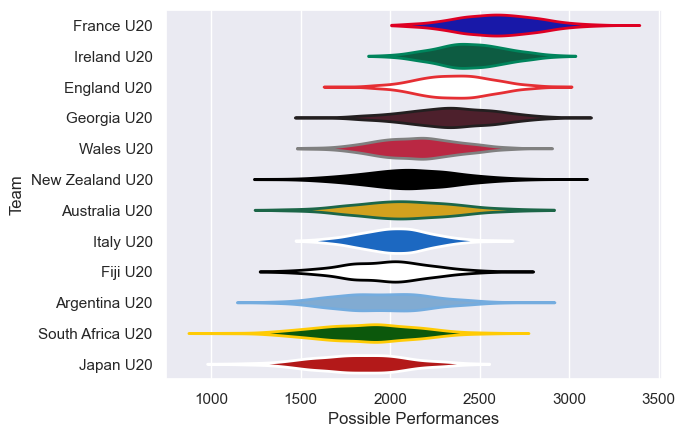

---  
title: "U20 Championship 2023 Status"  
date: 2025-07-28 6:00:00 -0500  
categories: model review projection  
layout: article  
aside:  
    toc: true  
---
# Current Team Rankings

# Standings

## Current Standings

| Club             |   Played |   Wins |   Point Differential |   Losing Bonus Points | Try Bonus Points   |   Competition Points |
|:-----------------|---------:|-------:|---------------------:|----------------------:|:-------------------|---------------------:|
| France U20       |        5 |      5 |                  165 |                     0 |                    |                   20 |
| Ireland U20      |        5 |      3 |                   23 |                     0 |                    |                   14 |
| Australia U20    |        5 |      3 |                   22 |                     0 |                    |                   14 |
| Argentina U20    |        5 |      3 |                   46 |                     0 |                    |                   12 |
| New Zealand U20  |        5 |      3 |                   38 |                     0 |                    |                   12 |
| South Africa U20 |        5 |      3 |                   -2 |                     0 |                    |                   12 |
| England U20      |        5 |      1 |                   18 |                     1 |                    |                    9 |
| Wales U20        |        5 |      2 |                   -8 |                     1 |                    |                    9 |
| Georgia U20      |        5 |      2 |                  -20 |                     0 |                    |                    8 |
| Italy U20        |        5 |      2 |                  -30 |                     0 |                    |                    8 |
| Fiji U20         |        5 |      1 |                  -81 |                     0 |                    |                    4 |
| Japan U20        |        5 |      0 |                 -171 |                     0 |                    |                    0 |

# Completed Match Review

| Model | Percent Correct Predictions | Spread Error |
| ------ | ------ | ------ |
| Club Level | 60.0% | 19.1 |
| Player Level: Lineup | nan% | nan |
| Player Level: Minutes | nan% | nan |

