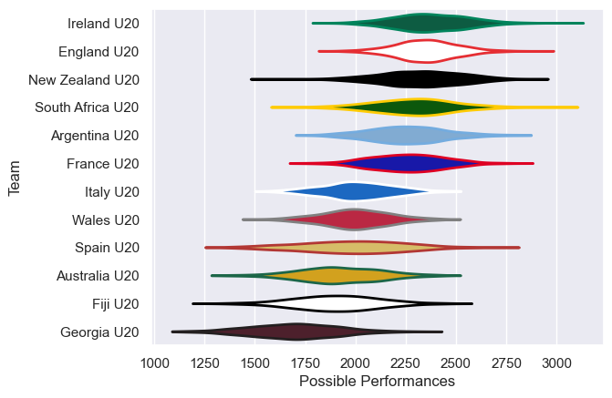

---  
title: "U20 Championship 2024 Status"  
date: 2025-07-28 6:00:00 -0500  
categories: model review projection  
layout: article  
aside:  
    toc: true  
---
# Current Team Rankings

# Standings

## Current Standings

| Club             |   Played |   Wins |   Point Differential |   Losing Bonus Points |   Try Bonus Points |   Competition Points |
|:-----------------|---------:|-------:|---------------------:|----------------------:|-------------------:|---------------------:|
| England U20      |        5 |      5 |                   80 |                     0 |                  2 |                   22 |
| New Zealand U20  |        5 |      4 |                   30 |                     0 |                  5 |                   21 |
| Argentina U20    |        5 |      4 |                   58 |                     0 |                  3 |                   19 |
| France U20       |        5 |      3 |                   70 |                     1 |                  3 |                   16 |
| Georgia U20      |        5 |      3 |                   -4 |                     1 |                  3 |                   16 |
| Australia U20    |        5 |      2 |                   18 |                     1 |                  2 |                   13 |
| Ireland U20      |        5 |      2 |                   21 |                     0 |                  2 |                   12 |
| South Africa U20 |        5 |      2 |                   32 |                     1 |                  2 |                   11 |
| Wales U20        |        5 |      1 |                  -27 |                     2 |                  4 |                   10 |
| Italy U20        |        5 |      2 |                  -44 |                     0 |                    |                    8 |
| Spain U20        |        5 |      1 |                  -98 |                     0 |                  1 |                    5 |
| Fiji U20         |        5 |      0 |                 -136 |                     2 |                  1 |                    3 |

# Completed Match Review

| Model | Percent Correct Predictions | Spread Error |
| ------ | ------ | ------ |
| Club Level | 66.7% | 14.8 |
| Player Level: Lineup | nan% | nan |
| Player Level: Minutes | nan% | nan |

