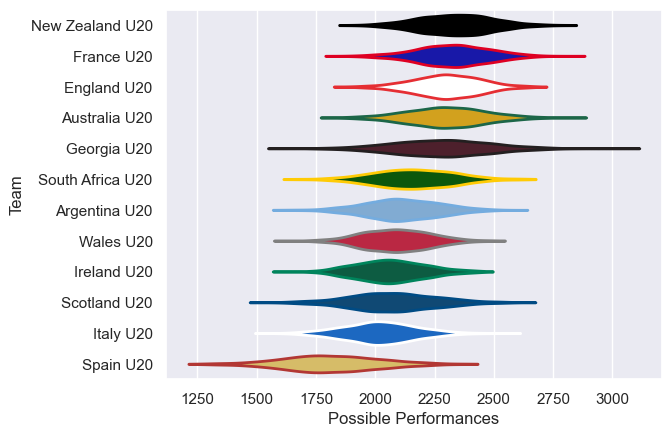

---  
title: "U20 Championship 2025 Status"  
date: 2025-06-26 6:00:00 -0500  
categories: model review projection  
layout: article  
aside:  
    toc: true  
---
# Current Team Rankings

# Standings

## Projected Remaining Table

| Club             |   To Play |   Projected Wins |   Projected Differential |   Projected Losing Bonus Points | Projected Try Bonus Points   |   Projected Competition Points |
|:-----------------|----------:|-----------------:|-------------------------:|--------------------------------:|:-----------------------------|-------------------------------:|
| New Zealand U20  |         4 |            2.563 |                   28.904 |                           0.61  |                              |                         11.136 |
| France U20       |         3 |            2.099 |                   32.616 |                           0.388 |                              |                          8.988 |
| England U20      |         3 |            1.957 |                   20.372 |                           0.436 |                              |                          8.482 |
| Italy U20        |         4 |            1.56  |                  -16.745 |                           0.799 |                              |                          7.339 |
| Australia U20    |         3 |            1.6   |                    8.279 |                           0.566 |                              |                          7.182 |
| Argentina U20    |         3 |            1.502 |                    4.024 |                           0.544 |                              |                          6.768 |
| Georgia U20      |         3 |            1.484 |                    1.061 |                           0.581 |                              |                          6.711 |
| Wales U20        |         3 |            1.357 |                   -3.969 |                           0.528 |                              |                          6.17  |
| South Africa U20 |         3 |            1.266 |                   -6.385 |                           0.574 |                              |                          5.87  |
| Ireland U20      |         3 |            1.157 |                  -13.22  |                           0.581 |                              |                          5.385 |
| Scotland U20     |         3 |            0.953 |                  -22.266 |                           0.528 |                              |                          4.57  |
| Spain U20        |         3 |            0.84  |                  -32.671 |                           0.537 |                              |                          4.071 |

## Projected Total Table

| Club             |   Played |   Wins |   Point Differential |   Losing Bonus Points | Try Bonus Points   |   Competition Points |
|:-----------------|---------:|-------:|---------------------:|----------------------:|:-------------------|---------------------:|
| New Zealand U20  |        4 |  2.563 |               28.904 |                 0.61  |                    |               11.136 |
| France U20       |        3 |  2.099 |               32.616 |                 0.388 |                    |                8.988 |
| England U20      |        3 |  1.957 |               20.372 |                 0.436 |                    |                8.482 |
| Italy U20        |        4 |  1.56  |              -16.745 |                 0.799 |                    |                7.339 |
| Australia U20    |        3 |  1.6   |                8.279 |                 0.566 |                    |                7.182 |
| Argentina U20    |        3 |  1.502 |                4.024 |                 0.544 |                    |                6.768 |
| Georgia U20      |        3 |  1.484 |                1.061 |                 0.581 |                    |                6.711 |
| Wales U20        |        3 |  1.357 |               -3.969 |                 0.528 |                    |                6.17  |
| South Africa U20 |        3 |  1.266 |               -6.385 |                 0.574 |                    |                5.87  |
| Ireland U20      |        3 |  1.157 |              -13.22  |                 0.581 |                    |                5.385 |
| Scotland U20     |        3 |  0.953 |              -22.266 |                 0.528 |                    |                4.57  |
| Spain U20        |        3 |  0.84  |              -32.671 |                 0.537 |                    |                4.071 |

# Future Predictions

## Week 1

### Argentina U20 V Wales U20 on 2025/06/29

Average Margin: Argentina U20 by 3.9

### New Zealand U20 V Italy U20 on 2025/06/29

Average Margin: New Zealand U20 by 12.0

### Australia U20 V South Africa U20 on 2025/06/29

Average Margin: Australia U20 by 6.5

### England U20 V Scotland U20 on 2025/06/29

Average Margin: England U20 by 10.4

### France U20 V Spain U20 on 2025/06/29

Average Margin: France U20 by 16.3

### Ireland U20 V Georgia U20 on 2025/06/29

Average Margin: Georgia U20 by 2.8

## Week 2

### Australia U20 V Scotland U20 on 2025/07/04

Average Margin: Australia U20 by 6.1

### England U20 V South Africa U20 on 2025/07/04

Average Margin: England U20 by 5.7

### France U20 V Wales U20 on 2025/07/04

Average Margin: France U20 by 7.7

### Italy U20 V Ireland U20 on 2025/07/04

Average Margin: Italy U20 by 1.4

### Italy U20 V New Zealand U20 on 2025/07/04

Average Margin: New Zealand U20 by 3.7

### New Zealand U20 V Georgia U20 on 2025/07/04

Average Margin: New Zealand U20 by 4.3

### Argentina U20 V Spain U20 on 2025/07/04

Average Margin: Argentina U20 by 8.7

## Week 3

### Italy U20 V Georgia U20 on 2025/07/09

Average Margin: Georgia U20 by 2.5

### France U20 V Argentina U20 on 2025/07/09

Average Margin: France U20 by 8.6

### England U20 V Australia U20 on 2025/07/09

Average Margin: England U20 by 4.3

### New Zealand U20 V Ireland U20 on 2025/07/09

Average Margin: New Zealand U20 by 9.0

### South Africa U20 V Scotland U20 on 2025/07/09

Average Margin: South Africa U20 by 5.8

### Wales U20 V Spain U20 on 2025/07/09

Average Margin: Wales U20 by 7.6

